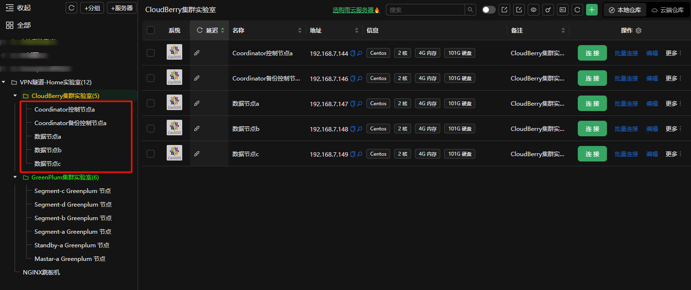
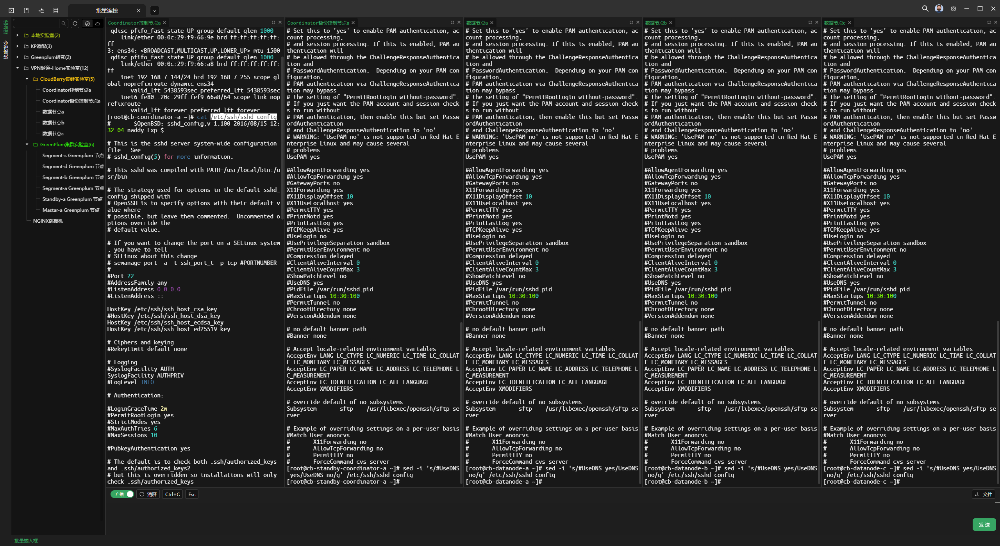

# 实验十二：主机规划and实验准备

> Author ：Heike07

[TOC]

## 整体介绍

> 引用来源：https://cloudberry.apache.org/blog/cloudberry-database-enters-the-apache-incubator

### 相关新闻

**Cloudberry 数据库进入 Apache 孵化器：分析和 AI 开源 MPP 数据库的新篇章**

On October 12th, 2024, the Cloudberry Database project was voted to enter the Apache Software Foundation Incubator[1](https://cloudberry.apache.org/blog/cloudberry-database-enters-the-apache-incubator#user-content-fn-1-347664), marking a significant milestone for the Cloudberry project and its community. On November 5th, 2024, the Cloudberry project repositories were transferred to the Apache Software Foundation. With this transition, Cloudberry has fully joined the incubator and begun its development under the Apache umbrella. Additionally, the Cloudberry Database is now proudly rebranded to Apache Cloudberry™️ (Incubating).


### 什么是Cloudberry

Cloudberry 由 Greenplum Database 的原始开发人员创建，是一款先进且成熟的开源大规模并行处理 (MPP) 数据库。它从 Pivotal Greenplum Database® 的开源版本发展而来，但具有较新的 PostgreSQL 内核和更高级的企业功能。Cloudberry 可以用作数据仓库，也可以用于大规模分析和 AI/ML 工作负载。


Greenplum 数据库已被各行各业的大量中小型团队和大型团队大规模采用，也位列[DB-Engines 网站](https://db-engines.com/en/ranking)Top50 热门数据库之列。然而，随着开源 Greenplum 数据库的归档和社区的彻底关闭，原开源 Greenplum 用户无法再免费获得安全或功能更新，这对他们的业务带来了潜在的挑战。

我们希望让 Cloudberry 成为原 Greenplum 开源版本的主要开源替代品。我们希望所有 Greenplum 的开源开发人员和用户都能迁移到 Cloudberry。

### 之前的故事

在进一步讨论之前，我们想回顾一下 Greenplum 数据库从闭源到开源（2015 年 10 月）再到闭源（2024 年 5 月）的历史：

- Greenplum 数据库的历史可以追溯到 2003 年，最初由一家名为 Greenplum Inc. 的公司基于大规模并行处理 (MPP) 架构和 PostgreSQL 技术开发。
- 2010年，Greenplum Inc.被EMC Corporation收购。
- 2012 年，EMC 和 VMware（EMC 的子公司）将其多项软件资产（包括 Greenplum Database）合并为一家名为 Pivotal Software, Inc. 的新公司。
- 2015年，Pivotal开源了Greenplum的核心引擎，并将其更名为Pivotal Greenplum Database®，成为第一个开源MPP数据仓库。Pivotal Greenplum Database®的开源核心被用来启动Apache HAWQ和Apache MADlib项目，而Greenplum本身仍然是一个单一供应商的开源项目。
- 2019 年，VMware 收购了 Pivotal Software。此次收购将 Pivotal Greenplum Database® 带回了 VMware。VMware 继续支持 Greenplum Database 的开发及其开源社区，并在随后的几年中提供了 VMware Tanzu Greenplum 作为商业产品。
- 2023 年 11 月，博通完成对 VMware 的收购，Greenplum 隶属于博通[2](https://cloudberry.apache.org/blog/cloudberry-database-enters-the-apache-incubator#user-content-fn-2-347664)。
- 2024 年 5 月，Greenplum 的几乎所有 GitHub 存储库均已存档并变为只读，Slack 工作区被删除（[https://greenplum.slack.com](https://greenplum.slack.com/)），`user`[3](https://cloudberry.apache.org/blog/cloudberry-database-enters-the-apache-incubator#user-content-fn-3-347664)和`dev`[4](https://cloudberry.apache.org/blog/cloudberry-database-enters-the-apache-incubator#user-content-fn-4-347664)社区电子邮件列表均已沉寂。这些都是由其最新所有者在没有任何公告的情况下完成的。

可以看到，Greenplum Database 所有权在过去的很多年里经历了多次变更，这引起了社区用户、开发者和生态系统合作伙伴的担忧。由于 Greenplum 由单一供应商控制，因此缺乏允许社区参与决策过程的开放治理模式。

Cloudberry 的建设者们意识到，Greenplum 数据库早已失去了创新和重大功能更新的动力。与新一代开源数据仓库和分析项目相比，Greenplum 的竞争力下降了。

Cloudberry 由最初的 Greenplum 开发人员于 2022 年推出，其源代码于 2023 年开放。当 Greenplum 突然转向闭源模式时，我们感到很惊讶，这相当引人注目。从那时起，我们决心继续我们的使命，重新团结最初的开源 Greenplum 开发人员和用户，以社区的方式塑造我们的项目。

Cloudberry 不仅仅是换了个品牌。它拥有美好的愿景，并带来了许多高级功能和亮点，包括更新的 PostgreSQL 内核、增强的安全性、端到端性能优化、支持 AI/ML 工作负载和流式传输、Lakehouse 集成等。我们的目标是让 Cloudberry 与 Greenplum 兼容，让用户能够像使用 Greenplum 一样使用 Cloudberry。

### 为什么选择Apache孵化器

加入 Apache 孵化器是 Cloudberry 迈出的重要一步，因为它为开源世界的协作、社区发展和创新打开了大门。Apache 孵化器为开源项目的治理、指导和管理提供了一个框架，确保项目的发展，同时符合 Apache Way——一种强调透明度和开放协作的社区驱动开发模式。

随着 Cloudberry 进入孵化器，我们比以往任何时候都更加致力于培育一个充满活力、多元化的开发者社区，并鼓励来自世界各地的贡献。Cloudberry 现在将有机会从经验丰富的 Apache 社区成员的指导中受益。我们希望 Cloudberry 能够从 ASF 孵化器毕业，并遵循 Apache 之道，成为一个成熟和成功的顶级 Apache 项目。

### 致谢

感谢 Cloudberry 社区的所有贡献者以及我们上游项目的贡献者，感谢他们的杰出贡献！感谢 Roman Shaposhnik 担任我们的冠军，感谢 Willem Jiang 和 Kent Yao 担任我们的导师。

### 功能对比

> 引用来源：https://cloudberry.apache.org/docs/cbdb-vs-gp-features/

Cloudberry 数据库与 Greenplum 100% 兼容，并提供您需要的所有 Greenplum 功能。

此外，Cloudberry Database还拥有一些Greenplum目前缺少或不支持的功能。更多详细信息如下。

#### 通用特征

信息

- 在下表中，✅表示支持，❌表示不支持。
- 下表中的功能比较基于Greenplum 7 Beta.3。

| 特征名称                            | Cloudberry 数据库 | 绿梅          |
| ----------------------------------- | ----------------- | ------------- |
| `EXPLAIN`（WAL）支持                | ✅                 | ❌             |
| 多量程                              | ✅                 | ❌             |
| B 树自下而上索引删除                | ✅                 | ❌             |
| GiST 的覆盖索引 ( `INCLUDE`)        | ✅                 | ✅（即将推出） |
| 范围`range_agg`类型聚合函数         | ✅                 | ❌             |
| `CREATE ACCESS METHOD`              | ✅                 | ✅（即将推出） |
| `TOAST`表格的 LZ4 压缩              | ✅                 | ❌             |
| JSONB 下标                          | ✅                 | ❌             |
| 配置复制槽的最大 WAL 保留           | ✅                 | ❌             |
| 验证备份完整性 ( `pg_verifybackup`) | ✅                 | ❌             |
| 客户端可以要求 SCRAM 通道绑定       | ✅                 | ❌             |
| 真空“紧急模式”                      | ✅                 | ❌             |
| 证书身份验证`postgres_fdw`          | ✅                 | ❌             |
| `UPSERT`                            | ✅                 | ✅（即将推出） |
| 复制自哪里                          | ✅                 | ❌             |
| VACUUM / ANALYZE 跳过锁定表         | ✅                 | ❌             |
| HASH 分区表                         | ✅                 | ❌             |
| CTE（搜索和循环）                   | ✅                 | ❌             |
| 过程 OUT 参数                       | ✅                 | ❌             |
| `CHECK`外部表的约束                 | ✅                 | ❌             |
| 超时参数`pg_terminate_backend`      | ✅                 | ❌             |
| 协调器自动故障转移                  | ✅                 | ❌             |
| Kubernetes 部署支持                 | ✅                 | ❌             |

#### 性能特征

| 特征名称                                   | Cloudberry 数据库 | 绿梅 |
| ------------------------------------------ | ----------------- | ---- |
| `REINDEX CONCURRENTLY`                     | ✅                 | ❌    |
| 聚合下推                                   | ✅                 | ❌    |
| `CREATE STATISTICS`-`OR`和`IN/ANY`统计数据 | ✅                 | ❌    |
| 增量排序                                   | ✅                 | ❌    |
| 窗口函数的增量排序                         | ✅                 | ❌    |
| 查询流水线                                 | ✅                 | ❌    |
| BRIN 索引（multi-minmax，bloom）           | ✅                 | ❌    |
| 查询并行性                                 | ✅                 | ❌    |
| 排序的缩写键                               | ✅                 | ❌    |
| 哈希索引 WAL 支持                          | ✅                 | ❌    |
| `postgres_fdw`聚合下推                     | ✅                 | ❌    |
| 添加列时无需重写整个表                     | ✅                 | ❌    |
| 连接运行时过滤器                           | ✅                 | ❌    |
| AppendOnly 表的索引扫描                    | ✅                 | ❌    |

#### 安全特征

| 特征名称                  | Cloudberry 数据库 | 绿梅 |
| ------------------------- | ----------------- | ---- |
| 透明数据加密 (TDE)        | ✅                 | ❌    |
| 受信任的扩展              | ✅                 | ❌    |
| 紧急RAM-SHA-256           | ✅                 | ❌    |
| GSSAPI 时加密 TCP/IP 连接 | ✅                 | ❌    |
| 行级安全策略              | ✅                 | ❌    |

---

可以看到cloudberry是很有发展前景的，因此我们选择此作为学习选型。

## 主机规划

| 主机名                   | IP地址        | 节点描述                 |
| ------------------------ | ------------- | ------------------------ |
| Cb-Coordinator-a         | 192.168.7.144 | Coordinator控制节点a     |
| Cb-Standby-Coordinator-a | 192.168.7.146 | Coordinator备份控制节点a |
| Cb-DataNode-a            | 192.168.7.147 | 数据节点a                |
| Cb-DataNode-b            | 192.168.7.148 | 数据节点b                |
| Cb-DataNode-c            | 192.168.7.149 | 数据节点c                |

虚拟机统一规规


虚拟机准备完成，开搞！



## 实验准备

首先我们需要把这几台机器连起来让他们知道彼此的存在，为后续免密做基础。

```powershell
# 主机名设置
[root@localhost ~]# hostnamectl set-hostname Cb-Standby-Coordinator-a

# hosts文件设置
[root@localhost ~]# tee << EOF >> /etc/hosts
> 192.168.7.144 Cb-Coordinator-a
> 192.168.7.146 Cb-Standby-Coordinator-a
> 192.168.7.147 Cb-DataNode-a
> 192.168.7.148 Cb-DataNode-b
> 192.168.7.149 Cb-DataNode-c
> EOF
[root@localhost ~]# cat /etc/hosts
127.0.0.1   localhost localhost.localdomain localhost4 localhost4.localdomain4
::1         localhost localhost.localdomain localhost6 localhost6.localdomain6
192.168.7.144 Cb-Coordinator-a
192.168.7.146 Cb-Standby-Coordinator-a
192.168.7.147 Cb-DataNode-a
192.168.7.148 Cb-DataNode-b
192.168.7.149 Cb-DataNode-c
[root@localhost ~]#

# 测试联通性
[root@localhost ~]# for hostname in $(grep 'Cb-' /etc/hosts | awk '{print $2}'); do
>     ping -c 1 $hostname
> done
PING Cb-Coordinator-a (192.168.7.144) 56(84) bytes of data.
64 bytes from Cb-Coordinator-a (192.168.7.144): icmp_seq=1 ttl=64 time=0.058 ms

--- Cb-Coordinator-a ping statistics ---
1 packets transmitted, 1 received, 0% packet loss, time 0ms
rtt min/avg/max/mdev = 0.058/0.058/0.058/0.000 ms
PING Cb-Standby-Coordinator-a (192.168.7.146) 56(84) bytes of data.
64 bytes from Cb-Standby-Coordinator-a (192.168.7.146): icmp_seq=1 ttl=64 time=0.537 ms

--- Cb-Standby-Coordinator-a ping statistics ---
1 packets transmitted, 1 received, 0% packet loss, time 0ms
rtt min/avg/max/mdev = 0.537/0.537/0.537/0.000 ms
PING Cb-DataNode-a (192.168.7.147) 56(84) bytes of data.
64 bytes from Cb-DataNode-a (192.168.7.147): icmp_seq=1 ttl=64 time=0.364 ms

--- Cb-DataNode-a ping statistics ---
1 packets transmitted, 1 received, 0% packet loss, time 0ms
rtt min/avg/max/mdev = 0.364/0.364/0.364/0.000 ms
PING Cb-DataNode-b (192.168.7.148) 56(84) bytes of data.
64 bytes from Cb-DataNode-b (192.168.7.148): icmp_seq=1 ttl=64 time=0.543 ms

--- Cb-DataNode-b ping statistics ---
1 packets transmitted, 1 received, 0% packet loss, time 0ms
rtt min/avg/max/mdev = 0.543/0.543/0.543/0.000 ms
PING Cb-DataNode-c (192.168.7.149) 56(84) bytes of data.
64 bytes from Cb-DataNode-c (192.168.7.149): icmp_seq=1 ttl=64 time=0.413 ms

--- Cb-DataNode-c ping statistics ---
1 packets transmitted, 1 received, 0% packet loss, time 0ms
rtt min/avg/max/mdev = 0.413/0.413/0.413/0.000 ms
[root@localhost ~]#

可以看到联通性正常，那么就把这个文件复刻到其他文件中

[root@localhost ~]# scp /etc/hosts root@Cb-Standby-Coordinator-a:/etc/hosts
The authenticity of host 'cb-standby-coordinator-a (192.168.7.146)' can't be established.
ECDSA key fingerprint is SHA256:Mhlh3NNsz14m/iUwYOhlFG0mqYJuOO7CAAbIS416Kgw.
ECDSA key fingerprint is MD5:9d:82:35:a8:96:16:eb:40:81:c1:1c:e3:46:f4:f8:7a.
Are you sure you want to continue connecting (yes/no)? yes
Warning: Permanently added 'cb-standby-coordinator-a,192.168.7.146' (ECDSA) to the list of known hosts.
root@cb-standby-coordinator-a's password:       
hosts                                                                            100%  312   897.4KB/s   00:00    
[root@localhost ~]# scp /etc/hosts root@Cb-DataNode-a:/etc/hosts
The authenticity of host 'cb-datanode-a (192.168.7.147)' can't be established.
ECDSA key fingerprint is SHA256:R2P+RcgAPuFARifrbSnY+/U2WXftFS2PsYCs514dD/k.
ECDSA key fingerprint is MD5:ab:11:f0:cf:39:31:50:f1:99:36:3d:1c:fd:c7:bf:36.
Are you sure you want to continue connecting (yes/no)? yes
Warning: Permanently added 'cb-datanode-a,192.168.7.147' (ECDSA) to the list of known hosts.
root@cb-datanode-a's password:       
hosts                                                                            100%  312     1.0MB/s   00:00    
[root@localhost ~]# scp /etc/hosts root@Cb-DataNode-b:/etc/hosts
The authenticity of host 'cb-datanode-b (192.168.7.148)' can't be established.
ECDSA key fingerprint is SHA256:LmLoX1qgGF88elzT5ZxWWv8o1Qiy8ny8o3UP7q2/Fhs.
ECDSA key fingerprint is MD5:6d:56:46:2a:de:f8:b1:55:9f:a7:1b:6b:f1:09:75:3e.
Are you sure you want to continue connecting (yes/no)? yes
Warning: Permanently added 'cb-datanode-b,192.168.7.148' (ECDSA) to the list of known hosts.
root@cb-datanode-b's password:       
hosts                                                                            100%  312   736.7KB/s   00:00    
[root@localhost ~]# scp /etc/hosts root@Cb-DataNode-c:/etc/hosts
The authenticity of host 'cb-datanode-c (192.168.7.149)' can't be established.
ECDSA key fingerprint is SHA256:FWCi9vdJSapbXS6YFjKpRnVjbXCmUAF+wryRV0u/I9E.
ECDSA key fingerprint is MD5:8a:bc:d4:0c:6a:18:cc:a2:29:82:3a:4a:0c:e6:70:ea.
Are you sure you want to continue connecting (yes/no)? yes
Warning: Permanently added 'cb-datanode-c,192.168.7.149' (ECDSA) to the list of known hosts.
root@cb-datanode-c's password:       
hosts                                                                            100%  312   661.2KB/s   00:00    
[root@localhost ~]#

# YUM源配置

用之前Greenplum的httpYUM源就行

[root@localhost ~]# echo '192.168.7.137 yumrepo' >> /etc/hosts
[root@localhost ~]# cat /etc/hosts
127.0.0.1   localhost localhost.localdomain localhost4 localhost4.localdomain4
::1         localhost localhost.localdomain localhost6 localhost6.localdomain6
192.168.7.144 Cb-Coordinator-a
192.168.7.146 Cb-Standby-Coordinator-a
192.168.7.147 Cb-DataNode-a
192.168.7.148 Cb-DataNode-b
192.168.7.149 Cb-DataNode-c
192.168.7.137 yumrepo
[root@localhost ~]# curl http://yumrepo/localyum
<!DOCTYPE HTML PUBLIC "-//IETF//DTD HTML 2.0//EN">
<html><head>
<title>301 Moved Permanently</title>
</head><body>
<h1>Moved Permanently</h1>
<p>The document has moved <a href="http://yumrepo/localyum/">here</a>.</p>
</body></html>
[root@localhost ~]# curl http://yumrepo/localyum/
<!DOCTYPE HTML PUBLIC "-//W3C//DTD HTML 3.2 Final//EN">
<html>
 <head>
  <title>Index of /localyum</title>
 </head>
 <body>
<h1>Index of /localyum</h1>
  <table>
   <tr><th valign="top"></th><th><a href="?C=N;O=D">Name</a></th><th><a href="?C=M;O=A">Last modified</a></th><th><a href="?C=S;O=A">Size</a></th><th><a href="?C=D;O=A">Description</a></th></tr>
   <tr><th colspan="5"><hr></th></tr>
<tr><td valign="top"></td><td><a href="/">Parent Directory</a>       </td><td>&nbsp;</td><td align="right">  - </td><td>&nbsp;</td></tr>
<tr><td valign="top"></td><td><a href="CentOS_BuildTag">CentOS_BuildTag</a>        </td><td align="right">2020-04-21 02:14  </td><td align="right"> 14 </td><td>&nbsp;</td></tr>
<tr><td valign="top"></td><td><a href="EFI/">EFI/</a>                   </td><td align="right">2020-04-21 02:00  </td><td align="right">  - </td><td>&nbsp;</td></tr>
<tr><td valign="top"></td><td><a href="EULA">EULA</a>                   </td><td align="right">2017-08-30 22:33  </td><td align="right">227 </td><td>&nbsp;</td></tr>
<tr><td valign="top"></td><td><a href="GPL">GPL</a>                    </td><td align="right">2015-12-10 06:35  </td><td align="right"> 18K</td><td>&nbsp;</td></tr>
<tr><td valign="top"></td><td><a href="LiveOS/">LiveOS/</a>                </td><td align="right">2020-04-21 02:00  </td><td align="right">  - </td><td>&nbsp;</td></tr>
<tr><td valign="top"></td><td><a href="Packages/">Packages/</a>              </td><td align="right">2020-04-22 08:15  </td><td align="right">  - </td><td>&nbsp;</td></tr>
<tr><td valign="top"></td><td><a href="RPM-GPG-KEY-CentOS-7">RPM-GPG-KEY-CentOS-7</a>   </td><td align="right">2015-12-10 06:35  </td><td align="right">1.7K</td><td>&nbsp;</td></tr>
<tr><td valign="top"></td><td><a href="RPM-GPG-KEY-CentOS-Testing-7">RPM-GPG-KEY-CentOS-T..&gt;</a></td><td align="right">2015-12-10 06:35  </td><td align="right">1.7K</td><td>&nbsp;</td></tr>
<tr><td valign="top"></td><td><a href="TRANS.TBL">TRANS.TBL</a>              </td><td align="right">2020-04-22 08:54  </td><td align="right">2.8K</td><td>&nbsp;</td></tr>
<tr><td valign="top"></td><td><a href="images/">images/</a>                </td><td align="right">2020-04-21 02:00  </td><td align="right">  - </td><td>&nbsp;</td></tr>
<tr><td valign="top"></td><td><a href="isolinux/">isolinux/</a>              </td><td align="right">2020-04-21 02:00  </td><td align="right">  - </td><td>&nbsp;</td></tr>
<tr><td valign="top"></td><td><a href="repodata/">repodata/</a>              </td><td align="right">2020-04-22 08:19  </td><td align="right">  - </td><td>&nbsp;</td></tr>
   <tr><th colspan="5"><hr></th></tr>
</table>
</body></html>
[root@localhost ~]#

没有问题，那就处理下repo文件夹以及相关文件编写

[root@localhost ~]# cd /etc/yum.repos.d/
[root@localhost yum.repos.d]# ls
CentOS-Base.repo  CentOS-Debuginfo.repo  CentOS-Media.repo    CentOS-Vault.repo
CentOS-CR.repo    CentOS-fasttrack.repo  CentOS-Sources.repo  CentOS-x86_64-kernel.repo
[root@localhost yum.repos.d]# rename repo repotmp *
[root@localhost yum.repos.d]# ls
CentOS-Base.repotmp  CentOS-Debuginfo.repotmp  CentOS-Media.repotmp    CentOS-Vault.repotmp
CentOS-CR.repotmp    CentOS-fasttrack.repotmp  CentOS-Sources.repotmp  CentOS-x86_64-kernel.repotmp
[root@localhost yum.repos.d]# touch local.repo
[root@localhost yum.repos.d]# tee << EOF >> local.repo 
> [local]
> name=Local Yum Repo
> baseurl=http://yumrepo/localyum
> enable=1
> gpgcheck=0
> EOF
[root@localhost yum.repos.d]# cat local.repo 
[local]
name=Local Yum Repo
baseurl=http://yumrepo/localyum
enable=1
gpgcheck=0
[root@localhost yum.repos.d]#


[root@localhost yum.repos.d]# yum makecache
Loaded plugins: fastestmirror
Determining fastest mirrors
local                                                                                        | 3.6 kB  00:00:00     
(1/4): local/group_gz                                                                        | 153 kB  00:00:00     
(2/4): local/primary_db                                                                      | 3.3 MB  00:00:00     
(3/4): local/other_db                                                                        | 1.3 MB  00:00:00     
(4/4): local/filelists_db                                                                    | 3.3 MB  00:00:00     
Metadata Cache Created
[root@localhost yum.repos.d]#

其他机器相同方式处理。

# selinux
sed -i 's/SELINUX=enforcing/SELINUX=disabled/g' /etc/selinux/config

# 设置一下SSH DNS
```



通过修改DNS来确定连接速度。

 实验准备完成

## 集群安装准备

