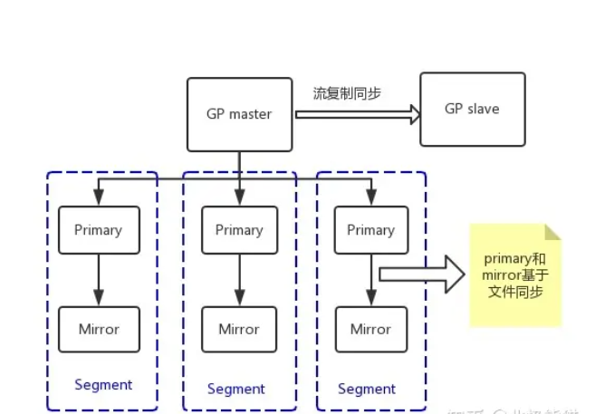

# GreenPlum集群实验室-0

> Author ：Heike07

[TOC]

## 整体介绍

### 链接参考

> 淘宝数据库内核月报：http://mysql.taobao.org/monthly/2016/01/02/
>
> 知乎文章：https://zhuanlan.zhihu.com/p/413663643
>
> 知乎文章2：https://zhuanlan.zhihu.com/p/630540673
>
> GP官方文档：https://gp-docs-cn.github.io/docs/admin_guide/highavail/topics/g-overview-of-high-availability-in-greenplum-database.html

### 架构以及名词解释

Greenplum是一个纯软件的MPP数据库服务器，其系统架构专门用于管理大规模分析型数据仓库或商业智能工作负载。从技术上讲，MPP无共享架构是指具有多个节点的系统，每个节点都有自己的内存、操作系统和磁盘，它们协作执行一项操作。Greenplum使用这种高性能系统架构分配PB级别的数据，并行使用系统的所有资源来处理请求。

Greenplum 6版本基于PostgreSQL 9.4开源数据库，本质上是若干面向磁盘的PostgreSQL数据库实例，共同作为一个内聚的数据库管理系统（DBMS）。大多数情况下，Greenplum在SQL支持、配置选项和最终用户功能方面与PostgreSQL非常相似。用户操作Greenplum数据库就像与常规PostgreSQL交互一样。

Greenplum与PostgreSQL的主要区别为：除了支持Postgres优化器外，还有自己的GPORCA优化器。Greenplum数据库可以使用Append-Optimized存储格式。

Greenplum支持列存储，即逻辑上组织为表的数据，物理上以面向列的格式存储数据。列存储只能与Append-Optimized表一起使用。

Greenplum对PostgreSQL的内部结构进行了修改和补充，以支持数据库的并行结构。例如，对系统目录、优化器、查询执行器和事务管理器组件做过修改和增强，能够在所有并行PostgreSQL数据库实例上同时运行查询。Greenplum依赖Interconnect（内部互连）在网络层支持不同PostgreSQL实例之间的通信，使得系统作为单一逻辑数据库运行。

较之标准PostgreSQL，Greenplum还增加了并行数据装载（外部表）、资源管理、查询优化和存储增强功能。Greenplum开发的许多功能和优化也进入了PostgreSQL社区，促进了PostgreSQL的发展。例如，表分区是Greenplum首先开发的一个特性，现在已成为标准PostgreSQL的一部分。

Greenplum顶层系统架构如图3-1所示。Master是Greenplum数据库系统的入口，是客户端连接并提交SQL语句的数据库实例。Master将其工作与系统中其他叫作Segment的数据库实例进行协调，这些数据库实例负责实际存储和处理用户数据。每个Master和Segment都是一个PostgreSQL数据库实例。


图3-1 Greenplum顶层系统架构

#### Master

Master是Greenplum的系统入口，它接收客户端连接和SQL查询，并将工作分配给Segment实例。最终用户通过Master与Greenplum数据库交互，就像与典型PostgreSQL数据库交互一样。用户可以使用诸如psql之类的客户端程序或JDBC、ODBC、libpq之类的应用程序编程接口（API）连接到数据库。

Master数据库实例中存储全局系统目录（Global System Catalog）。全局系统目录是一组系统表，其中包含关于Greenplum本身的元数据。Master实例中不包含任何用户数据，用户数据仅驻留在Segment实例中。Master验证客户端连接，处理传入的SQL命令，在Segment之间分配工作负载，协调每个Segment返回的结果，并将最终结果返给客户端程序。

Greenplum数据库使用写前日志（WAL）进行主/备Master镜像。在基于WAL的日志记录中，所有修改都会在应用之前写入日志，以确保任何进程内操作的数据完整性。

#### Segment

Greenplum的Segment实例是独立的PostgreSQL数据库，每个数据库存储一部分数据并执行一部分查询处理。当用户通过Master连接到数据库并发出查询时，将在每个Segment数据库中创建进程以处理该查询的工作。有关查询过程的更多信息，参见3.3.3节。

用户定义的表及其索引分布在所有可用的Segment中，每个Segment都包含互斥的部分数据（复制表除外，这种表会在每个Segment实例上存储一份完整的数据拷贝）。提供服务的数据库服务器进程在相应的Segment实例下运行。

Segment在称为段主机的服务器上运行。一台段主机通常运行2~8个Segment实例，具体数量取决于CPU核、内存、磁盘、网卡和工作负载。所有段主机的配置应该相同，以避免木桶效应。让Greenplum获得最佳性能的关键是将数据和负载均匀分布到多个能力相同的Segment上，以便所有Segment同时处理任务并同时完成其工作。

#### Interconnect

Interconnect即内部互连，是Greenplum数据库系统架构中的核心组件，互连指的是Segment在网络间的进程间通信。Interconnect使用标准以太网交换数据，出于性能原因，建议使用万兆网或更快的系统。

默认情况下，Interconnect使用带有流量控制的用户数据报协议（UDPIFC）进行通信，通过网络发送消息。Greenplum软件执行超出UDP提供的数据包验证，这意味着其可靠性相当于传输控制协议（TCP），性能和可扩展性超过TCP。如果将Interconnect改为TCP，Greenplum数据库的可扩展性则限制为1000个Segment实例，UDPIFC作为Interconnect的默认协议不受此限制。

Interconnect实现了对同一集群中多个PostgreSQL实例的高效协同和并行计算，承载了并行查询计划生产、查询分派（QD）、协调节点上查询执行器（QE）的并行工作、数据分布、Pipeline计算、镜像复制、健康探测等诸多任务。

本文节选自《Greenplum构建实时数据仓库实践》，内容发布获得作者和出版社授权。

知乎文章：https://zhuanlan.zhihu.com/p/413663643

GP官方文档：https://gp-docs-cn.github.io/docs/admin_guide/highavail/topics/g-overview-of-high-availability-in-greenplum-database.html

### GP总体结构

PostgreSQL 主备同步机制是通过流复制实现，其原理见之前的月报[PG主备流复制机制](http://mysql.taobao.org/monthly/2015/10/04/)。

Greenplum 是基于PostgreSQL开发的，它的主备也是通过流复制实现，但是Segment节点中的Primary和Mirror之间的数据同步是基于文件级别的同步实现的。为什么Primary和Mirror不能再使用流复制实现呢？主要有两个原因:

1. Append Only表不写WAL日志，所以Append Only表的数据就不能通过XLOG发送到Mirror再Apply；
2. pg_control等文件也是不写WAL日志，也只能通过文件方式同步到Mirror。

Greenplum 的架构采用了MPP 无共享体系。在 MPP 系统中，每个数据节点有自己的CPU、磁盘和内存(Share nothing)，每个节点内的 CPU 不能访问另一个节点的内存。节点之间的信息交互是通过节点互联网络实现的，这个过程一般称为数据重分配(Data Redistribution)。GP master负责协调整个集群 ，一个数据节点可以配置多个节点实例(Segment Instances)，节点实例并行处理查询(SQL)。

### Primary和Mirror同步机制

Primary和Mirror同步的内容主要有两部分，即文件和数据。之所以Primary和Mirror要同步文件，是Primary和Mirror之间可以自动failover，只有两者保持同步才能相互替代，如果只把数据同步过去，pg_control、pg_clog、pg_subtrans 没有同步，那么从Primary切换到Mirror会出现问题。GP master和GP slave却不用担心这些问题，Append Only 表的数据只会存在 Segment，所以WAL日志足够保持GP master和GP slave同步(只要是流复制，pg_control、pg_clog、pg_subtrans 这些文件Slave会自动更新，无需从Master同步)。



### 数据同步

当GP master向Primary下发执行计划后，Primary开始执行，如果是DML操作，那么Primary会产生XLOG及更新page。会在`SlruPhysicalWritePage`函数中(写数据页)产生FileRepOperationOpen、FileRepOperationWrite、FileRepOperationFlush、FileRepOperationClose等指令消息(消息中包含具体要更新的文件page及内容)，通过primary sender进程向Mirror发送Message，然后Mirror的mirror consumer等进程解析消息，执行变更。XLOG通过`XLogWrite`函数(写XLOG)执行同样的操作，把XLOG更新同步过去。

### 文件同步

Primary会有个recovery进程，这个进程会循环把Primary的 pg_control、pg_clog、pg_subtrans 等文件覆盖到Mirror。同时检查XLOG是否一致，如果不一致以Primary为主，对Mirror进行覆盖。除了把Primary部分文件同步到Mirror之外recovery进程还会将Mirror上面的临时文件删掉。


## 主机规划

| 主机名    | IP地址        | 节点描述     |
| --------- | ------------- | ------------ |
| Mastar-a  | 192.168.7.136 | MASTER节点   |
| Standby-a | 192.168.7.137 | STANDBY节点  |
| Segment-a | 192.168.7.138 | SEGMENT节点1 |
| Segment-b | 192.168.7.139 | SEGMENT节点2 |

## 实验准备

### 虚拟机准备

使用PXE安装 2C2G200G的4台VM虚拟机

### Selinux

手动处理selinux为disabled

### 网络变动&网络测试

停止LB-PXE主机，网卡变更为NAT模拟上网环境并新增vm7仅主机网卡用于内网连接

```powershell
# 查看外网网卡并进行开启测试
[root@Master-a ~]# nmcli connection up 5147eef6-1757-44d2-84f0-c9e780da500b
Connection successfully activated (D-Bus active path: /org/freedesktop/NetworkManager/ActiveConnection/2)
[root@Master-a ~]# nmcli connection show
NAME                UUID                                  TYPE      DEVICE 
System ens33        5147eef6-1757-44d2-84f0-c9e780da500b  ethernet  ens33  
Wired connection 1  7722ab4a-dda9-3a6b-8b54-ec8cfaa41e20  ethernet  ens36  
[root@Master-a ~]# ping www.baidu.com
PING www.a.shifen.com (39.156.66.18) 56(84) bytes of data.
64 bytes from 39.156.66.18 (39.156.66.18): icmp_seq=1 ttl=128 time=23.5 ms
64 bytes from 39.156.66.18 (39.156.66.18): icmp_seq=2 ttl=128 time=23.3 ms
^C
--- www.a.shifen.com ping statistics ---
2 packets transmitted, 2 received, 0% packet loss, time 1001ms
rtt min/avg/max/mdev = 23.361/23.439/23.517/0.078 ms
[root@Master-a ~]# nmcli connection down ens33
Error: 'ens33' is not an active connection.
Error: no active connection provided.
[root@Master-a ~]# nmcli connection down 5147eef6-1757-44d2-84f0-c9e780da500b
Connection 'System ens33' successfully deactivated (D-Bus active path: /org/freedesktop/NetworkManager/ActiveConnection/2)

# 关闭网卡模拟内网
[root@Master-a ~]# nmcli connection show
NAME                UUID                                  TYPE      DEVICE 
Wired connection 1  7722ab4a-dda9-3a6b-8b54-ec8cfaa41e20  ethernet  ens36  
System ens33        5147eef6-1757-44d2-84f0-c9e780da500b  ethernet  --     
[root@Master-a ~]# ping www.baidu.com
```

### 设置主机名

通过nmtui设置主机名

### 搭建私有YUM源

在standby-a节点上搭建apache httpd yum私有源

```powershell
# 挂载光盘
[root@Standby-a objest]# mount iso/CentOS-7-x86_64-DVD-2003.iso localyum/
mount: /dev/loop0 is write-protected, mounting read-only
[root@Standby-a objest]# cd localyum/
[root@Standby-a localyum]# ls
CentOS_BuildTag  EULA  images    LiveOS    repodata              RPM-GPG-KEY-CentOS-Testing-7
EFI              GPL   isolinux  Packages  RPM-GPG-KEY-CentOS-7  TRANS.TBL
[root@Standby-a localyum]# 

# 查看光盘本地源
[root@Standby-a yum.repos.d]# touch local.repo
[root@Standby-a yum.repos.d]# cat local.repo 
[local]
name=Local Yum
baseurl=file:///home/objest/localyum
enable=1
gpgcheck=0
[root@Standby-a yum.repos.d]# 

# 其他源临时修改后缀处理
[root@Standby-a yum.repos.d]# rename repo repotmp *
[root@Standby-a yum.repos.d]# ll
total 40
-rw-r--r--. 1 root root 1664 Apr  8  2020 CentOS-Base.repotmp
-rw-r--r--. 1 root root 1309 Apr  8  2020 CentOS-CR.repotmp
-rw-r--r--. 1 root root  649 Apr  8  2020 CentOS-Debuginfo.repotmp
-rw-r--r--. 1 root root  314 Apr  8  2020 CentOS-fasttrack.repotmp
-rw-r--r--. 1 root root  630 Apr  8  2020 CentOS-Media.repotmp
-rw-r--r--. 1 root root 1331 Apr  8  2020 CentOS-Sources.repotmp
-rw-r--r--. 1 root root 7577 Apr  8  2020 CentOS-Vault.repotmp
-rw-r--r--. 1 root root  616 Apr  8  2020 CentOS-x86_64-kernel.repotmp
-rw-r--r--  1 root root   80 Jun  4 22:44 local.repotmp

# 设置光盘源
[root@Standby-a yum.repos.d]# mv local.repotmp local.repo


[root@Standby-a yum.repos.d]# 
# 安装httpd
[root@Standby-a yum.repos.d]# yum install -y httpd
[root@Standby-a yum.repos.d]# systemctl start httpd

# 光盘文件复制
[root@Standby-a html]# cp -ra /home/objest/localyum .
[root@Standby-a html]# 
[root@Standby-a html]# pwd

# 设置http-repo源
[root@Standby-a yum.repos.d]# cp local.repo localhttp.repo
[root@Standby-a yum.repos.d]# vim local
[root@Standby-a yum.repos.d]# vim localhttp.repo 
[root@Standby-a yum.repos.d]# 

# 更新yum源缓存
[root@Standby-a yum.repos.d]# yum makecache
```

### 卸载光盘删除文件设置HTTPD服务自启

init 6 重启机器后删除文件

```powershell
# 删除光盘local相关文件
[root@Standby-a ~]# cd /home/objest/
[root@Standby-a objest]# ls
iso  localyum
[root@Standby-a objest]# rm -rf localyum/
[root@Standby-a objest]# rm -rf iso/
[root@Standby-a objest]#

# 设置httpd服务开机启动
[root@Standby-a yum.repos.d]# systemctl enable httpd --now
[root@Standby-a yum.repos.d]# yum clean all
Loaded plugins: fastestmirror
Cleaning repos: localhttp
Cleaning up list of fastest mirrors
Other repos take up 51 M of disk space (use --verbose for details)
[root@Standby-a yum.repos.d]# yum makecache

# 清理YUM源
[root@Standby-a yum.repos.d]# yum clean all
Loaded plugins: fastestmirror
Cleaning repos: localhttp
Cleaning up list of fastest mirrors
Other repos take up 51 M of disk space (use --verbose for details)

# 更新YUM源
[root@Standby-a yum.repos.d]# yum makecache
```

### 设置hosts并复制其他节点HTTP-YUM源

```powershell
# 设置hosts文件
[root@Standby-a yum.repos.d]# cat /etc/hosts
127.0.0.1   localhost localhost.localdomain localhost4 localhost4.localdomain4
::1         localhost localhost.localdomain localhost6 localhost6.localdomain6
[root@Standby-a yum.repos.d]# 
[root@Standby-a yum.repos.d]# 
[root@Standby-a yum.repos.d]# 
[root@Standby-a yum.repos.d]# 
[root@Standby-a yum.repos.d]# cat << EOF >> /etc/hosts
> 192.168.7.136  Master-a
> 192.168.7.137  Standby-a
> 192.168.7.138  Segment-a
> 192.168.7.139  Segment-b
> EOF
[root@Standby-a yum.repos.d]# cat /etc/hosts
127.0.0.1   localhost localhost.localdomain localhost4 localhost4.localdomain4
::1         localhost localhost.localdomain localhost6 localhost6.localdomain6
192.168.7.136  Master-a
192.168.7.137  Standby-a
192.168.7.138  Segment-a
192.168.7.139  Segment-b
[root@Standby-a yum.repos.d]#

# 复制到其他节点hosts文件
[root@Standby-a yum.repos.d]# scp /etc/hosts Master-a:/etc/hosts
The authenticity of host 'master-a (192.168.7.136)' can't be established.
ECDSA key fingerprint is SHA256:ICELL8DOaZ7rN9rWXoqyfr5pz+bw523/FwwHjsi66QM.
ECDSA key fingerprint is MD5:06:6a:e0:62:f0:df:8a:be:2a:3e:95:51:05:f5:bd:da.
Are you sure you want to continue connecting (yes/no)? yes
Warning: Permanently added 'master-a,192.168.7.136' (ECDSA) to the list of known hosts.
root@master-a's password: 
hosts                                                                                                                                   100%  257   614.0KB/s   00:00    
[root@Standby-a yum.repos.d]# scp /etc/hosts Segment-a:/etc/hosts
The authenticity of host 'segment-a (192.168.7.138)' can't be established.
ECDSA key fingerprint is SHA256:sTgeZrp9dUXMX/wO2qbJKvFurTOqBSbqOWYsoMK2Z1s.
ECDSA key fingerprint is MD5:06:b9:1a:65:b3:12:d8:be:f2:e6:f1:5c:e0:9e:2b:6c.
Are you sure you want to continue connecting (yes/no)? yes
Warning: Permanently added 'segment-a,192.168.7.138' (ECDSA) to the list of known hosts.
root@segment-a's password: 
hosts                                                                                                                                   100%  257    78.6KB/s   00:00    
[root@Standby-a yum.repos.d]# scp /etc/hosts Segment-b:/etc/hosts
The authenticity of host 'segment-b (192.168.7.139)' can't be established.
ECDSA key fingerprint is SHA256:UNVqysnB3DIdtF5W35IlvIHRN6ZpVB61fu5HjWP/HbM.
ECDSA key fingerprint is MD5:ba:14:8a:f9:36:bc:24:4b:7b:81:51:1a:73:8d:52:d8.
Are you sure you want to continue connecting (yes/no)? yes
Warning: Permanently added 'segment-b,192.168.7.139' (ECDSA) to the list of known hosts.
root@segment-b's password: 
hosts                                                                                                                                   100%  257   179.7KB/s   00:00    
[root@Standby-a yum.repos.d]#

# 查看hosts文件是否正常 -看一个就行了
[root@Standby-a yum.repos.d]# ssh Master-a "cat /etc/hosts"
root@master-a's password: 
Permission denied, please try again.
root@master-a's password: 
127.0.0.1   localhost localhost.localdomain localhost4 localhost4.localdomain4
::1         localhost localhost.localdomain localhost6 localhost6.localdomain6
192.168.7.136  Master-a
192.168.7.137  Standby-a
192.168.7.138  Segment-a
192.168.7.139  Segment-b
[root@Standby-a yum.repos.d]#

# 同步修改其他机器的yum源配置
[root@Standby-a yum.repos.d]# ssh Master-a "cd /etc/yum.repos.d ; rename repo repotmp * ; ls"
root@master-a's password: 
CentOS-Base.repotmp
CentOS-CR.repotmp
CentOS-Debuginfo.repotmp
CentOS-fasttrack.repotmp
CentOS-Media.repotmp
CentOS-Sources.repotmp
CentOS-Vault.repotmp
CentOS-x86_64-kernel.repotmp
[root@Standby-a yum.repos.d]# ssh Segment-a "cd /etc/yum.repos.d ; rename repo repotmp * ; ls"
root@segment-a's password: 
CentOS-Base.repotmp
CentOS-CR.repotmp
CentOS-Debuginfo.repotmp
CentOS-fasttrack.repotmp
CentOS-Media.repotmp
CentOS-Sources.repotmp
CentOS-Vault.repotmp
CentOS-x86_64-kernel.repotmp
[root@Standby-a yum.repos.d]# ssh Segment-b "cd /etc/yum.repos.d ; rename repo repotmp * ; ls"
root@segment-b's password: 
CentOS-Base.repotmp
CentOS-CR.repotmp
CentOS-Debuginfo.repotmp
CentOS-fasttrack.repotmp
CentOS-Media.repotmp
CentOS-Sources.repotmp
CentOS-Vault.repotmp
CentOS-x86_64-kernel.repotmp
[root@Standby-a yum.repos.d]# 

# 复制HTTP源配置
[root@Standby-a yum.repos.d]# scp /etc/yum.repos.d/localhttp.repo Master-a:/etc/yum.repos.d/localhttp.repo
root@master-a's password: 
localhttp.repo                                                                                                                          100%   90   162.7KB/s   00:00    
[root@Standby-a yum.repos.d]# scp /etc/yum.repos.d/localhttp.repo Segment-a:/etc/yum.repos.d/localhttp.repo
root@segment-a's password: 
Permission denied, please try again.
root@segment-a's password: 
localhttp.repo                                                                                                                          100%   90    51.5KB/s   00:00    
[root@Standby-a yum.repos.d]# scp /etc/yum.repos.d/localhttp.repo Segment-b:/etc/yum.repos.d/localhttp.repo
root@segment-b's password: 
localhttp.repo                                                                                                                          100%   90   135.0KB/s   00:00    
[root@Standby-a yum.repos.d]#

# 防火墙开放80端口
[root@Standby-a yum.repos.d]# firewall-cmd --list-all
public (active)
  target: default
  icmp-block-inversion: no
  interfaces: ens36
  sources: 
  services: dhcpv6-client ssh
  ports: 
  protocols: 
  masquerade: no
  forward-ports: 
  source-ports: 
  icmp-blocks: 
  rich rules: 

[root@Standby-a yum.repos.d]# firewall-cmd --permanent --zone=public --add-service=http
success
[root@Standby-a yum.repos.d]# firewall-cmd --reload
success
[root@Standby-a yum.repos.d]# firewall-cmd --list-all
public (active)
  target: default
  icmp-block-inversion: no
  interfaces: ens36
  sources: 
  services: dhcpv6-client http ssh
  ports: 
  protocols: 
  masquerade: no
  forward-ports: 
  source-ports: 
  icmp-blocks: 
  rich rules: 

[root@Standby-a yum.repos.d]# 

# 更新YUM源其他节点
[root@Standby-a yum.repos.d]# ssh Master-a "yum clean all ; yum makecache"
root@master-a's password: 
Loaded plugins: fastestmirror
Cleaning repos: localhttp
Cleaning up list of fastest mirrors
Loaded plugins: fastestmirror
Determining fastest mirrors
Metadata Cache Created
[root@Standby-a yum.repos.d]# ssh Segment-a "yum clean all ; yum makecache"
root@segment-a's password: 
Loaded plugins: fastestmirror
Cleaning repos: localhttp
Loaded plugins: fastestmirror
Determining fastest mirrors
Metadata Cache Created
[root@Standby-a yum.repos.d]# ssh Segment-b "yum clean all ; yum makecache"
root@segment-b's password: 
Loaded plugins: fastestmirror
Cleaning repos: localhttp
Loaded plugins: fastestmirror
Determining fastest mirrors
Metadata Cache Created
[root@Standby-a yum.repos.d]# 
```
