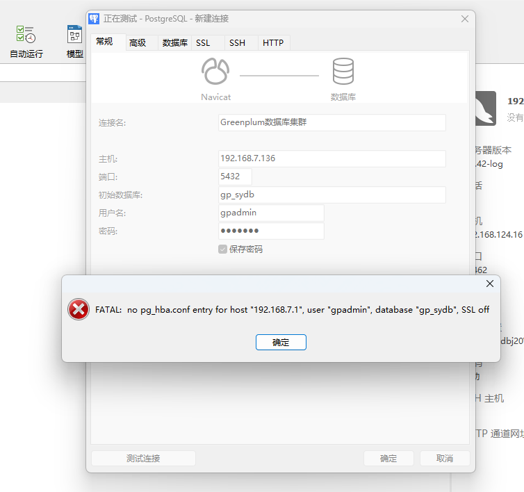
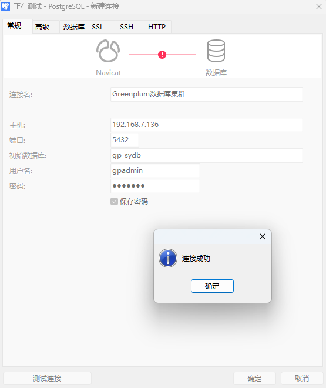

# GreenPlum集群实验室

> Author ：Heike07

[TOC]

## 实验一：搭建3节点一个Master和2个Segment不含Mirror镜像的集群

### 安装所需依赖

@ M S-a S-b 执行

```powershell
# 安装依赖
yum install vim net-tools psmisc nc rsync lrzsz ntp libzstd openssl-static tree iotop git

yum install apr apr-util bash bzip2 curl krb5 libcurl libevent libxml2 libyaml zlib openldap openssh-client openssl openssl-libs perl readline rsync R sed tar zip krb5-devel
```

### 系统配置参数计算

@ M S-a S-b 执行

```powershell
# 计算共享内存  - M为例 其他同理
# KERNEL.SHMALL
[root@Master-a /]# echo $(expr $(getconf _PHYS_PAGES) / 2)
232879

# KERNEL.SHMMAX
[root@Master-a /]# echo $(expr $(getconf _PHYS_PAGES) / 2 \* $(getconf PAGE_SIZE))
953872384
[root@Master-a /]# free 
              total        used        free      shared  buff/cache   available
Mem:        1863036      192080     1245768        9780      425188     1510488
Swap:       2097148           0     2097148
[root@Master-a /]#

# 根据计算结果设置参数
[root@Master-a /]# vim /etc/sysctl.conf 
[root@Master-a /]# sysctl -p
kernel.shmall = 232879
kernel.shmmax = 953872384
kernel.shmmni = 4096
vm.overcommit_memory = 2
vm.overcommit_ratio = 95
net.ipv4.ip_local_port_range = 10000 65535
kernel.sysrq = 1
kernel.core_uses_pid = 1
kernel.msgmnb = 65536
kernel.msgmax = 65536
kernel.msgmni = 2048
net.ipv4.tcp_syncookies = 1
net.ipv4.conf.default.accept_source_route = 0
net.ipv4.tcp_max_syn_backlog = 4096
net.ipv4.conf.all.arp_filter = 1
net.core.netdev_max_backlog = 10000
net.core.rmem_max = 2097152
net.core.wmem_max = 2097152
vm.swappiness = 10
vm.zone_reclaim_mode = 0
vm.dirty_expire_centisecs = 500
vm.dirty_writeback_centisecs = 100
vm.dirty_background_ratio = 3
vm.dirty_ratio = 10
[root@Master-a /]#
```

参数解释 -由Gpt4.0(128K)提供

```shell
好的，这些参数大致可以分为处理内存、网络和内核消息的参数。下面是它们的详细解释：
kernel.shmall：在系统范围内设定共享内存的最大总量（以页为单位）。当创建共享内存段时，系统将它和这个值进行比较。
kernel.shmmax：系统中单个共享内存段的最大大小（以字节为单位）。这个参数也会影响到共享内存的创建。
kernel.shmmni：系统范围内共享内存段的最大数量。
vm.overcommit_memory 和 vm.overcommit_ratio：这些设置决定了系统对内存超量分配的策略。
net.ipv4.ip_local_port_range：这个值设定了TCP和UDP协议能使用的本地端口范围。
kernel.sysrq：延长系统请求的功能，如重新启动、关机、内存转储等。
kernel.core_uses_pid：当启用后，程序跳出核心文件时会在文件名中包含进程ID。
kernel.msgmnb，kernel.msgmax，kernel.msgmni：这些参数调整IPC消息队列的大小和数量。
net.ipv4.tcp_syncookies：当启用时，防止了TCP SYN洪水攻击，但在某些情况下可能会影响正常的TCP链接。
net.ipv4.conf.default.accept_source_route 和 net.ipv4.conf.all.arp_filter：IP选项和ARP协议的处理。
net.ipv4.tcp_max_syn_backlog：为尚未获得对方确认的连接请求设置最大排队数量。
net.core.netdev_max_backlog：接收数据包的最大速率。
net.core.rmem_max 和 net.core.wmem_max：设定网络连接的最大内存缓冲区大小。
vm.swappiness：影响内核交换内存页面的相对权重。
vm.zone_reclaim_mode：设置本地节点内存回收策略。
vm.dirty_expire_centisecs，vm.dirty_writeback_centisecs，vm.dirty_background_ratio，vm.dirty_ratio：调整系统何时对“脏”内存页面进行写回。
以上是对每个参数的简短解释，每个参数的设定都会对系统性能产生影响，需要根据具体的系统环境和应用需求进行设置。
```

### 修改Limits限制

@ M S-a S-b 执行

```powershell
# 修改系统配额 M例
[root@Master-a /]# vim /etc/security/limits.d/20-nproc.conf 
[root@Master-a /]# cat /etc/security/limits.d/20-nproc.conf 
# Default limit for number of user's processes to prevent
# accidental fork bombs.
# See rhbz #432903 for reasoning.

*          soft    nproc     4096
root       soft    nproc     unlimited

# GreenplumDB
*    soft    nofile    65536
*    hard    nofile    65536
*    soft    nproc     131072
*    hard    nproc     131072
[root@Master-a /]#
[root@Master-a /]# vim /etc/security/limits.conf 
[root@Master-a /]# tail /etc/security/limits.conf 
#ftp             hard    nproc           0
#@student        -       maxlogins       4

# End of file

# GreenplumDB
*    soft    nofile    65536
*    hard    nofile    65536
*    soft    nproc     131072
*    hard    nproc     131072
[root@Master-a /]#
```

### 修改SSHD服务相关配置

@ M S-a S-b 执行

```powershell
# 修改SSH相关参数 M例
[root@Master-a /]# vim /etc/ssh/sshd_config 
[root@Master-a /]# cat /etc/ssh/sshd_config |grep ^Max
MaxSessions 200
MaxStartups 10:30:1000
[root@Master-a /]#

# 确认字符集 M例
[root@Master-a /]# echo $LANG
en_US.UTF-8
[root@Master-a /]#
```

### 连接网络同步时间

@ M S-a S-b 执行

```powershell
# 连接网络 - 如果本地有NTP服务器或受时服务器请忽略此步
[root@Master-a /]# date
Thu Jun  6 14:21:21 CST 2024
[root@Master-a /]# nmcli connection show
NAME                UUID                                  TYPE      DEVICE 
Wired connection 1  7722ab4a-dda9-3a6b-8b54-ec8cfaa41e20  ethernet  ens36  
System ens33        5147eef6-1757-44d2-84f0-c9e780da500b  ethernet  --     
[root@Master-a /]# nmcli connection up 5147eef6-1757-44d2-84f0-c9e780da500b
Connection successfully activated (D-Bus active path: /org/freedesktop/NetworkManager/ActiveConnection/3)
[root@Master-a /]# ping www.baidu.com
PING www.a.shifen.com (39.156.66.14) 56(84) bytes of data.
64 bytes from 39.156.66.14 (39.156.66.14): icmp_seq=1 ttl=128 time=23.7 ms
^C
--- www.a.shifen.com ping statistics ---
1 packets transmitted, 1 received, 0% packet loss, time 0ms
rtt min/avg/max/mdev = 23.718/23.718/23.718/0.000 ms
[root@Master-a /]# ntpdate cn.pool.ntp.org
 6 Jun 14:35:02 ntpdate[125115]: adjust time server 84.16.73.33 offset -0.031644 sec
[root@Master-a /]# date
Thu Jun  6 14:35:08 CST 2024
[root@Master-a /]#

# 关闭网络 - 模拟内网环境
[root@Master-a /]# nmcli connection show
NAME                UUID                                  TYPE      DEVICE 
System ens33        5147eef6-1757-44d2-84f0-c9e780da500b  ethernet  ens33  
Wired connection 1  7722ab4a-dda9-3a6b-8b54-ec8cfaa41e20  ethernet  ens36  
[root@Master-a /]# nmcli connection down 5147eef6-1757-44d2-84f0-c9e780da500b
Connection 'System ens33' successfully deactivated (D-Bus active path: /org/freedesktop/NetworkManager/ActiveConnection/3)
[root@Master-a /]# ping www.baidu.com
^C
[root@Master-a /]#
```

### 设置用户以及用户组

@ M S-a S-b 执行

```powershell
# 创建用户以及用户组 M为例 密码：gpadmin
[root@Master-a /]# groupadd gpadmin
[root@Master-a /]# useradd gpadmin -r -m -g gpadmin
[root@Master-a /]# id gpadmin
uid=997(gpadmin) gid=1000(gpadmin) groups=1000(gpadmin)
[root@Master-a /]# passwd gpadmin
Changing password for user gpadmin.
New password: 
BAD PASSWORD: The password is shorter than 8 characters
Retype new password: 
passwd: all authentication tokens updated successfully.
[root@Master-a /]#
```

### 设置gpadmin用户免密登录

@ M S-a S-b 执行

```powershell
# 免密要求 -对自己免密 and 对其他节点免密
# M为例
[root@Master-a /]# su - gpadmin
[gpadmin@Master-a ~]$ ssh-keygen -t rsa
Generating public/private rsa key pair.
Enter file in which to save the key (/home/gpadmin/.ssh/id_rsa): 
Created directory '/home/gpadmin/.ssh'.
Enter passphrase (empty for no passphrase): 
Enter same passphrase again: 
Your identification has been saved in /home/gpadmin/.ssh/id_rsa.
Your public key has been saved in /home/gpadmin/.ssh/id_rsa.pub.
The key fingerprint is:
SHA256:InJne3EKn4p82ZLwLtBZBE0sAUp8bD122L4jH03c2H8 gpadmin@Master-a
The key's randomart image is:
+---[RSA 2048]----+
|..o.+*+          |
|.o +.=+o         |
|. o .o+ . +      |
|      .. + o     |
|  ..oo= S . .    |
|  .o+= O *   . E |
|   . o++B     .  |
|   ...*+.        |
|    o+o.         |
+----[SHA256]-----+
[gpadmin@Master-a ~]$ ssh-copy-id Master-a
/bin/ssh-copy-id: INFO: Source of key(s) to be installed: "/home/gpadmin/.ssh/id_rsa.pub"
The authenticity of host 'master-a (192.168.7.136)' can't be established.
ECDSA key fingerprint is SHA256:ICELL8DOaZ7rN9rWXoqyfr5pz+bw523/FwwHjsi66QM.
ECDSA key fingerprint is MD5:06:6a:e0:62:f0:df:8a:be:2a:3e:95:51:05:f5:bd:da.
Are you sure you want to continue connecting (yes/no)? yes
/bin/ssh-copy-id: INFO: attempting to log in with the new key(s), to filter out any that are already installed
/bin/ssh-copy-id: INFO: 1 key(s) remain to be installed -- if you are prompted now it is to install the new keys
gpadmin@master-a's password: 
Permission denied, please try again.
gpadmin@master-a's password: 

Number of key(s) added: 1

Now try logging into the machine, with:   "ssh 'Master-a'"
and check to make sure that only the key(s) you wanted were added.

[gpadmin@Master-a ~]$ ssh 'Master-a'
Last failed login: Thu Jun  6 14:51:34 CST 2024 from master-a on ssh:notty
There was 1 failed login attempt since the last successful login.
Last login: Thu Jun  6 14:50:38 2024
[gpadmin@Master-a ~]$ exit
logout
Connection to master-a closed.
[gpadmin@Master-a ~]$ ssh-copy-id Segment-a
/bin/ssh-copy-id: INFO: Source of key(s) to be installed: "/home/gpadmin/.ssh/id_rsa.pub"
The authenticity of host 'segment-a (192.168.7.138)' can't be established.
ECDSA key fingerprint is SHA256:sTgeZrp9dUXMX/wO2qbJKvFurTOqBSbqOWYsoMK2Z1s.
ECDSA key fingerprint is MD5:06:b9:1a:65:b3:12:d8:be:f2:e6:f1:5c:e0:9e:2b:6c.
Are you sure you want to continue connecting (yes/no)? yes
/bin/ssh-copy-id: INFO: attempting to log in with the new key(s), to filter out any that are already installed
/bin/ssh-copy-id: INFO: 1 key(s) remain to be installed -- if you are prompted now it is to install the new keys
gpadmin@segment-a's password: 
Permission denied, please try again.
gpadmin@segment-a's password: 

Number of key(s) added: 1

Now try logging into the machine, with:   "ssh 'Segment-a'"
and check to make sure that only the key(s) you wanted were added.

[gpadmin@Master-a ~]$ ssh 'Segment-a'
Last failed login: Thu Jun  6 14:52:21 CST 2024 from master-a on ssh:notty
There was 1 failed login attempt since the last successful login.
[gpadmin@Segment-a ~]$ exit
logout
Connection to segment-a closed.
[gpadmin@Master-a ~]$ ssh-copy-id Segment-b
/bin/ssh-copy-id: INFO: Source of key(s) to be installed: "/home/gpadmin/.ssh/id_rsa.pub"
The authenticity of host 'segment-b (192.168.7.139)' can't be established.
ECDSA key fingerprint is SHA256:UNVqysnB3DIdtF5W35IlvIHRN6ZpVB61fu5HjWP/HbM.
ECDSA key fingerprint is MD5:ba:14:8a:f9:36:bc:24:4b:7b:81:51:1a:73:8d:52:d8.
Are you sure you want to continue connecting (yes/no)? yes
/bin/ssh-copy-id: INFO: attempting to log in with the new key(s), to filter out any that are already installed
/bin/ssh-copy-id: INFO: 1 key(s) remain to be installed -- if you are prompted now it is to install the new keys
gpadmin@segment-b's password: 

Number of key(s) added: 1

Now try logging into the machine, with:   "ssh 'Segment-b'"
and check to make sure that only the key(s) you wanted were added.

[gpadmin@Master-a ~]$ ssh 'Segment-b'
[gpadmin@Segment-b ~]$ exit
logout
Connection to segment-b closed.
[gpadmin@Master-a ~]$
```

### Greenplum数据库安装

@ M S-a S-b 执行

```powershell
# 上传RPM包到预订位置 M例
[gpadmin@Master-a opt]$ cd /home/gpadmin/
[gpadmin@Master-a ~]$ mkdir soft
[gpadmin@Master-a ~]$ cd soft/
[gpadmin@Master-a soft]$ ll
total 67712
-rw-r--r-- 1 root root 69333396 Jun  6 15:00 greenplum-db-6.13.0-rhel7-x86_64.rpm
[gpadmin@Master-a soft]$ su -
Password: 
Last login: Tue Jun  4 21:35:39 CST 2024 from 192.168.7.1 on pts/0
Last failed login: Wed Jun  5 16:09:13 CST 2024 from standby-a on ssh:notty
There were 3 failed login attempts since the last successful login.
[root@Master-a ~]# cd /home/gpadmin/soft/
[root@Master-a soft]# ls
greenplum-db-6.13.0-rhel7-x86_64.rpm
[root@Master-a soft]#

# 安装数据库 - 如果依赖安装OK这里不会有相关依赖提示
[root@Master-a soft]# yum install ./greenplum-db-6.13.0-rhel7-x86_64.rpm 
Loaded plugins: fastestmirror
Examining ./greenplum-db-6.13.0-rhel7-x86_64.rpm: greenplum-db-6-6.13.0-1.el7.x86_64
Marking ./greenplum-db-6.13.0-rhel7-x86_64.rpm to be installed
Resolving Dependencies
--> Running transaction check
---> Package greenplum-db-6.x86_64 0:6.13.0-1.el7 will be installed
--> Finished Dependency Resolution

Dependencies Resolved

================================================================================================================================
 Package                     Arch                Version                   Repository                                      Size
================================================================================================================================
Installing:
 greenplum-db-6              x86_64              6.13.0-1.el7              /greenplum-db-6.13.0-rhel7-x86_64              311 M

Transaction Summary
================================================================================================================================
Install  1 Package

Total size: 311 M
Installed size: 311 M
Is this ok [y/d/N]: y
Downloading packages:
Running transaction check
Running transaction test
Transaction test succeeded
Running transaction
  Installing : greenplum-db-6-6.13.0-1.el7.x86_64                                                                           1/1 
  Verifying  : greenplum-db-6-6.13.0-1.el7.x86_64                                                                           1/1 

Installed:
  greenplum-db-6.x86_64 0:6.13.0-1.el7                                                                                          

Complete!
[root@Master-a soft]#

# 查看安装结果并授权
[root@Master-a soft]# cd /usr/local/
[root@Master-a local]# ll
total 0
drwxr-xr-x.  2 root root   6 Apr 11  2018 bin
drwxr-xr-x.  2 root root   6 Apr 11  2018 etc
drwxr-xr-x.  2 root root   6 Apr 11  2018 games
lrwxrwxrwx   1 root root  30 Jun  6 15:02 greenplum-db -> /usr/local/greenplum-db-6.13.0
drwxr-xr-x  11 root root 238 Jun  6 15:02 greenplum-db-6.13.0
drwxr-xr-x.  2 root root   6 Apr 11  2018 include
drwxr-xr-x.  2 root root   6 Apr 11  2018 lib
drwxr-xr-x.  2 root root   6 Apr 11  2018 lib64
drwxr-xr-x.  2 root root   6 Apr 11  2018 libexec
drwxr-xr-x.  2 root root   6 Apr 11  2018 sbin
drwxr-xr-x.  5 root root  49 Jun  4 18:29 share
drwxr-xr-x.  2 root root   6 Apr 11  2018 src
[root@Master-a local]# chown -R gpadmin:gpadmin greenplum-db*
[root@Master-a local]# ll
total 0
drwxr-xr-x.  2 root    root      6 Apr 11  2018 bin
drwxr-xr-x.  2 root    root      6 Apr 11  2018 etc
drwxr-xr-x.  2 root    root      6 Apr 11  2018 games
lrwxrwxrwx   1 gpadmin gpadmin  30 Jun  6 15:02 greenplum-db -> /usr/local/greenplum-db-6.13.0
drwxr-xr-x  11 gpadmin gpadmin 238 Jun  6 15:02 greenplum-db-6.13.0
drwxr-xr-x.  2 root    root      6 Apr 11  2018 include
drwxr-xr-x.  2 root    root      6 Apr 11  2018 lib
drwxr-xr-x.  2 root    root      6 Apr 11  2018 lib64
drwxr-xr-x.  2 root    root      6 Apr 11  2018 libexec
drwxr-xr-x.  2 root    root      6 Apr 11  2018 sbin
drwxr-xr-x.  5 root    root     49 Jun  4 18:29 share
drwxr-xr-x.  2 root    root      6 Apr 11  2018 src
[root@Master-a local]#
```

### 初始化前环境变量设置

@ M

```powershell
# 数据库初始化前环境变量设置 -仅在Master节点操作
# 设置实验一节点所需资源
[root@Master-a local]# su - gpadmin
Last login: Thu Jun  6 14:51:57 CST 2024 from master-a on pts/1
[gpadmin@Master-a ~]$ ls
soft
[gpadmin@Master-a ~]$ mkdir conf
[gpadmin@Master-a ~]$ ll
total 0
drwxrwxr-x 2 gpadmin gpadmin  6 Jun  6 15:12 conf
drwxrwxr-x 2 gpadmin gpadmin 50 Jun  6 15:00 soft
[gpadmin@Master-a ~]$ cd conf/
[gpadmin@Master-a conf]$ touch hostlist
[gpadmin@Master-a conf]$ touch seg_hosts
[gpadmin@Master-a conf]$ cat << EOF >> hostlist 
> Master-a
> Segment-a
> Segment-b
> EOF
[gpadmin@Master-a conf]$ cat << EOF >> seg_hosts 
> Segment-a
> Segment-b
> EOF
[gpadmin@Master-a conf]$ cat hostlist 
Master-a
Segment-a
Segment-b
[gpadmin@Master-a conf]$ cat seg_hosts 
Segment-a
Segment-b
[gpadmin@Master-a conf]$

# 环境变量引入 - 测试连通性
[gpadmin@Master-a conf]$ source /usr/local/greenplum-db-6.13.0/greenplum_path.sh
[gpadmin@Master-a conf]$ gpssh-exkeys -f hostlist 
[STEP 1 of 5] create local ID and authorize on local host
  ... /home/gpadmin/.ssh/id_rsa file exists ... key generation skipped

[STEP 2 of 5] keyscan all hosts and update known_hosts file

[STEP 3 of 5] retrieving credentials from remote hosts
  ... send to Segment-a
  ... send to Segment-b

[STEP 4 of 5] determine common authentication file content

[STEP 5 of 5] copy authentication files to all remote hosts
  ... finished key exchange with Segment-a
  ... finished key exchange with Segment-b

[INFO] completed successfully
[gpadmin@Master-a conf]$
```

### 创建数据目录

@ M

```powershell
# 创建数据目录-仅在Master节点操作
[gpadmin@Master-a conf]$ mkdir -p /home/gpadmin/data/master
[gpadmin@Master-a conf]$ cd ~

# 创建用户环境变量
[gpadmin@Master-a ~]$ vim .bashrc
[gpadmin@Master-a ~]$ cat .bashrc 
# .bashrc

# Source global definitions
if [ -f /etc/bashrc ]; then
        . /etc/bashrc
fi

# Uncomment the following line if you don't like systemctl's auto-paging feature:
# export SYSTEMD_PAGER=

# User specific aliases and functions

source /usr/local/greenplum-db/greenplum_path.sh
export PGPORT=5432
export PGUSER=gpadmin
export MASTER_DATA_DIRECTORY=/home/gpadmin/data/master/gpseg-1
export PGDATABASE=gp_sydb
export LD_PRELOAD=/lib64/libz.so.1 ps
[gpadmin@Master-a ~]$

# 在bash脚本中增加环境变量路径
[gpadmin@Master-a ~]$ vim /usr/local/greenplum-db/greenplum_path.sh
[gpadmin@Master-a ~]$ cat /usr/local/greenplum-db/greenplum_path.sh | grep GPHOME=/
GPHOME=/usr/local/greenplum-db
[gpadmin@Master-a ~]$

# 创建数据文件夹 - 通过免密工具
[gpadmin@Master-a ~]$ gpssh -f /home/gpadmin/conf/hostlist
=> ls
[ Master-a] conf  data  soft
[Segment-a] soft
[Segment-b] soft
=> mkdir data
[ Master-a] mkdir: cannot create directory ‘data’: File exists
[Segment-a]
[Segment-b]
=> ls
[ Master-a] conf  data  soft
[Segment-a] data  soft
[Segment-b] data  soft
=> cd data
[ Master-a]
[Segment-a]
[Segment-b]
=> mkdir master
[ Master-a] mkdir: cannot create directory ‘master’: File exists
[Segment-a]
[Segment-b]
=> mkdir primary
[ Master-a]
[Segment-a]
[Segment-b]
=> mkdir mirror
[ Master-a]
[Segment-a]
[Segment-b]
=> ls
[ Master-a] master      mirror  primary
[Segment-a] master      mirror  primary
[Segment-b] master      mirror  primary
=> pwd
[ Master-a] /home/gpadmin/data
[Segment-a] /home/gpadmin/data
[Segment-b] /home/gpadmin/data
=> exit

[gpadmin@Master-a ~]$
```

### 测试服务器IO,网络模拟性能

@ M

```powershell
# 检查防火墙 -M为例
[root@Master-a local]# systemctl stop firewalld
[root@Master-a local]# systemctl disable firewalld
Removed symlink /etc/systemd/system/multi-user.target.wants/firewalld.service.
Removed symlink /etc/systemd/system/dbus-org.fedoraproject.FirewallD1.service.
[root@Master-a local]# systemctl status firewalld
● firewalld.service - firewalld - dynamic firewall daemon
   Loaded: loaded (/usr/lib/systemd/system/firewalld.service; disabled; vendor preset: enabled)
   Active: inactive (dead)
     Docs: man:firewalld(1)

Jun 04 21:29:23 localhost.localdomain systemd[1]: Starting firewalld - dynamic firewall daemon...
Jun 04 21:29:23 localhost.localdomain systemd[1]: Started firewalld - dynamic firewall daemon.
Jun 06 15:29:27 Master-a systemd[1]: Stopping firewalld - dynamic firewall daemon...
Jun 06 15:29:28 Master-a systemd[1]: Stopped firewalld - dynamic firewall daemon.
[root@Master-a local]#

# 测试IO,网络
[root@Master-a local]# su - gpadmin
Last login: Thu Jun  6 15:25:35 CST 2024 from master-a on pts/4
[gpadmin@Master-a ~]$ gpcheckperf -f /home/gpadmin/conf/hostlist -r N -d /tmp
/usr/local/greenplum-db/bin/gpcheckperf -f /home/gpadmin/conf/hostlist -r N -d /tmp

-------------------
--  NETPERF TEST
-------------------
NOTICE: -t is deprecated, and has no effect
NOTICE: -f is deprecated, and has no effect
NOTICE: -t is deprecated, and has no effect
NOTICE: -f is deprecated, and has no effect
NOTICE: -t is deprecated, and has no effect
NOTICE: -f is deprecated, and has no effect
NOTICE: -t is deprecated, and has no effect
NOTICE: -f is deprecated, and has no effect

====================
==  RESULT 2024-06-06T15:32:30.148161
====================
Netperf bisection bandwidth test
Master-a -> Segment-a = 496.510000
Segment-b -> Master-a = 433.330000
Segment-a -> Master-a = 421.970000
Master-a -> Segment-b = 566.860000

Summary:
sum = 1918.67 MB/sec
min = 421.97 MB/sec
max = 566.86 MB/sec
avg = 479.67 MB/sec
median = 496.51 MB/sec

[Warning] connection between Master-a and Segment-a is no good
[Warning] connection between Segment-b and Master-a is no good
[Warning] connection between Segment-a and Master-a is no good
[gpadmin@Master-a ~]$

# 调整SSHD DNS -M为例
[root@Master-a local]# vim /etc/ssh/sshd_config 
[root@Master-a local]# 
[root@Master-a local]# cat /etc/ssh/sshd_config |grep DNS
UseDNS no
[root@Master-a local]# systemctl restart sshd
[root@Master-a local]#

# 再次测试IO,网络
- 因为是实验环境所用同一个固态 所以直接测Segment节点去掉Master节点
[gpadmin@Master-a ~]$ gpcheckperf -f /home/gpadmin/conf/seg_hosts -r N -d /tmp
/usr/local/greenplum-db/bin/gpcheckperf -f /home/gpadmin/conf/seg_hosts -r N -d /tmp

-------------------
--  NETPERF TEST
-------------------
NOTICE: -t is deprecated, and has no effect
NOTICE: -f is deprecated, and has no effect
NOTICE: -t is deprecated, and has no effect
NOTICE: -f is deprecated, and has no effect

====================
==  RESULT 2024-06-06T15:46:58.245101
====================
Netperf bisection bandwidth test
Segment-a -> Segment-b = 962.680000
Segment-b -> Segment-a = 911.570000

Summary:
sum = 1874.25 MB/sec
min = 911.57 MB/sec
max = 962.68 MB/sec
avg = 937.12 MB/sec
median = 962.68 MB/sec

[gpadmin@Master-a ~]$
```

### 初始化集群

@ M

```powershell
# 设置初始化集群配置文件 - 不设置mirror
[gpadmin@Master-a ~]$ mkdir gpconfigs
[gpadmin@Master-a ~]$ cp /usr/local/greenplum-db/docs/cli_help/gpconfigs/gpinitsystem_config /home/gpadmin/gpconfigs/
[gpadmin@Master-a ~]$ cd gpconfigs/
[gpadmin@Master-a gpconfigs]$ ls
gpinitsystem_config
[gpadmin@Master-a gpconfigs]$ vim gpinitsystem_config 
[gpadmin@Master-a gpconfigs]$ cat gpinitsystem_config |grep -v "#"
ARRAY_NAME="Greenplum Data Platform"
SEG_PREFIX=gpseg
PORT_BASE=6000
declare -a DATA_DIRECTORY=(/home/gpadmin/data/primary /home/gpadmin/data/primary)
MASTER_HOSTNAME=Master-a
MASTER_DIRECTORY=/home/gpadmin/data/master
MASTER_PORT=5432
TRUSTED_SHELL=ssh
CHECK_POINT_SEGMENTS=8
ENCODING=UNICODE
DATABASE_NAME=gp_sydb
[gpadmin@Master-a gpconfigs]$

# 新建初始化Seg节点
[gpadmin@Master-a gpconfigs]$ touch hostfile_gpinitsystem
[gpadmin@Master-a gpconfigs]$ cat << EOF >> hostfile_gpinitsystem
> Segment-a
> Segment-b
> EOF
[gpadmin@Master-a gpconfigs]$ cat hostfile_gpinitsystem 
Segment-a
Segment-b
[gpadmin@Master-a gpconfigs]$

-- 这里打一个断点，因为即将就要初始化数据库了，创建所有服务器的镜像 M S-a S-b

# 初始化集群
[gpadmin@Master-a gpconfigs]$ gpinitsystem -c /home/gpadmin/gpconfigs/gpinitsystem_config -h /home/gpadmin/gpconfigs/hostfile_gpinitsystem
20240606:16:09:37:028836 gpinitsystem:Master-a:gpadmin-[INFO]:-Checking configuration parameters, please wait...
20240606:16:09:37:028836 gpinitsystem:Master-a:gpadmin-[INFO]:-Reading Greenplum configuration file /home/gpadmin/gpconfigs/gpinitsystem_config
20240606:16:09:37:028836 gpinitsystem:Master-a:gpadmin-[INFO]:-Locale has not been set in /home/gpadmin/gpconfigs/gpinitsystem_config, will set to default value
20240606:16:09:37:028836 gpinitsystem:Master-a:gpadmin-[INFO]:-Locale set to en_US.utf8
20240606:16:09:37:028836 gpinitsystem:Master-a:gpadmin-[INFO]:-MASTER_MAX_CONNECT not set, will set to default value 250
20240606:16:09:37:028836 gpinitsystem:Master-a:gpadmin-[INFO]:-Checking configuration parameters, Completed
20240606:16:09:37:028836 gpinitsystem:Master-a:gpadmin-[INFO]:-Commencing multi-home checks, please wait...
..
20240606:16:09:37:028836 gpinitsystem:Master-a:gpadmin-[INFO]:-Configuring build for standard array
20240606:16:09:37:028836 gpinitsystem:Master-a:gpadmin-[INFO]:-Commencing multi-home checks, Completed
20240606:16:09:37:028836 gpinitsystem:Master-a:gpadmin-[INFO]:-Building primary segment instance array, please wait...
....
20240606:16:09:39:028836 gpinitsystem:Master-a:gpadmin-[INFO]:-Checking Master host
20240606:16:09:39:028836 gpinitsystem:Master-a:gpadmin-[INFO]:-Checking new segment hosts, please wait...
....
20240606:16:09:42:028836 gpinitsystem:Master-a:gpadmin-[INFO]:-Checking new segment hosts, Completed
20240606:16:09:42:028836 gpinitsystem:Master-a:gpadmin-[INFO]:-Greenplum Database Creation Parameters
20240606:16:09:42:028836 gpinitsystem:Master-a:gpadmin-[INFO]:---------------------------------------
20240606:16:09:42:028836 gpinitsystem:Master-a:gpadmin-[INFO]:-Master Configuration
20240606:16:09:42:028836 gpinitsystem:Master-a:gpadmin-[INFO]:---------------------------------------
20240606:16:09:42:028836 gpinitsystem:Master-a:gpadmin-[INFO]:-Master instance name       = Greenplum Data Platform
20240606:16:09:42:028836 gpinitsystem:Master-a:gpadmin-[INFO]:-Master hostname            = Master-a
20240606:16:09:42:028836 gpinitsystem:Master-a:gpadmin-[INFO]:-Master port                = 5432
20240606:16:09:42:028836 gpinitsystem:Master-a:gpadmin-[INFO]:-Master instance dir        = /home/gpadmin/data/master/gpseg-1
20240606:16:09:42:028836 gpinitsystem:Master-a:gpadmin-[INFO]:-Master LOCALE              = en_US.utf8
20240606:16:09:42:028836 gpinitsystem:Master-a:gpadmin-[INFO]:-Greenplum segment prefix   = gpseg
20240606:16:09:42:028836 gpinitsystem:Master-a:gpadmin-[INFO]:-Master Database            = gp_sydb
20240606:16:09:42:028836 gpinitsystem:Master-a:gpadmin-[INFO]:-Master connections         = 250
20240606:16:09:42:028836 gpinitsystem:Master-a:gpadmin-[INFO]:-Master buffers             = 128000kB
20240606:16:09:42:028836 gpinitsystem:Master-a:gpadmin-[INFO]:-Segment connections        = 750
20240606:16:09:42:028836 gpinitsystem:Master-a:gpadmin-[INFO]:-Segment buffers            = 128000kB
20240606:16:09:42:028836 gpinitsystem:Master-a:gpadmin-[INFO]:-Checkpoint segments        = 8
20240606:16:09:42:028836 gpinitsystem:Master-a:gpadmin-[INFO]:-Encoding                   = UNICODE
20240606:16:09:42:028836 gpinitsystem:Master-a:gpadmin-[INFO]:-Postgres param file        = Off
20240606:16:09:42:028836 gpinitsystem:Master-a:gpadmin-[INFO]:-Initdb to be used          = /usr/local/greenplum-db/bin/initdb
20240606:16:09:42:028836 gpinitsystem:Master-a:gpadmin-[INFO]:-GP_LIBRARY_PATH is         = /usr/local/greenplum-db/lib
20240606:16:09:42:028836 gpinitsystem:Master-a:gpadmin-[INFO]:-HEAP_CHECKSUM is           = on
20240606:16:09:42:028836 gpinitsystem:Master-a:gpadmin-[INFO]:-HBA_HOSTNAMES is           = 0
20240606:16:09:42:028836 gpinitsystem:Master-a:gpadmin-[INFO]:-Ulimit check               = Passed
20240606:16:09:42:028836 gpinitsystem:Master-a:gpadmin-[INFO]:-Array host connect type    = Single hostname per node
20240606:16:09:42:028836 gpinitsystem:Master-a:gpadmin-[INFO]:-Master IP address [1]      = ::1
20240606:16:09:42:028836 gpinitsystem:Master-a:gpadmin-[INFO]:-Master IP address [2]      = 192.168.7.136
20240606:16:09:42:028836 gpinitsystem:Master-a:gpadmin-[INFO]:-Master IP address [3]      = fe80::116d:c8b0:55ee:d36d
20240606:16:09:42:028836 gpinitsystem:Master-a:gpadmin-[INFO]:-Standby Master             = Not Configured
20240606:16:09:42:028836 gpinitsystem:Master-a:gpadmin-[INFO]:-Number of primary segments = 2
20240606:16:09:42:028836 gpinitsystem:Master-a:gpadmin-[INFO]:-Total Database segments    = 4
20240606:16:09:42:028836 gpinitsystem:Master-a:gpadmin-[INFO]:-Trusted shell              = ssh
20240606:16:09:42:028836 gpinitsystem:Master-a:gpadmin-[INFO]:-Number segment hosts       = 2
20240606:16:09:42:028836 gpinitsystem:Master-a:gpadmin-[INFO]:-Mirroring config           = OFF
20240606:16:09:42:028836 gpinitsystem:Master-a:gpadmin-[INFO]:----------------------------------------
20240606:16:09:42:028836 gpinitsystem:Master-a:gpadmin-[INFO]:-Greenplum Primary Segment Configuration
20240606:16:09:42:028836 gpinitsystem:Master-a:gpadmin-[INFO]:----------------------------------------
20240606:16:09:42:028836 gpinitsystem:Master-a:gpadmin-[INFO]:-Segment-a        6000    Segment-a       /home/gpadmin/data/primary/gpseg0       2
20240606:16:09:42:028836 gpinitsystem:Master-a:gpadmin-[INFO]:-Segment-a        6001    Segment-a       /home/gpadmin/data/primary/gpseg1       3
20240606:16:09:42:028836 gpinitsystem:Master-a:gpadmin-[INFO]:-Segment-b        6000    Segment-b       /home/gpadmin/data/primary/gpseg2       4
20240606:16:09:42:028836 gpinitsystem:Master-a:gpadmin-[INFO]:-Segment-b        6001    Segment-b       /home/gpadmin/data/primary/gpseg3       5

Continue with Greenplum creation Yy|Nn (default=N):
> n

-- 这里选择N 终止创建，可以看到因为设置了2个Segment 也就是（）数组内写了 2个 /home/gpadmin/data/primary 所以创建的Segment-Primary共计 4个 各节点为2个

20240606:16:09:57:028836 gpinitsystem:Master-a:gpadmin-[FATAL]:-User abort requested, Script Exits!
[gpadmin@Master-a gpconfigs]$ ls
gpinitsystem_config  hostfile_gpinitsystem
[gpadmin@Master-a gpconfigs]$ vim gpinitsystem_config 
[gpadmin@Master-a gpconfigs]$ cat gpinitsystem_config | grep /home/gpadmin/data
declare -a DATA_DIRECTORY=(/home/gpadmin/data/primary /home/gpadmin/data/primary /home/gpadmin/data/primary)
MASTER_DIRECTORY=/home/gpadmin/data/master
declare -a MIRROR_DATA_DIRECTORY=(/home/gpadmin/data/mirror /home/gpadmin/data/mirror /home/gpadmin/data/mirror)
[gpadmin@Master-a gpconfigs]$ gpinitsystem -c /home/gpadmin/gpconfigs/gpinitsystem_config -h /home/gpadmin/gpconfigs/hostfile_gpinitsystem
20240606:16:13:07:029949 gpinitsystem:Master-a:gpadmin-[INFO]:-Checking configuration parameters, please wait...
20240606:16:13:07:029949 gpinitsystem:Master-a:gpadmin-[INFO]:-Reading Greenplum configuration file /home/gpadmin/gpconfigs/gpinitsystem_config
20240606:16:13:07:029949 gpinitsystem:Master-a:gpadmin-[INFO]:-Locale has not been set in /home/gpadmin/gpconfigs/gpinitsystem_config, will set to default value
20240606:16:13:07:029949 gpinitsystem:Master-a:gpadmin-[INFO]:-Locale set to en_US.utf8
20240606:16:13:07:029949 gpinitsystem:Master-a:gpadmin-[INFO]:-MASTER_MAX_CONNECT not set, will set to default value 250
20240606:16:13:07:029949 gpinitsystem:Master-a:gpadmin-[INFO]:-Checking configuration parameters, Completed
20240606:16:13:07:029949 gpinitsystem:Master-a:gpadmin-[INFO]:-Commencing multi-home checks, please wait...
..
20240606:16:13:07:029949 gpinitsystem:Master-a:gpadmin-[INFO]:-Configuring build for standard array
20240606:16:13:07:029949 gpinitsystem:Master-a:gpadmin-[INFO]:-Commencing multi-home checks, Completed
20240606:16:13:07:029949 gpinitsystem:Master-a:gpadmin-[INFO]:-Building primary segment instance array, please wait...
......
20240606:16:13:09:029949 gpinitsystem:Master-a:gpadmin-[INFO]:-Building group mirror array type , please wait...
......
20240606:16:13:11:029949 gpinitsystem:Master-a:gpadmin-[INFO]:-Checking Master host
20240606:16:13:11:029949 gpinitsystem:Master-a:gpadmin-[INFO]:-Checking new segment hosts, please wait...
............
20240606:16:13:17:029949 gpinitsystem:Master-a:gpadmin-[INFO]:-Checking new segment hosts, Completed
20240606:16:13:17:029949 gpinitsystem:Master-a:gpadmin-[INFO]:-Greenplum Database Creation Parameters
20240606:16:13:17:029949 gpinitsystem:Master-a:gpadmin-[INFO]:---------------------------------------
20240606:16:13:17:029949 gpinitsystem:Master-a:gpadmin-[INFO]:-Master Configuration
20240606:16:13:17:029949 gpinitsystem:Master-a:gpadmin-[INFO]:---------------------------------------
20240606:16:13:17:029949 gpinitsystem:Master-a:gpadmin-[INFO]:-Master instance name       = Greenplum Data Platform
20240606:16:13:17:029949 gpinitsystem:Master-a:gpadmin-[INFO]:-Master hostname            = Master-a
20240606:16:13:17:029949 gpinitsystem:Master-a:gpadmin-[INFO]:-Master port                = 5432
20240606:16:13:17:029949 gpinitsystem:Master-a:gpadmin-[INFO]:-Master instance dir        = /home/gpadmin/data/master/gpseg-1
20240606:16:13:17:029949 gpinitsystem:Master-a:gpadmin-[INFO]:-Master LOCALE              = en_US.utf8
20240606:16:13:17:029949 gpinitsystem:Master-a:gpadmin-[INFO]:-Greenplum segment prefix   = gpseg
20240606:16:13:17:029949 gpinitsystem:Master-a:gpadmin-[INFO]:-Master Database            = gp_sydb
20240606:16:13:17:029949 gpinitsystem:Master-a:gpadmin-[INFO]:-Master connections         = 250
20240606:16:13:17:029949 gpinitsystem:Master-a:gpadmin-[INFO]:-Master buffers             = 128000kB
20240606:16:13:17:029949 gpinitsystem:Master-a:gpadmin-[INFO]:-Segment connections        = 750
20240606:16:13:17:029949 gpinitsystem:Master-a:gpadmin-[INFO]:-Segment buffers            = 128000kB
20240606:16:13:17:029949 gpinitsystem:Master-a:gpadmin-[INFO]:-Checkpoint segments        = 8
20240606:16:13:17:029949 gpinitsystem:Master-a:gpadmin-[INFO]:-Encoding                   = UNICODE
20240606:16:13:17:029949 gpinitsystem:Master-a:gpadmin-[INFO]:-Postgres param file        = Off
20240606:16:13:17:029949 gpinitsystem:Master-a:gpadmin-[INFO]:-Initdb to be used          = /usr/local/greenplum-db/bin/initdb
20240606:16:13:17:029949 gpinitsystem:Master-a:gpadmin-[INFO]:-GP_LIBRARY_PATH is         = /usr/local/greenplum-db/lib
20240606:16:13:17:029949 gpinitsystem:Master-a:gpadmin-[INFO]:-HEAP_CHECKSUM is           = on
20240606:16:13:17:029949 gpinitsystem:Master-a:gpadmin-[INFO]:-HBA_HOSTNAMES is           = 0
20240606:16:13:17:029949 gpinitsystem:Master-a:gpadmin-[INFO]:-Ulimit check               = Passed
20240606:16:13:17:029949 gpinitsystem:Master-a:gpadmin-[INFO]:-Array host connect type    = Single hostname per node
20240606:16:13:17:029949 gpinitsystem:Master-a:gpadmin-[INFO]:-Master IP address [1]      = ::1
20240606:16:13:17:029949 gpinitsystem:Master-a:gpadmin-[INFO]:-Master IP address [2]      = 192.168.7.136
20240606:16:13:17:029949 gpinitsystem:Master-a:gpadmin-[INFO]:-Master IP address [3]      = fe80::116d:c8b0:55ee:d36d
20240606:16:13:17:029949 gpinitsystem:Master-a:gpadmin-[INFO]:-Standby Master             = Not Configured
20240606:16:13:17:029949 gpinitsystem:Master-a:gpadmin-[INFO]:-Number of primary segments = 3
20240606:16:13:17:029949 gpinitsystem:Master-a:gpadmin-[INFO]:-Total Database segments    = 6
20240606:16:13:17:029949 gpinitsystem:Master-a:gpadmin-[INFO]:-Trusted shell              = ssh
20240606:16:13:17:029949 gpinitsystem:Master-a:gpadmin-[INFO]:-Number segment hosts       = 2
20240606:16:13:17:029949 gpinitsystem:Master-a:gpadmin-[INFO]:-Mirror port base           = 7000
20240606:16:13:17:029949 gpinitsystem:Master-a:gpadmin-[INFO]:-Number of mirror segments  = 3
20240606:16:13:17:029949 gpinitsystem:Master-a:gpadmin-[INFO]:-Mirroring config           = ON
20240606:16:13:17:029949 gpinitsystem:Master-a:gpadmin-[INFO]:-Mirroring type             = Group
20240606:16:13:17:029949 gpinitsystem:Master-a:gpadmin-[INFO]:----------------------------------------
20240606:16:13:17:029949 gpinitsystem:Master-a:gpadmin-[INFO]:-Greenplum Primary Segment Configuration
20240606:16:13:17:029949 gpinitsystem:Master-a:gpadmin-[INFO]:----------------------------------------
20240606:16:13:17:029949 gpinitsystem:Master-a:gpadmin-[INFO]:-Segment-a        6000    Segment-a       /home/gpadmin/data/primary/gpseg0       2
20240606:16:13:17:029949 gpinitsystem:Master-a:gpadmin-[INFO]:-Segment-a        6001    Segment-a       /home/gpadmin/data/primary/gpseg1       3
20240606:16:13:17:029949 gpinitsystem:Master-a:gpadmin-[INFO]:-Segment-a        6002    Segment-a       /home/gpadmin/data/primary/gpseg2       4
20240606:16:13:17:029949 gpinitsystem:Master-a:gpadmin-[INFO]:-Segment-b        6000    Segment-b       /home/gpadmin/data/primary/gpseg3       5
20240606:16:13:17:029949 gpinitsystem:Master-a:gpadmin-[INFO]:-Segment-b        6001    Segment-b       /home/gpadmin/data/primary/gpseg4       6
20240606:16:13:17:029949 gpinitsystem:Master-a:gpadmin-[INFO]:-Segment-b        6002    Segment-b       /home/gpadmin/data/primary/gpseg5       7
20240606:16:13:17:029949 gpinitsystem:Master-a:gpadmin-[INFO]:---------------------------------------
20240606:16:13:17:029949 gpinitsystem:Master-a:gpadmin-[INFO]:-Greenplum Mirror Segment Configuration
20240606:16:13:17:029949 gpinitsystem:Master-a:gpadmin-[INFO]:---------------------------------------
20240606:16:13:17:029949 gpinitsystem:Master-a:gpadmin-[INFO]:-Segment-b        7000    Segment-b       /home/gpadmin/data/mirror/gpseg0        8
20240606:16:13:17:029949 gpinitsystem:Master-a:gpadmin-[INFO]:-Segment-b        7001    Segment-b       /home/gpadmin/data/mirror/gpseg1        9
20240606:16:13:17:029949 gpinitsystem:Master-a:gpadmin-[INFO]:-Segment-b        7002    Segment-b       /home/gpadmin/data/mirror/gpseg2        10
20240606:16:13:17:029949 gpinitsystem:Master-a:gpadmin-[INFO]:-Segment-a        7000    Segment-a       /home/gpadmin/data/mirror/gpseg3        11
20240606:16:13:17:029949 gpinitsystem:Master-a:gpadmin-[INFO]:-Segment-a        7001    Segment-a       /home/gpadmin/data/mirror/gpseg4        12
20240606:16:13:17:029949 gpinitsystem:Master-a:gpadmin-[INFO]:-Segment-a        7002    Segment-a       /home/gpadmin/data/mirror/gpseg5        13

Continue with Greenplum creation Yy|Nn (default=N):
> n
-- 这里选择N 终止创建，可以看到因为设置了3个Segment 也就是（）数组内写了 3个 /home/gpadmin/data/primary 所以创建的Segment-Primary共计 6个 各节点为3个 ,另外设置了Mirror镜像节点开启
-- 因为这里为实验环境且需要做实验一：搭建1个Master，2个Segment并设置2个Primary，不设置Mirror，所以恢复此前配置

20240606:16:13:22:029949 gpinitsystem:Master-a:gpadmin-[FATAL]:-User abort requested, Script Exits!
[gpadmin@Master-a gpconfigs]$

# 集群正式创建 - 修改配置
[gpadmin@Master-a gpconfigs]$ vim gpinitsystem_config 
[gpadmin@Master-a gpconfigs]$ cat gpinitsystem_config | grep /home/gpadmin/data
declare -a DATA_DIRECTORY=(/home/gpadmin/data/primary /home/gpadmin/data/primary)
MASTER_DIRECTORY=/home/gpadmin/data/master
#declare -a MIRROR_DATA_DIRECTORY=(/home/gpadmin/data/mirror /home/gpadmin/data/mirror /home/gpadmin/data/mirror)
[gpadmin@Master-a gpconfigs]$

# 集群创建
[gpadmin@Master-a gpconfigs]$ gpinitsystem -c /home/gpadmin/gpconfigs/gpinitsystem_config -h /home/gpadmin/gpconfigs/hostfile_gpinitsystem
20240606:16:19:09:031691 gpinitsystem:Master-a:gpadmin-[INFO]:-Checking configuration parameters, please wait...
20240606:16:19:09:031691 gpinitsystem:Master-a:gpadmin-[INFO]:-Reading Greenplum configuration file /home/gpadmin/gpconfigs/gpinitsystem_config
20240606:16:19:09:031691 gpinitsystem:Master-a:gpadmin-[INFO]:-Locale has not been set in /home/gpadmin/gpconfigs/gpinitsystem_config, will set to default value
20240606:16:19:09:031691 gpinitsystem:Master-a:gpadmin-[INFO]:-Locale set to en_US.utf8
20240606:16:19:09:031691 gpinitsystem:Master-a:gpadmin-[INFO]:-MASTER_MAX_CONNECT not set, will set to default value 250
20240606:16:19:09:031691 gpinitsystem:Master-a:gpadmin-[INFO]:-Checking configuration parameters, Completed
20240606:16:19:09:031691 gpinitsystem:Master-a:gpadmin-[INFO]:-Commencing multi-home checks, please wait...
..
20240606:16:19:10:031691 gpinitsystem:Master-a:gpadmin-[INFO]:-Configuring build for standard array
20240606:16:19:10:031691 gpinitsystem:Master-a:gpadmin-[INFO]:-Commencing multi-home checks, Completed
20240606:16:19:10:031691 gpinitsystem:Master-a:gpadmin-[INFO]:-Building primary segment instance array, please wait...
....
20240606:16:19:11:031691 gpinitsystem:Master-a:gpadmin-[INFO]:-Checking Master host
20240606:16:19:11:031691 gpinitsystem:Master-a:gpadmin-[INFO]:-Checking new segment hosts, please wait...
....
20240606:16:19:14:031691 gpinitsystem:Master-a:gpadmin-[INFO]:-Checking new segment hosts, Completed
20240606:16:19:14:031691 gpinitsystem:Master-a:gpadmin-[INFO]:-Greenplum Database Creation Parameters
20240606:16:19:14:031691 gpinitsystem:Master-a:gpadmin-[INFO]:---------------------------------------
20240606:16:19:14:031691 gpinitsystem:Master-a:gpadmin-[INFO]:-Master Configuration
20240606:16:19:14:031691 gpinitsystem:Master-a:gpadmin-[INFO]:---------------------------------------
20240606:16:19:14:031691 gpinitsystem:Master-a:gpadmin-[INFO]:-Master instance name       = Greenplum Data Platform
20240606:16:19:14:031691 gpinitsystem:Master-a:gpadmin-[INFO]:-Master hostname            = Master-a
20240606:16:19:14:031691 gpinitsystem:Master-a:gpadmin-[INFO]:-Master port                = 5432
20240606:16:19:14:031691 gpinitsystem:Master-a:gpadmin-[INFO]:-Master instance dir        = /home/gpadmin/data/master/gpseg-1
20240606:16:19:14:031691 gpinitsystem:Master-a:gpadmin-[INFO]:-Master LOCALE              = en_US.utf8
20240606:16:19:14:031691 gpinitsystem:Master-a:gpadmin-[INFO]:-Greenplum segment prefix   = gpseg
20240606:16:19:14:031691 gpinitsystem:Master-a:gpadmin-[INFO]:-Master Database            = gp_sydb
20240606:16:19:14:031691 gpinitsystem:Master-a:gpadmin-[INFO]:-Master connections         = 250
20240606:16:19:14:031691 gpinitsystem:Master-a:gpadmin-[INFO]:-Master buffers             = 128000kB
20240606:16:19:14:031691 gpinitsystem:Master-a:gpadmin-[INFO]:-Segment connections        = 750
20240606:16:19:14:031691 gpinitsystem:Master-a:gpadmin-[INFO]:-Segment buffers            = 128000kB
20240606:16:19:14:031691 gpinitsystem:Master-a:gpadmin-[INFO]:-Checkpoint segments        = 8
20240606:16:19:14:031691 gpinitsystem:Master-a:gpadmin-[INFO]:-Encoding                   = UNICODE
20240606:16:19:14:031691 gpinitsystem:Master-a:gpadmin-[INFO]:-Postgres param file        = Off
20240606:16:19:14:031691 gpinitsystem:Master-a:gpadmin-[INFO]:-Initdb to be used          = /usr/local/greenplum-db/bin/initdb
20240606:16:19:14:031691 gpinitsystem:Master-a:gpadmin-[INFO]:-GP_LIBRARY_PATH is         = /usr/local/greenplum-db/lib
20240606:16:19:14:031691 gpinitsystem:Master-a:gpadmin-[INFO]:-HEAP_CHECKSUM is           = on
20240606:16:19:14:031691 gpinitsystem:Master-a:gpadmin-[INFO]:-HBA_HOSTNAMES is           = 0
20240606:16:19:14:031691 gpinitsystem:Master-a:gpadmin-[INFO]:-Ulimit check               = Passed
20240606:16:19:14:031691 gpinitsystem:Master-a:gpadmin-[INFO]:-Array host connect type    = Single hostname per node
20240606:16:19:14:031691 gpinitsystem:Master-a:gpadmin-[INFO]:-Master IP address [1]      = ::1
20240606:16:19:14:031691 gpinitsystem:Master-a:gpadmin-[INFO]:-Master IP address [2]      = 192.168.7.136
20240606:16:19:14:031691 gpinitsystem:Master-a:gpadmin-[INFO]:-Master IP address [3]      = fe80::116d:c8b0:55ee:d36d
20240606:16:19:14:031691 gpinitsystem:Master-a:gpadmin-[INFO]:-Standby Master             = Not Configured
20240606:16:19:14:031691 gpinitsystem:Master-a:gpadmin-[INFO]:-Number of primary segments = 2
20240606:16:19:14:031691 gpinitsystem:Master-a:gpadmin-[INFO]:-Total Database segments    = 4
20240606:16:19:14:031691 gpinitsystem:Master-a:gpadmin-[INFO]:-Trusted shell              = ssh
20240606:16:19:14:031691 gpinitsystem:Master-a:gpadmin-[INFO]:-Number segment hosts       = 2
20240606:16:19:14:031691 gpinitsystem:Master-a:gpadmin-[INFO]:-Mirroring config           = OFF
20240606:16:19:14:031691 gpinitsystem:Master-a:gpadmin-[INFO]:----------------------------------------
20240606:16:19:14:031691 gpinitsystem:Master-a:gpadmin-[INFO]:-Greenplum Primary Segment Configuration
20240606:16:19:14:031691 gpinitsystem:Master-a:gpadmin-[INFO]:----------------------------------------
20240606:16:19:14:031691 gpinitsystem:Master-a:gpadmin-[INFO]:-Segment-a        6000    Segment-a       /home/gpadmin/data/primary/gpseg0       2
20240606:16:19:14:031691 gpinitsystem:Master-a:gpadmin-[INFO]:-Segment-a        6001    Segment-a       /home/gpadmin/data/primary/gpseg1       3
20240606:16:19:14:031691 gpinitsystem:Master-a:gpadmin-[INFO]:-Segment-b        6000    Segment-b       /home/gpadmin/data/primary/gpseg2       4
20240606:16:19:14:031691 gpinitsystem:Master-a:gpadmin-[INFO]:-Segment-b        6001    Segment-b       /home/gpadmin/data/primary/gpseg3       5

Continue with Greenplum creation Yy|Nn (default=N):
> y
20240606:16:19:16:031691 gpinitsystem:Master-a:gpadmin-[INFO]:-Building the Master instance database, please wait...
20240606:16:19:19:031691 gpinitsystem:Master-a:gpadmin-[INFO]:-Starting the Master in admin mode
20240606:16:19:20:031691 gpinitsystem:Master-a:gpadmin-[INFO]:-Commencing parallel build of primary segment instances
20240606:16:19:20:031691 gpinitsystem:Master-a:gpadmin-[INFO]:-Spawning parallel processes    batch [1], please wait...
....
20240606:16:19:20:031691 gpinitsystem:Master-a:gpadmin-[INFO]:-Waiting for parallel processes batch [1], please wait...
.........
20240606:16:19:29:031691 gpinitsystem:Master-a:gpadmin-[INFO]:------------------------------------------------
20240606:16:19:29:031691 gpinitsystem:Master-a:gpadmin-[INFO]:-Parallel process exit status
20240606:16:19:29:031691 gpinitsystem:Master-a:gpadmin-[INFO]:------------------------------------------------
20240606:16:19:29:031691 gpinitsystem:Master-a:gpadmin-[INFO]:-Total processes marked as completed           = 4
20240606:16:19:29:031691 gpinitsystem:Master-a:gpadmin-[INFO]:-Total processes marked as killed              = 0
20240606:16:19:29:031691 gpinitsystem:Master-a:gpadmin-[INFO]:-Total processes marked as failed              = 0
20240606:16:19:29:031691 gpinitsystem:Master-a:gpadmin-[INFO]:------------------------------------------------
20240606:16:19:29:031691 gpinitsystem:Master-a:gpadmin-[INFO]:-Deleting distributed backout files
20240606:16:19:29:031691 gpinitsystem:Master-a:gpadmin-[INFO]:-Removing back out file
20240606:16:19:29:031691 gpinitsystem:Master-a:gpadmin-[INFO]:-No errors generated from parallel processes
20240606:16:19:29:031691 gpinitsystem:Master-a:gpadmin-[INFO]:-Restarting the Greenplum instance in production mode
20240606:16:19:29:034239 gpstop:Master-a:gpadmin-[INFO]:-Starting gpstop with args: -a -l /home/gpadmin/gpAdminLogs -m -d /home/gpadmin/data/master/gpseg-1
20240606:16:19:29:034239 gpstop:Master-a:gpadmin-[INFO]:-Gathering information and validating the environment...
20240606:16:19:29:034239 gpstop:Master-a:gpadmin-[INFO]:-Obtaining Greenplum Master catalog information
20240606:16:19:29:034239 gpstop:Master-a:gpadmin-[INFO]:-Obtaining Segment details from master...
20240606:16:19:29:034239 gpstop:Master-a:gpadmin-[INFO]:-Greenplum Version: 'postgres (Greenplum Database) 6.13.0 build commit:4f1adf8e247a9685c19ea02bcaddfdc200937ecd Open Source'
20240606:16:19:29:034239 gpstop:Master-a:gpadmin-[INFO]:-Commencing Master instance shutdown with mode='smart'
20240606:16:19:29:034239 gpstop:Master-a:gpadmin-[INFO]:-Master segment instance directory=/home/gpadmin/data/master/gpseg-1
20240606:16:19:29:034239 gpstop:Master-a:gpadmin-[INFO]:-Stopping master segment and waiting for user connections to finish ...
server shutting down
20240606:16:19:30:034239 gpstop:Master-a:gpadmin-[INFO]:-Attempting forceful termination of any leftover master process
20240606:16:19:30:034239 gpstop:Master-a:gpadmin-[INFO]:-Terminating processes for segment /home/gpadmin/data/master/gpseg-1
20240606:16:19:30:034263 gpstart:Master-a:gpadmin-[INFO]:-Starting gpstart with args: -a -l /home/gpadmin/gpAdminLogs -d /home/gpadmin/data/master/gpseg-1
20240606:16:19:30:034263 gpstart:Master-a:gpadmin-[INFO]:-Gathering information and validating the environment...
20240606:16:19:30:034263 gpstart:Master-a:gpadmin-[INFO]:-Greenplum Binary Version: 'postgres (Greenplum Database) 6.13.0 build commit:4f1adf8e247a9685c19ea02bcaddfdc200937ecd Open Source'
20240606:16:19:30:034263 gpstart:Master-a:gpadmin-[INFO]:-Greenplum Catalog Version: '301908232'
20240606:16:19:30:034263 gpstart:Master-a:gpadmin-[INFO]:-Starting Master instance in admin mode
20240606:16:19:30:034263 gpstart:Master-a:gpadmin-[INFO]:-Obtaining Greenplum Master catalog information
20240606:16:19:30:034263 gpstart:Master-a:gpadmin-[INFO]:-Obtaining Segment details from master...
20240606:16:19:30:034263 gpstart:Master-a:gpadmin-[INFO]:-Setting new master era
20240606:16:19:30:034263 gpstart:Master-a:gpadmin-[INFO]:-Master Started...
20240606:16:19:30:034263 gpstart:Master-a:gpadmin-[INFO]:-Shutting down master
20240606:16:19:31:034263 gpstart:Master-a:gpadmin-[INFO]:-Commencing parallel segment instance startup, please wait...
.
20240606:16:19:32:034263 gpstart:Master-a:gpadmin-[INFO]:-Process results...
20240606:16:19:32:034263 gpstart:Master-a:gpadmin-[INFO]:-----------------------------------------------------
20240606:16:19:32:034263 gpstart:Master-a:gpadmin-[INFO]:-   Successful segment starts                                            = 4
20240606:16:19:32:034263 gpstart:Master-a:gpadmin-[INFO]:-   Failed segment starts                                                = 0
20240606:16:19:32:034263 gpstart:Master-a:gpadmin-[INFO]:-   Skipped segment starts (segments are marked down in configuration)   = 0
20240606:16:19:32:034263 gpstart:Master-a:gpadmin-[INFO]:-----------------------------------------------------
20240606:16:19:32:034263 gpstart:Master-a:gpadmin-[INFO]:-Successfully started 4 of 4 segment instances 
20240606:16:19:32:034263 gpstart:Master-a:gpadmin-[INFO]:-----------------------------------------------------
20240606:16:19:32:034263 gpstart:Master-a:gpadmin-[INFO]:-Starting Master instance Master-a directory /home/gpadmin/data/master/gpseg-1 
20240606:16:19:32:034263 gpstart:Master-a:gpadmin-[INFO]:-Command pg_ctl reports Master Master-a instance active
20240606:16:19:32:034263 gpstart:Master-a:gpadmin-[INFO]:-Connecting to dbname='template1' connect_timeout=15
20240606:16:19:32:034263 gpstart:Master-a:gpadmin-[INFO]:-No standby master configured.  skipping...
20240606:16:19:32:034263 gpstart:Master-a:gpadmin-[INFO]:-Database successfully started
20240606:16:19:32:031691 gpinitsystem:Master-a:gpadmin-[INFO]:-Completed restart of Greenplum instance in production mode
20240606:16:19:33:031691 gpinitsystem:Master-a:gpadmin-[INFO]:-Scanning utility log file for any warning messages
20240606:16:19:33:031691 gpinitsystem:Master-a:gpadmin-[WARN]:-*******************************************************
20240606:16:19:33:031691 gpinitsystem:Master-a:gpadmin-[WARN]:-Scan of log file indicates that some warnings or errors
20240606:16:19:33:031691 gpinitsystem:Master-a:gpadmin-[WARN]:-were generated during the array creation
20240606:16:19:33:031691 gpinitsystem:Master-a:gpadmin-[INFO]:-Please review contents of log file
20240606:16:19:33:031691 gpinitsystem:Master-a:gpadmin-[INFO]:-/home/gpadmin/gpAdminLogs/gpinitsystem_20240606.log
20240606:16:19:33:031691 gpinitsystem:Master-a:gpadmin-[INFO]:-To determine level of criticality
20240606:16:19:33:031691 gpinitsystem:Master-a:gpadmin-[INFO]:-These messages could be from a previous run of the utility
20240606:16:19:33:031691 gpinitsystem:Master-a:gpadmin-[INFO]:-that was called today!
20240606:16:19:33:031691 gpinitsystem:Master-a:gpadmin-[WARN]:-*******************************************************
20240606:16:19:33:031691 gpinitsystem:Master-a:gpadmin-[INFO]:-Greenplum Database instance successfully created
20240606:16:19:33:031691 gpinitsystem:Master-a:gpadmin-[INFO]:-------------------------------------------------------
20240606:16:19:33:031691 gpinitsystem:Master-a:gpadmin-[INFO]:-To complete the environment configuration, please 
20240606:16:19:33:031691 gpinitsystem:Master-a:gpadmin-[INFO]:-update gpadmin .bashrc file with the following
20240606:16:19:33:031691 gpinitsystem:Master-a:gpadmin-[INFO]:-1. Ensure that the greenplum_path.sh file is sourced
20240606:16:19:33:031691 gpinitsystem:Master-a:gpadmin-[INFO]:-2. Add "export MASTER_DATA_DIRECTORY=/home/gpadmin/data/master/gpseg-1"
20240606:16:19:33:031691 gpinitsystem:Master-a:gpadmin-[INFO]:-   to access the Greenplum scripts for this instance:
20240606:16:19:33:031691 gpinitsystem:Master-a:gpadmin-[INFO]:-   or, use -d /home/gpadmin/data/master/gpseg-1 option for the Greenplum scripts
20240606:16:19:33:031691 gpinitsystem:Master-a:gpadmin-[INFO]:-   Example gpstate -d /home/gpadmin/data/master/gpseg-1
20240606:16:19:33:031691 gpinitsystem:Master-a:gpadmin-[INFO]:-Script log file = /home/gpadmin/gpAdminLogs/gpinitsystem_20240606.log
20240606:16:19:33:031691 gpinitsystem:Master-a:gpadmin-[INFO]:-To remove instance, run gpdeletesystem utility
20240606:16:19:33:031691 gpinitsystem:Master-a:gpadmin-[INFO]:-To initialize a Standby Master Segment for this Greenplum instance
20240606:16:19:33:031691 gpinitsystem:Master-a:gpadmin-[INFO]:-Review options for gpinitstandby
20240606:16:19:33:031691 gpinitsystem:Master-a:gpadmin-[INFO]:-------------------------------------------------------
20240606:16:19:33:031691 gpinitsystem:Master-a:gpadmin-[INFO]:-The Master /home/gpadmin/data/master/gpseg-1/pg_hba.conf post gpinitsystem
20240606:16:19:33:031691 gpinitsystem:Master-a:gpadmin-[INFO]:-has been configured to allow all hosts within this new
20240606:16:19:33:031691 gpinitsystem:Master-a:gpadmin-[INFO]:-array to intercommunicate. Any hosts external to this
20240606:16:19:33:031691 gpinitsystem:Master-a:gpadmin-[INFO]:-new array must be explicitly added to this file
20240606:16:19:33:031691 gpinitsystem:Master-a:gpadmin-[INFO]:-Refer to the Greenplum Admin support guide which is
20240606:16:19:33:031691 gpinitsystem:Master-a:gpadmin-[INFO]:-located in the /usr/local/greenplum-db/docs directory
20240606:16:19:33:031691 gpinitsystem:Master-a:gpadmin-[INFO]:-------------------------------------------------------
[gpadmin@Master-a gpconfigs]$

# 验证集群操作
[gpadmin@Master-a gpconfigs]$ psql 
psql (9.4.24)
Type "help" for help.

gp_sydb=# \q
[gpadmin@Master-a gpconfigs]$
```

### 查看集群状态

@ M

```powershell
# 查看集群状态
[gpadmin@Master-a gpconfigs]$ gpstate
20240606:16:23:29:034674 gpstate:Master-a:gpadmin-[INFO]:-Starting gpstate with args: 
20240606:16:23:29:034674 gpstate:Master-a:gpadmin-[INFO]:-local Greenplum Version: 'postgres (Greenplum Database) 6.13.0 build commit:4f1adf8e247a9685c19ea02bcaddfdc200937ecd Open Source'
20240606:16:23:29:034674 gpstate:Master-a:gpadmin-[INFO]:-master Greenplum Version: 'PostgreSQL 9.4.24 (Greenplum Database 6.13.0 build commit:4f1adf8e247a9685c19ea02bcaddfdc200937ecd Open Source) on x86_64-unknown-linux-gnu, compiled by gcc (GCC) 6.4.0, 64-bit compiled on Dec 18 2020 22:31:16'
20240606:16:23:29:034674 gpstate:Master-a:gpadmin-[INFO]:-Obtaining Segment details from master...
20240606:16:23:29:034674 gpstate:Master-a:gpadmin-[INFO]:-Gathering data from segments...
20240606:16:23:30:034674 gpstate:Master-a:gpadmin-[INFO]:-Greenplum instance status summary
20240606:16:23:30:034674 gpstate:Master-a:gpadmin-[INFO]:-----------------------------------------------------
20240606:16:23:30:034674 gpstate:Master-a:gpadmin-[INFO]:-   Master instance                                = Active
20240606:16:23:30:034674 gpstate:Master-a:gpadmin-[INFO]:-   Master standby                                 = No master standby configured
20240606:16:23:30:034674 gpstate:Master-a:gpadmin-[INFO]:-   Total segment instance count from metadata     = 4
20240606:16:23:30:034674 gpstate:Master-a:gpadmin-[INFO]:-----------------------------------------------------
20240606:16:23:30:034674 gpstate:Master-a:gpadmin-[INFO]:-   Primary Segment Status
20240606:16:23:30:034674 gpstate:Master-a:gpadmin-[INFO]:-----------------------------------------------------
20240606:16:23:30:034674 gpstate:Master-a:gpadmin-[INFO]:-   Total primary segments                         = 4
20240606:16:23:30:034674 gpstate:Master-a:gpadmin-[INFO]:-   Total primary segment valid (at master)        = 4
20240606:16:23:30:034674 gpstate:Master-a:gpadmin-[INFO]:-   Total primary segment failures (at master)     = 0
20240606:16:23:30:034674 gpstate:Master-a:gpadmin-[INFO]:-   Total number of postmaster.pid files missing   = 0
20240606:16:23:30:034674 gpstate:Master-a:gpadmin-[INFO]:-   Total number of postmaster.pid files found     = 4
20240606:16:23:30:034674 gpstate:Master-a:gpadmin-[INFO]:-   Total number of postmaster.pid PIDs missing    = 0
20240606:16:23:30:034674 gpstate:Master-a:gpadmin-[INFO]:-   Total number of postmaster.pid PIDs found      = 4
20240606:16:23:30:034674 gpstate:Master-a:gpadmin-[INFO]:-   Total number of /tmp lock files missing        = 0
20240606:16:23:30:034674 gpstate:Master-a:gpadmin-[INFO]:-   Total number of /tmp lock files found          = 4
20240606:16:23:30:034674 gpstate:Master-a:gpadmin-[INFO]:-   Total number postmaster processes missing      = 0
20240606:16:23:30:034674 gpstate:Master-a:gpadmin-[INFO]:-   Total number postmaster processes found        = 4
20240606:16:23:30:034674 gpstate:Master-a:gpadmin-[INFO]:-----------------------------------------------------
20240606:16:23:30:034674 gpstate:Master-a:gpadmin-[INFO]:-   Mirror Segment Status
20240606:16:23:30:034674 gpstate:Master-a:gpadmin-[INFO]:-----------------------------------------------------
20240606:16:23:30:034674 gpstate:Master-a:gpadmin-[INFO]:-   Mirrors not configured on this array
20240606:16:23:30:034674 gpstate:Master-a:gpadmin-[INFO]:-----------------------------------------------------
[gpadmin@Master-a gpconfigs]$

# 停止集群
[gpadmin@Master-a gpconfigs]$ gpstop
20240606:16:23:58:034770 gpstop:Master-a:gpadmin-[INFO]:-Starting gpstop with args: 
20240606:16:23:58:034770 gpstop:Master-a:gpadmin-[INFO]:-Gathering information and validating the environment...
20240606:16:23:58:034770 gpstop:Master-a:gpadmin-[INFO]:-Obtaining Greenplum Master catalog information
20240606:16:23:58:034770 gpstop:Master-a:gpadmin-[INFO]:-Obtaining Segment details from master...
20240606:16:23:58:034770 gpstop:Master-a:gpadmin-[INFO]:-Greenplum Version: 'postgres (Greenplum Database) 6.13.0 build commit:4f1adf8e247a9685c19ea02bcaddfdc200937ecd Open Source'
20240606:16:23:58:034770 gpstop:Master-a:gpadmin-[INFO]:---------------------------------------------
20240606:16:23:58:034770 gpstop:Master-a:gpadmin-[INFO]:-Master instance parameters
20240606:16:23:58:034770 gpstop:Master-a:gpadmin-[INFO]:---------------------------------------------
20240606:16:23:58:034770 gpstop:Master-a:gpadmin-[INFO]:-   Master Greenplum instance process active PID   = 34317
20240606:16:23:58:034770 gpstop:Master-a:gpadmin-[INFO]:-   Database                                       = template1
20240606:16:23:58:034770 gpstop:Master-a:gpadmin-[INFO]:-   Master port                                    = 5432
20240606:16:23:58:034770 gpstop:Master-a:gpadmin-[INFO]:-   Master directory                               = /home/gpadmin/data/master/gpseg-1
20240606:16:23:58:034770 gpstop:Master-a:gpadmin-[INFO]:-   Shutdown mode                                  = smart
20240606:16:23:58:034770 gpstop:Master-a:gpadmin-[INFO]:-   Timeout                                        = 120
20240606:16:23:58:034770 gpstop:Master-a:gpadmin-[INFO]:-   Shutdown Master standby host                   = Off
20240606:16:23:58:034770 gpstop:Master-a:gpadmin-[INFO]:---------------------------------------------
20240606:16:23:58:034770 gpstop:Master-a:gpadmin-[INFO]:-Segment instances that will be shutdown:
20240606:16:23:58:034770 gpstop:Master-a:gpadmin-[INFO]:---------------------------------------------
20240606:16:23:58:034770 gpstop:Master-a:gpadmin-[INFO]:-   Host        Datadir                             Port   Status
20240606:16:23:58:034770 gpstop:Master-a:gpadmin-[INFO]:-   Segment-a   /home/gpadmin/data/primary/gpseg0   6000   u
20240606:16:23:58:034770 gpstop:Master-a:gpadmin-[INFO]:-   Segment-a   /home/gpadmin/data/primary/gpseg1   6001   u
20240606:16:23:58:034770 gpstop:Master-a:gpadmin-[INFO]:-   Segment-b   /home/gpadmin/data/primary/gpseg2   6000   u
20240606:16:23:58:034770 gpstop:Master-a:gpadmin-[INFO]:-   Segment-b   /home/gpadmin/data/primary/gpseg3   6001   u

Continue with Greenplum instance shutdown Yy|Nn (default=N):
> y
20240606:16:24:00:034770 gpstop:Master-a:gpadmin-[INFO]:-Commencing Master instance shutdown with mode='smart'
20240606:16:24:00:034770 gpstop:Master-a:gpadmin-[INFO]:-Master segment instance directory=/home/gpadmin/data/master/gpseg-1
20240606:16:24:00:034770 gpstop:Master-a:gpadmin-[INFO]:-Stopping master segment and waiting for user connections to finish ...
server shutting down
20240606:16:24:01:034770 gpstop:Master-a:gpadmin-[INFO]:-Attempting forceful termination of any leftover master process
20240606:16:24:01:034770 gpstop:Master-a:gpadmin-[INFO]:-Terminating processes for segment /home/gpadmin/data/master/gpseg-1
20240606:16:24:01:034770 gpstop:Master-a:gpadmin-[INFO]:-No standby master host configured
20240606:16:24:01:034770 gpstop:Master-a:gpadmin-[INFO]:-Targeting dbid [2, 3, 4, 5] for shutdown
20240606:16:24:01:034770 gpstop:Master-a:gpadmin-[INFO]:-Commencing parallel segment instance shutdown, please wait...
20240606:16:24:01:034770 gpstop:Master-a:gpadmin-[INFO]:-0.00% of jobs completed
20240606:16:24:01:034770 gpstop:Master-a:gpadmin-[INFO]:-100.00% of jobs completed
20240606:16:24:01:034770 gpstop:Master-a:gpadmin-[INFO]:-----------------------------------------------------
20240606:16:24:01:034770 gpstop:Master-a:gpadmin-[INFO]:-   Segments stopped successfully      = 4
20240606:16:24:01:034770 gpstop:Master-a:gpadmin-[INFO]:-   Segments with errors during stop   = 0
20240606:16:24:01:034770 gpstop:Master-a:gpadmin-[INFO]:-----------------------------------------------------
20240606:16:24:01:034770 gpstop:Master-a:gpadmin-[INFO]:-Successfully shutdown 4 of 4 segment instances 
20240606:16:24:01:034770 gpstop:Master-a:gpadmin-[INFO]:-Database successfully shutdown with no errors reported
20240606:16:24:01:034770 gpstop:Master-a:gpadmin-[INFO]:-Cleaning up leftover gpmmon process
20240606:16:24:01:034770 gpstop:Master-a:gpadmin-[INFO]:-No leftover gpmmon process found
20240606:16:24:01:034770 gpstop:Master-a:gpadmin-[INFO]:-Cleaning up leftover gpsmon processes
20240606:16:24:02:034770 gpstop:Master-a:gpadmin-[INFO]:-No leftover gpsmon processes on some hosts. not attempting forceful termination on these hosts
20240606:16:24:02:034770 gpstop:Master-a:gpadmin-[INFO]:-Cleaning up leftover shared memory
[gpadmin@Master-a gpconfigs]$

# 开启集群
[gpadmin@Master-a gpconfigs]$ gpstart
20240606:16:24:30:034921 gpstart:Master-a:gpadmin-[INFO]:-Starting gpstart with args: 
20240606:16:24:30:034921 gpstart:Master-a:gpadmin-[INFO]:-Gathering information and validating the environment...
20240606:16:24:30:034921 gpstart:Master-a:gpadmin-[INFO]:-Greenplum Binary Version: 'postgres (Greenplum Database) 6.13.0 build commit:4f1adf8e247a9685c19ea02bcaddfdc200937ecd Open Source'
20240606:16:24:30:034921 gpstart:Master-a:gpadmin-[INFO]:-Greenplum Catalog Version: '301908232'
20240606:16:24:30:034921 gpstart:Master-a:gpadmin-[INFO]:-Starting Master instance in admin mode
20240606:16:24:30:034921 gpstart:Master-a:gpadmin-[INFO]:-Obtaining Greenplum Master catalog information
20240606:16:24:30:034921 gpstart:Master-a:gpadmin-[INFO]:-Obtaining Segment details from master...
20240606:16:24:30:034921 gpstart:Master-a:gpadmin-[INFO]:-Setting new master era
20240606:16:24:30:034921 gpstart:Master-a:gpadmin-[INFO]:-Master Started...
20240606:16:24:31:034921 gpstart:Master-a:gpadmin-[INFO]:-Shutting down master
20240606:16:24:31:034921 gpstart:Master-a:gpadmin-[INFO]:---------------------------
20240606:16:24:31:034921 gpstart:Master-a:gpadmin-[INFO]:-Master instance parameters
20240606:16:24:31:034921 gpstart:Master-a:gpadmin-[INFO]:---------------------------
20240606:16:24:31:034921 gpstart:Master-a:gpadmin-[INFO]:-Database                 = template1
20240606:16:24:31:034921 gpstart:Master-a:gpadmin-[INFO]:-Master Port              = 5432
20240606:16:24:31:034921 gpstart:Master-a:gpadmin-[INFO]:-Master directory         = /home/gpadmin/data/master/gpseg-1
20240606:16:24:31:034921 gpstart:Master-a:gpadmin-[INFO]:-Timeout                  = 600 seconds
20240606:16:24:31:034921 gpstart:Master-a:gpadmin-[INFO]:-Master standby           = Off 
20240606:16:24:31:034921 gpstart:Master-a:gpadmin-[INFO]:---------------------------------------
20240606:16:24:31:034921 gpstart:Master-a:gpadmin-[INFO]:-Segment instances that will be started
20240606:16:24:31:034921 gpstart:Master-a:gpadmin-[INFO]:---------------------------------------
20240606:16:24:31:034921 gpstart:Master-a:gpadmin-[INFO]:-   Host        Datadir                             Port
20240606:16:24:31:034921 gpstart:Master-a:gpadmin-[INFO]:-   Segment-a   /home/gpadmin/data/primary/gpseg0   6000
20240606:16:24:31:034921 gpstart:Master-a:gpadmin-[INFO]:-   Segment-a   /home/gpadmin/data/primary/gpseg1   6001
20240606:16:24:31:034921 gpstart:Master-a:gpadmin-[INFO]:-   Segment-b   /home/gpadmin/data/primary/gpseg2   6000
20240606:16:24:31:034921 gpstart:Master-a:gpadmin-[INFO]:-   Segment-b   /home/gpadmin/data/primary/gpseg3   6001

Continue with Greenplum instance startup Yy|Nn (default=N):
> y
20240606:16:24:32:034921 gpstart:Master-a:gpadmin-[INFO]:-Commencing parallel segment instance startup, please wait...
20240606:16:24:33:034921 gpstart:Master-a:gpadmin-[INFO]:-Process results...
20240606:16:24:33:034921 gpstart:Master-a:gpadmin-[INFO]:-----------------------------------------------------
20240606:16:24:33:034921 gpstart:Master-a:gpadmin-[INFO]:-   Successful segment starts                                            = 4
20240606:16:24:33:034921 gpstart:Master-a:gpadmin-[INFO]:-   Failed segment starts                                                = 0
20240606:16:24:33:034921 gpstart:Master-a:gpadmin-[INFO]:-   Skipped segment starts (segments are marked down in configuration)   = 0
20240606:16:24:33:034921 gpstart:Master-a:gpadmin-[INFO]:-----------------------------------------------------
20240606:16:24:33:034921 gpstart:Master-a:gpadmin-[INFO]:-Successfully started 4 of 4 segment instances 
20240606:16:24:33:034921 gpstart:Master-a:gpadmin-[INFO]:-----------------------------------------------------
20240606:16:24:33:034921 gpstart:Master-a:gpadmin-[INFO]:-Starting Master instance Master-a directory /home/gpadmin/data/master/gpseg-1 
20240606:16:24:33:034921 gpstart:Master-a:gpadmin-[INFO]:-Command pg_ctl reports Master Master-a instance active
20240606:16:24:33:034921 gpstart:Master-a:gpadmin-[INFO]:-Connecting to dbname='template1' connect_timeout=15
20240606:16:24:33:034921 gpstart:Master-a:gpadmin-[INFO]:-No standby master configured.  skipping...
20240606:16:24:33:034921 gpstart:Master-a:gpadmin-[INFO]:-Database successfully started
[gpadmin@Master-a gpconfigs]$
```

### 配置连接白名单

@ M

尝试连接，使用Navicat进行连接



报错提示连接被拒绝，且提示了被拒绝的IP

```powershell
# 增加白名单
[gpadmin@Master-a gpconfigs]$ cd /home/gpadmin/data/master/
[gpadmin@Master-a master]$ ls
gpseg-1
[gpadmin@Master-a master]$ cd gpseg-1/
[gpadmin@Master-a gpseg-1]$ ls
base       gpsegconfig_dump    pg_clog            pg_hba.conf    pg_logical    pg_replslot   pg_stat      pg_tblspc              PG_VERSION            postgresql.conf
global     gpssh.conf          pg_distributedlog  pg_ident.conf  pg_multixact  pg_serial     pg_stat_tmp  pg_twophase            pg_xlog               postmaster.opts
gpperfmon  internal.auto.conf  pg_dynshmem        pg_log         pg_notify     pg_snapshots  pg_subtrans  pg_utilitymodedtmredo  postgresql.auto.conf  postmaster.pid
[gpadmin@Master-a gpseg-1]$ vim pg_hba.conf 
[gpadmin@Master-a gpseg-1]$ tail pg_hba.conf 
local    all         gpadmin         ident
host     all         gpadmin         127.0.0.1/28    trust
host     all         gpadmin         192.168.7.136/32       trust
host     all         gpadmin         ::1/128       trust
host     all         gpadmin         fe80::116d:c8b0:55ee:d36d/128       trust
local    replication gpadmin         ident
host     replication gpadmin         samehost       trust
host     replication gpadmin         192.168.7.136/32       trust
# ACL
host     all         gpadmin         192.168.7.1/32         trust
[gpadmin@Master-a gpseg-1]$

# 重载数据库配置
[gpadmin@Master-a gpseg-1]$ gpstop -u
20240606:16:30:19:035411 gpstop:Master-a:gpadmin-[INFO]:-Starting gpstop with args: -u
20240606:16:30:19:035411 gpstop:Master-a:gpadmin-[INFO]:-Gathering information and validating the environment...
20240606:16:30:19:035411 gpstop:Master-a:gpadmin-[INFO]:-Obtaining Greenplum Master catalog information
20240606:16:30:19:035411 gpstop:Master-a:gpadmin-[INFO]:-Obtaining Segment details from master...
20240606:16:30:19:035411 gpstop:Master-a:gpadmin-[INFO]:-Greenplum Version: 'postgres (Greenplum Database) 6.13.0 build commit:4f1adf8e247a9685c19ea02bcaddfdc200937ecd Open Source'
20240606:16:30:19:035411 gpstop:Master-a:gpadmin-[INFO]:-Signalling all postmaster processes to reload
[gpadmin@Master-a gpseg-1]$
```

再次连接测试



提示连接成功

查看数据库


以上完成了实验一，结果满足预期

**END**