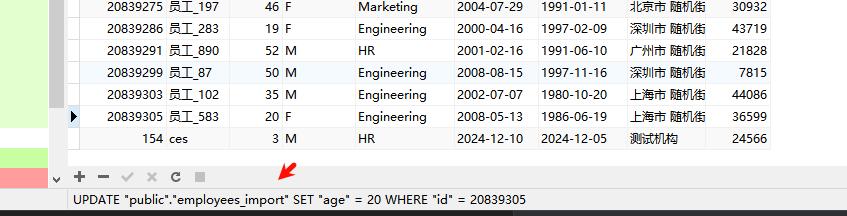

# GreenPlum集群实验室-10

> Author ：Heike07

[TOC]

## 实验十：数据库账户密码&权限认证相关

目前集群是正常运行的，但是账户密码实际上是默认的，密码甚至是没有，以及各权限需要进行认证，针对此情况，参考官方文档进行处理，

### 配置客户端身份验证

greenplum数据库是根据pg底层数据库进行权限控制的，也就是pg_hba.conf 这个文件，那我们分别来看一下这个文件。

```powershell
# Master-a 节点

[gpadmin@Master-a gpseg-1]$ ip a
1: lo: <LOOPBACK,UP,LOWER_UP> mtu 65536 qdisc noqueue state UNKNOWN group default qlen 1000
    link/loopback 00:00:00:00:00:00 brd 00:00:00:00:00:00
    inet 127.0.0.1/8 scope host lo
       valid_lft forever preferred_lft forever
    inet6 ::1/128 scope host 
       valid_lft forever preferred_lft forever
2: ens33: <BROADCAST,MULTICAST,UP,LOWER_UP> mtu 1500 qdisc pfifo_fast state UP group default qlen 1000
    link/ether 00:0c:29:43:db:c9 brd ff:ff:ff:ff:ff:ff
3: ens36: <BROADCAST,MULTICAST,UP,LOWER_UP> mtu 1500 qdisc pfifo_fast state UP group default qlen 1000
    link/ether 00:0c:29:43:db:d3 brd ff:ff:ff:ff:ff:ff
    inet 192.168.7.136/24 brd 192.168.7.255 scope global noprefixroute dynamic ens36
       valid_lft 5527170sec preferred_lft 5527170sec
    inet6 fe80::116d:c8b0:55ee:d36d/64 scope link noprefixroute 
       valid_lft forever preferred_lft forever
[gpadmin@Master-a gpseg-1]$ cat ~/data/master/gpseg-1/pg_hba.conf | grep -v "#"
host    all     gpadmin 192.168.7.136/32        trust
host    replication     gpadmin 192.168.7.136/32        trust
host    all     gpadmin 192.168.7.137/32        trust
host    replication     gpadmin samehost        trust
host    replication     gpadmin 192.168.7.137/32        trust
local    all         gpadmin         ident
host     all         gpadmin         127.0.0.1/28    trust
host     all         gpadmin         192.168.7.136/32       trust
host     all         gpadmin         ::1/128       trust
host     all         gpadmin         fe80::116d:c8b0:55ee:d36d/128       trust
local    replication gpadmin         ident
host     replication gpadmin         samehost       trust
host     replication gpadmin         192.168.7.136/32       trust
host     all         gpadmin         192.168.7.1/32         trust
host     all         gpadmin         192.168.7.99/32        trust
[gpadmin@Master-a gpseg-1]$

分析一下这些意义，通过gpt来分析一下内容。
```


从网络上来说我们的IP是7.99，那么我们修改这个改成认证的方式查看下是否可行，目前是trust的方式，不写密码和写任何密码都可以，我们做一下尝试。

随便滚键盘填写密码


不写密码


都是可以成功的，我们修改一下认证方式。

采用默认MD5的方式进行处理并更新集群的配置信息再做一下尝试

```powershell
[gpadmin@Master-a gpseg-1]$ vim pg_hba.conf 
[gpadmin@Master-a gpseg-1]$ tail pg_hba.conf 
host     all         gpadmin         192.168.7.136/32       trust
host     all         gpadmin         ::1/128       trust
host     all         gpadmin         fe80::116d:c8b0:55ee:d36d/128       trust
local    replication gpadmin         ident
host     replication gpadmin         samehost       trust
host     replication gpadmin         192.168.7.136/32       trust
# ACL
host     all         gpadmin         192.168.7.1/32         trust
# VPN
host     all         gpadmin         192.168.7.99/32        md5
[gpadmin@Master-a gpseg-1]$

[gpadmin@Master-a gpseg-1]$ gpstop -u
20241217:10:08:44:002467 gpstop:Master-a:gpadmin-[INFO]:-Starting gpstop with args: -u
20241217:10:08:44:002467 gpstop:Master-a:gpadmin-[INFO]:-Gathering information and validating the environment...
20241217:10:08:44:002467 gpstop:Master-a:gpadmin-[INFO]:-Obtaining Greenplum Master catalog information
20241217:10:08:44:002467 gpstop:Master-a:gpadmin-[INFO]:-Obtaining Segment details from master...
20241217:10:08:44:002467 gpstop:Master-a:gpadmin-[INFO]:-Greenplum Version: 'postgres (Greenplum Database) 6.13.0 build commit:4f1adf8e247a9685c19ea02bcaddfdc200937ecd Open Source'
20241217:10:08:44:002467 gpstop:Master-a:gpadmin-[INFO]:-Signalling all postmaster processes to reload
[gpadmin@Master-a gpseg-1]$
```


修改后，输入空密码已经提示认证失败了


输入错误的密码也会触发认证相关


输入正确的密码也失败，这里的错误密码指的是用户的密码，因此需要重新设置一下密码

```powershell
# 设置密码
[gpadmin@Master-a gpseg-1]$ psql
psql (9.4.24)
Type "help" for help.
gp_sydb=# ALTER USER gpadmin WITH PASSWORD 'gpadmin@123';
ALTER ROLE
gp_sydb=# 
gp_sydb=# \q
[gpadmin@Master-a gpseg-1]$
```

输入正确的密码发现可以正常连接了。


连入standby提示错误是正常的，因为没有切换，但是为了保证切换不正确，那么相关也需要调整

```powershell
[gpadmin@Standby-a gpseg-1]$ vim pg_hba.conf 
[gpadmin@Standby-a gpseg-1]$ tail pg_hba.conf 
host     all         gpadmin         192.168.7.136/32       trust
host     all         gpadmin         ::1/128       trust
host     all         gpadmin         fe80::116d:c8b0:55ee:d36d/128       trust
local    replication gpadmin         ident
host     replication gpadmin         samehost       trust
host     replication gpadmin         192.168.7.136/32       trust
# ACL
host     all         gpadmin         192.168.7.1/32         trust
# VPN
host     all         gpadmin         192.168.7.99/32        md5
[gpadmin@Standby-a gpseg-1]$
```

但是MD5实际上已经不安全了，就和base64一样，可以轻易破解，那么我们还需要加强我们的安全性

```powershell
# 查看原有密码 明文 gpadmin@123
gp_sydb=# SELECT rolname, rolpassword FROM pg_authid;
 rolname |             rolpassword             
---------+-------------------------------------
 gpadmin | md5b6384acfaf851e763f7dc4da38d780db
(1 row)

gp_sydb=#
可以看到是通过MD5的方式存储的，修改密码认证算法后需要重新重置一下密码，这里我们采用修改配置文件不重置密码试试连接，看看会发生什么？

[gpadmin@Master-a gpseg-1]$ vim pg_hba.conf 
[gpadmin@Master-a gpseg-1]$ tail -n 2 pg_hba.conf 
# VPN
host     all         gpadmin         192.168.7.99/32        scram-sha-256
[gpadmin@Master-a gpseg-1]$

[gpadmin@Master-a gpseg-1]$ gpstop -u
20241217:10:22:26:002580 gpstop:Master-a:gpadmin-[INFO]:-Starting gpstop with args: -u
20241217:10:22:26:002580 gpstop:Master-a:gpadmin-[INFO]:-Gathering information and validating the environment...
20241217:10:22:26:002580 gpstop:Master-a:gpadmin-[INFO]:-Obtaining Greenplum Master catalog information
20241217:10:22:26:002580 gpstop:Master-a:gpadmin-[INFO]:-Obtaining Segment details from master...
20241217:10:22:26:002580 gpstop:Master-a:gpadmin-[INFO]:-Greenplum Version: 'postgres (Greenplum Database) 6.13.0 build commit:4f1adf8e247a9685c19ea02bcaddfdc200937ecd Open Source'
20241217:10:22:26:002580 gpstop:Master-a:gpadmin-[INFO]:-Signalling all postmaster processes to reload
[gpadmin@Master-a gpseg-1]$
```


可以看到在没有改密码的情况下认证失败了。

```powershell
# 重新设置一下密码

[gpadmin@Master-a gpseg-1]$ psql
psql (9.4.24)
Type "help" for help.

gp_sydb=# SELECT rolname, rolpassword FROM pg_authid;
 rolname |             rolpassword             
---------+-------------------------------------
 gpadmin | md5b6384acfaf851e763f7dc4da38d780db
(1 row)

gp_sydb=# ALTER USER gpadmin WITH PASSWORD 'gpadmin@123';
ALTER ROLE
gp_sydb=# SELECT rolname, rolpassword FROM pg_authid;
 rolname |             rolpassword             
---------+-------------------------------------
 gpadmin | md5b6384acfaf851e763f7dc4da38d780db
(1 row)

gp_sydb=#

可以看到是没有生效的，查阅了相关资料，gp16用的是pg9，pg9依然使用md5 不支持scram-sha-256，所以需要复原
```


后续会有升级相关内容，尽请期待。

### 权限认证相关

和mysql一样，gp数据库也支持对单个账户赋予只读和可写权限，因为几乎和mysql一样，所以这里就列举一些情况，我们创建一个名称为finance_user。

```sql
# 进入数据库
[gpadmin@Master-a gpseg-1]$ psql
psql (9.4.24)
Type "help" for help.

# 查看数据库列表
gp_sydb=# \l
                                     List of databases
         Name         |  Owner  | Encoding |  Collate   |   Ctype    |  Access privileges  
----------------------+---------+----------+------------+------------+---------------------
 backup_test_database | gpadmin | UTF8     | en_US.utf8 | en_US.utf8 | 
 gp_sydb              | gpadmin | UTF8     | en_US.utf8 | en_US.utf8 | 
 postgres             | gpadmin | UTF8     | en_US.utf8 | en_US.utf8 | 
 template0            | gpadmin | UTF8     | en_US.utf8 | en_US.utf8 | =c/gpadmin         +
                      |         |          |            |            | gpadmin=CTc/gpadmin
 template1            | gpadmin | UTF8     | en_US.utf8 | en_US.utf8 | =c/gpadmin         +
                      |         |          |            |            | gpadmin=CTc/gpadmin
 test_database        | gpadmin | UTF8     | en_US.utf8 | en_US.utf8 | 
 test_db              | gpadmin | UTF8     | en_US.utf8 | en_US.utf8 | 
(7 rows)

# 切换数据库
gp_sydb=# \c test_database
You are now connected to database "test_database" as user "gpadmin".

# 查询满足条件的当前数据库的列表
test_database=# SELECT table_name
test_database-# FROM information_schema.tables
test_database-# WHERE table_name LIKE 'employees%' AND table_schema = 'public';
    table_name    
------------------
 employees6_copy1
 employees_import
 employees6
 employees5
 employees4
 employees3
 employees2
 employees
(8 rows)

# 创建一个账户
test_database=# CREATE USER finance_user WITH PASSWORD 'finance_user@123';
NOTICE:  resource queue required -- using default resource queue "pg_default"
CREATE ROLE

# 根据需求动态执行赋权表
test_database=# DO $$ 
test_database$# DECLARE 
test_database$#     r RECORD;
test_database$# BEGIN
test_database$#     -- 查询以 'employees' 开头的所有表
test_database$#     FOR r IN 
test_database$#         SELECT table_name 
test_database$#         FROM information_schema.tables
test_database$#         WHERE table_name LIKE 'employees%' AND table_schema = 'public'
test_database$#     LOOP
test_database$#         -- 动态执行 GRANT 语句
test_database$#         EXECUTE 'GRANT SELECT, INSERT, UPDATE, DELETE ON public.' || r.table_name || ' TO finance_user';
test_database$#     END LOOP;
test_database$# END $$;
DO

# 查询账户权限
test_database=# SELECT * 
test_database-# FROM information_schema.role_table_grants
test_database-# WHERE grantee = 'finance_user';
 grantor |   grantee    | table_catalog | table_schema |    table_name    | privilege_type | is_grantable | with_hierarchy 
---------+--------------+---------------+--------------+------------------+----------------+--------------+----------------
 gpadmin | finance_user | test_database | public       | employees6_copy1 | INSERT         | NO           | NO
 gpadmin | finance_user | test_database | public       | employees6_copy1 | SELECT         | NO           | YES
 gpadmin | finance_user | test_database | public       | employees6_copy1 | UPDATE         | NO           | NO
 gpadmin | finance_user | test_database | public       | employees6_copy1 | DELETE         | NO           | NO
 gpadmin | finance_user | test_database | public       | employees_import | INSERT         | NO           | NO
 gpadmin | finance_user | test_database | public       | employees_import | SELECT         | NO           | YES
 gpadmin | finance_user | test_database | public       | employees_import | UPDATE         | NO           | NO
 gpadmin | finance_user | test_database | public       | employees_import | DELETE         | NO           | NO
 gpadmin | finance_user | test_database | public       | employees6       | INSERT         | NO           | NO
 gpadmin | finance_user | test_database | public       | employees6       | SELECT         | NO           | YES
 gpadmin | finance_user | test_database | public       | employees6       | UPDATE         | NO           | NO
 gpadmin | finance_user | test_database | public       | employees6       | DELETE         | NO           | NO
 gpadmin | finance_user | test_database | public       | employees5       | INSERT         | NO           | NO
 gpadmin | finance_user | test_database | public       | employees5       | SELECT         | NO           | YES
 gpadmin | finance_user | test_database | public       | employees5       | UPDATE         | NO           | NO
 gpadmin | finance_user | test_database | public       | employees5       | DELETE         | NO           | NO
 gpadmin | finance_user | test_database | public       | employees4       | INSERT         | NO           | NO
 gpadmin | finance_user | test_database | public       | employees4       | SELECT         | NO           | YES
 gpadmin | finance_user | test_database | public       | employees4       | UPDATE         | NO           | NO
 gpadmin | finance_user | test_database | public       | employees4       | DELETE         | NO           | NO
 gpadmin | finance_user | test_database | public       | employees3       | INSERT         | NO           | NO
 gpadmin | finance_user | test_database | public       | employees3       | SELECT         | NO           | YES
 gpadmin | finance_user | test_database | public       | employees3       | UPDATE         | NO           | NO
 gpadmin | finance_user | test_database | public       | employees3       | DELETE         | NO           | NO
 gpadmin | finance_user | test_database | public       | employees2       | INSERT         | NO           | NO
 gpadmin | finance_user | test_database | public       | employees2       | SELECT         | NO           | YES
 gpadmin | finance_user | test_database | public       | employees2       | UPDATE         | NO           | NO
 gpadmin | finance_user | test_database | public       | employees2       | DELETE         | NO           | NO
 gpadmin | finance_user | test_database | public       | employees        | INSERT         | NO           | NO
 gpadmin | finance_user | test_database | public       | employees        | SELECT         | NO           | YES
 gpadmin | finance_user | test_database | public       | employees        | UPDATE         | NO           | NO
 gpadmin | finance_user | test_database | public       | employees        | DELETE         | NO           | NO
(32 rows)

# 查询单个表的权限
test_database=# \dp public.employees6
                                 Access privileges
 Schema |    Name    | Type  |     Access privileges     | Column access privileges 
--------+------------+-------+---------------------------+--------------------------
 public | employees6 | table | gpadmin=arwdDxt/gpadmin  +| 
        |            |       | finance_user=arwd/gpadmin | 
(1 row)

test_database=# 
test_database=# 

# 再次查询用户的权限
test_database=# SELECT * 
FROM information_schema.role_table_grants
WHERE grantee = 'finance_user';
 grantor |   grantee    | table_catalog | table_schema |    table_name    | privilege_type | is_grantable | with_hierarchy 
---------+--------------+---------------+--------------+------------------+----------------+--------------+----------------
 gpadmin | finance_user | test_database | public       | employees6_copy1 | INSERT         | NO           | NO
 gpadmin | finance_user | test_database | public       | employees6_copy1 | SELECT         | NO           | YES
 gpadmin | finance_user | test_database | public       | employees6_copy1 | UPDATE         | NO           | NO
 gpadmin | finance_user | test_database | public       | employees6_copy1 | DELETE         | NO           | NO
 gpadmin | finance_user | test_database | public       | employees_import | INSERT         | NO           | NO
 gpadmin | finance_user | test_database | public       | employees_import | SELECT         | NO           | YES
 gpadmin | finance_user | test_database | public       | employees_import | UPDATE         | NO           | NO
 gpadmin | finance_user | test_database | public       | employees_import | DELETE         | NO           | NO
 gpadmin | finance_user | test_database | public       | employees6       | INSERT         | NO           | NO
 gpadmin | finance_user | test_database | public       | employees6       | SELECT         | NO           | YES
 gpadmin | finance_user | test_database | public       | employees6       | UPDATE         | NO           | NO
 gpadmin | finance_user | test_database | public       | employees6       | DELETE         | NO           | NO
 gpadmin | finance_user | test_database | public       | employees5       | INSERT         | NO           | NO
 gpadmin | finance_user | test_database | public       | employees5       | SELECT         | NO           | YES
 gpadmin | finance_user | test_database | public       | employees5       | UPDATE         | NO           | NO
 gpadmin | finance_user | test_database | public       | employees5       | DELETE         | NO           | NO
 gpadmin | finance_user | test_database | public       | employees4       | INSERT         | NO           | NO
 gpadmin | finance_user | test_database | public       | employees4       | SELECT         | NO           | YES
 gpadmin | finance_user | test_database | public       | employees4       | UPDATE         | NO           | NO
 gpadmin | finance_user | test_database | public       | employees4       | DELETE         | NO           | NO
 gpadmin | finance_user | test_database | public       | employees3       | INSERT         | NO           | NO
 gpadmin | finance_user | test_database | public       | employees3       | SELECT         | NO           | YES
 gpadmin | finance_user | test_database | public       | employees3       | UPDATE         | NO           | NO
 gpadmin | finance_user | test_database | public       | employees3       | DELETE         | NO           | NO
 gpadmin | finance_user | test_database | public       | employees2       | INSERT         | NO           | NO
 gpadmin | finance_user | test_database | public       | employees2       | SELECT         | NO           | YES
 gpadmin | finance_user | test_database | public       | employees2       | UPDATE         | NO           | NO
 gpadmin | finance_user | test_database | public       | employees2       | DELETE         | NO           | NO
 gpadmin | finance_user | test_database | public       | employees        | INSERT         | NO           | NO
 gpadmin | finance_user | test_database | public       | employees        | SELECT         | NO           | YES
 gpadmin | finance_user | test_database | public       | employees        | UPDATE         | NO           | NO
 gpadmin | finance_user | test_database | public       | employees        | DELETE         | NO           | NO
(32 rows)

test_database=#

！！！这个NO的原因是初始gpadmin角色创建时没有赋权给 finance_user
```


提示无法使用，这里我们调整一下权限赋予的那个数据库。


依然不行，

```powershell
[gpadmin@Master-a gpseg-1]$ vim pg_hba.conf 
[gpadmin@Master-a gpseg-1]$ tail -n 2 pg_hba.conf 
host     all         gpadmin         192.168.7.99/32        md5
host     all         finance_user    192.168.7.99/32        md5
[gpadmin@Master-a gpseg-1]$ gpstop -u
20241217:11:01:37:002903 gpstop:Master-a:gpadmin-[INFO]:-Starting gpstop with args: -u
20241217:11:01:37:002903 gpstop:Master-a:gpadmin-[INFO]:-Gathering information and validating the environment...
20241217:11:01:37:002903 gpstop:Master-a:gpadmin-[INFO]:-Obtaining Greenplum Master catalog information
20241217:11:01:37:002903 gpstop:Master-a:gpadmin-[INFO]:-Obtaining Segment details from master...
20241217:11:01:37:002903 gpstop:Master-a:gpadmin-[INFO]:-Greenplum Version: 'postgres (Greenplum Database) 6.13.0 build commit:4f1adf8e247a9685c19ea02bcaddfdc200937ecd Open Source'
20241217:11:01:37:002903 gpstop:Master-a:gpadmin-[INFO]:-Signalling all postmaster processes to reload
[gpadmin@Master-a gpseg-1]$
```


已经可以了，缺少HBA的权限，我们进入看一下设置的是不是正常。

无法访问其他非授权数据库


可以查看授权数据库


对表进行新增数据


对表的数据进行更新



对表的数据进行删除


以上完成了了权限认证相关的内容实验。

END

