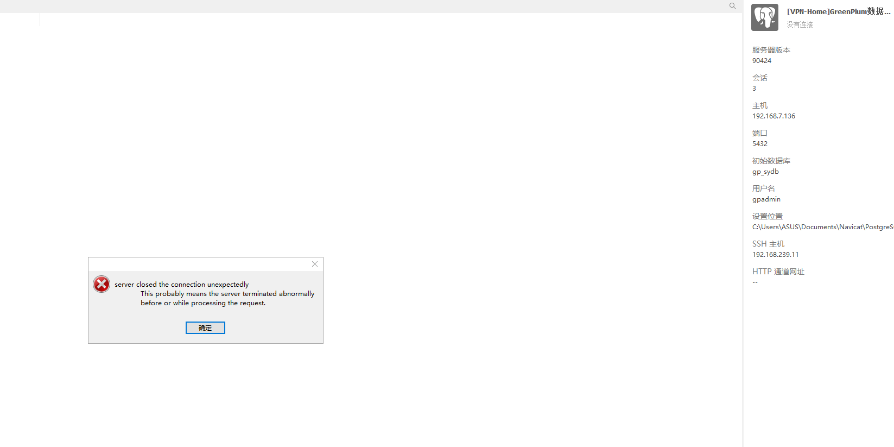
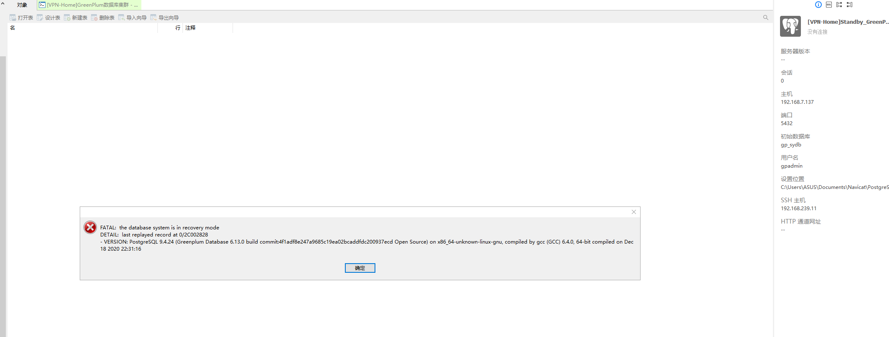

# GreenPlum集群实验室-6

> Author ：Heike07

[TOC]

## 实验六：新增Standby，HA高可用热备节点，模拟故障主备切换

### 主机准备

使用Standby-a主机，但是需要安装greenplum数据库并做初始化

```powershell
# 关闭防火墙
[root@Standby-a yum.repos.d]# systemctl disable firewalld --now
Removed symlink /etc/systemd/system/multi-user.target.wants/firewalld.service.
Removed symlink /etc/systemd/system/dbus-org.fedoraproject.FirewallD1.service.
[root@Standby-a yum.repos.d]# systemctl status firewalld
● firewalld.service - firewalld - dynamic firewall daemon
   Loaded: loaded (/usr/lib/systemd/system/firewalld.service; disabled; vendor preset: enabled)
   Active: inactive (dead)
     Docs: man:firewalld(1)

Jul 29 22:15:08 Standby-a systemd[1]: Starting firewalld - dynamic firewall daemon...
Jul 29 22:15:09 Standby-a systemd[1]: Started firewalld - dynamic firewall daemon.
Aug 07 19:27:12 Standby-a systemd[1]: Stopping firewalld - dynamic firewall daemon...
Aug 07 19:27:13 Standby-a systemd[1]: Stopped firewalld - dynamic firewall daemon.
[root@Standby-a yum.repos.d]#

# 安装基础依赖
269  yum install vim net-tools psmisc nc rsync lrzsz ntp libzstd openssl-static tree iotop git
270  yum install apr apr-util bash bzip2 curl krb5 libcurl libevent libxml2 libyaml zlib openldap openssh-client openssl openssl-libs perl readline rsync R sed tar zip krb5-devel
  
# 同步时间
[root@Standby-a yum.repos.d]# nmcli connection show
NAME                UUID                                  TYPE      DEVICE 
Wired connection 1  47449827-f338-3f07-be0b-1d41de2bb804  ethernet  ens36  
System ens33        44fa0ee9-e450-466a-a450-539830f2a487  ethernet  --     
[root@Standby-a yum.repos.d]# nmcli connection up 44fa0ee9-e450-466a-a450-539830f2a487
Connection successfully activated (D-Bus active path: /org/freedesktop/NetworkManager/ActiveConnection/2)
[root@Standby-a yum.repos.d]# ping www.baidu.com
PING www.a.shifen.com (39.156.66.14) 56(84) bytes of data.
64 bytes from 39.156.66.14 (39.156.66.14): icmp_seq=1 ttl=128 time=24.9 ms
64 bytes from 39.156.66.14 (39.156.66.14): icmp_seq=2 ttl=128 time=23.8 ms
^C
--- www.a.shifen.com ping statistics ---
2 packets transmitted, 2 received, 0% packet loss, time 1001ms
rtt min/avg/max/mdev = 23.879/24.416/24.954/0.559 ms
[root@Standby-a yum.repos.d]# ntpdate cn.pool.ntp.org
 7 Aug 13:23:44 ntpdate[8385]: adjust time server 202.112.29.82 offset -0.011103 sec
[root@Standby-a yum.repos.d]# date
Wed Aug  7 13:23:47 CST 2024
[root@Standby-a yum.repos.d]# nmcli connection down 44fa0ee9-e450-466a-a450-539830f2a487
Connection 'System ens33' successfully deactivated (D-Bus active path: /org/freedesktop/NetworkManager/ActiveConnection/2)
[root@Standby-a yum.repos.d]#

# 设置gpadmin用户密码以及免密其他节点
[root@Standby-a yum.repos.d]# groupadd gpadmin
[root@Standby-a yum.repos.d]# id gpadmin
id: gpadmin: no such user
[root@Standby-a yum.repos.d]# useradd gpadmin -r -m -g gpadmin
[root@Standby-a yum.repos.d]# id gpadmin
uid=997(gpadmin) gid=1000(gpadmin) groups=1000(gpadmin)
[root@Standby-a yum.repos.d]# passwd gpadmin
Changing password for user gpadmin.
New password:        
BAD PASSWORD: The password is shorter than 8 characters
Retype new password:        
passwd: all authentication tokens updated successfully.
[root@Standby-a yum.repos.d]# su - gpadmin
[gpadmin@Standby-a ~]$ ssh-keygen -t rsa
Generating public/private rsa key pair.
Enter file in which to save the key (/home/gpadmin/.ssh/id_rsa): 
Created directory '/home/gpadmin/.ssh'.
Enter passphrase (empty for no passphrase): 
Enter same passphrase again: 
Your identification has been saved in /home/gpadmin/.ssh/id_rsa.
Your public key has been saved in /home/gpadmin/.ssh/id_rsa.pub.
The key fingerprint is:
SHA256:ilRMAKhsh6TRAsa81/un64HntxNuaJsQ6uN8abgKbB4 gpadmin@Standby-a
The key's randomart image is:
+---[RSA 2048]----+
|=+.....          |
|=+.  o           |
|=oo . o          |
|o= o o           |
|. o ... S        |
|.  ..oo. .       |
|.E .oo+oo .      |
|+ +o +++o*       |
| oo== oBB.o      |
+----[SHA256]-----+
[gpadmin@Standby-a ~]$ ssh-copy-id Master-a
/bin/ssh-copy-id: INFO: Source of key(s) to be installed: "/home/gpadmin/.ssh/id_rsa.pub"
The authenticity of host 'master-a (192.168.7.136)' can't be established.
ECDSA key fingerprint is SHA256:ICELL8DOaZ7rN9rWXoqyfr5pz+bw523/FwwHjsi66QM.
ECDSA key fingerprint is MD5:06:6a:e0:62:f0:df:8a:be:2a:3e:95:51:05:f5:bd:da.
Are you sure you want to continue connecting (yes/no)? yes
/bin/ssh-copy-id: INFO: attempting to log in with the new key(s), to filter out any that are already installed
/bin/ssh-copy-id: INFO: 1 key(s) remain to be installed -- if you are prompted now it is to install the new keys
gpadmin@master-a's password:        

Number of key(s) added: 1

Now try logging into the machine, with:   "ssh 'Master-a'"
and check to make sure that only the key(s) you wanted were added.

[gpadmin@Standby-a ~]$ ssh-copy-id Segment-a
/bin/ssh-copy-id: INFO: Source of key(s) to be installed: "/home/gpadmin/.ssh/id_rsa.pub"
The authenticity of host 'segment-a (192.168.7.138)' can't be established.
ECDSA key fingerprint is SHA256:sTgeZrp9dUXMX/wO2qbJKvFurTOqBSbqOWYsoMK2Z1s.
ECDSA key fingerprint is MD5:06:b9:1a:65:b3:12:d8:be:f2:e6:f1:5c:e0:9e:2b:6c.
Are you sure you want to continue connecting (yes/no)? yes
/bin/ssh-copy-id: INFO: attempting to log in with the new key(s), to filter out any that are already installed
/bin/ssh-copy-id: INFO: 1 key(s) remain to be installed -- if you are prompted now it is to install the new keys
gpadmin@segment-a's password:        

Number of key(s) added: 1

Now try logging into the machine, with:   "ssh 'Segment-a'"
and check to make sure that only the key(s) you wanted were added.

[gpadmin@Standby-a ~]$ ssh-copy-id Segment-b
/bin/ssh-copy-id: INFO: Source of key(s) to be installed: "/home/gpadmin/.ssh/id_rsa.pub"
The authenticity of host 'segment-b (192.168.7.139)' can't be established.
ECDSA key fingerprint is SHA256:UNVqysnB3DIdtF5W35IlvIHRN6ZpVB61fu5HjWP/HbM.
ECDSA key fingerprint is MD5:ba:14:8a:f9:36:bc:24:4b:7b:81:51:1a:73:8d:52:d8.
Are you sure you want to continue connecting (yes/no)? yes
/bin/ssh-copy-id: INFO: attempting to log in with the new key(s), to filter out any that are already installed
/bin/ssh-copy-id: INFO: 1 key(s) remain to be installed -- if you are prompted now it is to install the new keys
gpadmin@segment-b's password:        

Number of key(s) added: 1

Now try logging into the machine, with:   "ssh 'Segment-b'"
and check to make sure that only the key(s) you wanted were added.

[gpadmin@Standby-a ~]$ ssh-copy-id Segment-c
/bin/ssh-copy-id: INFO: Source of key(s) to be installed: "/home/gpadmin/.ssh/id_rsa.pub"
The authenticity of host 'segment-c (192.168.7.141)' can't be established.
ECDSA key fingerprint is SHA256:GLOzhVa4h3m9pvgy7RlImPqrJsKQqu6MK0fVM4Mt/OE.
ECDSA key fingerprint is MD5:e7:7e:03:19:6e:1b:61:a9:41:11:a1:e2:d7:4e:e8:72.
Are you sure you want to continue connecting (yes/no)? yes
/bin/ssh-copy-id: INFO: attempting to log in with the new key(s), to filter out any that are already installed
/bin/ssh-copy-id: INFO: 1 key(s) remain to be installed -- if you are prompted now it is to install the new keys
gpadmin@segment-c's password:        

Number of key(s) added: 1

Now try logging into the machine, with:   "ssh 'Segment-c'"
and check to make sure that only the key(s) you wanted were added.

[gpadmin@Standby-a ~]$ ssh-copy-id Segment-d
/bin/ssh-copy-id: INFO: Source of key(s) to be installed: "/home/gpadmin/.ssh/id_rsa.pub"
The authenticity of host 'segment-d (192.168.7.140)' can't be established.
ECDSA key fingerprint is SHA256:I1f3uAfaIdL9/v9+FfzOQhluYIWG1sHOf+BP4euLdPg.
ECDSA key fingerprint is MD5:10:a4:29:ab:1e:97:35:67:ff:ad:3f:8a:d9:e2:be:a2.
Are you sure you want to continue connecting (yes/no)? yes
/bin/ssh-copy-id: INFO: attempting to log in with the new key(s), to filter out any that are already installed
/bin/ssh-copy-id: INFO: 1 key(s) remain to be installed -- if you are prompted now it is to install the new keys
gpadmin@segment-d's password:        

Number of key(s) added: 1

Now try logging into the machine, with:   "ssh 'Segment-d'"
and check to make sure that only the key(s) you wanted were added.

[gpadmin@Standby-a ~]$

# 数据库软件发送以及免密
[gpadmin@Standby-a opt]$ ssh Master-a
Last login: Wed Aug  7 11:16:45 2024
[gpadmin@Master-a ~]$ cd /home/gpadmin/soft/
[gpadmin@Master-a soft]$ ls
greenplum-db-6.13.0-rhel7-x86_64.rpm
[gpadmin@Master-a soft]$ ssh Standby-a "cd /home/gpadmin ; mkdir soft ; cd soft ; pwd"
The authenticity of host 'standby-a (192.168.7.137)' can't be established.
ECDSA key fingerprint is SHA256:gb6hObWbvOfrzfSszgMzI4WgAOXq32UbKwQv4C/DDIA.
ECDSA key fingerprint is MD5:42:00:ff:2a:d5:c4:eb:83:e6:7b:91:89:4c:2c:9c:2c.
Are you sure you want to continue connecting (yes/no)? no
Host key verification failed.
[gpadmin@Master-a soft]$ ssh Segment-a
Last login: Thu Jun 20 16:29:03 2024
[gpadmin@Segment-a ~]$ exit
logout
Connection to segment-a closed.
[gpadmin@Master-a soft]$ ssh-copy-id
Usage: /usr/bin/ssh-copy-id [-h|-?|-f|-n] [-i [identity_file]] [-p port] [[-o <ssh -o options>] ...] [user@]hostname
        -f: force mode -- copy keys without trying to check if they are already installed
        -n: dry run    -- no keys are actually copied
        -h|-?: print this help
[gpadmin@Master-a soft]$ ssh-copy-id Standby-a

/usr/bin/ssh-copy-id: ERROR: failed to open ID file '/home/gpadmin/.ssh/iddummy': No such file or directory
        (to install the contents of '/home/gpadmin/.ssh/iddummy.pub' anyway, look at the -f option)
[gpadmin@Master-a soft]$ cd ~/.ssh
[gpadmin@Master-a .ssh]$ ls
authorized_keys  config  iddummy.pub  id_rsa  id_rsa.pub  known_hosts
[gpadmin@Master-a .ssh]$ ll -h
total 16K
-rw------- 1 gpadmin gpadmin 2.4K Aug  7 13:26 authorized_keys
-rw-r--r-- 1 gpadmin gpadmin    0 Jun 20 11:39 config
-rw-r--r-- 1 gpadmin gpadmin    0 Jun 20 11:39 iddummy.pub
-rw------- 1 gpadmin gpadmin 1.7K Jun  6 14:50 id_rsa
-rw-r--r-- 1 gpadmin gpadmin  398 Jun  6 14:50 id_rsa.pub
-rw-r--r-- 1 gpadmin gpadmin 2.9K Jun 20 11:39 known_hosts
[gpadmin@Master-a .ssh]$ rm config iddummy.pub 
[gpadmin@Master-a .ssh]$ ssh-copy-id Standby-a
/usr/bin/ssh-copy-id: INFO: Source of key(s) to be installed: "/home/gpadmin/.ssh/id_rsa.pub"
The authenticity of host 'standby-a (192.168.7.137)' can't be established.
ECDSA key fingerprint is SHA256:gb6hObWbvOfrzfSszgMzI4WgAOXq32UbKwQv4C/DDIA.
ECDSA key fingerprint is MD5:42:00:ff:2a:d5:c4:eb:83:e6:7b:91:89:4c:2c:9c:2c.
Are you sure you want to continue connecting (yes/no)? yes
/usr/bin/ssh-copy-id: INFO: attempting to log in with the new key(s), to filter out any that are already installed
/usr/bin/ssh-copy-id: INFO: 1 key(s) remain to be installed -- if you are prompted now it is to install the new keys
gpadmin@standby-a's password:        

Number of key(s) added: 1

Now try logging into the machine, with:   "ssh 'Standby-a'"
and check to make sure that only the key(s) you wanted were added.

[gpadmin@Master-a .ssh]$ ssh Standby-a
Last login: Wed Aug  7 13:25:59 2024
[gpadmin@Standby-a ~]$ exit
logout
Connection to standby-a closed.
[gpadmin@Master-a .ssh]$ ll
total 16
-rw------- 1 gpadmin gpadmin 2393 Aug  7 13:26 authorized_keys
-rw------- 1 gpadmin gpadmin 1679 Jun  6 14:50 id_rsa
-rw-r--r-- 1 gpadmin gpadmin  398 Jun  6 14:50 id_rsa.pub
-rw-r--r-- 1 gpadmin gpadmin 3063 Aug  7 13:34 known_hosts
[gpadmin@Master-a .ssh]$ ssh Standby-a "cd /home/gpadmin ; mkdir soft ; cd soft ; pwd"
/home/gpadmin/soft
[gpadmin@Master-a .ssh]$ cd -
/home/gpadmin/soft
[gpadmin@Master-a soft]$ scp greenplum-db-6.13.0-rhel7-x86_64.rpm Standby-a:/home/gpadmin/soft
greenplum-db-6.13.0-rhel7-x86_64.rpm                                                                                          100%   66MB 139.5MB/s   00:00    
[gpadmin@Master-a soft]$

# 数据库安装
[gpadmin@Master-a soft]$ exit
logout
Connection to master-a closed.
[gpadmin@Standby-a opt]$ 
[gpadmin@Standby-a opt]$ 
[gpadmin@Standby-a opt]$ 
[gpadmin@Standby-a opt]$ 
[gpadmin@Standby-a opt]$ 
[gpadmin@Standby-a opt]$ 
[gpadmin@Standby-a opt]$ 
[gpadmin@Standby-a opt]$ 
[gpadmin@Standby-a opt]$ 
[gpadmin@Standby-a opt]$ cd /home/gpadmin/soft/
[gpadmin@Standby-a soft]$ yum install ./greenplum-db-6.13.0-rhel7-x86_64.rpm 
Loaded plugins: fastestmirror
You need to be root to perform this command.
[gpadmin@Standby-a soft]$ exit
logout
[root@Standby-a yum.repos.d]# cd /home/gpadmin/soft/
[root@Standby-a soft]# yum install ./greenplum-db-6.13.0-rhel7-x86_64.rpm 
Loaded plugins: fastestmirror
Examining ./greenplum-db-6.13.0-rhel7-x86_64.rpm: greenplum-db-6-6.13.0-1.el7.x86_64
Marking ./greenplum-db-6.13.0-rhel7-x86_64.rpm to be installed
Resolving Dependencies
--> Running transaction check
---> Package greenplum-db-6.x86_64 0:6.13.0-1.el7 will be installed
--> Finished Dependency Resolution

Dependencies Resolved

================================================================================================================================================================
 Package                             Arch                        Version                           Repository                                              Size
================================================================================================================================================================
Installing:
 greenplum-db-6                      x86_64                      6.13.0-1.el7                      /greenplum-db-6.13.0-rhel7-x86_64                      311 M

Transaction Summary
================================================================================================================================================================
Install  1 Package

Total size: 311 M
Installed size: 311 M
Is this ok [y/d/N]: y
Downloading packages:
Running transaction check
Running transaction test
Transaction test succeeded
Running transaction
  Installing : greenplum-db-6-6.13.0-1.el7.x86_64                                                                                                           1/1 
  Verifying  : greenplum-db-6-6.13.0-1.el7.x86_64                                                                                                           1/1 

Installed:
  greenplum-db-6.x86_64 0:6.13.0-1.el7                                                                                                                          

Complete!
[root@Standby-a soft]# cd /usr/local/
[root@Standby-a local]# ll
total 0
drwxr-xr-x.  2 root root   6 Apr 11  2018 bin
drwxr-xr-x.  2 root root   6 Apr 11  2018 etc
drwxr-xr-x.  2 root root   6 Apr 11  2018 games
lrwxrwxrwx   1 root root  30 Aug  7 13:37 greenplum-db -> /usr/local/greenplum-db-6.13.0
drwxr-xr-x  11 root root 238 Aug  7 13:37 greenplum-db-6.13.0
drwxr-xr-x.  2 root root   6 Apr 11  2018 include
drwxr-xr-x.  2 root root   6 Apr 11  2018 lib
drwxr-xr-x.  2 root root   6 Apr 11  2018 lib64
drwxr-xr-x.  2 root root   6 Apr 11  2018 libexec
drwxr-xr-x.  2 root root   6 Apr 11  2018 sbin
drwxr-xr-x.  5 root root  49 Jun  4 18:29 share
drwxr-xr-x.  2 root root   6 Apr 11  2018 src
[root@Standby-a local]#

# 其他节点对新增节点得免密登陆测试
[gpadmin@Standby-a .ssh]$ ssh-copy-id Standby-a
/usr/bin/ssh-copy-id: INFO: Source of key(s) to be installed: "/home/gpadmin/.ssh/id_rsa.pub"
The authenticity of host 'standby-a (192.168.7.137)' can't be established.
ECDSA key fingerprint is SHA256:gb6hObWbvOfrzfSszgMzI4WgAOXq32UbKwQv4C/DDIA.
ECDSA key fingerprint is MD5:42:00:ff:2a:d5:c4:eb:83:e6:7b:91:89:4c:2c:9c:2c.
Are you sure you want to continue connecting (yes/no)? yes
/usr/bin/ssh-copy-id: INFO: attempting to log in with the new key(s), to filter out any that are already installed
/usr/bin/ssh-copy-id: INFO: 1 key(s) remain to be installed -- if you are prompted now it is to install the new keys
gpadmin@standby-a's password:        

Number of key(s) added: 1

Now try logging into the machine, with:   "ssh 'Standby-a'"
and check to make sure that only the key(s) you wanted were added.

[gpadmin@Standby-a .ssh]$ ssh Standby-a "pwd" ; ssh Master-a "pwd" ; ssh Segment-a "pwd" ; ssh Segment-b "pwd" ; ssh Segment-c "pwd" ; ssh Segment-d "pwd"
/home/gpadmin
/home/gpadmin
/home/gpadmin
/home/gpadmin
/home/gpadmin
/home/gpadmin
[gpadmin@Standby-a .ssh]$

[gpadmin@Standby-a .ssh]$ ssh Standby-a "pwd" ; ssh Master-a "pwd" ; ssh Segment-a "pwd" ; ssh Segment-b "pwd" ; ssh Segment-c "pwd" ; ssh Segment-d "pwd"
/home/gpadmin
/home/gpadmin
/home/gpadmin
/home/gpadmin
/home/gpadmin
/home/gpadmin
[gpadmin@Standby-a .ssh]$ ssh Master-a
Last login: Wed Aug  7 13:41:38 2024 from 192.168.7.137
[gpadmin@Master-a ~]$ ssh Standby-a "pwd" ; ssh Master-a "pwd" ; ssh Segment-a "pwd" ; ssh Segment-b "pwd" ; ssh Segment-c "pwd" ; ssh Segment-d "pwd"
/home/gpadmin
/home/gpadmin
/home/gpadmin
/home/gpadmin
/home/gpadmin
/home/gpadmin
[gpadmin@Master-a ~]$ ssh Segment-a
Last login: Wed Aug  7 13:27:40 2024 from 192.168.7.136
[gpadmin@Segment-a ~]$ ssh Standby-a "pwd" ; ssh Master-a "pwd" ; ssh Segment-a "pwd" ; ssh Segment-b "pwd" ; ssh Segment-c "pwd" ; ssh Segment-d "pwd"
The authenticity of host 'standby-a (192.168.7.137)' can't be established.
ECDSA key fingerprint is SHA256:gb6hObWbvOfrzfSszgMzI4WgAOXq32UbKwQv4C/DDIA.
ECDSA key fingerprint is MD5:42:00:ff:2a:d5:c4:eb:83:e6:7b:91:89:4c:2c:9c:2c.
Are you sure you want to continue connecting (yes/no)? ^C
[gpadmin@Segment-a ~]$

Segment-a 报错了 也就是abcd 都没有做 standby-a得免密 做一下

[gpadmin@Segment-d .ssh]$ ssh Standby-a "pwd" ; ssh Master-a "pwd" ; ssh Segment-a "pwd" ; ssh Segment-b "pwd" ; ssh Segment-c "pwd" ; ssh Segment-d "pwd"
/home/gpadmin
/home/gpadmin
/home/gpadmin
/home/gpadmin
/home/gpadmin
/home/gpadmin
[gpadmin@Segment-d .ssh]$
```

### 创建stardby节点

```powershell
# 创建磁盘镜像 -VM全部节点
# 第一次构建stadby节点

[gpadmin@Master-a ~]$ gpssh -h Standby-a -e 'makdir -p /home/gpadmin/data/master'
[Standby-a] makdir -p /home/gpadmin/data/master
[Standby-a] -bash: makdir: command not found
[gpadmin@Master-a ~]$ gpssh -h Standby-a -e 'mkdir -p /home/gpadmin/data/master'
[Standby-a] mkdir -p /home/gpadmin/data/master
[gpadmin@Master-a ~]$ gpssh -h Standby-a -e 'chown gpadmin:gpadmin /home/gpadmin/data/master'
[Standby-a] chown gpadmin:gpadmin /home/gpadmin/data/master
[gpadmin@Master-a ~]$

[gpadmin@Master-a ~]$ gpinitstandby -s Standby-a
20240807:15:11:10:049044 gpinitstandby:Master-a:gpadmin-[INFO]:-Validating environment and parameters for standby initialization...
20240807:15:11:10:049044 gpinitstandby:Master-a:gpadmin-[INFO]:-Checking for data directory /home/gpadmin/data/master/gpseg-1 on Standby-a
20240807:15:11:10:049044 gpinitstandby:Master-a:gpadmin-[INFO]:------------------------------------------------------
20240807:15:11:10:049044 gpinitstandby:Master-a:gpadmin-[INFO]:-Greenplum standby master initialization parameters
20240807:15:11:10:049044 gpinitstandby:Master-a:gpadmin-[INFO]:------------------------------------------------------
20240807:15:11:10:049044 gpinitstandby:Master-a:gpadmin-[INFO]:-Greenplum master hostname               = Master-a
20240807:15:11:10:049044 gpinitstandby:Master-a:gpadmin-[INFO]:-Greenplum master data directory         = /home/gpadmin/data/master/gpseg-1
20240807:15:11:10:049044 gpinitstandby:Master-a:gpadmin-[INFO]:-Greenplum master port                   = 5432
20240807:15:11:10:049044 gpinitstandby:Master-a:gpadmin-[INFO]:-Greenplum standby master hostname       = Standby-a
20240807:15:11:10:049044 gpinitstandby:Master-a:gpadmin-[INFO]:-Greenplum standby master port           = 5432
20240807:15:11:10:049044 gpinitstandby:Master-a:gpadmin-[INFO]:-Greenplum standby master data directory = /home/gpadmin/data/master/gpseg-1
20240807:15:11:10:049044 gpinitstandby:Master-a:gpadmin-[INFO]:-Greenplum update system catalog         = On
Do you want to continue with standby master initialization? Yy|Nn (default=N):
> y
20240807:15:11:12:049044 gpinitstandby:Master-a:gpadmin-[INFO]:-Syncing Greenplum Database extensions to standby
20240807:15:11:13:049044 gpinitstandby:Master-a:gpadmin-[WARNING]:-Syncing of Greenplum Database extensions has failed.
20240807:15:11:13:049044 gpinitstandby:Master-a:gpadmin-[WARNING]:-Please run gppkg --clean after successful standby initialization.
20240807:15:11:13:049044 gpinitstandby:Master-a:gpadmin-[INFO]:-Adding standby master to catalog...
20240807:15:11:13:049044 gpinitstandby:Master-a:gpadmin-[INFO]:-Database catalog updated successfully.
20240807:15:11:13:049044 gpinitstandby:Master-a:gpadmin-[INFO]:-Updating pg_hba.conf file...
20240807:15:11:13:049044 gpinitstandby:Master-a:gpadmin-[INFO]:-pg_hba.conf files updated successfully.
20240807:15:11:15:049044 gpinitstandby:Master-a:gpadmin-[INFO]:-Starting standby master
20240807:15:11:15:049044 gpinitstandby:Master-a:gpadmin-[INFO]:-Checking if standby master is running on host: Standby-a  in directory: /home/gpadmin/data/master/gpseg-1
20240807:15:11:18:049044 gpinitstandby:Master-a:gpadmin-[INFO]:-Cleaning up pg_hba.conf backup files...
20240807:15:11:18:049044 gpinitstandby:Master-a:gpadmin-[INFO]:-Backup files of pg_hba.conf cleaned up successfully.
20240807:15:11:18:049044 gpinitstandby:Master-a:gpadmin-[INFO]:-Successfully created standby master on Standby-a
[gpadmin@Master-a ~]$

[gpadmin@Master-a ~]$ gpstate
20240807:15:11:58:050844 gpstate:Master-a:gpadmin-[INFO]:-Starting gpstate with args: 
20240807:15:11:58:050844 gpstate:Master-a:gpadmin-[INFO]:-local Greenplum Version: 'postgres (Greenplum Database) 6.13.0 build commit:4f1adf8e247a9685c19ea02bcaddfdc200937ecd Open Source'
20240807:15:11:58:050844 gpstate:Master-a:gpadmin-[INFO]:-master Greenplum Version: 'PostgreSQL 9.4.24 (Greenplum Database 6.13.0 build commit:4f1adf8e247a9685c19ea02bcaddfdc200937ecd Open Source) on x86_64-unknown-linux-gnu, compiled by gcc (GCC) 6.4.0, 64-bit compiled on Dec 18 2020 22:31:16'
20240807:15:11:58:050844 gpstate:Master-a:gpadmin-[INFO]:-Obtaining Segment details from master...
20240807:15:11:58:050844 gpstate:Master-a:gpadmin-[INFO]:-Gathering data from segments...
20240807:15:11:59:050844 gpstate:Master-a:gpadmin-[INFO]:-Greenplum instance status summary
20240807:15:11:59:050844 gpstate:Master-a:gpadmin-[INFO]:-----------------------------------------------------
20240807:15:11:59:050844 gpstate:Master-a:gpadmin-[INFO]:-   Master instance                                           = Active
20240807:15:11:59:050844 gpstate:Master-a:gpadmin-[INFO]:-   Master standby                                            = Standby-a
20240807:15:11:59:050844 gpstate:Master-a:gpadmin-[INFO]:-   Standby master state                                      = Standby host passive
20240807:15:11:59:050844 gpstate:Master-a:gpadmin-[INFO]:-   Total segment instance count from metadata                = 40
20240807:15:11:59:050844 gpstate:Master-a:gpadmin-[INFO]:-----------------------------------------------------
20240807:15:11:59:050844 gpstate:Master-a:gpadmin-[INFO]:-   Primary Segment Status
20240807:15:11:59:050844 gpstate:Master-a:gpadmin-[INFO]:-----------------------------------------------------
20240807:15:11:59:050844 gpstate:Master-a:gpadmin-[INFO]:-   Total primary segments                                    = 20
20240807:15:11:59:050844 gpstate:Master-a:gpadmin-[INFO]:-   Total primary segment valid (at master)                   = 20
20240807:15:11:59:050844 gpstate:Master-a:gpadmin-[INFO]:-   Total primary segment failures (at master)                = 0
20240807:15:11:59:050844 gpstate:Master-a:gpadmin-[INFO]:-   Total number of postmaster.pid files missing              = 0
20240807:15:11:59:050844 gpstate:Master-a:gpadmin-[INFO]:-   Total number of postmaster.pid files found                = 20
20240807:15:11:59:050844 gpstate:Master-a:gpadmin-[INFO]:-   Total number of postmaster.pid PIDs missing               = 0
20240807:15:11:59:050844 gpstate:Master-a:gpadmin-[INFO]:-   Total number of postmaster.pid PIDs found                 = 20
20240807:15:11:59:050844 gpstate:Master-a:gpadmin-[INFO]:-   Total number of /tmp lock files missing                   = 0
20240807:15:11:59:050844 gpstate:Master-a:gpadmin-[INFO]:-   Total number of /tmp lock files found                     = 20
20240807:15:11:59:050844 gpstate:Master-a:gpadmin-[INFO]:-   Total number postmaster processes missing                 = 0
20240807:15:11:59:050844 gpstate:Master-a:gpadmin-[INFO]:-   Total number postmaster processes found                   = 20
20240807:15:11:59:050844 gpstate:Master-a:gpadmin-[INFO]:-----------------------------------------------------
20240807:15:11:59:050844 gpstate:Master-a:gpadmin-[INFO]:-   Mirror Segment Status
20240807:15:11:59:050844 gpstate:Master-a:gpadmin-[INFO]:-----------------------------------------------------
20240807:15:11:59:050844 gpstate:Master-a:gpadmin-[INFO]:-   Total mirror segments                                     = 20
20240807:15:11:59:050844 gpstate:Master-a:gpadmin-[INFO]:-   Total mirror segment valid (at master)                    = 20
20240807:15:11:59:050844 gpstate:Master-a:gpadmin-[INFO]:-   Total mirror segment failures (at master)                 = 0
20240807:15:11:59:050844 gpstate:Master-a:gpadmin-[INFO]:-   Total number of postmaster.pid files missing              = 0
20240807:15:11:59:050844 gpstate:Master-a:gpadmin-[INFO]:-   Total number of postmaster.pid files found                = 20
20240807:15:11:59:050844 gpstate:Master-a:gpadmin-[INFO]:-   Total number of postmaster.pid PIDs missing               = 0
20240807:15:11:59:050844 gpstate:Master-a:gpadmin-[INFO]:-   Total number of postmaster.pid PIDs found                 = 20
20240807:15:11:59:050844 gpstate:Master-a:gpadmin-[INFO]:-   Total number of /tmp lock files missing                   = 0
20240807:15:11:59:050844 gpstate:Master-a:gpadmin-[INFO]:-   Total number of /tmp lock files found                     = 20
20240807:15:11:59:050844 gpstate:Master-a:gpadmin-[INFO]:-   Total number postmaster processes missing                 = 0
20240807:15:11:59:050844 gpstate:Master-a:gpadmin-[INFO]:-   Total number postmaster processes found                   = 20
20240807:15:11:59:050844 gpstate:Master-a:gpadmin-[INFO]:-   Total number mirror segments acting as primary segments   = 0
20240807:15:11:59:050844 gpstate:Master-a:gpadmin-[INFO]:-   Total number mirror segments acting as mirror segments    = 20
20240807:15:11:59:050844 gpstate:Master-a:gpadmin-[INFO]:-----------------------------------------------------
20240807:15:11:59:050844 gpstate:Master-a:gpadmin-[INFO]:-   Cluster Expansion                                         = In Progress
20240807:15:11:59:050844 gpstate:Master-a:gpadmin-[INFO]:-----------------------------------------------------
[gpadmin@Master-a ~]$

[gpadmin@Standby-a .ssh]$ cd /home/gpadmin/data/
[gpadmin@Standby-a data]$ ls
master
[gpadmin@Standby-a data]$ cd master/
[gpadmin@Standby-a master]$ ls
gpseg-1
[gpadmin@Standby-a master]$ cd gpseg-1/
[gpadmin@Standby-a gpseg-1]$ ls
backup_label.old        gpperfmon           pg_clog            pg_ident.conf  pg_notify     pg_stat      pg_twophase            postgresql.auto.conf  recovery.conf
base                    gpsegconfig_dump    pg_distributedlog  pg_log         pg_replslot   pg_stat_tmp  pg_utilitymodedtmredo  postgresql.conf
global                  gpssh.conf          pg_dynshmem        pg_logical     pg_serial     pg_subtrans  PG_VERSION             postmaster.opts
gpexpand.status_detail  internal.auto.conf  pg_hba.conf        pg_multixact   pg_snapshots  pg_tblspc    pg_xlog                postmaster.pid
[gpadmin@Standby-a gpseg-1]$ du -h .
0       ./pg_xlog/archive_status
64M     ./pg_xlog
4.3M    ./global
32K     ./pg_clog
0       ./pg_dynshmem
32K     ./pg_notify
0       ./pg_serial
0       ./pg_snapshots
0       ./pg_subtrans
0       ./pg_twophase
32K     ./pg_multixact/members
32K     ./pg_multixact/offsets
64K     ./pg_multixact
17M     ./base/1
17M     ./base/12809
17M     ./base/12812
17M     ./base/16384
17M     ./base/16385
17M     ./base/16410
99M     ./base
0       ./pg_replslot
0       ./pg_tblspc
0       ./pg_stat
0       ./pg_stat_tmp
0       ./pg_logical/snapshots
0       ./pg_logical/mappings
0       ./pg_logical
32K     ./pg_distributedlog
0       ./pg_utilitymodedtmredo
8.0K    ./pg_log
4.0K    ./gpperfmon/conf
4.0K    ./gpperfmon
167M    .

[gpadmin@Master-a data]$ du -h master/
0       master/gpseg-1/pg_xlog/archive_status
448M    master/gpseg-1/pg_xlog
4.3M    master/gpseg-1/global
32K     master/gpseg-1/pg_clog
0       master/gpseg-1/pg_dynshmem
32K     master/gpseg-1/pg_notify
0       master/gpseg-1/pg_serial
0       master/gpseg-1/pg_snapshots
32K     master/gpseg-1/pg_subtrans
0       master/gpseg-1/pg_twophase
32K     master/gpseg-1/pg_multixact/members
32K     master/gpseg-1/pg_multixact/offsets
64K     master/gpseg-1/pg_multixact
17M     master/gpseg-1/base/1
17M     master/gpseg-1/base/12809
17M     master/gpseg-1/base/12812
17M     master/gpseg-1/base/16384
17M     master/gpseg-1/base/16385
0       master/gpseg-1/base/pgsql_tmp
17M     master/gpseg-1/base/16410
99M     master/gpseg-1/base
0       master/gpseg-1/pg_replslot
0       master/gpseg-1/pg_tblspc
0       master/gpseg-1/pg_stat
0       master/gpseg-1/pg_stat_tmp
0       master/gpseg-1/pg_logical/snapshots
0       master/gpseg-1/pg_logical/mappings
0       master/gpseg-1/pg_logical
32K     master/gpseg-1/pg_distributedlog
0       master/gpseg-1/pg_utilitymodedtmredo
3.1M    master/gpseg-1/pg_log
4.0K    master/gpseg-1/gpperfmon/conf
0       master/gpseg-1/gpperfmon/logs
0       master/gpseg-1/gpperfmon/data
4.0K    master/gpseg-1/gpperfmon
555M    master/gpseg-1
555M    master/
[gpadmin@Master-a data]$

# 配置文件同步

[gpadmin@Standby-a ~]$ scp Master-a:/home/.bashrc .
scp: /home/.bashrc: No such file or directory
[gpadmin@Standby-a ~]$ scp Master-a:/home/gpadmin/.bashrc .
.bashrc                                                                                                                                          100%  449   980.2KB/s   00:00    
[gpadmin@Standby-a ~]$ cat .bashrc 
# .bashrc

# Source global definitions
if [ -f /etc/bashrc ]; then
        . /etc/bashrc
fi

# Uncomment the following line if you don't like systemctl's auto-paging feature:
# export SYSTEMD_PAGER=

# User specific aliases and functions

source /usr/local/greenplum-db/greenplum_path.sh
export PGPORT=5432
export PGUSER=gpadmin
export MASTER_DATA_DIRECTORY=/home/gpadmin/data/master/gpseg-1
export PGDATABASE=gp_sydb
export LD_PRELOAD=/lib64/libz.so.1 ps
[gpadmin@Standby-a ~]$


[gpadmin@Standby-a ~]$ cd /etc/security/limits.d/
[gpadmin@Standby-a limits.d]$ ls
20-nproc.conf
[gpadmin@Standby-a limits.d]$ pwd
/etc/security/limits.d
[gpadmin@Standby-a limits.d]$ scp Master-a:/etc/security/limits.d/* .
./20-nproc.conf: Permission denied
[gpadmin@Standby-a limits.d]$ exit
exit
[root@Standby-a local]# cd /etc/security/limits.d/l
[root@Standby-a limits.d]# s
20-nproc.conf
[root@Standby-a limits.d]# scp Master-a:/etc/security/limits.d/* .
root@master-a's password:       
20-nproc.conf                                                                                                                                    100%  324   159.4KB/s   00:00    
[root@Standby-a limits.d]# cd ..
[root@Standby-a security]# ls
access.conf  console.apps      console.perms    group.conf   limits.d        namespace.d     opasswd       pwquality.conf  time.conf
chroot.conf  console.handlers  console.perms.d  limits.conf  namespace.conf  namespace.init  pam_env.conf  sepermit.conf
[root@Standby-a security]# scp Master-a:/etc/security/limits.conf .
root@master-a's password:       
limits.conf                                                                                                                                      100% 2555     1.4MB/s   00:00    
[root@Standby-a security]# cd ..
[root@Standby-a etc]# cd sysctl.d/l
[root@Standby-a sysctl.d]# s
99-sysctl.conf
[root@Standby-a sysctl.d]# cat 99-sysctl.conf 
# sysctl settings are defined through files in
# /usr/lib/sysctl.d/, /run/sysctl.d/, and /etc/sysctl.d/.
#
# Vendors settings live in /usr/lib/sysctl.d/.
# To override a whole file, create a new file with the same in
# /etc/sysctl.d/ and put new settings there. To override
# only specific settings, add a file with a lexically later
# name in /etc/sysctl.d/ and put new settings there.
#
# For more information, see sysctl.conf(5) and sysctl.d(5).
[root@Standby-a sysctl.d]# cd ..
[root@Standby-a etc]# cat sysctl.conf 
# sysctl settings are defined through files in
# /usr/lib/sysctl.d/, /run/sysctl.d/, and /etc/sysctl.d/.
#
# Vendors settings live in /usr/lib/sysctl.d/.
# To override a whole file, create a new file with the same in
# /etc/sysctl.d/ and put new settings there. To override
# only specific settings, add a file with a lexically later
# name in /etc/sysctl.d/ and put new settings there.
#
# For more information, see sysctl.conf(5) and sysctl.d(5).
[root@Standby-a etc]# pwd
/etc
[root@Standby-a etc]# scp Master-a:/etc/sysctl.conf .
root@master-a's password:     
Permission denied, please try again.
root@master-a's password:       
sysctl.conf                                                                                                                                      100% 1151   476.1KB/s   00:00    
[root@Standby-a etc]# cat /etc/sysctl.conf 
# sysctl settings are defined through files in
# /usr/lib/sysctl.d/, /run/sysctl.d/, and /etc/sysctl.d/.
#
# Vendors settings live in /usr/lib/sysctl.d/.
# To override a whole file, create a new file with the same in
# /etc/sysctl.d/ and put new settings there. To override
# only specific settings, add a file with a lexically later
# name in /etc/sysctl.d/ and put new settings there.
#
# For more information, see sysctl.conf(5) and sysctl.d(5).
#
kernel.shmall = 232879
kernel.shmmax = 953872384
kernel.shmmni = 4096
vm.overcommit_memory = 2
vm.overcommit_ratio = 95
net.ipv4.ip_local_port_range = 10000 65535
kernel.sysrq = 1
kernel.core_uses_pid = 1
kernel.msgmnb = 65536
kernel.msgmax = 65536
kernel.msgmni = 2048
net.ipv4.tcp_syncookies = 1
net.ipv4.conf.default.accept_source_route = 0
net.ipv4.tcp_max_syn_backlog = 4096
net.ipv4.conf.all.arp_filter = 1
net.core.netdev_max_backlog = 10000
net.core.rmem_max = 2097152
net.core.wmem_max = 2097152
vm.swappiness = 10
vm.zone_reclaim_mode = 0
vm.dirty_expire_centisecs = 500
vm.dirty_writeback_centisecs = 100
vm.dirty_background_ratio = 3
vm.dirty_ratio = 10
kernel.sem = 250 2048000 200 8192
[root@Standby-a etc]#

[root@Standby-a etc]# su gpadmin
[gpadmin@Standby-a etc]$ gpssh
COMMAND NAME: gpssh

Provides ssh access to multiple hosts at once.


*****************************************************
SYNOPSIS
*****************************************************

gpssh { -f <hostfile_gpssh> | -h <hostname> [-h <hostname> ...] } 
[-u userid] [-s] [-v] [-e] [-d seconds] [-t multiplier] [<bash_command>]

gpssh -? 

gpssh --version


*****************************************************
DESCRIPTION
*****************************************************

The gpssh utility allows you to run bash shell commands on 
multiple hosts at once using SSH (secure shell). You can execute 
a single command by specifying it on the command-line, or omit 
the command to enter into an interactive command-line session. 

To specify the hosts involved in the SSH session, use the -f 
option to specify a file containing a list of host names, or use 
the -h option to name single host names on the command-line. At 
least one host name (-h) or a host file (-f) is required. Note that 
the current host is not included in the session by default  to 
include the local host, you must explicitly declare it in the 
list of hosts involved in the session.

Before using gpssh, you must have a trusted host setup between 
the hosts involved in the SSH session. You can use the utility 
gpssh-exkeys to update the known host files and exchange public 
keys between hosts if you have not done so already.

If you do not specify a command on the command-line, gpssh will 
go into interactive mode. At the gpssh command prompt (=>), you 
can enter a command as you would in a regular bash terminal command-line, 
and the command will be executed on all hosts involved in the session. 
To end an interactive session, press CTRL+D on the keyboard or type exit.

If a user name is not specified in the host list file, gpssh will 
execute commands as the currently logged in user. To determine the 
currently logged in user, do a whoami command. By default, gpssh goes 
to $HOME of the session user on the remote hosts after login. To ensure 
commands are executed correctly on all remote hosts, you should always 
enter absolute paths.

If you encounter network timeout problems when using gpssh, you can
use -d and -t options or set parameters in the gpssh.conf file to
control the timing that gpssh uses when validating the initial ssh
connection. For information about the configuration file, see gpssh
Configuration File.

*****************************************************
OPTIONS
*****************************************************

<bash_command>

 A bash shell command to execute on all hosts involved in this 
 session (optionally enclosed in quotes). If not specified, gpssh 
 will start an interactive session.


-d (delay) seconds

 Optional. Specifies the time, in seconds, to wait at the start of a
 gpssh interaction with ssh. Default is 0.05. This option overrides the
 delaybeforesend value that is specified in the gpssh.conf configuration
 file.

 Increasing this value can cause a long wait time during gpssh startup.


-e (echo)

 Optional. Echoes the commands passed to each host and their 
 resulting output while running in non-interactive mode.


-f <hostfile_gpssh>

 Specifies the name of a file that contains a list of hosts that 
 will participate in this SSH session. The host name is required.
 The syntax of the host file is one host per line as follows:
  
  <hostname>


-h <hostname>

 Specifies a single host name that will participate in this SSH session. 
 You can use the -h option multiple times to specify multiple host names.

 
-s

 Optional. If specified, before executing any commands on the target 
 host, gpssh sources the file greenplum_path.sh in the directory 
 specified by the $GPHOME environment variable. 

 This option is valid for both interactive mode and single command mode. 


-t multiplier

 Optional. A decimal number greater than 0 (zero) that is the multiplier
 for the timeout that gpssh uses when validating the ssh prompt. Default
 is 1. This option overrides the prompt_validation_timeout value that is
 specified in the gpssh.conf configuration file.

 Increasing this value has a small impact during gpssh startup.


-u <userid>

 Specifies the userid for this SSH session. 


-v (verbose mode)

 Optional. Reports additional messages in addition to the command 
 output when running in non-interactive mode.


--version

 Displays the version of this utility.


-? (help)

 Displays the online help.


*****************************************************
gpssh Configuration File
*****************************************************
The gpssh.conf file contains parameters that let you adjust the timing
that gpssh uses when validating the initial ssh connection. These
parameters affect the network connection before the gpssh session
executes commands with ssh. The location of the file is specified by the
environment variable MASTER_DATA_DIRECTORY. If the environment variable
is not defined or the gpssh.conf file does not exist in the directory
gpssh uses the default values or the values set with the -d and -t
options. For information about the environment variable, see the
Greenplum Database Reference Guide.

The gpssh.conf file is a text file that consists of a [gpssh] section
and parameters. On a line, the # (pound sign) indicates the start of a
comment. This is an example gpssh.conf file.


    [gpssh]
    delaybeforesend = 0.05
    prompt_validation_timeout = 1.0
    sync_retries = 3


These are the gpssh.conf parameters.

delaybeforesend = seconds

 Specifies the time, in seconds, to wait at the start of a gpssh
 interaction with ssh. Default is 0.05. Increasing this value can
 cause a long wait time during gpssh startup. The -d option
 overrides this parameter.

prompt_validation_timeout = multiplier

 A decimal number greater than 0 (zero) that is the multiplier for the
 timeout that gpssh uses when validating the ssh prompt. Increasing this
 value has a small impact during gpssh startup. Default is 1. The -t
 option overrides this parameter.

sync_retry = attempts

 A non-negative integer that specifies the maximum number of retry attempts
 that gpssh performs to try connecting to a Greenplum Database remote host. The
 default is 3. If the value is 0, gpssh returns an error if the initial
 connection attempt fails. This parameter cannot be configured with a
 command-line option.

 Increasing this value compensates for slow network performance or performance
 issues such as heavy CPU or I/O load on the segment host. However, when a
 connection cannot be established, an increased value also increases the delay
 when an error is returned.


*****************************************************
EXAMPLES
*****************************************************

Start an interactive group SSH session with all hosts listed 
in the file hostfile_gpssh:

  $ gpssh -f hostfile_gpssh


At the gpssh interactive command prompt, run a shell command 
on all the hosts involved in this session.

  => ls -a /data/primary/*

Exit an interactive session:

  => exit


Start a non-interactive group SSH session with the hosts named 
sdw1 and sdw2 and pass a file containing several commands 
named command_file to gpssh:

  $ gpssh -h sdw1 -h sdw2 -v -e < command_file


Execute single commands in non-interactive mode on hosts 
sdw2 and localhost:

  $ gpssh -h sdw2 -h localhost -v -e 'ls -a /data/primary/*'

  $ gpssh -h sdw2 -h localhost -v -e 'echo $GPHOME'

  $ gpssh -h sdw2 -h localhost -v -e 'ls -1 | wc -l'


*****************************************************
SEE ALSO
*****************************************************

gpssh-exkeys, gpscp

Error: please specify at least one of -h or -f args, but not both
[gpadmin@Standby-a etc]$

[gpadmin@Standby-a etc]$ gpstate
20240807:15:25:19:022497 gpstate:Standby-a:gpadmin-[INFO]:-Starting gpstate with args: 
20240807:15:25:19:022497 gpstate:Standby-a:gpadmin-[INFO]:-local Greenplum Version: 'postgres (Greenplum Database) 6.13.0 build commit:4f1adf8e247a9685c19ea02bcaddfdc200937ecd Open Source'
20240807:15:25:19:022497 gpstate:Standby-a:gpadmin-[CRITICAL]:-gpstate failed. (Reason='FATAL:  the database system is in recovery mode
DETAIL:  last replayed record at 0/2C0000A8
- VERSION: PostgreSQL 9.4.24 (Greenplum Database 6.13.0 build commit:4f1adf8e247a9685c19ea02bcaddfdc200937ecd Open Source) on x86_64-unknown-linux-gnu, compiled by gcc (GCC) 6.4.0, 64-bit compiled on Dec 18 2020 22:31:16
') exiting...
[gpadmin@Standby-a etc]$

[gpadmin@Master-a security]$ gpstate
20240807:15:25:57:081291 gpstate:Master-a:gpadmin-[INFO]:-Starting gpstate with args: 
20240807:15:25:57:081291 gpstate:Master-a:gpadmin-[INFO]:-local Greenplum Version: 'postgres (Greenplum Database) 6.13.0 build commit:4f1adf8e247a9685c19ea02bcaddfdc200937ecd Open Source'
20240807:15:25:57:081291 gpstate:Master-a:gpadmin-[INFO]:-master Greenplum Version: 'PostgreSQL 9.4.24 (Greenplum Database 6.13.0 build commit:4f1adf8e247a9685c19ea02bcaddfdc200937ecd Open Source) on x86_64-unknown-linux-gnu, compiled by gcc (GCC) 6.4.0, 64-bit compiled on Dec 18 2020 22:31:16'
20240807:15:25:57:081291 gpstate:Master-a:gpadmin-[INFO]:-Obtaining Segment details from master...
20240807:15:25:57:081291 gpstate:Master-a:gpadmin-[INFO]:-Gathering data from segments...
20240807:15:25:57:081291 gpstate:Master-a:gpadmin-[INFO]:-Greenplum instance status summary
20240807:15:25:57:081291 gpstate:Master-a:gpadmin-[INFO]:-----------------------------------------------------
20240807:15:25:57:081291 gpstate:Master-a:gpadmin-[INFO]:-   Master instance                                           = Active
20240807:15:25:57:081291 gpstate:Master-a:gpadmin-[INFO]:-   Master standby                                            = Standby-a
20240807:15:25:57:081291 gpstate:Master-a:gpadmin-[INFO]:-   Standby master state                                      = Standby host passive
20240807:15:25:57:081291 gpstate:Master-a:gpadmin-[INFO]:-   Total segment instance count from metadata                = 40
20240807:15:25:57:081291 gpstate:Master-a:gpadmin-[INFO]:-----------------------------------------------------
20240807:15:25:57:081291 gpstate:Master-a:gpadmin-[INFO]:-   Primary Segment Status
20240807:15:25:57:081291 gpstate:Master-a:gpadmin-[INFO]:-----------------------------------------------------
20240807:15:25:57:081291 gpstate:Master-a:gpadmin-[INFO]:-   Total primary segments                                    = 20
20240807:15:25:57:081291 gpstate:Master-a:gpadmin-[INFO]:-   Total primary segment valid (at master)                   = 20
20240807:15:25:57:081291 gpstate:Master-a:gpadmin-[INFO]:-   Total primary segment failures (at master)                = 0
20240807:15:25:57:081291 gpstate:Master-a:gpadmin-[INFO]:-   Total number of postmaster.pid files missing              = 0
20240807:15:25:57:081291 gpstate:Master-a:gpadmin-[INFO]:-   Total number of postmaster.pid files found                = 20
20240807:15:25:57:081291 gpstate:Master-a:gpadmin-[INFO]:-   Total number of postmaster.pid PIDs missing               = 0
20240807:15:25:57:081291 gpstate:Master-a:gpadmin-[INFO]:-   Total number of postmaster.pid PIDs found                 = 20
20240807:15:25:57:081291 gpstate:Master-a:gpadmin-[INFO]:-   Total number of /tmp lock files missing                   = 0
20240807:15:25:57:081291 gpstate:Master-a:gpadmin-[INFO]:-   Total number of /tmp lock files found                     = 20
20240807:15:25:57:081291 gpstate:Master-a:gpadmin-[INFO]:-   Total number postmaster processes missing                 = 0
20240807:15:25:57:081291 gpstate:Master-a:gpadmin-[INFO]:-   Total number postmaster processes found                   = 20
20240807:15:25:57:081291 gpstate:Master-a:gpadmin-[INFO]:-----------------------------------------------------
20240807:15:25:57:081291 gpstate:Master-a:gpadmin-[INFO]:-   Mirror Segment Status
20240807:15:25:57:081291 gpstate:Master-a:gpadmin-[INFO]:-----------------------------------------------------
20240807:15:25:57:081291 gpstate:Master-a:gpadmin-[INFO]:-   Total mirror segments                                     = 20
20240807:15:25:57:081291 gpstate:Master-a:gpadmin-[INFO]:-   Total mirror segment valid (at master)                    = 20
20240807:15:25:57:081291 gpstate:Master-a:gpadmin-[INFO]:-   Total mirror segment failures (at master)                 = 0
20240807:15:25:57:081291 gpstate:Master-a:gpadmin-[INFO]:-   Total number of postmaster.pid files missing              = 0
20240807:15:25:57:081291 gpstate:Master-a:gpadmin-[INFO]:-   Total number of postmaster.pid files found                = 20
20240807:15:25:57:081291 gpstate:Master-a:gpadmin-[INFO]:-   Total number of postmaster.pid PIDs missing               = 0
20240807:15:25:57:081291 gpstate:Master-a:gpadmin-[INFO]:-   Total number of postmaster.pid PIDs found                 = 20
20240807:15:25:57:081291 gpstate:Master-a:gpadmin-[INFO]:-   Total number of /tmp lock files missing                   = 0
20240807:15:25:57:081291 gpstate:Master-a:gpadmin-[INFO]:-   Total number of /tmp lock files found                     = 20
20240807:15:25:57:081291 gpstate:Master-a:gpadmin-[INFO]:-   Total number postmaster processes missing                 = 0
20240807:15:25:57:081291 gpstate:Master-a:gpadmin-[INFO]:-   Total number postmaster processes found                   = 20
20240807:15:25:57:081291 gpstate:Master-a:gpadmin-[INFO]:-   Total number mirror segments acting as primary segments   = 0
20240807:15:25:57:081291 gpstate:Master-a:gpadmin-[INFO]:-   Total number mirror segments acting as mirror segments    = 20
20240807:15:25:57:081291 gpstate:Master-a:gpadmin-[INFO]:-----------------------------------------------------
20240807:15:25:57:081291 gpstate:Master-a:gpadmin-[INFO]:-   Cluster Expansion                                         = In Progress
20240807:15:25:57:081291 gpstate:Master-a:gpadmin-[INFO]:-----------------------------------------------------
[gpadmin@Master-a security]$

# 查看数据库内部集群节点元数据状态

test_database=# select * from gp_segment_configuration order by dbid;
 dbid | content | role | preferred_role | mode | status | port | hostname  |  address  |              datadir
------+---------+------+----------------+------+--------+------+-----------+-----------+------------------------------------
    1 |      -1 | p    | p              | n    | u      | 5432 | Master-a  | Master-a  | /home/gpadmin/data/master/gpseg-1
    2 |       0 | p    | p              | s    | u      | 6000 | Segment-a | Segment-a | /home/gpadmin/data/primary/gpseg0
    3 |       1 | p    | p              | s    | u      | 6001 | Segment-a | Segment-a | /home/gpadmin/data/primary/gpseg1
    4 |       2 | p    | p              | s    | u      | 6000 | Segment-b | Segment-b | /home/gpadmin/data/primary/gpseg2
    5 |       3 | p    | p              | s    | u      | 6001 | Segment-b | Segment-b | /home/gpadmin/data/primary/gpseg3
    6 |       4 | p    | p              | s    | u      | 6002 | Segment-a | Segment-a | /home/gpadmin/data/primary/gpseg4
    7 |       5 | p    | p              | s    | u      | 6003 | Segment-a | Segment-a | /home/gpadmin/data/primary/gpseg5
    8 |       6 | p    | p              | s    | u      | 6002 | Segment-b | Segment-b | /home/gpadmin/data/primary/gpseg6
    9 |       7 | p    | p              | s    | u      | 6003 | Segment-b | Segment-b | /home/gpadmin/data/primary/gpseg7
   10 |       0 | m    | m              | s    | u      | 7000 | Segment-b | Segment-b | /home/gpadmin/data/mirror/gpseg0
   11 |       1 | m    | m              | s    | u      | 7001 | Segment-b | Segment-b | /home/gpadmin/data/mirror/gpseg1
   12 |       4 | m    | m              | s    | u      | 7002 | Segment-b | Segment-b | /home/gpadmin/data/mirror/gpseg4
   13 |       5 | m    | m              | s    | u      | 7003 | Segment-b | Segment-b | /home/gpadmin/data/mirror/gpseg5
   14 |       2 | m    | m              | s    | u      | 7000 | Segment-a | Segment-a | /home/gpadmin/data/mirror/gpseg2
   15 |       3 | m    | m              | s    | u      | 7001 | Segment-a | Segment-a | /home/gpadmin/data/mirror/gpseg3
   16 |       6 | m    | m              | s    | u      | 7002 | Segment-a | Segment-a | /home/gpadmin/data/mirror/gpseg6
   17 |       7 | m    | m              | s    | u      | 7003 | Segment-a | Segment-a | /home/gpadmin/data/mirror/gpseg7
   18 |       8 | p    | p              | s    | u      | 6000 | Segment-c | Segment-c | /home/gpadmin/data/primary/gpseg8
   19 |       9 | p    | p              | s    | u      | 6001 | Segment-c | Segment-c | /home/gpadmin/data/primary/gpseg9
   20 |      10 | p    | p              | s    | u      | 6002 | Segment-c | Segment-c | /home/gpadmin/data/primary/gpseg10
   21 |      11 | p    | p              | s    | u      | 6003 | Segment-c | Segment-c | /home/gpadmin/data/primary/gpseg11
   22 |      12 | p    | p              | s    | u      | 6000 | Segment-d | Segment-d | /home/gpadmin/data/primary/gpseg12
   23 |      13 | p    | p              | s    | u      | 6001 | Segment-d | Segment-d | /home/gpadmin/data/primary/gpseg13
   24 |      14 | p    | p              | s    | u      | 6002 | Segment-d | Segment-d | /home/gpadmin/data/primary/gpseg14
   25 |      15 | p    | p              | s    | u      | 6003 | Segment-d | Segment-d | /home/gpadmin/data/primary/gpseg15
   26 |      12 | m    | m              | s    | u      | 7000 | Segment-c | Segment-c | /home/gpadmin/data/mirror/gpseg12
   27 |      13 | m    | m              | s    | u      | 7001 | Segment-c | Segment-c | /home/gpadmin/data/mirror/gpseg13
   28 |      14 | m    | m              | s    | u      | 7002 | Segment-c | Segment-c | /home/gpadmin/data/mirror/gpseg14
   29 |      15 | m    | m              | s    | u      | 7003 | Segment-c | Segment-c | /home/gpadmin/data/mirror/gpseg15
   30 |       8 | m    | m              | s    | u      | 7000 | Segment-d | Segment-d | /home/gpadmin/data/mirror/gpseg8
   31 |       9 | m    | m              | s    | u      | 7001 | Segment-d | Segment-d | /home/gpadmin/data/mirror/gpseg9
   32 |      10 | m    | m              | s    | u      | 7002 | Segment-d | Segment-d | /home/gpadmin/data/mirror/gpseg10
   33 |      11 | m    | m              | s    | u      | 7003 | Segment-d | Segment-d | /home/gpadmin/data/mirror/gpseg11
   34 |      16 | p    | p              | s    | u      | 6004 | Segment-a | Segment-a | /home/gpadmin/data/primary/gpseg16
   35 |      17 | p    | p              | s    | u      | 6004 | Segment-b | Segment-b | /home/gpadmin/data/primary/gpseg17
   36 |      18 | p    | p              | s    | u      | 6004 | Segment-c | Segment-c | /home/gpadmin/data/primary/gpseg18
   37 |      19 | p    | p              | s    | u      | 6004 | Segment-d | Segment-d | /home/gpadmin/data/primary/gpseg19
   38 |      19 | m    | m              | s    | u      | 7004 | Segment-a | Segment-a | /home/gpadmin/data/mirror/gpseg19
   39 |      16 | m    | m              | s    | u      | 7004 | Segment-b | Segment-b | /home/gpadmin/data/mirror/gpseg16
   40 |      17 | m    | m              | s    | u      | 7004 | Segment-c | Segment-c | /home/gpadmin/data/mirror/gpseg17
   41 |      18 | m    | m              | s    | u      | 7004 | Segment-d | Segment-d | /home/gpadmin/data/mirror/gpseg18
   42 |      -1 | m    | m              | s    | u      | 5432 | Standby-a | Standby-a | /home/gpadmin/data/master/gpseg-1
(42 rows)

test_database=# 
```

### Master节点模拟宕机-数据丢失

```powershell
# 先做镜像备份 保存当前有standby的状态

# 通过mv 文件夹模拟数据丢失

[gpadmin@Master-a security]$ gpstate
20240808:10:09:08:102851 gpstate:Master-a:gpadmin-[INFO]:-Starting gpstate with args: 
20240808:10:09:08:102851 gpstate:Master-a:gpadmin-[INFO]:-local Greenplum Version: 'postgres (Greenplum Database) 6.13.0 build commit:4f1adf8e247a9685c19ea02bcaddfdc200937ecd Open Source'
20240808:10:09:08:102851 gpstate:Master-a:gpadmin-[INFO]:-master Greenplum Version: 'PostgreSQL 9.4.24 (Greenplum Database 6.13.0 build commit:4f1adf8e247a9685c19ea02bcaddfdc200937ecd Open Source) on x86_64-unknown-linux-gnu, compiled by gcc (GCC) 6.4.0, 64-bit compiled on Dec 18 2020 22:31:16'
20240808:10:09:08:102851 gpstate:Master-a:gpadmin-[INFO]:-Obtaining Segment details from master...
20240808:10:09:08:102851 gpstate:Master-a:gpadmin-[INFO]:-Gathering data from segments...
20240808:10:09:08:102851 gpstate:Master-a:gpadmin-[INFO]:-Greenplum instance status summary
20240808:10:09:08:102851 gpstate:Master-a:gpadmin-[INFO]:-----------------------------------------------------
20240808:10:09:08:102851 gpstate:Master-a:gpadmin-[INFO]:-   Master instance                                           = Active
20240808:10:09:08:102851 gpstate:Master-a:gpadmin-[INFO]:-   Master standby                                            = Standby-a
20240808:10:09:08:102851 gpstate:Master-a:gpadmin-[INFO]:-   Standby master state                                      = Standby host passive
20240808:10:09:08:102851 gpstate:Master-a:gpadmin-[INFO]:-   Total segment instance count from metadata                = 40
20240808:10:09:08:102851 gpstate:Master-a:gpadmin-[INFO]:-----------------------------------------------------
20240808:10:09:08:102851 gpstate:Master-a:gpadmin-[INFO]:-   Primary Segment Status
20240808:10:09:08:102851 gpstate:Master-a:gpadmin-[INFO]:-----------------------------------------------------
20240808:10:09:08:102851 gpstate:Master-a:gpadmin-[INFO]:-   Total primary segments                                    = 20
20240808:10:09:08:102851 gpstate:Master-a:gpadmin-[INFO]:-   Total primary segment valid (at master)                   = 20
20240808:10:09:08:102851 gpstate:Master-a:gpadmin-[INFO]:-   Total primary segment failures (at master)                = 0
20240808:10:09:08:102851 gpstate:Master-a:gpadmin-[INFO]:-   Total number of postmaster.pid files missing              = 0
20240808:10:09:08:102851 gpstate:Master-a:gpadmin-[INFO]:-   Total number of postmaster.pid files found                = 20
20240808:10:09:08:102851 gpstate:Master-a:gpadmin-[INFO]:-   Total number of postmaster.pid PIDs missing               = 0
20240808:10:09:08:102851 gpstate:Master-a:gpadmin-[INFO]:-   Total number of postmaster.pid PIDs found                 = 20
20240808:10:09:08:102851 gpstate:Master-a:gpadmin-[INFO]:-   Total number of /tmp lock files missing                   = 0
20240808:10:09:08:102851 gpstate:Master-a:gpadmin-[INFO]:-   Total number of /tmp lock files found                     = 20
20240808:10:09:08:102851 gpstate:Master-a:gpadmin-[INFO]:-   Total number postmaster processes missing                 = 0
20240808:10:09:08:102851 gpstate:Master-a:gpadmin-[INFO]:-   Total number postmaster processes found                   = 20
20240808:10:09:08:102851 gpstate:Master-a:gpadmin-[INFO]:-----------------------------------------------------
20240808:10:09:08:102851 gpstate:Master-a:gpadmin-[INFO]:-   Mirror Segment Status
20240808:10:09:08:102851 gpstate:Master-a:gpadmin-[INFO]:-----------------------------------------------------
20240808:10:09:08:102851 gpstate:Master-a:gpadmin-[INFO]:-   Total mirror segments                                     = 20
20240808:10:09:08:102851 gpstate:Master-a:gpadmin-[INFO]:-   Total mirror segment valid (at master)                    = 20
20240808:10:09:08:102851 gpstate:Master-a:gpadmin-[INFO]:-   Total mirror segment failures (at master)                 = 0
20240808:10:09:08:102851 gpstate:Master-a:gpadmin-[INFO]:-   Total number of postmaster.pid files missing              = 0
20240808:10:09:08:102851 gpstate:Master-a:gpadmin-[INFO]:-   Total number of postmaster.pid files found                = 20
20240808:10:09:08:102851 gpstate:Master-a:gpadmin-[INFO]:-   Total number of postmaster.pid PIDs missing               = 0
20240808:10:09:08:102851 gpstate:Master-a:gpadmin-[INFO]:-   Total number of postmaster.pid PIDs found                 = 20
20240808:10:09:08:102851 gpstate:Master-a:gpadmin-[INFO]:-   Total number of /tmp lock files missing                   = 0
20240808:10:09:08:102851 gpstate:Master-a:gpadmin-[INFO]:-   Total number of /tmp lock files found                     = 20
20240808:10:09:08:102851 gpstate:Master-a:gpadmin-[INFO]:-   Total number postmaster processes missing                 = 0
20240808:10:09:08:102851 gpstate:Master-a:gpadmin-[INFO]:-   Total number postmaster processes found                   = 20
20240808:10:09:08:102851 gpstate:Master-a:gpadmin-[INFO]:-   Total number mirror segments acting as primary segments   = 0
20240808:10:09:08:102851 gpstate:Master-a:gpadmin-[INFO]:-   Total number mirror segments acting as mirror segments    = 20
20240808:10:09:08:102851 gpstate:Master-a:gpadmin-[INFO]:-----------------------------------------------------
20240808:10:09:08:102851 gpstate:Master-a:gpadmin-[INFO]:-   Cluster Expansion                                         = In Progress
20240808:10:09:08:102851 gpstate:Master-a:gpadmin-[INFO]:-----------------------------------------------------
[gpadmin@Master-a security]$

[gpadmin@Master-a security]$ cd ~
[gpadmin@Master-a ~]$ cd data/
[gpadmin@Master-a data]$ ll
total 0
drwxrwxr-x 3 gpadmin gpadmin 21 Jun 20 15:35 master
drwxrwxr-x 2 gpadmin gpadmin  6 Jun  6 15:26 mirror
drwxrwxr-x 2 gpadmin gpadmin  6 Jun  6 15:26 primary
[gpadmin@Master-a data]$ cd master/
[gpadmin@Master-a master]$ ll
total 4
drwx------ 22 gpadmin gpadmin 4096 Aug  7 15:11 gpseg-1
[gpadmin@Master-a master]$ du -h gpseg-1/
0       gpseg-1/pg_xlog/archive_status
448M    gpseg-1/pg_xlog
4.3M    gpseg-1/global
32K     gpseg-1/pg_clog
0       gpseg-1/pg_dynshmem
32K     gpseg-1/pg_notify
0       gpseg-1/pg_serial
0       gpseg-1/pg_snapshots
32K     gpseg-1/pg_subtrans
0       gpseg-1/pg_twophase
32K     gpseg-1/pg_multixact/members
32K     gpseg-1/pg_multixact/offsets
64K     gpseg-1/pg_multixact
17M     gpseg-1/base/1
17M     gpseg-1/base/12809
17M     gpseg-1/base/12812
17M     gpseg-1/base/16384
17M     gpseg-1/base/16385
0       gpseg-1/base/pgsql_tmp
17M     gpseg-1/base/16410
99M     gpseg-1/base
0       gpseg-1/pg_replslot
0       gpseg-1/pg_tblspc
0       gpseg-1/pg_stat
0       gpseg-1/pg_stat_tmp
0       gpseg-1/pg_logical/snapshots
0       gpseg-1/pg_logical/mappings
0       gpseg-1/pg_logical
32K     gpseg-1/pg_distributedlog
0       gpseg-1/pg_utilitymodedtmredo
3.1M    gpseg-1/pg_log
4.0K    gpseg-1/gpperfmon/conf
0       gpseg-1/gpperfmon/logs
0       gpseg-1/gpperfmon/data
4.0K    gpseg-1/gpperfmon
555M    gpseg-1/
[gpadmin@Master-a master]$


[gpadmin@Master-a master]$ ls
gpseg-1
[gpadmin@Master-a master]$ mv gpseg-1 assume_gpseg-1
[gpadmin@Master-a master]$ 
[gpadmin@Master-a master]$ ll
total 4
drwx------ 22 gpadmin gpadmin 4096 Aug  7 15:11 assume_gpseg-1
[gpadmin@Master-a master]$

[gpadmin@Master-a master]$ gpstate
20240808:10:15:12:115748 gpstate:Master-a:gpadmin-[INFO]:-Starting gpstate with args: 
20240808:10:15:12:115748 gpstate:Master-a:gpadmin-[CRITICAL]:-gpstate failed. (Reason='[Errno 2] No such file or directory: '/home/gpadmin/data/master/gpseg-1/postgresql.conf'') exiting...
[gpadmin@Master-a master]$

可以看到master 节点失效
```

数据库状态情况





可以看到提示不一样，应该是已经切换到standby节点上了，但是数据不能正常查询。

到standby节点上进行查看

```powershell
[gpadmin@Standby-a etc]$ gpstate
20240808:10:18:43:079871 gpstate:Standby-a:gpadmin-[INFO]:-Starting gpstate with args: 
20240808:10:18:43:079871 gpstate:Standby-a:gpadmin-[INFO]:-local Greenplum Version: 'postgres (Greenplum Database) 6.13.0 build commit:4f1adf8e247a9685c19ea02bcaddfdc200937ecd Open Source'
20240808:10:18:43:079871 gpstate:Standby-a:gpadmin-[CRITICAL]:-gpstate failed. (Reason='FATAL:  the database system is in recovery mode
DETAIL:  last replayed record at 0/2C002828
- VERSION: PostgreSQL 9.4.24 (Greenplum Database 6.13.0 build commit:4f1adf8e247a9685c19ea02bcaddfdc200937ecd Open Source) on x86_64-unknown-linux-gnu, compiled by gcc (GCC) 6.4.0, 64-bit compiled on Dec 18 2020 22:31:16
') exiting...
[gpadmin@Standby-a etc]$

依然提示报错，此情况应该是需要节点调度

[gpadmin@Standby-a etc]$ cd ~
[gpadmin@Standby-a ~]$ cd data/
[gpadmin@Standby-a data]$ ls
master
[gpadmin@Standby-a data]$ cd master/l
[gpadmin@Standby-a master]$ s
gpseg-1
[gpadmin@Standby-a master]$ du -h gpseg-1/
0       gpseg-1/pg_xlog/archive_status
128M    gpseg-1/pg_xlog
4.3M    gpseg-1/global
32K     gpseg-1/pg_clog
0       gpseg-1/pg_dynshmem
32K     gpseg-1/pg_notify
0       gpseg-1/pg_serial
0       gpseg-1/pg_snapshots
0       gpseg-1/pg_subtrans
0       gpseg-1/pg_twophase
32K     gpseg-1/pg_multixact/members
32K     gpseg-1/pg_multixact/offsets
64K     gpseg-1/pg_multixact
17M     gpseg-1/base/1
17M     gpseg-1/base/12809
17M     gpseg-1/base/12812
17M     gpseg-1/base/16384
17M     gpseg-1/base/16385
17M     gpseg-1/base/16410
99M     gpseg-1/base
0       gpseg-1/pg_replslot
0       gpseg-1/pg_tblspc
0       gpseg-1/pg_stat
0       gpseg-1/pg_stat_tmp
0       gpseg-1/pg_logical/snapshots
0       gpseg-1/pg_logical/mappings
0       gpseg-1/pg_logical
32K     gpseg-1/pg_distributedlog
0       gpseg-1/pg_utilitymodedtmredo
72K     gpseg-1/pg_log
4.0K    gpseg-1/gpperfmon/conf
4.0K    gpseg-1/gpperfmon
231M    gpseg-1/
[gpadmin@Standby-a master]$

[gpadmin@Standby-a master]$ cd ~
[gpadmin@Standby-a ~]$ cat .
./             ../            .bash_history  .bash_logout   .bash_profile  .bashrc        .ssh/          
[gpadmin@Standby-a ~]$ cat .bashrc 
# .bashrc

# Source global definitions
if [ -f /etc/bashrc ]; then
        . /etc/bashrc
fi

# Uncomment the following line if you don't like systemctl's auto-paging feature:
# export SYSTEMD_PAGER=

# User specific aliases and functions

source /usr/local/greenplum-db/greenplum_path.sh
export PGPORT=5432
export PGUSER=gpadmin
export MASTER_DATA_DIRECTORY=/home/gpadmin/data/master/gpseg-1
export PGDATABASE=gp_sydb
export LD_PRELOAD=/lib64/libz.so.1 ps
[gpadmin@Standby-a ~]$ echo $MASTER_DATA_DIRECTORY
/home/gpadmin/data/master/gpseg-1
[gpadmin@Standby-a ~]$


[gpadmin@Standby-a ~]$ gpactivatestandby -d $MASTER_DATA_DIRECTORY
20240808:10:22:23:080259 gpactivatestandby:Standby-a:gpadmin-[DEBUG]:-Running Command: ps -ef | grep postgres | grep -v grep | awk '{print $2}' | grep \`cat /home/gpadmin/data/master/gpseg-1/postmaster.pid | head -1\` || echo -1
20240808:10:22:23:080259 gpactivatestandby:Standby-a:gpadmin-[INFO]:------------------------------------------------------
20240808:10:22:23:080259 gpactivatestandby:Standby-a:gpadmin-[INFO]:-Standby data directory    = /home/gpadmin/data/master/gpseg-1
20240808:10:22:23:080259 gpactivatestandby:Standby-a:gpadmin-[INFO]:-Standby port              = 5432
20240808:10:22:23:080259 gpactivatestandby:Standby-a:gpadmin-[INFO]:-Standby running           = yes
20240808:10:22:23:080259 gpactivatestandby:Standby-a:gpadmin-[INFO]:-Force standby activation  = no
20240808:10:22:23:080259 gpactivatestandby:Standby-a:gpadmin-[INFO]:------------------------------------------------------
20240808:10:22:23:080259 gpactivatestandby:Standby-a:gpadmin-[DEBUG]:-Running Command: cat /tmp/.s.PGSQL.5432.lock
Do you want to continue with standby master activation? Yy|Nn (default=N):
> y
20240808:10:22:26:080259 gpactivatestandby:Standby-a:gpadmin-[DEBUG]:-Running Command: ps -ef | grep postgres | grep -v grep | awk '{print $2}' | grep `cat /home/gpadmin/data/master/gpseg-1/postmaster.pid | head -1` || echo -1
20240808:10:22:26:080259 gpactivatestandby:Standby-a:gpadmin-[INFO]:-found standby postmaster process
20240808:10:22:26:080259 gpactivatestandby:Standby-a:gpadmin-[INFO]:-Promoting standby...
20240808:10:22:26:080259 gpactivatestandby:Standby-a:gpadmin-[DEBUG]:-Running Command: pg_ctl promote -D /home/gpadmin/data/master/gpseg-1
20240808:10:22:26:080259 gpactivatestandby:Standby-a:gpadmin-[DEBUG]:-Waiting for connection...
20240808:10:22:27:080259 gpactivatestandby:Standby-a:gpadmin-[INFO]:-Standby master is promoted
20240808:10:22:27:080259 gpactivatestandby:Standby-a:gpadmin-[INFO]:-Reading current configuration...
20240808:10:22:27:080259 gpactivatestandby:Standby-a:gpadmin-[DEBUG]:-Connecting to dbname='gp_sydb'
20240808:10:22:27:080259 gpactivatestandby:Standby-a:gpadmin-[INFO]:------------------------------------------------------
20240808:10:22:27:080259 gpactivatestandby:Standby-a:gpadmin-[INFO]:-The activation of the standby master has completed successfully.
20240808:10:22:27:080259 gpactivatestandby:Standby-a:gpadmin-[INFO]:-Standby-a is now the new primary master.
20240808:10:22:27:080259 gpactivatestandby:Standby-a:gpadmin-[INFO]:-You will need to update your user access mechanism to reflect
20240808:10:22:27:080259 gpactivatestandby:Standby-a:gpadmin-[INFO]:-the change of master hostname.
20240808:10:22:27:080259 gpactivatestandby:Standby-a:gpadmin-[INFO]:-Do not re-start the failed master while the fail-over master is
20240808:10:22:27:080259 gpactivatestandby:Standby-a:gpadmin-[INFO]:-operational, this could result in database corruption!
20240808:10:22:27:080259 gpactivatestandby:Standby-a:gpadmin-[INFO]:-MASTER_DATA_DIRECTORY is now /home/gpadmin/data/master/gpseg-1 if
20240808:10:22:27:080259 gpactivatestandby:Standby-a:gpadmin-[INFO]:-this has changed as a result of the standby master activation, remember
20240808:10:22:27:080259 gpactivatestandby:Standby-a:gpadmin-[INFO]:-to change this in any startup scripts etc, that may be configured
20240808:10:22:27:080259 gpactivatestandby:Standby-a:gpadmin-[INFO]:-to set this value.
20240808:10:22:27:080259 gpactivatestandby:Standby-a:gpadmin-[INFO]:-MASTER_PORT is now 5432, if this has changed, you
20240808:10:22:27:080259 gpactivatestandby:Standby-a:gpadmin-[INFO]:-may need to make additional configuration changes to allow access
20240808:10:22:27:080259 gpactivatestandby:Standby-a:gpadmin-[INFO]:-to the Greenplum instance.
20240808:10:22:27:080259 gpactivatestandby:Standby-a:gpadmin-[INFO]:-Refer to the Administrator Guide for instructions on how to re-activate
20240808:10:22:27:080259 gpactivatestandby:Standby-a:gpadmin-[INFO]:-the master to its previous state once it becomes available.
20240808:10:22:27:080259 gpactivatestandby:Standby-a:gpadmin-[INFO]:-Query planner statistics must be updated on all databases
20240808:10:22:27:080259 gpactivatestandby:Standby-a:gpadmin-[INFO]:-following standby master activation.
20240808:10:22:27:080259 gpactivatestandby:Standby-a:gpadmin-[INFO]:-When convenient, run ANALYZE against all user databases.
20240808:10:22:27:080259 gpactivatestandby:Standby-a:gpadmin-[INFO]:------------------------------------------------------
[gpadmin@Standby-a ~]$

[gpadmin@Standby-a ~]$ gpstate
20240808:10:22:58:080355 gpstate:Standby-a:gpadmin-[INFO]:-Starting gpstate with args: 
20240808:10:22:58:080355 gpstate:Standby-a:gpadmin-[INFO]:-local Greenplum Version: 'postgres (Greenplum Database) 6.13.0 build commit:4f1adf8e247a9685c19ea02bcaddfdc200937ecd Open Source'
20240808:10:22:58:080355 gpstate:Standby-a:gpadmin-[INFO]:-master Greenplum Version: 'PostgreSQL 9.4.24 (Greenplum Database 6.13.0 build commit:4f1adf8e247a9685c19ea02bcaddfdc200937ecd Open Source) on x86_64-unknown-linux-gnu, compiled by gcc (GCC) 6.4.0, 64-bit compiled on Dec 18 2020 22:31:16'
20240808:10:22:58:080355 gpstate:Standby-a:gpadmin-[INFO]:-Obtaining Segment details from master...
20240808:10:22:58:080355 gpstate:Standby-a:gpadmin-[INFO]:-Gathering data from segments...
20240808:10:22:59:080355 gpstate:Standby-a:gpadmin-[INFO]:-Greenplum instance status summary
20240808:10:22:59:080355 gpstate:Standby-a:gpadmin-[INFO]:-----------------------------------------------------
20240808:10:22:59:080355 gpstate:Standby-a:gpadmin-[INFO]:-   Master instance                                           = Active
20240808:10:22:59:080355 gpstate:Standby-a:gpadmin-[INFO]:-   Master standby                                            = No master standby configured
20240808:10:22:59:080355 gpstate:Standby-a:gpadmin-[INFO]:-   Total segment instance count from metadata                = 40
20240808:10:22:59:080355 gpstate:Standby-a:gpadmin-[INFO]:-----------------------------------------------------
20240808:10:22:59:080355 gpstate:Standby-a:gpadmin-[INFO]:-   Primary Segment Status
20240808:10:22:59:080355 gpstate:Standby-a:gpadmin-[INFO]:-----------------------------------------------------
20240808:10:22:59:080355 gpstate:Standby-a:gpadmin-[INFO]:-   Total primary segments                                    = 20
20240808:10:22:59:080355 gpstate:Standby-a:gpadmin-[INFO]:-   Total primary segment valid (at master)                   = 20
20240808:10:22:59:080355 gpstate:Standby-a:gpadmin-[INFO]:-   Total primary segment failures (at master)                = 0
20240808:10:22:59:080355 gpstate:Standby-a:gpadmin-[INFO]:-   Total number of postmaster.pid files missing              = 0
20240808:10:22:59:080355 gpstate:Standby-a:gpadmin-[INFO]:-   Total number of postmaster.pid files found                = 20
20240808:10:22:59:080355 gpstate:Standby-a:gpadmin-[INFO]:-   Total number of postmaster.pid PIDs missing               = 0
20240808:10:22:59:080355 gpstate:Standby-a:gpadmin-[INFO]:-   Total number of postmaster.pid PIDs found                 = 20
20240808:10:22:59:080355 gpstate:Standby-a:gpadmin-[INFO]:-   Total number of /tmp lock files missing                   = 0
20240808:10:22:59:080355 gpstate:Standby-a:gpadmin-[INFO]:-   Total number of /tmp lock files found                     = 20
20240808:10:22:59:080355 gpstate:Standby-a:gpadmin-[INFO]:-   Total number postmaster processes missing                 = 0
20240808:10:22:59:080355 gpstate:Standby-a:gpadmin-[INFO]:-   Total number postmaster processes found                   = 20
20240808:10:22:59:080355 gpstate:Standby-a:gpadmin-[INFO]:-----------------------------------------------------
20240808:10:22:59:080355 gpstate:Standby-a:gpadmin-[INFO]:-   Mirror Segment Status
20240808:10:22:59:080355 gpstate:Standby-a:gpadmin-[INFO]:-----------------------------------------------------
20240808:10:22:59:080355 gpstate:Standby-a:gpadmin-[INFO]:-   Total mirror segments                                     = 20
20240808:10:22:59:080355 gpstate:Standby-a:gpadmin-[INFO]:-   Total mirror segment valid (at master)                    = 20
20240808:10:22:59:080355 gpstate:Standby-a:gpadmin-[INFO]:-   Total mirror segment failures (at master)                 = 0
20240808:10:22:59:080355 gpstate:Standby-a:gpadmin-[INFO]:-   Total number of postmaster.pid files missing              = 0
20240808:10:22:59:080355 gpstate:Standby-a:gpadmin-[INFO]:-   Total number of postmaster.pid files found                = 20
20240808:10:22:59:080355 gpstate:Standby-a:gpadmin-[INFO]:-   Total number of postmaster.pid PIDs missing               = 0
20240808:10:22:59:080355 gpstate:Standby-a:gpadmin-[INFO]:-   Total number of postmaster.pid PIDs found                 = 20
20240808:10:22:59:080355 gpstate:Standby-a:gpadmin-[INFO]:-   Total number of /tmp lock files missing                   = 0
20240808:10:22:59:080355 gpstate:Standby-a:gpadmin-[INFO]:-   Total number of /tmp lock files found                     = 20
20240808:10:22:59:080355 gpstate:Standby-a:gpadmin-[INFO]:-   Total number postmaster processes missing                 = 0
20240808:10:22:59:080355 gpstate:Standby-a:gpadmin-[INFO]:-   Total number postmaster processes found                   = 20
20240808:10:22:59:080355 gpstate:Standby-a:gpadmin-[INFO]:-   Total number mirror segments acting as primary segments   = 0
20240808:10:22:59:080355 gpstate:Standby-a:gpadmin-[INFO]:-   Total number mirror segments acting as mirror segments    = 20
20240808:10:22:59:080355 gpstate:Standby-a:gpadmin-[INFO]:-----------------------------------------------------
20240808:10:22:59:080355 gpstate:Standby-a:gpadmin-[INFO]:-   Cluster Expansion                                         = In Progress
20240808:10:22:59:080355 gpstate:Standby-a:gpadmin-[INFO]:-----------------------------------------------------
[gpadmin@Standby-a ~]$

可以看到 已经切换到 standby节点了

gp_sydb=# select * from gp_segment_configuration order by dbid;
 dbid | content | role | preferred_role | mode | status | port | hostname  |  address  |              datadir
------+---------+------+----------------+------+--------+------+-----------+-----------+------------------------------------
    2 |       0 | p    | p              | s    | u      | 6000 | Segment-a | Segment-a | /home/gpadmin/data/primary/gpseg0
    3 |       1 | p    | p              | s    | u      | 6001 | Segment-a | Segment-a | /home/gpadmin/data/primary/gpseg1
    4 |       2 | p    | p              | s    | u      | 6000 | Segment-b | Segment-b | /home/gpadmin/data/primary/gpseg2
    5 |       3 | p    | p              | s    | u      | 6001 | Segment-b | Segment-b | /home/gpadmin/data/primary/gpseg3
    6 |       4 | p    | p              | s    | u      | 6002 | Segment-a | Segment-a | /home/gpadmin/data/primary/gpseg4
    7 |       5 | p    | p              | s    | u      | 6003 | Segment-a | Segment-a | /home/gpadmin/data/primary/gpseg5
    8 |       6 | p    | p              | s    | u      | 6002 | Segment-b | Segment-b | /home/gpadmin/data/primary/gpseg6
    9 |       7 | p    | p              | s    | u      | 6003 | Segment-b | Segment-b | /home/gpadmin/data/primary/gpseg7
   10 |       0 | m    | m              | s    | u      | 7000 | Segment-b | Segment-b | /home/gpadmin/data/mirror/gpseg0
   11 |       1 | m    | m              | s    | u      | 7001 | Segment-b | Segment-b | /home/gpadmin/data/mirror/gpseg1
   12 |       4 | m    | m              | s    | u      | 7002 | Segment-b | Segment-b | /home/gpadmin/data/mirror/gpseg4
   13 |       5 | m    | m              | s    | u      | 7003 | Segment-b | Segment-b | /home/gpadmin/data/mirror/gpseg5
   14 |       2 | m    | m              | s    | u      | 7000 | Segment-a | Segment-a | /home/gpadmin/data/mirror/gpseg2
   15 |       3 | m    | m              | s    | u      | 7001 | Segment-a | Segment-a | /home/gpadmin/data/mirror/gpseg3
   16 |       6 | m    | m              | s    | u      | 7002 | Segment-a | Segment-a | /home/gpadmin/data/mirror/gpseg6
   17 |       7 | m    | m              | s    | u      | 7003 | Segment-a | Segment-a | /home/gpadmin/data/mirror/gpseg7
   18 |       8 | p    | p              | s    | u      | 6000 | Segment-c | Segment-c | /home/gpadmin/data/primary/gpseg8
   19 |       9 | p    | p              | s    | u      | 6001 | Segment-c | Segment-c | /home/gpadmin/data/primary/gpseg9
   20 |      10 | p    | p              | s    | u      | 6002 | Segment-c | Segment-c | /home/gpadmin/data/primary/gpseg10
   21 |      11 | p    | p              | s    | u      | 6003 | Segment-c | Segment-c | /home/gpadmin/data/primary/gpseg11
   22 |      12 | p    | p              | s    | u      | 6000 | Segment-d | Segment-d | /home/gpadmin/data/primary/gpseg12
   23 |      13 | p    | p              | s    | u      | 6001 | Segment-d | Segment-d | /home/gpadmin/data/primary/gpseg13
   24 |      14 | p    | p              | s    | u      | 6002 | Segment-d | Segment-d | /home/gpadmin/data/primary/gpseg14
   25 |      15 | p    | p              | s    | u      | 6003 | Segment-d | Segment-d | /home/gpadmin/data/primary/gpseg15
   26 |      12 | m    | m              | s    | u      | 7000 | Segment-c | Segment-c | /home/gpadmin/data/mirror/gpseg12
   27 |      13 | m    | m              | s    | u      | 7001 | Segment-c | Segment-c | /home/gpadmin/data/mirror/gpseg13
   28 |      14 | m    | m              | s    | u      | 7002 | Segment-c | Segment-c | /home/gpadmin/data/mirror/gpseg14
   29 |      15 | m    | m              | s    | u      | 7003 | Segment-c | Segment-c | /home/gpadmin/data/mirror/gpseg15
   30 |       8 | m    | m              | s    | u      | 7000 | Segment-d | Segment-d | /home/gpadmin/data/mirror/gpseg8
   31 |       9 | m    | m              | s    | u      | 7001 | Segment-d | Segment-d | /home/gpadmin/data/mirror/gpseg9
   32 |      10 | m    | m              | s    | u      | 7002 | Segment-d | Segment-d | /home/gpadmin/data/mirror/gpseg10
   33 |      11 | m    | m              | s    | u      | 7003 | Segment-d | Segment-d | /home/gpadmin/data/mirror/gpseg11
   34 |      16 | p    | p              | s    | u      | 6004 | Segment-a | Segment-a | /home/gpadmin/data/primary/gpseg16
   35 |      17 | p    | p              | s    | u      | 6004 | Segment-b | Segment-b | /home/gpadmin/data/primary/gpseg17
   36 |      18 | p    | p              | s    | u      | 6004 | Segment-c | Segment-c | /home/gpadmin/data/primary/gpseg18
   37 |      19 | p    | p              | s    | u      | 6004 | Segment-d | Segment-d | /home/gpadmin/data/primary/gpseg19
   38 |      19 | m    | m              | s    | u      | 7004 | Segment-a | Segment-a | /home/gpadmin/data/mirror/gpseg19
   39 |      16 | m    | m              | s    | u      | 7004 | Segment-b | Segment-b | /home/gpadmin/data/mirror/gpseg16
   40 |      17 | m    | m              | s    | u      | 7004 | Segment-c | Segment-c | /home/gpadmin/data/mirror/gpseg17
   41 |      18 | m    | m              | s    | u      | 7004 | Segment-d | Segment-d | /home/gpadmin/data/mirror/gpseg18
   42 |      -1 | p    | p              | s    | u      | 5432 | Standby-a | Standby-a | /home/gpadmin/data/master/gpseg-1
(41 rows)

gp_sydb=# 

可看到元数据已经没有了 master-a节点 同时也没有 standby 节点了 

# 重新构建一个stardby 节点

[gpadmin@Master-a master]$ ll
total 4
drwx------ 22 gpadmin gpadmin 4096 Aug  8 10:15 assume_gpseg-1
[gpadmin@Master-a master]$


[gpadmin@Standby-a ~]$ gpinitstandby -s Master-a
20240808:10:28:50:080711 gpinitstandby:Standby-a:gpadmin-[INFO]:-Validating environment and parameters for standby initialization...
20240808:10:28:51:080711 gpinitstandby:Standby-a:gpadmin-[INFO]:-Checking for data directory /home/gpadmin/data/master/gpseg-1 on Master-a
20240808:10:28:51:080711 gpinitstandby:Standby-a:gpadmin-[INFO]:------------------------------------------------------
20240808:10:28:51:080711 gpinitstandby:Standby-a:gpadmin-[INFO]:-Greenplum standby master initialization parameters
20240808:10:28:51:080711 gpinitstandby:Standby-a:gpadmin-[INFO]:------------------------------------------------------
20240808:10:28:51:080711 gpinitstandby:Standby-a:gpadmin-[INFO]:-Greenplum master hostname               = Standby-a
20240808:10:28:51:080711 gpinitstandby:Standby-a:gpadmin-[INFO]:-Greenplum master data directory         = /home/gpadmin/data/master/gpseg-1
20240808:10:28:51:080711 gpinitstandby:Standby-a:gpadmin-[INFO]:-Greenplum master port                   = 5432
20240808:10:28:51:080711 gpinitstandby:Standby-a:gpadmin-[INFO]:-Greenplum standby master hostname       = Master-a
20240808:10:28:51:080711 gpinitstandby:Standby-a:gpadmin-[INFO]:-Greenplum standby master port           = 5432
20240808:10:28:51:080711 gpinitstandby:Standby-a:gpadmin-[INFO]:-Greenplum standby master data directory = /home/gpadmin/data/master/gpseg-1
20240808:10:28:51:080711 gpinitstandby:Standby-a:gpadmin-[INFO]:-Greenplum update system catalog         = On
Do you want to continue with standby master initialization? Yy|Nn (default=N):
> y 
20240808:10:28:55:080711 gpinitstandby:Standby-a:gpadmin-[INFO]:-Syncing Greenplum Database extensions to standby
20240808:10:28:55:080711 gpinitstandby:Standby-a:gpadmin-[WARNING]:-Syncing of Greenplum Database extensions has failed.
20240808:10:28:55:080711 gpinitstandby:Standby-a:gpadmin-[WARNING]:-Please run gppkg --clean after successful standby initialization.
20240808:10:28:55:080711 gpinitstandby:Standby-a:gpadmin-[INFO]:-Adding standby master to catalog...
20240808:10:28:55:080711 gpinitstandby:Standby-a:gpadmin-[INFO]:-Database catalog updated successfully.
20240808:10:28:55:080711 gpinitstandby:Standby-a:gpadmin-[INFO]:-Updating pg_hba.conf file...
20240808:10:28:56:080711 gpinitstandby:Standby-a:gpadmin-[INFO]:-pg_hba.conf files updated successfully.
20240808:10:28:57:080711 gpinitstandby:Standby-a:gpadmin-[INFO]:-Starting standby master
20240808:10:28:57:080711 gpinitstandby:Standby-a:gpadmin-[INFO]:-Checking if standby master is running on host: Master-a  in directory: /home/gpadmin/data/master/gpseg-1
20240808:10:28:58:080711 gpinitstandby:Standby-a:gpadmin-[INFO]:-Cleaning up pg_hba.conf backup files...
20240808:10:28:58:080711 gpinitstandby:Standby-a:gpadmin-[INFO]:-Backup files of pg_hba.conf cleaned up successfully.
20240808:10:28:58:080711 gpinitstandby:Standby-a:gpadmin-[INFO]:-Successfully created standby master on Master-a
[gpadmin@Standby-a ~]$

[gpadmin@Master-a master]$ ll
total 8
drwx------ 22 gpadmin gpadmin 4096 Aug  8 10:15 assume_gpseg-1
drwx------ 22 gpadmin gpadmin 4096 Aug  8 10:28 gpseg-1
[gpadmin@Master-a master]$ du -h gpseg-1/
0       gpseg-1/pg_xlog/archive_status
65M     gpseg-1/pg_xlog
4.3M    gpseg-1/global
32K     gpseg-1/pg_clog
0       gpseg-1/pg_dynshmem
32K     gpseg-1/pg_notify
0       gpseg-1/pg_serial
0       gpseg-1/pg_snapshots
0       gpseg-1/pg_subtrans
0       gpseg-1/pg_twophase
32K     gpseg-1/pg_multixact/members
32K     gpseg-1/pg_multixact/offsets
64K     gpseg-1/pg_multixact
17M     gpseg-1/base/1
17M     gpseg-1/base/12809
17M     gpseg-1/base/12812
17M     gpseg-1/base/16384
17M     gpseg-1/base/16385
17M     gpseg-1/base/16410
99M     gpseg-1/base
0       gpseg-1/pg_replslot
0       gpseg-1/pg_tblspc
0       gpseg-1/pg_stat
0       gpseg-1/pg_stat_tmp
0       gpseg-1/pg_logical/snapshots
0       gpseg-1/pg_logical/mappings
0       gpseg-1/pg_logical
32K     gpseg-1/pg_distributedlog
0       gpseg-1/pg_utilitymodedtmredo
8.0K    gpseg-1/pg_log
4.0K    gpseg-1/gpperfmon/conf
4.0K    gpseg-1/gpperfmon
167M    gpseg-1/
[gpadmin@Master-a master]$

[gpadmin@Standby-a ~]$ gpstate
20240808:10:30:13:080847 gpstate:Standby-a:gpadmin-[INFO]:-Starting gpstate with args: 
20240808:10:30:13:080847 gpstate:Standby-a:gpadmin-[INFO]:-local Greenplum Version: 'postgres (Greenplum Database) 6.13.0 build commit:4f1adf8e247a9685c19ea02bcaddfdc200937ecd Open Source'
20240808:10:30:13:080847 gpstate:Standby-a:gpadmin-[INFO]:-master Greenplum Version: 'PostgreSQL 9.4.24 (Greenplum Database 6.13.0 build commit:4f1adf8e247a9685c19ea02bcaddfdc200937ecd Open Source) on x86_64-unknown-linux-gnu, compiled by gcc (GCC) 6.4.0, 64-bit compiled on Dec 18 2020 22:31:16'
20240808:10:30:13:080847 gpstate:Standby-a:gpadmin-[INFO]:-Obtaining Segment details from master...
20240808:10:30:13:080847 gpstate:Standby-a:gpadmin-[INFO]:-Gathering data from segments...
20240808:10:30:13:080847 gpstate:Standby-a:gpadmin-[INFO]:-Greenplum instance status summary
20240808:10:30:13:080847 gpstate:Standby-a:gpadmin-[INFO]:-----------------------------------------------------
20240808:10:30:13:080847 gpstate:Standby-a:gpadmin-[INFO]:-   Master instance                                           = Active
20240808:10:30:13:080847 gpstate:Standby-a:gpadmin-[INFO]:-   Master standby                                            = Master-a
20240808:10:30:13:080847 gpstate:Standby-a:gpadmin-[INFO]:-   Standby master state                                      = Standby host passive
20240808:10:30:13:080847 gpstate:Standby-a:gpadmin-[INFO]:-   Total segment instance count from metadata                = 40
20240808:10:30:13:080847 gpstate:Standby-a:gpadmin-[INFO]:-----------------------------------------------------
20240808:10:30:13:080847 gpstate:Standby-a:gpadmin-[INFO]:-   Primary Segment Status
20240808:10:30:13:080847 gpstate:Standby-a:gpadmin-[INFO]:-----------------------------------------------------
20240808:10:30:13:080847 gpstate:Standby-a:gpadmin-[INFO]:-   Total primary segments                                    = 20
20240808:10:30:13:080847 gpstate:Standby-a:gpadmin-[INFO]:-   Total primary segment valid (at master)                   = 20
20240808:10:30:13:080847 gpstate:Standby-a:gpadmin-[INFO]:-   Total primary segment failures (at master)                = 0
20240808:10:30:13:080847 gpstate:Standby-a:gpadmin-[INFO]:-   Total number of postmaster.pid files missing              = 0
20240808:10:30:13:080847 gpstate:Standby-a:gpadmin-[INFO]:-   Total number of postmaster.pid files found                = 20
20240808:10:30:13:080847 gpstate:Standby-a:gpadmin-[INFO]:-   Total number of postmaster.pid PIDs missing               = 0
20240808:10:30:13:080847 gpstate:Standby-a:gpadmin-[INFO]:-   Total number of postmaster.pid PIDs found                 = 20
20240808:10:30:13:080847 gpstate:Standby-a:gpadmin-[INFO]:-   Total number of /tmp lock files missing                   = 0
20240808:10:30:13:080847 gpstate:Standby-a:gpadmin-[INFO]:-   Total number of /tmp lock files found                     = 20
20240808:10:30:13:080847 gpstate:Standby-a:gpadmin-[INFO]:-   Total number postmaster processes missing                 = 0
20240808:10:30:13:080847 gpstate:Standby-a:gpadmin-[INFO]:-   Total number postmaster processes found                   = 20
20240808:10:30:13:080847 gpstate:Standby-a:gpadmin-[INFO]:-----------------------------------------------------
20240808:10:30:13:080847 gpstate:Standby-a:gpadmin-[INFO]:-   Mirror Segment Status
20240808:10:30:13:080847 gpstate:Standby-a:gpadmin-[INFO]:-----------------------------------------------------
20240808:10:30:13:080847 gpstate:Standby-a:gpadmin-[INFO]:-   Total mirror segments                                     = 20
20240808:10:30:13:080847 gpstate:Standby-a:gpadmin-[INFO]:-   Total mirror segment valid (at master)                    = 20
20240808:10:30:13:080847 gpstate:Standby-a:gpadmin-[INFO]:-   Total mirror segment failures (at master)                 = 0
20240808:10:30:13:080847 gpstate:Standby-a:gpadmin-[INFO]:-   Total number of postmaster.pid files missing              = 0
20240808:10:30:13:080847 gpstate:Standby-a:gpadmin-[INFO]:-   Total number of postmaster.pid files found                = 20
20240808:10:30:13:080847 gpstate:Standby-a:gpadmin-[INFO]:-   Total number of postmaster.pid PIDs missing               = 0
20240808:10:30:13:080847 gpstate:Standby-a:gpadmin-[INFO]:-   Total number of postmaster.pid PIDs found                 = 20
20240808:10:30:13:080847 gpstate:Standby-a:gpadmin-[INFO]:-   Total number of /tmp lock files missing                   = 0
20240808:10:30:13:080847 gpstate:Standby-a:gpadmin-[INFO]:-   Total number of /tmp lock files found                     = 20
20240808:10:30:13:080847 gpstate:Standby-a:gpadmin-[INFO]:-   Total number postmaster processes missing                 = 0
20240808:10:30:13:080847 gpstate:Standby-a:gpadmin-[INFO]:-   Total number postmaster processes found                   = 20
20240808:10:30:13:080847 gpstate:Standby-a:gpadmin-[INFO]:-   Total number mirror segments acting as primary segments   = 0
20240808:10:30:13:080847 gpstate:Standby-a:gpadmin-[INFO]:-   Total number mirror segments acting as mirror segments    = 20
20240808:10:30:13:080847 gpstate:Standby-a:gpadmin-[INFO]:-----------------------------------------------------
20240808:10:30:13:080847 gpstate:Standby-a:gpadmin-[INFO]:-   Cluster Expansion                                         = In Progress
20240808:10:30:13:080847 gpstate:Standby-a:gpadmin-[INFO]:-----------------------------------------------------
[gpadmin@Standby-a ~]$

现在的情况是 standby-a 为master master-a 为 standby

gp_sydb=# select * from gp_segment_configuration order by dbid;
 dbid | content | role | preferred_role | mode | status | port | hostname  |  address  |              datadir
------+---------+------+----------------+------+--------+------+-----------+-----------+------------------------------------
    2 |       0 | p    | p              | s    | u      | 6000 | Segment-a | Segment-a | /home/gpadmin/data/primary/gpseg0
    3 |       1 | p    | p              | s    | u      | 6001 | Segment-a | Segment-a | /home/gpadmin/data/primary/gpseg1
    4 |       2 | p    | p              | s    | u      | 6000 | Segment-b | Segment-b | /home/gpadmin/data/primary/gpseg2
    5 |       3 | p    | p              | s    | u      | 6001 | Segment-b | Segment-b | /home/gpadmin/data/primary/gpseg3
    6 |       4 | p    | p              | s    | u      | 6002 | Segment-a | Segment-a | /home/gpadmin/data/primary/gpseg4
    7 |       5 | p    | p              | s    | u      | 6003 | Segment-a | Segment-a | /home/gpadmin/data/primary/gpseg5
    8 |       6 | p    | p              | s    | u      | 6002 | Segment-b | Segment-b | /home/gpadmin/data/primary/gpseg6
    9 |       7 | p    | p              | s    | u      | 6003 | Segment-b | Segment-b | /home/gpadmin/data/primary/gpseg7
   10 |       0 | m    | m              | s    | u      | 7000 | Segment-b | Segment-b | /home/gpadmin/data/mirror/gpseg0
   11 |       1 | m    | m              | s    | u      | 7001 | Segment-b | Segment-b | /home/gpadmin/data/mirror/gpseg1
   12 |       4 | m    | m              | s    | u      | 7002 | Segment-b | Segment-b | /home/gpadmin/data/mirror/gpseg4
   13 |       5 | m    | m              | s    | u      | 7003 | Segment-b | Segment-b | /home/gpadmin/data/mirror/gpseg5
   14 |       2 | m    | m              | s    | u      | 7000 | Segment-a | Segment-a | /home/gpadmin/data/mirror/gpseg2
   15 |       3 | m    | m              | s    | u      | 7001 | Segment-a | Segment-a | /home/gpadmin/data/mirror/gpseg3
   16 |       6 | m    | m              | s    | u      | 7002 | Segment-a | Segment-a | /home/gpadmin/data/mirror/gpseg6
   17 |       7 | m    | m              | s    | u      | 7003 | Segment-a | Segment-a | /home/gpadmin/data/mirror/gpseg7
   18 |       8 | p    | p              | s    | u      | 6000 | Segment-c | Segment-c | /home/gpadmin/data/primary/gpseg8
   19 |       9 | p    | p              | s    | u      | 6001 | Segment-c | Segment-c | /home/gpadmin/data/primary/gpseg9
   20 |      10 | p    | p              | s    | u      | 6002 | Segment-c | Segment-c | /home/gpadmin/data/primary/gpseg10
   21 |      11 | p    | p              | s    | u      | 6003 | Segment-c | Segment-c | /home/gpadmin/data/primary/gpseg11
   22 |      12 | p    | p              | s    | u      | 6000 | Segment-d | Segment-d | /home/gpadmin/data/primary/gpseg12
   23 |      13 | p    | p              | s    | u      | 6001 | Segment-d | Segment-d | /home/gpadmin/data/primary/gpseg13
   24 |      14 | p    | p              | s    | u      | 6002 | Segment-d | Segment-d | /home/gpadmin/data/primary/gpseg14
   25 |      15 | p    | p              | s    | u      | 6003 | Segment-d | Segment-d | /home/gpadmin/data/primary/gpseg15
   26 |      12 | m    | m              | s    | u      | 7000 | Segment-c | Segment-c | /home/gpadmin/data/mirror/gpseg12
   27 |      13 | m    | m              | s    | u      | 7001 | Segment-c | Segment-c | /home/gpadmin/data/mirror/gpseg13
   28 |      14 | m    | m              | s    | u      | 7002 | Segment-c | Segment-c | /home/gpadmin/data/mirror/gpseg14
   29 |      15 | m    | m              | s    | u      | 7003 | Segment-c | Segment-c | /home/gpadmin/data/mirror/gpseg15
   30 |       8 | m    | m              | s    | u      | 7000 | Segment-d | Segment-d | /home/gpadmin/data/mirror/gpseg8
   31 |       9 | m    | m              | s    | u      | 7001 | Segment-d | Segment-d | /home/gpadmin/data/mirror/gpseg9
   32 |      10 | m    | m              | s    | u      | 7002 | Segment-d | Segment-d | /home/gpadmin/data/mirror/gpseg10
   33 |      11 | m    | m              | s    | u      | 7003 | Segment-d | Segment-d | /home/gpadmin/data/mirror/gpseg11
   34 |      16 | p    | p              | s    | u      | 6004 | Segment-a | Segment-a | /home/gpadmin/data/primary/gpseg16
   35 |      17 | p    | p              | s    | u      | 6004 | Segment-b | Segment-b | /home/gpadmin/data/primary/gpseg17
   36 |      18 | p    | p              | s    | u      | 6004 | Segment-c | Segment-c | /home/gpadmin/data/primary/gpseg18
   37 |      19 | p    | p              | s    | u      | 6004 | Segment-d | Segment-d | /home/gpadmin/data/primary/gpseg19
   38 |      19 | m    | m              | s    | u      | 7004 | Segment-a | Segment-a | /home/gpadmin/data/mirror/gpseg19
   39 |      16 | m    | m              | s    | u      | 7004 | Segment-b | Segment-b | /home/gpadmin/data/mirror/gpseg16
   40 |      17 | m    | m              | s    | u      | 7004 | Segment-c | Segment-c | /home/gpadmin/data/mirror/gpseg17
   41 |      18 | m    | m              | s    | u      | 7004 | Segment-d | Segment-d | /home/gpadmin/data/mirror/gpseg18
   42 |      -1 | p    | p              | s    | u      | 5432 | Standby-a | Standby-a | /home/gpadmin/data/master/gpseg-1
   43 |      -1 | m    | m              | s    | u      | 5432 | Master-a  | Master-a  | /home/gpadmin/data/master/gpseg-1
(42 rows)

gp_sydb=# 

实验成功了 再次模拟 服务down掉 再把角色切换回来

# 清理冗余数据

```

### Standby节点（master）模拟宕机-服务异常

```powershell

```

