# GreenPlum集群实验室-7

> Author ：Heike07

[TOC]

## 实验七：大数据加载卸载

### 构建一下实验思路
数据导入，指的是通过特定的程序或者是相关工具进行大批量数据导入，体现出大（big），可以借助python等语言实现自定义工具集，同时重点是研究一下gp有没有特性的导入工具比如gpfdist等。

### 实验开始-Gpfdist

#### 第一次大数据导入实验

##### 导入数据准备

通过NAVICAT进行数据CSV导出，数据条数500w

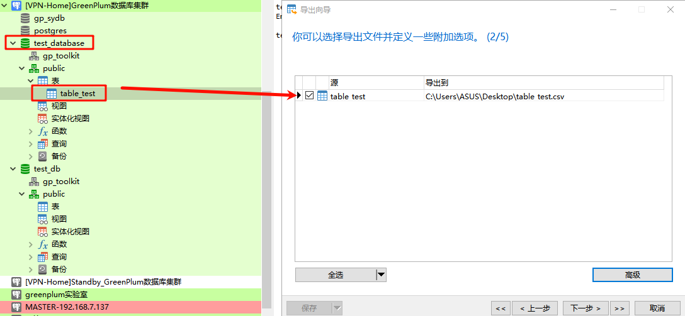

数据传输至master服务器指定路径

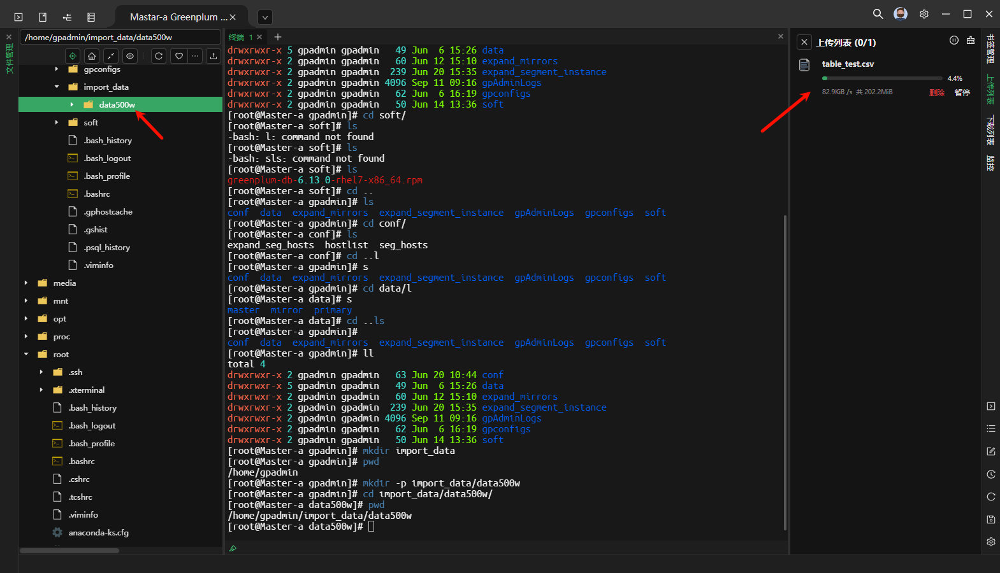

##### 创建本地加载数据表-内部表

```powershell
test_db=# CREATE TABLE "public"."data_import" (
  "id" int4 NOT NULL,
  "name" text COLLATE "pg_catalog"."default" NOT NULL,
  "age" int4 NOT NULL,
  "address" char(50) COLLATE "pg_catalog"."default",
  "salary" float4,
  CONSTRAINT "table_test_pkey" PRIMARY KEY ("id")
)
;
CREATE TABLE

test_db=# ALTER TABLE "public"."data_import" 
  OWNER TO "gpadmin";
ALTER TABLE

test_db=# SELECT * FROM "public"."data_import";
Empty set

test_db=# 
```

##### 启动Gpfdist服务

```powershell
# 查看数据分隔符
[root@Master-a data500w]# tail table_test.csv 
"4998599","LLLLLLLLLLLLLLLL","23",,"2663"
"4998655","YYYYYYYYYYYYYYYY","32",,"345"
"4998695","HHHHHHHHHHHHHHHH","29",,"1680"
"4998803","AAAAAAAAAAAAAAAA","18",,"7413"
"4998946","KKKKKKKKKKKKKKKK","0",,"8625"
"4998972","EEEEEEEEEEEEEEEE","36",,"2614"
"4998999","SSSSSSSSSSSSSSSS","13",,"9208"
"4999678","ZZZZZZZZZZZZZZZZ","34",,"7177"
"4999837","TTTTTTTTTTTTTTTT","27",,"8108"
"4999896","[[[[[[[[[[[[[[[[","30",,"9321"
[root@Master-a data500w]#

由此得出，分隔符是, 数据标识符是""也是默认的CSV标准输出格式

[root@Master-a import_data]# chown -R gpadmin data500w/
[root@Master-a import_data]# cd data500w/
[root@Master-a data500w]# ll
total 207048
-rw-r--r-- 1 gpadmin root 212017092 Sep 12 09:57 table_test.csv
[root@Master-a data500w]#

[root@Master-a gpadmin]# chown  -R gpadmin:gpadmin import_data/
[root@Master-a gpadmin]# su gpadmin
[gpadmin@Master-a ~]$ cd import_data/
[gpadmin@Master-a import_data]$ ls
data500w
[gpadmin@Master-a import_data]$


# 启动进程
[gpadmin@Master-a import_data]$ mkdir data500w_log
[gpadmin@Master-a import_data]$ ll
total 0
drwxr-xr-x 2 gpadmin gpadmin 59 Sep 12 10:26 data500w
drwxrwxr-x 2 gpadmin gpadmin  6 Sep 12 10:29 data500w_log
[gpadmin@Master-a import_data]$ gpfdist -d data500w/ -p 8081 -l data500w_log/ &
[1] 21992
[gpadmin@Master-a import_data]$ 2024-09-12 10:29:56 21992 INFO Before opening listening sockets - following listening sockets are available:
2024-09-12 10:29:56 21992 INFO IPV6 socket: [::]:8081
2024-09-12 10:29:56 21992 INFO IPV4 socket: 0.0.0.0:8081
2024-09-12 10:29:56 21992 INFO Trying to open listening socket:
2024-09-12 10:29:56 21992 INFO IPV6 socket: [::]:8081
2024-09-12 10:29:56 21992 INFO Opening listening socket succeeded
2024-09-12 10:29:56 21992 INFO Trying to open listening socket:
2024-09-12 10:29:56 21992 INFO IPV4 socket: 0.0.0.0:8081
Serving HTTP on port 8081, directory /home/gpadmin/import_data/data500w

[gpadmin@Master-a import_data]$

# 查看进程
[gpadmin@Master-a import_data]$ ps -ef |grep gpfdist
gpadmin   21992  21896  0 10:29 pts/0    00:00:00 gpfdist -d data500w/ -p 8081 -l data500w_log/
gpadmin   21994  21896  0 10:30 pts/0    00:00:00 grep --color=auto gpfdist
[gpadmin@Master-a import_data]$ ss -lnpt |grep 8081
LISTEN     0      128       [::]:8081                  [::]:*                   users:(("gpfdist",pid=21992,fd=6))
[gpadmin@Master-a import_data]$
```

##### 创建外部加载数据表-外部表

```sql
CREATE EXTERNAL TABLE "public"."data_import_ext" (
  "id" int4,
  "name" text,
  "age" int4,
  "address" char(50),
  "salary" float4
)
LOCATION ('gpfdist://192.168.7.136:8081/table_test.csv')
FORMAT 'CSV' (DELIMITER AS ',' NULL AS '')
;
```

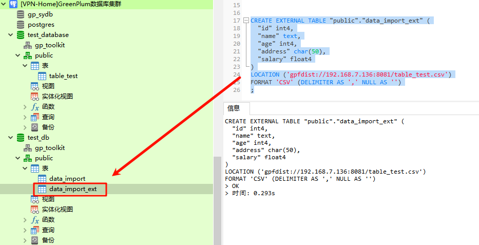

```powershell
# 查询尝试
test_db=# SELECT COUNT(1) FROM "public"."data_import_ext";
ERROR:  invalid input syntax for integer: "id"  (seg10 slice1 192.168.7.141:6002 pid=25668)
CONTEXT:  External table data_import_ext, line 1 of gpfdist://192.168.7.136:8081/table_test.csv, column id
test_db=# 
test_db=# 

查询失败！数据不正确
```

##### 停止Gpfdist服务

```powershell
[gpadmin@Master-a data500w]$ ps -ef |grep dist
gpadmin   21992      1  0 10:29 pts/0    00:00:00 gpfdist -d data500w/ -p 8081 -l data500w_log/
gpadmin   22334  22015  0 10:47 pts/0    00:00:00 grep --color=auto dist
[gpadmin@Master-a data500w]$ kill -9 21992
[gpadmin@Master-a data500w]$ ps -ef |grep dist
gpadmin   22363  22015  0 10:47 pts/0    00:00:00 grep --color=auto dist
[gpadmin@Master-a data500w]$
```

##### 删除EXT表

```powershell
test_db=# DROP TABLE "public"."data_import_ext";
ERROR:  "data_import_ext" is not a base table
HINT:  Use DROP EXTERNAL TABLE to remove an external table.
test_db=# 

删除失败

test_db=# DROP EXTERNAL TABLE "public"."data_import_ext";
DROP EXTERNAL TABLE
test_db=# 

删除成功
```

#### 第二次大数据导入实验

##### 创建外部加载数据表-外部表-(2)

```powershell
test_db=# CREATE EXTERNAL TABLE "public"."data_import_ext" (
  "id" int4,
  "name" text,
  "age" int4,
  "address" char(50),
  "salary" float4
)
LOCATION ('gpfdist://192.168.7.136:8081/table_test.csv')
FORMAT 'CSV' (HEADER)
;
NOTICE:  HEADER means that each one of the data files has a header row
CREATE EXTERNAL TABLE

# 数据查询
test_db=# SELECT COUNT(1) FROM "public"."data_import_ext";
ERROR:  connection with gpfdist failed for "gpfdist://192.168.7.136:8081/table_test.csv", effective url: "http://192.168.7.136:8081/table_test.csv": error code = 111 (Connection refused);  (seg12 slice1 192.168.7.140:6000 pid=25789)
NOTICE:  HEADER means that each one of the data files has a header row
test_db=# 

查询失败
```

##### 开启Gpfdist服务-(2)

```powershell
[gpadmin@Master-a import_data]$ gpfdist -d data500w/ -p 8081 -l data500w_log/ &
[1] 22487
[gpadmin@Master-a import_data]$ 2024-09-12 10:55:55 22487 INFO Before opening listening sockets - following listening sockets are available:
2024-09-12 10:55:55 22487 INFO IPV6 socket: [::]:8081
2024-09-12 10:55:55 22487 INFO IPV4 socket: 0.0.0.0:8081
2024-09-12 10:55:55 22487 INFO Trying to open listening socket:
2024-09-12 10:55:55 22487 INFO IPV6 socket: [::]:8081
2024-09-12 10:55:55 22487 INFO Opening listening socket succeeded
2024-09-12 10:55:55 22487 INFO Trying to open listening socket:
2024-09-12 10:55:55 22487 INFO IPV4 socket: 0.0.0.0:8081
Serving HTTP on port 8081, directory /home/gpadmin/import_data/data500w

[gpadmin@Master-a import_data]$

# 数据查询
test_db=# SELECT COUNT(1) FROM "public"."data_import_ext";
  count
---------
 5000000
(1 row)

NOTICE:  HEADER means that each one of the data files has a header row
test_db=# 

查询成功 500w数据

# 数据查询具体数据展示
test_db=# SELECT * FROM "public"."data_import_ext" LIMIT 10;
 id  |       name       | age | address | salary
-----+------------------+-----+---------+--------
  34 | KKKKKKKKKKKKKKKK |  16 |         |   3954
  53 | YYYYYYYYYYYYYYYY |  33 |         |   6884
  70 | ZZZZZZZZZZZZZZZZ |  13 |         |   2475
  75 | [[[[[[[[[[[[[[[[ |  32 |         |   6818
  80 | VVVVVVVVVVVVVVVV |  32 |         |    869
  93 | PPPPPPPPPPPPPPPP |   4 |         |   9570
 109 | BBBBBBBBBBBBBBBB |  19 |         |   7567
 142 | CCCCCCCCCCCCCCCC |  28 |         |   8775
 143 | UUUUUUUUUUUUUUUU |   5 |         |   1298
 190 | UUUUUUUUUUUUUUUU |   0 |         |   7145
(10 rows)

NOTICE:  HEADER means that each one of the data files has a header row
test_db=# 

test_db=# SELECT * FROM "public"."data_import_ext" WHERE id=1;
 id |       name       | age | address | salary
----+------------------+-----+---------+--------
  1 | XXXXXXXXXXXXXXXX |  20 |         |   5555
(1 row)

NOTICE:  HEADER means that each one of the data files has a header row
test_db=# 

NOTICE:  HEADER means that each one of the data files has a header row
证明此CSV带表头-第一行为表头
```

##### 将外部表导入内部表

```powershell
# 导入前查询
test_db=# SELECT COUNT(1) FROM "public"."data_import";
 count
-------
     0
(1 row)

test_db=# 

# 导入
test_db=# INSERT INTO "public"."data_import" SELECT * FROM "public"."data_import_ext";
NOTICE:  HEADER means that each one of the data files has a header row
INSERT 0 5000000

test_db=# SELECT COUNT(1) FROM "public"."data_import";
  count
---------
 5000000
(1 row)

test_db=# 

# 时间查看
INSERT INTO "public"."data_import" SELECT * FROM "public"."data_import_ext"
> NOTICE:  HEADER means that each one of the data files has a header row
> Affected rows: 5000000
> 时间: 6.867s
```

##### 停止Gpfdist服务-(2)

```powershell
[gpadmin@Master-a import_data]$ ps -ef |grep dist
gpadmin   22487  22015  0 10:55 pts/0    00:00:03 gpfdist -d data500w/ -p 8081 -l data500w_log/
gpadmin   22522  22015  0 11:24 pts/0    00:00:00 grep --color=auto dist
[gpadmin@Master-a import_data]$ kill -9 22487
[gpadmin@Master-a import_data]$
```

##### 删除EXT表-(2)

```powershell
test_db=# DROP EXTERNAL TABLE "public"."data_import_ext";
DROP EXTERNAL TABLE

test_db=# 
```

#### 数据量提升

##### 导入数据准备

```sql
-- 模拟数据构建
-- 创建一个公司人员信息记录表格
-- 创建表 employees_import 并添加注释
CREATE TABLE employees_import (
  id SERIAL PRIMARY KEY,
  name VARCHAR(50) NOT NULL,  -- 姓名
  age INTEGER NOT NULL,  -- 年龄
  gender CHAR(1) NOT NULL,  -- 性别（M 或 F）
  department VARCHAR(50) NOT NULL,  -- 部门
  hire_date DATE NOT NULL,  -- 入职日期
  birth_date DATE NOT NULL,  -- 出生日期
  address VARCHAR(100) NOT NULL,  -- 地址
  salary INTEGER NOT NULL  -- 薪资
);

-- 为表添加注释
COMMENT ON TABLE employees_import IS '员工信息表，包括姓名、年龄、性别、部门、入职日期、出生日期、地址和薪资等字段。';

-- 为字段添加注释
COMMENT ON COLUMN employees_import.name IS '员工姓名，以固定格式加随机数生成';
COMMENT ON COLUMN employees_import.age IS '员工年龄，范围在 18 到 60 之间';
COMMENT ON COLUMN employees_import.gender IS '员工性别，M 代表男性，F 代表女性';
COMMENT ON COLUMN employees_import.department IS '员工部门，如 HR、Engineering、Marketing、Sales';
COMMENT ON COLUMN employees_import.hire_date IS '员工入职日期，随机生成的日期';
COMMENT ON COLUMN employees_import.birth_date IS '员工出生日期，随机生成的日期';
COMMENT ON COLUMN employees_import.address IS '员工地址，随机生成的地址信息';
COMMENT ON COLUMN employees_import.salary IS '员工薪资，范围在 3000 到 50000 之间';

-- 插入模拟数据
INSERT INTO employees_import (name, age, gender, department, hire_date, birth_date, address, salary)
SELECT 
  -- 固定格式姓名加随机数，例如 "员工_123"
  '员工_' || FLOOR(RANDOM() * 1000)::INTEGER AS name,
  FLOOR(RANDOM() * (60-18) + 18),  -- 随机生成年龄在 18 到 60 之间
  CASE 
    WHEN RANDOM() < 0.5 THEN 'M'
    ELSE 'F'
  END,  -- 随机生成性别
  CASE 
    WHEN RANDOM() < 0.25 THEN 'HR'
    WHEN RANDOM() < 0.5 THEN 'Engineering'
    WHEN RANDOM() < 0.75 THEN 'Marketing'
    ELSE 'Sales'
  END,  -- 随机选择部门
  DATE '2000-01-01' + ((RANDOM() * 3650)::INTEGER) * INTERVAL '1 day',  -- 随机生成入职日期
  DATE '1960-01-01' + ((RANDOM() * 15000)::INTEGER) * INTERVAL '1 day',  -- 随机生成一个出生日期在 1960-01-01 到 2000-01-01 之间
  CASE 
    WHEN RANDOM() < 0.25 THEN '北京市'
    WHEN RANDOM() < 0.5 THEN '上海市'
    WHEN RANDOM() < 0.75 THEN '广州市'
    ELSE '深圳市'
  END || ' ' || '随机街道' || (FLOOR(RANDOM() * 100) + 1) || '号',  -- 随机生成地址
  FLOOR(RANDOM() * (50000 - 3000) + 3000)  -- 随机生成薪资范围在 3000 到 50000 之间
FROM 
  generate_series(1, 100000000);  -- 生成 1 亿条记录
```

##### 查看数据情况

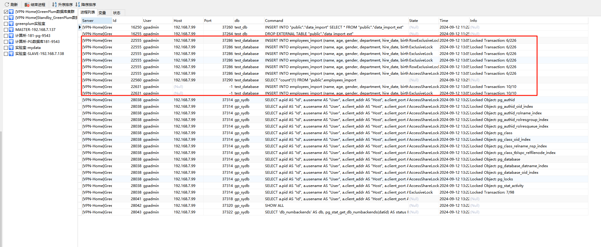

```powershell
1亿数据太大了 小集群吃不消 降档吧
  generate_series(1, 10000000);  -- 生成 1000w条记录

算了，还是按之前的数据导入吧，这个太慢了
```

##### 导入数据准备-(2)

```sql
CREATE TABLE table_data(
  ID INT PRIMARY KEY   NOT NULL,
  NAME      TEXT  NOT NULL,
  AGE      INT   NOT NULL,
  ADDRESS    CHAR(50),
  SALARY     REAL
);

# 写入随机测试数据5000w
DO $$
DECLARE
  batch_size INTEGER := 5000000;
  num_batches INTEGER := 10;
BEGIN
  FOR i IN 1..num_batches LOOP
    INSERT INTO table_data (ID, NAME, AGE, ADDRESS, SALARY)
    SELECT 
      g.key,
      repeat(chr(int4(random() * 26 + 65)), 16),
      (random() * 36)::integer,
      NULL,
      (random() * 10000)::integer
    FROM (
      SELECT generate_series((i-1)*batch_size + 1, i*batch_size) AS key
    ) g;
  END LOOP;
END $$;

```

##### 查看数据情况-(2)

```sql
SELECT COUNT(1) FROM table_data
> OK
> 时间: 5.533s

数据量 5000w
50000000
```

#### 第一次数据卸载实验

上面是通过csv文件导入到服务器上，实际上可以进行数据卸载,进行5000w的数据导出

```sql
-- 创建外部表用于数据导出
CREATE WRITABLE EXTERNAL TABLE table_data_out ( LIKE table_data )
LOCATION('gpfdist://192.168.7.136:8082/table_data_out')
FORMAT 'CSV' (DELIMITER ',' NULL '')
DISTRIBUTED BY (id);

-- 数据导出
INSERT INTO table_data_out SELECT * FROM table_data
> Affected rows: 50000000
> 时间: 47.867s

-- 数据查询
SELECT COUNT(1) FROM table_data_out
> ERROR:  cannot read from a WRITABLE external table
HINT:  Create the table as READABLE instead.

> 时间: 0.246s
-- 查询失败，因为数据只可写
```

##### 开启Gpfdist服务-数据卸载

```powershell
# 创建数据导出目录
[gpadmin@Master-a ~]$ mkdir output_data
[gpadmin@Master-a ~]$ cd output_data/
[gpadmin@Master-a output_data]$ mkdir data5000w
[gpadmin@Master-a output_data]$ cd data5000w/
[gpadmin@Master-a data5000w]$ pwd
/home/gpadmin/output_data/data5000w
[gpadmin@Master-a data5000w]$

[gpadmin@Master-a output_data]$ gpfdist -d data5000w/ -p 8082 -l data5000w.log &
[1] 71720
[gpadmin@Master-a output_data]$ 2024-09-12 14:16:10 71720 INFO Before opening listening sockets - following listening sockets are available:
2024-09-12 14:16:10 71720 INFO IPV6 socket: [::]:8082
2024-09-12 14:16:10 71720 INFO IPV4 socket: 0.0.0.0:8082
2024-09-12 14:16:10 71720 INFO Trying to open listening socket:
2024-09-12 14:16:10 71720 INFO IPV6 socket: [::]:8082
2024-09-12 14:16:10 71720 INFO Opening listening socket succeeded
2024-09-12 14:16:10 71720 INFO Trying to open listening socket:
2024-09-12 14:16:10 71720 INFO IPV4 socket: 0.0.0.0:8082
Serving HTTP on port 8082, directory /home/gpadmin/output_data/data5000w

[gpadmin@Master-a output_data]$
```

##### 查看数据卸载情况

```powershell
[gpadmin@Master-a data5000w]$ ll
total 1679844
-rw-rw-r-- 1 gpadmin gpadmin        162 Sep 12 14:18 data5000w.log
-rw------- 1 gpadmin gpadmin 1720154314 Sep 12 14:18 table_data_out
# 查看数据日志
[gpadmin@Master-a data5000w]$ tail data5000w.log 
2024-09-12 14:18:08 71720 INFO remove sessions
2024-09-12 14:18:56 71720 INFO free session 48-0000000127.0.0.0:/home/gpadmin/output_data/data5000w/table_data_out
[gpadmin@Master-a data5000w]$ tail table_data_out 
49999766,GGGGGGGGGGGGGGGG,7,,9676
49999781,YYYYYYYYYYYYYYYY,5,,2346
49999821,CCCCCCCCCCCCCCCC,7,,2749
49999840,DDDDDDDDDDDDDDDD,26,,4018
49999868,JJJJJJJJJJJJJJJJ,33,,2287
49999898,WWWWWWWWWWWWWWWW,8,,6697
49999926,FFFFFFFFFFFFFFFF,36,,4084
49999938,KKKKKKKKKKKKKKKK,13,,594
49999956,AAAAAAAAAAAAAAAA,5,,4469
49999984,SSSSSSSSSSSSSSSS,36,,9496
[gpadmin@Master-a data5000w]$

[gpadmin@Master-a data5000w]$ wc -l table_data_out 
50000000 table_data_out
[gpadmin@Master-a data5000w]$

文件名应该是 table_data_out.csv 构建服务的时候忘写了 问题不大

[gpadmin@Master-a data5000w]$ head table_data_out 
19,LLLLLLLLLLLLLLLL,16,,1394
36,RRRRRRRRRRRRRRRR,33,,5881
40,SSSSSSSSSSSSSSSS,19,,2725
63,[[[[[[[[[[[[[[[[,24,,6041
87,PPPPPPPPPPPPPPPP,21,,3804
107,EEEEEEEEEEEEEEEE,34,,9162
128,OOOOOOOOOOOOOOOO,19,,9443
154,RRRRRRRRRRRRRRRR,15,,6486
175,VVVVVVVVVVVVVVVV,5,,1470
192,ZZZZZZZZZZZZZZZZ,3,,161

可以看到导出的数据是不含表头的？
GPT4.0:

是的，使用 CREATE WRITABLE EXTERNAL TABLE 的方式来导出数据到外部文件（例如 CSV 文件）时，默认情况下，数据文件不包含表头（列名）。这是因为外部表的设计是为了与数据源进行直接交互，并不包含额外的元数据，如列名。
```

##### 停止Gpfdist服务-数据卸载

```powershell
[gpadmin@Master-a data5000w]$ ps -ef |grep dist
gpadmin   71720  65998  4 14:16 pts/0    00:00:47 gpfdist -d data5000w/ -p 8082 -l data5000w.log
gpadmin   95823  65998  0 14:32 pts/0    00:00:00 grep --color=auto dist
[gpadmin@Master-a data5000w]$ kill -9 71720
```

##### 删除OUT表

```sql
DROP EXTERNAL TABLE "public"."table_data_out"
> OK
> 时间: 0.223s
```

#### 查看数据分布情况

```powershell
SELECT gp_segment_id,count(1) FROM table_test
GROUP BY gp_segment_id
ORDER BY gp_segment_id
> OK
> 时间: 0.617s
```


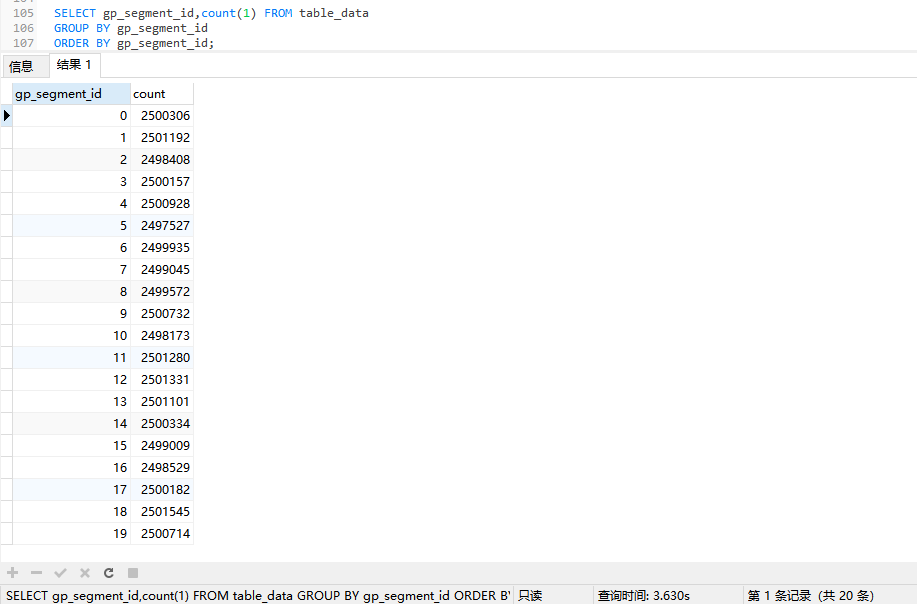

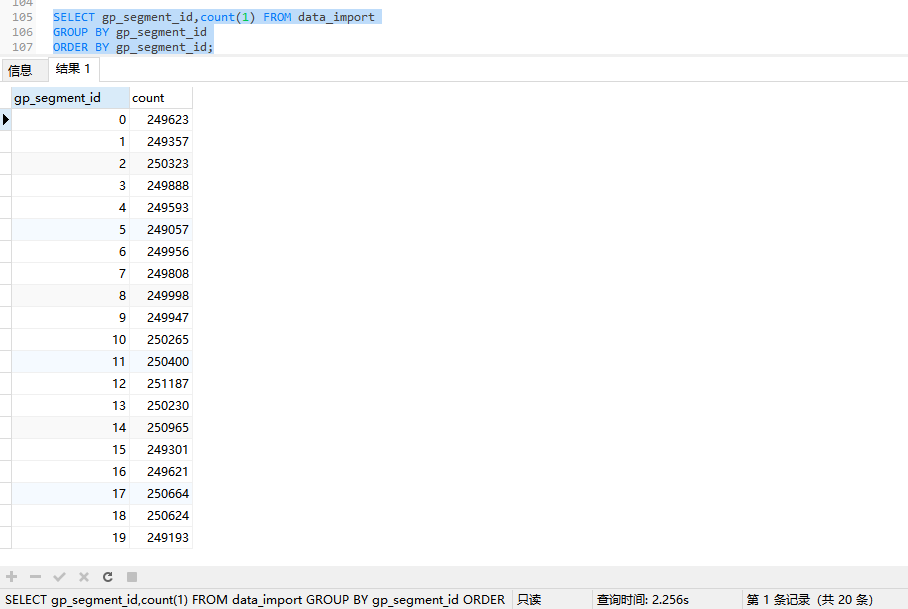

#### 总结

外部表，用于数据导入和数据卸载；Gpfdist服务，用于关联文件和服务；内部表，用于数据查询和存储；速度来看，还挺快的。

### 实验开始-基于Web的外部表接入

上面实验介绍了基于文件服务器的数据表，其实还可以使用基于web表的方式读取静态数据。

#### 先做一个http代理

采用最原始的httpd的方式进行代理，不使用nginx，nginx也可以实现相应的内容，最后可以实现通过URL能访问固定的文件结构和数据即可。

```powershell
# 查看yum源状态
[root@Master-a ~]# yum makecache
Loaded plugins: fastestmirror
Determining fastest mirrors
localhttp                                                                                                           | 3.6 kB  00:00:00     
Metadata Cache Created
[root@Master-a ~]# cat /etc/yum.repos.d/localhttp.repo 
[localhttp]
name=Local Yum http
baseurl=http://192.168.7.137/localyum
enable=1
gpgcheck=0
[root@Master-a ~]# cat /etc/hosts
127.0.0.1   localhost localhost.localdomain localhost4 localhost4.localdomain4
::1         localhost localhost.localdomain localhost6 localhost6.localdomain6
192.168.7.136  Master-a
192.168.7.137  Standby-a
192.168.7.138  Segment-a
192.168.7.139  Segment-b
192.168.7.141  Segment-c
192.168.7.140  Segment-d
[root@Master-a ~]#

# 查看httpd服务状态
[root@Master-a ~]# systemctl status httpd
Unit httpd.service could not be found.
[root@Master-a ~]#

# 安装httpd服务状态
[root@Master-a ~]# yum install httpd
Loaded plugins: fastestmirror
Loading mirror speeds from cached hostfile
Resolving Dependencies
--> Running transaction check
---> Package httpd.x86_64 0:2.4.6-93.el7.centos will be installed
--> Processing Dependency: httpd-tools = 2.4.6-93.el7.centos for package: httpd-2.4.6-93.el7.centos.x86_64
--> Processing Dependency: /etc/mime.types for package: httpd-2.4.6-93.el7.centos.x86_64
--> Running transaction check
---> Package httpd-tools.x86_64 0:2.4.6-93.el7.centos will be installed
---> Package mailcap.noarch 0:2.1.41-2.el7 will be installed
--> Finished Dependency Resolution

Dependencies Resolved

===========================================================================================================================================
 Package                         Arch                       Version                                    Repository                     Size
===========================================================================================================================================
Installing:
 httpd                           x86_64                     2.4.6-93.el7.centos                        localhttp                     2.7 M
Installing for dependencies:
 httpd-tools                     x86_64                     2.4.6-93.el7.centos                        localhttp                      92 k
 mailcap                         noarch                     2.1.41-2.el7                               localhttp                      31 k

Transaction Summary
===========================================================================================================================================
Install  1 Package (+2 Dependent packages)

Total download size: 2.8 M
Installed size: 9.6 M
Is this ok [y/d/N]: y
Downloading packages:
(1/3): httpd-tools-2.4.6-93.el7.centos.x86_64.rpm                                                                   |  92 kB  00:00:00     
(2/3): mailcap-2.1.41-2.el7.noarch.rpm                                                                              |  31 kB  00:00:00     
(3/3): httpd-2.4.6-93.el7.centos.x86_64.rpm                                                                         | 2.7 MB  00:00:00     
-------------------------------------------------------------------------------------------------------------------------------------------
Total                                                                                                       33 MB/s | 2.8 MB  00:00:00     
Running transaction check
Running transaction test
Transaction test succeeded
Running transaction
  Installing : mailcap-2.1.41-2.el7.noarch                                                                                             1/3 
  Installing : httpd-tools-2.4.6-93.el7.centos.x86_64                                                                                  2/3 
  Installing : httpd-2.4.6-93.el7.centos.x86_64                                                                                        3/3 
  Verifying  : httpd-tools-2.4.6-93.el7.centos.x86_64                                                                                  1/3 
  Verifying  : mailcap-2.1.41-2.el7.noarch                                                                                             2/3 
  Verifying  : httpd-2.4.6-93.el7.centos.x86_64                                                                                        3/3 

Installed:
  httpd.x86_64 0:2.4.6-93.el7.centos                                                                                                       

Dependency Installed:
  httpd-tools.x86_64 0:2.4.6-93.el7.centos                                  mailcap.noarch 0:2.1.41-2.el7                                 

Complete!
[root@Master-a ~]# systemctl status httpd
● httpd.service - The Apache HTTP Server
   Loaded: loaded (/usr/lib/systemd/system/httpd.service; disabled; vendor preset: disabled)
   Active: inactive (dead)
     Docs: man:httpd(8)
           man:apachectl(8)
[root@Master-a ~]#

# 开启服务-并开启自启动

[root@Master-a ~]# systemctl enable httpd --now
Created symlink from /etc/systemd/system/multi-user.target.wants/httpd.service to /usr/lib/systemd/system/httpd.service.
[root@Master-a ~]# systemctl status httpd
● httpd.service - The Apache HTTP Server
   Loaded: loaded (/usr/lib/systemd/system/httpd.service; enabled; vendor preset: disabled)
   Active: active (running) since Mon 2024-10-28 14:43:57 CST; 3s ago
     Docs: man:httpd(8)
           man:apachectl(8)
 Main PID: 2432 (httpd)
   Status: "Processing requests..."
   CGroup: /system.slice/httpd.service
           ├─2432 /usr/sbin/httpd -DFOREGROUND
           ├─2433 /usr/sbin/httpd -DFOREGROUND
           ├─2434 /usr/sbin/httpd -DFOREGROUND
           ├─2435 /usr/sbin/httpd -DFOREGROUND
           ├─2436 /usr/sbin/httpd -DFOREGROUND
           └─2437 /usr/sbin/httpd -DFOREGROUND

Oct 28 14:43:57 Master-a systemd[1]: Starting The Apache HTTP Server...
Oct 28 14:43:57 Master-a httpd[2432]: AH00558: httpd: Could not reliably determine the server's fully qualified domain name, usi... message
Oct 28 14:43:57 Master-a systemd[1]: Started The Apache HTTP Server.
Hint: Some lines were ellipsized, use -l to show in full.
[root@Master-a ~]#

# 访问尝试
[root@Master-a ~]# curl -I http://192.168.7.136/test
HTTP/1.1 404 Not Found
Date: Mon, 28 Oct 2024 06:46:04 GMT
Server: Apache/2.4.6 (CentOS)
Content-Type: text/html; charset=iso-8859-1

# 数据导入 - 查看数据
[root@Master-a data500w]# pwd
/home/gpadmin/import_data/data500w
[root@Master-a data500w]# head table_test.csv 
"id","name","age","address","salary"
"34","KKKKKKKKKKKKKKKK","16",,"3954"
"53","YYYYYYYYYYYYYYYY","33",,"6884"
"70","ZZZZZZZZZZZZZZZZ","13",,"2475"
"75","[[[[[[[[[[[[[[[[","32",,"6818"
"80","VVVVVVVVVVVVVVVV","32",,"869"
"93","PPPPPPPPPPPPPPPP","4",,"9570"
"109","BBBBBBBBBBBBBBBB","19",,"7567"
"142","CCCCCCCCCCCCCCCC","28",,"8775"
"143","UUUUUUUUUUUUUUUU","5",,"1298"
[root@Master-a data500w]#

# 映射到httpd服务
[root@Master-a html]# pwd
/var/www/html
[root@Master-a html]# mkdir import_data
[root@Master-a html]# cd import_data/
[root@Master-a import_data]# cp /home/gpadmin/import_data/data500w/table_test.csv .
[root@Master-a import_data]# ls
table_test.csv
[root@Master-a import_data]#

# 访问测试
[root@Master-a ~]# curl -s http://192.168.7.136/import_data/table_test.csv | head -n 10
"id","name","age","address","salary"
"34","KKKKKKKKKKKKKKKK","16",,"3954"
"53","YYYYYYYYYYYYYYYY","33",,"6884"
"70","ZZZZZZZZZZZZZZZZ","13",,"2475"
"75","[[[[[[[[[[[[[[[[","32",,"6818"
"80","VVVVVVVVVVVVVVVV","32",,"869"
"93","PPPPPPPPPPPPPPPP","4",,"9570"
"109","BBBBBBBBBBBBBBBB","19",,"7567"
"142","CCCCCCCCCCCCCCCC","28",,"8775"
"143","UUUUUUUUUUUUUUUU","5",,"1298"
[root@Master-a ~]#

以上可通过代理进行访问数据csv - 但是这种非常不安全！
```

#### 数据表创建

```powershell
# 构建数据表创建语句
test_db=# CREATE EXTERNAL TABLE "public"."data_import_web" (
  "id" int4,
  "name" text,
  "age" int4,
  "address" char(50),
  "salary" float4
)
LOCATION ('http://192.168.7.136/import_data/table_test.csv')
FORMAT 'CSV' (HEADER)
;

# 尝试数据表创建
test_db=# CREATE EXTERNAL TABLE "public"."data_import_web" (
  "id" int4,
  "name" text,
  "age" int4,
  "address" char(50),
  "salary" float4
)
LOCATION ('http://192.168.7.136/import_data/table_test.csv')
FORMAT 'CSV' (HEADER)
;
ERROR:  http URI's can only be used in an external web table
HINT:  Use CREATE EXTERNAL WEB TABLE instead.
test_db=# 

提示语法错误 修改一下再次执行

# 再次构建
test_db=# CREATE EXTERNAL WEB TABLE "public"."data_import_web" (
  "id" int4,
  "name" text,
  "age" int4,
  "address" char(50),
  "salary" float4
)
LOCATION ('http://192.168.7.136/import_data/table_test.csv')
FORMAT 'CSV' (HEADER)
;

# 再次尝试数据表创建
test_db=# CREATE EXTERNAL WEB TABLE "public"."data_import_web" (
  "id" int4,
  "name" text,
  "age" int4,
  "address" char(50),
  "salary" float4
)
LOCATION ('http://192.168.7.136/import_data/table_test.csv')
FORMAT 'CSV' (HEADER)
;
NOTICE:  HEADER means that each one of the data files has a header row
CREATE EXTERNAL TABLE

# 查看数据
test_db=# select count(*) from "public"."data_import_web";
  count
---------
 5000000
(1 row)

NOTICE:  HEADER means that each one of the data files has a header row
test_db=# 

数据创建成功！

```

#### 数据修改

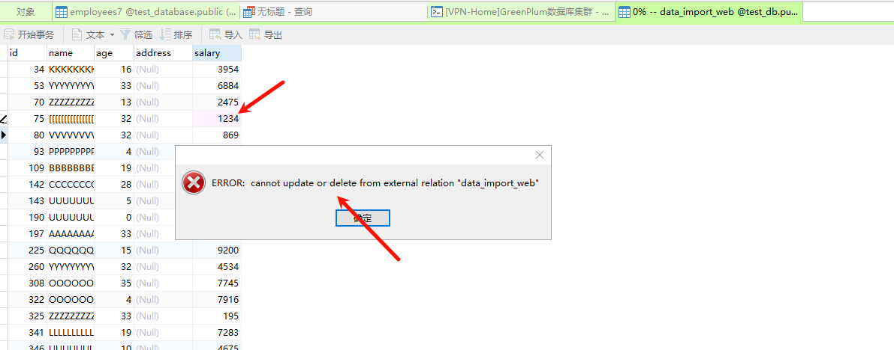

可以看到报错了，数据以只读的方式进行加载而不是写入到了segment中，如果想写入可以创建内部表然后用 insert in to 的方式进行写入。

#### 服务关联观察

把httpd服务关掉尝试查看数据

```powershell
# 关闭httpd服务
[root@Master-a ~]# systemctl disable httpd --now
Removed symlink /etc/systemd/system/multi-user.target.wants/httpd.service.
[root@Master-a ~]# systemctl status httpd
● httpd.service - The Apache HTTP Server
   Loaded: loaded (/usr/lib/systemd/system/httpd.service; disabled; vendor preset: disabled)
   Active: inactive (dead)
     Docs: man:httpd(8)
           man:apachectl(8)

Oct 28 14:43:57 Master-a systemd[1]: Starting The Apache HTTP Server...
Oct 28 14:43:57 Master-a httpd[2432]: AH00558: httpd: Could not reliably determine the server's fully qualified domain name, usi... message
Oct 28 14:43:57 Master-a systemd[1]: Started The Apache HTTP Server.
Oct 28 15:22:35 Master-a systemd[1]: Stopping The Apache HTTP Server...
Oct 28 15:22:36 Master-a systemd[1]: Stopped The Apache HTTP Server.
Hint: Some lines were ellipsized, use -l to show in full.
[root@Master-a ~]#

# 访问测试
[root@Master-a ~]# curl -s http://192.168.7.136/import_data/table_test.csv | head -n 10
[root@Master-a ~]#

# 数据库查询测试
test_db=# select count(*) from "public"."data_import_web";
ERROR:  connection with gpfdist failed for "http://192.168.7.136/import_data/table_test.csv", effective url: "http://192.168.7.136/import_data/table_test.csv": error code = 111 (Connection refused);  (seg0 slice1 192.168.7.138:6000 pid=7202)
NOTICE:  HEADER means that each one of the data files has a header row
test_db=# 

```

#### 总结

可以看到是一个只读的状态，当代理的服务关闭后数据无法进行查看，但是这个是既gpfdist服务的又一种数据读入方式，可见gp数据库对数据库接入有明显的兼容性，为特定环境提供了不同的接入可能性。

### 实验开始-基于script的外部表接入

#### 构建一个数据脚本

```powershell
[root@Master-a ~]# su gpadmin
[gpadmin@Master-a root]$ cd ~
[gpadmin@Master-a ~]$ ls
conf  data  expand_mirrors  expand_segment_instance  gpAdminLogs  gpconfigs  import_data  output_data  soft
[gpadmin@Master-a ~]$ cd import_data/
[gpadmin@Master-a import_data]$ ls
data500w  data500w_log
[gpadmin@Master-a import_data]$ cd data500w
[gpadmin@Master-a data500w]$ ls
data500w_log  table_test.csv
[gpadmin@Master-a data500w]$ touch get_script_data.sh
[gpadmin@Master-a data500w]$ chmod +x get_script_data.sh 
[gpadmin@Master-a data500w]$ ll get_script_data.sh 
-rwxrwxr-x 1 gpadmin gpadmin 0 Oct 29 09:21 get_script_data.sh

[gpadmin@Master-a data500w]$ cat << EOF >> get_script_data.sh 
> #!/bin/bash
> curl -s http://192.168.7.136/import_data/table_test.csv | tail -n 1000
> EOF
[gpadmin@Master-a data500w]$ cat get_script_data.sh 

#!/bin/bash
curl -s http://192.168.7.136/import_data/table_test.csv | tail -n 1000
[gpadmin@Master-a data500w]$

# 开启脚本关联服务 - 这里还用之前的，因为不爱写新的echo一样的效果
Last login: Mon Oct 28 11:40:49 2024 from 192.168.7.99
[root@Master-a ~]# systemctl enable httpd --now
Created symlink from /etc/systemd/system/multi-user.target.wants/httpd.service to /usr/lib/systemd/system/httpd.service.
[root@Master-a ~]# systemctl status httpd
● httpd.service - The Apache HTTP Server
   Loaded: loaded (/usr/lib/systemd/system/httpd.service; enabled; vendor preset: disabled)
   Active: active (running) since Tue 2024-10-29 09:29:01 CST; 10s ago
     Docs: man:httpd(8)
           man:apachectl(8)
 Main PID: 4929 (httpd)
   Status: "Total requests: 0; Current requests/sec: 0; Current traffic:   0 B/sec"
   CGroup: /system.slice/httpd.service
           ├─4929 /usr/sbin/httpd -DFOREGROUND
           ├─4930 /usr/sbin/httpd -DFOREGROUND
           ├─4931 /usr/sbin/httpd -DFOREGROUND
           ├─4932 /usr/sbin/httpd -DFOREGROUND
           ├─4933 /usr/sbin/httpd -DFOREGROUND
           └─4934 /usr/sbin/httpd -DFOREGROUND

Oct 29 09:29:01 Master-a systemd[1]: Starting The Apache HTTP Server...
Oct 29 09:29:01 Master-a httpd[4929]: AH00558: httpd: Could not reliably determine the server's fully qualified d...essage
Oct 29 09:29:01 Master-a systemd[1]: Started The Apache HTTP Server.
Hint: Some lines were ellipsized, use -l to show in full.
[root@Master-a ~]#

[gpadmin@Master-a data500w]$ ./get_script_data.sh | head -n 10
"4965080","EEEEEEEEEEEEEEEE","8",,"2328"
"4965716","WWWWWWWWWWWWWWWW","15",,"7545"
"4965747","QQQQQQQQQQQQQQQQ","13",,"1758"
"4966064","TTTTTTTTTTTTTTTT","34",,"8114"
"4966227","IIIIIIIIIIIIIIII","19",,"5923"
"4966532","QQQQQQQQQQQQQQQQ","16",,"3246"
"4966769","VVVVVVVVVVVVVVVV","11",,"8917"
"4966889","AAAAAAAAAAAAAAAA","27",,"4709"
"4966913","RRRRRRRRRRRRRRRR","29",,"1377"
"4966999","KKKKKKKKKKKKKKKK","34",,"586"
[gpadmin@Master-a data500w]$

查看脚本的数据前10行

# 脚本含义
[gpadmin@Master-a data500w]$ cat get_script_data.sh 

#!/bin/bash
curl -s http://192.168.7.136/import_data/table_test.csv | tail -n 1000
[gpadmin@Master-a data500w]$

从这个httpd服务的csv中获取最后的1000条数据
```

#### 数据表创建

```powershell
# 脚本同步到其他segment节点相同位置
[gpadmin@Master-a data500w]$ cat /etc/hosts
127.0.0.1   localhost localhost.localdomain localhost4 localhost4.localdomain4
::1         localhost localhost.localdomain localhost6 localhost6.localdomain6
192.168.7.136  Master-a
192.168.7.137  Standby-a
192.168.7.138  Segment-a
192.168.7.139  Segment-b
192.168.7.141  Segment-c
192.168.7.140  Segment-d
[gpadmin@Master-a data500w]$ for host in 192.168.7.{136..141}; do
> scp ./get_script_data.sh $host:~/
> done
get_script_data.sh                                                                      100%   84    63.7KB/s   00:00    
get_script_data.sh                                                                      100%   84    94.5KB/s   00:00    
get_script_data.sh                                                                      100%   84   254.4KB/s   00:00    
get_script_data.sh                                                                      100%   84   173.4KB/s   00:00    
get_script_data.sh                                                                      100%   84   222.3KB/s   00:00    
get_script_data.sh                                                                      100%   84   169.5KB/s   00:00    
[gpadmin@Master-a data500w]$

# 构建数据表语句

CREATE EXTERNAL WEB TABLE "public"."script_data" (
  "id" int4,
  "name" text,
  "age" int4,
  "address" char(50),
  "salary" float4
)
EXECUTE '/home/gpadmin/get_script_data.sh' ON HOST
FORMAT 'TEXT' (DELIMITER ',');

# 创建数据表
test_db=# CREATE EXTERNAL WEB TABLE "public"."script_data" (
  "id" int4,
  "name" text,
  "age" int4,
  "address" char(50),
  "salary" float4
)
EXECUTE '/home/gpadmin/get_script_data.sh' ON HOST
FORMAT 'TEXT' (DELIMITER ',');
CREATE EXTERNAL TABLE

test_db=# 

# 数据查询
test_db=# select count(1) from "public"."script_data";
ERROR:  invalid input syntax for integer: ""4965080""  (seg0 slice1 192.168.7.138:6000 pid=24429)
CONTEXT:  External table script_data, line 1 of execute:/home/gpadmin/get_script_data.sh, column id
test_db=# 

# 再次尝试构建数据表
test_db=# CREATE EXTERNAL WEB TABLE "public"."script_data1" (
  "id" int4,
  "name" text,
  "age" int4,
  "address" char(50),
  "salary" float4
)
EXECUTE '/home/gpadmin/get_script_data.sh' ON HOST
FORMAT 'CSV' (DELIMITER ',');
CREATE EXTERNAL TABLE

修改点为 format格式为csv 并指定分隔符为"," 


# 数据查询
test_db=# select count(1) from "public"."script_data1";
 count
-------
  4000
(1 row)

test_db=# 

数据数量不对，数据segment节点有4个，脚本获取的是1000条数据，也就是数据被执行了4次，有重复数据，我们写一个sql 进行验证

# 数据验证
test_db=# SELECT * FROM public.script_data1 WHERE id = 4979548;
   id    |       name       | age | address | salary
---------+------------------+-----+---------+--------
 4979548 | TTTTTTTTTTTTTTTT |  10 |         |   6662
 4979548 | TTTTTTTTTTTTTTTT |  10 |         |   6662
 4979548 | TTTTTTTTTTTTTTTT |  10 |         |   6662
 4979548 | TTTTTTTTTTTTTTTT |  10 |         |   6662
(4 rows)

test_db=# 
```

#### 疑问

我对这个功能是失望的，当脚本获取正确的数据时，你的集群有几个segment 就会显示 几个segment*你的数据，也就是查询数据的并集，这显然没有任何意义，数据无意义的重复，可以印证查询是并形的。

#### 修改数据

```powershell
# 思路创建
通过获取指定行的数据然后再次创建表尝试，验证并集

[gpadmin@Master-a ~]$ cat union_data.sh 
#!/bin/bash
curl -s http://192.168.7.136/import_data/table_test.csv | awk 'NR==7'
[gpadmin@Master-a ~]$ ./union_data.sh 
"93","PPPPPPPPPPPPPPPP","4",,"9570"
[gpadmin@Master-a ~]$

# 复制到其他节点
[gpadmin@Master-a ~]$ for i in 192.168.7.{136..141}; do
> scp ./union_data.sh $i:~/
> done
union_data.sh                                                                           100%   82   366.4KB/s   00:00    
union_data.sh                                                                           100%   82   139.2KB/s   00:00    
union_data.sh                                                                           100%   82   213.3KB/s   00:00    
union_data.sh                                                                           100%   82   193.4KB/s   00:00    
union_data.sh                                                                           100%   82   196.4KB/s   00:00    
union_data.sh                                                                           100%   82   206.4KB/s   00:00    
[gpadmin@Master-a ~]$

# 修改数据
[gpadmin@Master-a ~]$ ssh Segment-a "sed -i 's/NR==7/NR==8/g' union_data.sh && cat union_data.sh"
#!/bin/bash
curl -s http://192.168.7.136/import_data/table_test.csv | awk 'NR==8'
[gpadmin@Master-a ~]$ 
[gpadmin@Master-a ~]$ ssh Segment-b "sed -i 's/NR==7/NR==9/g' union_data.sh && cat union_data.sh"
#!/bin/bash
curl -s http://192.168.7.136/import_data/table_test.csv | awk 'NR==9'
[gpadmin@Master-a ~]$ ssh Segment-c "sed -i 's/NR==7/NR==10/g' union_data.sh && cat union_data.sh"
#!/bin/bash
curl -s http://192.168.7.136/import_data/table_test.csv | awk 'NR==10'
[gpadmin@Master-a ~]$ ssh Segment-d "sed -i 's/NR==7/NR==11/g' union_data.sh && cat union_data.sh"
#!/bin/bash
curl -s http://192.168.7.136/import_data/table_test.csv | awk 'NR==11'
[gpadmin@Master-a ~]$

# 建表

test_db=# CREATE EXTERNAL WEB TABLE "public"."script_union_data" (
  "id" int4,
  "name" text,
  "age" int4,
  "address" char(50),
  "salary" float4
)
EXECUTE '/home/gpadmin/union_data.sh' ON HOST
FORMAT 'CSV' (DELIMITER ',');
CREATE EXTERNAL TABLE

# 查询数据
test_db=# SELECT * FROM public.script_union_data WHERE id = 190;
 id  |       name       | age | address | salary
-----+------------------+-----+---------+--------
 190 | UUUUUUUUUUUUUUUU |   0 |         |   7145
(1 row)

test_db=# SELECT * FROM public.script_union_data;
 id  |       name       | age | address | salary
-----+------------------+-----+---------+--------
 190 | UUUUUUUUUUUUUUUU |   0 |         |   7145
 109 | BBBBBBBBBBBBBBBB |  19 |         |   7567
 143 | UUUUUUUUUUUUUUUU |   5 |         |   1298
 142 | CCCCCCCCCCCCCCCC |  28 |         |   8775
(4 rows)

test_db=# 
```

#### 总结

这种可以通过在相同名称不同的segment进行并形读取，并最后取交集的方式进行数据录入，提到并发效率。

### 实验开始-Gpload

gpload是greenplum并行导入的文件，但是需要编写yaml有学习难度需要研究下。

尝试直接运行

```powershell
[gpadmin@Master-a ~]$ gpload
COMMAND NAME: gpload

Runs a load job as defined in a YAML formatted control file.


*****************************************************
SYNOPSIS
*****************************************************

gpload -f <control_file> [-l <log_file>] [-h <hostname>] [-p <port>]
[-U <username>] [-d <database>] [-W] [--gpfdist_timeout <seconds>] 
[--no_auto_trans] [[-v | -V] [-q]] [-D]

gpload -? 

gpload --version


*****************************************************
PREREQUISITES
*****************************************************

The client machine where gpload is executed must have the following: 

* Python 2.6.2 or later, pygresql (the Python interface to PostgreSQL), 
  and pyyaml. Note that Python and the required Python libraries are 
  included with the Greenplum Database server installation, so if you have 
  Greenplum Database installed on the machine where gpload is running, you 
  do not need a separate Python installation. 

  Note: Greenplum Loaders for Windows supports only Python 2.5 
  (available from www.python.org). 

* The gpfdist parallel file distribution program installed and in your 
  $PATH. This program is located in $GPHOME/bin of your Greenplum Database 
  server installation. 

* Network access to and from all hosts in your Greenplum Database array 
 (master and segments). 

* Network access to and from the hosts where the data to be loaded 
  resides (ETL servers). 

  
*****************************************************
DESCRIPTION
*****************************************************

gpload is a data loading utility that acts as an interface to Greenplum 
Databases external table parallel loading feature. Using a load 
specification defined in a YAML formatted control file, gpload executes 
a load by invoking the Greenplum parallel file server (gpfdist), 
creating an external table definition based on the source data defined, 
and executing an INSERT, UPDATE or MERGE operation to load the source 
data into the target table in the database. 

The operation, including any SQL commands specified in the SQL 
collection of the YAML control file, are performed as a single 
transaction to prevent inconsistent data when performing multiple, 
simultaneous load operations on a target table. 

 
*****************************************************
OPTIONS
*****************************************************

-f <control_file> 

 Required. A YAML file that contains the load specification details. See 
 following section "Control File Format". 

 
--gpfdist_timeout <seconds> 

 Sets the timeout for the gpfdist parallel file distribution program to 
 send a response. Enter a value from 0 to 30 seconds (entering "0" to 
 disables timeouts). Note that you might need to increase this value when 
 operating on high-traffic networks. 

-l <log_file>

 Specifies where to write the log file. Defaults to 
 ~/gpAdminLogs/gpload_YYYYMMDD. See Also: LOG FILE FORMAT section. 


--no_auto_trans 

 Specify --no_auto_trans to disable processing the load operation as a 
 single transaction if you are performing a single load operation on the 
 target table. 

 By default, gpload processes each load operation as a single transaction 
 to prevent inconsistent data when performing multiple, simultaneous 
 operations on a target table. 

 
-q (no screen output) 

 Run in quiet mode. Command output is not displayed on the screen, but is 
 still written to the log file. 

 
-D (debug mode) 

 Check for error conditions, but do not execute the load. 

 
-v (verbose mode) 

 Show verbose output of the load steps as they are executed. 


-V (very verbose mode) 

 Shows very verbose output. 

 
-? (show help) 

 Show help, then exit. 

 
--version 

Show the version of this utility, then exit. 

*********************
CONNECTION OPTIONS
*********************

-d <database> 

 The database to load into. If not specified, reads from the load control 
 file, the environment variable $PGDATABASE or defaults to the current 
 system user name. 


-h <hostname>

 Specifies the host name of the machine on which the Greenplum master 
 database server is running. If not specified, reads from the load 
 control file, the environment variable $PGHOST or defaults to localhost. 


-p <port> 

 Specifies the TCP port on which the Greenplum master database server is 
 listening for connections. If not specified, reads from the load control 
 file, the environment variable $PGPORT or defaults to 5432. 


-U <username> 

 The database role name to connect as. If not specified, reads from the 
 load control file, the environment variable $PGUSER or defaults to the 
 current system user name. 


-W (force password prompt) 

 Force a password prompt. If not specified, reads the password from the 
 environment variable $PGPASSWORD or from a password file specified by 
 $PGPASSFILE or in ~/.pgpass. If these are not set, then gpload will 
 prompt for a password even if -W is not supplied. 


*****************************************************
CONTROL FILE FORMAT
*****************************************************

The gpload control file uses the YAML 1.1 document format and then 
implements its own schema for defining the various steps of a Greenplum 
Database load operation. The control file must be a valid YAML document. 

The gpload program processes the control file document in order and uses 
indentation (spaces) to determine the document hierarchy and the 
relationships of the sections to one another. The use of white space is 
significant. White space should not be used simply for formatting 
purposes, and tabs should not be used at all. 

The basic structure of a load control file is: 

---
VERSION: 1.0.0.1
DATABASE: <db_name>
USER: <db_username>
HOST: <master_hostname>
PORT: <master_port>
GPLOAD:
   INPUT:
    - SOURCE:
         LOCAL_HOSTNAME:
           - <hostname_or_ip>
         PORT: <http_port>
       | PORT_RANGE: [<start_port_range>, <end_port_range>]
         FILE: 
           - </path/to/input_file>
         SSL: true | false
         CERTIFICATES_PATH: </path/to/certificates>
    - COLUMNS:
           - <field_name>: <data_type>
    - TRANSFORM: '<transformation>' 
    - TRANSFORM_CONFIG: '<configuration-file-path>' 
    - MAX_LINE_LENGTH: <integer> 
    - FORMAT: text | csv
    - DELIMITER: '<delimiter_character>'
    - ESCAPE: '<escape_character>' | 'OFF'
    - NULL_AS: '<null_string>'
    - FORCE_NOT_NULL: true | false
    - QUOTE: '<csv_quote_character>'
    - HEADER: true | false
    - ENCODING: <database_encoding>
    - ERROR_LIMIT: <integer>
    - ERROR_TABLE: <schema>.<table_name>
    - LOG_ERRORS: true | false
   EXTERNAL:
    - SCHEMA: <schema> | '%'
   OUTPUT:
    - TABLE: <schema>.<table_name>
    - MODE: insert | update | merge
    - MATCH_COLUMNS:
           - <target_column_name>
    - UPDATE_COLUMNS:
           - <target_column_name>
    - UPDATE_CONDITION: '<boolean_condition>'
    - MAPPING:
            <target_column_name>: <source_column_name> | '<expression>'
   PRELOAD:
    - TRUNCATE: true | false
    - REUSE_TABLES: true | false
   SQL:
    - BEFORE: "<sql_command>"
    - AFTER: "<sql_command>"


*****************************************************
CONTROL FILE SCHEMA ELEMENT DESCRIPTIONS
*****************************************************


VERSION - Optional. The version of the gpload control file 
          schema. The current version is 1.0.0.1. 

DATABASE - Optional. Specifies which database in Greenplum to 
           connect to. If not specified, defaults to $PGDATABASE 
           if set or the current system user name. You can also 
           specify the database on the command line using the -d option. 

USER - Optional. Specifies which database role to use to connect. 
       If not specified, defaults to the current user or $PGUSER if set. 
       You can also specify the database role on the command line using 
       the -U option. 

HOST - Optional. Specifies Greenplum master host name. If not specified, 
       defaults to localhost or $PGHOST if set. You can also specify the 
       master host name on the command line using the -h option.

PORT - Optional. Specifies Greenplum master port. If not specified, defaults
       to 5432 or $PGPORT if set. You can also specify the master port on 
       the command line using the -p option.

GPLOAD - Required. Begins the load specification section. A GPLOAD specification
         must have an INPUT and an OUTPUT section defined.

INPUT - Required. Defines the location and the format of the input data to 
        be loaded. gpload will start one or more instances of the gpfdist file
        distribution program on the current host and create the required external
        table definition(s) in Greenplum Database that point to the source data. 
        Note that the host from which you run gpload must be accessible over the 
        network by all Greenplum hosts (master and segments).

SOURCE - Required. The SOURCE block of an INPUT specification defines the 
         location of a source file. An INPUT section can have more than one 
         SOURCE block defined. Each SOURCE block defined corresponds to one 
         instance of the gpfdist file distribution program that will be started 
         on the local machine. Each SOURCE block defined must have a FILE 
         specification.
         
         For more information about using the gpfdist parallel file server 
         and single and multiple gpfdist instances, see the "Greenplum Database 
         Database Administrator Guide."

LOCAL_HOSTNAME - Optional. Specifies the host name or IP address of the local 
                 machine on which gpload is running. If this machine is configured
                 with multiple network interface cards (NICs), you can specify the 
                 host name or IP of each individual NIC to allow network traffic 
                 to use all NICs simultaneously. The default is to use the local 
                 machines primary host name or IP only. 

PORT - Optional. Specifies the specific port number that the gpfdist file 
       distribution program should use. You can also supply a PORT_RANGE to 
       select an available port from the specified range. If both PORT and 
       PORT_RANGE are defined, then PORT takes precedence. If neither PORT or 
       PORT_RANGE are defined, the default is to select an available port between 
       8000 and 9000. 
       
       If multiple host names are declared in LOCAL_HOSTNAME, this port number
       is used for all hosts. This configuration is desired if you want to use 
       all NICs to load the same file or set of files in a given directory location.

PORT_RANGE - Optional. Can be used instead of PORT to supply a range of port 
             numbers from which gpload can choose an available port for this 
             instance of the gpfdist file distribution program.

FILE - Required. Specifies the location of a file, named pipe, or directory location 
       on the local file system that contains data to be loaded. You can declare 
       more than one file so long as the data is of the same format in all files 
       specified.

       If the files are compressed using gzip or bzip2 (have a .gz or .bz2 file 
       extension), the files will be uncompressed automatically (provided that 
       gunzip or bunzip2 is in your path).

       When specifying which source files to load, you can use the wildcard 
       character (*) or other C-style pattern matching to denote multiple files. The 
       files specified are assumed to be relative to the current directory from which 
       gpload is executed (or you can declare an absolute path).

SSL - Optional. Specifies usage of SSL encryption. If SSL is set to true, gpload 
      starts the gpfdist server with the --ssl option and uses the gpfdists 
      protocol.

CERTIFICATES_PATH - Required when SSL is true; cannot be specified when SSL is 
                    false or unspecified. The location specified in 
                    CERTIFICATES_PATH must contain the following files:
                    *   The server certificate file, server.crt
                    *   The server private key file, server.key
                    *   The trusted certificate authorities, root.crt

                    The root directory (/) cannot be specified as 
                    CERTIFICATES_PATH.

COLUMNS - Optional. Specifies the schema of the source data file(s) in the 
          format of  <field_name>: <data_type>. The DELIMITER character 
          in the source file is what separates two data value fields (columns). 
          A row is determined by a line feed character (0x0a).
          
          If the input COLUMNS are not specified, then the schema of the output
          TABLE is implied, meaning that the source data must have the same 
          column order, number of columns, and data format as the target table.
          
          The default source-to-target mapping is based on a match of column names
          as defined in this section and the column names in the target TABLE. 
          This default mapping can be overridden using the MAPPING section.

TRANSFORM - Optional. Specifies the name of the input XML transformation passed to 
            gpload. For more information about XML transformations, see the 
            "Greenplum Database Database Administrator Guide."

TRANSFORM_CONFIG - Optional. Specifies the location of the XML transformation 
                   configuration file that is specified in the TRANSFORM 
                   parameter, above.

MAX_LINE_LENGTH - Optional. An integer that specifies the maximum length of 
                  a line in the XML transformation data passed to gpload.

FORMAT - Optional. Specifies the format of the source data file(s) - either plain
         text (TEXT) or comma separated values (CSV) format. Defaults to TEXT 
         if not specified. For more information about the format of the source
         data, see the "Greenplum Database Database Administrator Guide."

DELIMITER - Optional. Specifies a single ASCII character that separates columns
            within each row (line) of data. The default is a tab character in TEXT
            mode, a comma in CSV mode. You can also specify a non-printable ASCII
            character or a non-printable unicode character, for example: "\x1B" or
            "\u001B". The escape string syntax, E'<character-code>', is also
            supported for non-printable characters. The ASCII or unicode character
            must be enclosed in single quotes. For example: E'\x1B' or E'\u001B'. 

ESCAPE - Specifies the single character that is used for C escape sequences
        (such as \n,\t,\100, and so on) and for escaping data characters 
        that might otherwise be taken as row or column delimiters. Make sure 
        to choose an escape character that is not used anywhere in your actual
        column data. The default escape character is a \ (backslash) for 
        text-formatted files and a " (double quote) for csv-formatted files, 
        however it is possible to specify another character to represent an 
        escape. It is also possible to disable escaping in text-formatted 
        files by specifying the value 'OFF' as the escape value. This is very
        useful for data such as text-formatted web log data that has many 
        embedded backslashes that are not intended to be escapes. 

NULL_AS - Optional. Specifies the string that represents a null value. 
          The default is \N (backslash-N) in TEXT mode, and an empty value 
          with no quotations in CSV mode. You might prefer an empty string 
          even in TEXT mode for cases where you do not want to distinguish 
          nulls from empty strings. Any source data item that matches this 
          string will be considered a null value. 

FORCE_NOT_NULL - Optional. In CSV mode, processes each specified column as 
                 though it were quoted and hence not a NULL value. For the 
                 default null string in CSV mode (nothing between two 
                 delimiters), this causes missing values to be evaluated as 
                 zero-length strings. 

QUOTE - Required when FORMAT is CSV. Specifies the quotation character for 
        CSV mode. The default is double-quote ("). 

HEADER - Optional. Specifies that the first line in the data file(s) is a 
         header row (contains the names of the columns) and should not be 
         included as data to be loaded. If using multiple data source files, 
         all files must have a header row. The default is to assume that 
         the input files do not have a header row. 

ENCODING - Optional. Character set encoding of the source data. Specify 
           a string constant (such as 'SQL_ASCII'), an integer encoding 
           number, or 'DEFAULT' to use the default client encoding. If 
           not specified, the default client encoding is used. For 
           information about supported character sets, see the 
           "Greenplum Database Reference Guide."

ERROR_LIMIT - Optional. Enables single row error isolation mode for this
              load operation. When enabled, input rows that have format errors
              will be discarded provided that the error limit count is not 
              reached on any Greenplum segment instance during input processing. 
              If the error limit is not reached, all good rows will be loaded 
              and any error rows will either be discarded or logged to the table 
              specified in ERROR_TABLE. The default is to abort the load operation
              on the first error encountered. Note that single row error isolation
              only applies to data rows with format errors; for example, extra
              or missing attributes, attributes of a wrong data type, or invalid
              client encoding sequences. Constraint errors, such as primary key 
              violations, will still cause the load operation to abort if 
              encountered. For information about handling load errors, see 
              the "Greenplum Database Database Administrator Guide." 

ERROR_TABLE - Deprecated, LOG_ERRORS is encouraged instead.
              Optional when ERROR_LIMIT is declared. Specifies an error
              table where rows with formatting errors will be logged when
              running in single row error isolation mode. You can then examine
              this error table to see error rows that were not loaded (if any).
              If the error_table specified already exists, it will be used. 
              If it does not exist, it will be automatically generated.
              For more information about handling load errors, see the
              "Greenplum Database Database Administrator Guide."

LOG_ERRORS  - Optional when ERROR_LIMIT is declared. If true(default false),
              gpload would create an internal error table where rows with
              formatting errors will be logged when running in single row error
              isolation mode. You can then examine this error table by using
              GPDB built-in function gp_read_error_log() to see error rows that
              were not loaded (if any). For more information about handling load
              errors, see the "Greenplum Database Database Administrator Guide."
              NOTE: LOG_ERRORS is not allowed to use together with ERROR_TABLE.

EXTERNAL - Optional. Defines the schema of the external table database 
           objects created by gpload. The default is to use the Greenplum 
           Database search_path. 

SCHEMA - Required when EXTERNAL is declared. The name of the schema of 
         the external table. If the schema does not exist, an error is returned. 

         If % (percent character) is specified, the schema of the table name 
         specified by TABLE in the OUTPUT section is used. If the table name 
         does not specify a schema, the default schema is used.

OUTPUT - Required. Defines the target table and final data column values 
         that are to be loaded into the database. 

TABLE - Required. The name of the target table to load into. 

MODE - Optional. Defaults to INSERT if not specified. There are 
       three available load modes: 

       INSERT - Loads data into the target table using the following 
       method: INSERT INTO target_table SELECT * FROM input_data; 

       UPDATE - Updates the UPDATE_COLUMNS of the target table 
       where the rows have MATCH_COLUMNS attribute values equal 
       to those of the input data, and the optional UPDATE_CONDITION is true. 

       MERGE - Inserts new rows and updates the UPDATE_COLUMNS of 
       existing rows where MATCH_COLUMNS attribute values are equal 
       to those of the input data, and the optional UPDATE_CONDITION 
       is true. New rows are identified when the MATCH_COLUMNS value 
       in the source data does not have a corresponding value in the 
       existing data of the target table. In those cases, the entire 
       row from the source file is inserted, not only the MATCH and 
       UPDATE columns. If there are multiple new MATCH_COLUMNS values 
       that are the same, only one new row for that value will be inserted. 
       Use UPDATE_CONDITION to filter out the rows to discard. 

MATCH_COLUMNS - Required if MODE is UPDATE or MERGE. Specifies the column(s)
                to use as the join condition for the update. The attribute 
                value in the specified target column(s) must be equal to that
                of the corresponding source data column(s) in order for the
                row to be updated in the target table. 

UPDATE_COLUMNS - Required if MODE is UPDATE or MERGE. Specifies the 
                 column(s) to update for the rows that meet the 
                 MATCH_COLUMNS criteria and the optional UPDATE_CONDITION. 

UPDATE_CONDITION - Optional. Specifies a Boolean condition (similar to 
                   what you would declare in a WHERE clause) that must 
                   be met in order for a row in the target table to be 
                   updated (or inserted in the case of a MERGE).

MAPPING - Optional. If a mapping is specified, it overrides the default 
          source-to-target column mapping. The default source-to-target 
          mapping is based on a match of column names as defined in the 
          source COLUMNS section and the column names of the target TABLE.
          A mapping is specified as either:
            <target_column_name>: <source_column_name>
          or
            <target_column_name>: '<expression>'
            
          Where expression is any expression that you would specify in the 
          SELECT list of a query, such as a constant value, a column reference,
          an operator invocation, a function call, and so on.

PRELOAD - Optional. Specifies operations to run prior to the load operation. 
          Right now the only preload operation is TRUNCATE.

TRUNCATE - Optional. If set to true, gpload will remove all rows in 
           the target table prior to loading it.

REUSE_TABLES - Optional. If set to true, gpload will not drop the external table 
               objects and staging table objects it creates. These objects will 
               be reused for future load operations that use the same load 
               specifications. This improves performance of trickle loads 
               (ongoing small loads to the same target table).

SQL - Optional. Defines SQL commands to run before and/or after the load 
      operation. You can specify multiple BEFORE and/or AFTER commands. List 
      commands in the order of desired execution.

BEFORE - Optional. An SQL command to run before the load operation starts. 
         Enclose commands in quotes.

AFTER - Optional. An SQL command to run after the load operation completes. 
        Enclose commands in quotes.


*****************************************************
NOTES
*****************************************************
If your database object names were created using a double-quoted 
identifier (delimited identifier), you must specify the delimited name 
within single quotes in the gpload control file. For example, if you 
create a table as follows: 

     CREATE TABLE "MyTable" ("MyColumn" text);

Your YAML-formatted gpload control file would refer to the above 
table and column names as follows:

        - COLUMNS:
          - '"MyColumn"': text
    
    OUTPUT:
        - TABLE: public.'"MyTable"'


*****************************************************
LOG FILE FORMAT
*****************************************************

Log files output by gpload have the following format:

<timestamp>|<level>|<message>

Where <timestamp> takes the form: YYYY-MM-DD HH:MM:SS, 
<level> is one of DEBUG, LOG, INFO, ERROR, 
and <message> is a normal text message.

Some INFO messages that may be of interest 
in the log files are (where # corresponds 
to the actual number of seconds, units of data, 
or failed rows):

INFO|running time: #.## seconds
INFO|transferred #.# kB of #.# kB.
INFO|gpload succeeded
INFO|gpload succeeded with warnings
INFO|gpload failed
INFO|1 bad row
INFO|# bad rows


*****************************************************
EXAMPLES
*****************************************************

Run a load job as defined in my_load.yml:

  gpload -f my_load.yml

Example load control file:

---
VERSION: 1.0.0.1
DATABASE: ops
USER: gpadmin
HOST: mdw-1
PORT: 5432
GPLOAD:
   INPUT:
    - SOURCE:
         LOCAL_HOSTNAME:
           - etl1-1
           - etl1-2
           - etl1-3
           - etl1-4
         PORT: 8081
         FILE: 
           - /var/load/data/*
    - COLUMNS:
           - name: text
           - amount: float4
           - category: text
           - descr: text
           - date: date
    - FORMAT: text
    - DELIMITER: '|'
    - ERROR_LIMIT: 25
    - LOG_ERRORS: True
   OUTPUT:
    - TABLE: payables.expenses
    - MODE: INSERT
   SQL:
   - BEFORE: "INSERT INTO audit VALUES('start', current_timestamp)"
   - AFTER: "INSERT INTO audit VALUES('end', current_timestamp)"


*****************************************************
SEE ALSO
*****************************************************

gpfdist, CREATE EXTERNAL TABLE 

See the "Greenplum Database Reference Guide" for information 
about CREATE EXTERNAL TABLE.

ERROR: configuration file required

[gpadmin@Master-a ~]$
```

作用：原则上还是调用gpfdist进程，只不过是定义了一个临时外部表的定义，通过构建yaml编排文件，执行对应的insert，update等操作让数据载入到目标表中，最后删除临时表，清理gpfdist进程，该方式和手动的方式大同小异，感觉就是把手动的进行了封装。

#### 目标表结构创建

```powershell
test_db=# CREATE TABLE "public"."data_import_goload" (
  "id" int4,
  "name" text,
  "age" int4,
  "address" char(50),
  "salary" float4
);
NOTICE:  Table doesn't have 'DISTRIBUTED BY' clause -- Using column named 'id' as the Greenplum Database data distribution key for this table.
HINT:  The 'DISTRIBUTED BY' clause determines the distribution of data. Make sure column(s) chosen are the optimal data distribution key to minimize skew.
CREATE TABLE

test_db=# 
```

针对notice的提示解释如下：

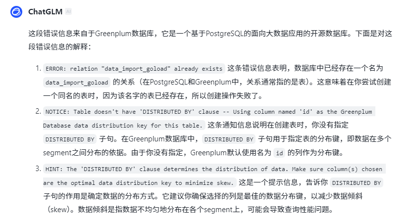

#### 准备数据

```powershell
# 数据还是用500w这个
[gpadmin@Master-a data500w]$ pwd
/home/gpadmin/import_data/data500w
[gpadmin@Master-a data500w]$ ls
data500w_log  get_script_data.sh  table_test.csv
[gpadmin@Master-a data500w]$ wc -l table_test.csv 
5000001 table_test.csv
[gpadmin@Master-a data500w]$
```

#### 构建YAML

```powershell
[gpadmin@Master-a data500w]$ cat data_gpload.yml 
VERSION: 1.0.0.1
DATABASE: test_db
USER: gpadmin
HOST: Master-a
PORT: 5432
GPLOAD:
  INPUT:
    - SOURCE:
        LOCAL_HOSTNAME:
          - Master-a
        PORT: 8081
        FILE:
          - /home/gpadmin/import_data/data500w/table_test.csv
    - COLUMNS:
          - id: int
          - name: text
          - age: int4
          - address: char
          - salary: float4
    - FORMAT: csv
    - ERROR_LIMIT: 25
    - error_table: public.data_import_goload_err
  OUTPUT:
    - TABLE: public.data_import_goload
    - MODE: INSERT
  SQL:
    - BEFORE: "truncate table public.data_import_goload"
    - AFTER: "ANALYZE public.data_import_goload"
EOF
[gpadmin@Master-a data500w]$

```

#### 参数解释

> 来源：GLM-4 大模型

这个YAML文件是用于Greenplum的`gpload`工具的配置文件，`gpload`是一个用于高效加载数据的工具。下面是对文件中各个参数的解释：

##### 版本
- `VERSION`: 配置文件的版本号。
##### 数据库连接
- `DATABASE`: 指定要加载数据的目标数据库的名称。
- `USER`: 指定连接到数据库的用户名。
- `HOST`: 指定数据库服务器的地址。
- `PORT`: 指定数据库服务器的端口号。
##### GPLOAD
###### INPUT
- `SOURCE`: 指定输入数据的来源。
  - `LOCAL_HOSTNAME`: 指定运行`gpload`的主机名。
  - `PORT`: 指定监听端口，`gpload`将从这个端口接收数据。
  - `FILE`: 指定要加载的本地文件路径。
- `COLUMNS`: 定义输入文件中每列的数据类型和表中的列名对应关系。
  - `id: int`: 列`id`的数据类型为整数。
  - `name: text`: 列`name`的数据类型为文本。
  - `age: int4`: 列`age`的数据类型为4字节整数。
  - `address: char`: 列`address`的数据类型为字符。
  - `salary: float4`: 列`salary`的数据类型为4字节浮点数。
- `FORMAT`: 指定输入文件的格式，这里是CSV。
- `ERROR_LIMIT`: 允许的最大错误数，超过这个数量将停止加载。
- `error_table`: 指定一个表来存储加载过程中出现的错误。
###### OUTPUT
- `TABLE`: 指定要插入数据的表名。
- `MODE`: 指定数据的加载模式，这里是`INSERT`，意味着数据将被插入到表中。
###### SQL
- `BEFORE`: 在加载数据之前执行的SQL语句，这里是清空表`public.data_import_goload`。
- `AFTER`: 在加载数据之后执行的SQL语句，这里是分析表`public.data_import_goload`以更新统计信息。
#### 执行gpload

```powershell
[gpadmin@Master-a data500w]$ gpload -f data_gpload.yml 
2024-11-07 14:59:55|ERROR|configuration file error: could not find expected ':', line 29
[gpadmin@Master-a data500w]$

报错了
```

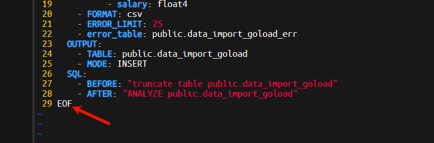

```powershell
[gpadmin@Master-a data500w]$ cat data_gpload.yml 
VERSION: 1.0.0.1
DATABASE: test_db
USER: gpadmin
HOST: Master-a
PORT: 5432
GPLOAD:
  INPUT:
    - SOURCE:
        LOCAL_HOSTNAME:
          - Master-a
        PORT: 8081
        FILE:
          - /home/gpadmin/import_data/data500w/table_test.csv
    - COLUMNS:
          - id: int
          - name: text
          - age: int4
          - address: char
          - salary: float4
    - FORMAT: csv
    - ERROR_LIMIT: 25
    - error_table: public.data_import_goload_err
  OUTPUT:
    - TABLE: public.data_import_goload
    - MODE: INSERT
  SQL:
    - BEFORE: "truncate table public.data_import_goload"
    - AFTER: "ANALYZE public.data_import_goload"
[gpadmin@Master-a data500w]$

# 再次执行
[gpadmin@Master-a data500w]$ gpload -f data_gpload.yml 
2024-11-07 15:02:30|INFO|gpload session started 2024-11-07 15:02:30
2024-11-07 15:02:30|WARN|ERROR_TABLE is not supported. We will set LOG_ERRORS and REUSE_TABLES to True for compatibility.
2024-11-07 15:02:30|INFO|started gpfdist -p 8081 -P 8082 -f "/home/gpadmin/import_data/data500w/table_test.csv" -t 30
2024-11-07 15:02:30|INFO|did not find an external table to reuse. creating ext_gpload_reusable_41483fe6_9cd6_11ef_b108_000c2943dbd3
2024-11-07 15:02:37|INFO|running time: 7.34 seconds
2024-11-07 15:02:37|INFO|rows Inserted          = 5000000
2024-11-07 15:02:37|INFO|rows Updated           = 0
2024-11-07 15:02:37|INFO|data formatting errors = 0
2024-11-07 15:02:37|INFO|gpload succeeded
[gpadmin@Master-a data500w]$
```

#### 查看数据

```powershell
test_db=# select count(1) from public.data_import_goload;
  count
---------
 5000000
(1 row)

test_db=# 
test_db=# select * from public.data_import_goload limit 10;
  id  |       name       | age | address | salary
------+------------------+-----+---------+--------
    4 | XXXXXXXXXXXXXXXX |  15 |         |   2696
  675 | LLLLLLLLLLLLLLLL |   3 |         |   4863
  980 | KKKKKKKKKKKKKKKK |  16 |         |   6583
 1240 | ZZZZZZZZZZZZZZZZ |  27 |         |   6983
 1548 | SSSSSSSSSSSSSSSS |  32 |         |   4628
 1615 | PPPPPPPPPPPPPPPP |   9 |         |   3919
 1664 | KKKKKKKKKKKKKKKK |  16 |         |   3083
 1706 | EEEEEEEEEEEEEEEE |  30 |         |   8086
 2385 | IIIIIIIIIIIIIIII |   9 |         |   7628
 2591 | QQQQQQQQQQQQQQQQ |   4 |         |   8050
(10 rows)

test_db=# 
```

#### 查看临时表

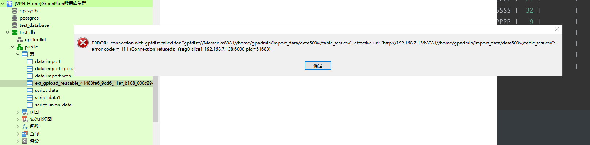

发现打不开了，但是数据已经写入进去了

### 实验开始-COPY

copy实际上是postgres数据库的命令参数，它可以快速的将数据进行导入以及导出，常见的文件支持格式是txt，csv，sql也可以支持压缩文件等。

语法是copy to 可以把表中的文件卸载到一个文件中；copy from 可以从一个文件加载数据到表中，需要注意的是该方法只能操作真实的表不能操作视图等虚拟层的东西。

#### 数据导入

##### 数据准备

还是用原来的500w的数据集

```powershell
[gpadmin@Master-a ~]$ cd import_data/data500w
[gpadmin@Master-a data500w]$ ls
data500w_log  data_gpload.yml  get_script_data.sh  table_test.csv
[gpadmin@Master-a data500w]$
```

###### 创建表

```sql
-- 构建表结构
CREATE TABLE "public"."data_import_copy" (
  "id" int4,
  "name" text,
  "age" int4,
  "address" char(50),
  "salary" float4
);
```

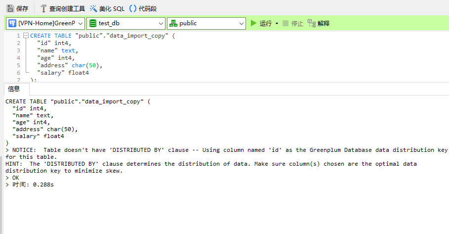

这个提示依然是分布键，使用id作为分布键，这表是创建成功了，接下来通过copy将数据导入进去。

###### 数据导入

```powershell
# 数据导入
COPY "public".data_import_copy 
FROM '/home/gpadmin/import_data/data500w/table_test.csv'
WITH (FORMAT CSV, HEADER true, DELIMITER ',');
```

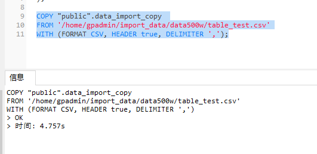

###### 数据查询

```sql
-- 查询数据条数
SELECT COUNT
	( 1 ) 
FROM
	"public".data_import_copy;
-- 查询数据质量	
SELECT
	* 
FROM
	"public".data_import_copy
LIMIT 10;
```

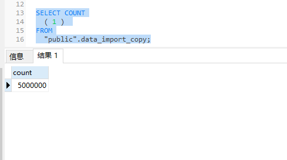

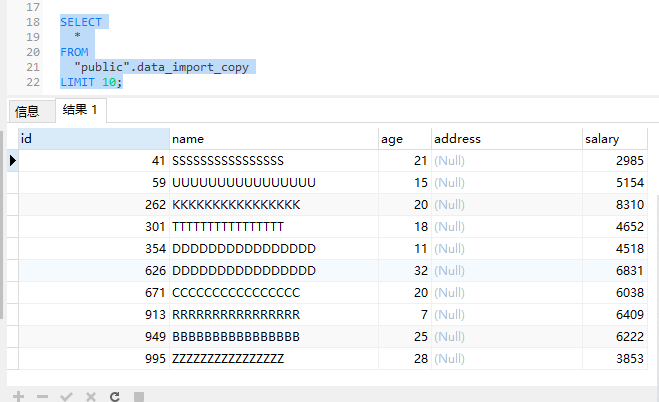

这个结果还是比较满意的，4.75s 500w的数据，虽然数据长度不大，但是数据量不小。

