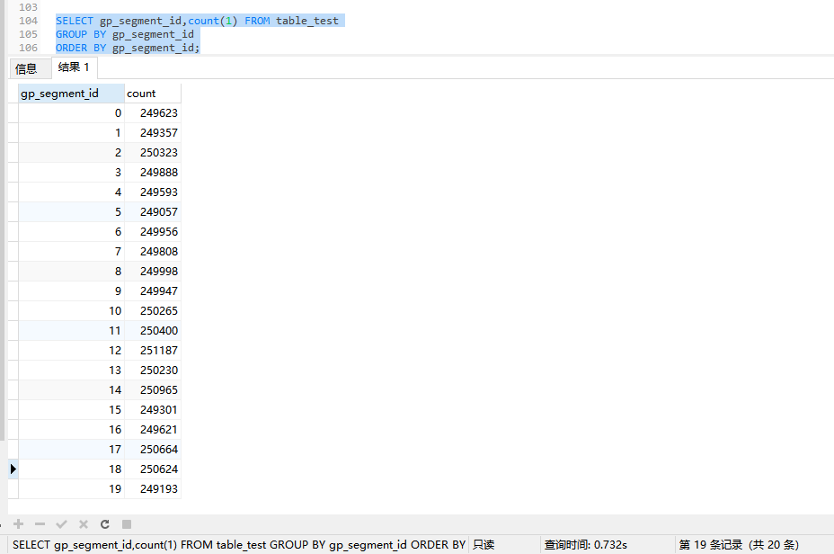

# GreenPlum集群实验室-7

> Author ：Heike07

[TOC]

## 实验七：大数据加载卸载

### 构建一下实验思路
数据导入，指的是通过特定的程序或者是相关工具进行大批量数据导入，体现出大（big），可以借助python等语言实现自定义工具集，同时重点是研究一下gp有没有特性的导入工具比如gpfdist等。

### 实验开始-Gpfdist

#### 第一次大数据导入实验

##### 导入数据准备

通过NAVICAT进行数据CSV导出，数据条数500w


数据传输至master服务器指定路径


##### 创建本地加载数据表-内部表

```powershell
test_db=# CREATE TABLE "public"."data_import" (
  "id" int4 NOT NULL,
  "name" text COLLATE "pg_catalog"."default" NOT NULL,
  "age" int4 NOT NULL,
  "address" char(50) COLLATE "pg_catalog"."default",
  "salary" float4,
  CONSTRAINT "table_test_pkey" PRIMARY KEY ("id")
)
;
CREATE TABLE

test_db=# ALTER TABLE "public"."data_import" 
  OWNER TO "gpadmin";
ALTER TABLE

test_db=# SELECT * FROM "public"."data_import";
Empty set

test_db=# 
```

##### 启动Gpfdist服务

```powershell
# 查看数据分隔符
[root@Master-a data500w]# tail table_test.csv 
"4998599","LLLLLLLLLLLLLLLL","23",,"2663"
"4998655","YYYYYYYYYYYYYYYY","32",,"345"
"4998695","HHHHHHHHHHHHHHHH","29",,"1680"
"4998803","AAAAAAAAAAAAAAAA","18",,"7413"
"4998946","KKKKKKKKKKKKKKKK","0",,"8625"
"4998972","EEEEEEEEEEEEEEEE","36",,"2614"
"4998999","SSSSSSSSSSSSSSSS","13",,"9208"
"4999678","ZZZZZZZZZZZZZZZZ","34",,"7177"
"4999837","TTTTTTTTTTTTTTTT","27",,"8108"
"4999896","[[[[[[[[[[[[[[[[","30",,"9321"
[root@Master-a data500w]#

由此得出，分隔符是, 数据标识符是""也是默认的CSV标准输出格式

[root@Master-a import_data]# chown -R gpadmin data500w/
[root@Master-a import_data]# cd data500w/
[root@Master-a data500w]# ll
total 207048
-rw-r--r-- 1 gpadmin root 212017092 Sep 12 09:57 table_test.csv
[root@Master-a data500w]#

[root@Master-a gpadmin]# chown  -R gpadmin:gpadmin import_data/
[root@Master-a gpadmin]# su gpadmin
[gpadmin@Master-a ~]$ cd import_data/
[gpadmin@Master-a import_data]$ ls
data500w
[gpadmin@Master-a import_data]$


# 启动进程
[gpadmin@Master-a import_data]$ mkdir data500w_log
[gpadmin@Master-a import_data]$ ll
total 0
drwxr-xr-x 2 gpadmin gpadmin 59 Sep 12 10:26 data500w
drwxrwxr-x 2 gpadmin gpadmin  6 Sep 12 10:29 data500w_log
[gpadmin@Master-a import_data]$ gpfdist -d data500w/ -p 8081 -l data500w_log/ &
[1] 21992
[gpadmin@Master-a import_data]$ 2024-09-12 10:29:56 21992 INFO Before opening listening sockets - following listening sockets are available:
2024-09-12 10:29:56 21992 INFO IPV6 socket: [::]:8081
2024-09-12 10:29:56 21992 INFO IPV4 socket: 0.0.0.0:8081
2024-09-12 10:29:56 21992 INFO Trying to open listening socket:
2024-09-12 10:29:56 21992 INFO IPV6 socket: [::]:8081
2024-09-12 10:29:56 21992 INFO Opening listening socket succeeded
2024-09-12 10:29:56 21992 INFO Trying to open listening socket:
2024-09-12 10:29:56 21992 INFO IPV4 socket: 0.0.0.0:8081
Serving HTTP on port 8081, directory /home/gpadmin/import_data/data500w

[gpadmin@Master-a import_data]$

# 查看进程
[gpadmin@Master-a import_data]$ ps -ef |grep gpfdist
gpadmin   21992  21896  0 10:29 pts/0    00:00:00 gpfdist -d data500w/ -p 8081 -l data500w_log/
gpadmin   21994  21896  0 10:30 pts/0    00:00:00 grep --color=auto gpfdist
[gpadmin@Master-a import_data]$ ss -lnpt |grep 8081
LISTEN     0      128       [::]:8081                  [::]:*                   users:(("gpfdist",pid=21992,fd=6))
[gpadmin@Master-a import_data]$
```

##### 创建外部加载数据表-外部表

```sql
CREATE EXTERNAL TABLE "public"."data_import_ext" (
  "id" int4,
  "name" text,
  "age" int4,
  "address" char(50),
  "salary" float4
)
LOCATION ('gpfdist://192.168.7.136:8081/table_test.csv')
FORMAT 'CSV' (DELIMITER AS ',' NULL AS '')
;
```


```powershell
# 查询尝试
test_db=# SELECT COUNT(1) FROM "public"."data_import_ext";
ERROR:  invalid input syntax for integer: "id"  (seg10 slice1 192.168.7.141:6002 pid=25668)
CONTEXT:  External table data_import_ext, line 1 of gpfdist://192.168.7.136:8081/table_test.csv, column id
test_db=# 
test_db=# 

查询失败！数据不正确
```

##### 停止Gpfdist服务

```powershell
[gpadmin@Master-a data500w]$ ps -ef |grep dist
gpadmin   21992      1  0 10:29 pts/0    00:00:00 gpfdist -d data500w/ -p 8081 -l data500w_log/
gpadmin   22334  22015  0 10:47 pts/0    00:00:00 grep --color=auto dist
[gpadmin@Master-a data500w]$ kill -9 21992
[gpadmin@Master-a data500w]$ ps -ef |grep dist
gpadmin   22363  22015  0 10:47 pts/0    00:00:00 grep --color=auto dist
[gpadmin@Master-a data500w]$
```

##### 删除EXT表

```powershell
test_db=# DROP TABLE "public"."data_import_ext";
ERROR:  "data_import_ext" is not a base table
HINT:  Use DROP EXTERNAL TABLE to remove an external table.
test_db=# 

删除失败

test_db=# DROP EXTERNAL TABLE "public"."data_import_ext";
DROP EXTERNAL TABLE
test_db=# 

删除成功
```

#### 第二次大数据导入实验

##### 创建外部加载数据表-外部表-(2)

```powershell
test_db=# CREATE EXTERNAL TABLE "public"."data_import_ext" (
  "id" int4,
  "name" text,
  "age" int4,
  "address" char(50),
  "salary" float4
)
LOCATION ('gpfdist://192.168.7.136:8081/table_test.csv')
FORMAT 'CSV' (HEADER)
;
NOTICE:  HEADER means that each one of the data files has a header row
CREATE EXTERNAL TABLE

# 数据查询
test_db=# SELECT COUNT(1) FROM "public"."data_import_ext";
ERROR:  connection with gpfdist failed for "gpfdist://192.168.7.136:8081/table_test.csv", effective url: "http://192.168.7.136:8081/table_test.csv": error code = 111 (Connection refused);  (seg12 slice1 192.168.7.140:6000 pid=25789)
NOTICE:  HEADER means that each one of the data files has a header row
test_db=# 

查询失败
```

##### 开启Gpfdist服务-(2)

```powershell
[gpadmin@Master-a import_data]$ gpfdist -d data500w/ -p 8081 -l data500w_log/ &
[1] 22487
[gpadmin@Master-a import_data]$ 2024-09-12 10:55:55 22487 INFO Before opening listening sockets - following listening sockets are available:
2024-09-12 10:55:55 22487 INFO IPV6 socket: [::]:8081
2024-09-12 10:55:55 22487 INFO IPV4 socket: 0.0.0.0:8081
2024-09-12 10:55:55 22487 INFO Trying to open listening socket:
2024-09-12 10:55:55 22487 INFO IPV6 socket: [::]:8081
2024-09-12 10:55:55 22487 INFO Opening listening socket succeeded
2024-09-12 10:55:55 22487 INFO Trying to open listening socket:
2024-09-12 10:55:55 22487 INFO IPV4 socket: 0.0.0.0:8081
Serving HTTP on port 8081, directory /home/gpadmin/import_data/data500w

[gpadmin@Master-a import_data]$

# 数据查询
test_db=# SELECT COUNT(1) FROM "public"."data_import_ext";
  count
---------
 5000000
(1 row)

NOTICE:  HEADER means that each one of the data files has a header row
test_db=# 

查询成功 500w数据

# 数据查询具体数据展示
test_db=# SELECT * FROM "public"."data_import_ext" LIMIT 10;
 id  |       name       | age | address | salary
-----+------------------+-----+---------+--------
  34 | KKKKKKKKKKKKKKKK |  16 |         |   3954
  53 | YYYYYYYYYYYYYYYY |  33 |         |   6884
  70 | ZZZZZZZZZZZZZZZZ |  13 |         |   2475
  75 | [[[[[[[[[[[[[[[[ |  32 |         |   6818
  80 | VVVVVVVVVVVVVVVV |  32 |         |    869
  93 | PPPPPPPPPPPPPPPP |   4 |         |   9570
 109 | BBBBBBBBBBBBBBBB |  19 |         |   7567
 142 | CCCCCCCCCCCCCCCC |  28 |         |   8775
 143 | UUUUUUUUUUUUUUUU |   5 |         |   1298
 190 | UUUUUUUUUUUUUUUU |   0 |         |   7145
(10 rows)

NOTICE:  HEADER means that each one of the data files has a header row
test_db=# 

test_db=# SELECT * FROM "public"."data_import_ext" WHERE id=1;
 id |       name       | age | address | salary
----+------------------+-----+---------+--------
  1 | XXXXXXXXXXXXXXXX |  20 |         |   5555
(1 row)

NOTICE:  HEADER means that each one of the data files has a header row
test_db=# 

NOTICE:  HEADER means that each one of the data files has a header row
证明此CSV带表头-第一行为表头
```

##### 将外部表导入内部表

```powershell
# 导入前查询
test_db=# SELECT COUNT(1) FROM "public"."data_import";
 count
-------
     0
(1 row)

test_db=# 

# 导入
test_db=# INSERT INTO "public"."data_import" SELECT * FROM "public"."data_import_ext";
NOTICE:  HEADER means that each one of the data files has a header row
INSERT 0 5000000

test_db=# SELECT COUNT(1) FROM "public"."data_import";
  count
---------
 5000000
(1 row)

test_db=# 

# 时间查看
INSERT INTO "public"."data_import" SELECT * FROM "public"."data_import_ext"
> NOTICE:  HEADER means that each one of the data files has a header row
> Affected rows: 5000000
> 时间: 6.867s
```

##### 停止Gpfdist服务-(2)

```powershell
[gpadmin@Master-a import_data]$ ps -ef |grep dist
gpadmin   22487  22015  0 10:55 pts/0    00:00:03 gpfdist -d data500w/ -p 8081 -l data500w_log/
gpadmin   22522  22015  0 11:24 pts/0    00:00:00 grep --color=auto dist
[gpadmin@Master-a import_data]$ kill -9 22487
[gpadmin@Master-a import_data]$
```

##### 删除EXT表-(2)

```powershell
test_db=# DROP EXTERNAL TABLE "public"."data_import_ext";
DROP EXTERNAL TABLE

test_db=# 
```

#### 数据量提升

##### 导入数据准备

```sql
-- 模拟数据构建
-- 创建一个公司人员信息记录表格
-- 创建表 employees_import 并添加注释
CREATE TABLE employees_import (
  id SERIAL PRIMARY KEY,
  name VARCHAR(50) NOT NULL,  -- 姓名
  age INTEGER NOT NULL,  -- 年龄
  gender CHAR(1) NOT NULL,  -- 性别（M 或 F）
  department VARCHAR(50) NOT NULL,  -- 部门
  hire_date DATE NOT NULL,  -- 入职日期
  birth_date DATE NOT NULL,  -- 出生日期
  address VARCHAR(100) NOT NULL,  -- 地址
  salary INTEGER NOT NULL  -- 薪资
);

-- 为表添加注释
COMMENT ON TABLE employees_import IS '员工信息表，包括姓名、年龄、性别、部门、入职日期、出生日期、地址和薪资等字段。';

-- 为字段添加注释
COMMENT ON COLUMN employees_import.name IS '员工姓名，以固定格式加随机数生成';
COMMENT ON COLUMN employees_import.age IS '员工年龄，范围在 18 到 60 之间';
COMMENT ON COLUMN employees_import.gender IS '员工性别，M 代表男性，F 代表女性';
COMMENT ON COLUMN employees_import.department IS '员工部门，如 HR、Engineering、Marketing、Sales';
COMMENT ON COLUMN employees_import.hire_date IS '员工入职日期，随机生成的日期';
COMMENT ON COLUMN employees_import.birth_date IS '员工出生日期，随机生成的日期';
COMMENT ON COLUMN employees_import.address IS '员工地址，随机生成的地址信息';
COMMENT ON COLUMN employees_import.salary IS '员工薪资，范围在 3000 到 50000 之间';

-- 插入模拟数据
INSERT INTO employees_import (name, age, gender, department, hire_date, birth_date, address, salary)
SELECT 
  -- 固定格式姓名加随机数，例如 "员工_123"
  '员工_' || FLOOR(RANDOM() * 1000)::INTEGER AS name,
  FLOOR(RANDOM() * (60-18) + 18),  -- 随机生成年龄在 18 到 60 之间
  CASE 
    WHEN RANDOM() < 0.5 THEN 'M'
    ELSE 'F'
  END,  -- 随机生成性别
  CASE 
    WHEN RANDOM() < 0.25 THEN 'HR'
    WHEN RANDOM() < 0.5 THEN 'Engineering'
    WHEN RANDOM() < 0.75 THEN 'Marketing'
    ELSE 'Sales'
  END,  -- 随机选择部门
  DATE '2000-01-01' + ((RANDOM() * 3650)::INTEGER) * INTERVAL '1 day',  -- 随机生成入职日期
  DATE '1960-01-01' + ((RANDOM() * 15000)::INTEGER) * INTERVAL '1 day',  -- 随机生成一个出生日期在 1960-01-01 到 2000-01-01 之间
  CASE 
    WHEN RANDOM() < 0.25 THEN '北京市'
    WHEN RANDOM() < 0.5 THEN '上海市'
    WHEN RANDOM() < 0.75 THEN '广州市'
    ELSE '深圳市'
  END || ' ' || '随机街道' || (FLOOR(RANDOM() * 100) + 1) || '号',  -- 随机生成地址
  FLOOR(RANDOM() * (50000 - 3000) + 3000)  -- 随机生成薪资范围在 3000 到 50000 之间
FROM 
  generate_series(1, 100000000);  -- 生成 1 亿条记录
```

##### 查看数据情况


```powershell
1亿数据太大了 小集群吃不消 降档吧
  generate_series(1, 10000000);  -- 生成 1000w条记录

算了，还是按之前的数据导入吧，这个太慢了
```

##### 导入数据准备-(2)

```sql
CREATE TABLE table_data(
  ID INT PRIMARY KEY   NOT NULL,
  NAME      TEXT  NOT NULL,
  AGE      INT   NOT NULL,
  ADDRESS    CHAR(50),
  SALARY     REAL
);

# 写入随机测试数据5000w
DO $$
DECLARE
  batch_size INTEGER := 5000000;
  num_batches INTEGER := 10;
BEGIN
  FOR i IN 1..num_batches LOOP
    INSERT INTO table_data (ID, NAME, AGE, ADDRESS, SALARY)
    SELECT 
      g.key,
      repeat(chr(int4(random() * 26 + 65)), 16),
      (random() * 36)::integer,
      NULL,
      (random() * 10000)::integer
    FROM (
      SELECT generate_series((i-1)*batch_size + 1, i*batch_size) AS key
    ) g;
  END LOOP;
END $$;

```

##### 查看数据情况-(2)

```sql
SELECT COUNT(1) FROM table_data
> OK
> 时间: 5.533s

数据量 5000w
50000000
```

#### 第一次数据卸载实验

上面是通过csv文件导入到服务器上，实际上可以进行数据卸载,进行5000w的数据导出

```sql
-- 创建外部表用于数据导出
CREATE WRITABLE EXTERNAL TABLE table_data_out ( LIKE table_data )
LOCATION('gpfdist://192.168.7.136:8082/table_data_out')
FORMAT 'CSV' (DELIMITER ',' NULL '')
DISTRIBUTED BY (id);

-- 数据导出
INSERT INTO table_data_out SELECT * FROM table_data
> Affected rows: 50000000
> 时间: 47.867s

-- 数据查询
SELECT COUNT(1) FROM table_data_out
> ERROR:  cannot read from a WRITABLE external table
HINT:  Create the table as READABLE instead.

> 时间: 0.246s
-- 查询失败，因为数据只可写
```

##### 开启Gpfdist服务-数据卸载

```powershell
# 创建数据导出目录
[gpadmin@Master-a ~]$ mkdir output_data
[gpadmin@Master-a ~]$ cd output_data/
[gpadmin@Master-a output_data]$ mkdir data5000w
[gpadmin@Master-a output_data]$ cd data5000w/
[gpadmin@Master-a data5000w]$ pwd
/home/gpadmin/output_data/data5000w
[gpadmin@Master-a data5000w]$

[gpadmin@Master-a output_data]$ gpfdist -d data5000w/ -p 8082 -l data5000w.log &
[1] 71720
[gpadmin@Master-a output_data]$ 2024-09-12 14:16:10 71720 INFO Before opening listening sockets - following listening sockets are available:
2024-09-12 14:16:10 71720 INFO IPV6 socket: [::]:8082
2024-09-12 14:16:10 71720 INFO IPV4 socket: 0.0.0.0:8082
2024-09-12 14:16:10 71720 INFO Trying to open listening socket:
2024-09-12 14:16:10 71720 INFO IPV6 socket: [::]:8082
2024-09-12 14:16:10 71720 INFO Opening listening socket succeeded
2024-09-12 14:16:10 71720 INFO Trying to open listening socket:
2024-09-12 14:16:10 71720 INFO IPV4 socket: 0.0.0.0:8082
Serving HTTP on port 8082, directory /home/gpadmin/output_data/data5000w

[gpadmin@Master-a output_data]$
```

##### 查看数据卸载情况

```powershell
[gpadmin@Master-a data5000w]$ ll
total 1679844
-rw-rw-r-- 1 gpadmin gpadmin        162 Sep 12 14:18 data5000w.log
-rw------- 1 gpadmin gpadmin 1720154314 Sep 12 14:18 table_data_out
# 查看数据日志
[gpadmin@Master-a data5000w]$ tail data5000w.log 
2024-09-12 14:18:08 71720 INFO remove sessions
2024-09-12 14:18:56 71720 INFO free session 48-0000000127.0.0.0:/home/gpadmin/output_data/data5000w/table_data_out
[gpadmin@Master-a data5000w]$ tail table_data_out 
49999766,GGGGGGGGGGGGGGGG,7,,9676
49999781,YYYYYYYYYYYYYYYY,5,,2346
49999821,CCCCCCCCCCCCCCCC,7,,2749
49999840,DDDDDDDDDDDDDDDD,26,,4018
49999868,JJJJJJJJJJJJJJJJ,33,,2287
49999898,WWWWWWWWWWWWWWWW,8,,6697
49999926,FFFFFFFFFFFFFFFF,36,,4084
49999938,KKKKKKKKKKKKKKKK,13,,594
49999956,AAAAAAAAAAAAAAAA,5,,4469
49999984,SSSSSSSSSSSSSSSS,36,,9496
[gpadmin@Master-a data5000w]$

[gpadmin@Master-a data5000w]$ wc -l table_data_out 
50000000 table_data_out
[gpadmin@Master-a data5000w]$

文件名应该是 table_data_out.csv 构建服务的时候忘写了 问题不大

[gpadmin@Master-a data5000w]$ head table_data_out 
19,LLLLLLLLLLLLLLLL,16,,1394
36,RRRRRRRRRRRRRRRR,33,,5881
40,SSSSSSSSSSSSSSSS,19,,2725
63,[[[[[[[[[[[[[[[[,24,,6041
87,PPPPPPPPPPPPPPPP,21,,3804
107,EEEEEEEEEEEEEEEE,34,,9162
128,OOOOOOOOOOOOOOOO,19,,9443
154,RRRRRRRRRRRRRRRR,15,,6486
175,VVVVVVVVVVVVVVVV,5,,1470
192,ZZZZZZZZZZZZZZZZ,3,,161

可以看到导出的数据是不含表头的？
GPT4.0:

是的，使用 CREATE WRITABLE EXTERNAL TABLE 的方式来导出数据到外部文件（例如 CSV 文件）时，默认情况下，数据文件不包含表头（列名）。这是因为外部表的设计是为了与数据源进行直接交互，并不包含额外的元数据，如列名。
```

##### 停止Gpfdist服务-数据卸载

```powershell
[gpadmin@Master-a data5000w]$ ps -ef |grep dist
gpadmin   71720  65998  4 14:16 pts/0    00:00:47 gpfdist -d data5000w/ -p 8082 -l data5000w.log
gpadmin   95823  65998  0 14:32 pts/0    00:00:00 grep --color=auto dist
[gpadmin@Master-a data5000w]$ kill -9 71720
```

##### 删除OUT表

```sql
DROP EXTERNAL TABLE "public"."table_data_out"
> OK
> 时间: 0.223s
```

#### 查看数据分布情况

```powershell
SELECT gp_segment_id,count(1) FROM table_test
GROUP BY gp_segment_id
ORDER BY gp_segment_id
> OK
> 时间: 0.617s
```




#### 总结

外部表，用于数据导入和数据卸载；Gpfdist服务，用于关联文件和服务；内部表，用于数据查询和存储；速度来看，还挺快的。

### 实验开始-基于Web的外部表接入

上面实验介绍了基于文件服务器的数据表，其实还可以使用基于web表的方式读取静态数据。

#### 先做一个http代理

采用最原始的httpd的方式进行代理，不使用nginx，nginx也可以实现相应的内容，最后可以实现通过URL能访问固定的文件结构和数据即可。

```powershell
# 查看yum源状态
[root@Master-a ~]# yum makecache
Loaded plugins: fastestmirror
Determining fastest mirrors
localhttp                                                                                                           | 3.6 kB  00:00:00     
Metadata Cache Created
[root@Master-a ~]# cat /etc/yum.repos.d/localhttp.repo 
[localhttp]
name=Local Yum http
baseurl=http://192.168.7.137/localyum
enable=1
gpgcheck=0
[root@Master-a ~]# cat /etc/hosts
127.0.0.1   localhost localhost.localdomain localhost4 localhost4.localdomain4
::1         localhost localhost.localdomain localhost6 localhost6.localdomain6
192.168.7.136  Master-a
192.168.7.137  Standby-a
192.168.7.138  Segment-a
192.168.7.139  Segment-b
192.168.7.141  Segment-c
192.168.7.140  Segment-d
[root@Master-a ~]#

# 查看httpd服务状态
[root@Master-a ~]# systemctl status httpd
Unit httpd.service could not be found.
[root@Master-a ~]#

# 安装httpd服务状态
[root@Master-a ~]# yum install httpd
Loaded plugins: fastestmirror
Loading mirror speeds from cached hostfile
Resolving Dependencies
--> Running transaction check
---> Package httpd.x86_64 0:2.4.6-93.el7.centos will be installed
--> Processing Dependency: httpd-tools = 2.4.6-93.el7.centos for package: httpd-2.4.6-93.el7.centos.x86_64
--> Processing Dependency: /etc/mime.types for package: httpd-2.4.6-93.el7.centos.x86_64
--> Running transaction check
---> Package httpd-tools.x86_64 0:2.4.6-93.el7.centos will be installed
---> Package mailcap.noarch 0:2.1.41-2.el7 will be installed
--> Finished Dependency Resolution

Dependencies Resolved

===========================================================================================================================================
 Package                         Arch                       Version                                    Repository                     Size
===========================================================================================================================================
Installing:
 httpd                           x86_64                     2.4.6-93.el7.centos                        localhttp                     2.7 M
Installing for dependencies:
 httpd-tools                     x86_64                     2.4.6-93.el7.centos                        localhttp                      92 k
 mailcap                         noarch                     2.1.41-2.el7                               localhttp                      31 k

Transaction Summary
===========================================================================================================================================
Install  1 Package (+2 Dependent packages)

Total download size: 2.8 M
Installed size: 9.6 M
Is this ok [y/d/N]: y
Downloading packages:
(1/3): httpd-tools-2.4.6-93.el7.centos.x86_64.rpm                                                                   |  92 kB  00:00:00     
(2/3): mailcap-2.1.41-2.el7.noarch.rpm                                                                              |  31 kB  00:00:00     
(3/3): httpd-2.4.6-93.el7.centos.x86_64.rpm                                                                         | 2.7 MB  00:00:00     
-------------------------------------------------------------------------------------------------------------------------------------------
Total                                                                                                       33 MB/s | 2.8 MB  00:00:00     
Running transaction check
Running transaction test
Transaction test succeeded
Running transaction
  Installing : mailcap-2.1.41-2.el7.noarch                                                                                             1/3 
  Installing : httpd-tools-2.4.6-93.el7.centos.x86_64                                                                                  2/3 
  Installing : httpd-2.4.6-93.el7.centos.x86_64                                                                                        3/3 
  Verifying  : httpd-tools-2.4.6-93.el7.centos.x86_64                                                                                  1/3 
  Verifying  : mailcap-2.1.41-2.el7.noarch                                                                                             2/3 
  Verifying  : httpd-2.4.6-93.el7.centos.x86_64                                                                                        3/3 

Installed:
  httpd.x86_64 0:2.4.6-93.el7.centos                                                                                                       

Dependency Installed:
  httpd-tools.x86_64 0:2.4.6-93.el7.centos                                  mailcap.noarch 0:2.1.41-2.el7                                 

Complete!
[root@Master-a ~]# systemctl status httpd
● httpd.service - The Apache HTTP Server
   Loaded: loaded (/usr/lib/systemd/system/httpd.service; disabled; vendor preset: disabled)
   Active: inactive (dead)
     Docs: man:httpd(8)
           man:apachectl(8)
[root@Master-a ~]#

# 开启服务-并开启自启动

[root@Master-a ~]# systemctl enable httpd --now
Created symlink from /etc/systemd/system/multi-user.target.wants/httpd.service to /usr/lib/systemd/system/httpd.service.
[root@Master-a ~]# systemctl status httpd
● httpd.service - The Apache HTTP Server
   Loaded: loaded (/usr/lib/systemd/system/httpd.service; enabled; vendor preset: disabled)
   Active: active (running) since Mon 2024-10-28 14:43:57 CST; 3s ago
     Docs: man:httpd(8)
           man:apachectl(8)
 Main PID: 2432 (httpd)
   Status: "Processing requests..."
   CGroup: /system.slice/httpd.service
           ├─2432 /usr/sbin/httpd -DFOREGROUND
           ├─2433 /usr/sbin/httpd -DFOREGROUND
           ├─2434 /usr/sbin/httpd -DFOREGROUND
           ├─2435 /usr/sbin/httpd -DFOREGROUND
           ├─2436 /usr/sbin/httpd -DFOREGROUND
           └─2437 /usr/sbin/httpd -DFOREGROUND

Oct 28 14:43:57 Master-a systemd[1]: Starting The Apache HTTP Server...
Oct 28 14:43:57 Master-a httpd[2432]: AH00558: httpd: Could not reliably determine the server's fully qualified domain name, usi... message
Oct 28 14:43:57 Master-a systemd[1]: Started The Apache HTTP Server.
Hint: Some lines were ellipsized, use -l to show in full.
[root@Master-a ~]#

# 访问尝试
[root@Master-a ~]# curl -I http://192.168.7.136/test
HTTP/1.1 404 Not Found
Date: Mon, 28 Oct 2024 06:46:04 GMT
Server: Apache/2.4.6 (CentOS)
Content-Type: text/html; charset=iso-8859-1

# 数据导入 - 查看数据
[root@Master-a data500w]# pwd
/home/gpadmin/import_data/data500w
[root@Master-a data500w]# head table_test.csv 
"id","name","age","address","salary"
"34","KKKKKKKKKKKKKKKK","16",,"3954"
"53","YYYYYYYYYYYYYYYY","33",,"6884"
"70","ZZZZZZZZZZZZZZZZ","13",,"2475"
"75","[[[[[[[[[[[[[[[[","32",,"6818"
"80","VVVVVVVVVVVVVVVV","32",,"869"
"93","PPPPPPPPPPPPPPPP","4",,"9570"
"109","BBBBBBBBBBBBBBBB","19",,"7567"
"142","CCCCCCCCCCCCCCCC","28",,"8775"
"143","UUUUUUUUUUUUUUUU","5",,"1298"
[root@Master-a data500w]#

# 映射到httpd服务
[root@Master-a html]# pwd
/var/www/html
[root@Master-a html]# mkdir import_data
[root@Master-a html]# cd import_data/
[root@Master-a import_data]# cp /home/gpadmin/import_data/data500w/table_test.csv .
[root@Master-a import_data]# ls
table_test.csv
[root@Master-a import_data]#

# 访问测试
[root@Master-a ~]# curl -s http://192.168.7.136/import_data/table_test.csv | head -n 10
"id","name","age","address","salary"
"34","KKKKKKKKKKKKKKKK","16",,"3954"
"53","YYYYYYYYYYYYYYYY","33",,"6884"
"70","ZZZZZZZZZZZZZZZZ","13",,"2475"
"75","[[[[[[[[[[[[[[[[","32",,"6818"
"80","VVVVVVVVVVVVVVVV","32",,"869"
"93","PPPPPPPPPPPPPPPP","4",,"9570"
"109","BBBBBBBBBBBBBBBB","19",,"7567"
"142","CCCCCCCCCCCCCCCC","28",,"8775"
"143","UUUUUUUUUUUUUUUU","5",,"1298"
[root@Master-a ~]#

以上可通过代理进行访问数据csv - 但是这种非常不安全！
```

#### 数据表创建

```powershell
# 构建数据表创建语句
test_db=# CREATE EXTERNAL TABLE "public"."data_import_web" (
  "id" int4,
  "name" text,
  "age" int4,
  "address" char(50),
  "salary" float4
)
LOCATION ('http://192.168.7.136/import_data/table_test.csv')
FORMAT 'CSV' (HEADER)
;

# 尝试数据表创建
test_db=# CREATE EXTERNAL TABLE "public"."data_import_web" (
  "id" int4,
  "name" text,
  "age" int4,
  "address" char(50),
  "salary" float4
)
LOCATION ('http://192.168.7.136/import_data/table_test.csv')
FORMAT 'CSV' (HEADER)
;
ERROR:  http URI's can only be used in an external web table
HINT:  Use CREATE EXTERNAL WEB TABLE instead.
test_db=# 

提示语法错误 修改一下再次执行

# 再次构建
test_db=# CREATE EXTERNAL WEB TABLE "public"."data_import_web" (
  "id" int4,
  "name" text,
  "age" int4,
  "address" char(50),
  "salary" float4
)
LOCATION ('http://192.168.7.136/import_data/table_test.csv')
FORMAT 'CSV' (HEADER)
;

# 再次尝试数据表创建
test_db=# CREATE EXTERNAL WEB TABLE "public"."data_import_web" (
  "id" int4,
  "name" text,
  "age" int4,
  "address" char(50),
  "salary" float4
)
LOCATION ('http://192.168.7.136/import_data/table_test.csv')
FORMAT 'CSV' (HEADER)
;
NOTICE:  HEADER means that each one of the data files has a header row
CREATE EXTERNAL TABLE

# 查看数据
test_db=# select count(*) from "public"."data_import_web";
  count
---------
 5000000
(1 row)

NOTICE:  HEADER means that each one of the data files has a header row
test_db=# 

数据创建成功！

```

#### 数据修改


可以看到报错了，数据以只读的方式进行加载而不是写入到了segment中，如果想写入可以创建内部表然后用 insert in to 的方式进行写入。

#### 服务关联观察

把httpd服务关掉尝试查看数据

```powershell
# 关闭httpd服务
[root@Master-a ~]# systemctl disable httpd --now
Removed symlink /etc/systemd/system/multi-user.target.wants/httpd.service.
[root@Master-a ~]# systemctl status httpd
● httpd.service - The Apache HTTP Server
   Loaded: loaded (/usr/lib/systemd/system/httpd.service; disabled; vendor preset: disabled)
   Active: inactive (dead)
     Docs: man:httpd(8)
           man:apachectl(8)

Oct 28 14:43:57 Master-a systemd[1]: Starting The Apache HTTP Server...
Oct 28 14:43:57 Master-a httpd[2432]: AH00558: httpd: Could not reliably determine the server's fully qualified domain name, usi... message
Oct 28 14:43:57 Master-a systemd[1]: Started The Apache HTTP Server.
Oct 28 15:22:35 Master-a systemd[1]: Stopping The Apache HTTP Server...
Oct 28 15:22:36 Master-a systemd[1]: Stopped The Apache HTTP Server.
Hint: Some lines were ellipsized, use -l to show in full.
[root@Master-a ~]#

# 访问测试
[root@Master-a ~]# curl -s http://192.168.7.136/import_data/table_test.csv | head -n 10
[root@Master-a ~]#

# 数据库查询测试
test_db=# select count(*) from "public"."data_import_web";
ERROR:  connection with gpfdist failed for "http://192.168.7.136/import_data/table_test.csv", effective url: "http://192.168.7.136/import_data/table_test.csv": error code = 111 (Connection refused);  (seg0 slice1 192.168.7.138:6000 pid=7202)
NOTICE:  HEADER means that each one of the data files has a header row
test_db=# 

```

#### 总结

可以看到是一个只读的状态，当代理的服务关闭后数据无法进行查看，但是这个是既gpfdist服务的又一种数据读入方式，可见gp数据库对数据库接入有明显的兼容性，为特定环境提供了不同的接入可能性。

