# GreenPlum集群实验室-6

> Author ：Heike07

[TOC]

## 实验八：数据备份&数据恢复

### 数据SQL操作

#### Pg_dump导出数据SQL

##### 导出单个数据库中的单个表

###### 数据选择

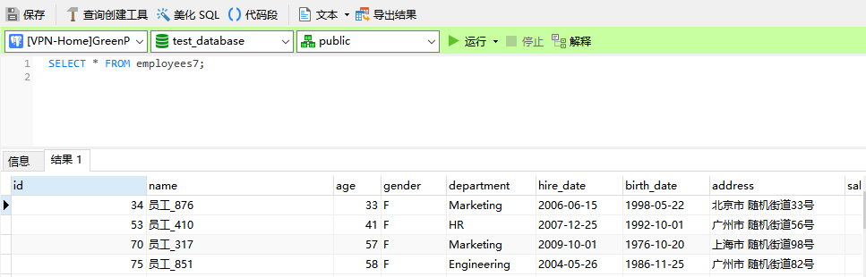

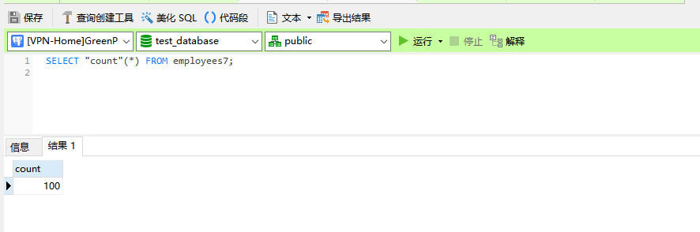

我们选择这个员工信息表作为导出的数据

###### 执行语句导出

```powershell
# 数据导出
[gpadmin@Master-a ~]$ mkdir output_sql
[gpadmin@Master-a ~]$ cd output_sql/
[gpadmin@Master-a output_sql]$ ls
[gpadmin@Master-a output_sql]$

# 单表导出
[gpadmin@Master-a output_sql]$ pg_dump -h Master-a -p 5432 -U gpadmin -d test_database -t public.employees7 -f employees7.sql
```

###### 分析导出SQL

导出文件可在同级图片文件目录查看

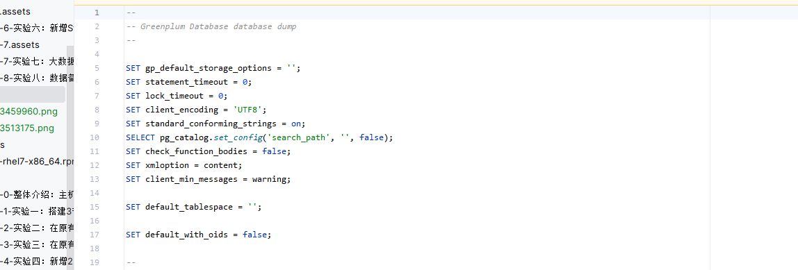

数据库设置部分 对导出的环境的设置进行导出

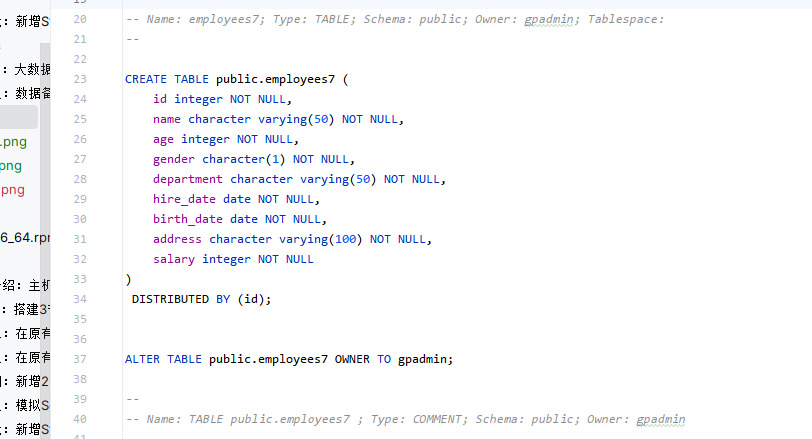

建表和权限部分，可以看到创建了一个表，并设置分布键为id用于分布式存储唯一键值，并设置账户权限为gpadmin用户

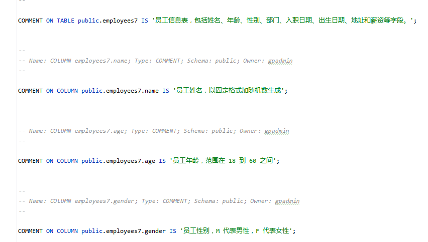

表字段的注释，这是在创建表的时候带入的，可以看到也是很完整的输出出来

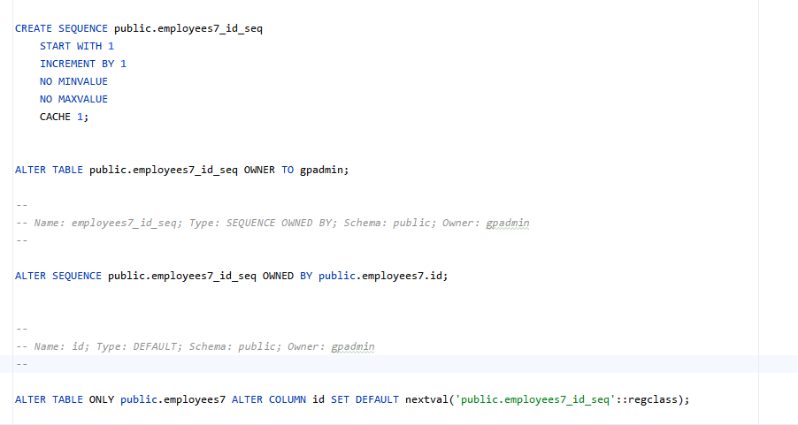

创建了一个序列，并将序列设置好了相应的用户权限，关联序列和表的列，设置列的默认值nextval('public.employees7_id_seq'::regclass)，为每次插入新行都会从employees7_id_seq序列中取下一个值作为id的默认值

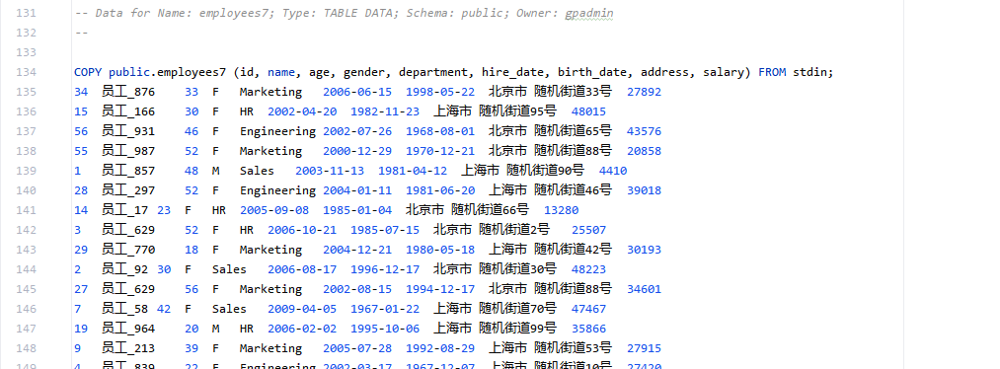

对上述字段通过COPY整合形成数据，更加直观而不像mysql的都是insert插入语句，直观清晰，好评！

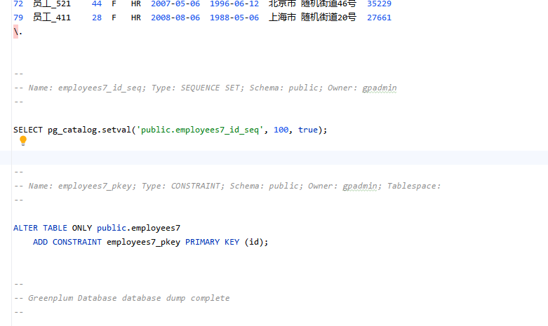

###### 小结

copy最后一行的插入结束标识，更新序列当前值为100，增加主键约束，并设置主键不能为空，限制此操作只应用于当前表不影响继承表。

通过分析导出的sql文件可以看到，整体上导出的sql还是比较清楚明了的。

##### 导出单个数据库中的全部表

###### 数据选择

```sql
/* 创建临时表 */
CREATE TEMP TABLE temp_table_counts (
    schema_name TEXT,
    table_name TEXT,
    row_count BIGINT
);

/* 动态插入数据 */
DO $$
DECLARE
    tbl RECORD;
BEGIN
    FOR tbl IN 
        SELECT 
            n.nspname AS schema_name, 
            c.relname AS table_name 
        FROM 
            pg_class c 
        JOIN 
            pg_namespace n ON n.oid = c.relnamespace
        WHERE 
            c.relkind = 'r' 
            AND n.nspname NOT IN ('pg_catalog', 'information_schema', 'gp_toolkit')
    LOOP
        EXECUTE format(
            'INSERT INTO temp_table_counts (schema_name, table_name, row_count) 
             SELECT %L, %L, count(*) FROM %I.%I',
            tbl.schema_name, 
            tbl.table_name, 
            tbl.schema_name, 
            tbl.table_name
        );
    END LOOP;
END $$;

/* 查询临时表结果 */
SELECT * FROM temp_table_counts ORDER BY row_count DESC;
```

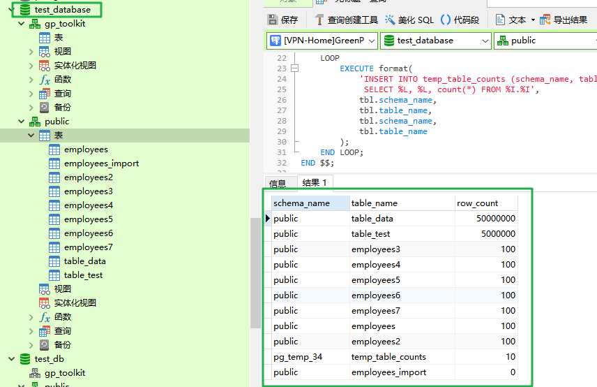

通过构建数据语句可以看到准备导出sql的数据全部表数据量为5亿、500w、100条若干等。

###### 执行语句导出

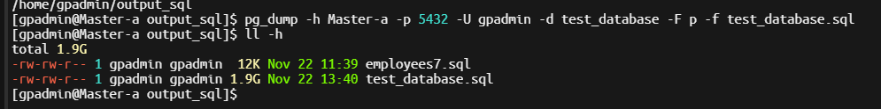

```powershell
[gpadmin@Master-a output_sql]$ pg_dump -h Master-a -p 5432 -U gpadmin -d test_database -F p -f test_database.sql
[gpadmin@Master-a output_sql]$ ll -h
total 1.9G
-rw-rw-r-- 1 gpadmin gpadmin  12K Nov 22 11:39 employees7.sql
-rw-rw-r-- 1 gpadmin gpadmin 1.9G Nov 22 13:40 test_database.sql
[gpadmin@Master-a output_sql]$
```

###### 分析导出SQL

这个文件过大就不拿出来了，就在linux中分析

```powershell
# 确认数据不为空
[gpadmin@Master-a output_sql]$ wc -l test_database.sql 
55001499 test_database.sql
[gpadmin@Master-a output_sql]$

[gpadmin@Master-a output_sql]$ head test_database.sql 
--
-- Greenplum Database database dump
--

SET gp_default_storage_options = '';
SET statement_timeout = 0;
SET lock_timeout = 0;
SET client_encoding = 'UTF8';
SET standard_conforming_strings = on;
SELECT pg_catalog.set_config('search_path', '', false);
[gpadmin@Master-a output_sql]$

# 分析文件
# 先分析数据库中表是否存在
```

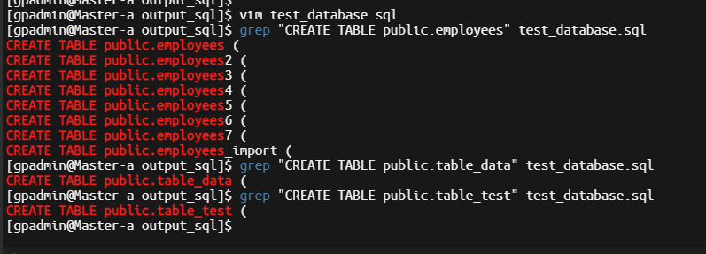

前面都和其他的都一样，我们看下数据部分 直接搜索COPY

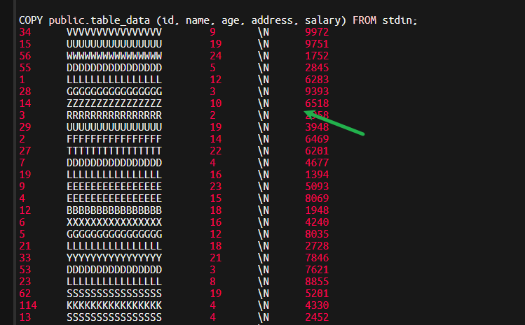

根据之前查看的结果那行数应该大于5亿，查看一下

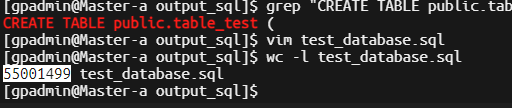

有意思的点，只有5千万，而数据有5亿

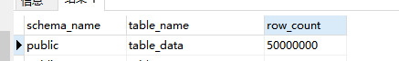

按照COPY来说，应该大于才对啊？

```sqlite
-- 最大数据条数
50000000
-- SQL文件行数
55001499
-- 数据row(sum)条数
55000700

由此可得
-799
多出来的就是构建语句和空格等
那就对了！
```

#### 数据SQL导入

##### 数据选择

使用psql的方式对pg_dump生成的sql进行导入，为了确认导入，使用不同的数据库进行导入，即为导入和导出为分别不同的数据库，上面的实验我们导出了单表和单库所有表的数据，我们用这个作为基础来进行sql导入，导入规则是将test_database数据库中的employees7导出的文件导入至test_db数据库中，表的名称变更为backup_employees，其二，我们将test_database数据库全部的导出的sql文件导出至新建一个数据库backup_test_database中进行两个实验。

```powershell
[gpadmin@Master-a output_sql]$ ll
total 1950448
-rw-rw-r-- 1 gpadmin gpadmin      12160 Nov 22 11:39 employees7.sql
-rw-rw-r-- 1 gpadmin gpadmin 1997242656 Nov 22 13:40 test_database.sql
[gpadmin@Master-a output_sql]$
```

##### 单表导入

根据导入规则：将test_database数据库中的employees7导出的文件导入至test_db数据库中，表的名称变更为backup_employees，我们构建语句并修改相应的文件内容。

```powershell
# 创建backup文件夹
[gpadmin@Master-a output_sql]$ mkdir backup
[gpadmin@Master-a output_sql]$ cd backup/

# 复制导入文件
[gpadmin@Master-a backup]$ cp ../employees7.sql backup_employees7.sql
[gpadmin@Master-a backup]$ ll
total 12
-rw-rw-r-- 1 gpadmin gpadmin 12160 Nov 26 16:11 backup_employees7.sql

# 查看表名称为employees命中关联 
[gpadmin@Master-a backup]$ grep employees7 backup_employees7.sql
-- Name: employees7; Type: TABLE; Schema: public; Owner: gpadmin; Tablespace: 
CREATE TABLE public.employees7 (
ALTER TABLE public.employees7 OWNER TO gpadmin;
-- Name: TABLE public.employees7 ; Type: COMMENT; Schema: public; Owner: gpadmin
COMMENT ON TABLE public.employees7 IS '员工信息表，包括姓名、年龄、性别、部门、入职日期、出生日期、地址和薪资等字段。';
-- Name: COLUMN employees7.name; Type: COMMENT; Schema: public; Owner: gpadmin
COMMENT ON COLUMN public.employees7.name IS '员工姓名，以固定格式加随机数生成';
-- Name: COLUMN employees7.age; Type: COMMENT; Schema: public; Owner: gpadmin
COMMENT ON COLUMN public.employees7.age IS '员工年龄，范围在 18 到 60 之间';
-- Name: COLUMN employees7.gender; Type: COMMENT; Schema: public; Owner: gpadmin
COMMENT ON COLUMN public.employees7.gender IS '员工性别，M 代表男性，F 代表女性';
-- Name: COLUMN employees7.department; Type: COMMENT; Schema: public; Owner: gpadmin
COMMENT ON COLUMN public.employees7.department IS '员工部门，如 HR、Engineering、Marketing、Sales';
-- Name: COLUMN employees7.hire_date; Type: COMMENT; Schema: public; Owner: gpadmin
COMMENT ON COLUMN public.employees7.hire_date IS '员工入职日期，随机生成的日期';
-- Name: COLUMN employees7.birth_date; Type: COMMENT; Schema: public; Owner: gpadmin
COMMENT ON COLUMN public.employees7.birth_date IS '员工出生日期，随机生成的日期';
-- Name: COLUMN employees7.address; Type: COMMENT; Schema: public; Owner: gpadmin
COMMENT ON COLUMN public.employees7.address IS '员工地址，随机生成的地址信息';
-- Name: COLUMN employees7.salary; Type: COMMENT; Schema: public; Owner: gpadmin
COMMENT ON COLUMN public.employees7.salary IS '员工薪资，范围在 3000 到 50000 之间';
-- Name: employees7_id_seq; Type: SEQUENCE; Schema: public; Owner: gpadmin
CREATE SEQUENCE public.employees7_id_seq
ALTER TABLE public.employees7_id_seq OWNER TO gpadmin;
-- Name: employees7_id_seq; Type: SEQUENCE OWNED BY; Schema: public; Owner: gpadmin
ALTER SEQUENCE public.employees7_id_seq OWNED BY public.employees7.id;
ALTER TABLE ONLY public.employees7 ALTER COLUMN id SET DEFAULT nextval('public.employees7_id_seq'::regclass);
-- Data for Name: employees7; Type: TABLE DATA; Schema: public; Owner: gpadmin
COPY public.employees7 (id, name, age, gender, department, hire_date, birth_date, address, salary) FROM stdin;
-- Name: employees7_id_seq; Type: SEQUENCE SET; Schema: public; Owner: gpadmin
SELECT pg_catalog.setval('public.employees7_id_seq', 100, true);
-- Name: employees7_pkey; Type: CONSTRAINT; Schema: public; Owner: gpadmin; Tablespace: 
ALTER TABLE ONLY public.employees7
    ADD CONSTRAINT employees7_pkey PRIMARY KEY (id);
[gpadmin@Master-a backup]$

# 通过sed进行修改文件
[gpadmin@Master-a backup]$ sed -i 's/employees7/backup_employees7/g' backup_employees7.sql 
[gpadmin@Master-a backup]$ grep employees7 backup_employees7.sql
-- Name: backup_employees7; Type: TABLE; Schema: public; Owner: gpadmin; Tablespace: 
CREATE TABLE public.backup_employees7 (
ALTER TABLE public.backup_employees7 OWNER TO gpadmin;
-- Name: TABLE public.backup_employees7 ; Type: COMMENT; Schema: public; Owner: gpadmin
COMMENT ON TABLE public.backup_employees7 IS '员工信息表，包括姓名、年龄、性别、部门、入职日期、出生日期、地址和薪资等字段。';
-- Name: COLUMN backup_employees7.name; Type: COMMENT; Schema: public; Owner: gpadmin
COMMENT ON COLUMN public.backup_employees7.name IS '员工姓名，以固定格式加随机数生成';
-- Name: COLUMN backup_employees7.age; Type: COMMENT; Schema: public; Owner: gpadmin
COMMENT ON COLUMN public.backup_employees7.age IS '员工年龄，范围在 18 到 60 之间';
-- Name: COLUMN backup_employees7.gender; Type: COMMENT; Schema: public; Owner: gpadmin
COMMENT ON COLUMN public.backup_employees7.gender IS '员工性别，M 代表男性，F 代表女性';
-- Name: COLUMN backup_employees7.department; Type: COMMENT; Schema: public; Owner: gpadmin
COMMENT ON COLUMN public.backup_employees7.department IS '员工部门，如 HR、Engineering、Marketing、Sales';
-- Name: COLUMN backup_employees7.hire_date; Type: COMMENT; Schema: public; Owner: gpadmin
COMMENT ON COLUMN public.backup_employees7.hire_date IS '员工入职日期，随机生成的日期';
-- Name: COLUMN backup_employees7.birth_date; Type: COMMENT; Schema: public; Owner: gpadmin
COMMENT ON COLUMN public.backup_employees7.birth_date IS '员工出生日期，随机生成的日期';
-- Name: COLUMN backup_employees7.address; Type: COMMENT; Schema: public; Owner: gpadmin
COMMENT ON COLUMN public.backup_employees7.address IS '员工地址，随机生成的地址信息';
-- Name: COLUMN backup_employees7.salary; Type: COMMENT; Schema: public; Owner: gpadmin
COMMENT ON COLUMN public.backup_employees7.salary IS '员工薪资，范围在 3000 到 50000 之间';
-- Name: backup_employees7_id_seq; Type: SEQUENCE; Schema: public; Owner: gpadmin
CREATE SEQUENCE public.backup_employees7_id_seq
ALTER TABLE public.backup_employees7_id_seq OWNER TO gpadmin;
-- Name: backup_employees7_id_seq; Type: SEQUENCE OWNED BY; Schema: public; Owner: gpadmin
ALTER SEQUENCE public.backup_employees7_id_seq OWNED BY public.backup_employees7.id;
ALTER TABLE ONLY public.backup_employees7 ALTER COLUMN id SET DEFAULT nextval('public.backup_employees7_id_seq'::regclass);
-- Data for Name: backup_employees7; Type: TABLE DATA; Schema: public; Owner: gpadmin
COPY public.backup_employees7 (id, name, age, gender, department, hire_date, birth_date, address, salary) FROM stdin;
-- Name: backup_employees7_id_seq; Type: SEQUENCE SET; Schema: public; Owner: gpadmin
SELECT pg_catalog.setval('public.backup_employees7_id_seq', 100, true);
-- Name: backup_employees7_pkey; Type: CONSTRAINT; Schema: public; Owner: gpadmin; Tablespace: 
ALTER TABLE ONLY public.backup_employees7
    ADD CONSTRAINT backup_employees7_pkey PRIMARY KEY (id);
[gpadmin@Master-a backup]$

# 导入执行 -注意db选择非源数据库

[gpadmin@Master-a backup]$ psql -h Master-a -U gpadmin -d test_db -f backup_employees7.sql 
SET
SET
SET
SET
SET
 set_config 
------------
 
(1 row)

SET
SET
SET
SET
SET
CREATE TABLE
ALTER TABLE
COMMENT
COMMENT
COMMENT
COMMENT
COMMENT
COMMENT
COMMENT
COMMENT
COMMENT
CREATE SEQUENCE
ALTER TABLE
ALTER SEQUENCE
ALTER TABLE
COPY 100
 setval 
--------
    100
(1 row)

ALTER TABLE
```

###### 查看结果

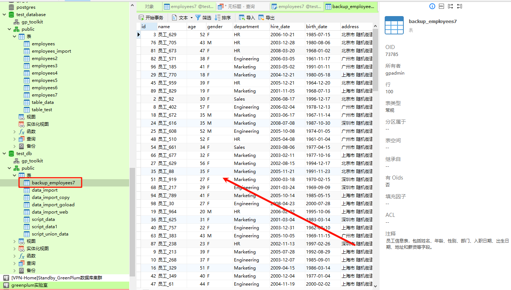

数据正常导入

##### 单库全表导入

根据导入规则：将test_database数据库全部的导出的sql文件导出至新建一个数据库backup_test_database中。

```powershell
# 复制相应文件
[gpadmin@Master-a backup]$ cp ../test_database.sql backup_test_database.sql
[gpadmin@Master-a backup]$

# 查看数据库名称关联
[gpadmin@Master-a backup]$ grep test_database backup_test_database.sql 
[gpadmin@Master-a backup]$

无命中，查看文件发现没有数据创建相关，只有建表。

# 进入数据库
[gpadmin@Master-a backup]$ psql -h Master-a -U gpadmin
psql (9.4.24)
Type "help" for help.

# 查看当前数据库信息
gp_sydb=# \l
                                 List of databases
     Name      |  Owner  | Encoding |  Collate   |   Ctype    |  Access privileges  
---------------+---------+----------+------------+------------+---------------------
 gp_sydb       | gpadmin | UTF8     | en_US.utf8 | en_US.utf8 | 
 postgres      | gpadmin | UTF8     | en_US.utf8 | en_US.utf8 | 
 template0     | gpadmin | UTF8     | en_US.utf8 | en_US.utf8 | =c/gpadmin         +
               |         |          |            |            | gpadmin=CTc/gpadmin
 template1     | gpadmin | UTF8     | en_US.utf8 | en_US.utf8 | =c/gpadmin         +
               |         |          |            |            | gpadmin=CTc/gpadmin
 test_database | gpadmin | UTF8     | en_US.utf8 | en_US.utf8 | 
 test_db       | gpadmin | UTF8     | en_US.utf8 | en_US.utf8 | 
(6 rows)

# 创建数据库
gp_sydb=# CREATE DATABASE backup_test_database
gp_sydb-#     WITH OWNER = gpadmin
gp_sydb-#     ENCODING = 'UTF8'
gp_sydb-#     LC_COLLATE = 'en_US.utf8'
gp_sydb-#     LC_CTYPE = 'en_US.utf8'
gp_sydb-#     CONNECTION LIMIT = -1;
CREATE DATABASE

# 再次查看数据库
gp_sydb=# \l
                                     List of databases
         Name         |  Owner  | Encoding |  Collate   |   Ctype    |  Access privileges  
----------------------+---------+----------+------------+------------+---------------------
 backup_test_database | gpadmin | UTF8     | en_US.utf8 | en_US.utf8 | 
 gp_sydb              | gpadmin | UTF8     | en_US.utf8 | en_US.utf8 | 
 postgres             | gpadmin | UTF8     | en_US.utf8 | en_US.utf8 | 
 template0            | gpadmin | UTF8     | en_US.utf8 | en_US.utf8 | =c/gpadmin         +
                      |         |          |            |            | gpadmin=CTc/gpadmin
 template1            | gpadmin | UTF8     | en_US.utf8 | en_US.utf8 | =c/gpadmin         +
                      |         |          |            |            | gpadmin=CTc/gpadmin
 test_database        | gpadmin | UTF8     | en_US.utf8 | en_US.utf8 | 
 test_db              | gpadmin | UTF8     | en_US.utf8 | en_US.utf8 | 
(7 rows)

gp_sydb=#
gp_sydb-# \q
[gpadmin@Master-a backup]$ 
```

查看原始数据库情况

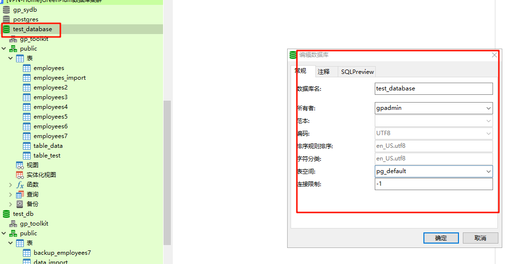

查看新创建的数据库情况

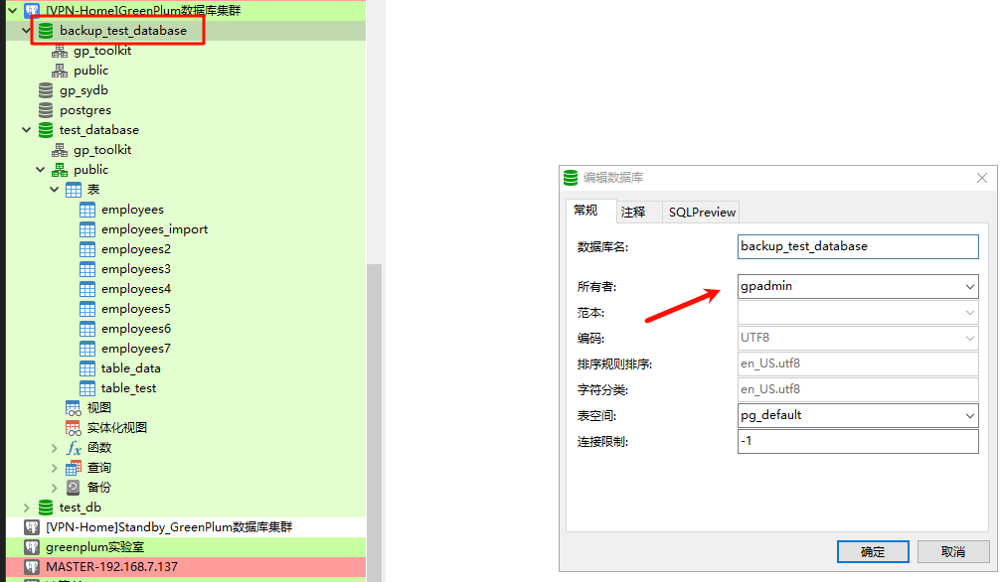

数据导入-根据数据大小决定导入时间

```powershell
[gpadmin@Master-a backup]$ psql -h Master-a -U gpadmin -d backup_test_database -f backup_test_database.sql 
SET
SET
SET
SET
SET
 set_config 
------------
 
(1 row)

SET
SET
SET
CREATE EXTENSION
COMMENT
SET
SET
CREATE TABLE
ALTER TABLE
CREATE TABLE
ALTER TABLE
CREATE SEQUENCE
ALTER TABLE
ALTER SEQUENCE
CREATE TABLE
ALTER TABLE
CREATE SEQUENCE
ALTER TABLE
ALTER SEQUENCE
CREATE TABLE
ALTER TABLE
CREATE SEQUENCE
ALTER TABLE
ALTER SEQUENCE
CREATE TABLE
ALTER TABLE
CREATE SEQUENCE
ALTER TABLE
ALTER SEQUENCE
CREATE TABLE
ALTER TABLE
CREATE SEQUENCE
ALTER TABLE
ALTER SEQUENCE
CREATE TABLE
ALTER TABLE
COMMENT
COMMENT
COMMENT
COMMENT
COMMENT
COMMENT
COMMENT
COMMENT
COMMENT
CREATE SEQUENCE
ALTER TABLE
ALTER SEQUENCE
CREATE SEQUENCE
ALTER TABLE
ALTER SEQUENCE
CREATE TABLE
ALTER TABLE
COMMENT
COMMENT
COMMENT
COMMENT
COMMENT
COMMENT
COMMENT
COMMENT
COMMENT
CREATE SEQUENCE
ALTER TABLE
ALTER SEQUENCE
CREATE TABLE
ALTER TABLE
CREATE TABLE
ALTER TABLE
ALTER TABLE
ALTER TABLE
ALTER TABLE
ALTER TABLE
ALTER TABLE
ALTER TABLE
ALTER TABLE
ALTER TABLE
COPY 100
COPY 100
 setval 
--------
    100
(1 row)

COPY 100
 setval 
--------
    100
(1 row)

COPY 100
 setval 
--------
    100
(1 row)

COPY 100
 setval 
--------
    400
(1 row)

COPY 100
 setval 
--------
    100
(1 row)

COPY 100
 setval 
--------
    100
(1 row)

 setval 
--------
    100
(1 row)

COPY 0
  setval  
----------
 20839259
(1 row)

COPY 50000000
COPY 5000000
ALTER TABLE
ALTER TABLE
ALTER TABLE
ALTER TABLE
ALTER TABLE
ALTER TABLE
ALTER TABLE
ALTER TABLE
ALTER TABLE
ALTER TABLE
REVOKE
REVOKE
GRANT
GRANT
[gpadmin@Master-a backup]$

导入完成，可以看到每条都输出了对应的内容，因为表不多所有全都放出来。
```

###### 查看结果

原始表

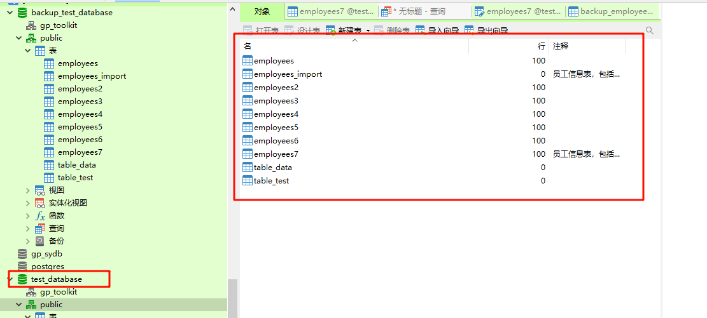

备份表

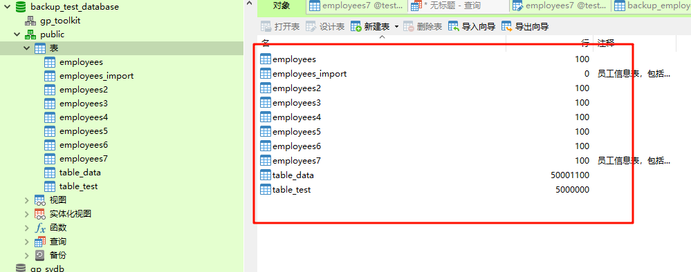

可以看到表的数量一致，再通过sql看下条数是否一致，用之前的sql改一下。

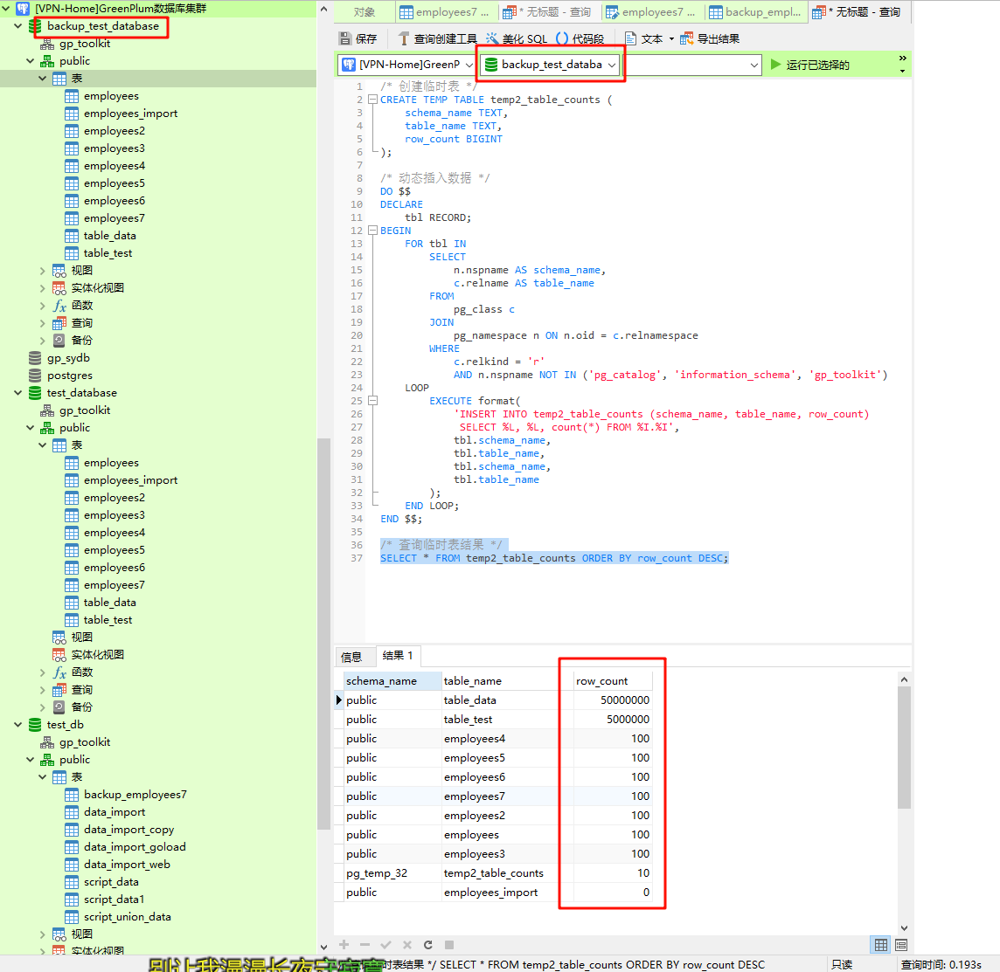

可以看到数据是一致的，但是navicat的备份表的行数统计的有问题，为了确认没问题再次查询这个单表。

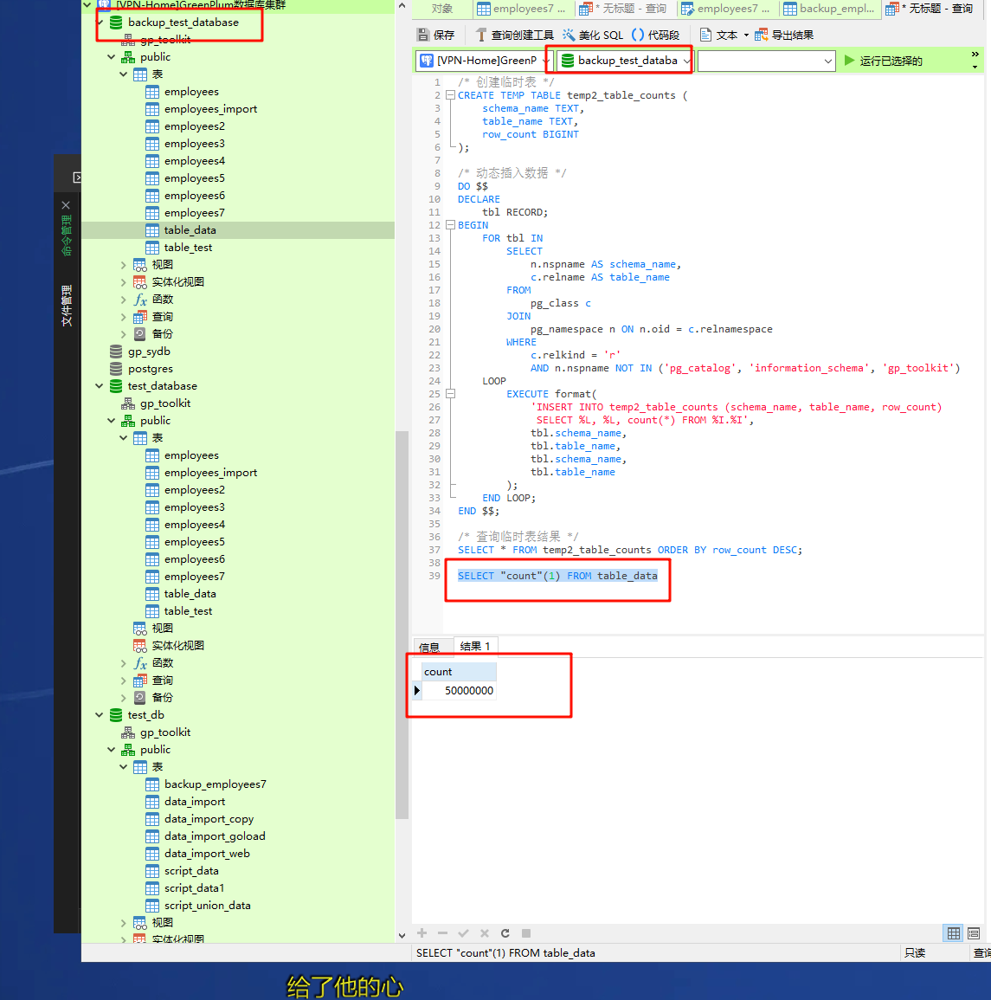

数据查询没问题，结束。

#### 总结

可以看到数据SQL操作greenplum数据库可以进行sql的导出和导入，sql导出使用pg_dump导出后使用psql 进行导入可以解决生产环境中数据导入导出的简单需求，本次只做了单库单表导出和单库全表导出2个方向，其他方式根据具体情况修改参数即可。

### 数据库备份

#### 插件下载

参考V6.23 Documentatuion 中 （gpbackup, gprestore, and related utilities are provided as a separate download, VMware Tanzu™ Greenplum® Backup and Restore. Follow the instructions in the VMware Tanzu Greenplum Backup and Restore Documentation to install and use these utilities.）需要单独进行下载。

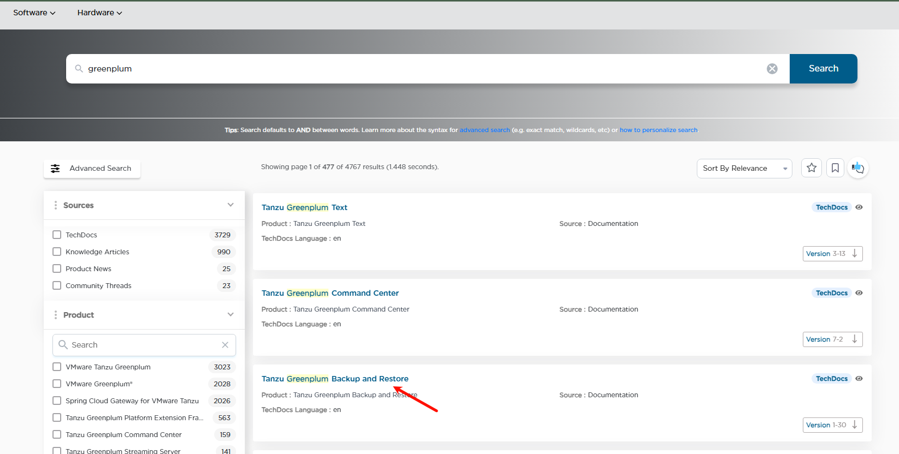

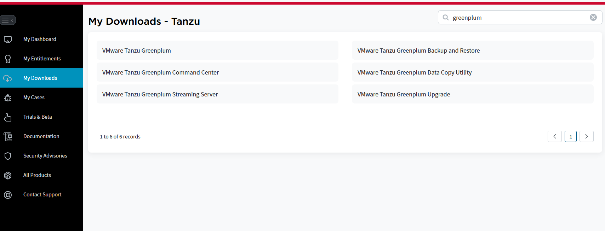

对于版本，选择最大的版本， Greenplum Backup and Restore 1.30.7，然后选择对应操作系统以及GP的版本。

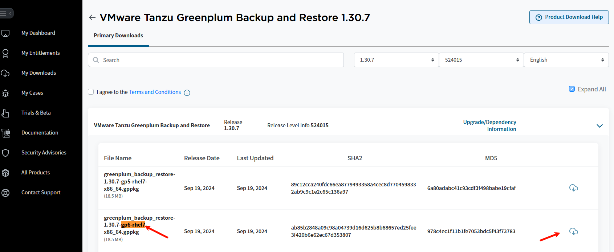

填写核查信息（需要根据自己的账户来进行核查)

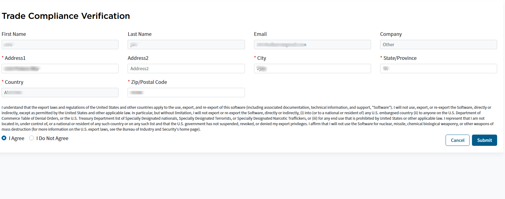

下载完成

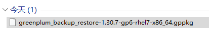

#### 插件安装

查看下如何安装 https://techdocs.broadcom.com/us/en/vmware-tanzu/data-solutions/tanzu-greenplum-backup-and-restore/1-30/greenplum-backup-and-restore/backup-restore-install.html

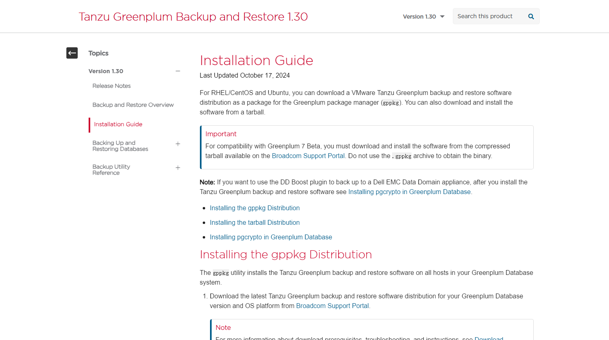

Copy the `gppkg` file you downloaded to the gpadmin user's home directory on the Greenplum Database coordinator host. ，根据文档提示，需要下载到coordinator也就是master的主文件夹内，并进行安装。

```powershell
# 创建gppkg插件存放位置文件夹
[gpadmin@Master-a ~]$ mkdir gppkg
[gpadmin@Master-a ~]$ cd gppkg
[gpadmin@Master-a gppkg]$ cp ../greenplum_backup_restore-1.30.7-gp6-rhel7-x86_64.gppkg .
[gpadmin@Master-a gppkg]$ ls
greenplum_backup_restore-1.30.7-gp6-rhel7-x86_64.gppkg
[gpadmin@Master-a gppkg]$ ll
total 18948
-rw-r--r-- 1 gpadmin gpadmin 19401617 Dec  4 15:10 greenplum_backup_restore-1.30.7-gp6-rhel7-x86_64.gppkg
[gpadmin@Master-a gppkg]$

# Install
[gpadmin@Master-a gppkg]$ gppkg -i greenplum_backup_restore-1.30.7-gp6-rhel7-x86_64.gppkg 
20241204:15:12:54:008265 gppkg:Master-a:gpadmin-[INFO]:-Starting gppkg with args: -i greenplum_backup_restore-1.30.7-gp6-rhel7-x86_64.gppkg
20241204:15:12:54:008265 gppkg:Master-a:gpadmin-[INFO]:-Installing package greenplum_backup_restore-1.30.7-gp6-rhel7-x86_64.gppkg
20241204:15:12:54:008265 gppkg:Master-a:gpadmin-[INFO]:-Validating rpm installation cmdStr='rpm --test -i /usr/local/greenplum-db-6.13.0/.tmp/gpbackup_tools_RHEL7-1.30.7-1.x86_64.rpm --dbpath /usr/local/greenplum-db-6.13.0/share/packages/database --prefix /usr/local/greenplum-db-6.13.0'
20241204:15:12:58:008265 gppkg:Master-a:gpadmin-[CRITICAL]:-Error occurred: non-zero rc: 1
 Command was: '/bin/scp greenplum_backup_restore-1.30.7-gp6-rhel7-x86_64.gppkg Standby-a:/usr/local/greenplum-db-6.13.0/greenplum_backup_restore-1.30.7-gp6-rhel7-x86_64.gppkg'
rc=1, stdout='', stderr='scp: /usr/local/greenplum-db-6.13.0/greenplum_backup_restore-1.30.7-gp6-rhel7-x86_64.gppkg: Permission denied
'
[gpadmin@Master-a gppkg]$

error了，这...看问题是没有权限，需要root权限执行

# 再次执行(root)
[gpadmin@Master-a greenplum-db]$ exit
exit
[root@Master-a local]# cd /home/gpadmin/
[root@Master-a gpadmin]# ls
conf            expand_segment_instance  gpconfigs    output_data  union_data.sh
data            get_script_data.sh       gppkg        output_sql
expand_mirrors  gpAdminLogs              import_data  soft
[root@Master-a gpadmin]# cd gppkg/
[root@Master-a gppkg]# ls
greenplum_backup_restore-1.30.7-gp6-rhel7-x86_64.gppkg
[root@Master-a gppkg]#

不对应该是要放到gp程序目录执行，root带入不了环境变量。

[root@Master-a gpadmin]# su gpadmin

[gpadmin@Master-a ~]$ cd ~
[gpadmin@Master-a ~]$ cd /usr/local/greenplum-db-6.13.0/
[gpadmin@Master-a greenplum-db-6.13.0]$ cp /home/gpadmin/gppkg/greenplum_backup_restore-1.30.7-gp6-rhel7-x86_64.gppkg .
[gpadmin@Master-a greenplum-db-6.13.0]$ ls
bin
COPYRIGHT
docs
etc
ext
greenplum_backup_restore-1.30.7-gp6-rhel7-x86_64.gppkg
greenplum_path.sh
include
lib
libexec
LICENSE
NOTICE
open_source_license_greenplum_database.txt
sbin
share
[gpadmin@Master-a greenplum-db-6.13.0]$

[gpadmin@Master-a greenplum-db-6.13.0]$ gppkg -i greenplum_backup_restore-1.30.7-gp6-rhel7-x86_64.gppkg 
20241204:15:22:53:009605 gppkg:Master-a:gpadmin-[INFO]:-Starting gppkg with args: -i greenplum_backup_restore-1.30.7-gp6-rhel7-x86_64.gppkg
20241204:15:22:53:009605 gppkg:Master-a:gpadmin-[INFO]:-Installing package greenplum_backup_restore-1.30.7-gp6-rhel7-x86_64.gppkg
20241204:15:22:53:009605 gppkg:Master-a:gpadmin-[INFO]:-Validating rpm installation cmdStr='rpm --test -i /usr/local/greenplum-db-6.13.0/.tmp/gpbackup_tools_RHEL7-1.30.7-1.x86_64.rpm --dbpath /usr/local/greenplum-db-6.13.0/share/packages/database --prefix /usr/local/greenplum-db-6.13.0'
20241204:15:22:55:009605 gppkg:Master-a:gpadmin-[CRITICAL]:-Error occurred: non-zero rc: 1
 Command was: '/bin/scp greenplum_backup_restore-1.30.7-gp6-rhel7-x86_64.gppkg Standby-a:/usr/local/greenplum-db-6.13.0/greenplum_backup_restore-1.30.7-gp6-rhel7-x86_64.gppkg'
rc=1, stdout='', stderr='scp: /usr/local/greenplum-db-6.13.0/greenplum_backup_restore-1.30.7-gp6-rhel7-x86_64.gppkg: Permission denied
'
[gpadmin@Master-a greenplum-db-6.13.0]$

依然报错,找到问题了，问题出在Stabdby-a,提示说是权限不足，那就查看一下权限

[root@Standby-a local]# ll
total 0
drwxr-xr-x.  2 root root   6 Apr 11  2018 bin
drwxr-xr-x.  2 root root   6 Apr 11  2018 etc
drwxr-xr-x.  2 root root   6 Apr 11  2018 games
lrwxrwxrwx   1 root root  30 Aug  7 13:37 greenplum-db -> /usr/local/greenplum-db-6.13.0
drwxr-xr-x  11 root root 238 Aug  7 13:37 greenplum-db-6.13.0
drwxr-xr-x.  2 root root   6 Apr 11  2018 include

发现standby-a节点是root权限，这个应该是没有改当时，只是起到backup的作用。

# 根据报错修改Standby-a节点权限
[root@Standby-a local]# chown -R gpadmin:gpadmin greenplum-db*
[root@Standby-a local]# ll
total 0
drwxr-xr-x.  2 root    root      6 Apr 11  2018 bin
drwxr-xr-x.  2 root    root      6 Apr 11  2018 etc
drwxr-xr-x.  2 root    root      6 Apr 11  2018 games
lrwxrwxrwx   1 gpadmin gpadmin  30 Aug  7 13:37 greenplum-db -> /usr/local/greenplum-db-6.13.0
drwxr-xr-x  11 gpadmin gpadmin 238 Aug  7 13:37 greenplum-db-6.13.0
drwxr-xr-x.  2 root    root      6 Apr 11  2018 include
drwxr-xr-x.  2 root    root      6 Apr 11  2018 lib
drwxr-xr-x.  2 root    root      6 Apr 11  2018 lib64
drwxr-xr-x.  2 root    root      6 Apr 11  2018 libexec
drwxr-xr-x.  2 root    root      6 Apr 11  2018 sbin
drwxr-xr-x.  5 root    root     49 Jun  4  2024 share
drwxr-xr-x.  2 root    root      6 Apr 11  2018 src
[root@Standby-a local]#

# 再次尝试（gpadmin）
[gpadmin@Master-a greenplum-db-6.13.0]$ gppkg -i greenplum_backup_restore-1.30.7-gp6-rhel7-x86_64.gppkg 
20241204:15:27:47:009940 gppkg:Master-a:gpadmin-[INFO]:-Starting gppkg with args: -i greenplum_backup_restore-1.30.7-gp6-rhel7-x86_64.gppkg
20241204:15:27:48:009940 gppkg:Master-a:gpadmin-[INFO]:-Installing package greenplum_backup_restore-1.30.7-gp6-rhel7-x86_64.gppkg
20241204:15:27:48:009940 gppkg:Master-a:gpadmin-[INFO]:-Validating rpm installation cmdStr='rpm --test -i /usr/local/greenplum-db-6.13.0/.tmp/gpbackup_tools_RHEL7-1.30.7-1.x86_64.rpm --dbpath /usr/local/greenplum-db-6.13.0/share/packages/database --prefix /usr/local/greenplum-db-6.13.0'
20241204:15:27:52:009940 gppkg:Master-a:gpadmin-[INFO]:-Installing greenplum_backup_restore-1.30.7-gp6-rhel7-x86_64.gppkg locally
20241204:15:27:52:009940 gppkg:Master-a:gpadmin-[INFO]:-Validating rpm installation cmdStr='rpm --test -i /usr/local/greenplum-db-6.13.0/.tmp/gpbackup_tools_RHEL7-1.30.7-1.x86_64.rpm --dbpath /usr/local/greenplum-db-6.13.0/share/packages/database --prefix /usr/local/greenplum-db-6.13.0'
20241204:15:27:52:009940 gppkg:Master-a:gpadmin-[INFO]:-Installing rpms cmdStr='rpm -i --force /usr/local/greenplum-db-6.13.0/.tmp/gpbackup_tools_RHEL7-1.30.7-1.x86_64.rpm --dbpath /usr/local/greenplum-db-6.13.0/share/packages/database --prefix=/usr/local/greenplum-db-6.13.0'
20241204:15:27:53:009940 gppkg:Master-a:gpadmin-[INFO]:-Completed local installation of greenplum_backup_restore-1.30.7-gp6-rhel7-x86_64.gppkg.
20241204:15:27:53:009940 gppkg:Master-a:gpadmin-[INFO]:-gpbackup 1.30.7 successfully installed
20241204:15:27:53:009940 gppkg:Master-a:gpadmin-[INFO]:-greenplum_backup_restore-1.30.7-gp6-rhel7-x86_64.gppkg successfully installed.
[gpadmin@Master-a greenplum-db-6.13.0]$

这个命令执行了，尝试安装gppkg插件包，执行rpm -test -i 测试通过后，通过-i --force 进行安装，安装是全部节点进行安装的，全部安装完成后提示 successfully，安装成功
看一下文件发生了哪些变化
```

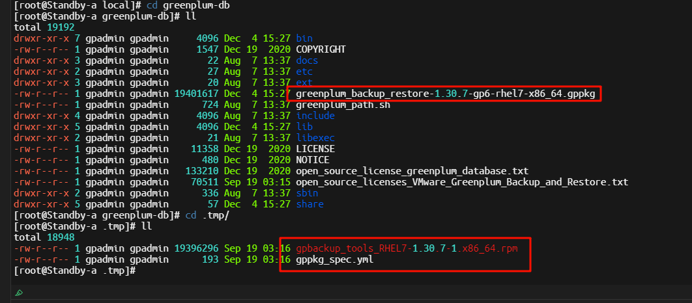

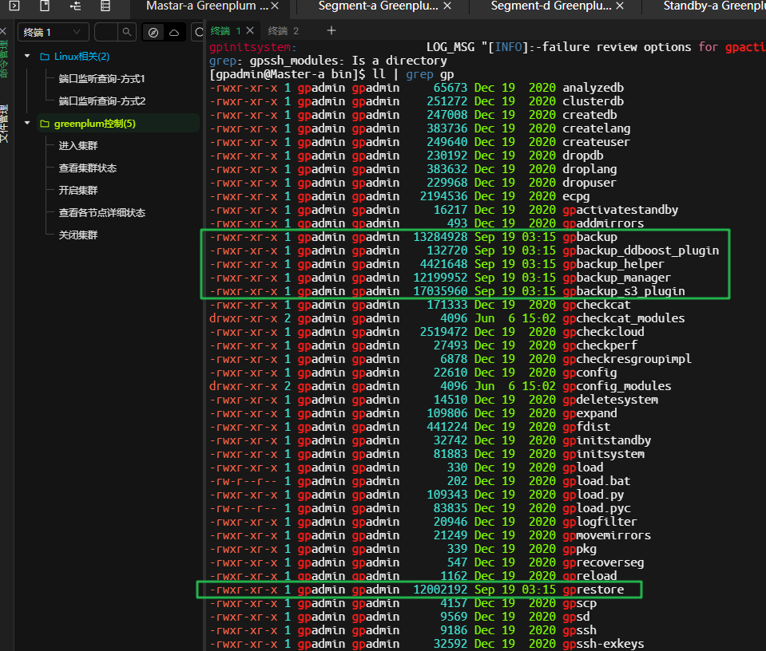

```powershell
可以看到各节点的bin都有gpbackup和gprestore相关工具了

# 尝试运行gpbackup
[gpadmin@Master-a docs]$ gpbackup
Error: required flag(s) "dbname" not set
Usage:
  gpbackup [flags]

Flags:
      --backup-dir string            The absolute path of the directory to which all backup files will be written
      --compression-level int        Level of compression to use during data backup. Range of valid values depends on compression type (default 1)
      --compression-type string      Type of compression to use during data backup. Valid values are 'gzip', 'zstd' (default "gzip")
      --copy-queue-size int          number of COPY commands gpbackup should enqueue when backing up using the --single-data-file option (default 1)
      --data-only                    Only back up data, do not back up metadata
      --dbname string                The database to be backed up
      --debug                        Print verbose and debug log messages
      --exclude-schema stringArray   Back up all metadata except objects in the specified schema(s). --exclude-schema can be specified multiple times.
      --exclude-schema-file string   A file containing a list of schemas to be excluded from the backup
      --exclude-table stringArray    Back up all metadata except the specified table(s). --exclude-table can be specified multiple times.
      --exclude-table-file string    A file containing a list of fully-qualified tables to be excluded from the backup
      --from-timestamp string        A timestamp to use to base the current incremental backup off
      --help                         Help for gpbackup
      --include-schema stringArray   Back up only the specified schema(s). --include-schema can be specified multiple times.
      --include-schema-file string   A file containing a list of schema(s) to be included in the backup
      --include-table stringArray    Back up only the specified table(s). --include-table can be specified multiple times.
      --include-table-file string    A file containing a list of fully-qualified tables to be included in the backup
      --incremental                  Only back up data for AO tables that have been modified since the last backup
      --jobs int                     The number of parallel connections to use when backing up data (default 1)
      --leaf-partition-data          For partition tables, create one data file per leaf partition instead of one data file for the whole table
      --metadata-only                Only back up metadata, do not back up data
      --no-compression               Skip compression of data files
      --no-history                   Do not write a backup entry to the gpbackup_history database
      --no-inherits                  For a filtered backup, don't back up all tables that inherit included tables
      --plugin-config string         The configuration file to use for a plugin
      --quiet                        Suppress non-warning, non-error log messages
      --single-backup-dir            Back up all data to a single directory instead of split by segment
      --single-data-file             Back up all data to a single file instead of one per table
      --verbose                      Print verbose log messages
      --version                      Print version number and exit
      --with-stats                   Back up query plan statistics
      --without-globals              Skip backup of global metadata

[gpadmin@Master-a docs]$

提示缺少参数，证明可以用了

# 尝试运行gprestore
[gpadmin@Master-a docs]$ gprestore 
20241204:15:36:29 gprestore:gpadmin:Master-a:010615-[CRITICAL]:-Must provide --backup-dir if --timestamp is not provided
20241204:15:36:29 gprestore:gpadmin:Master-a:010615-[INFO]:-Beginning cleanup
20241204:15:36:29 gprestore:gpadmin:Master-a:010615-[INFO]:-Cleanup complete
[gpadmin@Master-a docs]$

可以用了。
```

#### gpbackup备份


#### gprestore恢复


