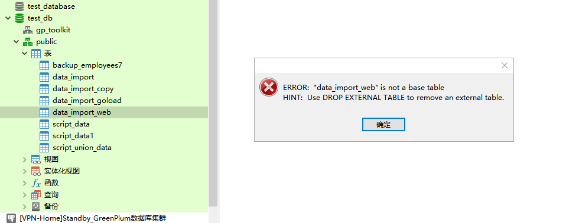
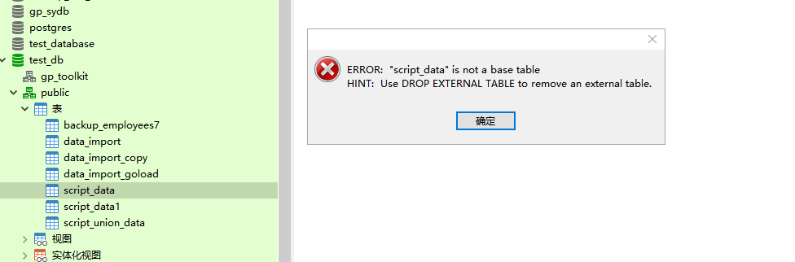

# 实验九：Segment节点进行缩容攻克

> Author ：Heike07

## 模拟需求

在应对当前Segment节点过多，且需对两台机器进行卸载以适应模拟需求变更的挑战时，我们的策略是谨慎而周密的。为确保数据的安全性与集群的完整性，我们首先执行了全面的数据备份操作。这一步骤包括：

1. **全量数据备份**：通过实验八的方法，我们进行了逻辑层面的SQL备份，确保了数据库结构的完整。
2. **gpbackup全量备份**：同时，我们还使用了gpbackup工具进行了全量数据备份，以备不时之需。
3. **异地备份**：这些备份随后被转移至Segment-Standby节点上，并进行了异地文件备份，以便在集群崩溃时能够迅速恢复。

为了进一步保障底层安全，我们采取了以下措施：

1. **虚拟机快照**：我们对所有虚拟机进行了快照，以防止实验过程中可能出现的任何崩溃导致的数据丢失。
2. **集群关闭快照**：在关闭数据库集群后，我们立即进行了快照，以便在实验崩溃时能够迅速恢复。

实验中，我们采取了更为大胆的策略，通过深入分析数据之间的关联性，尝试直接关闭某个Segment节点，以模拟服务器故障。我们期待集群能够自主恢复，但如果集群无法自行恢复，我们将转而使用之前备份的全量数据进行集群的重置和恢复。

这一实验旨在验证集群的健壮性和恢复机制，其结果将为我们提供宝贵的经验，以确保在未来的实际操作中能够有效地应对类似情况。

## 备份方式一：SQL文件导出备份

### 备份前查询数据条数

根据实验8进行数据库SQL文件导出，导出至对应位置（Segment-Standby节点）

```powershell
# 查看需要备份的数据库还是通过临时表的方式
[gpadmin@Standby-a ~]$ psql -h Master-a -U gpadmin
psql (9.4.24)
Type "help" for help.

gp_sydb=# \l
                                     List of databases
         Name         |  Owner  | Encoding |  Collate   |   Ctype    |  Access privileges  
----------------------+---------+----------+------------+------------+---------------------
 backup_test_database | gpadmin | UTF8     | en_US.utf8 | en_US.utf8 | 
 gp_sydb              | gpadmin | UTF8     | en_US.utf8 | en_US.utf8 | 
 postgres             | gpadmin | UTF8     | en_US.utf8 | en_US.utf8 | 
 template0            | gpadmin | UTF8     | en_US.utf8 | en_US.utf8 | =c/gpadmin         +
                      |         |          |            |            | gpadmin=CTc/gpadmin
 template1            | gpadmin | UTF8     | en_US.utf8 | en_US.utf8 | =c/gpadmin         +
                      |         |          |            |            | gpadmin=CTc/gpadmin
 test_database        | gpadmin | UTF8     | en_US.utf8 | en_US.utf8 | 
 test_db              | gpadmin | UTF8     | en_US.utf8 | en_US.utf8 | 
(7 rows)

gp_sydb=# CREATE TEMP TABLE table_counts_bak (
gp_sydb(#     schema_name TEXT,
gp_sydb(#     table_name TEXT,
gp_sydb(#     row_count BIGINT
gp_sydb(# );
NOTICE:  Table doesn't have 'DISTRIBUTED BY' clause -- Using column named 'schema_name' as the Greenplum Database data distribution key for this table.
HINT:  The 'DISTRIBUTED BY' clause determines the distribution of data. Make sure column(s) chosen are the optimal data distribution key to minimize skew.
CREATE TABLE
gp_sydb=# DO $$ 
gp_sydb$# DECLARE
gp_sydb$#     tbl RECORD; 
gp_sydb$# BEGIN 
gp_sydb$#     FOR tbl IN 
gp_sydb$#         SELECT 
gp_sydb$#             n.nspname AS schema_name, 
gp_sydb$#             c.relname AS table_name 
gp_sydb$#         FROM 
gp_sydb$#             pg_class c 
gp_sydb$#         JOIN 
gp_sydb$#             pg_namespace n ON n.oid = c.relnamespace 
gp_sydb$#         WHERE 
gp_sydb$#             c.relkind = 'r' 
gp_sydb$#             AND n.nspname NOT IN ('pg_catalog', 'information_schema', 'gp_toolkit') 
gp_sydb$#             AND n.nspname NOT LIKE 'pg_temp%'  -- 排除所有临时命名空间
gp_sydb$#     LOOP 
gp_sydb$#         EXECUTE format(
gp_sydb$#             'INSERT INTO table_counts_bak (schema_name, table_name, row_count) 
gp_sydb$#              SELECT %L, %L, count(*) FROM %I.%I',
gp_sydb$#             tbl.schema_name, 
gp_sydb$#             tbl.table_name, 
gp_sydb$#             tbl.schema_name, 
gp_sydb$#             tbl.table_name
gp_sydb$#         );
gp_sydb$#     END LOOP; 
gp_sydb$# END $$;
DO
gp_sydb=# SELECT * FROM table_counts_bak ORDER BY row_count DESC;
 schema_name | table_name | row_count 
-------------+------------+-----------
(0 rows)


gp_sydb=# \c backup_test_database
You are now connected to database "backup_test_database" as user "gpadmin".
backup_test_database=# CREATE TEMP TABLE table_counts_bak (
backup_test_database(#     schema_name TEXT,
backup_test_database(#     table_name TEXT,
backup_test_database(#     row_count BIGINT
backup_test_database(# );
NOTICE:  Table doesn't have 'DISTRIBUTED BY' clause -- Using column named 'schema_name' as the Greenplum Database data distribution key for this table.
HINT:  The 'DISTRIBUTED BY' clause determines the distribution of data. Make sure column(s) chosen are the optimal data distribution key to minimize skew.
CREATE TABLE
backup_test_database=# 
backup_test_database=# DO $$ 
backup_test_database$# DECLARE
backup_test_database$#     tbl RECORD; 
backup_test_database$# BEGIN 
backup_test_database$#     FOR tbl IN 
backup_test_database$#         SELECT 
backup_test_database$#             n.nspname AS schema_name, 
backup_test_database$#             c.relname AS table_name 
backup_test_database$#         FROM 
backup_test_database$#             pg_class c 
backup_test_database$#         JOIN 
backup_test_database$#             pg_namespace n ON n.oid = c.relnamespace 
backup_test_database$#         WHERE 
backup_test_database$#             c.relkind = 'r' 
backup_test_database$#             AND n.nspname NOT IN ('pg_catalog', 'information_schema', 'gp_toolkit') 
backup_test_database$#             AND n.nspname NOT LIKE 'pg_temp%'  -- 排除所有临时命名空间
backup_test_database$#     LOOP 
backup_test_database$#         EXECUTE format(
backup_test_database$#             'INSERT INTO table_counts_bak (schema_name, table_name, row_count) 
backup_test_database$#              SELECT %L, %L, count(*) FROM %I.%I',
backup_test_database$#             tbl.schema_name, 
backup_test_database$#             tbl.table_name, 
backup_test_database$#             tbl.schema_name, 
backup_test_database$#             tbl.table_name
backup_test_database$#         );
backup_test_database$#     END LOOP; 
backup_test_database$# END $$;

DO
backup_test_database=# 
backup_test_database=# SELECT * FROM table_counts_bak ORDER BY row_count DESC;
 schema_name |    table_name    | row_count 
-------------+------------------+-----------
 public      | table_data       |  50000000
 public      | table_test       |   5000000
 public      | employees6       |       100
 public      | employees5       |       100
 public      | employees3       |       100
 public      | employees2       |       100
 public      | employees6_copy1 |       100
 public      | employees4       |       100
 public      | employees        |        97
 public      | employees_import |        50
(10 rows)


backup_test_database=# \c postgres
You are now connected to database "postgres" as user "gpadmin".
postgres=# CREATE TEMP TABLE table_counts_bak (
postgres(#     schema_name TEXT,
postgres(#     table_name TEXT,
postgres(#     row_count BIGINT
postgres(# );
NOTICE:  Table doesn't have 'DISTRIBUTED BY' clause -- Using column named 'schema_name' as the Greenplum Database data distribution key for this table.
HINT:  The 'DISTRIBUTED BY' clause determines the distribution of data. Make sure column(s) chosen are the optimal data distribution key to minimize skew.
CREATE TABLE
postgres=# 
postgres=# DO $$ 
postgres$# DECLARE
postgres$#     tbl RECORD; 
postgres$# BEGIN 
postgres$#     FOR tbl IN 
postgres$#         SELECT 
postgres$#             n.nspname AS schema_name, 
postgres$#             c.relname AS table_name 
postgres$#         FROM 
postgres$#             pg_class c 
postgres$#         JOIN 
postgres$#             pg_namespace n ON n.oid = c.relnamespace 
postgres$#         WHERE 
postgres$#             c.relkind = 'r' 
postgres$#             AND n.nspname NOT IN ('pg_catalog', 'information_schema', 'gp_toolkit') 
postgres$#             AND n.nspname NOT LIKE 'pg_temp%'  -- 排除所有临时命名空间
postgres$#     LOOP 
postgres$#         EXECUTE format(
postgres$#             'INSERT INTO table_counts_bak (schema_name, table_name, row_count) 
postgres$#              SELECT %L, %L, count(*) FROM %I.%I',
postgres$#             tbl.schema_name, 
postgres$#             tbl.table_name, 
postgres$#             tbl.schema_name, 
postgres$#             tbl.table_name
postgres$#         );
postgres$#     END LOOP; 
postgres$# END $$;
DO
postgres=# 
postgres=# SELECT * FROM table_counts_bak ORDER BY row_count DESC;
 schema_name |  table_name   | row_count 
-------------+---------------+-----------
 gpexpand    | status        |         6
 gpexpand    | status_detail |         1
(2 rows)


postgres=# \c test_database
You are now connected to database "test_database" as user "gpadmin".
test_database=# CREATE TEMP TABLE table_counts_bak (
test_database(#     schema_name TEXT,
test_database(#     table_name TEXT,
test_database(#     row_count BIGINT
test_database(# );
NOTICE:  Table doesn't have 'DISTRIBUTED BY' clause -- Using column named 'schema_name' as the Greenplum Database data distribution key for this table.
HINT:  The 'DISTRIBUTED BY' clause determines the distribution of data. Make sure column(s) chosen are the optimal data distribution key to minimize skew.
CREATE TABLE
test_database=# 
test_database=# DO $$ 
test_database$# DECLARE
test_database$#     tbl RECORD; 
test_database$# BEGIN 
test_database$#     FOR tbl IN 
test_database$#         SELECT 
test_database$#             n.nspname AS schema_name, 
test_database$#             c.relname AS table_name 
test_database$#         FROM 
test_database$#             pg_class c 
test_database$#         JOIN 
test_database$#             pg_namespace n ON n.oid = c.relnamespace 
test_database$#         WHERE 
test_database$#             c.relkind = 'r' 
test_database$#             AND n.nspname NOT IN ('pg_catalog', 'information_schema', 'gp_toolkit') 
test_database$#             AND n.nspname NOT LIKE 'pg_temp%'  -- 排除所有临时命名空间
test_database$#     LOOP 
test_database$#         EXECUTE format(
test_database$#             'INSERT INTO table_counts_bak (schema_name, table_name, row_count) 
test_database$#              SELECT %L, %L, count(*) FROM %I.%I',
test_database$#             tbl.schema_name, 
test_database$#             tbl.table_name, 
test_database$#             tbl.schema_name, 
test_database$#             tbl.table_name
test_database$#         );
test_database$#     END LOOP; 
test_database$# END $$;
DO
test_database=# 
test_database=# SELECT * FROM table_counts_bak ORDER BY row_count DESC;
 schema_name |    table_name    | row_count 
-------------+------------------+-----------
 public      | table_data       |  50000000
 public      | table_test       |   5000000
 public      | employees5       |       100
 public      | employees6       |       100
 public      | employees3       |       100
 public      | employees2       |       100
 public      | employees6_copy1 |       100
 public      | employees4       |       100
 public      | employees        |        97
 public      | employees_import |        50
(10 rows)


test_database=# \c test_db
test_db=# CREATE TEMP TABLE table_counts_bak1 (
test_db(#     schema_name TEXT,
test_db(#     table_name TEXT,
test_db(#     row_count BIGINT
test_db(# );
NOTICE:  Table doesn't have 'DISTRIBUTED BY' clause -- Using column named 'schema_name' as the Greenplum Database data distribution key for this table.
HINT:  The 'DISTRIBUTED BY' clause determines the distribution of data. Make sure column(s) chosen are the optimal data distribution key to minimize skew.
CREATE TABLE
test_db=# 
test_db=# DO $$ 
test_db$# DECLARE
test_db$#     tbl RECORD; 
test_db$# BEGIN 
test_db$#     FOR tbl IN 
test_db$#         SELECT 
test_db$#             n.nspname AS schema_name, 
test_db$#             c.relname AS table_name 
test_db$#         FROM 
test_db$#             pg_class c 
test_db$#         JOIN 
test_db$#             pg_namespace n ON n.oid = c.relnamespace 
test_db$#         WHERE 
test_db$#             c.relkind = 'r' 
test_db$#             AND n.nspname NOT IN ('pg_catalog', 'information_schema', 'gp_toolkit') 
test_db$#             AND n.nspname NOT LIKE 'pg_temp%'  -- 排除所有临时命名空间
test_db$#     LOOP 
test_db$#         EXECUTE format(
test_db$#             'INSERT INTO table_counts_bak1 (schema_name, table_name, row_count) 
test_db$#              SELECT %L, %L, count(*) FROM %I.%I',
test_db$#             tbl.schema_name, 
test_db$#             tbl.table_name, 
test_db$#             tbl.schema_name, 
test_db$#             tbl.table_name
test_db$#         );
test_db$#     END LOOP; 
test_db$# END $$;
NOTICE:  HEADER means that each one of the data files has a header row
CONTEXT:  SQL statement "INSERT INTO table_counts_bak1 (schema_name, table_name, row_count) 
             SELECT 'public', 'data_import_web', count(*) FROM public.data_import_web"
PL/pgSQL function inline_code_block line 18 at EXECUTE statement
ERROR:  invalid input syntax for integer: ""4965080""  (seg8 slice1 192.168.7.141:6000 pid=4993)
CONTEXT:  External table script_data, line 1 of execute:/home/gpadmin/get_script_data.sh, column id
SQL statement "INSERT INTO table_counts_bak1 (schema_name, table_name, row_count) 
             SELECT 'public', 'script_data', count(*) FROM public.script_data"
PL/pgSQL function inline_code_block line 18 at EXECUTE statement
test_db=# 
test_db=# SELECT * FROM table_counts_bak1 ORDER BY row_count DESC;
 schema_name | table_name | row_count 
-------------+------------+-----------
(0 rows)

test_db=#

这是是因为有个一个数据是web引入的，忽略
```



```powershell
test_db=# DROP EXTERNAL TABLE data_import_web;
DROP EXTERNAL TABLE
test_db=#

test_db=# CREATE TEMP TABLE table_counts (
test_db(#     schema_name TEXT,
test_db(#     table_name TEXT,
test_db(#     row_count BIGINT
test_db(# );
NOTICE:  Table doesn't have 'DISTRIBUTED BY' clause -- Using column named 'schema_name' as the Greenplum Database data distribution key for this table.
HINT:  The 'DISTRIBUTED BY' clause determines the distribution of data. Make sure column(s) chosen are the optimal data distribution key to minimize skew.
CREATE TABLE
test_db=# 
test_db=# DO $$ 
test_db$# DECLARE
test_db$#     tbl RECORD; 
test_db$# BEGIN 
test_db$#     FOR tbl IN 
test_db$#         SELECT 
test_db$#             n.nspname AS schema_name, 
test_db$#             c.relname AS table_name 
test_db$#         FROM 
test_db$#             pg_class c 
test_db$#         JOIN 
test_db$#             pg_namespace n ON n.oid = c.relnamespace 
test_db$#         WHERE 
test_db$#             c.relkind = 'r' 
test_db$#             AND n.nspname NOT IN ('pg_catalog', 'information_schema', 'gp_toolkit') 
test_db$#             AND n.nspname NOT LIKE 'pg_temp%'  -- 排除所有临时命名空间
test_db$#     LOOP 
test_db$#         EXECUTE format(
test_db$#             'INSERT INTO table_counts (schema_name, table_name, row_count) 
test_db$#              SELECT %L, %L, count(*) FROM %I.%I',
test_db$#             tbl.schema_name, 
test_db$#             tbl.table_name, 
test_db$#             tbl.schema_name, 
test_db$#             tbl.table_name
test_db$#         );
test_db$#     END LOOP; 
test_db$# END $$;
ERROR:  invalid input syntax for integer: ""4965080""  (seg2 slice1 192.168.7.139:6000 pid=5104)
CONTEXT:  External table script_data, line 1 of execute:/home/gpadmin/get_script_data.sh, column id
SQL statement "INSERT INTO table_counts (schema_name, table_name, row_count) 
             SELECT 'public', 'script_data', count(*) FROM public.script_data"
PL/pgSQL function inline_code_block line 18 at EXECUTE statement
test_db=# 
test_db=# SELECT * FROM table_counts ORDER BY row_count DESC;
 schema_name | table_name | row_count 
-------------+------------+-----------
(0 rows)

test_db=#
```



```powershell
# 删除类似的外部表
test_db=# DROP EXTERNAL TABLE script_data
test_db-# ;
DROP EXTERNAL TABLE
test_db=# DROP EXTERNAL TABLE script_data1;
DROP EXTERNAL TABLE
test_db=# DROP EXTERNAL TABLE script_union_data;
DROP EXTERNAL TABLE
test_db=#

test_db=# CREATE TEMP TABLE table_counts (
test_db(#     schema_name TEXT,
test_db(#     table_name TEXT,
test_db(#     row_count BIGINT
test_db(# );
NOTICE:  Table doesn't have 'DISTRIBUTED BY' clause -- Using column named 'schema_name' as the Greenplum Database data distribution key for this table.
HINT:  The 'DISTRIBUTED BY' clause determines the distribution of data. Make sure column(s) chosen are the optimal data distribution key to minimize skew.
ERROR:  relation "table_counts" already exists
test_db=# 
test_db=# DO $$ 
test_db$# DECLARE
test_db$#     tbl RECORD; 
test_db$# BEGIN 
test_db$#     FOR tbl IN 
test_db$#         SELECT 
test_db$#             n.nspname AS schema_name, 
test_db$#             c.relname AS table_name 
test_db$#         FROM 
test_db$#             pg_class c 
test_db$#         JOIN 
test_db$#             pg_namespace n ON n.oid = c.relnamespace 
test_db$#         WHERE 
test_db$#             c.relkind = 'r' 
test_db$#             AND n.nspname NOT IN ('pg_catalog', 'information_schema', 'gp_toolkit') 
test_db$#             AND n.nspname NOT LIKE 'pg_temp%'  -- 排除所有临时命名空间
test_db$#     LOOP 
test_db$#         EXECUTE format(
test_db$#             'INSERT INTO table_counts (schema_name, table_name, row_count) 
test_db$#              SELECT %L, %L, count(*) FROM %I.%I',
test_db$#             tbl.schema_name, 
test_db$#             tbl.table_name, 
test_db$#             tbl.schema_name, 
test_db$#             tbl.table_name
test_db$#         );
test_db$#     END LOOP; 
test_db$# END $$;
DO
test_db=# 
test_db=# SELECT * FROM table_counts ORDER BY row_count DESC;
 schema_name |     table_name     | row_count 
-------------+--------------------+-----------
 public      | data_import_goload |   5000000
 public      | data_import_copy   |   5000000
 public      | data_import        |   5000000
 public      | backup_employees7  |       100
(4 rows)

test_db=#

执行查看成功
```

### 脚本方式备份所需数据

```powershell
针对这个情况 写一个循环备份的需求实现。
[gpadmin@Standby-a backup]$ ./backup.sh 
Starting backup for database: backup_test_database
Backup completed successfully for database: backup_test_database
Starting backup for database: gp_sydb
Backup completed successfully for database: gp_sydb
Starting backup for database: postgres
Backup completed successfully for database: postgres
Starting backup for database: template0
pg_dump: [archiver (db)] connection to database "template0" failed: FATAL:  database "template0" is not currently accepting connections
Backup failed for database: template0
[gpadmin@Standby-a backup]$

根据错误提示 去掉报错数据库 只保留业务数据库

[gpadmin@Standby-a backup]$ ./backup.sh 
Starting backup for database: backup_test_database
Backup completed successfully for database: backup_test_database
Starting backup for database: test_database
Backup completed successfully for database: test_database
Starting backup for database: test_db
Backup completed successfully for database: test_db
All database backups have been completed.
[gpadmin@Standby-a backup]$ ll
total 4419496
-rw-rw-r-- 1 gpadmin gpadmin 1997244568 Dec 10 16:05 backup_backup_test_database.sql
-rwxr-xr-x 1 gpadmin gpadmin       1082 Dec 10 16:05 backup.sh
-rw-rw-r-- 1 gpadmin gpadmin 1997244595 Dec 10 16:05 backup_test_database.sql
-rw-rw-r-- 1 gpadmin gpadmin  531065686 Dec 10 16:05 backup_test_db.sql
[gpadmin@Standby-a backup]$

该脚本会在实验名称资源文件中获取

通过脚本已经实现了3个业务数据库的备份，并记录了相应的数据集，用于后续如果崩了之后的备份。

忽略模板库重新备份

[gpadmin@Standby-a backup]$ vim backup.sh 
[gpadmin@Standby-a backup]$ ls
backup_backup_test_database.sql  backup.sh  backup_test_database.sql  backup_test_db.sql
[gpadmin@Standby-a backup]$ rm -rf *.sql
[gpadmin@Standby-a backup]$ ./backup.sh 
Starting backup for database: backup_test_database
Backup completed successfully for database: backup_test_database
Starting backup for database: test_database
Backup completed successfully for database: test_database
Starting backup for database: test_db
Backup completed successfully for database: test_db
Starting backup for database: gp_sydb
Backup completed successfully for database: gp_sydb
Starting backup for database: postgres
Backup completed successfully for database: postgres
All database backups have been completed.
[gpadmin@Standby-a backup]$ ll
total 4419508
-rw-rw-r-- 1 gpadmin gpadmin 1997244568 Dec 10 16:20 backup_backup_test_database.sql
-rw-rw-r-- 1 gpadmin gpadmin        892 Dec 10 16:20 backup_gp_sydb.sql
-rw-rw-r-- 1 gpadmin gpadmin       5277 Dec 10 16:20 backup_postgres.sql
-rwxr-xr-x 1 gpadmin gpadmin       1115 Dec 10 16:19 backup.sh
-rw-rw-r-- 1 gpadmin gpadmin 1997244595 Dec 10 16:20 backup_test_database.sql
-rw-rw-r-- 1 gpadmin gpadmin  531065686 Dec 10 16:20 backup_test_db.sql
[gpadmin@Standby-a backup]$

在生产上可以添加cron 进行定期异地备份
```

## 备份方式二：GPBACKUP全量备份

### 构建脚本实现循环备份

来，因为上面已经进行了数据库条数的查询，所有就不再次查询数据条数了，另外由于gpbackup插件需要指定一个dbname 参数，所以还是写一个循环脚本来实现备份，具体的脚本和之前一样，放在资源文件夹中。

```powershell
# 执行脚本
[gpadmin@Master-a ~]$ mkdir backups-Experiment-9
[gpadmin@Master-a ~]$ cd backups-Experiment-9/
[gpadmin@Master-a backups-Experiment-9]$ ls
[gpadmin@Master-a backups-Experiment-9]$ touch gpbackup.sh
[gpadmin@Master-a backups-Experiment-9]$ vim gpbackup.sh 
[gpadmin@Master-a backups-Experiment-9]$ chmod +x gpbackup.sh 

# 执行两次脚本看看能不能通过时间戳进行分类
[gpadmin@Master-a backups-Experiment-9]$ ./gpbackup.sh 
Starting backup for database: backup_test_database
20241211:13:38:41 gpbackup:gpadmin:Master-a:047750-[INFO]:-gpbackup version = 1.30.7
20241211:13:38:41 gpbackup:gpadmin:Master-a:047750-[INFO]:-Greenplum Database Version = 6.13.0 build commit:4f1adf8e247a9685c19ea02bcaddfdc200937ecd Open Source
20241211:13:38:41 gpbackup:gpadmin:Master-a:047750-[INFO]:-Starting backup of database backup_test_database
20241211:13:38:42 gpbackup:gpadmin:Master-a:047750-[INFO]:-Backup Timestamp = 20241211133841
20241211:13:38:42 gpbackup:gpadmin:Master-a:047750-[INFO]:-Backup Database = backup_test_database
20241211:13:38:42 gpbackup:gpadmin:Master-a:047750-[INFO]:-Gathering table state information
20241211:13:38:42 gpbackup:gpadmin:Master-a:047750-[INFO]:-Acquiring ACCESS SHARE locks on tables
Locks acquired:  10 / 10 [===========================================================] 100.00% 0s
20241211:13:38:42 gpbackup:gpadmin:Master-a:047750-[INFO]:-Gathering additional table metadata
20241211:13:38:42 gpbackup:gpadmin:Master-a:047750-[INFO]:-Getting partition definitions
20241211:13:38:42 gpbackup:gpadmin:Master-a:047750-[INFO]:-Getting storage information
20241211:13:38:42 gpbackup:gpadmin:Master-a:047750-[INFO]:-Getting child partitions with altered schema
20241211:13:38:42 gpbackup:gpadmin:Master-a:047750-[INFO]:-Metadata will be written to /home/gpadmin/backups-Experiment-9/backup_test_database/gpseg-1/backups/20241211/20241211133841/gpbackup_20241211133841_metadata.sql
20241211:13:38:42 gpbackup:gpadmin:Master-a:047750-[INFO]:-Writing global database metadata
20241211:13:38:42 gpbackup:gpadmin:Master-a:047750-[INFO]:-Global database metadata backup complete
20241211:13:38:42 gpbackup:gpadmin:Master-a:047750-[INFO]:-Writing pre-data metadata
20241211:13:38:42 gpbackup:gpadmin:Master-a:047750-[INFO]:-Pre-data metadata metadata backup complete
20241211:13:38:42 gpbackup:gpadmin:Master-a:047750-[INFO]:-Writing post-data metadata
20241211:13:38:42 gpbackup:gpadmin:Master-a:047750-[INFO]:-Post-data metadata backup complete
20241211:13:38:42 gpbackup:gpadmin:Master-a:047750-[INFO]:-Writing data to file
Tables backed up:  10 / 10 [=========================================================] 100.00% 8s
20241211:13:38:50 gpbackup:gpadmin:Master-a:047750-[INFO]:-Data backup complete
20241211:13:38:51 gpbackup:gpadmin:Master-a:047750-[INFO]:-Found neither /usr/local/greenplum-db/bin/gp_email_contacts.yaml nor /home/gpadmin/gp_email_contacts.yaml
20241211:13:38:51 gpbackup:gpadmin:Master-a:047750-[INFO]:-Email containing gpbackup report /home/gpadmin/backups-Experiment-9/backup_test_database/gpseg-1/backups/20241211/20241211133841/gpbackup_20241211133841_report will not be sent
20241211:13:38:51 gpbackup:gpadmin:Master-a:047750-[INFO]:-Beginning cleanup
20241211:13:38:51 gpbackup:gpadmin:Master-a:047750-[INFO]:-Cleanup complete
20241211:13:38:51 gpbackup:gpadmin:Master-a:047750-[INFO]:-Backup completed successfully
Backup completed successfully for database: backup_test_database
Starting backup for database: test_database
20241211:13:38:51 gpbackup:gpadmin:Master-a:048266-[INFO]:-gpbackup version = 1.30.7
20241211:13:38:51 gpbackup:gpadmin:Master-a:048266-[INFO]:-Greenplum Database Version = 6.13.0 build commit:4f1adf8e247a9685c19ea02bcaddfdc200937ecd Open Source
20241211:13:38:51 gpbackup:gpadmin:Master-a:048266-[INFO]:-Starting backup of database test_database
20241211:13:38:52 gpbackup:gpadmin:Master-a:048266-[INFO]:-Backup Timestamp = 20241211133851
20241211:13:38:52 gpbackup:gpadmin:Master-a:048266-[INFO]:-Backup Database = test_database
20241211:13:38:52 gpbackup:gpadmin:Master-a:048266-[INFO]:-Gathering table state information
20241211:13:38:52 gpbackup:gpadmin:Master-a:048266-[INFO]:-Acquiring ACCESS SHARE locks on tables
Locks acquired:  10 / 10 [===========================================================] 100.00% 0s
20241211:13:38:52 gpbackup:gpadmin:Master-a:048266-[INFO]:-Gathering additional table metadata
20241211:13:38:52 gpbackup:gpadmin:Master-a:048266-[INFO]:-Getting partition definitions
20241211:13:38:52 gpbackup:gpadmin:Master-a:048266-[INFO]:-Getting storage information
20241211:13:38:52 gpbackup:gpadmin:Master-a:048266-[INFO]:-Getting child partitions with altered schema
20241211:13:38:52 gpbackup:gpadmin:Master-a:048266-[INFO]:-Metadata will be written to /home/gpadmin/backups-Experiment-9/test_database/gpseg-1/backups/20241211/20241211133851/gpbackup_20241211133851_metadata.sql
20241211:13:38:52 gpbackup:gpadmin:Master-a:048266-[INFO]:-Writing global database metadata
20241211:13:38:52 gpbackup:gpadmin:Master-a:048266-[INFO]:-Global database metadata backup complete
20241211:13:38:52 gpbackup:gpadmin:Master-a:048266-[INFO]:-Writing pre-data metadata
20241211:13:38:52 gpbackup:gpadmin:Master-a:048266-[INFO]:-Pre-data metadata metadata backup complete
20241211:13:38:52 gpbackup:gpadmin:Master-a:048266-[INFO]:-Writing post-data metadata
20241211:13:38:52 gpbackup:gpadmin:Master-a:048266-[INFO]:-Post-data metadata backup complete
20241211:13:38:52 gpbackup:gpadmin:Master-a:048266-[INFO]:-Writing data to file
Tables backed up:  10 / 10 [=========================================================] 100.00% 9s
20241211:13:39:01 gpbackup:gpadmin:Master-a:048266-[INFO]:-Data backup complete
20241211:13:39:02 gpbackup:gpadmin:Master-a:048266-[INFO]:-Found neither /usr/local/greenplum-db/bin/gp_email_contacts.yaml nor /home/gpadmin/gp_email_contacts.yaml
20241211:13:39:02 gpbackup:gpadmin:Master-a:048266-[INFO]:-Email containing gpbackup report /home/gpadmin/backups-Experiment-9/test_database/gpseg-1/backups/20241211/20241211133851/gpbackup_20241211133851_report will not be sent
20241211:13:39:02 gpbackup:gpadmin:Master-a:048266-[INFO]:-Beginning cleanup
20241211:13:39:02 gpbackup:gpadmin:Master-a:048266-[INFO]:-Cleanup complete
20241211:13:39:02 gpbackup:gpadmin:Master-a:048266-[INFO]:-Backup completed successfully
Backup completed successfully for database: test_database
Starting backup for database: test_db
20241211:13:39:02 gpbackup:gpadmin:Master-a:048674-[INFO]:-gpbackup version = 1.30.7
20241211:13:39:02 gpbackup:gpadmin:Master-a:048674-[INFO]:-Greenplum Database Version = 6.13.0 build commit:4f1adf8e247a9685c19ea02bcaddfdc200937ecd Open Source
20241211:13:39:02 gpbackup:gpadmin:Master-a:048674-[INFO]:-Starting backup of database test_db
20241211:13:39:03 gpbackup:gpadmin:Master-a:048674-[INFO]:-Backup Timestamp = 20241211133902
20241211:13:39:03 gpbackup:gpadmin:Master-a:048674-[INFO]:-Backup Database = test_db
20241211:13:39:03 gpbackup:gpadmin:Master-a:048674-[INFO]:-Gathering table state information
20241211:13:39:03 gpbackup:gpadmin:Master-a:048674-[INFO]:-Acquiring ACCESS SHARE locks on tables
Locks acquired:  4 / 4 [=============================================================] 100.00% 0s
20241211:13:39:03 gpbackup:gpadmin:Master-a:048674-[INFO]:-Gathering additional table metadata
20241211:13:39:03 gpbackup:gpadmin:Master-a:048674-[INFO]:-Getting partition definitions
20241211:13:39:03 gpbackup:gpadmin:Master-a:048674-[INFO]:-Getting storage information
20241211:13:39:03 gpbackup:gpadmin:Master-a:048674-[INFO]:-Getting child partitions with altered schema
20241211:13:39:03 gpbackup:gpadmin:Master-a:048674-[INFO]:-Metadata will be written to /home/gpadmin/backups-Experiment-9/test_db/gpseg-1/backups/20241211/20241211133902/gpbackup_20241211133902_metadata.sql
20241211:13:39:03 gpbackup:gpadmin:Master-a:048674-[INFO]:-Writing global database metadata
20241211:13:39:03 gpbackup:gpadmin:Master-a:048674-[INFO]:-Global database metadata backup complete
20241211:13:39:03 gpbackup:gpadmin:Master-a:048674-[INFO]:-Writing pre-data metadata
20241211:13:39:03 gpbackup:gpadmin:Master-a:048674-[INFO]:-Pre-data metadata metadata backup complete
20241211:13:39:03 gpbackup:gpadmin:Master-a:048674-[INFO]:-Writing post-data metadata
20241211:13:39:03 gpbackup:gpadmin:Master-a:048674-[INFO]:-Post-data metadata backup complete
20241211:13:39:03 gpbackup:gpadmin:Master-a:048674-[INFO]:-Writing data to file
Tables backed up:  4 / 4 [===========================================================] 100.00% 2s
20241211:13:39:06 gpbackup:gpadmin:Master-a:048674-[INFO]:-Data backup complete
20241211:13:39:07 gpbackup:gpadmin:Master-a:048674-[INFO]:-Found neither /usr/local/greenplum-db/bin/gp_email_contacts.yaml nor /home/gpadmin/gp_email_contacts.yaml
20241211:13:39:07 gpbackup:gpadmin:Master-a:048674-[INFO]:-Email containing gpbackup report /home/gpadmin/backups-Experiment-9/test_db/gpseg-1/backups/20241211/20241211133902/gpbackup_20241211133902_report will not be sent
20241211:13:39:07 gpbackup:gpadmin:Master-a:048674-[INFO]:-Beginning cleanup
20241211:13:39:07 gpbackup:gpadmin:Master-a:048674-[INFO]:-Cleanup complete
20241211:13:39:07 gpbackup:gpadmin:Master-a:048674-[INFO]:-Backup completed successfully
Backup completed successfully for database: test_db
Starting backup for database: gp_sydb
20241211:13:39:07 gpbackup:gpadmin:Master-a:048974-[INFO]:-gpbackup version = 1.30.7
20241211:13:39:07 gpbackup:gpadmin:Master-a:048974-[INFO]:-Greenplum Database Version = 6.13.0 build commit:4f1adf8e247a9685c19ea02bcaddfdc200937ecd Open Source
20241211:13:39:07 gpbackup:gpadmin:Master-a:048974-[INFO]:-Starting backup of database gp_sydb
20241211:13:39:07 gpbackup:gpadmin:Master-a:048974-[INFO]:-Backup Timestamp = 20241211133907
20241211:13:39:07 gpbackup:gpadmin:Master-a:048974-[INFO]:-Backup Database = gp_sydb
20241211:13:39:07 gpbackup:gpadmin:Master-a:048974-[INFO]:-Gathering table state information
20241211:13:39:07 gpbackup:gpadmin:Master-a:048974-[INFO]:-Acquiring ACCESS SHARE locks on tables
20241211:13:39:07 gpbackup:gpadmin:Master-a:048974-[INFO]:-Gathering additional table metadata
20241211:13:39:07 gpbackup:gpadmin:Master-a:048974-[INFO]:-Getting partition definitions
20241211:13:39:07 gpbackup:gpadmin:Master-a:048974-[INFO]:-Getting storage information
20241211:13:39:07 gpbackup:gpadmin:Master-a:048974-[INFO]:-Getting child partitions with altered schema
20241211:13:39:07 gpbackup:gpadmin:Master-a:048974-[WARNING]:-No tables in backup set contain data. Performing metadata-only backup instead.
20241211:13:39:07 gpbackup:gpadmin:Master-a:048974-[INFO]:-Metadata will be written to /home/gpadmin/backups-Experiment-9/gp_sydb/gpseg-1/backups/20241211/20241211133907/gpbackup_20241211133907_metadata.sql
20241211:13:39:07 gpbackup:gpadmin:Master-a:048974-[INFO]:-Writing global database metadata
20241211:13:39:07 gpbackup:gpadmin:Master-a:048974-[INFO]:-Global database metadata backup complete
20241211:13:39:07 gpbackup:gpadmin:Master-a:048974-[INFO]:-Writing pre-data metadata
20241211:13:39:07 gpbackup:gpadmin:Master-a:048974-[INFO]:-Pre-data metadata metadata backup complete
20241211:13:39:07 gpbackup:gpadmin:Master-a:048974-[INFO]:-Writing post-data metadata
20241211:13:39:07 gpbackup:gpadmin:Master-a:048974-[INFO]:-Post-data metadata backup complete
20241211:13:39:08 gpbackup:gpadmin:Master-a:048974-[INFO]:-Found neither /usr/local/greenplum-db/bin/gp_email_contacts.yaml nor /home/gpadmin/gp_email_contacts.yaml
20241211:13:39:08 gpbackup:gpadmin:Master-a:048974-[INFO]:-Email containing gpbackup report /home/gpadmin/backups-Experiment-9/gp_sydb/gpseg-1/backups/20241211/20241211133907/gpbackup_20241211133907_report will not be sent
20241211:13:39:08 gpbackup:gpadmin:Master-a:048974-[INFO]:-Beginning cleanup
20241211:13:39:08 gpbackup:gpadmin:Master-a:048974-[INFO]:-Cleanup complete
20241211:13:39:08 gpbackup:gpadmin:Master-a:048974-[INFO]:-Backup completed successfully
Backup completed successfully for database: gp_sydb
Starting backup for database: postgres
20241211:13:39:08 gpbackup:gpadmin:Master-a:049039-[INFO]:-gpbackup version = 1.30.7
20241211:13:39:09 gpbackup:gpadmin:Master-a:049039-[INFO]:-Greenplum Database Version = 6.13.0 build commit:4f1adf8e247a9685c19ea02bcaddfdc200937ecd Open Source
20241211:13:39:09 gpbackup:gpadmin:Master-a:049039-[INFO]:-Starting backup of database postgres
20241211:13:39:09 gpbackup:gpadmin:Master-a:049039-[INFO]:-Backup Timestamp = 20241211133908
20241211:13:39:09 gpbackup:gpadmin:Master-a:049039-[INFO]:-Backup Database = postgres
20241211:13:39:09 gpbackup:gpadmin:Master-a:049039-[INFO]:-Gathering table state information
20241211:13:39:09 gpbackup:gpadmin:Master-a:049039-[INFO]:-Acquiring ACCESS SHARE locks on tables
Locks acquired:  2 / 2 [=============================================================] 100.00% 0s
20241211:13:39:09 gpbackup:gpadmin:Master-a:049039-[INFO]:-Gathering additional table metadata
20241211:13:39:09 gpbackup:gpadmin:Master-a:049039-[INFO]:-Getting partition definitions
20241211:13:39:09 gpbackup:gpadmin:Master-a:049039-[INFO]:-Getting storage information
20241211:13:39:09 gpbackup:gpadmin:Master-a:049039-[INFO]:-Getting child partitions with altered schema
20241211:13:39:09 gpbackup:gpadmin:Master-a:049039-[INFO]:-Metadata will be written to /home/gpadmin/backups-Experiment-9/postgres/gpseg-1/backups/20241211/20241211133908/gpbackup_20241211133908_metadata.sql
20241211:13:39:09 gpbackup:gpadmin:Master-a:049039-[INFO]:-Writing global database metadata
20241211:13:39:09 gpbackup:gpadmin:Master-a:049039-[INFO]:-Global database metadata backup complete
20241211:13:39:09 gpbackup:gpadmin:Master-a:049039-[INFO]:-Writing pre-data metadata
20241211:13:39:09 gpbackup:gpadmin:Master-a:049039-[INFO]:-Pre-data metadata metadata backup complete
20241211:13:39:09 gpbackup:gpadmin:Master-a:049039-[INFO]:-Writing post-data metadata
20241211:13:39:09 gpbackup:gpadmin:Master-a:049039-[INFO]:-Post-data metadata backup complete
20241211:13:39:09 gpbackup:gpadmin:Master-a:049039-[INFO]:-Writing data to file
Tables backed up:  2 / 2 [===========================================================] 100.00% 0s
20241211:13:39:09 gpbackup:gpadmin:Master-a:049039-[INFO]:-Data backup complete
20241211:13:39:10 gpbackup:gpadmin:Master-a:049039-[INFO]:-Found neither /usr/local/greenplum-db/bin/gp_email_contacts.yaml nor /home/gpadmin/gp_email_contacts.yaml
20241211:13:39:10 gpbackup:gpadmin:Master-a:049039-[INFO]:-Email containing gpbackup report /home/gpadmin/backups-Experiment-9/postgres/gpseg-1/backups/20241211/20241211133908/gpbackup_20241211133908_report will not be sent
20241211:13:39:10 gpbackup:gpadmin:Master-a:049039-[INFO]:-Beginning cleanup
20241211:13:39:10 gpbackup:gpadmin:Master-a:049039-[INFO]:-Cleanup complete
20241211:13:39:10 gpbackup:gpadmin:Master-a:049039-[INFO]:-Backup completed successfully
Backup completed successfully for database: postgres
All database backups have been completed.
[gpadmin@Master-a backups-Experiment-9]$

# 查看文件结构
[gpadmin@Master-a backups-Experiment-9]$ tree
.
├── backup_test_database
│   └── gpseg-1
│       └── backups
│           └── 20241211
│               ├── 20241211133609
│               │   ├── gpbackup_20241211133609_config.yaml
│               │   ├── gpbackup_20241211133609_metadata.sql
│               │   ├── gpbackup_20241211133609_report
│               │   └── gpbackup_20241211133609_toc.yaml
│               └── 20241211133841
│                   ├── gpbackup_20241211133841_config.yaml
│                   ├── gpbackup_20241211133841_metadata.sql
│                   ├── gpbackup_20241211133841_report
│                   └── gpbackup_20241211133841_toc.yaml
├── gpbackup.sh
├── gp_sydb
│   └── gpseg-1
│       └── backups
│           └── 20241211
│               ├── 20241211133634
│               │   ├── gpbackup_20241211133634_config.yaml
│               │   ├── gpbackup_20241211133634_metadata.sql
│               │   ├── gpbackup_20241211133634_report
│               │   └── gpbackup_20241211133634_toc.yaml
│               └── 20241211133907
│                   ├── gpbackup_20241211133907_config.yaml
│                   ├── gpbackup_20241211133907_metadata.sql
│                   ├── gpbackup_20241211133907_report
│                   └── gpbackup_20241211133907_toc.yaml
├── postgres
│   └── gpseg-1
│       └── backups
│           └── 20241211
│               ├── 20241211133636
│               │   ├── gpbackup_20241211133636_config.yaml
│               │   ├── gpbackup_20241211133636_metadata.sql
│               │   ├── gpbackup_20241211133636_report
│               │   └── gpbackup_20241211133636_toc.yaml
│               └── 20241211133908
│                   ├── gpbackup_20241211133908_config.yaml
│                   ├── gpbackup_20241211133908_metadata.sql
│                   ├── gpbackup_20241211133908_report
│                   └── gpbackup_20241211133908_toc.yaml
├── test_database
│   └── gpseg-1
│       └── backups
│           └── 20241211
│               ├── 20241211133618
│               │   ├── gpbackup_20241211133618_config.yaml
│               │   ├── gpbackup_20241211133618_metadata.sql
│               │   ├── gpbackup_20241211133618_report
│               │   └── gpbackup_20241211133618_toc.yaml
│               └── 20241211133851
│                   ├── gpbackup_20241211133851_config.yaml
│                   ├── gpbackup_20241211133851_metadata.sql
│                   ├── gpbackup_20241211133851_report
│                   └── gpbackup_20241211133851_toc.yaml
├── test_db
    └── gpseg-1
        └── backups
            └── 20241211
                ├── 20241211133630
                │   ├── gpbackup_20241211133630_config.yaml
                │   ├── gpbackup_20241211133630_metadata.sql
                │   ├── gpbackup_20241211133630_report
                │   └── gpbackup_20241211133630_toc.yaml
                └── 20241211133902
                    ├── gpbackup_20241211133902_config.yaml
                    ├── gpbackup_20241211133902_metadata.sql
                    ├── gpbackup_20241211133902_report
                    └── gpbackup_20241211133902_toc.yaml

# 文件结构说明
数据库名称-Sengment实例名称-backups-时间（GP自生成）-时间戳（GP自生成）
以上完成了所有数据库的备份，可以开始进行实验了。
```

### 数据节点分析

```powershell
gp_sydb=# select * from gp_segment_configuration order by dbid;
 dbid | content | role | preferred_role | mode | status | port | hostname  |  address  |              datadir               
------+---------+------+----------------+------+--------+------+-----------+-----------+------------------------------------
    2 |       0 | p    | p              | s    | u      | 6000 | Segment-a | Segment-a | /home/gpadmin/data/primary/gpseg0
    3 |       1 | p    | p              | s    | u      | 6001 | Segment-a | Segment-a | /home/gpadmin/data/primary/gpseg1
    4 |       2 | p    | p              | s    | u      | 6000 | Segment-b | Segment-b | /home/gpadmin/data/primary/gpseg2
    5 |       3 | p    | p              | s    | u      | 6001 | Segment-b | Segment-b | /home/gpadmin/data/primary/gpseg3
    6 |       4 | p    | p              | s    | u      | 6002 | Segment-a | Segment-a | /home/gpadmin/data/primary/gpseg4
    7 |       5 | p    | p              | s    | u      | 6003 | Segment-a | Segment-a | /home/gpadmin/data/primary/gpseg5
    8 |       6 | p    | p              | s    | u      | 6002 | Segment-b | Segment-b | /home/gpadmin/data/primary/gpseg6
    9 |       7 | p    | p              | s    | u      | 6003 | Segment-b | Segment-b | /home/gpadmin/data/primary/gpseg7
   10 |       0 | m    | m              | s    | u      | 7000 | Segment-b | Segment-b | /home/gpadmin/data/mirror/gpseg0
   11 |       1 | m    | m              | s    | u      | 7001 | Segment-b | Segment-b | /home/gpadmin/data/mirror/gpseg1
   12 |       4 | m    | m              | s    | u      | 7002 | Segment-b | Segment-b | /home/gpadmin/data/mirror/gpseg4
   13 |       5 | m    | m              | s    | u      | 7003 | Segment-b | Segment-b | /home/gpadmin/data/mirror/gpseg5
   14 |       2 | m    | m              | s    | u      | 7000 | Segment-a | Segment-a | /home/gpadmin/data/mirror/gpseg2
   15 |       3 | m    | m              | s    | u      | 7001 | Segment-a | Segment-a | /home/gpadmin/data/mirror/gpseg3
   16 |       6 | m    | m              | s    | u      | 7002 | Segment-a | Segment-a | /home/gpadmin/data/mirror/gpseg6
   17 |       7 | m    | m              | s    | u      | 7003 | Segment-a | Segment-a | /home/gpadmin/data/mirror/gpseg7
   18 |       8 | p    | p              | s    | u      | 6000 | Segment-c | Segment-c | /home/gpadmin/data/primary/gpseg8
   19 |       9 | p    | p              | s    | u      | 6001 | Segment-c | Segment-c | /home/gpadmin/data/primary/gpseg9
   20 |      10 | p    | p              | s    | u      | 6002 | Segment-c | Segment-c | /home/gpadmin/data/primary/gpseg10
   21 |      11 | p    | p              | s    | u      | 6003 | Segment-c | Segment-c | /home/gpadmin/data/primary/gpseg11
   22 |      12 | p    | p              | s    | u      | 6000 | Segment-d | Segment-d | /home/gpadmin/data/primary/gpseg12
   23 |      13 | p    | p              | s    | u      | 6001 | Segment-d | Segment-d | /home/gpadmin/data/primary/gpseg13
   24 |      14 | p    | p              | s    | u      | 6002 | Segment-d | Segment-d | /home/gpadmin/data/primary/gpseg14
   25 |      15 | p    | p              | s    | u      | 6003 | Segment-d | Segment-d | /home/gpadmin/data/primary/gpseg15
   26 |      12 | m    | m              | s    | u      | 7000 | Segment-c | Segment-c | /home/gpadmin/data/mirror/gpseg12
   27 |      13 | m    | m              | s    | u      | 7001 | Segment-c | Segment-c | /home/gpadmin/data/mirror/gpseg13
   28 |      14 | m    | m              | s    | u      | 7002 | Segment-c | Segment-c | /home/gpadmin/data/mirror/gpseg14
   29 |      15 | m    | m              | s    | u      | 7003 | Segment-c | Segment-c | /home/gpadmin/data/mirror/gpseg15
   30 |       8 | m    | m              | s    | u      | 7000 | Segment-d | Segment-d | /home/gpadmin/data/mirror/gpseg8
   31 |       9 | m    | m              | s    | u      | 7001 | Segment-d | Segment-d | /home/gpadmin/data/mirror/gpseg9
   32 |      10 | m    | m              | s    | u      | 7002 | Segment-d | Segment-d | /home/gpadmin/data/mirror/gpseg10
   33 |      11 | m    | m              | s    | u      | 7003 | Segment-d | Segment-d | /home/gpadmin/data/mirror/gpseg11
   34 |      16 | p    | p              | s    | u      | 6004 | Segment-a | Segment-a | /home/gpadmin/data/primary/gpseg16
   35 |      17 | p    | p              | s    | u      | 6004 | Segment-b | Segment-b | /home/gpadmin/data/primary/gpseg17
   36 |      18 | p    | p              | s    | u      | 6004 | Segment-c | Segment-c | /home/gpadmin/data/primary/gpseg18
   37 |      19 | p    | p              | s    | u      | 6004 | Segment-d | Segment-d | /home/gpadmin/data/primary/gpseg19
   38 |      19 | m    | m              | s    | u      | 7004 | Segment-a | Segment-a | /home/gpadmin/data/mirror/gpseg19
   39 |      16 | m    | m              | s    | u      | 7004 | Segment-b | Segment-b | /home/gpadmin/data/mirror/gpseg16
   40 |      17 | m    | m              | s    | u      | 7004 | Segment-c | Segment-c | /home/gpadmin/data/mirror/gpseg17
   41 |      18 | m    | m              | s    | u      | 7004 | Segment-d | Segment-d | /home/gpadmin/data/mirror/gpseg18
   43 |      -1 | p    | p              | s    | u      | 5432 | Master-a  | Master-a  | /home/gpadmin/data/master/gpseg-1
   44 |      -1 | m    | m              | s    | u      | 5432 | Standby-a | Standby-a | /home/gpadmin/data/master/gpseg-1
(42 rows)
```

### 数据删除（破坏）

进行任务规划


```powershell
# 查看Segment-d节点
[gpadmin@Segment-d data]$ tree -L 2
.
├── mirror
│   ├── gpseg10
│   ├── gpseg11
│   ├── gpseg18
│   ├── gpseg8
│   └── gpseg9
└── primary
    ├── gpseg12
    ├── gpseg13
    ├── gpseg14
    ├── gpseg15
    └── gpseg19

12 directories, 0 files
[gpadmin@Segment-d data]$

# 根据规划 D1 - delete12

[gpadmin@Segment-d data]$ mv primary/gpseg12 primary/delete12
[gpadmin@Segment-d data]$ tree -L 2
.
├── mirror
│   ├── gpseg10
│   ├── gpseg11
│   ├── gpseg18
│   ├── gpseg8
│   └── gpseg9
└── primary
    ├── delete12
    ├── gpseg13
    ├── gpseg14
    ├── gpseg15
    └── gpseg19

12 directories, 0 files
[gpadmin@Segment-d data]$

查看集群情况

gp_sydb=# select * from gp_segment_configuration order by dbid;
 dbid | content | role | preferred_role | mode | status | port | hostname  |  address  |              datadir               
------+---------+------+----------------+------+--------+------+-----------+-----------+------------------------------------
    2 |       0 | p    | p              | s    | u      | 6000 | Segment-a | Segment-a | /home/gpadmin/data/primary/gpseg0
    3 |       1 | p    | p              | s    | u      | 6001 | Segment-a | Segment-a | /home/gpadmin/data/primary/gpseg1
    4 |       2 | p    | p              | s    | u      | 6000 | Segment-b | Segment-b | /home/gpadmin/data/primary/gpseg2
    5 |       3 | p    | p              | s    | u      | 6001 | Segment-b | Segment-b | /home/gpadmin/data/primary/gpseg3
    6 |       4 | p    | p              | s    | u      | 6002 | Segment-a | Segment-a | /home/gpadmin/data/primary/gpseg4
    7 |       5 | p    | p              | s    | u      | 6003 | Segment-a | Segment-a | /home/gpadmin/data/primary/gpseg5
    8 |       6 | p    | p              | s    | u      | 6002 | Segment-b | Segment-b | /home/gpadmin/data/primary/gpseg6
    9 |       7 | p    | p              | s    | u      | 6003 | Segment-b | Segment-b | /home/gpadmin/data/primary/gpseg7
   10 |       0 | m    | m              | s    | u      | 7000 | Segment-b | Segment-b | /home/gpadmin/data/mirror/gpseg0
   11 |       1 | m    | m              | s    | u      | 7001 | Segment-b | Segment-b | /home/gpadmin/data/mirror/gpseg1
   12 |       4 | m    | m              | s    | u      | 7002 | Segment-b | Segment-b | /home/gpadmin/data/mirror/gpseg4
   13 |       5 | m    | m              | s    | u      | 7003 | Segment-b | Segment-b | /home/gpadmin/data/mirror/gpseg5
   14 |       2 | m    | m              | s    | u      | 7000 | Segment-a | Segment-a | /home/gpadmin/data/mirror/gpseg2
   15 |       3 | m    | m              | s    | u      | 7001 | Segment-a | Segment-a | /home/gpadmin/data/mirror/gpseg3
   16 |       6 | m    | m              | s    | u      | 7002 | Segment-a | Segment-a | /home/gpadmin/data/mirror/gpseg6
   17 |       7 | m    | m              | s    | u      | 7003 | Segment-a | Segment-a | /home/gpadmin/data/mirror/gpseg7
   18 |       8 | p    | p              | s    | u      | 6000 | Segment-c | Segment-c | /home/gpadmin/data/primary/gpseg8
   19 |       9 | p    | p              | s    | u      | 6001 | Segment-c | Segment-c | /home/gpadmin/data/primary/gpseg9
   20 |      10 | p    | p              | s    | u      | 6002 | Segment-c | Segment-c | /home/gpadmin/data/primary/gpseg10
   21 |      11 | p    | p              | s    | u      | 6003 | Segment-c | Segment-c | /home/gpadmin/data/primary/gpseg11
   22 |      12 | m    | p              | n    | d      | 6000 | Segment-d | Segment-d | /home/gpadmin/data/primary/gpseg12
   23 |      13 | p    | p              | s    | u      | 6001 | Segment-d | Segment-d | /home/gpadmin/data/primary/gpseg13
   24 |      14 | p    | p              | s    | u      | 6002 | Segment-d | Segment-d | /home/gpadmin/data/primary/gpseg14
   25 |      15 | p    | p              | s    | u      | 6003 | Segment-d | Segment-d | /home/gpadmin/data/primary/gpseg15
   26 |      12 | p    | m              | n    | u      | 7000 | Segment-c | Segment-c | /home/gpadmin/data/mirror/gpseg12
   27 |      13 | m    | m              | s    | u      | 7001 | Segment-c | Segment-c | /home/gpadmin/data/mirror/gpseg13
   28 |      14 | m    | m              | s    | u      | 7002 | Segment-c | Segment-c | /home/gpadmin/data/mirror/gpseg14
   29 |      15 | m    | m              | s    | u      | 7003 | Segment-c | Segment-c | /home/gpadmin/data/mirror/gpseg15
   30 |       8 | m    | m              | s    | u      | 7000 | Segment-d | Segment-d | /home/gpadmin/data/mirror/gpseg8
   31 |       9 | m    | m              | s    | u      | 7001 | Segment-d | Segment-d | /home/gpadmin/data/mirror/gpseg9
   32 |      10 | m    | m              | s    | u      | 7002 | Segment-d | Segment-d | /home/gpadmin/data/mirror/gpseg10
   33 |      11 | m    | m              | s    | u      | 7003 | Segment-d | Segment-d | /home/gpadmin/data/mirror/gpseg11
   34 |      16 | p    | p              | s    | u      | 6004 | Segment-a | Segment-a | /home/gpadmin/data/primary/gpseg16
   35 |      17 | p    | p              | s    | u      | 6004 | Segment-b | Segment-b | /home/gpadmin/data/primary/gpseg17
   36 |      18 | p    | p              | s    | u      | 6004 | Segment-c | Segment-c | /home/gpadmin/data/primary/gpseg18
   37 |      19 | p    | p              | s    | u      | 6004 | Segment-d | Segment-d | /home/gpadmin/data/primary/gpseg19
   38 |      19 | m    | m              | s    | u      | 7004 | Segment-a | Segment-a | /home/gpadmin/data/mirror/gpseg19
   39 |      16 | m    | m              | s    | u      | 7004 | Segment-b | Segment-b | /home/gpadmin/data/mirror/gpseg16
   40 |      17 | m    | m              | s    | u      | 7004 | Segment-c | Segment-c | /home/gpadmin/data/mirror/gpseg17
   41 |      18 | m    | m              | s    | u      | 7004 | Segment-d | Segment-d | /home/gpadmin/data/mirror/gpseg18
   43 |      -1 | p    | p              | s    | u      | 5432 | Master-a  | Master-a  | /home/gpadmin/data/master/gpseg-1
   44 |      -1 | m    | m              | s    | u      | 5432 | Standby-a | Standby-a | /home/gpadmin/data/master/gpseg-1
(42 rows)

查看集群告警
[gpadmin@Master-a root]$ gpstate
20241212:13:44:04:120581 gpstate:Master-a:gpadmin-[INFO]:-Starting gpstate with args: 
20241212:13:44:04:120581 gpstate:Master-a:gpadmin-[INFO]:-local Greenplum Version: 'postgres (Greenplum Database) 6.13.0 build commit:4f1adf8e247a9685c19ea02bcaddfdc200937ecd Open Source'
20241212:13:44:04:120581 gpstate:Master-a:gpadmin-[INFO]:-master Greenplum Version: 'PostgreSQL 9.4.24 (Greenplum Database 6.13.0 build commit:4f1adf8e247a9685c19ea02bcaddfdc200937ecd Open Source) on x86_64-unknown-linux-gnu, compiled by gcc (GCC) 6.4.0, 64-bit compiled on Dec 18 2020 22:31:16'
20241212:13:44:04:120581 gpstate:Master-a:gpadmin-[INFO]:-Obtaining Segment details from master...
20241212:13:44:04:120581 gpstate:Master-a:gpadmin-[INFO]:-Gathering data from segments...
20241212:13:44:04:120581 gpstate:Master-a:gpadmin-[INFO]:-Greenplum instance status summary
20241212:13:44:04:120581 gpstate:Master-a:gpadmin-[INFO]:-----------------------------------------------------
20241212:13:44:04:120581 gpstate:Master-a:gpadmin-[INFO]:-   Master instance                                           = Active
20241212:13:44:04:120581 gpstate:Master-a:gpadmin-[INFO]:-   Master standby                                            = Standby-a
20241212:13:44:04:120581 gpstate:Master-a:gpadmin-[INFO]:-   Standby master state                                      = Standby host passive
20241212:13:44:04:120581 gpstate:Master-a:gpadmin-[INFO]:-   Total segment instance count from metadata                = 40
20241212:13:44:04:120581 gpstate:Master-a:gpadmin-[INFO]:-----------------------------------------------------
20241212:13:44:04:120581 gpstate:Master-a:gpadmin-[INFO]:-   Primary Segment Status
20241212:13:44:04:120581 gpstate:Master-a:gpadmin-[INFO]:-----------------------------------------------------
20241212:13:44:04:120581 gpstate:Master-a:gpadmin-[INFO]:-   Total primary segments                                    = 20
20241212:13:44:04:120581 gpstate:Master-a:gpadmin-[INFO]:-   Total primary segment valid (at master)                   = 19
20241212:13:44:04:120581 gpstate:Master-a:gpadmin-[WARNING]:-Total primary segment failures (at master)                = 1                      <<<<<<<<
20241212:13:44:04:120581 gpstate:Master-a:gpadmin-[WARNING]:-Total number of postmaster.pid files missing              = 1                      <<<<<<<<
20241212:13:44:04:120581 gpstate:Master-a:gpadmin-[INFO]:-   Total number of postmaster.pid files found                = 19
20241212:13:44:04:120581 gpstate:Master-a:gpadmin-[WARNING]:-Total number of postmaster.pid PIDs missing               = 1                      <<<<<<<<
20241212:13:44:04:120581 gpstate:Master-a:gpadmin-[INFO]:-   Total number of postmaster.pid PIDs found                 = 19
20241212:13:44:04:120581 gpstate:Master-a:gpadmin-[WARNING]:-Total number of /tmp lock files missing                   = 1                      <<<<<<<<
20241212:13:44:04:120581 gpstate:Master-a:gpadmin-[INFO]:-   Total number of /tmp lock files found                     = 19
20241212:13:44:04:120581 gpstate:Master-a:gpadmin-[WARNING]:-Total number postmaster processes missing                 = 1                      <<<<<<<<
20241212:13:44:04:120581 gpstate:Master-a:gpadmin-[INFO]:-   Total number postmaster processes found                   = 19
20241212:13:44:04:120581 gpstate:Master-a:gpadmin-[INFO]:-----------------------------------------------------
20241212:13:44:04:120581 gpstate:Master-a:gpadmin-[INFO]:-   Mirror Segment Status
20241212:13:44:04:120581 gpstate:Master-a:gpadmin-[INFO]:-----------------------------------------------------
20241212:13:44:04:120581 gpstate:Master-a:gpadmin-[INFO]:-   Total mirror segments                                     = 20
20241212:13:44:04:120581 gpstate:Master-a:gpadmin-[INFO]:-   Total mirror segment valid (at master)                    = 20
20241212:13:44:04:120581 gpstate:Master-a:gpadmin-[INFO]:-   Total mirror segment failures (at master)                 = 0
20241212:13:44:04:120581 gpstate:Master-a:gpadmin-[INFO]:-   Total number of postmaster.pid files missing              = 0
20241212:13:44:04:120581 gpstate:Master-a:gpadmin-[INFO]:-   Total number of postmaster.pid files found                = 20
20241212:13:44:04:120581 gpstate:Master-a:gpadmin-[INFO]:-   Total number of postmaster.pid PIDs missing               = 0
20241212:13:44:04:120581 gpstate:Master-a:gpadmin-[INFO]:-   Total number of postmaster.pid PIDs found                 = 20
20241212:13:44:04:120581 gpstate:Master-a:gpadmin-[INFO]:-   Total number of /tmp lock files missing                   = 0
20241212:13:44:04:120581 gpstate:Master-a:gpadmin-[INFO]:-   Total number of /tmp lock files found                     = 20
20241212:13:44:04:120581 gpstate:Master-a:gpadmin-[INFO]:-   Total number postmaster processes missing                 = 0
20241212:13:44:04:120581 gpstate:Master-a:gpadmin-[INFO]:-   Total number postmaster processes found                   = 20
20241212:13:44:04:120581 gpstate:Master-a:gpadmin-[WARNING]:-Total number mirror segments acting as primary segments   = 1                      <<<<<<<<
20241212:13:44:04:120581 gpstate:Master-a:gpadmin-[INFO]:-   Total number mirror segments acting as mirror segments    = 19
20241212:13:44:04:120581 gpstate:Master-a:gpadmin-[INFO]:-----------------------------------------------------
20241212:13:44:04:120581 gpstate:Master-a:gpadmin-[INFO]:-   Cluster Expansion                                         = In Progress
20241212:13:44:04:120581 gpstate:Master-a:gpadmin-[INFO]:-----------------------------------------------------
[gpadmin@Master-a root]$

已经有相应的告警了

# 继续删除D2 任务 delete13
[gpadmin@Segment-d data]$ mv primary/gpseg13 primary/delete13
[gpadmin@Segment-d data]$ tree -L 2
.
├── mirror
│   ├── gpseg10
│   ├── gpseg11
│   ├── gpseg18
│   ├── gpseg8
│   └── gpseg9
└── primary
    ├── delete12
    ├── delete13
    ├── gpseg14
    ├── gpseg15
    └── gpseg19

12 directories, 0 files
[gpadmin@Segment-d data]$

gp_sydb=# select * from gp_segment_configuration order by dbid;
 dbid | content | role | preferred_role | mode | status | port | hostname  |  address  |              datadir               
------+---------+------+----------------+------+--------+------+-----------+-----------+------------------------------------
    2 |       0 | p    | p              | s    | u      | 6000 | Segment-a | Segment-a | /home/gpadmin/data/primary/gpseg0
    3 |       1 | p    | p              | s    | u      | 6001 | Segment-a | Segment-a | /home/gpadmin/data/primary/gpseg1
    4 |       2 | p    | p              | s    | u      | 6000 | Segment-b | Segment-b | /home/gpadmin/data/primary/gpseg2
    5 |       3 | p    | p              | s    | u      | 6001 | Segment-b | Segment-b | /home/gpadmin/data/primary/gpseg3
    6 |       4 | p    | p              | s    | u      | 6002 | Segment-a | Segment-a | /home/gpadmin/data/primary/gpseg4
    7 |       5 | p    | p              | s    | u      | 6003 | Segment-a | Segment-a | /home/gpadmin/data/primary/gpseg5
    8 |       6 | p    | p              | s    | u      | 6002 | Segment-b | Segment-b | /home/gpadmin/data/primary/gpseg6
    9 |       7 | p    | p              | s    | u      | 6003 | Segment-b | Segment-b | /home/gpadmin/data/primary/gpseg7
   10 |       0 | m    | m              | s    | u      | 7000 | Segment-b | Segment-b | /home/gpadmin/data/mirror/gpseg0
   11 |       1 | m    | m              | s    | u      | 7001 | Segment-b | Segment-b | /home/gpadmin/data/mirror/gpseg1
   12 |       4 | m    | m              | s    | u      | 7002 | Segment-b | Segment-b | /home/gpadmin/data/mirror/gpseg4
   13 |       5 | m    | m              | s    | u      | 7003 | Segment-b | Segment-b | /home/gpadmin/data/mirror/gpseg5
   14 |       2 | m    | m              | s    | u      | 7000 | Segment-a | Segment-a | /home/gpadmin/data/mirror/gpseg2
   15 |       3 | m    | m              | s    | u      | 7001 | Segment-a | Segment-a | /home/gpadmin/data/mirror/gpseg3
   16 |       6 | m    | m              | s    | u      | 7002 | Segment-a | Segment-a | /home/gpadmin/data/mirror/gpseg6
   17 |       7 | m    | m              | s    | u      | 7003 | Segment-a | Segment-a | /home/gpadmin/data/mirror/gpseg7
   18 |       8 | p    | p              | s    | u      | 6000 | Segment-c | Segment-c | /home/gpadmin/data/primary/gpseg8
   19 |       9 | p    | p              | s    | u      | 6001 | Segment-c | Segment-c | /home/gpadmin/data/primary/gpseg9
   20 |      10 | p    | p              | s    | u      | 6002 | Segment-c | Segment-c | /home/gpadmin/data/primary/gpseg10
   21 |      11 | p    | p              | s    | u      | 6003 | Segment-c | Segment-c | /home/gpadmin/data/primary/gpseg11
   22 |      12 | m    | p              | n    | d      | 6000 | Segment-d | Segment-d | /home/gpadmin/data/primary/gpseg12
   23 |      13 | m    | p              | n    | d      | 6001 | Segment-d | Segment-d | /home/gpadmin/data/primary/gpseg13
   24 |      14 | p    | p              | s    | u      | 6002 | Segment-d | Segment-d | /home/gpadmin/data/primary/gpseg14
   25 |      15 | p    | p              | s    | u      | 6003 | Segment-d | Segment-d | /home/gpadmin/data/primary/gpseg15
   26 |      12 | p    | m              | n    | u      | 7000 | Segment-c | Segment-c | /home/gpadmin/data/mirror/gpseg12
   27 |      13 | p    | m              | n    | u      | 7001 | Segment-c | Segment-c | /home/gpadmin/data/mirror/gpseg13
   28 |      14 | m    | m              | s    | u      | 7002 | Segment-c | Segment-c | /home/gpadmin/data/mirror/gpseg14
   29 |      15 | m    | m              | s    | u      | 7003 | Segment-c | Segment-c | /home/gpadmin/data/mirror/gpseg15
   30 |       8 | m    | m              | s    | u      | 7000 | Segment-d | Segment-d | /home/gpadmin/data/mirror/gpseg8
   31 |       9 | m    | m              | s    | u      | 7001 | Segment-d | Segment-d | /home/gpadmin/data/mirror/gpseg9
   32 |      10 | m    | m              | s    | u      | 7002 | Segment-d | Segment-d | /home/gpadmin/data/mirror/gpseg10
   33 |      11 | m    | m              | s    | u      | 7003 | Segment-d | Segment-d | /home/gpadmin/data/mirror/gpseg11
   34 |      16 | p    | p              | s    | u      | 6004 | Segment-a | Segment-a | /home/gpadmin/data/primary/gpseg16
   35 |      17 | p    | p              | s    | u      | 6004 | Segment-b | Segment-b | /home/gpadmin/data/primary/gpseg17
   36 |      18 | p    | p              | s    | u      | 6004 | Segment-c | Segment-c | /home/gpadmin/data/primary/gpseg18
   37 |      19 | p    | p              | s    | u      | 6004 | Segment-d | Segment-d | /home/gpadmin/data/primary/gpseg19
   38 |      19 | m    | m              | s    | u      | 7004 | Segment-a | Segment-a | /home/gpadmin/data/mirror/gpseg19
   39 |      16 | m    | m              | s    | u      | 7004 | Segment-b | Segment-b | /home/gpadmin/data/mirror/gpseg16
   40 |      17 | m    | m              | s    | u      | 7004 | Segment-c | Segment-c | /home/gpadmin/data/mirror/gpseg17
   41 |      18 | m    | m              | s    | u      | 7004 | Segment-d | Segment-d | /home/gpadmin/data/mirror/gpseg18
   43 |      -1 | p    | p              | s    | u      | 5432 | Master-a  | Master-a  | /home/gpadmin/data/master/gpseg-1
   44 |      -1 | m    | m              | s    | u      | 5432 | Standby-a | Standby-a | /home/gpadmin/data/master/gpseg-1
(42 rows)

gp_sydb=#

[gpadmin@Master-a root]$ gpstate
20241212:13:49:10:120665 gpstate:Master-a:gpadmin-[INFO]:-Starting gpstate with args: 
20241212:13:49:10:120665 gpstate:Master-a:gpadmin-[INFO]:-local Greenplum Version: 'postgres (Greenplum Database) 6.13.0 build commit:4f1adf8e247a9685c19ea02bcaddfdc200937ecd Open Source'
20241212:13:49:10:120665 gpstate:Master-a:gpadmin-[INFO]:-master Greenplum Version: 'PostgreSQL 9.4.24 (Greenplum Database 6.13.0 build commit:4f1adf8e247a9685c19ea02bcaddfdc200937ecd Open Source) on x86_64-unknown-linux-gnu, compiled by gcc (GCC) 6.4.0, 64-bit compiled on Dec 18 2020 22:31:16'
20241212:13:49:10:120665 gpstate:Master-a:gpadmin-[INFO]:-Obtaining Segment details from master...
20241212:13:49:10:120665 gpstate:Master-a:gpadmin-[INFO]:-Gathering data from segments...
20241212:13:49:11:120665 gpstate:Master-a:gpadmin-[INFO]:-Greenplum instance status summary
20241212:13:49:11:120665 gpstate:Master-a:gpadmin-[INFO]:-----------------------------------------------------
20241212:13:49:11:120665 gpstate:Master-a:gpadmin-[INFO]:-   Master instance                                           = Active
20241212:13:49:11:120665 gpstate:Master-a:gpadmin-[INFO]:-   Master standby                                            = Standby-a
20241212:13:49:11:120665 gpstate:Master-a:gpadmin-[INFO]:-   Standby master state                                      = Standby host passive
20241212:13:49:11:120665 gpstate:Master-a:gpadmin-[INFO]:-   Total segment instance count from metadata                = 40
20241212:13:49:11:120665 gpstate:Master-a:gpadmin-[INFO]:-----------------------------------------------------
20241212:13:49:11:120665 gpstate:Master-a:gpadmin-[INFO]:-   Primary Segment Status
20241212:13:49:11:120665 gpstate:Master-a:gpadmin-[INFO]:-----------------------------------------------------
20241212:13:49:11:120665 gpstate:Master-a:gpadmin-[INFO]:-   Total primary segments                                    = 20
20241212:13:49:11:120665 gpstate:Master-a:gpadmin-[INFO]:-   Total primary segment valid (at master)                   = 18
20241212:13:49:11:120665 gpstate:Master-a:gpadmin-[WARNING]:-Total primary segment failures (at master)                = 2                      <<<<<<<<
20241212:13:49:11:120665 gpstate:Master-a:gpadmin-[WARNING]:-Total number of postmaster.pid files missing              = 2                      <<<<<<<<
20241212:13:49:11:120665 gpstate:Master-a:gpadmin-[INFO]:-   Total number of postmaster.pid files found                = 18
20241212:13:49:11:120665 gpstate:Master-a:gpadmin-[WARNING]:-Total number of postmaster.pid PIDs missing               = 2                      <<<<<<<<
20241212:13:49:11:120665 gpstate:Master-a:gpadmin-[INFO]:-   Total number of postmaster.pid PIDs found                 = 18
20241212:13:49:11:120665 gpstate:Master-a:gpadmin-[WARNING]:-Total number of /tmp lock files missing                   = 2                      <<<<<<<<
20241212:13:49:11:120665 gpstate:Master-a:gpadmin-[INFO]:-   Total number of /tmp lock files found                     = 18
20241212:13:49:11:120665 gpstate:Master-a:gpadmin-[WARNING]:-Total number postmaster processes missing                 = 2                      <<<<<<<<
20241212:13:49:11:120665 gpstate:Master-a:gpadmin-[INFO]:-   Total number postmaster processes found                   = 18
20241212:13:49:11:120665 gpstate:Master-a:gpadmin-[INFO]:-----------------------------------------------------
20241212:13:49:11:120665 gpstate:Master-a:gpadmin-[INFO]:-   Mirror Segment Status
20241212:13:49:11:120665 gpstate:Master-a:gpadmin-[INFO]:-----------------------------------------------------
20241212:13:49:11:120665 gpstate:Master-a:gpadmin-[INFO]:-   Total mirror segments                                     = 20
20241212:13:49:11:120665 gpstate:Master-a:gpadmin-[INFO]:-   Total mirror segment valid (at master)                    = 20
20241212:13:49:11:120665 gpstate:Master-a:gpadmin-[INFO]:-   Total mirror segment failures (at master)                 = 0
20241212:13:49:11:120665 gpstate:Master-a:gpadmin-[INFO]:-   Total number of postmaster.pid files missing              = 0
20241212:13:49:11:120665 gpstate:Master-a:gpadmin-[INFO]:-   Total number of postmaster.pid files found                = 20
20241212:13:49:11:120665 gpstate:Master-a:gpadmin-[INFO]:-   Total number of postmaster.pid PIDs missing               = 0
20241212:13:49:11:120665 gpstate:Master-a:gpadmin-[INFO]:-   Total number of postmaster.pid PIDs found                 = 20
20241212:13:49:11:120665 gpstate:Master-a:gpadmin-[INFO]:-   Total number of /tmp lock files missing                   = 0
20241212:13:49:11:120665 gpstate:Master-a:gpadmin-[INFO]:-   Total number of /tmp lock files found                     = 20
20241212:13:49:11:120665 gpstate:Master-a:gpadmin-[INFO]:-   Total number postmaster processes missing                 = 0
20241212:13:49:11:120665 gpstate:Master-a:gpadmin-[INFO]:-   Total number postmaster processes found                   = 20
20241212:13:49:11:120665 gpstate:Master-a:gpadmin-[WARNING]:-Total number mirror segments acting as primary segments   = 2                      <<<<<<<<
20241212:13:49:11:120665 gpstate:Master-a:gpadmin-[INFO]:-   Total number mirror segments acting as mirror segments    = 18
20241212:13:49:11:120665 gpstate:Master-a:gpadmin-[INFO]:-----------------------------------------------------
20241212:13:49:11:120665 gpstate:Master-a:gpadmin-[INFO]:-   Cluster Expansion                                         = In Progress
20241212:13:49:11:120665 gpstate:Master-a:gpadmin-[INFO]:-----------------------------------------------------
[gpadmin@Master-a root]$

# 继续删除 D3 delete14

[gpadmin@Segment-d data]$ mv primary/gpseg14 primary/delete14
[gpadmin@Segment-d data]$ tree -L 2
.
├── mirror
│   ├── gpseg10
│   ├── gpseg11
│   ├── gpseg18
│   ├── gpseg8
│   └── gpseg9
└── primary
    ├── delete12
    ├── delete13
    ├── delete14
    ├── gpseg15
    └── gpseg19

12 directories, 0 files
[gpadmin@Segment-d data]$

gp_sydb=# select * from gp_segment_configuration order by dbid;
 dbid | content | role | preferred_role | mode | status | port | hostname  |  address  |              datadir               
------+---------+------+----------------+------+--------+------+-----------+-----------+------------------------------------
    2 |       0 | p    | p              | s    | u      | 6000 | Segment-a | Segment-a | /home/gpadmin/data/primary/gpseg0
    3 |       1 | p    | p              | s    | u      | 6001 | Segment-a | Segment-a | /home/gpadmin/data/primary/gpseg1
    4 |       2 | p    | p              | s    | u      | 6000 | Segment-b | Segment-b | /home/gpadmin/data/primary/gpseg2
    5 |       3 | p    | p              | s    | u      | 6001 | Segment-b | Segment-b | /home/gpadmin/data/primary/gpseg3
    6 |       4 | p    | p              | s    | u      | 6002 | Segment-a | Segment-a | /home/gpadmin/data/primary/gpseg4
    7 |       5 | p    | p              | s    | u      | 6003 | Segment-a | Segment-a | /home/gpadmin/data/primary/gpseg5
    8 |       6 | p    | p              | s    | u      | 6002 | Segment-b | Segment-b | /home/gpadmin/data/primary/gpseg6
    9 |       7 | p    | p              | s    | u      | 6003 | Segment-b | Segment-b | /home/gpadmin/data/primary/gpseg7
   10 |       0 | m    | m              | s    | u      | 7000 | Segment-b | Segment-b | /home/gpadmin/data/mirror/gpseg0
   11 |       1 | m    | m              | s    | u      | 7001 | Segment-b | Segment-b | /home/gpadmin/data/mirror/gpseg1
   12 |       4 | m    | m              | s    | u      | 7002 | Segment-b | Segment-b | /home/gpadmin/data/mirror/gpseg4
   13 |       5 | m    | m              | s    | u      | 7003 | Segment-b | Segment-b | /home/gpadmin/data/mirror/gpseg5
   14 |       2 | m    | m              | s    | u      | 7000 | Segment-a | Segment-a | /home/gpadmin/data/mirror/gpseg2
   15 |       3 | m    | m              | s    | u      | 7001 | Segment-a | Segment-a | /home/gpadmin/data/mirror/gpseg3
   16 |       6 | m    | m              | s    | u      | 7002 | Segment-a | Segment-a | /home/gpadmin/data/mirror/gpseg6
   17 |       7 | m    | m              | s    | u      | 7003 | Segment-a | Segment-a | /home/gpadmin/data/mirror/gpseg7
   18 |       8 | p    | p              | s    | u      | 6000 | Segment-c | Segment-c | /home/gpadmin/data/primary/gpseg8
   19 |       9 | p    | p              | s    | u      | 6001 | Segment-c | Segment-c | /home/gpadmin/data/primary/gpseg9
   20 |      10 | p    | p              | s    | u      | 6002 | Segment-c | Segment-c | /home/gpadmin/data/primary/gpseg10
   21 |      11 | p    | p              | s    | u      | 6003 | Segment-c | Segment-c | /home/gpadmin/data/primary/gpseg11
   22 |      12 | m    | p              | n    | d      | 6000 | Segment-d | Segment-d | /home/gpadmin/data/primary/gpseg12
   23 |      13 | m    | p              | n    | d      | 6001 | Segment-d | Segment-d | /home/gpadmin/data/primary/gpseg13
   24 |      14 | m    | p              | n    | d      | 6002 | Segment-d | Segment-d | /home/gpadmin/data/primary/gpseg14
   25 |      15 | p    | p              | s    | u      | 6003 | Segment-d | Segment-d | /home/gpadmin/data/primary/gpseg15
   26 |      12 | p    | m              | n    | u      | 7000 | Segment-c | Segment-c | /home/gpadmin/data/mirror/gpseg12
   27 |      13 | p    | m              | n    | u      | 7001 | Segment-c | Segment-c | /home/gpadmin/data/mirror/gpseg13
   28 |      14 | p    | m              | n    | u      | 7002 | Segment-c | Segment-c | /home/gpadmin/data/mirror/gpseg14
   29 |      15 | m    | m              | s    | u      | 7003 | Segment-c | Segment-c | /home/gpadmin/data/mirror/gpseg15
   30 |       8 | m    | m              | s    | u      | 7000 | Segment-d | Segment-d | /home/gpadmin/data/mirror/gpseg8
   31 |       9 | m    | m              | s    | u      | 7001 | Segment-d | Segment-d | /home/gpadmin/data/mirror/gpseg9
   32 |      10 | m    | m              | s    | u      | 7002 | Segment-d | Segment-d | /home/gpadmin/data/mirror/gpseg10
   33 |      11 | m    | m              | s    | u      | 7003 | Segment-d | Segment-d | /home/gpadmin/data/mirror/gpseg11
   34 |      16 | p    | p              | s    | u      | 6004 | Segment-a | Segment-a | /home/gpadmin/data/primary/gpseg16
   35 |      17 | p    | p              | s    | u      | 6004 | Segment-b | Segment-b | /home/gpadmin/data/primary/gpseg17
   36 |      18 | p    | p              | s    | u      | 6004 | Segment-c | Segment-c | /home/gpadmin/data/primary/gpseg18
   37 |      19 | p    | p              | s    | u      | 6004 | Segment-d | Segment-d | /home/gpadmin/data/primary/gpseg19
   38 |      19 | m    | m              | s    | u      | 7004 | Segment-a | Segment-a | /home/gpadmin/data/mirror/gpseg19
   39 |      16 | m    | m              | s    | u      | 7004 | Segment-b | Segment-b | /home/gpadmin/data/mirror/gpseg16
   40 |      17 | m    | m              | s    | u      | 7004 | Segment-c | Segment-c | /home/gpadmin/data/mirror/gpseg17
   41 |      18 | m    | m              | s    | u      | 7004 | Segment-d | Segment-d | /home/gpadmin/data/mirror/gpseg18
   43 |      -1 | p    | p              | s    | u      | 5432 | Master-a  | Master-a  | /home/gpadmin/data/master/gpseg-1
   44 |      -1 | m    | m              | s    | u      | 5432 | Standby-a | Standby-a | /home/gpadmin/data/master/gpseg-1
(42 rows)

gp_sydb=#

[gpadmin@Master-a root]$ gpstate
20241212:13:51:18:120746 gpstate:Master-a:gpadmin-[INFO]:-Starting gpstate with args: 
20241212:13:51:18:120746 gpstate:Master-a:gpadmin-[INFO]:-local Greenplum Version: 'postgres (Greenplum Database) 6.13.0 build commit:4f1adf8e247a9685c19ea02bcaddfdc200937ecd Open Source'
20241212:13:51:18:120746 gpstate:Master-a:gpadmin-[INFO]:-master Greenplum Version: 'PostgreSQL 9.4.24 (Greenplum Database 6.13.0 build commit:4f1adf8e247a9685c19ea02bcaddfdc200937ecd Open Source) on x86_64-unknown-linux-gnu, compiled by gcc (GCC) 6.4.0, 64-bit compiled on Dec 18 2020 22:31:16'
20241212:13:51:18:120746 gpstate:Master-a:gpadmin-[INFO]:-Obtaining Segment details from master...
20241212:13:51:18:120746 gpstate:Master-a:gpadmin-[INFO]:-Gathering data from segments...
20241212:13:51:18:120746 gpstate:Master-a:gpadmin-[INFO]:-Greenplum instance status summary
20241212:13:51:18:120746 gpstate:Master-a:gpadmin-[INFO]:-----------------------------------------------------
20241212:13:51:18:120746 gpstate:Master-a:gpadmin-[INFO]:-   Master instance                                           = Active
20241212:13:51:18:120746 gpstate:Master-a:gpadmin-[INFO]:-   Master standby                                            = Standby-a
20241212:13:51:18:120746 gpstate:Master-a:gpadmin-[INFO]:-   Standby master state                                      = Standby host passive
20241212:13:51:18:120746 gpstate:Master-a:gpadmin-[INFO]:-   Total segment instance count from metadata                = 40
20241212:13:51:18:120746 gpstate:Master-a:gpadmin-[INFO]:-----------------------------------------------------
20241212:13:51:18:120746 gpstate:Master-a:gpadmin-[INFO]:-   Primary Segment Status
20241212:13:51:18:120746 gpstate:Master-a:gpadmin-[INFO]:-----------------------------------------------------
20241212:13:51:18:120746 gpstate:Master-a:gpadmin-[INFO]:-   Total primary segments                                    = 20
20241212:13:51:18:120746 gpstate:Master-a:gpadmin-[INFO]:-   Total primary segment valid (at master)                   = 17
20241212:13:51:18:120746 gpstate:Master-a:gpadmin-[WARNING]:-Total primary segment failures (at master)                = 3                      <<<<<<<<
20241212:13:51:18:120746 gpstate:Master-a:gpadmin-[WARNING]:-Total number of postmaster.pid files missing              = 3                      <<<<<<<<
20241212:13:51:18:120746 gpstate:Master-a:gpadmin-[INFO]:-   Total number of postmaster.pid files found                = 17
20241212:13:51:18:120746 gpstate:Master-a:gpadmin-[WARNING]:-Total number of postmaster.pid PIDs missing               = 3                      <<<<<<<<
20241212:13:51:18:120746 gpstate:Master-a:gpadmin-[INFO]:-   Total number of postmaster.pid PIDs found                 = 17
20241212:13:51:18:120746 gpstate:Master-a:gpadmin-[WARNING]:-Total number of /tmp lock files missing                   = 3                      <<<<<<<<
20241212:13:51:18:120746 gpstate:Master-a:gpadmin-[INFO]:-   Total number of /tmp lock files found                     = 17
20241212:13:51:18:120746 gpstate:Master-a:gpadmin-[WARNING]:-Total number postmaster processes missing                 = 3                      <<<<<<<<
20241212:13:51:18:120746 gpstate:Master-a:gpadmin-[INFO]:-   Total number postmaster processes found                   = 17
20241212:13:51:18:120746 gpstate:Master-a:gpadmin-[INFO]:-----------------------------------------------------
20241212:13:51:18:120746 gpstate:Master-a:gpadmin-[INFO]:-   Mirror Segment Status
20241212:13:51:18:120746 gpstate:Master-a:gpadmin-[INFO]:-----------------------------------------------------
20241212:13:51:18:120746 gpstate:Master-a:gpadmin-[INFO]:-   Total mirror segments                                     = 20
20241212:13:51:18:120746 gpstate:Master-a:gpadmin-[INFO]:-   Total mirror segment valid (at master)                    = 20
20241212:13:51:18:120746 gpstate:Master-a:gpadmin-[INFO]:-   Total mirror segment failures (at master)                 = 0
20241212:13:51:18:120746 gpstate:Master-a:gpadmin-[INFO]:-   Total number of postmaster.pid files missing              = 0
20241212:13:51:18:120746 gpstate:Master-a:gpadmin-[INFO]:-   Total number of postmaster.pid files found                = 20
20241212:13:51:18:120746 gpstate:Master-a:gpadmin-[INFO]:-   Total number of postmaster.pid PIDs missing               = 0
20241212:13:51:18:120746 gpstate:Master-a:gpadmin-[INFO]:-   Total number of postmaster.pid PIDs found                 = 20
20241212:13:51:18:120746 gpstate:Master-a:gpadmin-[INFO]:-   Total number of /tmp lock files missing                   = 0
20241212:13:51:18:120746 gpstate:Master-a:gpadmin-[INFO]:-   Total number of /tmp lock files found                     = 20
20241212:13:51:18:120746 gpstate:Master-a:gpadmin-[INFO]:-   Total number postmaster processes missing                 = 0
20241212:13:51:18:120746 gpstate:Master-a:gpadmin-[INFO]:-   Total number postmaster processes found                   = 20
20241212:13:51:18:120746 gpstate:Master-a:gpadmin-[WARNING]:-Total number mirror segments acting as primary segments   = 3                      <<<<<<<<
20241212:13:51:18:120746 gpstate:Master-a:gpadmin-[INFO]:-   Total number mirror segments acting as mirror segments    = 17
20241212:13:51:18:120746 gpstate:Master-a:gpadmin-[INFO]:-----------------------------------------------------
20241212:13:51:18:120746 gpstate:Master-a:gpadmin-[INFO]:-   Cluster Expansion                                         = In Progress
20241212:13:51:18:120746 gpstate:Master-a:gpadmin-[INFO]:-----------------------------------------------------
[gpadmin@Master-a root]$

# 继续删除D4 DELTET15

[gpadmin@Segment-d data]$ mv primary/gpseg15 primary/delete15
[gpadmin@Segment-d data]$ tree -L 2
.
├── mirror
│   ├── gpseg10
│   ├── gpseg11
│   ├── gpseg18
│   ├── gpseg8
│   └── gpseg9
└── primary
    ├── delete12
    ├── delete13
    ├── delete14
    ├── delete15
    └── gpseg19

12 directories, 0 files
[gpadmin@Segment-d data]$

gp_sydb=# select * from gp_segment_configuration order by dbid;
 dbid | content | role | preferred_role | mode | status | port | hostname  |  address  |              datadir               
------+---------+------+----------------+------+--------+------+-----------+-----------+------------------------------------
    2 |       0 | p    | p              | s    | u      | 6000 | Segment-a | Segment-a | /home/gpadmin/data/primary/gpseg0
    3 |       1 | p    | p              | s    | u      | 6001 | Segment-a | Segment-a | /home/gpadmin/data/primary/gpseg1
    4 |       2 | p    | p              | s    | u      | 6000 | Segment-b | Segment-b | /home/gpadmin/data/primary/gpseg2
    5 |       3 | p    | p              | s    | u      | 6001 | Segment-b | Segment-b | /home/gpadmin/data/primary/gpseg3
    6 |       4 | p    | p              | s    | u      | 6002 | Segment-a | Segment-a | /home/gpadmin/data/primary/gpseg4
    7 |       5 | p    | p              | s    | u      | 6003 | Segment-a | Segment-a | /home/gpadmin/data/primary/gpseg5
    8 |       6 | p    | p              | s    | u      | 6002 | Segment-b | Segment-b | /home/gpadmin/data/primary/gpseg6
    9 |       7 | p    | p              | s    | u      | 6003 | Segment-b | Segment-b | /home/gpadmin/data/primary/gpseg7
   10 |       0 | m    | m              | s    | u      | 7000 | Segment-b | Segment-b | /home/gpadmin/data/mirror/gpseg0
   11 |       1 | m    | m              | s    | u      | 7001 | Segment-b | Segment-b | /home/gpadmin/data/mirror/gpseg1
   12 |       4 | m    | m              | s    | u      | 7002 | Segment-b | Segment-b | /home/gpadmin/data/mirror/gpseg4
   13 |       5 | m    | m              | s    | u      | 7003 | Segment-b | Segment-b | /home/gpadmin/data/mirror/gpseg5
   14 |       2 | m    | m              | s    | u      | 7000 | Segment-a | Segment-a | /home/gpadmin/data/mirror/gpseg2
   15 |       3 | m    | m              | s    | u      | 7001 | Segment-a | Segment-a | /home/gpadmin/data/mirror/gpseg3
   16 |       6 | m    | m              | s    | u      | 7002 | Segment-a | Segment-a | /home/gpadmin/data/mirror/gpseg6
   17 |       7 | m    | m              | s    | u      | 7003 | Segment-a | Segment-a | /home/gpadmin/data/mirror/gpseg7
   18 |       8 | p    | p              | s    | u      | 6000 | Segment-c | Segment-c | /home/gpadmin/data/primary/gpseg8
   19 |       9 | p    | p              | s    | u      | 6001 | Segment-c | Segment-c | /home/gpadmin/data/primary/gpseg9
   20 |      10 | p    | p              | s    | u      | 6002 | Segment-c | Segment-c | /home/gpadmin/data/primary/gpseg10
   21 |      11 | p    | p              | s    | u      | 6003 | Segment-c | Segment-c | /home/gpadmin/data/primary/gpseg11
   22 |      12 | m    | p              | n    | d      | 6000 | Segment-d | Segment-d | /home/gpadmin/data/primary/gpseg12
   23 |      13 | m    | p              | n    | d      | 6001 | Segment-d | Segment-d | /home/gpadmin/data/primary/gpseg13
   24 |      14 | m    | p              | n    | d      | 6002 | Segment-d | Segment-d | /home/gpadmin/data/primary/gpseg14
   25 |      15 | m    | p              | n    | d      | 6003 | Segment-d | Segment-d | /home/gpadmin/data/primary/gpseg15
   26 |      12 | p    | m              | n    | u      | 7000 | Segment-c | Segment-c | /home/gpadmin/data/mirror/gpseg12
   27 |      13 | p    | m              | n    | u      | 7001 | Segment-c | Segment-c | /home/gpadmin/data/mirror/gpseg13
   28 |      14 | p    | m              | n    | u      | 7002 | Segment-c | Segment-c | /home/gpadmin/data/mirror/gpseg14
   29 |      15 | p    | m              | n    | u      | 7003 | Segment-c | Segment-c | /home/gpadmin/data/mirror/gpseg15
   30 |       8 | m    | m              | s    | u      | 7000 | Segment-d | Segment-d | /home/gpadmin/data/mirror/gpseg8
   31 |       9 | m    | m              | s    | u      | 7001 | Segment-d | Segment-d | /home/gpadmin/data/mirror/gpseg9
   32 |      10 | m    | m              | s    | u      | 7002 | Segment-d | Segment-d | /home/gpadmin/data/mirror/gpseg10
   33 |      11 | m    | m              | s    | u      | 7003 | Segment-d | Segment-d | /home/gpadmin/data/mirror/gpseg11
   34 |      16 | p    | p              | s    | u      | 6004 | Segment-a | Segment-a | /home/gpadmin/data/primary/gpseg16
   35 |      17 | p    | p              | s    | u      | 6004 | Segment-b | Segment-b | /home/gpadmin/data/primary/gpseg17
   36 |      18 | p    | p              | s    | u      | 6004 | Segment-c | Segment-c | /home/gpadmin/data/primary/gpseg18
   37 |      19 | p    | p              | s    | u      | 6004 | Segment-d | Segment-d | /home/gpadmin/data/primary/gpseg19
   38 |      19 | m    | m              | s    | u      | 7004 | Segment-a | Segment-a | /home/gpadmin/data/mirror/gpseg19
   39 |      16 | m    | m              | s    | u      | 7004 | Segment-b | Segment-b | /home/gpadmin/data/mirror/gpseg16
   40 |      17 | m    | m              | s    | u      | 7004 | Segment-c | Segment-c | /home/gpadmin/data/mirror/gpseg17
   41 |      18 | m    | m              | s    | u      | 7004 | Segment-d | Segment-d | /home/gpadmin/data/mirror/gpseg18
   43 |      -1 | p    | p              | s    | u      | 5432 | Master-a  | Master-a  | /home/gpadmin/data/master/gpseg-1
   44 |      -1 | m    | m              | s    | u      | 5432 | Standby-a | Standby-a | /home/gpadmin/data/master/gpseg-1
(42 rows)

[gpadmin@Master-a root]$ gpstate
20241212:13:53:09:120827 gpstate:Master-a:gpadmin-[INFO]:-Starting gpstate with args: 
20241212:13:53:09:120827 gpstate:Master-a:gpadmin-[INFO]:-local Greenplum Version: 'postgres (Greenplum Database) 6.13.0 build commit:4f1adf8e247a9685c19ea02bcaddfdc200937ecd Open Source'
20241212:13:53:09:120827 gpstate:Master-a:gpadmin-[INFO]:-master Greenplum Version: 'PostgreSQL 9.4.24 (Greenplum Database 6.13.0 build commit:4f1adf8e247a9685c19ea02bcaddfdc200937ecd Open Source) on x86_64-unknown-linux-gnu, compiled by gcc (GCC) 6.4.0, 64-bit compiled on Dec 18 2020 22:31:16'
20241212:13:53:09:120827 gpstate:Master-a:gpadmin-[INFO]:-Obtaining Segment details from master...
20241212:13:53:09:120827 gpstate:Master-a:gpadmin-[INFO]:-Gathering data from segments...
20241212:13:53:09:120827 gpstate:Master-a:gpadmin-[INFO]:-Greenplum instance status summary
20241212:13:53:09:120827 gpstate:Master-a:gpadmin-[INFO]:-----------------------------------------------------
20241212:13:53:09:120827 gpstate:Master-a:gpadmin-[INFO]:-   Master instance                                           = Active
20241212:13:53:09:120827 gpstate:Master-a:gpadmin-[INFO]:-   Master standby                                            = Standby-a
20241212:13:53:09:120827 gpstate:Master-a:gpadmin-[INFO]:-   Standby master state                                      = Standby host passive
20241212:13:53:09:120827 gpstate:Master-a:gpadmin-[INFO]:-   Total segment instance count from metadata                = 40
20241212:13:53:09:120827 gpstate:Master-a:gpadmin-[INFO]:-----------------------------------------------------
20241212:13:53:09:120827 gpstate:Master-a:gpadmin-[INFO]:-   Primary Segment Status
20241212:13:53:09:120827 gpstate:Master-a:gpadmin-[INFO]:-----------------------------------------------------
20241212:13:53:09:120827 gpstate:Master-a:gpadmin-[INFO]:-   Total primary segments                                    = 20
20241212:13:53:09:120827 gpstate:Master-a:gpadmin-[INFO]:-   Total primary segment valid (at master)                   = 16
20241212:13:53:09:120827 gpstate:Master-a:gpadmin-[WARNING]:-Total primary segment failures (at master)                = 4                      <<<<<<<<
20241212:13:53:09:120827 gpstate:Master-a:gpadmin-[WARNING]:-Total number of postmaster.pid files missing              = 4                      <<<<<<<<
20241212:13:53:09:120827 gpstate:Master-a:gpadmin-[INFO]:-   Total number of postmaster.pid files found                = 16
20241212:13:53:09:120827 gpstate:Master-a:gpadmin-[WARNING]:-Total number of postmaster.pid PIDs missing               = 4                      <<<<<<<<
20241212:13:53:09:120827 gpstate:Master-a:gpadmin-[INFO]:-   Total number of postmaster.pid PIDs found                 = 16
20241212:13:53:09:120827 gpstate:Master-a:gpadmin-[WARNING]:-Total number of /tmp lock files missing                   = 4                      <<<<<<<<
20241212:13:53:09:120827 gpstate:Master-a:gpadmin-[INFO]:-   Total number of /tmp lock files found                     = 16
20241212:13:53:09:120827 gpstate:Master-a:gpadmin-[WARNING]:-Total number postmaster processes missing                 = 4                      <<<<<<<<
20241212:13:53:09:120827 gpstate:Master-a:gpadmin-[INFO]:-   Total number postmaster processes found                   = 16
20241212:13:53:09:120827 gpstate:Master-a:gpadmin-[INFO]:-----------------------------------------------------
20241212:13:53:09:120827 gpstate:Master-a:gpadmin-[INFO]:-   Mirror Segment Status
20241212:13:53:09:120827 gpstate:Master-a:gpadmin-[INFO]:-----------------------------------------------------
20241212:13:53:09:120827 gpstate:Master-a:gpadmin-[INFO]:-   Total mirror segments                                     = 20
20241212:13:53:09:120827 gpstate:Master-a:gpadmin-[INFO]:-   Total mirror segment valid (at master)                    = 20
20241212:13:53:09:120827 gpstate:Master-a:gpadmin-[INFO]:-   Total mirror segment failures (at master)                 = 0
20241212:13:53:09:120827 gpstate:Master-a:gpadmin-[INFO]:-   Total number of postmaster.pid files missing              = 0
20241212:13:53:09:120827 gpstate:Master-a:gpadmin-[INFO]:-   Total number of postmaster.pid files found                = 20
20241212:13:53:09:120827 gpstate:Master-a:gpadmin-[INFO]:-   Total number of postmaster.pid PIDs missing               = 0
20241212:13:53:09:120827 gpstate:Master-a:gpadmin-[INFO]:-   Total number of postmaster.pid PIDs found                 = 20
20241212:13:53:09:120827 gpstate:Master-a:gpadmin-[INFO]:-   Total number of /tmp lock files missing                   = 0
20241212:13:53:09:120827 gpstate:Master-a:gpadmin-[INFO]:-   Total number of /tmp lock files found                     = 20
20241212:13:53:09:120827 gpstate:Master-a:gpadmin-[INFO]:-   Total number postmaster processes missing                 = 0
20241212:13:53:09:120827 gpstate:Master-a:gpadmin-[INFO]:-   Total number postmaster processes found                   = 20
20241212:13:53:09:120827 gpstate:Master-a:gpadmin-[WARNING]:-Total number mirror segments acting as primary segments   = 4                      <<<<<<<<
20241212:13:53:09:120827 gpstate:Master-a:gpadmin-[INFO]:-   Total number mirror segments acting as mirror segments    = 16
20241212:13:53:09:120827 gpstate:Master-a:gpadmin-[INFO]:-----------------------------------------------------
20241212:13:53:09:120827 gpstate:Master-a:gpadmin-[INFO]:-   Cluster Expansion                                         = In Progress
20241212:13:53:09:120827 gpstate:Master-a:gpadmin-[INFO]:-----------------------------------------------------
[gpadmin@Master-a root]$

# 执行D5 任务 delete19

[gpadmin@Segment-d data]$ mv primary/gpseg19 primary/delete19
[gpadmin@Segment-d data]$ tree -L 2
.
├── mirror
│   ├── gpseg10
│   ├── gpseg11
│   ├── gpseg18
│   ├── gpseg8
│   └── gpseg9
└── primary
    ├── delete12
    ├── delete13
    ├── delete14
    ├── delete15
    └── delete19

12 directories, 0 files
[gpadmin@Segment-d data]$

gp_sydb=# select * from gp_segment_configuration order by dbid;
 dbid | content | role | preferred_role | mode | status | port | hostname  |  address  |              datadir               
------+---------+------+----------------+------+--------+------+-----------+-----------+------------------------------------
    2 |       0 | p    | p              | s    | u      | 6000 | Segment-a | Segment-a | /home/gpadmin/data/primary/gpseg0
    3 |       1 | p    | p              | s    | u      | 6001 | Segment-a | Segment-a | /home/gpadmin/data/primary/gpseg1
    4 |       2 | p    | p              | s    | u      | 6000 | Segment-b | Segment-b | /home/gpadmin/data/primary/gpseg2
    5 |       3 | p    | p              | s    | u      | 6001 | Segment-b | Segment-b | /home/gpadmin/data/primary/gpseg3
    6 |       4 | p    | p              | s    | u      | 6002 | Segment-a | Segment-a | /home/gpadmin/data/primary/gpseg4
    7 |       5 | p    | p              | s    | u      | 6003 | Segment-a | Segment-a | /home/gpadmin/data/primary/gpseg5
    8 |       6 | p    | p              | s    | u      | 6002 | Segment-b | Segment-b | /home/gpadmin/data/primary/gpseg6
    9 |       7 | p    | p              | s    | u      | 6003 | Segment-b | Segment-b | /home/gpadmin/data/primary/gpseg7
   10 |       0 | m    | m              | s    | u      | 7000 | Segment-b | Segment-b | /home/gpadmin/data/mirror/gpseg0
   11 |       1 | m    | m              | s    | u      | 7001 | Segment-b | Segment-b | /home/gpadmin/data/mirror/gpseg1
   12 |       4 | m    | m              | s    | u      | 7002 | Segment-b | Segment-b | /home/gpadmin/data/mirror/gpseg4
   13 |       5 | m    | m              | s    | u      | 7003 | Segment-b | Segment-b | /home/gpadmin/data/mirror/gpseg5
   14 |       2 | m    | m              | s    | u      | 7000 | Segment-a | Segment-a | /home/gpadmin/data/mirror/gpseg2
   15 |       3 | m    | m              | s    | u      | 7001 | Segment-a | Segment-a | /home/gpadmin/data/mirror/gpseg3
   16 |       6 | m    | m              | s    | u      | 7002 | Segment-a | Segment-a | /home/gpadmin/data/mirror/gpseg6
   17 |       7 | m    | m              | s    | u      | 7003 | Segment-a | Segment-a | /home/gpadmin/data/mirror/gpseg7
   18 |       8 | p    | p              | s    | u      | 6000 | Segment-c | Segment-c | /home/gpadmin/data/primary/gpseg8
   19 |       9 | p    | p              | s    | u      | 6001 | Segment-c | Segment-c | /home/gpadmin/data/primary/gpseg9
   20 |      10 | p    | p              | s    | u      | 6002 | Segment-c | Segment-c | /home/gpadmin/data/primary/gpseg10
   21 |      11 | p    | p              | s    | u      | 6003 | Segment-c | Segment-c | /home/gpadmin/data/primary/gpseg11
   22 |      12 | m    | p              | n    | d      | 6000 | Segment-d | Segment-d | /home/gpadmin/data/primary/gpseg12
   23 |      13 | m    | p              | n    | d      | 6001 | Segment-d | Segment-d | /home/gpadmin/data/primary/gpseg13
   24 |      14 | m    | p              | n    | d      | 6002 | Segment-d | Segment-d | /home/gpadmin/data/primary/gpseg14
   25 |      15 | m    | p              | n    | d      | 6003 | Segment-d | Segment-d | /home/gpadmin/data/primary/gpseg15
   26 |      12 | p    | m              | n    | u      | 7000 | Segment-c | Segment-c | /home/gpadmin/data/mirror/gpseg12
   27 |      13 | p    | m              | n    | u      | 7001 | Segment-c | Segment-c | /home/gpadmin/data/mirror/gpseg13
   28 |      14 | p    | m              | n    | u      | 7002 | Segment-c | Segment-c | /home/gpadmin/data/mirror/gpseg14
   29 |      15 | p    | m              | n    | u      | 7003 | Segment-c | Segment-c | /home/gpadmin/data/mirror/gpseg15
   30 |       8 | m    | m              | s    | u      | 7000 | Segment-d | Segment-d | /home/gpadmin/data/mirror/gpseg8
   31 |       9 | m    | m              | s    | u      | 7001 | Segment-d | Segment-d | /home/gpadmin/data/mirror/gpseg9
   32 |      10 | m    | m              | s    | u      | 7002 | Segment-d | Segment-d | /home/gpadmin/data/mirror/gpseg10
   33 |      11 | m    | m              | s    | u      | 7003 | Segment-d | Segment-d | /home/gpadmin/data/mirror/gpseg11
   34 |      16 | p    | p              | s    | u      | 6004 | Segment-a | Segment-a | /home/gpadmin/data/primary/gpseg16
   35 |      17 | p    | p              | s    | u      | 6004 | Segment-b | Segment-b | /home/gpadmin/data/primary/gpseg17
   36 |      18 | p    | p              | s    | u      | 6004 | Segment-c | Segment-c | /home/gpadmin/data/primary/gpseg18
   37 |      19 | m    | p              | n    | d      | 6004 | Segment-d | Segment-d | /home/gpadmin/data/primary/gpseg19
   38 |      19 | p    | m              | n    | u      | 7004 | Segment-a | Segment-a | /home/gpadmin/data/mirror/gpseg19
   39 |      16 | m    | m              | s    | u      | 7004 | Segment-b | Segment-b | /home/gpadmin/data/mirror/gpseg16
   40 |      17 | m    | m              | s    | u      | 7004 | Segment-c | Segment-c | /home/gpadmin/data/mirror/gpseg17
   41 |      18 | m    | m              | s    | u      | 7004 | Segment-d | Segment-d | /home/gpadmin/data/mirror/gpseg18
   43 |      -1 | p    | p              | s    | u      | 5432 | Master-a  | Master-a  | /home/gpadmin/data/master/gpseg-1
   44 |      -1 | m    | m              | s    | u      | 5432 | Standby-a | Standby-a | /home/gpadmin/data/master/gpseg-1
(42 rows)

[gpadmin@Master-a root]$ gpstate
20241212:13:55:08:120907 gpstate:Master-a:gpadmin-[INFO]:-Starting gpstate with args: 
20241212:13:55:08:120907 gpstate:Master-a:gpadmin-[INFO]:-local Greenplum Version: 'postgres (Greenplum Database) 6.13.0 build commit:4f1adf8e247a9685c19ea02bcaddfdc200937ecd Open Source'
20241212:13:55:08:120907 gpstate:Master-a:gpadmin-[INFO]:-master Greenplum Version: 'PostgreSQL 9.4.24 (Greenplum Database 6.13.0 build commit:4f1adf8e247a9685c19ea02bcaddfdc200937ecd Open Source) on x86_64-unknown-linux-gnu, compiled by gcc (GCC) 6.4.0, 64-bit compiled on Dec 18 2020 22:31:16'
20241212:13:55:08:120907 gpstate:Master-a:gpadmin-[INFO]:-Obtaining Segment details from master...
20241212:13:55:08:120907 gpstate:Master-a:gpadmin-[INFO]:-Gathering data from segments...
20241212:13:55:08:120907 gpstate:Master-a:gpadmin-[INFO]:-Greenplum instance status summary
20241212:13:55:09:120907 gpstate:Master-a:gpadmin-[INFO]:-----------------------------------------------------
20241212:13:55:09:120907 gpstate:Master-a:gpadmin-[INFO]:-   Master instance                                           = Active
20241212:13:55:09:120907 gpstate:Master-a:gpadmin-[INFO]:-   Master standby                                            = Standby-a
20241212:13:55:09:120907 gpstate:Master-a:gpadmin-[INFO]:-   Standby master state                                      = Standby host passive
20241212:13:55:09:120907 gpstate:Master-a:gpadmin-[INFO]:-   Total segment instance count from metadata                = 40
20241212:13:55:09:120907 gpstate:Master-a:gpadmin-[INFO]:-----------------------------------------------------
20241212:13:55:09:120907 gpstate:Master-a:gpadmin-[INFO]:-   Primary Segment Status
20241212:13:55:09:120907 gpstate:Master-a:gpadmin-[INFO]:-----------------------------------------------------
20241212:13:55:09:120907 gpstate:Master-a:gpadmin-[INFO]:-   Total primary segments                                    = 20
20241212:13:55:09:120907 gpstate:Master-a:gpadmin-[INFO]:-   Total primary segment valid (at master)                   = 15
20241212:13:55:09:120907 gpstate:Master-a:gpadmin-[WARNING]:-Total primary segment failures (at master)                = 5                      <<<<<<<<
20241212:13:55:09:120907 gpstate:Master-a:gpadmin-[WARNING]:-Total number of postmaster.pid files missing              = 5                      <<<<<<<<
20241212:13:55:09:120907 gpstate:Master-a:gpadmin-[INFO]:-   Total number of postmaster.pid files found                = 15
20241212:13:55:09:120907 gpstate:Master-a:gpadmin-[WARNING]:-Total number of postmaster.pid PIDs missing               = 5                      <<<<<<<<
20241212:13:55:09:120907 gpstate:Master-a:gpadmin-[INFO]:-   Total number of postmaster.pid PIDs found                 = 15
20241212:13:55:09:120907 gpstate:Master-a:gpadmin-[WARNING]:-Total number of /tmp lock files missing                   = 5                      <<<<<<<<
20241212:13:55:09:120907 gpstate:Master-a:gpadmin-[INFO]:-   Total number of /tmp lock files found                     = 15
20241212:13:55:09:120907 gpstate:Master-a:gpadmin-[WARNING]:-Total number postmaster processes missing                 = 5                      <<<<<<<<
20241212:13:55:09:120907 gpstate:Master-a:gpadmin-[INFO]:-   Total number postmaster processes found                   = 15
20241212:13:55:09:120907 gpstate:Master-a:gpadmin-[INFO]:-----------------------------------------------------
20241212:13:55:09:120907 gpstate:Master-a:gpadmin-[INFO]:-   Mirror Segment Status
20241212:13:55:09:120907 gpstate:Master-a:gpadmin-[INFO]:-----------------------------------------------------
20241212:13:55:09:120907 gpstate:Master-a:gpadmin-[INFO]:-   Total mirror segments                                     = 20
20241212:13:55:09:120907 gpstate:Master-a:gpadmin-[INFO]:-   Total mirror segment valid (at master)                    = 20
20241212:13:55:09:120907 gpstate:Master-a:gpadmin-[INFO]:-   Total mirror segment failures (at master)                 = 0
20241212:13:55:09:120907 gpstate:Master-a:gpadmin-[INFO]:-   Total number of postmaster.pid files missing              = 0
20241212:13:55:09:120907 gpstate:Master-a:gpadmin-[INFO]:-   Total number of postmaster.pid files found                = 20
20241212:13:55:09:120907 gpstate:Master-a:gpadmin-[INFO]:-   Total number of postmaster.pid PIDs missing               = 0
20241212:13:55:09:120907 gpstate:Master-a:gpadmin-[INFO]:-   Total number of postmaster.pid PIDs found                 = 20
20241212:13:55:09:120907 gpstate:Master-a:gpadmin-[INFO]:-   Total number of /tmp lock files missing                   = 0
20241212:13:55:09:120907 gpstate:Master-a:gpadmin-[INFO]:-   Total number of /tmp lock files found                     = 20
20241212:13:55:09:120907 gpstate:Master-a:gpadmin-[INFO]:-   Total number postmaster processes missing                 = 0
20241212:13:55:09:120907 gpstate:Master-a:gpadmin-[INFO]:-   Total number postmaster processes found                   = 20
20241212:13:55:09:120907 gpstate:Master-a:gpadmin-[WARNING]:-Total number mirror segments acting as primary segments   = 5                      <<<<<<<<
20241212:13:55:09:120907 gpstate:Master-a:gpadmin-[INFO]:-   Total number mirror segments acting as mirror segments    = 15
20241212:13:55:09:120907 gpstate:Master-a:gpadmin-[INFO]:-----------------------------------------------------
20241212:13:55:09:120907 gpstate:Master-a:gpadmin-[INFO]:-   Cluster Expansion                                         = In Progress
20241212:13:55:09:120907 gpstate:Master-a:gpadmin-[INFO]:-----------------------------------------------------
[gpadmin@Master-a root]$


以上规划的任务都执行完了，总结一下
目前模拟删除了segment-d节点中的5个实例，理论上不应该集群正常使用，相应的告警也有

我们来查询下数据。
```


```powershell
数据查询正常，证明集群还可以正常运行。
```

### 数据实例恢复

```powershell
gprecoverseg -F

[gpadmin@Master-a ~]$ gprecoverseg -F
20241212:14:05:48:121115 gprecoverseg:Master-a:gpadmin-[INFO]:-Starting gprecoverseg with args: -F
20241212:14:05:48:121115 gprecoverseg:Master-a:gpadmin-[INFO]:-local Greenplum Version: 'postgres (Greenplum Database) 6.13.0 build commit:4f1adf8e247a9685c19ea02bcaddfdc200937ecd Open Source'
20241212:14:05:48:121115 gprecoverseg:Master-a:gpadmin-[INFO]:-master Greenplum Version: 'PostgreSQL 9.4.24 (Greenplum Database 6.13.0 build commit:4f1adf8e247a9685c19ea02bcaddfdc200937ecd Open Source) on x86_64-unknown-linux-gnu, compiled by gcc (GCC) 6.4.0, 64-bit compiled on Dec 18 2020 22:31:16'
20241212:14:05:48:121115 gprecoverseg:Master-a:gpadmin-[INFO]:-Obtaining Segment details from master...
20241212:14:05:48:121115 gprecoverseg:Master-a:gpadmin-[INFO]:-Heap checksum setting is consistent between master and the segments that are candidates for recoverseg
20241212:14:05:48:121115 gprecoverseg:Master-a:gpadmin-[INFO]:-Greenplum instance recovery parameters
20241212:14:05:48:121115 gprecoverseg:Master-a:gpadmin-[INFO]:----------------------------------------------------------
20241212:14:05:48:121115 gprecoverseg:Master-a:gpadmin-[INFO]:-Recovery type              = Standard
20241212:14:05:48:121115 gprecoverseg:Master-a:gpadmin-[INFO]:----------------------------------------------------------
20241212:14:05:48:121115 gprecoverseg:Master-a:gpadmin-[INFO]:-Recovery 1 of 5
20241212:14:05:48:121115 gprecoverseg:Master-a:gpadmin-[INFO]:----------------------------------------------------------
20241212:14:05:48:121115 gprecoverseg:Master-a:gpadmin-[INFO]:-   Synchronization mode                 = Full
20241212:14:05:48:121115 gprecoverseg:Master-a:gpadmin-[INFO]:-   Failed instance host                 = Segment-d
20241212:14:05:48:121115 gprecoverseg:Master-a:gpadmin-[INFO]:-   Failed instance address              = Segment-d
20241212:14:05:48:121115 gprecoverseg:Master-a:gpadmin-[INFO]:-   Failed instance directory            = /home/gpadmin/data/primary/gpseg12
20241212:14:05:48:121115 gprecoverseg:Master-a:gpadmin-[INFO]:-   Failed instance port                 = 6000
20241212:14:05:48:121115 gprecoverseg:Master-a:gpadmin-[INFO]:-   Recovery Source instance host        = Segment-c
20241212:14:05:48:121115 gprecoverseg:Master-a:gpadmin-[INFO]:-   Recovery Source instance address     = Segment-c
20241212:14:05:48:121115 gprecoverseg:Master-a:gpadmin-[INFO]:-   Recovery Source instance directory   = /home/gpadmin/data/mirror/gpseg12
20241212:14:05:48:121115 gprecoverseg:Master-a:gpadmin-[INFO]:-   Recovery Source instance port        = 7000
20241212:14:05:48:121115 gprecoverseg:Master-a:gpadmin-[INFO]:-   Recovery Target                      = in-place
20241212:14:05:48:121115 gprecoverseg:Master-a:gpadmin-[INFO]:----------------------------------------------------------
20241212:14:05:48:121115 gprecoverseg:Master-a:gpadmin-[INFO]:-Recovery 2 of 5
20241212:14:05:48:121115 gprecoverseg:Master-a:gpadmin-[INFO]:----------------------------------------------------------
20241212:14:05:48:121115 gprecoverseg:Master-a:gpadmin-[INFO]:-   Synchronization mode                 = Full
20241212:14:05:48:121115 gprecoverseg:Master-a:gpadmin-[INFO]:-   Failed instance host                 = Segment-d
20241212:14:05:48:121115 gprecoverseg:Master-a:gpadmin-[INFO]:-   Failed instance address              = Segment-d
20241212:14:05:48:121115 gprecoverseg:Master-a:gpadmin-[INFO]:-   Failed instance directory            = /home/gpadmin/data/primary/gpseg13
20241212:14:05:48:121115 gprecoverseg:Master-a:gpadmin-[INFO]:-   Failed instance port                 = 6001
20241212:14:05:48:121115 gprecoverseg:Master-a:gpadmin-[INFO]:-   Recovery Source instance host        = Segment-c
20241212:14:05:48:121115 gprecoverseg:Master-a:gpadmin-[INFO]:-   Recovery Source instance address     = Segment-c
20241212:14:05:48:121115 gprecoverseg:Master-a:gpadmin-[INFO]:-   Recovery Source instance directory   = /home/gpadmin/data/mirror/gpseg13
20241212:14:05:48:121115 gprecoverseg:Master-a:gpadmin-[INFO]:-   Recovery Source instance port        = 7001
20241212:14:05:48:121115 gprecoverseg:Master-a:gpadmin-[INFO]:-   Recovery Target                      = in-place
20241212:14:05:48:121115 gprecoverseg:Master-a:gpadmin-[INFO]:----------------------------------------------------------
20241212:14:05:48:121115 gprecoverseg:Master-a:gpadmin-[INFO]:-Recovery 3 of 5
20241212:14:05:48:121115 gprecoverseg:Master-a:gpadmin-[INFO]:----------------------------------------------------------
20241212:14:05:48:121115 gprecoverseg:Master-a:gpadmin-[INFO]:-   Synchronization mode                 = Full
20241212:14:05:48:121115 gprecoverseg:Master-a:gpadmin-[INFO]:-   Failed instance host                 = Segment-d
20241212:14:05:48:121115 gprecoverseg:Master-a:gpadmin-[INFO]:-   Failed instance address              = Segment-d
20241212:14:05:48:121115 gprecoverseg:Master-a:gpadmin-[INFO]:-   Failed instance directory            = /home/gpadmin/data/primary/gpseg14
20241212:14:05:48:121115 gprecoverseg:Master-a:gpadmin-[INFO]:-   Failed instance port                 = 6002
20241212:14:05:48:121115 gprecoverseg:Master-a:gpadmin-[INFO]:-   Recovery Source instance host        = Segment-c
20241212:14:05:48:121115 gprecoverseg:Master-a:gpadmin-[INFO]:-   Recovery Source instance address     = Segment-c
20241212:14:05:48:121115 gprecoverseg:Master-a:gpadmin-[INFO]:-   Recovery Source instance directory   = /home/gpadmin/data/mirror/gpseg14
20241212:14:05:48:121115 gprecoverseg:Master-a:gpadmin-[INFO]:-   Recovery Source instance port        = 7002
20241212:14:05:48:121115 gprecoverseg:Master-a:gpadmin-[INFO]:-   Recovery Target                      = in-place
20241212:14:05:48:121115 gprecoverseg:Master-a:gpadmin-[INFO]:----------------------------------------------------------
20241212:14:05:48:121115 gprecoverseg:Master-a:gpadmin-[INFO]:-Recovery 4 of 5
20241212:14:05:48:121115 gprecoverseg:Master-a:gpadmin-[INFO]:----------------------------------------------------------
20241212:14:05:48:121115 gprecoverseg:Master-a:gpadmin-[INFO]:-   Synchronization mode                 = Full
20241212:14:05:48:121115 gprecoverseg:Master-a:gpadmin-[INFO]:-   Failed instance host                 = Segment-d
20241212:14:05:48:121115 gprecoverseg:Master-a:gpadmin-[INFO]:-   Failed instance address              = Segment-d
20241212:14:05:48:121115 gprecoverseg:Master-a:gpadmin-[INFO]:-   Failed instance directory            = /home/gpadmin/data/primary/gpseg15
20241212:14:05:48:121115 gprecoverseg:Master-a:gpadmin-[INFO]:-   Failed instance port                 = 6003
20241212:14:05:48:121115 gprecoverseg:Master-a:gpadmin-[INFO]:-   Recovery Source instance host        = Segment-c
20241212:14:05:48:121115 gprecoverseg:Master-a:gpadmin-[INFO]:-   Recovery Source instance address     = Segment-c
20241212:14:05:48:121115 gprecoverseg:Master-a:gpadmin-[INFO]:-   Recovery Source instance directory   = /home/gpadmin/data/mirror/gpseg15
20241212:14:05:48:121115 gprecoverseg:Master-a:gpadmin-[INFO]:-   Recovery Source instance port        = 7003
20241212:14:05:48:121115 gprecoverseg:Master-a:gpadmin-[INFO]:-   Recovery Target                      = in-place
20241212:14:05:48:121115 gprecoverseg:Master-a:gpadmin-[INFO]:----------------------------------------------------------
20241212:14:05:48:121115 gprecoverseg:Master-a:gpadmin-[INFO]:-Recovery 5 of 5
20241212:14:05:48:121115 gprecoverseg:Master-a:gpadmin-[INFO]:----------------------------------------------------------
20241212:14:05:48:121115 gprecoverseg:Master-a:gpadmin-[INFO]:-   Synchronization mode                 = Full
20241212:14:05:48:121115 gprecoverseg:Master-a:gpadmin-[INFO]:-   Failed instance host                 = Segment-d
20241212:14:05:48:121115 gprecoverseg:Master-a:gpadmin-[INFO]:-   Failed instance address              = Segment-d
20241212:14:05:48:121115 gprecoverseg:Master-a:gpadmin-[INFO]:-   Failed instance directory            = /home/gpadmin/data/primary/gpseg19
20241212:14:05:48:121115 gprecoverseg:Master-a:gpadmin-[INFO]:-   Failed instance port                 = 6004
20241212:14:05:48:121115 gprecoverseg:Master-a:gpadmin-[INFO]:-   Recovery Source instance host        = Segment-a
20241212:14:05:48:121115 gprecoverseg:Master-a:gpadmin-[INFO]:-   Recovery Source instance address     = Segment-a
20241212:14:05:48:121115 gprecoverseg:Master-a:gpadmin-[INFO]:-   Recovery Source instance directory   = /home/gpadmin/data/mirror/gpseg19
20241212:14:05:48:121115 gprecoverseg:Master-a:gpadmin-[INFO]:-   Recovery Source instance port        = 7004
20241212:14:05:48:121115 gprecoverseg:Master-a:gpadmin-[INFO]:-   Recovery Target                      = in-place
20241212:14:05:48:121115 gprecoverseg:Master-a:gpadmin-[INFO]:----------------------------------------------------------

Continue with segment recovery procedure Yy|Nn (default=N):
>

通过检测发现了需要修复的3个内容，但是如果进行了修复不能解决节点撤掉的问题，而是只解决了磁盘损坏的问题。
算了，继续删除。

# 删除所有的mirror节点

[gpadmin@Segment-d data]$ mv mirror/gpseg10 mirror/delete10
[gpadmin@Segment-d data]$ mv mirror/gpseg11 mirror/delete11
[gpadmin@Segment-d data]$ mv mirror/gpseg18 mirror/delete18
[gpadmin@Segment-d data]$ mv mirror/gpseg8 mirror/delete8
[gpadmin@Segment-d data]$ mv mirror/gpseg9 mirror/delete9
[gpadmin@Segment-d data]$ tree -L 2
.
├── mirror
│   ├── delete10
│   ├── delete11
│   ├── delete18
│   ├── delete8
│   └── delete9
└── primary
    ├── delete12
    ├── delete13
    ├── delete14
    ├── delete15
    └── delete19

12 directories, 0 files
[gpadmin@Segment-d data]$

gp_sydb=# select * from gp_segment_configuration order by dbid;
 dbid | content | role | preferred_role | mode | status | port | hostname  |  address  |              datadir               
------+---------+------+----------------+------+--------+------+-----------+-----------+------------------------------------
    2 |       0 | p    | p              | s    | u      | 6000 | Segment-a | Segment-a | /home/gpadmin/data/primary/gpseg0
    3 |       1 | p    | p              | s    | u      | 6001 | Segment-a | Segment-a | /home/gpadmin/data/primary/gpseg1
    4 |       2 | p    | p              | s    | u      | 6000 | Segment-b | Segment-b | /home/gpadmin/data/primary/gpseg2
    5 |       3 | p    | p              | s    | u      | 6001 | Segment-b | Segment-b | /home/gpadmin/data/primary/gpseg3
    6 |       4 | p    | p              | s    | u      | 6002 | Segment-a | Segment-a | /home/gpadmin/data/primary/gpseg4
    7 |       5 | p    | p              | s    | u      | 6003 | Segment-a | Segment-a | /home/gpadmin/data/primary/gpseg5
    8 |       6 | p    | p              | s    | u      | 6002 | Segment-b | Segment-b | /home/gpadmin/data/primary/gpseg6
    9 |       7 | p    | p              | s    | u      | 6003 | Segment-b | Segment-b | /home/gpadmin/data/primary/gpseg7
   10 |       0 | m    | m              | s    | u      | 7000 | Segment-b | Segment-b | /home/gpadmin/data/mirror/gpseg0
   11 |       1 | m    | m              | s    | u      | 7001 | Segment-b | Segment-b | /home/gpadmin/data/mirror/gpseg1
   12 |       4 | m    | m              | s    | u      | 7002 | Segment-b | Segment-b | /home/gpadmin/data/mirror/gpseg4
   13 |       5 | m    | m              | s    | u      | 7003 | Segment-b | Segment-b | /home/gpadmin/data/mirror/gpseg5
   14 |       2 | m    | m              | s    | u      | 7000 | Segment-a | Segment-a | /home/gpadmin/data/mirror/gpseg2
   15 |       3 | m    | m              | s    | u      | 7001 | Segment-a | Segment-a | /home/gpadmin/data/mirror/gpseg3
   16 |       6 | m    | m              | s    | u      | 7002 | Segment-a | Segment-a | /home/gpadmin/data/mirror/gpseg6
   17 |       7 | m    | m              | s    | u      | 7003 | Segment-a | Segment-a | /home/gpadmin/data/mirror/gpseg7
   18 |       8 | p    | p              | n    | u      | 6000 | Segment-c | Segment-c | /home/gpadmin/data/primary/gpseg8
   19 |       9 | p    | p              | n    | u      | 6001 | Segment-c | Segment-c | /home/gpadmin/data/primary/gpseg9
   20 |      10 | p    | p              | n    | u      | 6002 | Segment-c | Segment-c | /home/gpadmin/data/primary/gpseg10
   21 |      11 | p    | p              | n    | u      | 6003 | Segment-c | Segment-c | /home/gpadmin/data/primary/gpseg11
   22 |      12 | m    | p              | n    | d      | 6000 | Segment-d | Segment-d | /home/gpadmin/data/primary/gpseg12
   23 |      13 | m    | p              | n    | d      | 6001 | Segment-d | Segment-d | /home/gpadmin/data/primary/gpseg13
   24 |      14 | m    | p              | n    | d      | 6002 | Segment-d | Segment-d | /home/gpadmin/data/primary/gpseg14
   25 |      15 | m    | p              | n    | d      | 6003 | Segment-d | Segment-d | /home/gpadmin/data/primary/gpseg15
   26 |      12 | p    | m              | n    | u      | 7000 | Segment-c | Segment-c | /home/gpadmin/data/mirror/gpseg12
   27 |      13 | p    | m              | n    | u      | 7001 | Segment-c | Segment-c | /home/gpadmin/data/mirror/gpseg13
   28 |      14 | p    | m              | n    | u      | 7002 | Segment-c | Segment-c | /home/gpadmin/data/mirror/gpseg14
   29 |      15 | p    | m              | n    | u      | 7003 | Segment-c | Segment-c | /home/gpadmin/data/mirror/gpseg15
   30 |       8 | m    | m              | n    | d      | 7000 | Segment-d | Segment-d | /home/gpadmin/data/mirror/gpseg8
   31 |       9 | m    | m              | n    | d      | 7001 | Segment-d | Segment-d | /home/gpadmin/data/mirror/gpseg9
   32 |      10 | m    | m              | n    | d      | 7002 | Segment-d | Segment-d | /home/gpadmin/data/mirror/gpseg10
   33 |      11 | m    | m              | n    | d      | 7003 | Segment-d | Segment-d | /home/gpadmin/data/mirror/gpseg11
   34 |      16 | p    | p              | s    | u      | 6004 | Segment-a | Segment-a | /home/gpadmin/data/primary/gpseg16
   35 |      17 | p    | p              | s    | u      | 6004 | Segment-b | Segment-b | /home/gpadmin/data/primary/gpseg17
   36 |      18 | p    | p              | n    | u      | 6004 | Segment-c | Segment-c | /home/gpadmin/data/primary/gpseg18
   37 |      19 | m    | p              | n    | d      | 6004 | Segment-d | Segment-d | /home/gpadmin/data/primary/gpseg19
   38 |      19 | p    | m              | n    | u      | 7004 | Segment-a | Segment-a | /home/gpadmin/data/mirror/gpseg19
   39 |      16 | m    | m              | s    | u      | 7004 | Segment-b | Segment-b | /home/gpadmin/data/mirror/gpseg16
   40 |      17 | m    | m              | s    | u      | 7004 | Segment-c | Segment-c | /home/gpadmin/data/mirror/gpseg17
   41 |      18 | m    | m              | n    | d      | 7004 | Segment-d | Segment-d | /home/gpadmin/data/mirror/gpseg18
   43 |      -1 | p    | p              | s    | u      | 5432 | Master-a  | Master-a  | /home/gpadmin/data/master/gpseg-1
   44 |      -1 | m    | m              | s    | u      | 5432 | Standby-a | Standby-a | /home/gpadmin/data/master/gpseg-1
(42 rows)

[gpadmin@Master-a ~]$ gpstate
20241212:14:19:19:121158 gpstate:Master-a:gpadmin-[INFO]:-Starting gpstate with args: 
20241212:14:19:19:121158 gpstate:Master-a:gpadmin-[INFO]:-local Greenplum Version: 'postgres (Greenplum Database) 6.13.0 build commit:4f1adf8e247a9685c19ea02bcaddfdc200937ecd Open Source'
20241212:14:19:19:121158 gpstate:Master-a:gpadmin-[INFO]:-master Greenplum Version: 'PostgreSQL 9.4.24 (Greenplum Database 6.13.0 build commit:4f1adf8e247a9685c19ea02bcaddfdc200937ecd Open Source) on x86_64-unknown-linux-gnu, compiled by gcc (GCC) 6.4.0, 64-bit compiled on Dec 18 2020 22:31:16'
20241212:14:19:19:121158 gpstate:Master-a:gpadmin-[INFO]:-Obtaining Segment details from master...
20241212:14:19:19:121158 gpstate:Master-a:gpadmin-[INFO]:-Gathering data from segments...
20241212:14:19:19:121158 gpstate:Master-a:gpadmin-[INFO]:-Greenplum instance status summary
20241212:14:19:19:121158 gpstate:Master-a:gpadmin-[INFO]:-----------------------------------------------------
20241212:14:19:19:121158 gpstate:Master-a:gpadmin-[INFO]:-   Master instance                                           = Active
20241212:14:19:19:121158 gpstate:Master-a:gpadmin-[INFO]:-   Master standby                                            = Standby-a
20241212:14:19:19:121158 gpstate:Master-a:gpadmin-[INFO]:-   Standby master state                                      = Standby host passive
20241212:14:19:19:121158 gpstate:Master-a:gpadmin-[INFO]:-   Total segment instance count from metadata                = 40
20241212:14:19:19:121158 gpstate:Master-a:gpadmin-[INFO]:-----------------------------------------------------
20241212:14:19:19:121158 gpstate:Master-a:gpadmin-[INFO]:-   Primary Segment Status
20241212:14:19:19:121158 gpstate:Master-a:gpadmin-[INFO]:-----------------------------------------------------
20241212:14:19:19:121158 gpstate:Master-a:gpadmin-[INFO]:-   Total primary segments                                    = 20
20241212:14:19:19:121158 gpstate:Master-a:gpadmin-[INFO]:-   Total primary segment valid (at master)                   = 15
20241212:14:19:19:121158 gpstate:Master-a:gpadmin-[WARNING]:-Total primary segment failures (at master)                = 5                      <<<<<<<<
20241212:14:19:19:121158 gpstate:Master-a:gpadmin-[WARNING]:-Total number of postmaster.pid files missing              = 5                      <<<<<<<<
20241212:14:19:19:121158 gpstate:Master-a:gpadmin-[INFO]:-   Total number of postmaster.pid files found                = 15
20241212:14:19:19:121158 gpstate:Master-a:gpadmin-[WARNING]:-Total number of postmaster.pid PIDs missing               = 5                      <<<<<<<<
20241212:14:19:19:121158 gpstate:Master-a:gpadmin-[INFO]:-   Total number of postmaster.pid PIDs found                 = 15
20241212:14:19:19:121158 gpstate:Master-a:gpadmin-[WARNING]:-Total number of /tmp lock files missing                   = 5                      <<<<<<<<
20241212:14:19:19:121158 gpstate:Master-a:gpadmin-[INFO]:-   Total number of /tmp lock files found                     = 15
20241212:14:19:19:121158 gpstate:Master-a:gpadmin-[WARNING]:-Total number postmaster processes missing                 = 5                      <<<<<<<<
20241212:14:19:19:121158 gpstate:Master-a:gpadmin-[INFO]:-   Total number postmaster processes found                   = 15
20241212:14:19:19:121158 gpstate:Master-a:gpadmin-[INFO]:-----------------------------------------------------
20241212:14:19:19:121158 gpstate:Master-a:gpadmin-[INFO]:-   Mirror Segment Status
20241212:14:19:19:121158 gpstate:Master-a:gpadmin-[INFO]:-----------------------------------------------------
20241212:14:19:19:121158 gpstate:Master-a:gpadmin-[INFO]:-   Total mirror segments                                     = 20
20241212:14:19:19:121158 gpstate:Master-a:gpadmin-[INFO]:-   Total mirror segment valid (at master)                    = 15
20241212:14:19:19:121158 gpstate:Master-a:gpadmin-[WARNING]:-Total mirror segment failures (at master)                 = 5                      <<<<<<<<
20241212:14:19:19:121158 gpstate:Master-a:gpadmin-[WARNING]:-Total number of postmaster.pid files missing              = 5                      <<<<<<<<
20241212:14:19:19:121158 gpstate:Master-a:gpadmin-[INFO]:-   Total number of postmaster.pid files found                = 15
20241212:14:19:19:121158 gpstate:Master-a:gpadmin-[WARNING]:-Total number of postmaster.pid PIDs missing               = 5                      <<<<<<<<
20241212:14:19:19:121158 gpstate:Master-a:gpadmin-[INFO]:-   Total number of postmaster.pid PIDs found                 = 15
20241212:14:19:19:121158 gpstate:Master-a:gpadmin-[WARNING]:-Total number of /tmp lock files missing                   = 5                      <<<<<<<<
20241212:14:19:19:121158 gpstate:Master-a:gpadmin-[INFO]:-   Total number of /tmp lock files found                     = 15
20241212:14:19:19:121158 gpstate:Master-a:gpadmin-[WARNING]:-Total number postmaster processes missing                 = 5                      <<<<<<<<
20241212:14:19:19:121158 gpstate:Master-a:gpadmin-[INFO]:-   Total number postmaster processes found                   = 15
20241212:14:19:19:121158 gpstate:Master-a:gpadmin-[WARNING]:-Total number mirror segments acting as primary segments   = 5                      <<<<<<<<
20241212:14:19:19:121158 gpstate:Master-a:gpadmin-[INFO]:-   Total number mirror segments acting as mirror segments    = 15
20241212:14:19:19:121158 gpstate:Master-a:gpadmin-[INFO]:-----------------------------------------------------
20241212:14:19:19:121158 gpstate:Master-a:gpadmin-[INFO]:-   Cluster Expansion                                         = In Progress
20241212:14:19:19:121158 gpstate:Master-a:gpadmin-[INFO]:-----------------------------------------------------
[gpadmin@Master-a ~]$

那么问题来了，去掉了segment-d所有的关联，现在如果把这个机器停掉会发生什么？

[gpadmin@Segment-d data]$ init 0
User root is logged in on sshd.
Please retry operation after closing inhibitors and logging out other users.
Alternatively, ignore inhibitors and users with 'systemctl poweroff -i'.
[gpadmin@Segment-d data]$ exit
exit
[root@Segment-d ~]# init 0

再次查看一下集群状态

[gpadmin@Master-a ~]$ gpstate
20241212:14:21:19:121235 gpstate:Master-a:gpadmin-[INFO]:-Starting gpstate with args: 
20241212:14:21:19:121235 gpstate:Master-a:gpadmin-[INFO]:-local Greenplum Version: 'postgres (Greenplum Database) 6.13.0 build commit:4f1adf8e247a9685c19ea02bcaddfdc200937ecd Open Source'
20241212:14:21:19:121235 gpstate:Master-a:gpadmin-[INFO]:-master Greenplum Version: 'PostgreSQL 9.4.24 (Greenplum Database 6.13.0 build commit:4f1adf8e247a9685c19ea02bcaddfdc200937ecd Open Source) on x86_64-unknown-linux-gnu, compiled by gcc (GCC) 6.4.0, 64-bit compiled on Dec 18 2020 22:31:16'
20241212:14:21:19:121235 gpstate:Master-a:gpadmin-[INFO]:-Obtaining Segment details from master...
20241212:14:21:19:121235 gpstate:Master-a:gpadmin-[INFO]:-Gathering data from segments...
..................
20241212:14:21:37:121235 gpstate:Master-a:gpadmin-[INFO]:-Greenplum instance status summary
20241212:14:21:37:121235 gpstate:Master-a:gpadmin-[INFO]:-----------------------------------------------------
20241212:14:21:37:121235 gpstate:Master-a:gpadmin-[INFO]:-   Master instance                                           = Active
20241212:14:21:37:121235 gpstate:Master-a:gpadmin-[INFO]:-   Master standby                                            = Standby-a
20241212:14:21:37:121235 gpstate:Master-a:gpadmin-[INFO]:-   Standby master state                                      = Standby host passive
20241212:14:21:37:121235 gpstate:Master-a:gpadmin-[INFO]:-   Total segment instance count from metadata                = 40
20241212:14:21:37:121235 gpstate:Master-a:gpadmin-[INFO]:-----------------------------------------------------
20241212:14:21:37:121235 gpstate:Master-a:gpadmin-[INFO]:-   Primary Segment Status
20241212:14:21:37:121235 gpstate:Master-a:gpadmin-[INFO]:-----------------------------------------------------
20241212:14:21:37:121235 gpstate:Master-a:gpadmin-[INFO]:-   Total primary segments                                    = 20
20241212:14:21:37:121235 gpstate:Master-a:gpadmin-[INFO]:-   Total primary segment valid (at master)                   = 15
20241212:14:21:37:121235 gpstate:Master-a:gpadmin-[WARNING]:-Total primary segment failures (at master)                = 5                      <<<<<<<<
20241212:14:21:37:121235 gpstate:Master-a:gpadmin-[WARNING]:-Total number of postmaster.pid files missing              = 5                      <<<<<<<<
20241212:14:21:37:121235 gpstate:Master-a:gpadmin-[INFO]:-   Total number of postmaster.pid files found                = 15
20241212:14:21:37:121235 gpstate:Master-a:gpadmin-[WARNING]:-Total number of postmaster.pid PIDs missing               = 5                      <<<<<<<<
20241212:14:21:37:121235 gpstate:Master-a:gpadmin-[INFO]:-   Total number of postmaster.pid PIDs found                 = 15
20241212:14:21:37:121235 gpstate:Master-a:gpadmin-[WARNING]:-Total number of /tmp lock files missing                   = 5                      <<<<<<<<
20241212:14:21:37:121235 gpstate:Master-a:gpadmin-[INFO]:-   Total number of /tmp lock files found                     = 15
20241212:14:21:37:121235 gpstate:Master-a:gpadmin-[WARNING]:-Total number postmaster processes missing                 = 5                      <<<<<<<<
20241212:14:21:37:121235 gpstate:Master-a:gpadmin-[INFO]:-   Total number postmaster processes found                   = 15
20241212:14:21:37:121235 gpstate:Master-a:gpadmin-[INFO]:-----------------------------------------------------
20241212:14:21:37:121235 gpstate:Master-a:gpadmin-[INFO]:-   Mirror Segment Status
20241212:14:21:37:121235 gpstate:Master-a:gpadmin-[INFO]:-----------------------------------------------------
20241212:14:21:37:121235 gpstate:Master-a:gpadmin-[INFO]:-   Total mirror segments                                     = 20
20241212:14:21:37:121235 gpstate:Master-a:gpadmin-[INFO]:-   Total mirror segment valid (at master)                    = 15
20241212:14:21:37:121235 gpstate:Master-a:gpadmin-[WARNING]:-Total mirror segment failures (at master)                 = 5                      <<<<<<<<
20241212:14:21:37:121235 gpstate:Master-a:gpadmin-[WARNING]:-Total number of postmaster.pid files missing              = 5                      <<<<<<<<
20241212:14:21:37:121235 gpstate:Master-a:gpadmin-[INFO]:-   Total number of postmaster.pid files found                = 15
20241212:14:21:37:121235 gpstate:Master-a:gpadmin-[WARNING]:-Total number of postmaster.pid PIDs missing               = 5                      <<<<<<<<
20241212:14:21:37:121235 gpstate:Master-a:gpadmin-[INFO]:-   Total number of postmaster.pid PIDs found                 = 15
20241212:14:21:37:121235 gpstate:Master-a:gpadmin-[WARNING]:-Total number of /tmp lock files missing                   = 5                      <<<<<<<<
20241212:14:21:37:121235 gpstate:Master-a:gpadmin-[INFO]:-   Total number of /tmp lock files found                     = 15
20241212:14:21:37:121235 gpstate:Master-a:gpadmin-[WARNING]:-Total number postmaster processes missing                 = 5                      <<<<<<<<
20241212:14:21:37:121235 gpstate:Master-a:gpadmin-[INFO]:-   Total number postmaster processes found                   = 15
20241212:14:21:37:121235 gpstate:Master-a:gpadmin-[WARNING]:-Total number mirror segments acting as primary segments   = 5                      <<<<<<<<
20241212:14:21:37:121235 gpstate:Master-a:gpadmin-[INFO]:-   Total number mirror segments acting as mirror segments    = 15
20241212:14:21:37:121235 gpstate:Master-a:gpadmin-[INFO]:-----------------------------------------------------
20241212:14:21:37:121235 gpstate:Master-a:gpadmin-[INFO]:-   Cluster Expansion                                         = In Progress
20241212:14:21:37:121235 gpstate:Master-a:gpadmin-[INFO]:-----------------------------------------------------
[gpadmin@Master-a ~]$

gp_sydb=# select * from gp_segment_configuration order by dbid;
 dbid | content | role | preferred_role | mode | status | port | hostname  |  address  |              datadir               
------+---------+------+----------------+------+--------+------+-----------+-----------+------------------------------------
    2 |       0 | p    | p              | s    | u      | 6000 | Segment-a | Segment-a | /home/gpadmin/data/primary/gpseg0
    3 |       1 | p    | p              | s    | u      | 6001 | Segment-a | Segment-a | /home/gpadmin/data/primary/gpseg1
    4 |       2 | p    | p              | s    | u      | 6000 | Segment-b | Segment-b | /home/gpadmin/data/primary/gpseg2
    5 |       3 | p    | p              | s    | u      | 6001 | Segment-b | Segment-b | /home/gpadmin/data/primary/gpseg3
    6 |       4 | p    | p              | s    | u      | 6002 | Segment-a | Segment-a | /home/gpadmin/data/primary/gpseg4
    7 |       5 | p    | p              | s    | u      | 6003 | Segment-a | Segment-a | /home/gpadmin/data/primary/gpseg5
    8 |       6 | p    | p              | s    | u      | 6002 | Segment-b | Segment-b | /home/gpadmin/data/primary/gpseg6
    9 |       7 | p    | p              | s    | u      | 6003 | Segment-b | Segment-b | /home/gpadmin/data/primary/gpseg7
   10 |       0 | m    | m              | s    | u      | 7000 | Segment-b | Segment-b | /home/gpadmin/data/mirror/gpseg0
   11 |       1 | m    | m              | s    | u      | 7001 | Segment-b | Segment-b | /home/gpadmin/data/mirror/gpseg1
   12 |       4 | m    | m              | s    | u      | 7002 | Segment-b | Segment-b | /home/gpadmin/data/mirror/gpseg4
   13 |       5 | m    | m              | s    | u      | 7003 | Segment-b | Segment-b | /home/gpadmin/data/mirror/gpseg5
   14 |       2 | m    | m              | s    | u      | 7000 | Segment-a | Segment-a | /home/gpadmin/data/mirror/gpseg2
   15 |       3 | m    | m              | s    | u      | 7001 | Segment-a | Segment-a | /home/gpadmin/data/mirror/gpseg3
   16 |       6 | m    | m              | s    | u      | 7002 | Segment-a | Segment-a | /home/gpadmin/data/mirror/gpseg6
   17 |       7 | m    | m              | s    | u      | 7003 | Segment-a | Segment-a | /home/gpadmin/data/mirror/gpseg7
   18 |       8 | p    | p              | n    | u      | 6000 | Segment-c | Segment-c | /home/gpadmin/data/primary/gpseg8
   19 |       9 | p    | p              | n    | u      | 6001 | Segment-c | Segment-c | /home/gpadmin/data/primary/gpseg9
   20 |      10 | p    | p              | n    | u      | 6002 | Segment-c | Segment-c | /home/gpadmin/data/primary/gpseg10
   21 |      11 | p    | p              | n    | u      | 6003 | Segment-c | Segment-c | /home/gpadmin/data/primary/gpseg11
   22 |      12 | m    | p              | n    | d      | 6000 | Segment-d | Segment-d | /home/gpadmin/data/primary/gpseg12
   23 |      13 | m    | p              | n    | d      | 6001 | Segment-d | Segment-d | /home/gpadmin/data/primary/gpseg13
   24 |      14 | m    | p              | n    | d      | 6002 | Segment-d | Segment-d | /home/gpadmin/data/primary/gpseg14
   25 |      15 | m    | p              | n    | d      | 6003 | Segment-d | Segment-d | /home/gpadmin/data/primary/gpseg15
   26 |      12 | p    | m              | n    | u      | 7000 | Segment-c | Segment-c | /home/gpadmin/data/mirror/gpseg12
   27 |      13 | p    | m              | n    | u      | 7001 | Segment-c | Segment-c | /home/gpadmin/data/mirror/gpseg13
   28 |      14 | p    | m              | n    | u      | 7002 | Segment-c | Segment-c | /home/gpadmin/data/mirror/gpseg14
   29 |      15 | p    | m              | n    | u      | 7003 | Segment-c | Segment-c | /home/gpadmin/data/mirror/gpseg15
   30 |       8 | m    | m              | n    | d      | 7000 | Segment-d | Segment-d | /home/gpadmin/data/mirror/gpseg8
   31 |       9 | m    | m              | n    | d      | 7001 | Segment-d | Segment-d | /home/gpadmin/data/mirror/gpseg9
   32 |      10 | m    | m              | n    | d      | 7002 | Segment-d | Segment-d | /home/gpadmin/data/mirror/gpseg10
   33 |      11 | m    | m              | n    | d      | 7003 | Segment-d | Segment-d | /home/gpadmin/data/mirror/gpseg11
   34 |      16 | p    | p              | s    | u      | 6004 | Segment-a | Segment-a | /home/gpadmin/data/primary/gpseg16
   35 |      17 | p    | p              | s    | u      | 6004 | Segment-b | Segment-b | /home/gpadmin/data/primary/gpseg17
   36 |      18 | p    | p              | n    | u      | 6004 | Segment-c | Segment-c | /home/gpadmin/data/primary/gpseg18
   37 |      19 | m    | p              | n    | d      | 6004 | Segment-d | Segment-d | /home/gpadmin/data/primary/gpseg19
   38 |      19 | p    | m              | n    | u      | 7004 | Segment-a | Segment-a | /home/gpadmin/data/mirror/gpseg19
   39 |      16 | m    | m              | s    | u      | 7004 | Segment-b | Segment-b | /home/gpadmin/data/mirror/gpseg16
   40 |      17 | m    | m              | s    | u      | 7004 | Segment-c | Segment-c | /home/gpadmin/data/mirror/gpseg17
   41 |      18 | m    | m              | n    | d      | 7004 | Segment-d | Segment-d | /home/gpadmin/data/mirror/gpseg18
   43 |      -1 | p    | p              | s    | u      | 5432 | Master-a  | Master-a  | /home/gpadmin/data/master/gpseg-1
   44 |      -1 | m    | m              | s    | u      | 5432 | Standby-a | Standby-a | /home/gpadmin/data/master/gpseg-1
(42 rows)


不对啊，没有反应，数据进行查询看看
```


数据查询正常，和预期一样，那么怎么取消这个Segment-d节点呢？

```powershell
[gpadmin@Master-a ~]$ gpstate -e
20241212:14:25:06:121559 gpstate:Master-a:gpadmin-[INFO]:-Starting gpstate with args: -e
20241212:14:25:06:121559 gpstate:Master-a:gpadmin-[INFO]:-local Greenplum Version: 'postgres (Greenplum Database) 6.13.0 build commit:4f1adf8e247a9685c19ea02bcaddfdc200937ecd Open Source'
20241212:14:25:06:121559 gpstate:Master-a:gpadmin-[INFO]:-master Greenplum Version: 'PostgreSQL 9.4.24 (Greenplum Database 6.13.0 build commit:4f1adf8e247a9685c19ea02bcaddfdc200937ecd Open Source) on x86_64-unknown-linux-gnu, compiled by gcc (GCC) 6.4.0, 64-bit compiled on Dec 18 2020 22:31:16'
20241212:14:25:06:121559 gpstate:Master-a:gpadmin-[INFO]:-Obtaining Segment details from master...
20241212:14:25:06:121559 gpstate:Master-a:gpadmin-[INFO]:-Gathering data from segments...
...
20241212:14:25:09:121559 gpstate:Master-a:gpadmin-[WARNING]:-pg_stat_replication shows no standby connections
20241212:14:25:09:121559 gpstate:Master-a:gpadmin-[WARNING]:-pg_stat_replication shows no standby connections
20241212:14:25:09:121559 gpstate:Master-a:gpadmin-[WARNING]:-pg_stat_replication shows no standby connections
20241212:14:25:09:121559 gpstate:Master-a:gpadmin-[WARNING]:-pg_stat_replication shows no standby connections
20241212:14:25:09:121559 gpstate:Master-a:gpadmin-[WARNING]:-pg_stat_replication shows no standby connections
20241212:14:25:09:121559 gpstate:Master-a:gpadmin-[WARNING]:-pg_stat_replication shows no standby connections
20241212:14:25:09:121559 gpstate:Master-a:gpadmin-[WARNING]:-pg_stat_replication shows no standby connections
20241212:14:25:09:121559 gpstate:Master-a:gpadmin-[WARNING]:-pg_stat_replication shows no standby connections
20241212:14:25:09:121559 gpstate:Master-a:gpadmin-[WARNING]:-pg_stat_replication shows no standby connections
20241212:14:25:09:121559 gpstate:Master-a:gpadmin-[WARNING]:-pg_stat_replication shows no standby connections
20241212:14:25:09:121559 gpstate:Master-a:gpadmin-[INFO]:-----------------------------------------------------
20241212:14:25:09:121559 gpstate:Master-a:gpadmin-[INFO]:-Segment Mirroring Status Report
20241212:14:25:09:121559 gpstate:Master-a:gpadmin-[INFO]:-----------------------------------------------------
20241212:14:25:09:121559 gpstate:Master-a:gpadmin-[INFO]:-Segments with Primary and Mirror Roles Switched
20241212:14:25:09:121559 gpstate:Master-a:gpadmin-[INFO]:-   Current Primary   Port   Mirror      Port
20241212:14:25:09:121559 gpstate:Master-a:gpadmin-[INFO]:-   Segment-c         7000   Segment-d   6000
20241212:14:25:09:121559 gpstate:Master-a:gpadmin-[INFO]:-   Segment-c         7001   Segment-d   6001
20241212:14:25:09:121559 gpstate:Master-a:gpadmin-[INFO]:-   Segment-c         7002   Segment-d   6002
20241212:14:25:09:121559 gpstate:Master-a:gpadmin-[INFO]:-   Segment-c         7003   Segment-d   6003
20241212:14:25:09:121559 gpstate:Master-a:gpadmin-[INFO]:-   Segment-a         7004   Segment-d   6004
20241212:14:25:09:121559 gpstate:Master-a:gpadmin-[INFO]:-----------------------------------------------------
20241212:14:25:09:121559 gpstate:Master-a:gpadmin-[INFO]:-Unsynchronized Segment Pairs
20241212:14:25:09:121559 gpstate:Master-a:gpadmin-[INFO]:-   Current Primary   Port   Mirror      Port
20241212:14:25:09:121559 gpstate:Master-a:gpadmin-[INFO]:-   Segment-c         6000   Segment-d   7000
20241212:14:25:09:121559 gpstate:Master-a:gpadmin-[INFO]:-   Segment-c         6001   Segment-d   7001
20241212:14:25:09:121559 gpstate:Master-a:gpadmin-[INFO]:-   Segment-c         6002   Segment-d   7002
20241212:14:25:09:121559 gpstate:Master-a:gpadmin-[INFO]:-   Segment-c         6003   Segment-d   7003
20241212:14:25:09:121559 gpstate:Master-a:gpadmin-[INFO]:-   Segment-c         7000   Segment-d   6000
20241212:14:25:09:121559 gpstate:Master-a:gpadmin-[INFO]:-   Segment-c         7001   Segment-d   6001
20241212:14:25:09:121559 gpstate:Master-a:gpadmin-[INFO]:-   Segment-c         7002   Segment-d   6002
20241212:14:25:09:121559 gpstate:Master-a:gpadmin-[INFO]:-   Segment-c         7003   Segment-d   6003
20241212:14:25:09:121559 gpstate:Master-a:gpadmin-[INFO]:-   Segment-c         6004   Segment-d   7004
20241212:14:25:09:121559 gpstate:Master-a:gpadmin-[INFO]:-   Segment-a         7004   Segment-d   6004
20241212:14:25:09:121559 gpstate:Master-a:gpadmin-[INFO]:-----------------------------------------------------
20241212:14:25:09:121559 gpstate:Master-a:gpadmin-[INFO]:-Downed Segments (may include segments where status could not be retrieved)
20241212:14:25:09:121559 gpstate:Master-a:gpadmin-[INFO]:-   Segment     Port   Config status   Status
20241212:14:25:09:121559 gpstate:Master-a:gpadmin-[INFO]:-   Segment-d   7000   Down            Down in configuration
20241212:14:25:09:121559 gpstate:Master-a:gpadmin-[INFO]:-   Segment-d   7001   Down            Down in configuration
20241212:14:25:09:121559 gpstate:Master-a:gpadmin-[INFO]:-   Segment-d   7002   Down            Down in configuration
20241212:14:25:09:121559 gpstate:Master-a:gpadmin-[INFO]:-   Segment-d   7003   Down            Down in configuration
20241212:14:25:09:121559 gpstate:Master-a:gpadmin-[INFO]:-   Segment-d   6000   Down            Down in configuration
20241212:14:25:09:121559 gpstate:Master-a:gpadmin-[INFO]:-   Segment-d   6001   Down            Down in configuration
20241212:14:25:09:121559 gpstate:Master-a:gpadmin-[INFO]:-   Segment-d   6002   Down            Down in configuration
20241212:14:25:09:121559 gpstate:Master-a:gpadmin-[INFO]:-   Segment-d   6003   Down            Down in configuration
20241212:14:25:09:121559 gpstate:Master-a:gpadmin-[INFO]:-   Segment-d   7004   Down            Down in configuration
20241212:14:25:09:121559 gpstate:Master-a:gpadmin-[INFO]:-   Segment-d   6004   Down            Down in configuration
[gpadmin@Master-a ~]$

可以看到 Sengment-d节点全都停掉了，如果删除源数据指定崩。

[gpadmin@Master-a ~]$ gprecoverseg -r
20241212:14:35:18:121635 gprecoverseg:Master-a:gpadmin-[INFO]:-Starting gprecoverseg with args: -r
20241212:14:35:18:121635 gprecoverseg:Master-a:gpadmin-[INFO]:-local Greenplum Version: 'postgres (Greenplum Database) 6.13.0 build commit:4f1adf8e247a9685c19ea02bcaddfdc200937ecd Open Source'
20241212:14:35:18:121635 gprecoverseg:Master-a:gpadmin-[INFO]:-master Greenplum Version: 'PostgreSQL 9.4.24 (Greenplum Database 6.13.0 build commit:4f1adf8e247a9685c19ea02bcaddfdc200937ecd Open Source) on x86_64-unknown-linux-gnu, compiled by gcc (GCC) 6.4.0, 64-bit compiled on Dec 18 2020 22:31:16'
20241212:14:35:18:121635 gprecoverseg:Master-a:gpadmin-[INFO]:-Obtaining Segment details from master...
20241212:14:35:18:121635 gprecoverseg:Master-a:gpadmin-[CRITICAL]:-gprecoverseg failed. (Reason='Down segments still exist.  All segments must be up to rebalance.') exiting...
[gpadmin@Master-a ~]$

[gpadmin@Master-a ~]$ gprecoverseg
20241212:14:36:48:121686 gprecoverseg:Master-a:gpadmin-[INFO]:-Starting gprecoverseg with args: 
20241212:14:36:48:121686 gprecoverseg:Master-a:gpadmin-[INFO]:-local Greenplum Version: 'postgres (Greenplum Database) 6.13.0 build commit:4f1adf8e247a9685c19ea02bcaddfdc200937ecd Open Source'
20241212:14:36:48:121686 gprecoverseg:Master-a:gpadmin-[INFO]:-master Greenplum Version: 'PostgreSQL 9.4.24 (Greenplum Database 6.13.0 build commit:4f1adf8e247a9685c19ea02bcaddfdc200937ecd Open Source) on x86_64-unknown-linux-gnu, compiled by gcc (GCC) 6.4.0, 64-bit compiled on Dec 18 2020 22:31:16'
20241212:14:36:48:121686 gprecoverseg:Master-a:gpadmin-[INFO]:-Obtaining Segment details from master...
20241212:14:36:49:121686 gprecoverseg:Master-a:gpadmin-[INFO]:-Heap checksum setting is consistent between master and the segments that are candidates for recoverseg
20241212:14:36:49:121686 gprecoverseg:Master-a:gpadmin-[INFO]:-Greenplum instance recovery parameters
20241212:14:36:49:121686 gprecoverseg:Master-a:gpadmin-[INFO]:----------------------------------------------------------
20241212:14:36:49:121686 gprecoverseg:Master-a:gpadmin-[INFO]:-Recovery type              = Standard
20241212:14:36:49:121686 gprecoverseg:Master-a:gpadmin-[INFO]:----------------------------------------------------------
20241212:14:36:49:121686 gprecoverseg:Master-a:gpadmin-[INFO]:-Recovery 1 of 10
20241212:14:36:49:121686 gprecoverseg:Master-a:gpadmin-[INFO]:----------------------------------------------------------
20241212:14:36:49:121686 gprecoverseg:Master-a:gpadmin-[INFO]:-   Synchronization mode                 = Incremental
20241212:14:36:49:121686 gprecoverseg:Master-a:gpadmin-[INFO]:-   Failed instance host                 = Segment-d
20241212:14:36:49:121686 gprecoverseg:Master-a:gpadmin-[INFO]:-   Failed instance address              = Segment-d
20241212:14:36:49:121686 gprecoverseg:Master-a:gpadmin-[INFO]:-   Failed instance directory            = /home/gpadmin/data/mirror/gpseg8
20241212:14:36:49:121686 gprecoverseg:Master-a:gpadmin-[INFO]:-   Failed instance port                 = 7000
20241212:14:36:49:121686 gprecoverseg:Master-a:gpadmin-[INFO]:-   Recovery Source instance host        = Segment-c
20241212:14:36:49:121686 gprecoverseg:Master-a:gpadmin-[INFO]:-   Recovery Source instance address     = Segment-c
20241212:14:36:49:121686 gprecoverseg:Master-a:gpadmin-[INFO]:-   Recovery Source instance directory   = /home/gpadmin/data/primary/gpseg8
20241212:14:36:49:121686 gprecoverseg:Master-a:gpadmin-[INFO]:-   Recovery Source instance port        = 6000
20241212:14:36:49:121686 gprecoverseg:Master-a:gpadmin-[INFO]:-   Recovery Target                      = in-place
20241212:14:36:49:121686 gprecoverseg:Master-a:gpadmin-[INFO]:----------------------------------------------------------
20241212:14:36:49:121686 gprecoverseg:Master-a:gpadmin-[INFO]:-Recovery 2 of 10
20241212:14:36:49:121686 gprecoverseg:Master-a:gpadmin-[INFO]:----------------------------------------------------------
20241212:14:36:49:121686 gprecoverseg:Master-a:gpadmin-[INFO]:-   Synchronization mode                 = Incremental
20241212:14:36:49:121686 gprecoverseg:Master-a:gpadmin-[INFO]:-   Failed instance host                 = Segment-d
20241212:14:36:49:121686 gprecoverseg:Master-a:gpadmin-[INFO]:-   Failed instance address              = Segment-d
20241212:14:36:49:121686 gprecoverseg:Master-a:gpadmin-[INFO]:-   Failed instance directory            = /home/gpadmin/data/mirror/gpseg9
20241212:14:36:49:121686 gprecoverseg:Master-a:gpadmin-[INFO]:-   Failed instance port                 = 7001
20241212:14:36:49:121686 gprecoverseg:Master-a:gpadmin-[INFO]:-   Recovery Source instance host        = Segment-c
20241212:14:36:49:121686 gprecoverseg:Master-a:gpadmin-[INFO]:-   Recovery Source instance address     = Segment-c
20241212:14:36:49:121686 gprecoverseg:Master-a:gpadmin-[INFO]:-   Recovery Source instance directory   = /home/gpadmin/data/primary/gpseg9
20241212:14:36:49:121686 gprecoverseg:Master-a:gpadmin-[INFO]:-   Recovery Source instance port        = 6001
20241212:14:36:49:121686 gprecoverseg:Master-a:gpadmin-[INFO]:-   Recovery Target                      = in-place
20241212:14:36:49:121686 gprecoverseg:Master-a:gpadmin-[INFO]:----------------------------------------------------------
20241212:14:36:49:121686 gprecoverseg:Master-a:gpadmin-[INFO]:-Recovery 3 of 10
20241212:14:36:49:121686 gprecoverseg:Master-a:gpadmin-[INFO]:----------------------------------------------------------
20241212:14:36:49:121686 gprecoverseg:Master-a:gpadmin-[INFO]:-   Synchronization mode                 = Incremental
20241212:14:36:49:121686 gprecoverseg:Master-a:gpadmin-[INFO]:-   Failed instance host                 = Segment-d
20241212:14:36:49:121686 gprecoverseg:Master-a:gpadmin-[INFO]:-   Failed instance address              = Segment-d
20241212:14:36:49:121686 gprecoverseg:Master-a:gpadmin-[INFO]:-   Failed instance directory            = /home/gpadmin/data/mirror/gpseg10
20241212:14:36:49:121686 gprecoverseg:Master-a:gpadmin-[INFO]:-   Failed instance port                 = 7002
20241212:14:36:49:121686 gprecoverseg:Master-a:gpadmin-[INFO]:-   Recovery Source instance host        = Segment-c
20241212:14:36:49:121686 gprecoverseg:Master-a:gpadmin-[INFO]:-   Recovery Source instance address     = Segment-c
20241212:14:36:49:121686 gprecoverseg:Master-a:gpadmin-[INFO]:-   Recovery Source instance directory   = /home/gpadmin/data/primary/gpseg10
20241212:14:36:49:121686 gprecoverseg:Master-a:gpadmin-[INFO]:-   Recovery Source instance port        = 6002
20241212:14:36:49:121686 gprecoverseg:Master-a:gpadmin-[INFO]:-   Recovery Target                      = in-place
20241212:14:36:49:121686 gprecoverseg:Master-a:gpadmin-[INFO]:----------------------------------------------------------
20241212:14:36:49:121686 gprecoverseg:Master-a:gpadmin-[INFO]:-Recovery 4 of 10
20241212:14:36:49:121686 gprecoverseg:Master-a:gpadmin-[INFO]:----------------------------------------------------------
20241212:14:36:49:121686 gprecoverseg:Master-a:gpadmin-[INFO]:-   Synchronization mode                 = Incremental
20241212:14:36:49:121686 gprecoverseg:Master-a:gpadmin-[INFO]:-   Failed instance host                 = Segment-d
20241212:14:36:49:121686 gprecoverseg:Master-a:gpadmin-[INFO]:-   Failed instance address              = Segment-d
20241212:14:36:49:121686 gprecoverseg:Master-a:gpadmin-[INFO]:-   Failed instance directory            = /home/gpadmin/data/mirror/gpseg11
20241212:14:36:49:121686 gprecoverseg:Master-a:gpadmin-[INFO]:-   Failed instance port                 = 7003
20241212:14:36:49:121686 gprecoverseg:Master-a:gpadmin-[INFO]:-   Recovery Source instance host        = Segment-c
20241212:14:36:49:121686 gprecoverseg:Master-a:gpadmin-[INFO]:-   Recovery Source instance address     = Segment-c
20241212:14:36:49:121686 gprecoverseg:Master-a:gpadmin-[INFO]:-   Recovery Source instance directory   = /home/gpadmin/data/primary/gpseg11
20241212:14:36:49:121686 gprecoverseg:Master-a:gpadmin-[INFO]:-   Recovery Source instance port        = 6003
20241212:14:36:49:121686 gprecoverseg:Master-a:gpadmin-[INFO]:-   Recovery Target                      = in-place
20241212:14:36:49:121686 gprecoverseg:Master-a:gpadmin-[INFO]:----------------------------------------------------------
20241212:14:36:49:121686 gprecoverseg:Master-a:gpadmin-[INFO]:-Recovery 5 of 10
20241212:14:36:49:121686 gprecoverseg:Master-a:gpadmin-[INFO]:----------------------------------------------------------
20241212:14:36:49:121686 gprecoverseg:Master-a:gpadmin-[INFO]:-   Synchronization mode                 = Incremental
20241212:14:36:49:121686 gprecoverseg:Master-a:gpadmin-[INFO]:-   Failed instance host                 = Segment-d
20241212:14:36:49:121686 gprecoverseg:Master-a:gpadmin-[INFO]:-   Failed instance address              = Segment-d
20241212:14:36:49:121686 gprecoverseg:Master-a:gpadmin-[INFO]:-   Failed instance directory            = /home/gpadmin/data/primary/gpseg12
20241212:14:36:49:121686 gprecoverseg:Master-a:gpadmin-[INFO]:-   Failed instance port                 = 6000
20241212:14:36:49:121686 gprecoverseg:Master-a:gpadmin-[INFO]:-   Recovery Source instance host        = Segment-c
20241212:14:36:49:121686 gprecoverseg:Master-a:gpadmin-[INFO]:-   Recovery Source instance address     = Segment-c
20241212:14:36:49:121686 gprecoverseg:Master-a:gpadmin-[INFO]:-   Recovery Source instance directory   = /home/gpadmin/data/mirror/gpseg12
20241212:14:36:49:121686 gprecoverseg:Master-a:gpadmin-[INFO]:-   Recovery Source instance port        = 7000
20241212:14:36:49:121686 gprecoverseg:Master-a:gpadmin-[INFO]:-   Recovery Target                      = in-place
20241212:14:36:49:121686 gprecoverseg:Master-a:gpadmin-[INFO]:----------------------------------------------------------
20241212:14:36:49:121686 gprecoverseg:Master-a:gpadmin-[INFO]:-Recovery 6 of 10
20241212:14:36:49:121686 gprecoverseg:Master-a:gpadmin-[INFO]:----------------------------------------------------------
20241212:14:36:49:121686 gprecoverseg:Master-a:gpadmin-[INFO]:-   Synchronization mode                 = Incremental
20241212:14:36:49:121686 gprecoverseg:Master-a:gpadmin-[INFO]:-   Failed instance host                 = Segment-d
20241212:14:36:49:121686 gprecoverseg:Master-a:gpadmin-[INFO]:-   Failed instance address              = Segment-d
20241212:14:36:49:121686 gprecoverseg:Master-a:gpadmin-[INFO]:-   Failed instance directory            = /home/gpadmin/data/primary/gpseg13
20241212:14:36:49:121686 gprecoverseg:Master-a:gpadmin-[INFO]:-   Failed instance port                 = 6001
20241212:14:36:49:121686 gprecoverseg:Master-a:gpadmin-[INFO]:-   Recovery Source instance host        = Segment-c
20241212:14:36:49:121686 gprecoverseg:Master-a:gpadmin-[INFO]:-   Recovery Source instance address     = Segment-c
20241212:14:36:49:121686 gprecoverseg:Master-a:gpadmin-[INFO]:-   Recovery Source instance directory   = /home/gpadmin/data/mirror/gpseg13
20241212:14:36:49:121686 gprecoverseg:Master-a:gpadmin-[INFO]:-   Recovery Source instance port        = 7001
20241212:14:36:49:121686 gprecoverseg:Master-a:gpadmin-[INFO]:-   Recovery Target                      = in-place
20241212:14:36:49:121686 gprecoverseg:Master-a:gpadmin-[INFO]:----------------------------------------------------------
20241212:14:36:49:121686 gprecoverseg:Master-a:gpadmin-[INFO]:-Recovery 7 of 10
20241212:14:36:49:121686 gprecoverseg:Master-a:gpadmin-[INFO]:----------------------------------------------------------
20241212:14:36:49:121686 gprecoverseg:Master-a:gpadmin-[INFO]:-   Synchronization mode                 = Incremental
20241212:14:36:49:121686 gprecoverseg:Master-a:gpadmin-[INFO]:-   Failed instance host                 = Segment-d
20241212:14:36:49:121686 gprecoverseg:Master-a:gpadmin-[INFO]:-   Failed instance address              = Segment-d
20241212:14:36:49:121686 gprecoverseg:Master-a:gpadmin-[INFO]:-   Failed instance directory            = /home/gpadmin/data/primary/gpseg14
20241212:14:36:49:121686 gprecoverseg:Master-a:gpadmin-[INFO]:-   Failed instance port                 = 6002
20241212:14:36:49:121686 gprecoverseg:Master-a:gpadmin-[INFO]:-   Recovery Source instance host        = Segment-c
20241212:14:36:49:121686 gprecoverseg:Master-a:gpadmin-[INFO]:-   Recovery Source instance address     = Segment-c
20241212:14:36:49:121686 gprecoverseg:Master-a:gpadmin-[INFO]:-   Recovery Source instance directory   = /home/gpadmin/data/mirror/gpseg14
20241212:14:36:49:121686 gprecoverseg:Master-a:gpadmin-[INFO]:-   Recovery Source instance port        = 7002
20241212:14:36:49:121686 gprecoverseg:Master-a:gpadmin-[INFO]:-   Recovery Target                      = in-place
20241212:14:36:49:121686 gprecoverseg:Master-a:gpadmin-[INFO]:----------------------------------------------------------
20241212:14:36:49:121686 gprecoverseg:Master-a:gpadmin-[INFO]:-Recovery 8 of 10
20241212:14:36:49:121686 gprecoverseg:Master-a:gpadmin-[INFO]:----------------------------------------------------------
20241212:14:36:49:121686 gprecoverseg:Master-a:gpadmin-[INFO]:-   Synchronization mode                 = Incremental
20241212:14:36:49:121686 gprecoverseg:Master-a:gpadmin-[INFO]:-   Failed instance host                 = Segment-d
20241212:14:36:49:121686 gprecoverseg:Master-a:gpadmin-[INFO]:-   Failed instance address              = Segment-d
20241212:14:36:49:121686 gprecoverseg:Master-a:gpadmin-[INFO]:-   Failed instance directory            = /home/gpadmin/data/primary/gpseg15
20241212:14:36:49:121686 gprecoverseg:Master-a:gpadmin-[INFO]:-   Failed instance port                 = 6003
20241212:14:36:49:121686 gprecoverseg:Master-a:gpadmin-[INFO]:-   Recovery Source instance host        = Segment-c
20241212:14:36:49:121686 gprecoverseg:Master-a:gpadmin-[INFO]:-   Recovery Source instance address     = Segment-c
20241212:14:36:49:121686 gprecoverseg:Master-a:gpadmin-[INFO]:-   Recovery Source instance directory   = /home/gpadmin/data/mirror/gpseg15
20241212:14:36:49:121686 gprecoverseg:Master-a:gpadmin-[INFO]:-   Recovery Source instance port        = 7003
20241212:14:36:49:121686 gprecoverseg:Master-a:gpadmin-[INFO]:-   Recovery Target                      = in-place
20241212:14:36:49:121686 gprecoverseg:Master-a:gpadmin-[INFO]:----------------------------------------------------------
20241212:14:36:49:121686 gprecoverseg:Master-a:gpadmin-[INFO]:-Recovery 9 of 10
20241212:14:36:49:121686 gprecoverseg:Master-a:gpadmin-[INFO]:----------------------------------------------------------
20241212:14:36:49:121686 gprecoverseg:Master-a:gpadmin-[INFO]:-   Synchronization mode                 = Incremental
20241212:14:36:49:121686 gprecoverseg:Master-a:gpadmin-[INFO]:-   Failed instance host                 = Segment-d
20241212:14:36:49:121686 gprecoverseg:Master-a:gpadmin-[INFO]:-   Failed instance address              = Segment-d
20241212:14:36:49:121686 gprecoverseg:Master-a:gpadmin-[INFO]:-   Failed instance directory            = /home/gpadmin/data/mirror/gpseg18
20241212:14:36:49:121686 gprecoverseg:Master-a:gpadmin-[INFO]:-   Failed instance port                 = 7004
20241212:14:36:49:121686 gprecoverseg:Master-a:gpadmin-[INFO]:-   Recovery Source instance host        = Segment-c
20241212:14:36:49:121686 gprecoverseg:Master-a:gpadmin-[INFO]:-   Recovery Source instance address     = Segment-c
20241212:14:36:49:121686 gprecoverseg:Master-a:gpadmin-[INFO]:-   Recovery Source instance directory   = /home/gpadmin/data/primary/gpseg18
20241212:14:36:49:121686 gprecoverseg:Master-a:gpadmin-[INFO]:-   Recovery Source instance port        = 6004
20241212:14:36:49:121686 gprecoverseg:Master-a:gpadmin-[INFO]:-   Recovery Target                      = in-place
20241212:14:36:49:121686 gprecoverseg:Master-a:gpadmin-[INFO]:----------------------------------------------------------
20241212:14:36:49:121686 gprecoverseg:Master-a:gpadmin-[INFO]:-Recovery 10 of 10
20241212:14:36:49:121686 gprecoverseg:Master-a:gpadmin-[INFO]:----------------------------------------------------------
20241212:14:36:49:121686 gprecoverseg:Master-a:gpadmin-[INFO]:-   Synchronization mode                 = Incremental
20241212:14:36:49:121686 gprecoverseg:Master-a:gpadmin-[INFO]:-   Failed instance host                 = Segment-d
20241212:14:36:49:121686 gprecoverseg:Master-a:gpadmin-[INFO]:-   Failed instance address              = Segment-d
20241212:14:36:49:121686 gprecoverseg:Master-a:gpadmin-[INFO]:-   Failed instance directory            = /home/gpadmin/data/primary/gpseg19
20241212:14:36:49:121686 gprecoverseg:Master-a:gpadmin-[INFO]:-   Failed instance port                 = 6004
20241212:14:36:49:121686 gprecoverseg:Master-a:gpadmin-[INFO]:-   Recovery Source instance host        = Segment-a
20241212:14:36:49:121686 gprecoverseg:Master-a:gpadmin-[INFO]:-   Recovery Source instance address     = Segment-a
20241212:14:36:49:121686 gprecoverseg:Master-a:gpadmin-[INFO]:-   Recovery Source instance directory   = /home/gpadmin/data/mirror/gpseg19
20241212:14:36:49:121686 gprecoverseg:Master-a:gpadmin-[INFO]:-   Recovery Source instance port        = 7004
20241212:14:36:49:121686 gprecoverseg:Master-a:gpadmin-[INFO]:-   Recovery Target                      = in-place
20241212:14:36:49:121686 gprecoverseg:Master-a:gpadmin-[INFO]:----------------------------------------------------------

Continue with segment recovery procedure Yy|Nn (default=N):
> y
20241212:14:37:51:121769 gprecoverseg:Master-a:gpadmin-[INFO]:-Starting to modify pg_hba.conf on primary segments to allow replication connections
ssh: connect to host segment-d port 22: No route to host
20241212:14:37:58:121769 gprecoverseg:Master-a:gpadmin-[ERROR]:-Failed while modifying pg_hba.conf on primary segments to allow replication connections: Command '['ssh', '-n', 'Segment-d', '/usr/local/greenplum-db/libexec/ifaddrs --no-loopback']' returned non-zero exit status 255
20241212:14:37:58:121769 gprecoverseg:Master-a:gpadmin-[CRITICAL]:-gprecoverseg failed. (Reason='Command '['ssh', '-n', 'Segment-d', '/usr/local/greenplum-db/libexec/ifaddrs --no-loopback']' returned non-zero exit status 255') exiting...
[gpadmin@Master-a ~]$

找不到这个segment-d 死循环。


[gpadmin@Master-a ~]$ gpstate -m
20241212:15:07:29:121952 gpstate:Master-a:gpadmin-[INFO]:-Starting gpstate with args: -m
20241212:15:07:29:121952 gpstate:Master-a:gpadmin-[INFO]:-local Greenplum Version: 'postgres (Greenplum Database) 6.13.0 build commit:4f1adf8e247a9685c19ea02bcaddfdc200937ecd Open Source'
20241212:15:07:29:121952 gpstate:Master-a:gpadmin-[INFO]:-master Greenplum Version: 'PostgreSQL 9.4.24 (Greenplum Database 6.13.0 build commit:4f1adf8e247a9685c19ea02bcaddfdc200937ecd Open Source) on x86_64-unknown-linux-gnu, compiled by gcc (GCC) 6.4.0, 64-bit compiled on Dec 18 2020 22:31:16'
20241212:15:07:29:121952 gpstate:Master-a:gpadmin-[INFO]:-Obtaining Segment details from master...
20241212:15:07:29:121952 gpstate:Master-a:gpadmin-[INFO]:--------------------------------------------------------------
20241212:15:07:29:121952 gpstate:Master-a:gpadmin-[INFO]:--Current GPDB mirror list and status
20241212:15:07:29:121952 gpstate:Master-a:gpadmin-[INFO]:--Type = Group
20241212:15:07:29:121952 gpstate:Master-a:gpadmin-[INFO]:--------------------------------------------------------------
20241212:15:07:29:121952 gpstate:Master-a:gpadmin-[INFO]:-   Mirror      Datadir                             Port   Status              Data Status    
20241212:15:07:29:121952 gpstate:Master-a:gpadmin-[INFO]:-   Segment-b   /home/gpadmin/data/mirror/gpseg0    7000   Passive             Synchronized
20241212:15:07:29:121952 gpstate:Master-a:gpadmin-[INFO]:-   Segment-b   /home/gpadmin/data/mirror/gpseg1    7001   Passive             Synchronized
20241212:15:07:29:121952 gpstate:Master-a:gpadmin-[INFO]:-   Segment-a   /home/gpadmin/data/mirror/gpseg2    7000   Passive             Synchronized
20241212:15:07:29:121952 gpstate:Master-a:gpadmin-[INFO]:-   Segment-a   /home/gpadmin/data/mirror/gpseg3    7001   Passive             Synchronized
20241212:15:07:29:121952 gpstate:Master-a:gpadmin-[INFO]:-   Segment-b   /home/gpadmin/data/mirror/gpseg4    7002   Passive             Synchronized
20241212:15:07:29:121952 gpstate:Master-a:gpadmin-[INFO]:-   Segment-b   /home/gpadmin/data/mirror/gpseg5    7003   Passive             Synchronized
20241212:15:07:29:121952 gpstate:Master-a:gpadmin-[INFO]:-   Segment-a   /home/gpadmin/data/mirror/gpseg6    7002   Passive             Synchronized
20241212:15:07:29:121952 gpstate:Master-a:gpadmin-[INFO]:-   Segment-a   /home/gpadmin/data/mirror/gpseg7    7003   Passive             Synchronized
20241212:15:07:29:121952 gpstate:Master-a:gpadmin-[WARNING]:-Segment-d   /home/gpadmin/data/mirror/gpseg8    7000   Failed                             <<<<<<<<
20241212:15:07:29:121952 gpstate:Master-a:gpadmin-[WARNING]:-Segment-d   /home/gpadmin/data/mirror/gpseg9    7001   Failed                             <<<<<<<<
20241212:15:07:29:121952 gpstate:Master-a:gpadmin-[WARNING]:-Segment-d   /home/gpadmin/data/mirror/gpseg10   7002   Failed                             <<<<<<<<
20241212:15:07:29:121952 gpstate:Master-a:gpadmin-[WARNING]:-Segment-d   /home/gpadmin/data/mirror/gpseg11   7003   Failed                             <<<<<<<<
20241212:15:07:29:121952 gpstate:Master-a:gpadmin-[INFO]:-   Segment-c   /home/gpadmin/data/mirror/gpseg12   7000   Acting as Primary   Not In Sync
20241212:15:07:29:121952 gpstate:Master-a:gpadmin-[INFO]:-   Segment-c   /home/gpadmin/data/mirror/gpseg13   7001   Acting as Primary   Not In Sync
20241212:15:07:29:121952 gpstate:Master-a:gpadmin-[INFO]:-   Segment-c   /home/gpadmin/data/mirror/gpseg14   7002   Acting as Primary   Not In Sync
20241212:15:07:29:121952 gpstate:Master-a:gpadmin-[INFO]:-   Segment-c   /home/gpadmin/data/mirror/gpseg15   7003   Acting as Primary   Not In Sync
20241212:15:07:29:121952 gpstate:Master-a:gpadmin-[INFO]:-   Segment-b   /home/gpadmin/data/mirror/gpseg16   7004   Passive             Synchronized
20241212:15:07:29:121952 gpstate:Master-a:gpadmin-[INFO]:-   Segment-c   /home/gpadmin/data/mirror/gpseg17   7004   Passive             Synchronized
20241212:15:07:29:121952 gpstate:Master-a:gpadmin-[WARNING]:-Segment-d   /home/gpadmin/data/mirror/gpseg18   7004   Failed                             <<<<<<<<
20241212:15:07:29:121952 gpstate:Master-a:gpadmin-[INFO]:-   Segment-a   /home/gpadmin/data/mirror/gpseg19   7004   Acting as Primary   Not In Sync
20241212:15:07:29:121952 gpstate:Master-a:gpadmin-[INFO]:--------------------------------------------------------------
20241212:15:07:29:121952 gpstate:Master-a:gpadmin-[WARNING]:-5 segment(s) configured as mirror(s) are acting as primaries
20241212:15:07:29:121952 gpstate:Master-a:gpadmin-[WARNING]:-5 segment(s) configured as mirror(s) have failed
20241212:15:07:29:121952 gpstate:Master-a:gpadmin-[WARNING]:-5 mirror segment(s) acting as primaries are not synchronized
[gpadmin@Master-a ~]$

```

### 尝试恢复

```powershell
[gpadmin@Master-a ~]$ gprecoverseg -o huifu
20241212:15:17:26:121976 gprecoverseg:Master-a:gpadmin-[INFO]:-Starting gprecoverseg with args: -o huifu
20241212:15:17:26:121976 gprecoverseg:Master-a:gpadmin-[INFO]:-local Greenplum Version: 'postgres (Greenplum Database) 6.13.0 build commit:4f1adf8e247a9685c19ea02bcaddfdc200937ecd Open Source'
20241212:15:17:26:121976 gprecoverseg:Master-a:gpadmin-[INFO]:-master Greenplum Version: 'PostgreSQL 9.4.24 (Greenplum Database 6.13.0 build commit:4f1adf8e247a9685c19ea02bcaddfdc200937ecd Open Source) on x86_64-unknown-linux-gnu, compiled by gcc (GCC) 6.4.0, 64-bit compiled on Dec 18 2020 22:31:16'
20241212:15:17:26:121976 gprecoverseg:Master-a:gpadmin-[INFO]:-Obtaining Segment details from master...
20241212:15:17:26:121976 gprecoverseg:Master-a:gpadmin-[INFO]:-Configuration file output to huifu successfully.
[gpadmin@Master-a ~]$ ls
backups               backups-incremental   conf  expand_mirrors           get_script_data.sh  gpconfigs  huifu        output_data  soft
backups-Experiment-9  backups-incremental2  data  expand_segment_instance  gpAdminLogs         gppkg      import_data  output_sql   union_data.sh
[gpadmin@Master-a ~]$ cat huifu 
Segment-d|7000|/home/gpadmin/data/mirror/gpseg8
Segment-d|7001|/home/gpadmin/data/mirror/gpseg9
Segment-d|7002|/home/gpadmin/data/mirror/gpseg10
Segment-d|7003|/home/gpadmin/data/mirror/gpseg11
Segment-d|6000|/home/gpadmin/data/primary/gpseg12
Segment-d|6001|/home/gpadmin/data/primary/gpseg13
Segment-d|6002|/home/gpadmin/data/primary/gpseg14
Segment-d|6003|/home/gpadmin/data/primary/gpseg15
Segment-d|7004|/home/gpadmin/data/mirror/gpseg18
Segment-d|6004|/home/gpadmin/data/primary/gpseg19
[gpadmin@Master-a ~]$

通过命令查看需要恢复的内容，手动将这些内容做一个恢复规划
根据规则：
failedAddress|failedPort|failedDataDirectory<SPACE>newAddress|newPort|newDataDirectory
```


```powershell
编写对应的位置
Segment-d|7000|/home/gpadmin/data/mirror/gpseg8 Segment-b|0000|/home/gpadmin/data/mirror/gpseg8
Segment-d|7001|/home/gpadmin/data/mirror/gpseg9 Segment-b|0000|/home/gpadmin/data/mirror/gpseg9
Segment-d|7002|/home/gpadmin/data/mirror/gpseg10 Segment-a|0000|/home/gpadmin/data/mirror/gpseg10
Segment-d|7003|/home/gpadmin/data/mirror/gpseg11 Segment-b|0000|/home/gpadmin/data/mirror/gpseg11
Segment-d|6000|/home/gpadmin/data/primary/gpseg12 Segment-b|0000|/home/gpadmin/data/mirror/gpseg12
Segment-d|6001|/home/gpadmin/data/primary/gpseg13 Segment-a|0000|/home/gpadmin/data/mirror/gpseg13
Segment-d|6002|/home/gpadmin/data/primary/gpseg14 Segment-a|0000|/home/gpadmin/data/mirror/gpseg14
Segment-d|6003|/home/gpadmin/data/primary/gpseg15 Segment-a|0000|/home/gpadmin/data/mirror/gpseg15
Segment-d|7004|/home/gpadmin/data/mirror/gpseg18 Segment-a|0000|/home/gpadmin/data/mirror/gpseg18
Segment-d|6004|/home/gpadmin/data/primary/gpseg19 Segment-c|0000|/home/gpadmin/data/mirror/gpseg19

再来看端口

gp_sydb=# select * from gp_segment_configuration where hostname='Segment-a';
 dbid | content | role | preferred_role | mode | status | port | hostname  |  address  |              datadir               
------+---------+------+----------------+------+--------+------+-----------+-----------+------------------------------------
   17 |       7 | m    | m              | s    | u      | 7003 | Segment-a | Segment-a | /home/gpadmin/data/mirror/gpseg7
   14 |       2 | m    | m              | s    | u      | 7000 | Segment-a | Segment-a | /home/gpadmin/data/mirror/gpseg2
   16 |       6 | m    | m              | s    | u      | 7002 | Segment-a | Segment-a | /home/gpadmin/data/mirror/gpseg6
   15 |       3 | m    | m              | s    | u      | 7001 | Segment-a | Segment-a | /home/gpadmin/data/mirror/gpseg3
   34 |      16 | p    | p              | s    | u      | 6004 | Segment-a | Segment-a | /home/gpadmin/data/primary/gpseg16
    2 |       0 | p    | p              | s    | u      | 6000 | Segment-a | Segment-a | /home/gpadmin/data/primary/gpseg0
    7 |       5 | p    | p              | s    | u      | 6003 | Segment-a | Segment-a | /home/gpadmin/data/primary/gpseg5
    6 |       4 | p    | p              | s    | u      | 6002 | Segment-a | Segment-a | /home/gpadmin/data/primary/gpseg4
    3 |       1 | p    | p              | s    | u      | 6001 | Segment-a | Segment-a | /home/gpadmin/data/primary/gpseg1
   38 |      19 | p    | m              | n    | u      | 7004 | Segment-a | Segment-a | /home/gpadmin/data/mirror/gpseg19
(10 rows)

根据a的提示 可以分析得出 m的最后端口是 7004 p的最后端口是 6004

gp_sydb=# select * from gp_segment_configuration where hostname='Segment-b';
 dbid | content | role | preferred_role | mode | status | port | hostname  |  address  |              datadir               
------+---------+------+----------------+------+--------+------+-----------+-----------+------------------------------------
    9 |       7 | p    | p              | s    | u      | 6003 | Segment-b | Segment-b | /home/gpadmin/data/primary/gpseg7
    4 |       2 | p    | p              | s    | u      | 6000 | Segment-b | Segment-b | /home/gpadmin/data/primary/gpseg2
    8 |       6 | p    | p              | s    | u      | 6002 | Segment-b | Segment-b | /home/gpadmin/data/primary/gpseg6
    5 |       3 | p    | p              | s    | u      | 6001 | Segment-b | Segment-b | /home/gpadmin/data/primary/gpseg3
   39 |      16 | m    | m              | s    | u      | 7004 | Segment-b | Segment-b | /home/gpadmin/data/mirror/gpseg16
   35 |      17 | p    | p              | s    | u      | 6004 | Segment-b | Segment-b | /home/gpadmin/data/primary/gpseg17
   10 |       0 | m    | m              | s    | u      | 7000 | Segment-b | Segment-b | /home/gpadmin/data/mirror/gpseg0
   13 |       5 | m    | m              | s    | u      | 7003 | Segment-b | Segment-b | /home/gpadmin/data/mirror/gpseg5
   12 |       4 | m    | m              | s    | u      | 7002 | Segment-b | Segment-b | /home/gpadmin/data/mirror/gpseg4
   11 |       1 | m    | m              | s    | u      | 7001 | Segment-b | Segment-b | /home/gpadmin/data/mirror/gpseg1
(10 rows)

根据b的提示 可以分析 m的最后端口是 7004 p的最后端口是 6004

gp_sydb=# select * from gp_segment_configuration where hostname='Segment-c';
 dbid | content | role | preferred_role | mode | status | port | hostname  |  address  |              datadir               
------+---------+------+----------------+------+--------+------+-----------+-----------+------------------------------------
   40 |      17 | m    | m              | s    | u      | 7004 | Segment-c | Segment-c | /home/gpadmin/data/mirror/gpseg17
   26 |      12 | p    | m              | n    | u      | 7000 | Segment-c | Segment-c | /home/gpadmin/data/mirror/gpseg12
   27 |      13 | p    | m              | n    | u      | 7001 | Segment-c | Segment-c | /home/gpadmin/data/mirror/gpseg13
   28 |      14 | p    | m              | n    | u      | 7002 | Segment-c | Segment-c | /home/gpadmin/data/mirror/gpseg14
   29 |      15 | p    | m              | n    | u      | 7003 | Segment-c | Segment-c | /home/gpadmin/data/mirror/gpseg15
   36 |      18 | p    | p              | n    | u      | 6004 | Segment-c | Segment-c | /home/gpadmin/data/primary/gpseg18
   20 |      10 | p    | p              | n    | u      | 6002 | Segment-c | Segment-c | /home/gpadmin/data/primary/gpseg10
   21 |      11 | p    | p              | n    | u      | 6003 | Segment-c | Segment-c | /home/gpadmin/data/primary/gpseg11
   18 |       8 | p    | p              | n    | u      | 6000 | Segment-c | Segment-c | /home/gpadmin/data/primary/gpseg8
   19 |       9 | p    | p              | n    | u      | 6001 | Segment-c | Segment-c | /home/gpadmin/data/primary/gpseg9
(10 rows)

根据c的提示 可以分析 m的最后端口是 7004 p的最后端口是 6004


由此可以推断出 新的端口是 n+1 规划一下

Segment-d|7000|/home/gpadmin/data/mirror/gpseg8 Segment-b|6005|/home/gpadmin/data/mirror/gpseg8
Segment-d|7001|/home/gpadmin/data/mirror/gpseg9 Segment-b|6006|/home/gpadmin/data/mirror/gpseg9
Segment-d|7002|/home/gpadmin/data/mirror/gpseg10 Segment-a|6007|/home/gpadmin/data/mirror/gpseg10
Segment-d|7003|/home/gpadmin/data/mirror/gpseg11 Segment-b|6008|/home/gpadmin/data/mirror/gpseg11
Segment-d|6000|/home/gpadmin/data/primary/gpseg12 Segment-b|7005|/home/gpadmin/data/primary/gpseg12
Segment-d|6001|/home/gpadmin/data/primary/gpseg13 Segment-a|7006|/home/gpadmin/data/primary/gpseg13
Segment-d|6002|/home/gpadmin/data/primary/gpseg14 Segment-a|7007|/home/gpadmin/data/primary/gpseg14
Segment-d|6003|/home/gpadmin/data/primary/gpseg15 Segment-a|7008|/home/gpadmin/data/primary/gpseg15
Segment-d|7004|/home/gpadmin/data/mirror/gpseg18 Segment-a|6009|/home/gpadmin/data/mirror/gpseg18
Segment-d|6004|/home/gpadmin/data/primary/gpseg19 Segment-c|7009|/home/gpadmin/data/primary/gpseg19

对端口进行分配

[gpadmin@Master-a ~]$ cat huifu_segmend 
Segment-d|7000|/home/gpadmin/data/mirror/gpseg8 Segment-b|6005|/home/gpadmin/data/mirror/gpseg8
Segment-d|7001|/home/gpadmin/data/mirror/gpseg9 Segment-b|6006|/home/gpadmin/data/mirror/gpseg9
Segment-d|7002|/home/gpadmin/data/mirror/gpseg10 Segment-a|6007|/home/gpadmin/data/mirror/gpseg10
Segment-d|7003|/home/gpadmin/data/mirror/gpseg11 Segment-b|6008|/home/gpadmin/data/mirror/gpseg11
Segment-d|6000|/home/gpadmin/data/primary/gpseg12 Segment-b|7005|/home/gpadmin/data/primary/gpseg12
Segment-d|6001|/home/gpadmin/data/primary/gpseg13 Segment-a|7006|/home/gpadmin/data/primary/gpseg13
Segment-d|6002|/home/gpadmin/data/primary/gpseg14 Segment-a|7007|/home/gpadmin/data/primary/gpseg14
Segment-d|6003|/home/gpadmin/data/primary/gpseg15 Segment-a|7008|/home/gpadmin/data/primary/gpseg15
Segment-d|7004|/home/gpadmin/data/mirror/gpseg18 Segment-a|6009|/home/gpadmin/data/mirror/gpseg18
Segment-d|6004|/home/gpadmin/data/primary/gpseg19 Segment-c|7009|/home/gpadmin/data/primary/gpseg19
[gpadmin@Master-a ~]$

根据规划恢复

[gpadmin@Master-a ~]$ gprecoverseg -i huifu_segmend 
20241213:09:42:01:001923 gprecoverseg:Master-a:gpadmin-[INFO]:-Starting gprecoverseg with args: -i huifu_segmend
20241213:09:42:01:001923 gprecoverseg:Master-a:gpadmin-[INFO]:-local Greenplum Version: 'postgres (Greenplum Database) 6.13.0 build commit:4f1adf8e247a9685c19ea02bcaddfdc200937ecd Open Source'
20241213:09:42:01:001923 gprecoverseg:Master-a:gpadmin-[INFO]:-master Greenplum Version: 'PostgreSQL 9.4.24 (Greenplum Database 6.13.0 build commit:4f1adf8e247a9685c19ea02bcaddfdc200937ecd Open Source) on x86_64-unknown-linux-gnu, compiled by gcc (GCC) 6.4.0, 64-bit compiled on Dec 18 2020 22:31:16'
20241213:09:42:01:001923 gprecoverseg:Master-a:gpadmin-[INFO]:-Obtaining Segment details from master...
20241213:09:42:02:001923 gprecoverseg:Master-a:gpadmin-[INFO]:-Heap checksum setting is consistent between master and the segments that are candidates for recoverseg
20241213:09:42:02:001923 gprecoverseg:Master-a:gpadmin-[INFO]:-Greenplum instance recovery parameters
20241213:09:42:02:001923 gprecoverseg:Master-a:gpadmin-[INFO]:----------------------------------------------------------
20241213:09:42:02:001923 gprecoverseg:Master-a:gpadmin-[INFO]:-Recovery from configuration -i option supplied
20241213:09:42:02:001923 gprecoverseg:Master-a:gpadmin-[INFO]:----------------------------------------------------------
20241213:09:42:02:001923 gprecoverseg:Master-a:gpadmin-[INFO]:-Recovery 1 of 10
20241213:09:42:02:001923 gprecoverseg:Master-a:gpadmin-[INFO]:----------------------------------------------------------
20241213:09:42:02:001923 gprecoverseg:Master-a:gpadmin-[INFO]:-   Synchronization mode                 = Full
20241213:09:42:02:001923 gprecoverseg:Master-a:gpadmin-[INFO]:-   Failed instance host                 = Segment-d
20241213:09:42:02:001923 gprecoverseg:Master-a:gpadmin-[INFO]:-   Failed instance address              = Segment-d
20241213:09:42:02:001923 gprecoverseg:Master-a:gpadmin-[INFO]:-   Failed instance directory            = /home/gpadmin/data/mirror/gpseg8
20241213:09:42:02:001923 gprecoverseg:Master-a:gpadmin-[INFO]:-   Failed instance port                 = 7000
20241213:09:42:02:001923 gprecoverseg:Master-a:gpadmin-[INFO]:-   Recovery Source instance host        = Segment-c
20241213:09:42:02:001923 gprecoverseg:Master-a:gpadmin-[INFO]:-   Recovery Source instance address     = Segment-c
20241213:09:42:02:001923 gprecoverseg:Master-a:gpadmin-[INFO]:-   Recovery Source instance directory   = /home/gpadmin/data/primary/gpseg8
20241213:09:42:02:001923 gprecoverseg:Master-a:gpadmin-[INFO]:-   Recovery Source instance port        = 6000
20241213:09:42:02:001923 gprecoverseg:Master-a:gpadmin-[INFO]:-   Recovery Target instance host        = Segment-b
20241213:09:42:02:001923 gprecoverseg:Master-a:gpadmin-[INFO]:-   Recovery Target instance address     = Segment-b
20241213:09:42:02:001923 gprecoverseg:Master-a:gpadmin-[INFO]:-   Recovery Target instance directory   = /home/gpadmin/data/mirror/gpseg8
20241213:09:42:02:001923 gprecoverseg:Master-a:gpadmin-[INFO]:-   Recovery Target instance port        = 6005
20241213:09:42:02:001923 gprecoverseg:Master-a:gpadmin-[INFO]:----------------------------------------------------------
20241213:09:42:02:001923 gprecoverseg:Master-a:gpadmin-[INFO]:-Recovery 2 of 10
20241213:09:42:02:001923 gprecoverseg:Master-a:gpadmin-[INFO]:----------------------------------------------------------
20241213:09:42:02:001923 gprecoverseg:Master-a:gpadmin-[INFO]:-   Synchronization mode                 = Full
20241213:09:42:02:001923 gprecoverseg:Master-a:gpadmin-[INFO]:-   Failed instance host                 = Segment-d
20241213:09:42:02:001923 gprecoverseg:Master-a:gpadmin-[INFO]:-   Failed instance address              = Segment-d
20241213:09:42:02:001923 gprecoverseg:Master-a:gpadmin-[INFO]:-   Failed instance directory            = /home/gpadmin/data/mirror/gpseg9
20241213:09:42:02:001923 gprecoverseg:Master-a:gpadmin-[INFO]:-   Failed instance port                 = 7001
20241213:09:42:02:001923 gprecoverseg:Master-a:gpadmin-[INFO]:-   Recovery Source instance host        = Segment-c
20241213:09:42:02:001923 gprecoverseg:Master-a:gpadmin-[INFO]:-   Recovery Source instance address     = Segment-c
20241213:09:42:02:001923 gprecoverseg:Master-a:gpadmin-[INFO]:-   Recovery Source instance directory   = /home/gpadmin/data/primary/gpseg9
20241213:09:42:02:001923 gprecoverseg:Master-a:gpadmin-[INFO]:-   Recovery Source instance port        = 6001
20241213:09:42:02:001923 gprecoverseg:Master-a:gpadmin-[INFO]:-   Recovery Target instance host        = Segment-b
20241213:09:42:02:001923 gprecoverseg:Master-a:gpadmin-[INFO]:-   Recovery Target instance address     = Segment-b
20241213:09:42:02:001923 gprecoverseg:Master-a:gpadmin-[INFO]:-   Recovery Target instance directory   = /home/gpadmin/data/mirror/gpseg9
20241213:09:42:02:001923 gprecoverseg:Master-a:gpadmin-[INFO]:-   Recovery Target instance port        = 6006
20241213:09:42:02:001923 gprecoverseg:Master-a:gpadmin-[INFO]:----------------------------------------------------------
20241213:09:42:02:001923 gprecoverseg:Master-a:gpadmin-[INFO]:-Recovery 3 of 10
20241213:09:42:02:001923 gprecoverseg:Master-a:gpadmin-[INFO]:----------------------------------------------------------
20241213:09:42:02:001923 gprecoverseg:Master-a:gpadmin-[INFO]:-   Synchronization mode                 = Full
20241213:09:42:02:001923 gprecoverseg:Master-a:gpadmin-[INFO]:-   Failed instance host                 = Segment-d
20241213:09:42:02:001923 gprecoverseg:Master-a:gpadmin-[INFO]:-   Failed instance address              = Segment-d
20241213:09:42:02:001923 gprecoverseg:Master-a:gpadmin-[INFO]:-   Failed instance directory            = /home/gpadmin/data/mirror/gpseg10
20241213:09:42:02:001923 gprecoverseg:Master-a:gpadmin-[INFO]:-   Failed instance port                 = 7002
20241213:09:42:02:001923 gprecoverseg:Master-a:gpadmin-[INFO]:-   Recovery Source instance host        = Segment-c
20241213:09:42:02:001923 gprecoverseg:Master-a:gpadmin-[INFO]:-   Recovery Source instance address     = Segment-c
20241213:09:42:02:001923 gprecoverseg:Master-a:gpadmin-[INFO]:-   Recovery Source instance directory   = /home/gpadmin/data/primary/gpseg10
20241213:09:42:02:001923 gprecoverseg:Master-a:gpadmin-[INFO]:-   Recovery Source instance port        = 6002
20241213:09:42:02:001923 gprecoverseg:Master-a:gpadmin-[INFO]:-   Recovery Target instance host        = Segment-a
20241213:09:42:02:001923 gprecoverseg:Master-a:gpadmin-[INFO]:-   Recovery Target instance address     = Segment-a
20241213:09:42:02:001923 gprecoverseg:Master-a:gpadmin-[INFO]:-   Recovery Target instance directory   = /home/gpadmin/data/mirror/gpseg10
20241213:09:42:02:001923 gprecoverseg:Master-a:gpadmin-[INFO]:-   Recovery Target instance port        = 6007
20241213:09:42:02:001923 gprecoverseg:Master-a:gpadmin-[INFO]:----------------------------------------------------------
20241213:09:42:02:001923 gprecoverseg:Master-a:gpadmin-[INFO]:-Recovery 4 of 10
20241213:09:42:02:001923 gprecoverseg:Master-a:gpadmin-[INFO]:----------------------------------------------------------
20241213:09:42:02:001923 gprecoverseg:Master-a:gpadmin-[INFO]:-   Synchronization mode                 = Full
20241213:09:42:02:001923 gprecoverseg:Master-a:gpadmin-[INFO]:-   Failed instance host                 = Segment-d
20241213:09:42:02:001923 gprecoverseg:Master-a:gpadmin-[INFO]:-   Failed instance address              = Segment-d
20241213:09:42:02:001923 gprecoverseg:Master-a:gpadmin-[INFO]:-   Failed instance directory            = /home/gpadmin/data/mirror/gpseg11
20241213:09:42:02:001923 gprecoverseg:Master-a:gpadmin-[INFO]:-   Failed instance port                 = 7003
20241213:09:42:02:001923 gprecoverseg:Master-a:gpadmin-[INFO]:-   Recovery Source instance host        = Segment-c
20241213:09:42:02:001923 gprecoverseg:Master-a:gpadmin-[INFO]:-   Recovery Source instance address     = Segment-c
20241213:09:42:02:001923 gprecoverseg:Master-a:gpadmin-[INFO]:-   Recovery Source instance directory   = /home/gpadmin/data/primary/gpseg11
20241213:09:42:02:001923 gprecoverseg:Master-a:gpadmin-[INFO]:-   Recovery Source instance port        = 6003
20241213:09:42:02:001923 gprecoverseg:Master-a:gpadmin-[INFO]:-   Recovery Target instance host        = Segment-b
20241213:09:42:02:001923 gprecoverseg:Master-a:gpadmin-[INFO]:-   Recovery Target instance address     = Segment-b
20241213:09:42:02:001923 gprecoverseg:Master-a:gpadmin-[INFO]:-   Recovery Target instance directory   = /home/gpadmin/data/mirror/gpseg11
20241213:09:42:02:001923 gprecoverseg:Master-a:gpadmin-[INFO]:-   Recovery Target instance port        = 6008
20241213:09:42:02:001923 gprecoverseg:Master-a:gpadmin-[INFO]:----------------------------------------------------------
20241213:09:42:02:001923 gprecoverseg:Master-a:gpadmin-[INFO]:-Recovery 5 of 10
20241213:09:42:02:001923 gprecoverseg:Master-a:gpadmin-[INFO]:----------------------------------------------------------
20241213:09:42:02:001923 gprecoverseg:Master-a:gpadmin-[INFO]:-   Synchronization mode                 = Full
20241213:09:42:02:001923 gprecoverseg:Master-a:gpadmin-[INFO]:-   Failed instance host                 = Segment-d
20241213:09:42:02:001923 gprecoverseg:Master-a:gpadmin-[INFO]:-   Failed instance address              = Segment-d
20241213:09:42:02:001923 gprecoverseg:Master-a:gpadmin-[INFO]:-   Failed instance directory            = /home/gpadmin/data/primary/gpseg12
20241213:09:42:02:001923 gprecoverseg:Master-a:gpadmin-[INFO]:-   Failed instance port                 = 6000
20241213:09:42:02:001923 gprecoverseg:Master-a:gpadmin-[INFO]:-   Recovery Source instance host        = Segment-c
20241213:09:42:02:001923 gprecoverseg:Master-a:gpadmin-[INFO]:-   Recovery Source instance address     = Segment-c
20241213:09:42:02:001923 gprecoverseg:Master-a:gpadmin-[INFO]:-   Recovery Source instance directory   = /home/gpadmin/data/mirror/gpseg12
20241213:09:42:02:001923 gprecoverseg:Master-a:gpadmin-[INFO]:-   Recovery Source instance port        = 7000
20241213:09:42:02:001923 gprecoverseg:Master-a:gpadmin-[INFO]:-   Recovery Target instance host        = Segment-b
20241213:09:42:02:001923 gprecoverseg:Master-a:gpadmin-[INFO]:-   Recovery Target instance address     = Segment-b
20241213:09:42:02:001923 gprecoverseg:Master-a:gpadmin-[INFO]:-   Recovery Target instance directory   = /home/gpadmin/data/primary/gpseg12
20241213:09:42:02:001923 gprecoverseg:Master-a:gpadmin-[INFO]:-   Recovery Target instance port        = 7005
20241213:09:42:02:001923 gprecoverseg:Master-a:gpadmin-[INFO]:----------------------------------------------------------
20241213:09:42:02:001923 gprecoverseg:Master-a:gpadmin-[INFO]:-Recovery 6 of 10
20241213:09:42:02:001923 gprecoverseg:Master-a:gpadmin-[INFO]:----------------------------------------------------------
20241213:09:42:02:001923 gprecoverseg:Master-a:gpadmin-[INFO]:-   Synchronization mode                 = Full
20241213:09:42:02:001923 gprecoverseg:Master-a:gpadmin-[INFO]:-   Failed instance host                 = Segment-d
20241213:09:42:02:001923 gprecoverseg:Master-a:gpadmin-[INFO]:-   Failed instance address              = Segment-d
20241213:09:42:02:001923 gprecoverseg:Master-a:gpadmin-[INFO]:-   Failed instance directory            = /home/gpadmin/data/primary/gpseg13
20241213:09:42:02:001923 gprecoverseg:Master-a:gpadmin-[INFO]:-   Failed instance port                 = 6001
20241213:09:42:02:001923 gprecoverseg:Master-a:gpadmin-[INFO]:-   Recovery Source instance host        = Segment-c
20241213:09:42:02:001923 gprecoverseg:Master-a:gpadmin-[INFO]:-   Recovery Source instance address     = Segment-c
20241213:09:42:02:001923 gprecoverseg:Master-a:gpadmin-[INFO]:-   Recovery Source instance directory   = /home/gpadmin/data/mirror/gpseg13
20241213:09:42:02:001923 gprecoverseg:Master-a:gpadmin-[INFO]:-   Recovery Source instance port        = 7001
20241213:09:42:02:001923 gprecoverseg:Master-a:gpadmin-[INFO]:-   Recovery Target instance host        = Segment-a
20241213:09:42:02:001923 gprecoverseg:Master-a:gpadmin-[INFO]:-   Recovery Target instance address     = Segment-a
20241213:09:42:02:001923 gprecoverseg:Master-a:gpadmin-[INFO]:-   Recovery Target instance directory   = /home/gpadmin/data/primary/gpseg13
20241213:09:42:02:001923 gprecoverseg:Master-a:gpadmin-[INFO]:-   Recovery Target instance port        = 7006
20241213:09:42:02:001923 gprecoverseg:Master-a:gpadmin-[INFO]:----------------------------------------------------------
20241213:09:42:02:001923 gprecoverseg:Master-a:gpadmin-[INFO]:-Recovery 7 of 10
20241213:09:42:02:001923 gprecoverseg:Master-a:gpadmin-[INFO]:----------------------------------------------------------
20241213:09:42:02:001923 gprecoverseg:Master-a:gpadmin-[INFO]:-   Synchronization mode                 = Full
20241213:09:42:02:001923 gprecoverseg:Master-a:gpadmin-[INFO]:-   Failed instance host                 = Segment-d
20241213:09:42:02:001923 gprecoverseg:Master-a:gpadmin-[INFO]:-   Failed instance address              = Segment-d
20241213:09:42:02:001923 gprecoverseg:Master-a:gpadmin-[INFO]:-   Failed instance directory            = /home/gpadmin/data/primary/gpseg14
20241213:09:42:02:001923 gprecoverseg:Master-a:gpadmin-[INFO]:-   Failed instance port                 = 6002
20241213:09:42:02:001923 gprecoverseg:Master-a:gpadmin-[INFO]:-   Recovery Source instance host        = Segment-c
20241213:09:42:02:001923 gprecoverseg:Master-a:gpadmin-[INFO]:-   Recovery Source instance address     = Segment-c
20241213:09:42:02:001923 gprecoverseg:Master-a:gpadmin-[INFO]:-   Recovery Source instance directory   = /home/gpadmin/data/mirror/gpseg14
20241213:09:42:02:001923 gprecoverseg:Master-a:gpadmin-[INFO]:-   Recovery Source instance port        = 7002
20241213:09:42:02:001923 gprecoverseg:Master-a:gpadmin-[INFO]:-   Recovery Target instance host        = Segment-a
20241213:09:42:02:001923 gprecoverseg:Master-a:gpadmin-[INFO]:-   Recovery Target instance address     = Segment-a
20241213:09:42:02:001923 gprecoverseg:Master-a:gpadmin-[INFO]:-   Recovery Target instance directory   = /home/gpadmin/data/primary/gpseg14
20241213:09:42:02:001923 gprecoverseg:Master-a:gpadmin-[INFO]:-   Recovery Target instance port        = 7007
20241213:09:42:02:001923 gprecoverseg:Master-a:gpadmin-[INFO]:----------------------------------------------------------
20241213:09:42:02:001923 gprecoverseg:Master-a:gpadmin-[INFO]:-Recovery 8 of 10
20241213:09:42:02:001923 gprecoverseg:Master-a:gpadmin-[INFO]:----------------------------------------------------------
20241213:09:42:02:001923 gprecoverseg:Master-a:gpadmin-[INFO]:-   Synchronization mode                 = Full
20241213:09:42:02:001923 gprecoverseg:Master-a:gpadmin-[INFO]:-   Failed instance host                 = Segment-d
20241213:09:42:02:001923 gprecoverseg:Master-a:gpadmin-[INFO]:-   Failed instance address              = Segment-d
20241213:09:42:02:001923 gprecoverseg:Master-a:gpadmin-[INFO]:-   Failed instance directory            = /home/gpadmin/data/primary/gpseg15
20241213:09:42:02:001923 gprecoverseg:Master-a:gpadmin-[INFO]:-   Failed instance port                 = 6003
20241213:09:42:02:001923 gprecoverseg:Master-a:gpadmin-[INFO]:-   Recovery Source instance host        = Segment-c
20241213:09:42:02:001923 gprecoverseg:Master-a:gpadmin-[INFO]:-   Recovery Source instance address     = Segment-c
20241213:09:42:02:001923 gprecoverseg:Master-a:gpadmin-[INFO]:-   Recovery Source instance directory   = /home/gpadmin/data/mirror/gpseg15
20241213:09:42:02:001923 gprecoverseg:Master-a:gpadmin-[INFO]:-   Recovery Source instance port        = 7003
20241213:09:42:02:001923 gprecoverseg:Master-a:gpadmin-[INFO]:-   Recovery Target instance host        = Segment-a
20241213:09:42:02:001923 gprecoverseg:Master-a:gpadmin-[INFO]:-   Recovery Target instance address     = Segment-a
20241213:09:42:02:001923 gprecoverseg:Master-a:gpadmin-[INFO]:-   Recovery Target instance directory   = /home/gpadmin/data/primary/gpseg15
20241213:09:42:02:001923 gprecoverseg:Master-a:gpadmin-[INFO]:-   Recovery Target instance port        = 7008
20241213:09:42:02:001923 gprecoverseg:Master-a:gpadmin-[INFO]:----------------------------------------------------------
20241213:09:42:02:001923 gprecoverseg:Master-a:gpadmin-[INFO]:-Recovery 9 of 10
20241213:09:42:02:001923 gprecoverseg:Master-a:gpadmin-[INFO]:----------------------------------------------------------
20241213:09:42:02:001923 gprecoverseg:Master-a:gpadmin-[INFO]:-   Synchronization mode                 = Full
20241213:09:42:02:001923 gprecoverseg:Master-a:gpadmin-[INFO]:-   Failed instance host                 = Segment-d
20241213:09:42:02:001923 gprecoverseg:Master-a:gpadmin-[INFO]:-   Failed instance address              = Segment-d
20241213:09:42:02:001923 gprecoverseg:Master-a:gpadmin-[INFO]:-   Failed instance directory            = /home/gpadmin/data/mirror/gpseg18
20241213:09:42:02:001923 gprecoverseg:Master-a:gpadmin-[INFO]:-   Failed instance port                 = 7004
20241213:09:42:02:001923 gprecoverseg:Master-a:gpadmin-[INFO]:-   Recovery Source instance host        = Segment-c
20241213:09:42:02:001923 gprecoverseg:Master-a:gpadmin-[INFO]:-   Recovery Source instance address     = Segment-c
20241213:09:42:02:001923 gprecoverseg:Master-a:gpadmin-[INFO]:-   Recovery Source instance directory   = /home/gpadmin/data/primary/gpseg18
20241213:09:42:02:001923 gprecoverseg:Master-a:gpadmin-[INFO]:-   Recovery Source instance port        = 6004
20241213:09:42:02:001923 gprecoverseg:Master-a:gpadmin-[INFO]:-   Recovery Target instance host        = Segment-a
20241213:09:42:02:001923 gprecoverseg:Master-a:gpadmin-[INFO]:-   Recovery Target instance address     = Segment-a
20241213:09:42:02:001923 gprecoverseg:Master-a:gpadmin-[INFO]:-   Recovery Target instance directory   = /home/gpadmin/data/mirror/gpseg18
20241213:09:42:02:001923 gprecoverseg:Master-a:gpadmin-[INFO]:-   Recovery Target instance port        = 6009
20241213:09:42:02:001923 gprecoverseg:Master-a:gpadmin-[INFO]:----------------------------------------------------------
20241213:09:42:02:001923 gprecoverseg:Master-a:gpadmin-[INFO]:-Recovery 10 of 10
20241213:09:42:02:001923 gprecoverseg:Master-a:gpadmin-[INFO]:----------------------------------------------------------
20241213:09:42:02:001923 gprecoverseg:Master-a:gpadmin-[INFO]:-   Synchronization mode                 = Full
20241213:09:42:02:001923 gprecoverseg:Master-a:gpadmin-[INFO]:-   Failed instance host                 = Segment-d
20241213:09:42:02:001923 gprecoverseg:Master-a:gpadmin-[INFO]:-   Failed instance address              = Segment-d
20241213:09:42:02:001923 gprecoverseg:Master-a:gpadmin-[INFO]:-   Failed instance directory            = /home/gpadmin/data/primary/gpseg19
20241213:09:42:02:001923 gprecoverseg:Master-a:gpadmin-[INFO]:-   Failed instance port                 = 6004
20241213:09:42:02:001923 gprecoverseg:Master-a:gpadmin-[INFO]:-   Recovery Source instance host        = Segment-a
20241213:09:42:02:001923 gprecoverseg:Master-a:gpadmin-[INFO]:-   Recovery Source instance address     = Segment-a
20241213:09:42:02:001923 gprecoverseg:Master-a:gpadmin-[INFO]:-   Recovery Source instance directory   = /home/gpadmin/data/mirror/gpseg19
20241213:09:42:02:001923 gprecoverseg:Master-a:gpadmin-[INFO]:-   Recovery Source instance port        = 7004
20241213:09:42:02:001923 gprecoverseg:Master-a:gpadmin-[INFO]:-   Recovery Target instance host        = Segment-c
20241213:09:42:02:001923 gprecoverseg:Master-a:gpadmin-[INFO]:-   Recovery Target instance address     = Segment-c
20241213:09:42:02:001923 gprecoverseg:Master-a:gpadmin-[INFO]:-   Recovery Target instance directory   = /home/gpadmin/data/primary/gpseg19
20241213:09:42:02:001923 gprecoverseg:Master-a:gpadmin-[INFO]:-   Recovery Target instance port        = 7009
20241213:09:42:02:001923 gprecoverseg:Master-a:gpadmin-[INFO]:----------------------------------------------------------

Continue with segment recovery procedure Yy|Nn (default=N):
>

查看规划内容

y
20241213:09:44:10:001923 gprecoverseg:Master-a:gpadmin-[INFO]:-Starting to modify pg_hba.conf on primary segments to allow replication connections
20241213:09:44:19:001923 gprecoverseg:Master-a:gpadmin-[INFO]:-Successfully modified pg_hba.conf on primary segments to allow replication connections
20241213:09:44:19:001923 gprecoverseg:Master-a:gpadmin-[INFO]:-10 segment(s) to recover
20241213:09:44:19:001923 gprecoverseg:Master-a:gpadmin-[INFO]:-Ensuring 10 failed segment(s) are stopped
20241213:09:44:22:001923 gprecoverseg:Master-a:gpadmin-[WARNING]:-Unable to determine if /home/gpadmin/data/mirror/gpseg8 is symlink. Assuming it is not symlink
20241213:09:44:28:001923 gprecoverseg:Master-a:gpadmin-[WARNING]:-Unable to determine if /home/gpadmin/data/mirror/gpseg9 is symlink. Assuming it is not symlink
20241213:09:44:34:001923 gprecoverseg:Master-a:gpadmin-[WARNING]:-Unable to determine if /home/gpadmin/data/mirror/gpseg10 is symlink. Assuming it is not symlink
20241213:09:44:40:001923 gprecoverseg:Master-a:gpadmin-[WARNING]:-Unable to determine if /home/gpadmin/data/mirror/gpseg11 is symlink. Assuming it is not symlink
20241213:09:44:46:001923 gprecoverseg:Master-a:gpadmin-[WARNING]:-Unable to determine if /home/gpadmin/data/primary/gpseg12 is symlink. Assuming it is not symlink
20241213:09:44:52:001923 gprecoverseg:Master-a:gpadmin-[WARNING]:-Unable to determine if /home/gpadmin/data/primary/gpseg13 is symlink. Assuming it is not symlink
20241213:09:44:58:001923 gprecoverseg:Master-a:gpadmin-[WARNING]:-Unable to determine if /home/gpadmin/data/primary/gpseg14 is symlink. Assuming it is not symlink
20241213:09:45:04:001923 gprecoverseg:Master-a:gpadmin-[WARNING]:-Unable to determine if /home/gpadmin/data/primary/gpseg15 is symlink. Assuming it is not symlink
20241213:09:45:10:001923 gprecoverseg:Master-a:gpadmin-[WARNING]:-Unable to determine if /home/gpadmin/data/mirror/gpseg18 is symlink. Assuming it is not symlink
20241213:09:45:16:001923 gprecoverseg:Master-a:gpadmin-[WARNING]:-Unable to determine if /home/gpadmin/data/primary/gpseg19 is symlink. Assuming it is not symlink
20241213:09:45:19:001923 gprecoverseg:Master-a:gpadmin-[INFO]:-Ensuring that shared memory is cleaned up for stopped segments
20241213:09:45:22:001923 gprecoverseg:Master-a:gpadmin-[ERROR]:-ExecutionError: 'non-zero rc: 255' occurred.  Details: 'ssh -o StrictHostKeyChecking=no -o ServerAliveInterval=60 Segment-d ". /usr/local/greenplum-db/greenplum_path.sh; $GPHOME/sbin/gpoperation.py"'  cmd had rc=255 completed=True halted=False
  stdout=''
  stderr='ssh: connect to host segment-d port 22: No route to host
'
Traceback (most recent call last):
  File "/usr/local/greenplum-db/lib/python/gppylib/commands/base.py", line 278, in run
    self.cmd.run()
  File "/usr/local/greenplum-db/lib/python/gppylib/operations/__init__.py", line 53, in run
    self.ret = self.execute()
  File "/usr/local/greenplum-db/lib/python/gppylib/operations/utils.py", line 50, in execute
    cmd.run(validateAfter=True)
  File "/usr/local/greenplum-db/lib/python/gppylib/commands/base.py", line 561, in run
    self.validate()
  File "/usr/local/greenplum-db/lib/python/gppylib/commands/base.py", line 609, in validate
    raise ExecutionError("non-zero rc: %d" % self.results.rc, self)
ExecutionError: ExecutionError: 'non-zero rc: 255' occurred.  Details: 'ssh -o StrictHostKeyChecking=no -o ServerAliveInterval=60 Segment-d ". /usr/local/greenplum-db/greenplum_path.sh; $GPHOME/sbin/gpoperation.py"'  cmd had rc=255 completed=True halted=False
  stdout=''
  stderr='ssh: connect to host segment-d port 22: No route to host
'
20241213:09:45:22:001923 gprecoverseg:Master-a:gpadmin-[WARNING]:-Unable to clean up shared memory for stopped segments on host (Segment-d)
20241213:09:45:22:001923 gprecoverseg:Master-a:gpadmin-[INFO]:-Validating remote directories
20241213:09:45:22:001923 gprecoverseg:Master-a:gpadmin-[INFO]:-Configuring new segments
Segment-a (dbid 32): pg_basebackup: base backup completed
Segment-a (dbid 23): pg_basebackup: base backup completed
Segment-a (dbid 24): pg_basebackup: base backup completed
Segment-a (dbid 25): pg_basebackup: base backup completed
Segment-a (dbid 41): pg_basebackup: base backup completed
Segment-c (dbid 37): pg_basebackup: base backup completed
Segment-b (dbid 30): pg_basebackup: base backup completed
Segment-b (dbid 31): pg_basebackup: base backup completed
Segment-b (dbid 33): pg_basebackup: base backup completed
Segment-b (dbid 22): pg_basebackup: base backup completed
20241213:09:45:41:001923 gprecoverseg:Master-a:gpadmin-[INFO]:-Updating configuration with new mirrors
20241213:09:45:41:001923 gprecoverseg:Master-a:gpadmin-[INFO]:-Updating mirrors
20241213:09:45:41:001923 gprecoverseg:Master-a:gpadmin-[INFO]:-Starting mirrors
20241213:09:45:41:001923 gprecoverseg:Master-a:gpadmin-[INFO]:-era is 2dd251f5aa8fec81_241213093809
20241213:09:45:41:001923 gprecoverseg:Master-a:gpadmin-[INFO]:-Commencing parallel segment instance startup, please wait...
.
20241213:09:45:43:001923 gprecoverseg:Master-a:gpadmin-[INFO]:-Process results...
20241213:09:45:43:001923 gprecoverseg:Master-a:gpadmin-[INFO]:-Triggering FTS probe
20241213:09:45:43:001923 gprecoverseg:Master-a:gpadmin-[INFO]:-******************************************************************
20241213:09:45:43:001923 gprecoverseg:Master-a:gpadmin-[INFO]:-Updating segments for streaming is completed.
20241213:09:45:43:001923 gprecoverseg:Master-a:gpadmin-[INFO]:-For segments updated successfully, streaming will continue in the background.
20241213:09:45:43:001923 gprecoverseg:Master-a:gpadmin-[INFO]:-Use  gpstate -s  to check the streaming progress.
20241213:09:45:43:001923 gprecoverseg:Master-a:gpadmin-[INFO]:-******************************************************************
[gpadmin@Master-a ~]$

执行恢复后查看集群状态

[gpadmin@Master-a ~]$ gpstate -a
20241213:09:51:45:002263 gpstate:Master-a:gpadmin-[INFO]:-Starting gpstate with args: -a
20241213:09:51:45:002263 gpstate:Master-a:gpadmin-[INFO]:-local Greenplum Version: 'postgres (Greenplum Database) 6.13.0 build commit:4f1adf8e247a9685c19ea02bcaddfdc200937ecd Open Source'
20241213:09:51:45:002263 gpstate:Master-a:gpadmin-[INFO]:-master Greenplum Version: 'PostgreSQL 9.4.24 (Greenplum Database 6.13.0 build commit:4f1adf8e247a9685c19ea02bcaddfdc200937ecd Open Source) on x86_64-unknown-linux-gnu, compiled by gcc (GCC) 6.4.0, 64-bit compiled on Dec 18 2020 22:31:16'
20241213:09:51:45:002263 gpstate:Master-a:gpadmin-[INFO]:-Obtaining Segment details from master...
20241213:09:51:45:002263 gpstate:Master-a:gpadmin-[INFO]:-Gathering data from segments...
20241213:09:51:46:002263 gpstate:Master-a:gpadmin-[INFO]:-Greenplum instance status summary
20241213:09:51:46:002263 gpstate:Master-a:gpadmin-[INFO]:-----------------------------------------------------
20241213:09:51:46:002263 gpstate:Master-a:gpadmin-[INFO]:-   Master instance                                           = Active
20241213:09:51:46:002263 gpstate:Master-a:gpadmin-[INFO]:-   Master standby                                            = Standby-a
20241213:09:51:46:002263 gpstate:Master-a:gpadmin-[INFO]:-   Standby master state                                      = Standby host passive
20241213:09:51:46:002263 gpstate:Master-a:gpadmin-[INFO]:-   Total segment instance count from metadata                = 40
20241213:09:51:46:002263 gpstate:Master-a:gpadmin-[INFO]:-----------------------------------------------------
20241213:09:51:46:002263 gpstate:Master-a:gpadmin-[INFO]:-   Primary Segment Status
20241213:09:51:46:002263 gpstate:Master-a:gpadmin-[INFO]:-----------------------------------------------------
20241213:09:51:46:002263 gpstate:Master-a:gpadmin-[INFO]:-   Total primary segments                                    = 20
20241213:09:51:46:002263 gpstate:Master-a:gpadmin-[INFO]:-   Total primary segment valid (at master)                   = 20
20241213:09:51:46:002263 gpstate:Master-a:gpadmin-[INFO]:-   Total primary segment failures (at master)                = 0
20241213:09:51:46:002263 gpstate:Master-a:gpadmin-[INFO]:-   Total number of postmaster.pid files missing              = 0
20241213:09:51:46:002263 gpstate:Master-a:gpadmin-[INFO]:-   Total number of postmaster.pid files found                = 20
20241213:09:51:46:002263 gpstate:Master-a:gpadmin-[INFO]:-   Total number of postmaster.pid PIDs missing               = 0
20241213:09:51:46:002263 gpstate:Master-a:gpadmin-[INFO]:-   Total number of postmaster.pid PIDs found                 = 20
20241213:09:51:46:002263 gpstate:Master-a:gpadmin-[INFO]:-   Total number of /tmp lock files missing                   = 0
20241213:09:51:46:002263 gpstate:Master-a:gpadmin-[INFO]:-   Total number of /tmp lock files found                     = 20
20241213:09:51:46:002263 gpstate:Master-a:gpadmin-[INFO]:-   Total number postmaster processes missing                 = 0
20241213:09:51:46:002263 gpstate:Master-a:gpadmin-[INFO]:-   Total number postmaster processes found                   = 20
20241213:09:51:46:002263 gpstate:Master-a:gpadmin-[INFO]:-----------------------------------------------------
20241213:09:51:46:002263 gpstate:Master-a:gpadmin-[INFO]:-   Mirror Segment Status
20241213:09:51:46:002263 gpstate:Master-a:gpadmin-[INFO]:-----------------------------------------------------
20241213:09:51:46:002263 gpstate:Master-a:gpadmin-[INFO]:-   Total mirror segments                                     = 20
20241213:09:51:46:002263 gpstate:Master-a:gpadmin-[INFO]:-   Total mirror segment valid (at master)                    = 20
20241213:09:51:46:002263 gpstate:Master-a:gpadmin-[INFO]:-   Total mirror segment failures (at master)                 = 0
20241213:09:51:46:002263 gpstate:Master-a:gpadmin-[INFO]:-   Total number of postmaster.pid files missing              = 0
20241213:09:51:46:002263 gpstate:Master-a:gpadmin-[INFO]:-   Total number of postmaster.pid files found                = 20
20241213:09:51:46:002263 gpstate:Master-a:gpadmin-[INFO]:-   Total number of postmaster.pid PIDs missing               = 0
20241213:09:51:46:002263 gpstate:Master-a:gpadmin-[INFO]:-   Total number of postmaster.pid PIDs found                 = 20
20241213:09:51:46:002263 gpstate:Master-a:gpadmin-[INFO]:-   Total number of /tmp lock files missing                   = 0
20241213:09:51:46:002263 gpstate:Master-a:gpadmin-[INFO]:-   Total number of /tmp lock files found                     = 20
20241213:09:51:46:002263 gpstate:Master-a:gpadmin-[INFO]:-   Total number postmaster processes missing                 = 0
20241213:09:51:46:002263 gpstate:Master-a:gpadmin-[INFO]:-   Total number postmaster processes found                   = 20
20241213:09:51:46:002263 gpstate:Master-a:gpadmin-[WARNING]:-Total number mirror segments acting as primary segments   = 5                      <<<<<<<<
20241213:09:51:46:002263 gpstate:Master-a:gpadmin-[INFO]:-   Total number mirror segments acting as mirror segments    = 15
20241213:09:51:46:002263 gpstate:Master-a:gpadmin-[INFO]:-----------------------------------------------------
20241213:09:51:46:002263 gpstate:Master-a:gpadmin-[INFO]:-   Cluster Expansion                                         = In Progress
20241213:09:51:46:002263 gpstate:Master-a:gpadmin-[INFO]:-----------------------------------------------------
[gpadmin@Master-a ~]$

可以看到集群得数据已经恢复了 但是还有一个告警 我们看下元数据

gp_sydb=# select * from gp_segment_configuration order by dbid;
 dbid | content | role | preferred_role | mode | status | port | hostname  |  address  |              datadir               
------+---------+------+----------------+------+--------+------+-----------+-----------+------------------------------------
    2 |       0 | p    | p              | s    | u      | 6000 | Segment-a | Segment-a | /home/gpadmin/data/primary/gpseg0
    3 |       1 | p    | p              | s    | u      | 6001 | Segment-a | Segment-a | /home/gpadmin/data/primary/gpseg1
    4 |       2 | p    | p              | s    | u      | 6000 | Segment-b | Segment-b | /home/gpadmin/data/primary/gpseg2
    5 |       3 | p    | p              | s    | u      | 6001 | Segment-b | Segment-b | /home/gpadmin/data/primary/gpseg3
    6 |       4 | p    | p              | s    | u      | 6002 | Segment-a | Segment-a | /home/gpadmin/data/primary/gpseg4
    7 |       5 | p    | p              | s    | u      | 6003 | Segment-a | Segment-a | /home/gpadmin/data/primary/gpseg5
    8 |       6 | p    | p              | s    | u      | 6002 | Segment-b | Segment-b | /home/gpadmin/data/primary/gpseg6
    9 |       7 | p    | p              | s    | u      | 6003 | Segment-b | Segment-b | /home/gpadmin/data/primary/gpseg7
   10 |       0 | m    | m              | s    | u      | 7000 | Segment-b | Segment-b | /home/gpadmin/data/mirror/gpseg0
   11 |       1 | m    | m              | s    | u      | 7001 | Segment-b | Segment-b | /home/gpadmin/data/mirror/gpseg1
   12 |       4 | m    | m              | s    | u      | 7002 | Segment-b | Segment-b | /home/gpadmin/data/mirror/gpseg4
   13 |       5 | m    | m              | s    | u      | 7003 | Segment-b | Segment-b | /home/gpadmin/data/mirror/gpseg5
   14 |       2 | m    | m              | s    | u      | 7000 | Segment-a | Segment-a | /home/gpadmin/data/mirror/gpseg2
   15 |       3 | m    | m              | s    | u      | 7001 | Segment-a | Segment-a | /home/gpadmin/data/mirror/gpseg3
   16 |       6 | m    | m              | s    | u      | 7002 | Segment-a | Segment-a | /home/gpadmin/data/mirror/gpseg6
   17 |       7 | m    | m              | s    | u      | 7003 | Segment-a | Segment-a | /home/gpadmin/data/mirror/gpseg7
   18 |       8 | p    | p              | s    | u      | 6000 | Segment-c | Segment-c | /home/gpadmin/data/primary/gpseg8
   19 |       9 | p    | p              | s    | u      | 6001 | Segment-c | Segment-c | /home/gpadmin/data/primary/gpseg9
   20 |      10 | p    | p              | s    | u      | 6002 | Segment-c | Segment-c | /home/gpadmin/data/primary/gpseg10
   21 |      11 | p    | p              | s    | u      | 6003 | Segment-c | Segment-c | /home/gpadmin/data/primary/gpseg11
   22 |      12 | m    | p              | s    | u      | 7005 | Segment-b | Segment-b | /home/gpadmin/data/primary/gpseg12
   23 |      13 | m    | p              | s    | u      | 7006 | Segment-a | Segment-a | /home/gpadmin/data/primary/gpseg13
   24 |      14 | m    | p              | s    | u      | 7007 | Segment-a | Segment-a | /home/gpadmin/data/primary/gpseg14
   25 |      15 | m    | p              | s    | u      | 7008 | Segment-a | Segment-a | /home/gpadmin/data/primary/gpseg15
   26 |      12 | p    | m              | s    | u      | 7000 | Segment-c | Segment-c | /home/gpadmin/data/mirror/gpseg12
   27 |      13 | p    | m              | s    | u      | 7001 | Segment-c | Segment-c | /home/gpadmin/data/mirror/gpseg13
   28 |      14 | p    | m              | s    | u      | 7002 | Segment-c | Segment-c | /home/gpadmin/data/mirror/gpseg14
   29 |      15 | p    | m              | s    | u      | 7003 | Segment-c | Segment-c | /home/gpadmin/data/mirror/gpseg15
   30 |       8 | m    | m              | s    | u      | 6005 | Segment-b | Segment-b | /home/gpadmin/data/mirror/gpseg8
   31 |       9 | m    | m              | s    | u      | 6006 | Segment-b | Segment-b | /home/gpadmin/data/mirror/gpseg9
   32 |      10 | m    | m              | s    | u      | 6007 | Segment-a | Segment-a | /home/gpadmin/data/mirror/gpseg10
   33 |      11 | m    | m              | s    | u      | 6008 | Segment-b | Segment-b | /home/gpadmin/data/mirror/gpseg11
   34 |      16 | p    | p              | s    | u      | 6004 | Segment-a | Segment-a | /home/gpadmin/data/primary/gpseg16
   35 |      17 | p    | p              | s    | u      | 6004 | Segment-b | Segment-b | /home/gpadmin/data/primary/gpseg17
   36 |      18 | p    | p              | s    | u      | 6004 | Segment-c | Segment-c | /home/gpadmin/data/primary/gpseg18
   37 |      19 | m    | p              | s    | u      | 7009 | Segment-c | Segment-c | /home/gpadmin/data/primary/gpseg19
   38 |      19 | p    | m              | s    | u      | 7004 | Segment-a | Segment-a | /home/gpadmin/data/mirror/gpseg19
   39 |      16 | m    | m              | s    | u      | 7004 | Segment-b | Segment-b | /home/gpadmin/data/mirror/gpseg16
   40 |      17 | m    | m              | s    | u      | 7004 | Segment-c | Segment-c | /home/gpadmin/data/mirror/gpseg17
   41 |      18 | m    | m              | s    | u      | 6009 | Segment-a | Segment-a | /home/gpadmin/data/mirror/gpseg18
   43 |      -1 | p    | p              | s    | u      | 5432 | Master-a  | Master-a  | /home/gpadmin/data/master/gpseg-1
   44 |      -1 | m    | m              | s    | u      | 5432 | Standby-a | Standby-a | /home/gpadmin/data/master/gpseg-1
(42 rows)

元数据中 可以看到 d节点已经不存在了，但是仍有告警，告警的意思是 有 M和P正在交互运行，那么我们把角色进行处理下。

```


```powershell
# 角色的处理
[gpadmin@Master-a ~]$ gprecoverseg -r
20241213:10:02:15:002406 gprecoverseg:Master-a:gpadmin-[INFO]:-Starting gprecoverseg with args: -r
20241213:10:02:15:002406 gprecoverseg:Master-a:gpadmin-[INFO]:-local Greenplum Version: 'postgres (Greenplum Database) 6.13.0 build commit:4f1adf8e247a9685c19ea02bcaddfdc200937ecd Open Source'
20241213:10:02:15:002406 gprecoverseg:Master-a:gpadmin-[INFO]:-master Greenplum Version: 'PostgreSQL 9.4.24 (Greenplum Database 6.13.0 build commit:4f1adf8e247a9685c19ea02bcaddfdc200937ecd Open Source) on x86_64-unknown-linux-gnu, compiled by gcc (GCC) 6.4.0, 64-bit compiled on Dec 18 2020 22:31:16'
20241213:10:02:15:002406 gprecoverseg:Master-a:gpadmin-[INFO]:-Obtaining Segment details from master...
20241213:10:02:16:002406 gprecoverseg:Master-a:gpadmin-[INFO]:-Greenplum instance recovery parameters
20241213:10:02:16:002406 gprecoverseg:Master-a:gpadmin-[INFO]:----------------------------------------------------------
20241213:10:02:16:002406 gprecoverseg:Master-a:gpadmin-[INFO]:-Recovery type              = Rebalance
20241213:10:02:16:002406 gprecoverseg:Master-a:gpadmin-[INFO]:----------------------------------------------------------
20241213:10:02:16:002406 gprecoverseg:Master-a:gpadmin-[INFO]:-Unbalanced segment 1 of 10
20241213:10:02:16:002406 gprecoverseg:Master-a:gpadmin-[INFO]:----------------------------------------------------------
20241213:10:02:16:002406 gprecoverseg:Master-a:gpadmin-[INFO]:-   Unbalanced instance host        = Segment-c
20241213:10:02:16:002406 gprecoverseg:Master-a:gpadmin-[INFO]:-   Unbalanced instance address     = Segment-c
20241213:10:02:16:002406 gprecoverseg:Master-a:gpadmin-[INFO]:-   Unbalanced instance directory   = /home/gpadmin/data/mirror/gpseg12
20241213:10:02:16:002406 gprecoverseg:Master-a:gpadmin-[INFO]:-   Unbalanced instance port        = 7000
20241213:10:02:16:002406 gprecoverseg:Master-a:gpadmin-[INFO]:-   Balanced role                   = Mirror
20241213:10:02:16:002406 gprecoverseg:Master-a:gpadmin-[INFO]:-   Current role                    = Primary
20241213:10:02:16:002406 gprecoverseg:Master-a:gpadmin-[INFO]:----------------------------------------------------------
20241213:10:02:16:002406 gprecoverseg:Master-a:gpadmin-[INFO]:-Unbalanced segment 2 of 10
20241213:10:02:16:002406 gprecoverseg:Master-a:gpadmin-[INFO]:----------------------------------------------------------
20241213:10:02:16:002406 gprecoverseg:Master-a:gpadmin-[INFO]:-   Unbalanced instance host        = Segment-b
20241213:10:02:16:002406 gprecoverseg:Master-a:gpadmin-[INFO]:-   Unbalanced instance address     = Segment-b
20241213:10:02:16:002406 gprecoverseg:Master-a:gpadmin-[INFO]:-   Unbalanced instance directory   = /home/gpadmin/data/primary/gpseg12
20241213:10:02:16:002406 gprecoverseg:Master-a:gpadmin-[INFO]:-   Unbalanced instance port        = 7005
20241213:10:02:16:002406 gprecoverseg:Master-a:gpadmin-[INFO]:-   Balanced role                   = Primary
20241213:10:02:16:002406 gprecoverseg:Master-a:gpadmin-[INFO]:-   Current role                    = Mirror
20241213:10:02:16:002406 gprecoverseg:Master-a:gpadmin-[INFO]:----------------------------------------------------------
20241213:10:02:16:002406 gprecoverseg:Master-a:gpadmin-[INFO]:-Unbalanced segment 3 of 10
20241213:10:02:16:002406 gprecoverseg:Master-a:gpadmin-[INFO]:----------------------------------------------------------
20241213:10:02:16:002406 gprecoverseg:Master-a:gpadmin-[INFO]:-   Unbalanced instance host        = Segment-c
20241213:10:02:16:002406 gprecoverseg:Master-a:gpadmin-[INFO]:-   Unbalanced instance address     = Segment-c
20241213:10:02:16:002406 gprecoverseg:Master-a:gpadmin-[INFO]:-   Unbalanced instance directory   = /home/gpadmin/data/mirror/gpseg13
20241213:10:02:16:002406 gprecoverseg:Master-a:gpadmin-[INFO]:-   Unbalanced instance port        = 7001
20241213:10:02:16:002406 gprecoverseg:Master-a:gpadmin-[INFO]:-   Balanced role                   = Mirror
20241213:10:02:16:002406 gprecoverseg:Master-a:gpadmin-[INFO]:-   Current role                    = Primary
20241213:10:02:16:002406 gprecoverseg:Master-a:gpadmin-[INFO]:----------------------------------------------------------
20241213:10:02:16:002406 gprecoverseg:Master-a:gpadmin-[INFO]:-Unbalanced segment 4 of 10
20241213:10:02:16:002406 gprecoverseg:Master-a:gpadmin-[INFO]:----------------------------------------------------------
20241213:10:02:16:002406 gprecoverseg:Master-a:gpadmin-[INFO]:-   Unbalanced instance host        = Segment-a
20241213:10:02:16:002406 gprecoverseg:Master-a:gpadmin-[INFO]:-   Unbalanced instance address     = Segment-a
20241213:10:02:16:002406 gprecoverseg:Master-a:gpadmin-[INFO]:-   Unbalanced instance directory   = /home/gpadmin/data/primary/gpseg13
20241213:10:02:16:002406 gprecoverseg:Master-a:gpadmin-[INFO]:-   Unbalanced instance port        = 7006
20241213:10:02:16:002406 gprecoverseg:Master-a:gpadmin-[INFO]:-   Balanced role                   = Primary
20241213:10:02:16:002406 gprecoverseg:Master-a:gpadmin-[INFO]:-   Current role                    = Mirror
20241213:10:02:16:002406 gprecoverseg:Master-a:gpadmin-[INFO]:----------------------------------------------------------
20241213:10:02:16:002406 gprecoverseg:Master-a:gpadmin-[INFO]:-Unbalanced segment 5 of 10
20241213:10:02:16:002406 gprecoverseg:Master-a:gpadmin-[INFO]:----------------------------------------------------------
20241213:10:02:16:002406 gprecoverseg:Master-a:gpadmin-[INFO]:-   Unbalanced instance host        = Segment-c
20241213:10:02:16:002406 gprecoverseg:Master-a:gpadmin-[INFO]:-   Unbalanced instance address     = Segment-c
20241213:10:02:16:002406 gprecoverseg:Master-a:gpadmin-[INFO]:-   Unbalanced instance directory   = /home/gpadmin/data/mirror/gpseg14
20241213:10:02:16:002406 gprecoverseg:Master-a:gpadmin-[INFO]:-   Unbalanced instance port        = 7002
20241213:10:02:16:002406 gprecoverseg:Master-a:gpadmin-[INFO]:-   Balanced role                   = Mirror
20241213:10:02:16:002406 gprecoverseg:Master-a:gpadmin-[INFO]:-   Current role                    = Primary
20241213:10:02:16:002406 gprecoverseg:Master-a:gpadmin-[INFO]:----------------------------------------------------------
20241213:10:02:16:002406 gprecoverseg:Master-a:gpadmin-[INFO]:-Unbalanced segment 6 of 10
20241213:10:02:16:002406 gprecoverseg:Master-a:gpadmin-[INFO]:----------------------------------------------------------
20241213:10:02:16:002406 gprecoverseg:Master-a:gpadmin-[INFO]:-   Unbalanced instance host        = Segment-a
20241213:10:02:16:002406 gprecoverseg:Master-a:gpadmin-[INFO]:-   Unbalanced instance address     = Segment-a
20241213:10:02:16:002406 gprecoverseg:Master-a:gpadmin-[INFO]:-   Unbalanced instance directory   = /home/gpadmin/data/primary/gpseg14
20241213:10:02:16:002406 gprecoverseg:Master-a:gpadmin-[INFO]:-   Unbalanced instance port        = 7007
20241213:10:02:16:002406 gprecoverseg:Master-a:gpadmin-[INFO]:-   Balanced role                   = Primary
20241213:10:02:16:002406 gprecoverseg:Master-a:gpadmin-[INFO]:-   Current role                    = Mirror
20241213:10:02:16:002406 gprecoverseg:Master-a:gpadmin-[INFO]:----------------------------------------------------------
20241213:10:02:16:002406 gprecoverseg:Master-a:gpadmin-[INFO]:-Unbalanced segment 7 of 10
20241213:10:02:16:002406 gprecoverseg:Master-a:gpadmin-[INFO]:----------------------------------------------------------
20241213:10:02:16:002406 gprecoverseg:Master-a:gpadmin-[INFO]:-   Unbalanced instance host        = Segment-c
20241213:10:02:16:002406 gprecoverseg:Master-a:gpadmin-[INFO]:-   Unbalanced instance address     = Segment-c
20241213:10:02:16:002406 gprecoverseg:Master-a:gpadmin-[INFO]:-   Unbalanced instance directory   = /home/gpadmin/data/mirror/gpseg15
20241213:10:02:16:002406 gprecoverseg:Master-a:gpadmin-[INFO]:-   Unbalanced instance port        = 7003
20241213:10:02:16:002406 gprecoverseg:Master-a:gpadmin-[INFO]:-   Balanced role                   = Mirror
20241213:10:02:16:002406 gprecoverseg:Master-a:gpadmin-[INFO]:-   Current role                    = Primary
20241213:10:02:16:002406 gprecoverseg:Master-a:gpadmin-[INFO]:----------------------------------------------------------
20241213:10:02:16:002406 gprecoverseg:Master-a:gpadmin-[INFO]:-Unbalanced segment 8 of 10
20241213:10:02:16:002406 gprecoverseg:Master-a:gpadmin-[INFO]:----------------------------------------------------------
20241213:10:02:16:002406 gprecoverseg:Master-a:gpadmin-[INFO]:-   Unbalanced instance host        = Segment-a
20241213:10:02:16:002406 gprecoverseg:Master-a:gpadmin-[INFO]:-   Unbalanced instance address     = Segment-a
20241213:10:02:16:002406 gprecoverseg:Master-a:gpadmin-[INFO]:-   Unbalanced instance directory   = /home/gpadmin/data/primary/gpseg15
20241213:10:02:16:002406 gprecoverseg:Master-a:gpadmin-[INFO]:-   Unbalanced instance port        = 7008
20241213:10:02:16:002406 gprecoverseg:Master-a:gpadmin-[INFO]:-   Balanced role                   = Primary
20241213:10:02:16:002406 gprecoverseg:Master-a:gpadmin-[INFO]:-   Current role                    = Mirror
20241213:10:02:16:002406 gprecoverseg:Master-a:gpadmin-[INFO]:----------------------------------------------------------
20241213:10:02:16:002406 gprecoverseg:Master-a:gpadmin-[INFO]:-Unbalanced segment 9 of 10
20241213:10:02:16:002406 gprecoverseg:Master-a:gpadmin-[INFO]:----------------------------------------------------------
20241213:10:02:16:002406 gprecoverseg:Master-a:gpadmin-[INFO]:-   Unbalanced instance host        = Segment-a
20241213:10:02:16:002406 gprecoverseg:Master-a:gpadmin-[INFO]:-   Unbalanced instance address     = Segment-a
20241213:10:02:16:002406 gprecoverseg:Master-a:gpadmin-[INFO]:-   Unbalanced instance directory   = /home/gpadmin/data/mirror/gpseg19
20241213:10:02:16:002406 gprecoverseg:Master-a:gpadmin-[INFO]:-   Unbalanced instance port        = 7004
20241213:10:02:16:002406 gprecoverseg:Master-a:gpadmin-[INFO]:-   Balanced role                   = Mirror
20241213:10:02:16:002406 gprecoverseg:Master-a:gpadmin-[INFO]:-   Current role                    = Primary
20241213:10:02:16:002406 gprecoverseg:Master-a:gpadmin-[INFO]:----------------------------------------------------------
20241213:10:02:16:002406 gprecoverseg:Master-a:gpadmin-[INFO]:-Unbalanced segment 10 of 10
20241213:10:02:16:002406 gprecoverseg:Master-a:gpadmin-[INFO]:----------------------------------------------------------
20241213:10:02:16:002406 gprecoverseg:Master-a:gpadmin-[INFO]:-   Unbalanced instance host        = Segment-c
20241213:10:02:16:002406 gprecoverseg:Master-a:gpadmin-[INFO]:-   Unbalanced instance address     = Segment-c
20241213:10:02:16:002406 gprecoverseg:Master-a:gpadmin-[INFO]:-   Unbalanced instance directory   = /home/gpadmin/data/primary/gpseg19
20241213:10:02:16:002406 gprecoverseg:Master-a:gpadmin-[INFO]:-   Unbalanced instance port        = 7009
20241213:10:02:16:002406 gprecoverseg:Master-a:gpadmin-[INFO]:-   Balanced role                   = Primary
20241213:10:02:16:002406 gprecoverseg:Master-a:gpadmin-[INFO]:-   Current role                    = Mirror
20241213:10:02:16:002406 gprecoverseg:Master-a:gpadmin-[INFO]:----------------------------------------------------------
20241213:10:02:16:002406 gprecoverseg:Master-a:gpadmin-[WARNING]:-This operation will cancel queries that are currently executing.
20241213:10:02:16:002406 gprecoverseg:Master-a:gpadmin-[WARNING]:-Connections to the database however will not be interrupted.

Continue with segment rebalance procedure Yy|Nn (default=N):
>

y
20241213:10:03:53:002406 gprecoverseg:Master-a:gpadmin-[INFO]:-Getting unbalanced segments
20241213:10:03:53:002406 gprecoverseg:Master-a:gpadmin-[INFO]:-Stopping unbalanced primary segments...
...
20241213:10:03:57:002406 gprecoverseg:Master-a:gpadmin-[INFO]:-Triggering segment reconfiguration
20241213:10:04:04:002406 gprecoverseg:Master-a:gpadmin-[INFO]:-Starting segment synchronization
20241213:10:04:04:002406 gprecoverseg:Master-a:gpadmin-[INFO]:-=============================START ANOTHER RECOVER=========================================
20241213:10:04:04:002406 gprecoverseg:Master-a:gpadmin-[INFO]:-local Greenplum Version: 'postgres (Greenplum Database) 6.13.0 build commit:4f1adf8e247a9685c19ea02bcaddfdc200937ecd Open Source'
20241213:10:04:04:002406 gprecoverseg:Master-a:gpadmin-[INFO]:-master Greenplum Version: 'PostgreSQL 9.4.24 (Greenplum Database 6.13.0 build commit:4f1adf8e247a9685c19ea02bcaddfdc200937ecd Open Source) on x86_64-unknown-linux-gnu, compiled by gcc (GCC) 6.4.0, 64-bit compiled on Dec 18 2020 22:31:16'
20241213:10:04:04:002406 gprecoverseg:Master-a:gpadmin-[INFO]:-Obtaining Segment details from master...
20241213:10:04:04:002406 gprecoverseg:Master-a:gpadmin-[INFO]:-Heap checksum setting is consistent between master and the segments that are candidates for recoverseg
20241213:10:04:04:002406 gprecoverseg:Master-a:gpadmin-[INFO]:-Greenplum instance recovery parameters
20241213:10:04:04:002406 gprecoverseg:Master-a:gpadmin-[INFO]:----------------------------------------------------------
20241213:10:04:04:002406 gprecoverseg:Master-a:gpadmin-[INFO]:-Recovery type              = Standard
20241213:10:04:04:002406 gprecoverseg:Master-a:gpadmin-[INFO]:----------------------------------------------------------
20241213:10:04:04:002406 gprecoverseg:Master-a:gpadmin-[INFO]:-Recovery 1 of 5
20241213:10:04:04:002406 gprecoverseg:Master-a:gpadmin-[INFO]:----------------------------------------------------------
20241213:10:04:04:002406 gprecoverseg:Master-a:gpadmin-[INFO]:-   Synchronization mode                 = Incremental
20241213:10:04:04:002406 gprecoverseg:Master-a:gpadmin-[INFO]:-   Failed instance host                 = Segment-c
20241213:10:04:04:002406 gprecoverseg:Master-a:gpadmin-[INFO]:-   Failed instance address              = Segment-c
20241213:10:04:04:002406 gprecoverseg:Master-a:gpadmin-[INFO]:-   Failed instance directory            = /home/gpadmin/data/mirror/gpseg12
20241213:10:04:04:002406 gprecoverseg:Master-a:gpadmin-[INFO]:-   Failed instance port                 = 7000
20241213:10:04:04:002406 gprecoverseg:Master-a:gpadmin-[INFO]:-   Recovery Source instance host        = Segment-b
20241213:10:04:04:002406 gprecoverseg:Master-a:gpadmin-[INFO]:-   Recovery Source instance address     = Segment-b
20241213:10:04:04:002406 gprecoverseg:Master-a:gpadmin-[INFO]:-   Recovery Source instance directory   = /home/gpadmin/data/primary/gpseg12
20241213:10:04:04:002406 gprecoverseg:Master-a:gpadmin-[INFO]:-   Recovery Source instance port        = 7005
20241213:10:04:04:002406 gprecoverseg:Master-a:gpadmin-[INFO]:-   Recovery Target                      = in-place
20241213:10:04:04:002406 gprecoverseg:Master-a:gpadmin-[INFO]:----------------------------------------------------------
20241213:10:04:04:002406 gprecoverseg:Master-a:gpadmin-[INFO]:-Recovery 2 of 5
20241213:10:04:04:002406 gprecoverseg:Master-a:gpadmin-[INFO]:----------------------------------------------------------
20241213:10:04:04:002406 gprecoverseg:Master-a:gpadmin-[INFO]:-   Synchronization mode                 = Incremental
20241213:10:04:04:002406 gprecoverseg:Master-a:gpadmin-[INFO]:-   Failed instance host                 = Segment-c
20241213:10:04:04:002406 gprecoverseg:Master-a:gpadmin-[INFO]:-   Failed instance address              = Segment-c
20241213:10:04:04:002406 gprecoverseg:Master-a:gpadmin-[INFO]:-   Failed instance directory            = /home/gpadmin/data/mirror/gpseg13
20241213:10:04:04:002406 gprecoverseg:Master-a:gpadmin-[INFO]:-   Failed instance port                 = 7001
20241213:10:04:04:002406 gprecoverseg:Master-a:gpadmin-[INFO]:-   Recovery Source instance host        = Segment-a
20241213:10:04:04:002406 gprecoverseg:Master-a:gpadmin-[INFO]:-   Recovery Source instance address     = Segment-a
20241213:10:04:04:002406 gprecoverseg:Master-a:gpadmin-[INFO]:-   Recovery Source instance directory   = /home/gpadmin/data/primary/gpseg13
20241213:10:04:04:002406 gprecoverseg:Master-a:gpadmin-[INFO]:-   Recovery Source instance port        = 7006
20241213:10:04:04:002406 gprecoverseg:Master-a:gpadmin-[INFO]:-   Recovery Target                      = in-place
20241213:10:04:04:002406 gprecoverseg:Master-a:gpadmin-[INFO]:----------------------------------------------------------
20241213:10:04:04:002406 gprecoverseg:Master-a:gpadmin-[INFO]:-Recovery 3 of 5
20241213:10:04:04:002406 gprecoverseg:Master-a:gpadmin-[INFO]:----------------------------------------------------------
20241213:10:04:04:002406 gprecoverseg:Master-a:gpadmin-[INFO]:-   Synchronization mode                 = Incremental
20241213:10:04:04:002406 gprecoverseg:Master-a:gpadmin-[INFO]:-   Failed instance host                 = Segment-c
20241213:10:04:04:002406 gprecoverseg:Master-a:gpadmin-[INFO]:-   Failed instance address              = Segment-c
20241213:10:04:04:002406 gprecoverseg:Master-a:gpadmin-[INFO]:-   Failed instance directory            = /home/gpadmin/data/mirror/gpseg14
20241213:10:04:04:002406 gprecoverseg:Master-a:gpadmin-[INFO]:-   Failed instance port                 = 7002
20241213:10:04:04:002406 gprecoverseg:Master-a:gpadmin-[INFO]:-   Recovery Source instance host        = Segment-a
20241213:10:04:04:002406 gprecoverseg:Master-a:gpadmin-[INFO]:-   Recovery Source instance address     = Segment-a
20241213:10:04:04:002406 gprecoverseg:Master-a:gpadmin-[INFO]:-   Recovery Source instance directory   = /home/gpadmin/data/primary/gpseg14
20241213:10:04:04:002406 gprecoverseg:Master-a:gpadmin-[INFO]:-   Recovery Source instance port        = 7007
20241213:10:04:04:002406 gprecoverseg:Master-a:gpadmin-[INFO]:-   Recovery Target                      = in-place
20241213:10:04:04:002406 gprecoverseg:Master-a:gpadmin-[INFO]:----------------------------------------------------------
20241213:10:04:04:002406 gprecoverseg:Master-a:gpadmin-[INFO]:-Recovery 4 of 5
20241213:10:04:04:002406 gprecoverseg:Master-a:gpadmin-[INFO]:----------------------------------------------------------
20241213:10:04:04:002406 gprecoverseg:Master-a:gpadmin-[INFO]:-   Synchronization mode                 = Incremental
20241213:10:04:04:002406 gprecoverseg:Master-a:gpadmin-[INFO]:-   Failed instance host                 = Segment-c
20241213:10:04:04:002406 gprecoverseg:Master-a:gpadmin-[INFO]:-   Failed instance address              = Segment-c
20241213:10:04:04:002406 gprecoverseg:Master-a:gpadmin-[INFO]:-   Failed instance directory            = /home/gpadmin/data/mirror/gpseg15
20241213:10:04:04:002406 gprecoverseg:Master-a:gpadmin-[INFO]:-   Failed instance port                 = 7003
20241213:10:04:04:002406 gprecoverseg:Master-a:gpadmin-[INFO]:-   Recovery Source instance host        = Segment-a
20241213:10:04:04:002406 gprecoverseg:Master-a:gpadmin-[INFO]:-   Recovery Source instance address     = Segment-a
20241213:10:04:04:002406 gprecoverseg:Master-a:gpadmin-[INFO]:-   Recovery Source instance directory   = /home/gpadmin/data/primary/gpseg15
20241213:10:04:04:002406 gprecoverseg:Master-a:gpadmin-[INFO]:-   Recovery Source instance port        = 7008
20241213:10:04:04:002406 gprecoverseg:Master-a:gpadmin-[INFO]:-   Recovery Target                      = in-place
20241213:10:04:04:002406 gprecoverseg:Master-a:gpadmin-[INFO]:----------------------------------------------------------
20241213:10:04:04:002406 gprecoverseg:Master-a:gpadmin-[INFO]:-Recovery 5 of 5
20241213:10:04:04:002406 gprecoverseg:Master-a:gpadmin-[INFO]:----------------------------------------------------------
20241213:10:04:04:002406 gprecoverseg:Master-a:gpadmin-[INFO]:-   Synchronization mode                 = Incremental
20241213:10:04:04:002406 gprecoverseg:Master-a:gpadmin-[INFO]:-   Failed instance host                 = Segment-a
20241213:10:04:04:002406 gprecoverseg:Master-a:gpadmin-[INFO]:-   Failed instance address              = Segment-a
20241213:10:04:04:002406 gprecoverseg:Master-a:gpadmin-[INFO]:-   Failed instance directory            = /home/gpadmin/data/mirror/gpseg19
20241213:10:04:04:002406 gprecoverseg:Master-a:gpadmin-[INFO]:-   Failed instance port                 = 7004
20241213:10:04:04:002406 gprecoverseg:Master-a:gpadmin-[INFO]:-   Recovery Source instance host        = Segment-c
20241213:10:04:04:002406 gprecoverseg:Master-a:gpadmin-[INFO]:-   Recovery Source instance address     = Segment-c
20241213:10:04:04:002406 gprecoverseg:Master-a:gpadmin-[INFO]:-   Recovery Source instance directory   = /home/gpadmin/data/primary/gpseg19
20241213:10:04:04:002406 gprecoverseg:Master-a:gpadmin-[INFO]:-   Recovery Source instance port        = 7009
20241213:10:04:04:002406 gprecoverseg:Master-a:gpadmin-[INFO]:-   Recovery Target                      = in-place
20241213:10:04:04:002406 gprecoverseg:Master-a:gpadmin-[INFO]:----------------------------------------------------------
20241213:10:04:04:002406 gprecoverseg:Master-a:gpadmin-[INFO]:-Starting to modify pg_hba.conf on primary segments to allow replication connections
20241213:10:04:14:002406 gprecoverseg:Master-a:gpadmin-[INFO]:-Successfully modified pg_hba.conf on primary segments to allow replication connections
20241213:10:04:14:002406 gprecoverseg:Master-a:gpadmin-[INFO]:-5 segment(s) to recover
20241213:10:04:14:002406 gprecoverseg:Master-a:gpadmin-[INFO]:-Ensuring 5 failed segment(s) are stopped
20241213:10:04:15:002406 gprecoverseg:Master-a:gpadmin-[INFO]:-Ensuring that shared memory is cleaned up for stopped segments
20241213:10:04:15:002406 gprecoverseg:Master-a:gpadmin-[INFO]:-Updating configuration with new mirrors
20241213:10:04:15:002406 gprecoverseg:Master-a:gpadmin-[INFO]:-Updating mirrors
20241213:10:04:15:002406 gprecoverseg:Master-a:gpadmin-[INFO]:-Running pg_rewind on required mirrors
20241213:10:04:17:002406 gprecoverseg:Master-a:gpadmin-[INFO]:-Starting mirrors
20241213:10:04:17:002406 gprecoverseg:Master-a:gpadmin-[INFO]:-era is 2dd251f5aa8fec81_241213093809
20241213:10:04:17:002406 gprecoverseg:Master-a:gpadmin-[INFO]:-Commencing parallel segment instance startup, please wait...
20241213:10:04:18:002406 gprecoverseg:Master-a:gpadmin-[INFO]:-Process results...
20241213:10:04:18:002406 gprecoverseg:Master-a:gpadmin-[INFO]:-Triggering FTS probe
20241213:10:04:18:002406 gprecoverseg:Master-a:gpadmin-[INFO]:-******************************************************************
20241213:10:04:18:002406 gprecoverseg:Master-a:gpadmin-[INFO]:-Updating segments for streaming is completed.
20241213:10:04:18:002406 gprecoverseg:Master-a:gpadmin-[INFO]:-For segments updated successfully, streaming will continue in the background.
20241213:10:04:18:002406 gprecoverseg:Master-a:gpadmin-[INFO]:-Use  gpstate -s  to check the streaming progress.
20241213:10:04:18:002406 gprecoverseg:Master-a:gpadmin-[INFO]:-******************************************************************
20241213:10:04:18:002406 gprecoverseg:Master-a:gpadmin-[INFO]:-==============================END ANOTHER RECOVER==========================================
20241213:10:04:18:002406 gprecoverseg:Master-a:gpadmin-[INFO]:-******************************************************************
20241213:10:04:18:002406 gprecoverseg:Master-a:gpadmin-[INFO]:-The rebalance operation has completed successfully.
20241213:10:04:18:002406 gprecoverseg:Master-a:gpadmin-[INFO]:-There is a resynchronization running in the background to bring all
20241213:10:04:18:002406 gprecoverseg:Master-a:gpadmin-[INFO]:-segments in sync.
20241213:10:04:18:002406 gprecoverseg:Master-a:gpadmin-[INFO]:-Use gpstate -e to check the resynchronization progress.
20241213:10:04:18:002406 gprecoverseg:Master-a:gpadmin-[INFO]:-******************************************************************
[gpadmin@Master-a ~]$ 

再看下集群状态

[gpadmin@Master-a ~]$ gpstate -a
20241213:10:04:47:002599 gpstate:Master-a:gpadmin-[INFO]:-Starting gpstate with args: -a
20241213:10:04:47:002599 gpstate:Master-a:gpadmin-[INFO]:-local Greenplum Version: 'postgres (Greenplum Database) 6.13.0 build commit:4f1adf8e247a9685c19ea02bcaddfdc200937ecd Open Source'
20241213:10:04:47:002599 gpstate:Master-a:gpadmin-[INFO]:-master Greenplum Version: 'PostgreSQL 9.4.24 (Greenplum Database 6.13.0 build commit:4f1adf8e247a9685c19ea02bcaddfdc200937ecd Open Source) on x86_64-unknown-linux-gnu, compiled by gcc (GCC) 6.4.0, 64-bit compiled on Dec 18 2020 22:31:16'
20241213:10:04:47:002599 gpstate:Master-a:gpadmin-[INFO]:-Obtaining Segment details from master...
20241213:10:04:47:002599 gpstate:Master-a:gpadmin-[INFO]:-Gathering data from segments...
20241213:10:04:47:002599 gpstate:Master-a:gpadmin-[INFO]:-Greenplum instance status summary
20241213:10:04:48:002599 gpstate:Master-a:gpadmin-[INFO]:-----------------------------------------------------
20241213:10:04:48:002599 gpstate:Master-a:gpadmin-[INFO]:-   Master instance                                           = Active
20241213:10:04:48:002599 gpstate:Master-a:gpadmin-[INFO]:-   Master standby                                            = Standby-a
20241213:10:04:48:002599 gpstate:Master-a:gpadmin-[INFO]:-   Standby master state                                      = Standby host passive
20241213:10:04:48:002599 gpstate:Master-a:gpadmin-[INFO]:-   Total segment instance count from metadata                = 40
20241213:10:04:48:002599 gpstate:Master-a:gpadmin-[INFO]:-----------------------------------------------------
20241213:10:04:48:002599 gpstate:Master-a:gpadmin-[INFO]:-   Primary Segment Status
20241213:10:04:48:002599 gpstate:Master-a:gpadmin-[INFO]:-----------------------------------------------------
20241213:10:04:48:002599 gpstate:Master-a:gpadmin-[INFO]:-   Total primary segments                                    = 20
20241213:10:04:48:002599 gpstate:Master-a:gpadmin-[INFO]:-   Total primary segment valid (at master)                   = 20
20241213:10:04:48:002599 gpstate:Master-a:gpadmin-[INFO]:-   Total primary segment failures (at master)                = 0
20241213:10:04:48:002599 gpstate:Master-a:gpadmin-[INFO]:-   Total number of postmaster.pid files missing              = 0
20241213:10:04:48:002599 gpstate:Master-a:gpadmin-[INFO]:-   Total number of postmaster.pid files found                = 20
20241213:10:04:48:002599 gpstate:Master-a:gpadmin-[INFO]:-   Total number of postmaster.pid PIDs missing               = 0
20241213:10:04:48:002599 gpstate:Master-a:gpadmin-[INFO]:-   Total number of postmaster.pid PIDs found                 = 20
20241213:10:04:48:002599 gpstate:Master-a:gpadmin-[INFO]:-   Total number of /tmp lock files missing                   = 0
20241213:10:04:48:002599 gpstate:Master-a:gpadmin-[INFO]:-   Total number of /tmp lock files found                     = 20
20241213:10:04:48:002599 gpstate:Master-a:gpadmin-[INFO]:-   Total number postmaster processes missing                 = 0
20241213:10:04:48:002599 gpstate:Master-a:gpadmin-[INFO]:-   Total number postmaster processes found                   = 20
20241213:10:04:48:002599 gpstate:Master-a:gpadmin-[INFO]:-----------------------------------------------------
20241213:10:04:48:002599 gpstate:Master-a:gpadmin-[INFO]:-   Mirror Segment Status
20241213:10:04:48:002599 gpstate:Master-a:gpadmin-[INFO]:-----------------------------------------------------
20241213:10:04:48:002599 gpstate:Master-a:gpadmin-[INFO]:-   Total mirror segments                                     = 20
20241213:10:04:48:002599 gpstate:Master-a:gpadmin-[INFO]:-   Total mirror segment valid (at master)                    = 20
20241213:10:04:48:002599 gpstate:Master-a:gpadmin-[INFO]:-   Total mirror segment failures (at master)                 = 0
20241213:10:04:48:002599 gpstate:Master-a:gpadmin-[INFO]:-   Total number of postmaster.pid files missing              = 0
20241213:10:04:48:002599 gpstate:Master-a:gpadmin-[INFO]:-   Total number of postmaster.pid files found                = 20
20241213:10:04:48:002599 gpstate:Master-a:gpadmin-[INFO]:-   Total number of postmaster.pid PIDs missing               = 0
20241213:10:04:48:002599 gpstate:Master-a:gpadmin-[INFO]:-   Total number of postmaster.pid PIDs found                 = 20
20241213:10:04:48:002599 gpstate:Master-a:gpadmin-[INFO]:-   Total number of /tmp lock files missing                   = 0
20241213:10:04:48:002599 gpstate:Master-a:gpadmin-[INFO]:-   Total number of /tmp lock files found                     = 20
20241213:10:04:48:002599 gpstate:Master-a:gpadmin-[INFO]:-   Total number postmaster processes missing                 = 0
20241213:10:04:48:002599 gpstate:Master-a:gpadmin-[INFO]:-   Total number postmaster processes found                   = 20
20241213:10:04:48:002599 gpstate:Master-a:gpadmin-[INFO]:-   Total number mirror segments acting as primary segments   = 0
20241213:10:04:48:002599 gpstate:Master-a:gpadmin-[INFO]:-   Total number mirror segments acting as mirror segments    = 20
20241213:10:04:48:002599 gpstate:Master-a:gpadmin-[INFO]:-----------------------------------------------------
20241213:10:04:48:002599 gpstate:Master-a:gpadmin-[INFO]:-   Cluster Expansion                                         = In Progress
20241213:10:04:48:002599 gpstate:Master-a:gpadmin-[INFO]:-----------------------------------------------------
[gpadmin@Master-a ~]$

集群已经正常运行并修复完成了 看下元数据状态

gp_sydb=# select * from gp_segment_configuration order by dbid;
 dbid | content | role | preferred_role | mode | status | port | hostname  |  address  |              datadir               
------+---------+------+----------------+------+--------+------+-----------+-----------+------------------------------------
    2 |       0 | p    | p              | s    | u      | 6000 | Segment-a | Segment-a | /home/gpadmin/data/primary/gpseg0
    3 |       1 | p    | p              | s    | u      | 6001 | Segment-a | Segment-a | /home/gpadmin/data/primary/gpseg1
    4 |       2 | p    | p              | s    | u      | 6000 | Segment-b | Segment-b | /home/gpadmin/data/primary/gpseg2
    5 |       3 | p    | p              | s    | u      | 6001 | Segment-b | Segment-b | /home/gpadmin/data/primary/gpseg3
    6 |       4 | p    | p              | s    | u      | 6002 | Segment-a | Segment-a | /home/gpadmin/data/primary/gpseg4
    7 |       5 | p    | p              | s    | u      | 6003 | Segment-a | Segment-a | /home/gpadmin/data/primary/gpseg5
    8 |       6 | p    | p              | s    | u      | 6002 | Segment-b | Segment-b | /home/gpadmin/data/primary/gpseg6
    9 |       7 | p    | p              | s    | u      | 6003 | Segment-b | Segment-b | /home/gpadmin/data/primary/gpseg7
   10 |       0 | m    | m              | s    | u      | 7000 | Segment-b | Segment-b | /home/gpadmin/data/mirror/gpseg0
   11 |       1 | m    | m              | s    | u      | 7001 | Segment-b | Segment-b | /home/gpadmin/data/mirror/gpseg1
   12 |       4 | m    | m              | s    | u      | 7002 | Segment-b | Segment-b | /home/gpadmin/data/mirror/gpseg4
   13 |       5 | m    | m              | s    | u      | 7003 | Segment-b | Segment-b | /home/gpadmin/data/mirror/gpseg5
   14 |       2 | m    | m              | s    | u      | 7000 | Segment-a | Segment-a | /home/gpadmin/data/mirror/gpseg2
   15 |       3 | m    | m              | s    | u      | 7001 | Segment-a | Segment-a | /home/gpadmin/data/mirror/gpseg3
   16 |       6 | m    | m              | s    | u      | 7002 | Segment-a | Segment-a | /home/gpadmin/data/mirror/gpseg6
   17 |       7 | m    | m              | s    | u      | 7003 | Segment-a | Segment-a | /home/gpadmin/data/mirror/gpseg7
   18 |       8 | p    | p              | s    | u      | 6000 | Segment-c | Segment-c | /home/gpadmin/data/primary/gpseg8
   19 |       9 | p    | p              | s    | u      | 6001 | Segment-c | Segment-c | /home/gpadmin/data/primary/gpseg9
   20 |      10 | p    | p              | s    | u      | 6002 | Segment-c | Segment-c | /home/gpadmin/data/primary/gpseg10
   21 |      11 | p    | p              | s    | u      | 6003 | Segment-c | Segment-c | /home/gpadmin/data/primary/gpseg11
   22 |      12 | p    | p              | s    | u      | 7005 | Segment-b | Segment-b | /home/gpadmin/data/primary/gpseg12
   23 |      13 | p    | p              | s    | u      | 7006 | Segment-a | Segment-a | /home/gpadmin/data/primary/gpseg13
   24 |      14 | p    | p              | s    | u      | 7007 | Segment-a | Segment-a | /home/gpadmin/data/primary/gpseg14
   25 |      15 | p    | p              | s    | u      | 7008 | Segment-a | Segment-a | /home/gpadmin/data/primary/gpseg15
   26 |      12 | m    | m              | s    | u      | 7000 | Segment-c | Segment-c | /home/gpadmin/data/mirror/gpseg12
   27 |      13 | m    | m              | s    | u      | 7001 | Segment-c | Segment-c | /home/gpadmin/data/mirror/gpseg13
   28 |      14 | m    | m              | s    | u      | 7002 | Segment-c | Segment-c | /home/gpadmin/data/mirror/gpseg14
   29 |      15 | m    | m              | s    | u      | 7003 | Segment-c | Segment-c | /home/gpadmin/data/mirror/gpseg15
   30 |       8 | m    | m              | s    | u      | 6005 | Segment-b | Segment-b | /home/gpadmin/data/mirror/gpseg8
   31 |       9 | m    | m              | s    | u      | 6006 | Segment-b | Segment-b | /home/gpadmin/data/mirror/gpseg9
   32 |      10 | m    | m              | s    | u      | 6007 | Segment-a | Segment-a | /home/gpadmin/data/mirror/gpseg10
   33 |      11 | m    | m              | s    | u      | 6008 | Segment-b | Segment-b | /home/gpadmin/data/mirror/gpseg11
   34 |      16 | p    | p              | s    | u      | 6004 | Segment-a | Segment-a | /home/gpadmin/data/primary/gpseg16
   35 |      17 | p    | p              | s    | u      | 6004 | Segment-b | Segment-b | /home/gpadmin/data/primary/gpseg17
   36 |      18 | p    | p              | s    | u      | 6004 | Segment-c | Segment-c | /home/gpadmin/data/primary/gpseg18
   37 |      19 | p    | p              | s    | u      | 7009 | Segment-c | Segment-c | /home/gpadmin/data/primary/gpseg19
   38 |      19 | m    | m              | s    | u      | 7004 | Segment-a | Segment-a | /home/gpadmin/data/mirror/gpseg19
   39 |      16 | m    | m              | s    | u      | 7004 | Segment-b | Segment-b | /home/gpadmin/data/mirror/gpseg16
   40 |      17 | m    | m              | s    | u      | 7004 | Segment-c | Segment-c | /home/gpadmin/data/mirror/gpseg17
   41 |      18 | m    | m              | s    | u      | 6009 | Segment-a | Segment-a | /home/gpadmin/data/mirror/gpseg18
   43 |      -1 | p    | p              | s    | u      | 5432 | Master-a  | Master-a  | /home/gpadmin/data/master/gpseg-1
   44 |      -1 | m    | m              | s    | u      | 5432 | Standby-a | Standby-a | /home/gpadmin/data/master/gpseg-1
(42 rows)
```


目前已经实现了，剔除Segment-d节点中所有的集群segment实例，并且实现了热迁移以及恢复，已经具备单一节点故障全解决问题，在此修复中，需要了解一定的原理，以及做好合理的规划。

数据查看


链接异常

```powershell
# 重启下集群尝试一下

[gpadmin@Master-a ~]$ gpstop
20241213:10:17:36:002684 gpstop:Master-a:gpadmin-[INFO]:-Starting gpstop with args: 
20241213:10:17:36:002684 gpstop:Master-a:gpadmin-[INFO]:-Gathering information and validating the environment...
20241213:10:17:36:002684 gpstop:Master-a:gpadmin-[INFO]:-Obtaining Greenplum Master catalog information
20241213:10:17:36:002684 gpstop:Master-a:gpadmin-[INFO]:-Obtaining Segment details from master...
20241213:10:17:36:002684 gpstop:Master-a:gpadmin-[INFO]:-Greenplum Version: 'postgres (Greenplum Database) 6.13.0 build commit:4f1adf8e247a9685c19ea02bcaddfdc200937ecd Open Source'
20241213:10:17:36:002684 gpstop:Master-a:gpadmin-[INFO]:---------------------------------------------
20241213:10:17:36:002684 gpstop:Master-a:gpadmin-[INFO]:-Master instance parameters
20241213:10:17:36:002684 gpstop:Master-a:gpadmin-[INFO]:---------------------------------------------
20241213:10:17:36:002684 gpstop:Master-a:gpadmin-[INFO]:-   Master Greenplum instance process active PID   = 1702
20241213:10:17:36:002684 gpstop:Master-a:gpadmin-[INFO]:-   Database                                       = template1
20241213:10:17:36:002684 gpstop:Master-a:gpadmin-[INFO]:-   Master port                                    = 5432
20241213:10:17:36:002684 gpstop:Master-a:gpadmin-[INFO]:-   Master directory                               = /home/gpadmin/data/master/gpseg-1
20241213:10:17:36:002684 gpstop:Master-a:gpadmin-[INFO]:-   Shutdown mode                                  = smart
20241213:10:17:36:002684 gpstop:Master-a:gpadmin-[INFO]:-   Timeout                                        = 120
20241213:10:17:36:002684 gpstop:Master-a:gpadmin-[INFO]:-   Shutdown Master standby host                   = On
20241213:10:17:36:002684 gpstop:Master-a:gpadmin-[INFO]:---------------------------------------------
20241213:10:17:36:002684 gpstop:Master-a:gpadmin-[INFO]:-Segment instances that will be shutdown:
20241213:10:17:36:002684 gpstop:Master-a:gpadmin-[INFO]:---------------------------------------------
20241213:10:17:36:002684 gpstop:Master-a:gpadmin-[INFO]:-   Host        Datadir                              Port   Status
20241213:10:17:36:002684 gpstop:Master-a:gpadmin-[INFO]:-   Segment-a   /home/gpadmin/data/primary/gpseg0    6000   u
20241213:10:17:36:002684 gpstop:Master-a:gpadmin-[INFO]:-   Segment-b   /home/gpadmin/data/mirror/gpseg0     7000   u
20241213:10:17:36:002684 gpstop:Master-a:gpadmin-[INFO]:-   Segment-a   /home/gpadmin/data/primary/gpseg1    6001   u
20241213:10:17:36:002684 gpstop:Master-a:gpadmin-[INFO]:-   Segment-b   /home/gpadmin/data/mirror/gpseg1     7001   u
20241213:10:17:36:002684 gpstop:Master-a:gpadmin-[INFO]:-   Segment-b   /home/gpadmin/data/primary/gpseg2    6000   u
20241213:10:17:36:002684 gpstop:Master-a:gpadmin-[INFO]:-   Segment-a   /home/gpadmin/data/mirror/gpseg2     7000   u
20241213:10:17:36:002684 gpstop:Master-a:gpadmin-[INFO]:-   Segment-b   /home/gpadmin/data/primary/gpseg3    6001   u
20241213:10:17:36:002684 gpstop:Master-a:gpadmin-[INFO]:-   Segment-a   /home/gpadmin/data/mirror/gpseg3     7001   u
20241213:10:17:36:002684 gpstop:Master-a:gpadmin-[INFO]:-   Segment-a   /home/gpadmin/data/primary/gpseg4    6002   u
20241213:10:17:36:002684 gpstop:Master-a:gpadmin-[INFO]:-   Segment-b   /home/gpadmin/data/mirror/gpseg4     7002   u
20241213:10:17:36:002684 gpstop:Master-a:gpadmin-[INFO]:-   Segment-a   /home/gpadmin/data/primary/gpseg5    6003   u
20241213:10:17:36:002684 gpstop:Master-a:gpadmin-[INFO]:-   Segment-b   /home/gpadmin/data/mirror/gpseg5     7003   u
20241213:10:17:36:002684 gpstop:Master-a:gpadmin-[INFO]:-   Segment-b   /home/gpadmin/data/primary/gpseg6    6002   u
20241213:10:17:36:002684 gpstop:Master-a:gpadmin-[INFO]:-   Segment-a   /home/gpadmin/data/mirror/gpseg6     7002   u
20241213:10:17:36:002684 gpstop:Master-a:gpadmin-[INFO]:-   Segment-b   /home/gpadmin/data/primary/gpseg7    6003   u
20241213:10:17:36:002684 gpstop:Master-a:gpadmin-[INFO]:-   Segment-a   /home/gpadmin/data/mirror/gpseg7     7003   u
20241213:10:17:36:002684 gpstop:Master-a:gpadmin-[INFO]:-   Segment-c   /home/gpadmin/data/primary/gpseg8    6000   u
20241213:10:17:36:002684 gpstop:Master-a:gpadmin-[INFO]:-   Segment-b   /home/gpadmin/data/mirror/gpseg8     6005   u
20241213:10:17:36:002684 gpstop:Master-a:gpadmin-[INFO]:-   Segment-c   /home/gpadmin/data/primary/gpseg9    6001   u
20241213:10:17:36:002684 gpstop:Master-a:gpadmin-[INFO]:-   Segment-b   /home/gpadmin/data/mirror/gpseg9     6006   u
20241213:10:17:36:002684 gpstop:Master-a:gpadmin-[INFO]:-   Segment-c   /home/gpadmin/data/primary/gpseg10   6002   u
20241213:10:17:36:002684 gpstop:Master-a:gpadmin-[INFO]:-   Segment-a   /home/gpadmin/data/mirror/gpseg10    6007   u
20241213:10:17:36:002684 gpstop:Master-a:gpadmin-[INFO]:-   Segment-c   /home/gpadmin/data/primary/gpseg11   6003   u
20241213:10:17:36:002684 gpstop:Master-a:gpadmin-[INFO]:-   Segment-b   /home/gpadmin/data/mirror/gpseg11    6008   u
20241213:10:17:36:002684 gpstop:Master-a:gpadmin-[INFO]:-   Segment-b   /home/gpadmin/data/primary/gpseg12   7005   u
20241213:10:17:36:002684 gpstop:Master-a:gpadmin-[INFO]:-   Segment-c   /home/gpadmin/data/mirror/gpseg12    7000   u
20241213:10:17:36:002684 gpstop:Master-a:gpadmin-[INFO]:-   Segment-a   /home/gpadmin/data/primary/gpseg13   7006   u
20241213:10:17:36:002684 gpstop:Master-a:gpadmin-[INFO]:-   Segment-c   /home/gpadmin/data/mirror/gpseg13    7001   u
20241213:10:17:36:002684 gpstop:Master-a:gpadmin-[INFO]:-   Segment-a   /home/gpadmin/data/primary/gpseg14   7007   u
20241213:10:17:36:002684 gpstop:Master-a:gpadmin-[INFO]:-   Segment-c   /home/gpadmin/data/mirror/gpseg14    7002   u
20241213:10:17:36:002684 gpstop:Master-a:gpadmin-[INFO]:-   Segment-a   /home/gpadmin/data/primary/gpseg15   7008   u
20241213:10:17:36:002684 gpstop:Master-a:gpadmin-[INFO]:-   Segment-c   /home/gpadmin/data/mirror/gpseg15    7003   u
20241213:10:17:36:002684 gpstop:Master-a:gpadmin-[INFO]:-   Segment-a   /home/gpadmin/data/primary/gpseg16   6004   u
20241213:10:17:36:002684 gpstop:Master-a:gpadmin-[INFO]:-   Segment-b   /home/gpadmin/data/mirror/gpseg16    7004   u
20241213:10:17:36:002684 gpstop:Master-a:gpadmin-[INFO]:-   Segment-b   /home/gpadmin/data/primary/gpseg17   6004   u
20241213:10:17:36:002684 gpstop:Master-a:gpadmin-[INFO]:-   Segment-c   /home/gpadmin/data/mirror/gpseg17    7004   u
20241213:10:17:36:002684 gpstop:Master-a:gpadmin-[INFO]:-   Segment-c   /home/gpadmin/data/primary/gpseg18   6004   u
20241213:10:17:36:002684 gpstop:Master-a:gpadmin-[INFO]:-   Segment-a   /home/gpadmin/data/mirror/gpseg18    6009   u
20241213:10:17:36:002684 gpstop:Master-a:gpadmin-[INFO]:-   Segment-c   /home/gpadmin/data/primary/gpseg19   7009   u
20241213:10:17:36:002684 gpstop:Master-a:gpadmin-[INFO]:-   Segment-a   /home/gpadmin/data/mirror/gpseg19    7004   u

Continue with Greenplum instance shutdown Yy|Nn (default=N):
> y
20241213:10:17:39:002684 gpstop:Master-a:gpadmin-[INFO]:-Commencing Master instance shutdown with mode='smart'
20241213:10:17:39:002684 gpstop:Master-a:gpadmin-[INFO]:-Master segment instance directory=/home/gpadmin/data/master/gpseg-1
20241213:10:17:39:002684 gpstop:Master-a:gpadmin-[INFO]:-Stopping master segment and waiting for user connections to finish ...
server shutting down

^C20241213:10:18:04:002684 gpstop:Master-a:gpadmin-[WARNING]:-Smart mode failed to shutdown the master.
  There were 1 user connections at the start of the shutdown. Note: These connections may be outdated.
  The following connections were found before shutting down:
  ['pid', 'usename', 'application_name', 'client_addr', 'client_hostname', 'client_port', 'backend_start', 'query']
  [2383, 'gpadmin', 'psql', None, None, -1, '2024-12-13 09:53:06.498746+08', 'select * from gp_segment_configuration order by dbid;']
20241213:10:18:04:002684 gpstop:Master-a:gpadmin-[INFO]:-Continue waiting in smart mode, stop in fast mode, or stop in immediate mode.
Your_choice

['(s)mart_mode', '(f)ast_mode', '(i)mmediate_mode']
 s|f|i (default=s):
> i
20241213:10:18:05:002684 gpstop:Master-a:gpadmin-[INFO]:-Your choice was 'i'
20241213:10:18:05:002684 gpstop:Master-a:gpadmin-[INFO]:-Attempting forceful termination of any leftover master process
20241213:10:18:05:002684 gpstop:Master-a:gpadmin-[INFO]:-Terminating processes for segment /home/gpadmin/data/master/gpseg-1
20241213:10:18:05:002684 gpstop:Master-a:gpadmin-[INFO]:-Stopping master standby host Standby-a mode=fast
20241213:10:18:06:002684 gpstop:Master-a:gpadmin-[INFO]:-Successfully shutdown standby process on Standby-a
20241213:10:18:06:002684 gpstop:Master-a:gpadmin-[INFO]:-Targeting dbid [2, 10, 3, 11, 4, 14, 5, 15, 6, 12, 7, 13, 8, 16, 9, 17, 18, 30, 19, 31, 20, 32, 21, 33, 22, 26, 23, 27, 24, 28, 25, 29, 34, 39, 35, 40, 36, 41, 37, 38] for shutdown
20241213:10:18:06:002684 gpstop:Master-a:gpadmin-[INFO]:-Commencing parallel primary segment instance shutdown, please wait...
20241213:10:18:06:002684 gpstop:Master-a:gpadmin-[INFO]:-0.00% of jobs completed
20241213:10:18:07:002684 gpstop:Master-a:gpadmin-[INFO]:-100.00% of jobs completed
20241213:10:18:07:002684 gpstop:Master-a:gpadmin-[INFO]:-Commencing parallel mirror segment instance shutdown, please wait...
20241213:10:18:07:002684 gpstop:Master-a:gpadmin-[INFO]:-0.00% of jobs completed
20241213:10:18:08:002684 gpstop:Master-a:gpadmin-[INFO]:-100.00% of jobs completed
20241213:10:18:08:002684 gpstop:Master-a:gpadmin-[INFO]:-------------------------------------------------
20241213:10:18:08:002684 gpstop:Master-a:gpadmin-[INFO]:-Failed Segment Stop Information 
20241213:10:18:08:002684 gpstop:Master-a:gpadmin-[INFO]:-------------------------------------------------
20241213:10:18:08:002684 gpstop:Master-a:gpadmin-[INFO]:-DBID:2  FAILED  host:'Segment-a' datadir:'/home/gpadmin/data/primary/gpseg0' with reason:'cmd had rc=134 completed=True halted=False
  stdout='20241213:10:18:05:005853 gpsegstop.py_Segment-a:gpadmin:Segment-a:gpadmin-[INFO]:-Starting gpsegstop.py with args: -D /home/gpadmin/data/primary/gpseg0:6000 -D /home/gpadmin/data/primary/gpseg1:6001 -D /home/gpadmin/data/primary/gpseg4:6002 -D /home/gpadmin/data/primary/gpseg5:6003 -D /home/gpadmin/data/primary/gpseg13:7006 -D /home/gpadmin/data/primary/gpseg14:7007 -D /home/gpadmin/data/primary/gpseg15:7008 -D /home/gpadmin/data/primary/gpseg16:6004 -m immediate -t 120 -V postgres (Greenplum Database) 6.13.0 build commit:4f1adf8e247a9685c19ea02bcaddfdc200937ecd Open Source
20241213:10:18:05:005853 gpsegstop.py_Segment-a:gpadmin:Segment-a:gpadmin-[INFO]:-Issuing shutdown commands to local segments...
'
  stderr='Fatal Python error: Couldn't create autoTLSkey mapping
bash: line 1:  5853 Aborted                 /usr/local/greenplum-db/sbin/gpsegstop.py -D /home/gpadmin/data/primary/gpseg0:6000 -D /home/gpadmin/data/primary/gpseg1:6001 -D /home/gpadmin/data/primary/gpseg4:6002 -D /home/gpadmin/data/primary/gpseg5:6003 -D /home/gpadmin/data/primary/gpseg13:7006 -D /home/gpadmin/data/primary/gpseg14:7007 -D /home/gpadmin/data/primary/gpseg15:7008 -D /home/gpadmin/data/primary/gpseg16:6004 -m immediate -t 120 -V 'postgres (Greenplum Database) 6.13.0 build commit:4f1adf8e247a9685c19ea02bcaddfdc200937ecd Open Source'
''
20241213:10:18:08:002684 gpstop:Master-a:gpadmin-[INFO]:-DBID:3  FAILED  host:'Segment-a' datadir:'/home/gpadmin/data/primary/gpseg1' with reason:'cmd had rc=134 completed=True halted=False
  stdout='20241213:10:18:05:005853 gpsegstop.py_Segment-a:gpadmin:Segment-a:gpadmin-[INFO]:-Starting gpsegstop.py with args: -D /home/gpadmin/data/primary/gpseg0:6000 -D /home/gpadmin/data/primary/gpseg1:6001 -D /home/gpadmin/data/primary/gpseg4:6002 -D /home/gpadmin/data/primary/gpseg5:6003 -D /home/gpadmin/data/primary/gpseg13:7006 -D /home/gpadmin/data/primary/gpseg14:7007 -D /home/gpadmin/data/primary/gpseg15:7008 -D /home/gpadmin/data/primary/gpseg16:6004 -m immediate -t 120 -V postgres (Greenplum Database) 6.13.0 build commit:4f1adf8e247a9685c19ea02bcaddfdc200937ecd Open Source
20241213:10:18:05:005853 gpsegstop.py_Segment-a:gpadmin:Segment-a:gpadmin-[INFO]:-Issuing shutdown commands to local segments...
'
  stderr='Fatal Python error: Couldn't create autoTLSkey mapping
bash: line 1:  5853 Aborted                 /usr/local/greenplum-db/sbin/gpsegstop.py -D /home/gpadmin/data/primary/gpseg0:6000 -D /home/gpadmin/data/primary/gpseg1:6001 -D /home/gpadmin/data/primary/gpseg4:6002 -D /home/gpadmin/data/primary/gpseg5:6003 -D /home/gpadmin/data/primary/gpseg13:7006 -D /home/gpadmin/data/primary/gpseg14:7007 -D /home/gpadmin/data/primary/gpseg15:7008 -D /home/gpadmin/data/primary/gpseg16:6004 -m immediate -t 120 -V 'postgres (Greenplum Database) 6.13.0 build commit:4f1adf8e247a9685c19ea02bcaddfdc200937ecd Open Source'
''
20241213:10:18:08:002684 gpstop:Master-a:gpadmin-[INFO]:-DBID:6  FAILED  host:'Segment-a' datadir:'/home/gpadmin/data/primary/gpseg4' with reason:'cmd had rc=134 completed=True halted=False
  stdout='20241213:10:18:05:005853 gpsegstop.py_Segment-a:gpadmin:Segment-a:gpadmin-[INFO]:-Starting gpsegstop.py with args: -D /home/gpadmin/data/primary/gpseg0:6000 -D /home/gpadmin/data/primary/gpseg1:6001 -D /home/gpadmin/data/primary/gpseg4:6002 -D /home/gpadmin/data/primary/gpseg5:6003 -D /home/gpadmin/data/primary/gpseg13:7006 -D /home/gpadmin/data/primary/gpseg14:7007 -D /home/gpadmin/data/primary/gpseg15:7008 -D /home/gpadmin/data/primary/gpseg16:6004 -m immediate -t 120 -V postgres (Greenplum Database) 6.13.0 build commit:4f1adf8e247a9685c19ea02bcaddfdc200937ecd Open Source
20241213:10:18:05:005853 gpsegstop.py_Segment-a:gpadmin:Segment-a:gpadmin-[INFO]:-Issuing shutdown commands to local segments...
'
  stderr='Fatal Python error: Couldn't create autoTLSkey mapping
bash: line 1:  5853 Aborted                 /usr/local/greenplum-db/sbin/gpsegstop.py -D /home/gpadmin/data/primary/gpseg0:6000 -D /home/gpadmin/data/primary/gpseg1:6001 -D /home/gpadmin/data/primary/gpseg4:6002 -D /home/gpadmin/data/primary/gpseg5:6003 -D /home/gpadmin/data/primary/gpseg13:7006 -D /home/gpadmin/data/primary/gpseg14:7007 -D /home/gpadmin/data/primary/gpseg15:7008 -D /home/gpadmin/data/primary/gpseg16:6004 -m immediate -t 120 -V 'postgres (Greenplum Database) 6.13.0 build commit:4f1adf8e247a9685c19ea02bcaddfdc200937ecd Open Source'
''
20241213:10:18:08:002684 gpstop:Master-a:gpadmin-[INFO]:-DBID:7  FAILED  host:'Segment-a' datadir:'/home/gpadmin/data/primary/gpseg5' with reason:'cmd had rc=134 completed=True halted=False
  stdout='20241213:10:18:05:005853 gpsegstop.py_Segment-a:gpadmin:Segment-a:gpadmin-[INFO]:-Starting gpsegstop.py with args: -D /home/gpadmin/data/primary/gpseg0:6000 -D /home/gpadmin/data/primary/gpseg1:6001 -D /home/gpadmin/data/primary/gpseg4:6002 -D /home/gpadmin/data/primary/gpseg5:6003 -D /home/gpadmin/data/primary/gpseg13:7006 -D /home/gpadmin/data/primary/gpseg14:7007 -D /home/gpadmin/data/primary/gpseg15:7008 -D /home/gpadmin/data/primary/gpseg16:6004 -m immediate -t 120 -V postgres (Greenplum Database) 6.13.0 build commit:4f1adf8e247a9685c19ea02bcaddfdc200937ecd Open Source
20241213:10:18:05:005853 gpsegstop.py_Segment-a:gpadmin:Segment-a:gpadmin-[INFO]:-Issuing shutdown commands to local segments...
'
  stderr='Fatal Python error: Couldn't create autoTLSkey mapping
bash: line 1:  5853 Aborted                 /usr/local/greenplum-db/sbin/gpsegstop.py -D /home/gpadmin/data/primary/gpseg0:6000 -D /home/gpadmin/data/primary/gpseg1:6001 -D /home/gpadmin/data/primary/gpseg4:6002 -D /home/gpadmin/data/primary/gpseg5:6003 -D /home/gpadmin/data/primary/gpseg13:7006 -D /home/gpadmin/data/primary/gpseg14:7007 -D /home/gpadmin/data/primary/gpseg15:7008 -D /home/gpadmin/data/primary/gpseg16:6004 -m immediate -t 120 -V 'postgres (Greenplum Database) 6.13.0 build commit:4f1adf8e247a9685c19ea02bcaddfdc200937ecd Open Source'
''
20241213:10:18:08:002684 gpstop:Master-a:gpadmin-[INFO]:-DBID:23  FAILED  host:'Segment-a' datadir:'/home/gpadmin/data/primary/gpseg13' with reason:'cmd had rc=134 completed=True halted=False
  stdout='20241213:10:18:05:005853 gpsegstop.py_Segment-a:gpadmin:Segment-a:gpadmin-[INFO]:-Starting gpsegstop.py with args: -D /home/gpadmin/data/primary/gpseg0:6000 -D /home/gpadmin/data/primary/gpseg1:6001 -D /home/gpadmin/data/primary/gpseg4:6002 -D /home/gpadmin/data/primary/gpseg5:6003 -D /home/gpadmin/data/primary/gpseg13:7006 -D /home/gpadmin/data/primary/gpseg14:7007 -D /home/gpadmin/data/primary/gpseg15:7008 -D /home/gpadmin/data/primary/gpseg16:6004 -m immediate -t 120 -V postgres (Greenplum Database) 6.13.0 build commit:4f1adf8e247a9685c19ea02bcaddfdc200937ecd Open Source
20241213:10:18:05:005853 gpsegstop.py_Segment-a:gpadmin:Segment-a:gpadmin-[INFO]:-Issuing shutdown commands to local segments...
'
  stderr='Fatal Python error: Couldn't create autoTLSkey mapping
bash: line 1:  5853 Aborted                 /usr/local/greenplum-db/sbin/gpsegstop.py -D /home/gpadmin/data/primary/gpseg0:6000 -D /home/gpadmin/data/primary/gpseg1:6001 -D /home/gpadmin/data/primary/gpseg4:6002 -D /home/gpadmin/data/primary/gpseg5:6003 -D /home/gpadmin/data/primary/gpseg13:7006 -D /home/gpadmin/data/primary/gpseg14:7007 -D /home/gpadmin/data/primary/gpseg15:7008 -D /home/gpadmin/data/primary/gpseg16:6004 -m immediate -t 120 -V 'postgres (Greenplum Database) 6.13.0 build commit:4f1adf8e247a9685c19ea02bcaddfdc200937ecd Open Source'
''
20241213:10:18:08:002684 gpstop:Master-a:gpadmin-[INFO]:-DBID:24  FAILED  host:'Segment-a' datadir:'/home/gpadmin/data/primary/gpseg14' with reason:'cmd had rc=134 completed=True halted=False
  stdout='20241213:10:18:05:005853 gpsegstop.py_Segment-a:gpadmin:Segment-a:gpadmin-[INFO]:-Starting gpsegstop.py with args: -D /home/gpadmin/data/primary/gpseg0:6000 -D /home/gpadmin/data/primary/gpseg1:6001 -D /home/gpadmin/data/primary/gpseg4:6002 -D /home/gpadmin/data/primary/gpseg5:6003 -D /home/gpadmin/data/primary/gpseg13:7006 -D /home/gpadmin/data/primary/gpseg14:7007 -D /home/gpadmin/data/primary/gpseg15:7008 -D /home/gpadmin/data/primary/gpseg16:6004 -m immediate -t 120 -V postgres (Greenplum Database) 6.13.0 build commit:4f1adf8e247a9685c19ea02bcaddfdc200937ecd Open Source
20241213:10:18:05:005853 gpsegstop.py_Segment-a:gpadmin:Segment-a:gpadmin-[INFO]:-Issuing shutdown commands to local segments...
'
  stderr='Fatal Python error: Couldn't create autoTLSkey mapping
bash: line 1:  5853 Aborted                 /usr/local/greenplum-db/sbin/gpsegstop.py -D /home/gpadmin/data/primary/gpseg0:6000 -D /home/gpadmin/data/primary/gpseg1:6001 -D /home/gpadmin/data/primary/gpseg4:6002 -D /home/gpadmin/data/primary/gpseg5:6003 -D /home/gpadmin/data/primary/gpseg13:7006 -D /home/gpadmin/data/primary/gpseg14:7007 -D /home/gpadmin/data/primary/gpseg15:7008 -D /home/gpadmin/data/primary/gpseg16:6004 -m immediate -t 120 -V 'postgres (Greenplum Database) 6.13.0 build commit:4f1adf8e247a9685c19ea02bcaddfdc200937ecd Open Source'
''
20241213:10:18:08:002684 gpstop:Master-a:gpadmin-[INFO]:-DBID:25  FAILED  host:'Segment-a' datadir:'/home/gpadmin/data/primary/gpseg15' with reason:'cmd had rc=134 completed=True halted=False
  stdout='20241213:10:18:05:005853 gpsegstop.py_Segment-a:gpadmin:Segment-a:gpadmin-[INFO]:-Starting gpsegstop.py with args: -D /home/gpadmin/data/primary/gpseg0:6000 -D /home/gpadmin/data/primary/gpseg1:6001 -D /home/gpadmin/data/primary/gpseg4:6002 -D /home/gpadmin/data/primary/gpseg5:6003 -D /home/gpadmin/data/primary/gpseg13:7006 -D /home/gpadmin/data/primary/gpseg14:7007 -D /home/gpadmin/data/primary/gpseg15:7008 -D /home/gpadmin/data/primary/gpseg16:6004 -m immediate -t 120 -V postgres (Greenplum Database) 6.13.0 build commit:4f1adf8e247a9685c19ea02bcaddfdc200937ecd Open Source
20241213:10:18:05:005853 gpsegstop.py_Segment-a:gpadmin:Segment-a:gpadmin-[INFO]:-Issuing shutdown commands to local segments...
'
  stderr='Fatal Python error: Couldn't create autoTLSkey mapping
bash: line 1:  5853 Aborted                 /usr/local/greenplum-db/sbin/gpsegstop.py -D /home/gpadmin/data/primary/gpseg0:6000 -D /home/gpadmin/data/primary/gpseg1:6001 -D /home/gpadmin/data/primary/gpseg4:6002 -D /home/gpadmin/data/primary/gpseg5:6003 -D /home/gpadmin/data/primary/gpseg13:7006 -D /home/gpadmin/data/primary/gpseg14:7007 -D /home/gpadmin/data/primary/gpseg15:7008 -D /home/gpadmin/data/primary/gpseg16:6004 -m immediate -t 120 -V 'postgres (Greenplum Database) 6.13.0 build commit:4f1adf8e247a9685c19ea02bcaddfdc200937ecd Open Source'
''
20241213:10:18:08:002684 gpstop:Master-a:gpadmin-[INFO]:-DBID:34  FAILED  host:'Segment-a' datadir:'/home/gpadmin/data/primary/gpseg16' with reason:'cmd had rc=134 completed=True halted=False
  stdout='20241213:10:18:05:005853 gpsegstop.py_Segment-a:gpadmin:Segment-a:gpadmin-[INFO]:-Starting gpsegstop.py with args: -D /home/gpadmin/data/primary/gpseg0:6000 -D /home/gpadmin/data/primary/gpseg1:6001 -D /home/gpadmin/data/primary/gpseg4:6002 -D /home/gpadmin/data/primary/gpseg5:6003 -D /home/gpadmin/data/primary/gpseg13:7006 -D /home/gpadmin/data/primary/gpseg14:7007 -D /home/gpadmin/data/primary/gpseg15:7008 -D /home/gpadmin/data/primary/gpseg16:6004 -m immediate -t 120 -V postgres (Greenplum Database) 6.13.0 build commit:4f1adf8e247a9685c19ea02bcaddfdc200937ecd Open Source
20241213:10:18:05:005853 gpsegstop.py_Segment-a:gpadmin:Segment-a:gpadmin-[INFO]:-Issuing shutdown commands to local segments...
'
  stderr='Fatal Python error: Couldn't create autoTLSkey mapping
bash: line 1:  5853 Aborted                 /usr/local/greenplum-db/sbin/gpsegstop.py -D /home/gpadmin/data/primary/gpseg0:6000 -D /home/gpadmin/data/primary/gpseg1:6001 -D /home/gpadmin/data/primary/gpseg4:6002 -D /home/gpadmin/data/primary/gpseg5:6003 -D /home/gpadmin/data/primary/gpseg13:7006 -D /home/gpadmin/data/primary/gpseg14:7007 -D /home/gpadmin/data/primary/gpseg15:7008 -D /home/gpadmin/data/primary/gpseg16:6004 -m immediate -t 120 -V 'postgres (Greenplum Database) 6.13.0 build commit:4f1adf8e247a9685c19ea02bcaddfdc200937ecd Open Source'
''
20241213:10:18:08:002684 gpstop:Master-a:gpadmin-[INFO]:-----------------------------------------------------
20241213:10:18:08:002684 gpstop:Master-a:gpadmin-[INFO]:-   Segments stopped successfully      = 32
20241213:10:18:08:002684 gpstop:Master-a:gpadmin-[WARNING]:-Segments with errors during stop   = 8    <<<<<<<<
20241213:10:18:08:002684 gpstop:Master-a:gpadmin-[INFO]:-----------------------------------------------------
20241213:10:18:08:002684 gpstop:Master-a:gpadmin-[INFO]:-Successfully shutdown 32 of 40 segment instances <<<<<<<<
20241213:10:18:08:002684 gpstop:Master-a:gpadmin-[WARNING]:-------------------------------------------------
20241213:10:18:08:002684 gpstop:Master-a:gpadmin-[WARNING]:-Segment instance shutdown failures reported
20241213:10:18:08:002684 gpstop:Master-a:gpadmin-[WARNING]:-Failed to shutdown 8 of 40 segment instances <<<<<
20241213:10:18:08:002684 gpstop:Master-a:gpadmin-[WARNING]:-A total of 8 errors were encountered
20241213:10:18:08:002684 gpstop:Master-a:gpadmin-[WARNING]:-Review logfile /home/gpadmin/gpAdminLogs/gpstop_20241213.log
20241213:10:18:08:002684 gpstop:Master-a:gpadmin-[WARNING]:-For more details on segment shutdown failure(s)
20241213:10:18:08:002684 gpstop:Master-a:gpadmin-[WARNING]:-------------------------------------------------
20241213:10:18:08:002684 gpstop:Master-a:gpadmin-[INFO]:-Cleaning up leftover gpmmon process
20241213:10:18:08:002684 gpstop:Master-a:gpadmin-[INFO]:-No leftover gpmmon process found
20241213:10:18:08:002684 gpstop:Master-a:gpadmin-[INFO]:-Cleaning up leftover gpsmon processes
20241213:10:18:08:002684 gpstop:Master-a:gpadmin-[INFO]:-No leftover gpsmon processes on some hosts. not attempting forceful termination on these hosts
20241213:10:18:08:002684 gpstop:Master-a:gpadmin-[INFO]:-Cleaning up leftover shared memory
[gpadmin@Master-a ~]$ 
[gpadmin@Master-a ~]$

[gpadmin@Master-a ~]$ gpstart
20241213:10:19:04:002885 gpstart:Master-a:gpadmin-[INFO]:-Starting gpstart with args: 
20241213:10:19:04:002885 gpstart:Master-a:gpadmin-[INFO]:-Gathering information and validating the environment...
20241213:10:19:04:002885 gpstart:Master-a:gpadmin-[INFO]:-Greenplum Binary Version: 'postgres (Greenplum Database) 6.13.0 build commit:4f1adf8e247a9685c19ea02bcaddfdc200937ecd Open Source'
20241213:10:19:04:002885 gpstart:Master-a:gpadmin-[INFO]:-Greenplum Catalog Version: '301908232'
20241213:10:19:04:002885 gpstart:Master-a:gpadmin-[INFO]:-Starting Master instance in admin mode
20241213:10:19:04:002885 gpstart:Master-a:gpadmin-[INFO]:-Obtaining Greenplum Master catalog information
20241213:10:19:04:002885 gpstart:Master-a:gpadmin-[INFO]:-Obtaining Segment details from master...
20241213:10:19:04:002885 gpstart:Master-a:gpadmin-[INFO]:-Setting new master era
20241213:10:19:04:002885 gpstart:Master-a:gpadmin-[INFO]:-Master Started...
20241213:10:19:05:002885 gpstart:Master-a:gpadmin-[INFO]:-Shutting down master
20241213:10:19:05:002885 gpstart:Master-a:gpadmin-[INFO]:---------------------------
20241213:10:19:05:002885 gpstart:Master-a:gpadmin-[INFO]:-Master instance parameters
20241213:10:19:05:002885 gpstart:Master-a:gpadmin-[INFO]:---------------------------
20241213:10:19:05:002885 gpstart:Master-a:gpadmin-[INFO]:-Database                 = template1
20241213:10:19:05:002885 gpstart:Master-a:gpadmin-[INFO]:-Master Port              = 5432
20241213:10:19:05:002885 gpstart:Master-a:gpadmin-[INFO]:-Master directory         = /home/gpadmin/data/master/gpseg-1
20241213:10:19:05:002885 gpstart:Master-a:gpadmin-[INFO]:-Timeout                  = 600 seconds
20241213:10:19:05:002885 gpstart:Master-a:gpadmin-[INFO]:-Master standby start     = On
20241213:10:19:05:002885 gpstart:Master-a:gpadmin-[INFO]:---------------------------------------
20241213:10:19:05:002885 gpstart:Master-a:gpadmin-[INFO]:-Segment instances that will be started
20241213:10:19:05:002885 gpstart:Master-a:gpadmin-[INFO]:---------------------------------------
20241213:10:19:05:002885 gpstart:Master-a:gpadmin-[INFO]:-   Host        Datadir                              Port   Role
20241213:10:19:05:002885 gpstart:Master-a:gpadmin-[INFO]:-   Segment-a   /home/gpadmin/data/primary/gpseg0    6000   Primary
20241213:10:19:05:002885 gpstart:Master-a:gpadmin-[INFO]:-   Segment-b   /home/gpadmin/data/mirror/gpseg0     7000   Mirror
20241213:10:19:05:002885 gpstart:Master-a:gpadmin-[INFO]:-   Segment-a   /home/gpadmin/data/primary/gpseg1    6001   Primary
20241213:10:19:05:002885 gpstart:Master-a:gpadmin-[INFO]:-   Segment-b   /home/gpadmin/data/mirror/gpseg1     7001   Mirror
20241213:10:19:05:002885 gpstart:Master-a:gpadmin-[INFO]:-   Segment-b   /home/gpadmin/data/primary/gpseg2    6000   Primary
20241213:10:19:05:002885 gpstart:Master-a:gpadmin-[INFO]:-   Segment-a   /home/gpadmin/data/mirror/gpseg2     7000   Mirror
20241213:10:19:05:002885 gpstart:Master-a:gpadmin-[INFO]:-   Segment-b   /home/gpadmin/data/primary/gpseg3    6001   Primary
20241213:10:19:05:002885 gpstart:Master-a:gpadmin-[INFO]:-   Segment-a   /home/gpadmin/data/mirror/gpseg3     7001   Mirror
20241213:10:19:05:002885 gpstart:Master-a:gpadmin-[INFO]:-   Segment-a   /home/gpadmin/data/primary/gpseg4    6002   Primary
20241213:10:19:05:002885 gpstart:Master-a:gpadmin-[INFO]:-   Segment-b   /home/gpadmin/data/mirror/gpseg4     7002   Mirror
20241213:10:19:05:002885 gpstart:Master-a:gpadmin-[INFO]:-   Segment-a   /home/gpadmin/data/primary/gpseg5    6003   Primary
20241213:10:19:05:002885 gpstart:Master-a:gpadmin-[INFO]:-   Segment-b   /home/gpadmin/data/mirror/gpseg5     7003   Mirror
20241213:10:19:05:002885 gpstart:Master-a:gpadmin-[INFO]:-   Segment-b   /home/gpadmin/data/primary/gpseg6    6002   Primary
20241213:10:19:05:002885 gpstart:Master-a:gpadmin-[INFO]:-   Segment-a   /home/gpadmin/data/mirror/gpseg6     7002   Mirror
20241213:10:19:05:002885 gpstart:Master-a:gpadmin-[INFO]:-   Segment-b   /home/gpadmin/data/primary/gpseg7    6003   Primary
20241213:10:19:05:002885 gpstart:Master-a:gpadmin-[INFO]:-   Segment-a   /home/gpadmin/data/mirror/gpseg7     7003   Mirror
20241213:10:19:05:002885 gpstart:Master-a:gpadmin-[INFO]:-   Segment-c   /home/gpadmin/data/primary/gpseg8    6000   Primary
20241213:10:19:05:002885 gpstart:Master-a:gpadmin-[INFO]:-   Segment-b   /home/gpadmin/data/mirror/gpseg8     6005   Mirror
20241213:10:19:05:002885 gpstart:Master-a:gpadmin-[INFO]:-   Segment-c   /home/gpadmin/data/primary/gpseg9    6001   Primary
20241213:10:19:05:002885 gpstart:Master-a:gpadmin-[INFO]:-   Segment-b   /home/gpadmin/data/mirror/gpseg9     6006   Mirror
20241213:10:19:05:002885 gpstart:Master-a:gpadmin-[INFO]:-   Segment-c   /home/gpadmin/data/primary/gpseg10   6002   Primary
20241213:10:19:05:002885 gpstart:Master-a:gpadmin-[INFO]:-   Segment-a   /home/gpadmin/data/mirror/gpseg10    6007   Mirror
20241213:10:19:05:002885 gpstart:Master-a:gpadmin-[INFO]:-   Segment-c   /home/gpadmin/data/primary/gpseg11   6003   Primary
20241213:10:19:05:002885 gpstart:Master-a:gpadmin-[INFO]:-   Segment-b   /home/gpadmin/data/mirror/gpseg11    6008   Mirror
20241213:10:19:05:002885 gpstart:Master-a:gpadmin-[INFO]:-   Segment-b   /home/gpadmin/data/primary/gpseg12   7005   Primary
20241213:10:19:05:002885 gpstart:Master-a:gpadmin-[INFO]:-   Segment-c   /home/gpadmin/data/mirror/gpseg12    7000   Mirror
20241213:10:19:05:002885 gpstart:Master-a:gpadmin-[INFO]:-   Segment-a   /home/gpadmin/data/primary/gpseg13   7006   Primary
20241213:10:19:05:002885 gpstart:Master-a:gpadmin-[INFO]:-   Segment-c   /home/gpadmin/data/mirror/gpseg13    7001   Mirror
20241213:10:19:05:002885 gpstart:Master-a:gpadmin-[INFO]:-   Segment-a   /home/gpadmin/data/primary/gpseg14   7007   Primary
20241213:10:19:05:002885 gpstart:Master-a:gpadmin-[INFO]:-   Segment-c   /home/gpadmin/data/mirror/gpseg14    7002   Mirror
20241213:10:19:05:002885 gpstart:Master-a:gpadmin-[INFO]:-   Segment-a   /home/gpadmin/data/primary/gpseg15   7008   Primary
20241213:10:19:05:002885 gpstart:Master-a:gpadmin-[INFO]:-   Segment-c   /home/gpadmin/data/mirror/gpseg15    7003   Mirror
20241213:10:19:05:002885 gpstart:Master-a:gpadmin-[INFO]:-   Segment-a   /home/gpadmin/data/primary/gpseg16   6004   Primary
20241213:10:19:05:002885 gpstart:Master-a:gpadmin-[INFO]:-   Segment-b   /home/gpadmin/data/mirror/gpseg16    7004   Mirror
20241213:10:19:05:002885 gpstart:Master-a:gpadmin-[INFO]:-   Segment-b   /home/gpadmin/data/primary/gpseg17   6004   Primary
20241213:10:19:05:002885 gpstart:Master-a:gpadmin-[INFO]:-   Segment-c   /home/gpadmin/data/mirror/gpseg17    7004   Mirror
20241213:10:19:05:002885 gpstart:Master-a:gpadmin-[INFO]:-   Segment-c   /home/gpadmin/data/primary/gpseg18   6004   Primary
20241213:10:19:05:002885 gpstart:Master-a:gpadmin-[INFO]:-   Segment-a   /home/gpadmin/data/mirror/gpseg18    6009   Mirror
20241213:10:19:05:002885 gpstart:Master-a:gpadmin-[INFO]:-   Segment-c   /home/gpadmin/data/primary/gpseg19   7009   Primary
20241213:10:19:05:002885 gpstart:Master-a:gpadmin-[INFO]:-   Segment-a   /home/gpadmin/data/mirror/gpseg19    7004   Mirror

Continue with Greenplum instance startup Yy|Nn (default=N):
> y
20241213:10:19:07:002885 gpstart:Master-a:gpadmin-[INFO]:-Commencing parallel primary and mirror segment instance startup, please wait...
....
20241213:10:19:12:002885 gpstart:Master-a:gpadmin-[INFO]:-Process results...
20241213:10:19:12:002885 gpstart:Master-a:gpadmin-[INFO]:-----------------------------------------------------
20241213:10:19:12:002885 gpstart:Master-a:gpadmin-[INFO]:-   Successful segment starts                                            = 40
20241213:10:19:12:002885 gpstart:Master-a:gpadmin-[INFO]:-   Failed segment starts                                                = 0
20241213:10:19:12:002885 gpstart:Master-a:gpadmin-[INFO]:-   Skipped segment starts (segments are marked down in configuration)   = 0
20241213:10:19:12:002885 gpstart:Master-a:gpadmin-[INFO]:-----------------------------------------------------
20241213:10:19:12:002885 gpstart:Master-a:gpadmin-[INFO]:-Successfully started 40 of 40 segment instances 
20241213:10:19:12:002885 gpstart:Master-a:gpadmin-[INFO]:-----------------------------------------------------
20241213:10:19:12:002885 gpstart:Master-a:gpadmin-[INFO]:-Starting Master instance Master-a directory /home/gpadmin/data/master/gpseg-1 
20241213:10:19:12:002885 gpstart:Master-a:gpadmin-[INFO]:-Command pg_ctl reports Master Master-a instance active
20241213:10:19:12:002885 gpstart:Master-a:gpadmin-[INFO]:-Connecting to dbname='template1' connect_timeout=15
20241213:10:19:12:002885 gpstart:Master-a:gpadmin-[INFO]:-Starting standby master
20241213:10:19:12:002885 gpstart:Master-a:gpadmin-[INFO]:-Checking if standby master is running on host: Standby-a  in directory: /home/gpadmin/data/master/gpseg-1
20241213:10:19:13:002885 gpstart:Master-a:gpadmin-[INFO]:-Database successfully started
[gpadmin@Master-a ~]$

```


```powershell
[gpadmin@Master-a ~]$ gprecoverseg -r
20241213:10:21:25:003263 gprecoverseg:Master-a:gpadmin-[INFO]:-Starting gprecoverseg with args: -r
20241213:10:21:25:003263 gprecoverseg:Master-a:gpadmin-[INFO]:-local Greenplum Version: 'postgres (Greenplum Database) 6.13.0 build commit:4f1adf8e247a9685c19ea02bcaddfdc200937ecd Open Source'
20241213:10:21:25:003263 gprecoverseg:Master-a:gpadmin-[INFO]:-master Greenplum Version: 'PostgreSQL 9.4.24 (Greenplum Database 6.13.0 build commit:4f1adf8e247a9685c19ea02bcaddfdc200937ecd Open Source) on x86_64-unknown-linux-gnu, compiled by gcc (GCC) 6.4.0, 64-bit compiled on Dec 18 2020 22:31:16'
20241213:10:21:25:003263 gprecoverseg:Master-a:gpadmin-[INFO]:-Obtaining Segment details from master...
20241213:10:21:25:003263 gprecoverseg:Master-a:gpadmin-[INFO]:-No segments are running in their non-preferred role and need to be rebalanced.
[gpadmin@Master-a ~]$

[gpadmin@Standby-a ~]$ psql -h Master-a -U gpadmin
psql (9.4.24)
Type "help" for help.

gp_sydb=#

可以连接啊，退出navicat试试
```


可以了，那就完成了gp缩容的攻克，因为集群数据没有崩，所以不涉及重新导入一说，故此去掉重新导入部分。

END