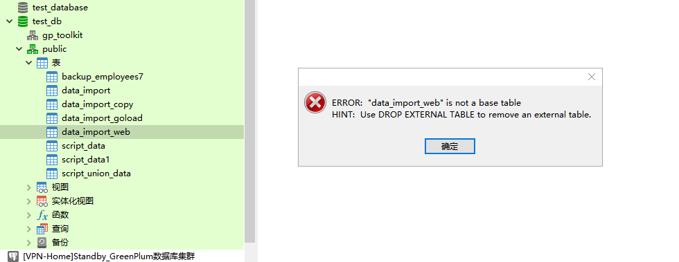
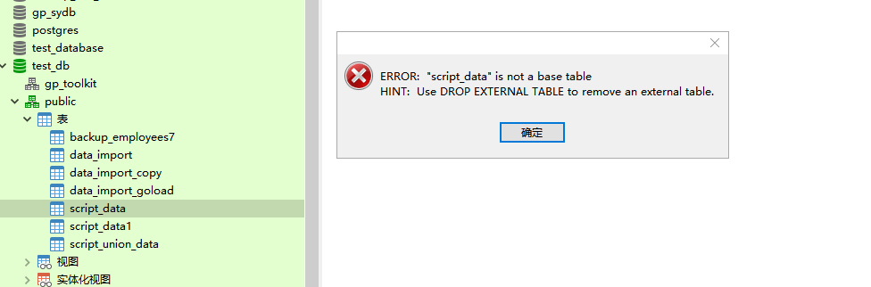

# 实验九：Segment节点进行缩容清除集群数据重新导入

> Author ：Heike07

## 模拟需求

在应对当前Segment节点过多，且需对两台机器进行卸载以适应模拟需求变更的挑战时，我们的策略是谨慎而周密的。为确保数据的安全性与集群的完整性，我们首先执行了全面的数据备份操作。这一步骤包括：

1. **全量数据备份**：通过实验八的方法，我们进行了逻辑层面的SQL备份，确保了数据库结构的完整。
2. **gpbackup全量备份**：同时，我们还使用了gpbackup工具进行了全量数据备份，以备不时之需。
3. **异地备份**：这些备份随后被转移至Segment-Standby节点上，并进行了异地文件备份，以便在集群崩溃时能够迅速恢复。

为了进一步保障底层安全，我们采取了以下措施：

1. **虚拟机快照**：我们对所有虚拟机进行了快照，以防止实验过程中可能出现的任何崩溃导致的数据丢失。
2. **集群关闭快照**：在关闭数据库集群后，我们立即进行了快照，以便在实验崩溃时能够迅速恢复。

实验中，我们采取了更为大胆的策略，通过深入分析数据之间的关联性，尝试直接关闭某个Segment节点，以模拟服务器故障。我们期待集群能够自主恢复，但如果集群无法自行恢复，我们将转而使用之前备份的全量数据进行集群的重置和恢复。

这一实验旨在验证集群的健壮性和恢复机制，其结果将为我们提供宝贵的经验，以确保在未来的实际操作中能够有效地应对类似情况。

## 备份方式一：SQL文件导出备份

### 备份前查询数据条数

根据实验8进行数据库SQL文件导出，导出至对应位置（Segment-Standby节点）

```powershell
# 查看需要备份的数据库还是通过临时表的方式
[gpadmin@Standby-a ~]$ psql -h Master-a -U gpadmin
psql (9.4.24)
Type "help" for help.

gp_sydb=# \l
                                     List of databases
         Name         |  Owner  | Encoding |  Collate   |   Ctype    |  Access privileges  
----------------------+---------+----------+------------+------------+---------------------
 backup_test_database | gpadmin | UTF8     | en_US.utf8 | en_US.utf8 | 
 gp_sydb              | gpadmin | UTF8     | en_US.utf8 | en_US.utf8 | 
 postgres             | gpadmin | UTF8     | en_US.utf8 | en_US.utf8 | 
 template0            | gpadmin | UTF8     | en_US.utf8 | en_US.utf8 | =c/gpadmin         +
                      |         |          |            |            | gpadmin=CTc/gpadmin
 template1            | gpadmin | UTF8     | en_US.utf8 | en_US.utf8 | =c/gpadmin         +
                      |         |          |            |            | gpadmin=CTc/gpadmin
 test_database        | gpadmin | UTF8     | en_US.utf8 | en_US.utf8 | 
 test_db              | gpadmin | UTF8     | en_US.utf8 | en_US.utf8 | 
(7 rows)

gp_sydb=# CREATE TEMP TABLE table_counts_bak (
gp_sydb(#     schema_name TEXT,
gp_sydb(#     table_name TEXT,
gp_sydb(#     row_count BIGINT
gp_sydb(# );
NOTICE:  Table doesn't have 'DISTRIBUTED BY' clause -- Using column named 'schema_name' as the Greenplum Database data distribution key for this table.
HINT:  The 'DISTRIBUTED BY' clause determines the distribution of data. Make sure column(s) chosen are the optimal data distribution key to minimize skew.
CREATE TABLE
gp_sydb=# DO $$ 
gp_sydb$# DECLARE
gp_sydb$#     tbl RECORD; 
gp_sydb$# BEGIN 
gp_sydb$#     FOR tbl IN 
gp_sydb$#         SELECT 
gp_sydb$#             n.nspname AS schema_name, 
gp_sydb$#             c.relname AS table_name 
gp_sydb$#         FROM 
gp_sydb$#             pg_class c 
gp_sydb$#         JOIN 
gp_sydb$#             pg_namespace n ON n.oid = c.relnamespace 
gp_sydb$#         WHERE 
gp_sydb$#             c.relkind = 'r' 
gp_sydb$#             AND n.nspname NOT IN ('pg_catalog', 'information_schema', 'gp_toolkit') 
gp_sydb$#             AND n.nspname NOT LIKE 'pg_temp%'  -- 排除所有临时命名空间
gp_sydb$#     LOOP 
gp_sydb$#         EXECUTE format(
gp_sydb$#             'INSERT INTO table_counts_bak (schema_name, table_name, row_count) 
gp_sydb$#              SELECT %L, %L, count(*) FROM %I.%I',
gp_sydb$#             tbl.schema_name, 
gp_sydb$#             tbl.table_name, 
gp_sydb$#             tbl.schema_name, 
gp_sydb$#             tbl.table_name
gp_sydb$#         );
gp_sydb$#     END LOOP; 
gp_sydb$# END $$;
DO
gp_sydb=# SELECT * FROM table_counts_bak ORDER BY row_count DESC;
 schema_name | table_name | row_count 
-------------+------------+-----------
(0 rows)


gp_sydb=# \c backup_test_database
You are now connected to database "backup_test_database" as user "gpadmin".
backup_test_database=# CREATE TEMP TABLE table_counts_bak (
backup_test_database(#     schema_name TEXT,
backup_test_database(#     table_name TEXT,
backup_test_database(#     row_count BIGINT
backup_test_database(# );
NOTICE:  Table doesn't have 'DISTRIBUTED BY' clause -- Using column named 'schema_name' as the Greenplum Database data distribution key for this table.
HINT:  The 'DISTRIBUTED BY' clause determines the distribution of data. Make sure column(s) chosen are the optimal data distribution key to minimize skew.
CREATE TABLE
backup_test_database=# 
backup_test_database=# DO $$ 
backup_test_database$# DECLARE
backup_test_database$#     tbl RECORD; 
backup_test_database$# BEGIN 
backup_test_database$#     FOR tbl IN 
backup_test_database$#         SELECT 
backup_test_database$#             n.nspname AS schema_name, 
backup_test_database$#             c.relname AS table_name 
backup_test_database$#         FROM 
backup_test_database$#             pg_class c 
backup_test_database$#         JOIN 
backup_test_database$#             pg_namespace n ON n.oid = c.relnamespace 
backup_test_database$#         WHERE 
backup_test_database$#             c.relkind = 'r' 
backup_test_database$#             AND n.nspname NOT IN ('pg_catalog', 'information_schema', 'gp_toolkit') 
backup_test_database$#             AND n.nspname NOT LIKE 'pg_temp%'  -- 排除所有临时命名空间
backup_test_database$#     LOOP 
backup_test_database$#         EXECUTE format(
backup_test_database$#             'INSERT INTO table_counts_bak (schema_name, table_name, row_count) 
backup_test_database$#              SELECT %L, %L, count(*) FROM %I.%I',
backup_test_database$#             tbl.schema_name, 
backup_test_database$#             tbl.table_name, 
backup_test_database$#             tbl.schema_name, 
backup_test_database$#             tbl.table_name
backup_test_database$#         );
backup_test_database$#     END LOOP; 
backup_test_database$# END $$;

DO
backup_test_database=# 
backup_test_database=# SELECT * FROM table_counts_bak ORDER BY row_count DESC;
 schema_name |    table_name    | row_count 
-------------+------------------+-----------
 public      | table_data       |  50000000
 public      | table_test       |   5000000
 public      | employees6       |       100
 public      | employees5       |       100
 public      | employees3       |       100
 public      | employees2       |       100
 public      | employees6_copy1 |       100
 public      | employees4       |       100
 public      | employees        |        97
 public      | employees_import |        50
(10 rows)


backup_test_database=# \c postgres
You are now connected to database "postgres" as user "gpadmin".
postgres=# CREATE TEMP TABLE table_counts_bak (
postgres(#     schema_name TEXT,
postgres(#     table_name TEXT,
postgres(#     row_count BIGINT
postgres(# );
NOTICE:  Table doesn't have 'DISTRIBUTED BY' clause -- Using column named 'schema_name' as the Greenplum Database data distribution key for this table.
HINT:  The 'DISTRIBUTED BY' clause determines the distribution of data. Make sure column(s) chosen are the optimal data distribution key to minimize skew.
CREATE TABLE
postgres=# 
postgres=# DO $$ 
postgres$# DECLARE
postgres$#     tbl RECORD; 
postgres$# BEGIN 
postgres$#     FOR tbl IN 
postgres$#         SELECT 
postgres$#             n.nspname AS schema_name, 
postgres$#             c.relname AS table_name 
postgres$#         FROM 
postgres$#             pg_class c 
postgres$#         JOIN 
postgres$#             pg_namespace n ON n.oid = c.relnamespace 
postgres$#         WHERE 
postgres$#             c.relkind = 'r' 
postgres$#             AND n.nspname NOT IN ('pg_catalog', 'information_schema', 'gp_toolkit') 
postgres$#             AND n.nspname NOT LIKE 'pg_temp%'  -- 排除所有临时命名空间
postgres$#     LOOP 
postgres$#         EXECUTE format(
postgres$#             'INSERT INTO table_counts_bak (schema_name, table_name, row_count) 
postgres$#              SELECT %L, %L, count(*) FROM %I.%I',
postgres$#             tbl.schema_name, 
postgres$#             tbl.table_name, 
postgres$#             tbl.schema_name, 
postgres$#             tbl.table_name
postgres$#         );
postgres$#     END LOOP; 
postgres$# END $$;
DO
postgres=# 
postgres=# SELECT * FROM table_counts_bak ORDER BY row_count DESC;
 schema_name |  table_name   | row_count 
-------------+---------------+-----------
 gpexpand    | status        |         6
 gpexpand    | status_detail |         1
(2 rows)


postgres=# \c test_database
You are now connected to database "test_database" as user "gpadmin".
test_database=# CREATE TEMP TABLE table_counts_bak (
test_database(#     schema_name TEXT,
test_database(#     table_name TEXT,
test_database(#     row_count BIGINT
test_database(# );
NOTICE:  Table doesn't have 'DISTRIBUTED BY' clause -- Using column named 'schema_name' as the Greenplum Database data distribution key for this table.
HINT:  The 'DISTRIBUTED BY' clause determines the distribution of data. Make sure column(s) chosen are the optimal data distribution key to minimize skew.
CREATE TABLE
test_database=# 
test_database=# DO $$ 
test_database$# DECLARE
test_database$#     tbl RECORD; 
test_database$# BEGIN 
test_database$#     FOR tbl IN 
test_database$#         SELECT 
test_database$#             n.nspname AS schema_name, 
test_database$#             c.relname AS table_name 
test_database$#         FROM 
test_database$#             pg_class c 
test_database$#         JOIN 
test_database$#             pg_namespace n ON n.oid = c.relnamespace 
test_database$#         WHERE 
test_database$#             c.relkind = 'r' 
test_database$#             AND n.nspname NOT IN ('pg_catalog', 'information_schema', 'gp_toolkit') 
test_database$#             AND n.nspname NOT LIKE 'pg_temp%'  -- 排除所有临时命名空间
test_database$#     LOOP 
test_database$#         EXECUTE format(
test_database$#             'INSERT INTO table_counts_bak (schema_name, table_name, row_count) 
test_database$#              SELECT %L, %L, count(*) FROM %I.%I',
test_database$#             tbl.schema_name, 
test_database$#             tbl.table_name, 
test_database$#             tbl.schema_name, 
test_database$#             tbl.table_name
test_database$#         );
test_database$#     END LOOP; 
test_database$# END $$;
DO
test_database=# 
test_database=# SELECT * FROM table_counts_bak ORDER BY row_count DESC;
 schema_name |    table_name    | row_count 
-------------+------------------+-----------
 public      | table_data       |  50000000
 public      | table_test       |   5000000
 public      | employees5       |       100
 public      | employees6       |       100
 public      | employees3       |       100
 public      | employees2       |       100
 public      | employees6_copy1 |       100
 public      | employees4       |       100
 public      | employees        |        97
 public      | employees_import |        50
(10 rows)


test_database=# \c test_db
test_db=# CREATE TEMP TABLE table_counts_bak1 (
test_db(#     schema_name TEXT,
test_db(#     table_name TEXT,
test_db(#     row_count BIGINT
test_db(# );
NOTICE:  Table doesn't have 'DISTRIBUTED BY' clause -- Using column named 'schema_name' as the Greenplum Database data distribution key for this table.
HINT:  The 'DISTRIBUTED BY' clause determines the distribution of data. Make sure column(s) chosen are the optimal data distribution key to minimize skew.
CREATE TABLE
test_db=# 
test_db=# DO $$ 
test_db$# DECLARE
test_db$#     tbl RECORD; 
test_db$# BEGIN 
test_db$#     FOR tbl IN 
test_db$#         SELECT 
test_db$#             n.nspname AS schema_name, 
test_db$#             c.relname AS table_name 
test_db$#         FROM 
test_db$#             pg_class c 
test_db$#         JOIN 
test_db$#             pg_namespace n ON n.oid = c.relnamespace 
test_db$#         WHERE 
test_db$#             c.relkind = 'r' 
test_db$#             AND n.nspname NOT IN ('pg_catalog', 'information_schema', 'gp_toolkit') 
test_db$#             AND n.nspname NOT LIKE 'pg_temp%'  -- 排除所有临时命名空间
test_db$#     LOOP 
test_db$#         EXECUTE format(
test_db$#             'INSERT INTO table_counts_bak1 (schema_name, table_name, row_count) 
test_db$#              SELECT %L, %L, count(*) FROM %I.%I',
test_db$#             tbl.schema_name, 
test_db$#             tbl.table_name, 
test_db$#             tbl.schema_name, 
test_db$#             tbl.table_name
test_db$#         );
test_db$#     END LOOP; 
test_db$# END $$;
NOTICE:  HEADER means that each one of the data files has a header row
CONTEXT:  SQL statement "INSERT INTO table_counts_bak1 (schema_name, table_name, row_count) 
             SELECT 'public', 'data_import_web', count(*) FROM public.data_import_web"
PL/pgSQL function inline_code_block line 18 at EXECUTE statement
ERROR:  invalid input syntax for integer: ""4965080""  (seg8 slice1 192.168.7.141:6000 pid=4993)
CONTEXT:  External table script_data, line 1 of execute:/home/gpadmin/get_script_data.sh, column id
SQL statement "INSERT INTO table_counts_bak1 (schema_name, table_name, row_count) 
             SELECT 'public', 'script_data', count(*) FROM public.script_data"
PL/pgSQL function inline_code_block line 18 at EXECUTE statement
test_db=# 
test_db=# SELECT * FROM table_counts_bak1 ORDER BY row_count DESC;
 schema_name | table_name | row_count 
-------------+------------+-----------
(0 rows)

test_db=#

这是是因为有个一个数据是web引入的，忽略
```



```powershell
test_db=# DROP EXTERNAL TABLE data_import_web;
DROP EXTERNAL TABLE
test_db=#

test_db=# CREATE TEMP TABLE table_counts (
test_db(#     schema_name TEXT,
test_db(#     table_name TEXT,
test_db(#     row_count BIGINT
test_db(# );
NOTICE:  Table doesn't have 'DISTRIBUTED BY' clause -- Using column named 'schema_name' as the Greenplum Database data distribution key for this table.
HINT:  The 'DISTRIBUTED BY' clause determines the distribution of data. Make sure column(s) chosen are the optimal data distribution key to minimize skew.
CREATE TABLE
test_db=# 
test_db=# DO $$ 
test_db$# DECLARE
test_db$#     tbl RECORD; 
test_db$# BEGIN 
test_db$#     FOR tbl IN 
test_db$#         SELECT 
test_db$#             n.nspname AS schema_name, 
test_db$#             c.relname AS table_name 
test_db$#         FROM 
test_db$#             pg_class c 
test_db$#         JOIN 
test_db$#             pg_namespace n ON n.oid = c.relnamespace 
test_db$#         WHERE 
test_db$#             c.relkind = 'r' 
test_db$#             AND n.nspname NOT IN ('pg_catalog', 'information_schema', 'gp_toolkit') 
test_db$#             AND n.nspname NOT LIKE 'pg_temp%'  -- 排除所有临时命名空间
test_db$#     LOOP 
test_db$#         EXECUTE format(
test_db$#             'INSERT INTO table_counts (schema_name, table_name, row_count) 
test_db$#              SELECT %L, %L, count(*) FROM %I.%I',
test_db$#             tbl.schema_name, 
test_db$#             tbl.table_name, 
test_db$#             tbl.schema_name, 
test_db$#             tbl.table_name
test_db$#         );
test_db$#     END LOOP; 
test_db$# END $$;
ERROR:  invalid input syntax for integer: ""4965080""  (seg2 slice1 192.168.7.139:6000 pid=5104)
CONTEXT:  External table script_data, line 1 of execute:/home/gpadmin/get_script_data.sh, column id
SQL statement "INSERT INTO table_counts (schema_name, table_name, row_count) 
             SELECT 'public', 'script_data', count(*) FROM public.script_data"
PL/pgSQL function inline_code_block line 18 at EXECUTE statement
test_db=# 
test_db=# SELECT * FROM table_counts ORDER BY row_count DESC;
 schema_name | table_name | row_count 
-------------+------------+-----------
(0 rows)

test_db=#
```



```powershell
# 删除类似的外部表
test_db=# DROP EXTERNAL TABLE script_data
test_db-# ;
DROP EXTERNAL TABLE
test_db=# DROP EXTERNAL TABLE script_data1;
DROP EXTERNAL TABLE
test_db=# DROP EXTERNAL TABLE script_union_data;
DROP EXTERNAL TABLE
test_db=#

test_db=# CREATE TEMP TABLE table_counts (
test_db(#     schema_name TEXT,
test_db(#     table_name TEXT,
test_db(#     row_count BIGINT
test_db(# );
NOTICE:  Table doesn't have 'DISTRIBUTED BY' clause -- Using column named 'schema_name' as the Greenplum Database data distribution key for this table.
HINT:  The 'DISTRIBUTED BY' clause determines the distribution of data. Make sure column(s) chosen are the optimal data distribution key to minimize skew.
ERROR:  relation "table_counts" already exists
test_db=# 
test_db=# DO $$ 
test_db$# DECLARE
test_db$#     tbl RECORD; 
test_db$# BEGIN 
test_db$#     FOR tbl IN 
test_db$#         SELECT 
test_db$#             n.nspname AS schema_name, 
test_db$#             c.relname AS table_name 
test_db$#         FROM 
test_db$#             pg_class c 
test_db$#         JOIN 
test_db$#             pg_namespace n ON n.oid = c.relnamespace 
test_db$#         WHERE 
test_db$#             c.relkind = 'r' 
test_db$#             AND n.nspname NOT IN ('pg_catalog', 'information_schema', 'gp_toolkit') 
test_db$#             AND n.nspname NOT LIKE 'pg_temp%'  -- 排除所有临时命名空间
test_db$#     LOOP 
test_db$#         EXECUTE format(
test_db$#             'INSERT INTO table_counts (schema_name, table_name, row_count) 
test_db$#              SELECT %L, %L, count(*) FROM %I.%I',
test_db$#             tbl.schema_name, 
test_db$#             tbl.table_name, 
test_db$#             tbl.schema_name, 
test_db$#             tbl.table_name
test_db$#         );
test_db$#     END LOOP; 
test_db$# END $$;
DO
test_db=# 
test_db=# SELECT * FROM table_counts ORDER BY row_count DESC;
 schema_name |     table_name     | row_count 
-------------+--------------------+-----------
 public      | data_import_goload |   5000000
 public      | data_import_copy   |   5000000
 public      | data_import        |   5000000
 public      | backup_employees7  |       100
(4 rows)

test_db=#

执行查看成功
```

### 脚本方式备份所需数据

```powershell
针对这个情况 写一个循环备份的需求实现。
[gpadmin@Standby-a backup]$ ./backup.sh 
Starting backup for database: backup_test_database
Backup completed successfully for database: backup_test_database
Starting backup for database: gp_sydb
Backup completed successfully for database: gp_sydb
Starting backup for database: postgres
Backup completed successfully for database: postgres
Starting backup for database: template0
pg_dump: [archiver (db)] connection to database "template0" failed: FATAL:  database "template0" is not currently accepting connections
Backup failed for database: template0
[gpadmin@Standby-a backup]$

根据错误提示 去掉报错数据库 只保留业务数据库

[gpadmin@Standby-a backup]$ ./backup.sh 
Starting backup for database: backup_test_database
Backup completed successfully for database: backup_test_database
Starting backup for database: test_database
Backup completed successfully for database: test_database
Starting backup for database: test_db
Backup completed successfully for database: test_db
All database backups have been completed.
[gpadmin@Standby-a backup]$ ll
total 4419496
-rw-rw-r-- 1 gpadmin gpadmin 1997244568 Dec 10 16:05 backup_backup_test_database.sql
-rwxr-xr-x 1 gpadmin gpadmin       1082 Dec 10 16:05 backup.sh
-rw-rw-r-- 1 gpadmin gpadmin 1997244595 Dec 10 16:05 backup_test_database.sql
-rw-rw-r-- 1 gpadmin gpadmin  531065686 Dec 10 16:05 backup_test_db.sql
[gpadmin@Standby-a backup]$

该脚本会在实验名称资源文件中获取

通过脚本已经实现了3个业务数据库的备份，并记录了相应的数据集，用于后续如果崩了之后的备份。

忽略模板库重新备份

[gpadmin@Standby-a backup]$ vim backup.sh 
[gpadmin@Standby-a backup]$ ls
backup_backup_test_database.sql  backup.sh  backup_test_database.sql  backup_test_db.sql
[gpadmin@Standby-a backup]$ rm -rf *.sql
[gpadmin@Standby-a backup]$ ./backup.sh 
Starting backup for database: backup_test_database
Backup completed successfully for database: backup_test_database
Starting backup for database: test_database
Backup completed successfully for database: test_database
Starting backup for database: test_db
Backup completed successfully for database: test_db
Starting backup for database: gp_sydb
Backup completed successfully for database: gp_sydb
Starting backup for database: postgres
Backup completed successfully for database: postgres
All database backups have been completed.
[gpadmin@Standby-a backup]$ ll
total 4419508
-rw-rw-r-- 1 gpadmin gpadmin 1997244568 Dec 10 16:20 backup_backup_test_database.sql
-rw-rw-r-- 1 gpadmin gpadmin        892 Dec 10 16:20 backup_gp_sydb.sql
-rw-rw-r-- 1 gpadmin gpadmin       5277 Dec 10 16:20 backup_postgres.sql
-rwxr-xr-x 1 gpadmin gpadmin       1115 Dec 10 16:19 backup.sh
-rw-rw-r-- 1 gpadmin gpadmin 1997244595 Dec 10 16:20 backup_test_database.sql
-rw-rw-r-- 1 gpadmin gpadmin  531065686 Dec 10 16:20 backup_test_db.sql
[gpadmin@Standby-a backup]$

在生产上可以添加cron 进行定期异地备份
```

## 备份方式二：GPBACKUP全量备份

### 构建脚本实现循环备份

来，因为上面已经进行了数据库条数的查询，所有就不再次查询数据条数了，另外由于gpbackup插件需要指定一个dbname 参数，所以还是写一个循环脚本来实现备份，具体的脚本和之前一样，放在资源文件夹中。

```powershell
# 执行脚本
[gpadmin@Master-a ~]$ mkdir backups-Experiment-9
[gpadmin@Master-a ~]$ cd backups-Experiment-9/
[gpadmin@Master-a backups-Experiment-9]$ ls
[gpadmin@Master-a backups-Experiment-9]$ touch gpbackup.sh
[gpadmin@Master-a backups-Experiment-9]$ vim gpbackup.sh 
[gpadmin@Master-a backups-Experiment-9]$ chmod +x gpbackup.sh 
[gpadmin@Master-a backups-Experiment-9]$ l
bash: l: command not found
[gpadmin@Master-a backups-Experiment-9]$ ls
gpbackup.sh
[gpadmin@Master-a backups-Experiment-9]$ ./gpbackup.sh 
Starting backup for database: backup_test_database
20241211:13:30:36 gpbackup:gpadmin:Master-a:029515-[INFO]:-gpbackup version = 1.30.7
20241211:13:30:37 gpbackup:gpadmin:Master-a:029515-[INFO]:-Greenplum Database Version = 6.13.0 build commit:4f1adf8e247a9685c19ea02bcaddfdc200937ecd Open Source
20241211:13:30:37 gpbackup:gpadmin:Master-a:029515-[INFO]:-Starting backup of database backup_test_database
20241211:13:30:37 gpbackup:gpadmin:Master-a:029515-[INFO]:-Backup Timestamp = 20241211133036
20241211:13:30:37 gpbackup:gpadmin:Master-a:029515-[INFO]:-Backup Database = backup_test_database
20241211:13:30:37 gpbackup:gpadmin:Master-a:029515-[INFO]:-Gathering table state information
20241211:13:30:37 gpbackup:gpadmin:Master-a:029515-[INFO]:-Acquiring ACCESS SHARE locks on tables
Locks acquired:  10 / 10 [===========================================================] 100.00% 0s
20241211:13:30:37 gpbackup:gpadmin:Master-a:029515-[INFO]:-Gathering additional table metadata
20241211:13:30:37 gpbackup:gpadmin:Master-a:029515-[INFO]:-Getting partition definitions
20241211:13:30:37 gpbackup:gpadmin:Master-a:029515-[INFO]:-Getting storage information
20241211:13:30:37 gpbackup:gpadmin:Master-a:029515-[INFO]:-Getting child partitions with altered schema
20241211:13:30:37 gpbackup:gpadmin:Master-a:029515-[INFO]:-Metadata will be written to /home/gpadmin/backups-Experiment-9/backup_test_database_20241211133036/gpseg-1/backups/20241211/20241211133036/gpbackup_20241211133036_metadata.sql
20241211:13:30:37 gpbackup:gpadmin:Master-a:029515-[INFO]:-Writing global database metadata
20241211:13:30:37 gpbackup:gpadmin:Master-a:029515-[INFO]:-Global database metadata backup complete
20241211:13:30:37 gpbackup:gpadmin:Master-a:029515-[INFO]:-Writing pre-data metadata
20241211:13:30:37 gpbackup:gpadmin:Master-a:029515-[INFO]:-Pre-data metadata metadata backup complete
20241211:13:30:37 gpbackup:gpadmin:Master-a:029515-[INFO]:-Writing post-data metadata
20241211:13:30:37 gpbackup:gpadmin:Master-a:029515-[INFO]:-Post-data metadata backup complete
20241211:13:30:37 gpbackup:gpadmin:Master-a:029515-[INFO]:-Writing data to file
Tables backed up:  10 / 10 [=========================================================] 100.00% 8s
20241211:13:30:46 gpbackup:gpadmin:Master-a:029515-[INFO]:-Data backup complete
20241211:13:30:47 gpbackup:gpadmin:Master-a:029515-[INFO]:-Found neither /usr/local/greenplum-db/bin/gp_email_contacts.yaml nor /home/gpadmin/gp_email_contacts.yaml
20241211:13:30:47 gpbackup:gpadmin:Master-a:029515-[INFO]:-Email containing gpbackup report /home/gpadmin/backups-Experiment-9/backup_test_database_20241211133036/gpseg-1/backups/20241211/20241211133036/gpbackup_20241211133036_report will not be sent
20241211:13:30:47 gpbackup:gpadmin:Master-a:029515-[INFO]:-Beginning cleanup
20241211:13:30:47 gpbackup:gpadmin:Master-a:029515-[INFO]:-Cleanup complete
20241211:13:30:47 gpbackup:gpadmin:Master-a:029515-[INFO]:-Backup completed successfully
Backup completed successfully for database: backup_test_database
Starting backup for database: test_database
20241211:13:30:47 gpbackup:gpadmin:Master-a:030032-[INFO]:-gpbackup version = 1.30.7
20241211:13:30:47 gpbackup:gpadmin:Master-a:030032-[INFO]:-Greenplum Database Version = 6.13.0 build commit:4f1adf8e247a9685c19ea02bcaddfdc200937ecd Open Source
20241211:13:30:47 gpbackup:gpadmin:Master-a:030032-[INFO]:-Starting backup of database test_database
20241211:13:30:47 gpbackup:gpadmin:Master-a:030032-[INFO]:-Backup Timestamp = 20241211133047
20241211:13:30:47 gpbackup:gpadmin:Master-a:030032-[INFO]:-Backup Database = test_database
20241211:13:30:47 gpbackup:gpadmin:Master-a:030032-[INFO]:-Gathering table state information
20241211:13:30:47 gpbackup:gpadmin:Master-a:030032-[INFO]:-Acquiring ACCESS SHARE locks on tables
Locks acquired:  10 / 10 [===========================================================] 100.00% 0s
20241211:13:30:47 gpbackup:gpadmin:Master-a:030032-[INFO]:-Gathering additional table metadata
20241211:13:30:47 gpbackup:gpadmin:Master-a:030032-[INFO]:-Getting partition definitions
20241211:13:30:47 gpbackup:gpadmin:Master-a:030032-[INFO]:-Getting storage information
20241211:13:30:47 gpbackup:gpadmin:Master-a:030032-[INFO]:-Getting child partitions with altered schema
20241211:13:30:47 gpbackup:gpadmin:Master-a:030032-[INFO]:-Metadata will be written to /home/gpadmin/backups-Experiment-9/test_database_20241211133036/gpseg-1/backups/20241211/20241211133047/gpbackup_20241211133047_metadata.sql
20241211:13:30:47 gpbackup:gpadmin:Master-a:030032-[INFO]:-Writing global database metadata
20241211:13:30:47 gpbackup:gpadmin:Master-a:030032-[INFO]:-Global database metadata backup complete
20241211:13:30:47 gpbackup:gpadmin:Master-a:030032-[INFO]:-Writing pre-data metadata
20241211:13:30:47 gpbackup:gpadmin:Master-a:030032-[INFO]:-Pre-data metadata metadata backup complete
20241211:13:30:47 gpbackup:gpadmin:Master-a:030032-[INFO]:-Writing post-data metadata
20241211:13:30:47 gpbackup:gpadmin:Master-a:030032-[INFO]:-Post-data metadata backup complete
20241211:13:30:47 gpbackup:gpadmin:Master-a:030032-[INFO]:-Writing data to file
Tables backed up:  10 / 10 [=========================================================] 100.00% 9s
20241211:13:30:56 gpbackup:gpadmin:Master-a:030032-[INFO]:-Data backup complete
20241211:13:30:57 gpbackup:gpadmin:Master-a:030032-[INFO]:-Found neither /usr/local/greenplum-db/bin/gp_email_contacts.yaml nor /home/gpadmin/gp_email_contacts.yaml
20241211:13:30:57 gpbackup:gpadmin:Master-a:030032-[INFO]:-Email containing gpbackup report /home/gpadmin/backups-Experiment-9/test_database_20241211133036/gpseg-1/backups/20241211/20241211133047/gpbackup_20241211133047_report will not be sent
20241211:13:30:57 gpbackup:gpadmin:Master-a:030032-[INFO]:-Beginning cleanup
20241211:13:30:57 gpbackup:gpadmin:Master-a:030032-[INFO]:-Cleanup complete
20241211:13:30:57 gpbackup:gpadmin:Master-a:030032-[INFO]:-Backup completed successfully
Backup completed successfully for database: test_database
Starting backup for database: test_db
20241211:13:30:57 gpbackup:gpadmin:Master-a:030440-[INFO]:-gpbackup version = 1.30.7
20241211:13:30:58 gpbackup:gpadmin:Master-a:030440-[INFO]:-Greenplum Database Version = 6.13.0 build commit:4f1adf8e247a9685c19ea02bcaddfdc200937ecd Open Source
20241211:13:30:58 gpbackup:gpadmin:Master-a:030440-[INFO]:-Starting backup of database test_db
20241211:13:30:58 gpbackup:gpadmin:Master-a:030440-[INFO]:-Backup Timestamp = 20241211133058
20241211:13:30:58 gpbackup:gpadmin:Master-a:030440-[INFO]:-Backup Database = test_db
20241211:13:30:58 gpbackup:gpadmin:Master-a:030440-[INFO]:-Gathering table state information
20241211:13:30:58 gpbackup:gpadmin:Master-a:030440-[INFO]:-Acquiring ACCESS SHARE locks on tables
Locks acquired:  4 / 4 [=============================================================] 100.00% 0s
20241211:13:30:58 gpbackup:gpadmin:Master-a:030440-[INFO]:-Gathering additional table metadata
20241211:13:30:58 gpbackup:gpadmin:Master-a:030440-[INFO]:-Getting partition definitions
20241211:13:30:58 gpbackup:gpadmin:Master-a:030440-[INFO]:-Getting storage information
20241211:13:30:58 gpbackup:gpadmin:Master-a:030440-[INFO]:-Getting child partitions with altered schema
20241211:13:30:58 gpbackup:gpadmin:Master-a:030440-[INFO]:-Metadata will be written to /home/gpadmin/backups-Experiment-9/test_db_20241211133036/gpseg-1/backups/20241211/20241211133058/gpbackup_20241211133058_metadata.sql
20241211:13:30:58 gpbackup:gpadmin:Master-a:030440-[INFO]:-Writing global database metadata
20241211:13:30:58 gpbackup:gpadmin:Master-a:030440-[INFO]:-Global database metadata backup complete
20241211:13:30:58 gpbackup:gpadmin:Master-a:030440-[INFO]:-Writing pre-data metadata
20241211:13:30:58 gpbackup:gpadmin:Master-a:030440-[INFO]:-Pre-data metadata metadata backup complete
20241211:13:30:58 gpbackup:gpadmin:Master-a:030440-[INFO]:-Writing post-data metadata
20241211:13:30:58 gpbackup:gpadmin:Master-a:030440-[INFO]:-Post-data metadata backup complete
20241211:13:30:58 gpbackup:gpadmin:Master-a:030440-[INFO]:-Writing data to file
Tables backed up:  4 / 4 [===========================================================] 100.00% 2s
20241211:13:31:01 gpbackup:gpadmin:Master-a:030440-[INFO]:-Data backup complete
20241211:13:31:02 gpbackup:gpadmin:Master-a:030440-[INFO]:-Found neither /usr/local/greenplum-db/bin/gp_email_contacts.yaml nor /home/gpadmin/gp_email_contacts.yaml
20241211:13:31:02 gpbackup:gpadmin:Master-a:030440-[INFO]:-Email containing gpbackup report /home/gpadmin/backups-Experiment-9/test_db_20241211133036/gpseg-1/backups/20241211/20241211133058/gpbackup_20241211133058_report will not be sent
20241211:13:31:02 gpbackup:gpadmin:Master-a:030440-[INFO]:-Beginning cleanup
20241211:13:31:02 gpbackup:gpadmin:Master-a:030440-[INFO]:-Cleanup complete
20241211:13:31:02 gpbackup:gpadmin:Master-a:030440-[INFO]:-Backup completed successfully
Backup completed successfully for database: test_db
Starting backup for database: gp_sydb
20241211:13:31:02 gpbackup:gpadmin:Master-a:030740-[INFO]:-gpbackup version = 1.30.7
20241211:13:31:02 gpbackup:gpadmin:Master-a:030740-[INFO]:-Greenplum Database Version = 6.13.0 build commit:4f1adf8e247a9685c19ea02bcaddfdc200937ecd Open Source
20241211:13:31:02 gpbackup:gpadmin:Master-a:030740-[INFO]:-Starting backup of database gp_sydb
20241211:13:31:03 gpbackup:gpadmin:Master-a:030740-[INFO]:-Backup Timestamp = 20241211133102
20241211:13:31:03 gpbackup:gpadmin:Master-a:030740-[INFO]:-Backup Database = gp_sydb
20241211:13:31:03 gpbackup:gpadmin:Master-a:030740-[INFO]:-Gathering table state information
20241211:13:31:03 gpbackup:gpadmin:Master-a:030740-[INFO]:-Acquiring ACCESS SHARE locks on tables
20241211:13:31:03 gpbackup:gpadmin:Master-a:030740-[INFO]:-Gathering additional table metadata
20241211:13:31:03 gpbackup:gpadmin:Master-a:030740-[INFO]:-Getting partition definitions
20241211:13:31:03 gpbackup:gpadmin:Master-a:030740-[INFO]:-Getting storage information
20241211:13:31:03 gpbackup:gpadmin:Master-a:030740-[INFO]:-Getting child partitions with altered schema
20241211:13:31:03 gpbackup:gpadmin:Master-a:030740-[WARNING]:-No tables in backup set contain data. Performing metadata-only backup instead.
20241211:13:31:03 gpbackup:gpadmin:Master-a:030740-[INFO]:-Metadata will be written to /home/gpadmin/backups-Experiment-9/gp_sydb_20241211133036/gpseg-1/backups/20241211/20241211133102/gpbackup_20241211133102_metadata.sql
20241211:13:31:03 gpbackup:gpadmin:Master-a:030740-[INFO]:-Writing global database metadata
20241211:13:31:03 gpbackup:gpadmin:Master-a:030740-[INFO]:-Global database metadata backup complete
20241211:13:31:03 gpbackup:gpadmin:Master-a:030740-[INFO]:-Writing pre-data metadata
20241211:13:31:03 gpbackup:gpadmin:Master-a:030740-[INFO]:-Pre-data metadata metadata backup complete
20241211:13:31:03 gpbackup:gpadmin:Master-a:030740-[INFO]:-Writing post-data metadata
20241211:13:31:03 gpbackup:gpadmin:Master-a:030740-[INFO]:-Post-data metadata backup complete
20241211:13:31:04 gpbackup:gpadmin:Master-a:030740-[INFO]:-Found neither /usr/local/greenplum-db/bin/gp_email_contacts.yaml nor /home/gpadmin/gp_email_contacts.yaml
20241211:13:31:04 gpbackup:gpadmin:Master-a:030740-[INFO]:-Email containing gpbackup report /home/gpadmin/backups-Experiment-9/gp_sydb_20241211133036/gpseg-1/backups/20241211/20241211133102/gpbackup_20241211133102_report will not be sent
20241211:13:31:04 gpbackup:gpadmin:Master-a:030740-[INFO]:-Beginning cleanup
20241211:13:31:04 gpbackup:gpadmin:Master-a:030740-[INFO]:-Cleanup complete
20241211:13:31:04 gpbackup:gpadmin:Master-a:030740-[INFO]:-Backup completed successfully
Backup completed successfully for database: gp_sydb
Starting backup for database: postgres
20241211:13:31:04 gpbackup:gpadmin:Master-a:030805-[INFO]:-gpbackup version = 1.30.7
20241211:13:31:04 gpbackup:gpadmin:Master-a:030805-[INFO]:-Greenplum Database Version = 6.13.0 build commit:4f1adf8e247a9685c19ea02bcaddfdc200937ecd Open Source
20241211:13:31:04 gpbackup:gpadmin:Master-a:030805-[INFO]:-Starting backup of database postgres
20241211:13:31:04 gpbackup:gpadmin:Master-a:030805-[INFO]:-Backup Timestamp = 20241211133104
20241211:13:31:04 gpbackup:gpadmin:Master-a:030805-[INFO]:-Backup Database = postgres
20241211:13:31:04 gpbackup:gpadmin:Master-a:030805-[INFO]:-Gathering table state information
20241211:13:31:04 gpbackup:gpadmin:Master-a:030805-[INFO]:-Acquiring ACCESS SHARE locks on tables
Locks acquired:  2 / 2 [=============================================================] 100.00% 0s
20241211:13:31:04 gpbackup:gpadmin:Master-a:030805-[INFO]:-Gathering additional table metadata
20241211:13:31:04 gpbackup:gpadmin:Master-a:030805-[INFO]:-Getting partition definitions
20241211:13:31:04 gpbackup:gpadmin:Master-a:030805-[INFO]:-Getting storage information
20241211:13:31:04 gpbackup:gpadmin:Master-a:030805-[INFO]:-Getting child partitions with altered schema
20241211:13:31:04 gpbackup:gpadmin:Master-a:030805-[INFO]:-Metadata will be written to /home/gpadmin/backups-Experiment-9/postgres_20241211133036/gpseg-1/backups/20241211/20241211133104/gpbackup_20241211133104_metadata.sql
20241211:13:31:04 gpbackup:gpadmin:Master-a:030805-[INFO]:-Writing global database metadata
20241211:13:31:04 gpbackup:gpadmin:Master-a:030805-[INFO]:-Global database metadata backup complete
20241211:13:31:04 gpbackup:gpadmin:Master-a:030805-[INFO]:-Writing pre-data metadata
20241211:13:31:04 gpbackup:gpadmin:Master-a:030805-[INFO]:-Pre-data metadata metadata backup complete
20241211:13:31:04 gpbackup:gpadmin:Master-a:030805-[INFO]:-Writing post-data metadata
20241211:13:31:04 gpbackup:gpadmin:Master-a:030805-[INFO]:-Post-data metadata backup complete
20241211:13:31:04 gpbackup:gpadmin:Master-a:030805-[INFO]:-Writing data to file
Tables backed up:  2 / 2 [===========================================================] 100.00% 0s
20241211:13:31:05 gpbackup:gpadmin:Master-a:030805-[INFO]:-Data backup complete
20241211:13:31:06 gpbackup:gpadmin:Master-a:030805-[INFO]:-Found neither /usr/local/greenplum-db/bin/gp_email_contacts.yaml nor /home/gpadmin/gp_email_contacts.yaml
20241211:13:31:06 gpbackup:gpadmin:Master-a:030805-[INFO]:-Email containing gpbackup report /home/gpadmin/backups-Experiment-9/postgres_20241211133036/gpseg-1/backups/20241211/20241211133104/gpbackup_20241211133104_report will not be sent
20241211:13:31:06 gpbackup:gpadmin:Master-a:030805-[INFO]:-Beginning cleanup
20241211:13:31:06 gpbackup:gpadmin:Master-a:030805-[INFO]:-Cleanup complete
20241211:13:31:06 gpbackup:gpadmin:Master-a:030805-[INFO]:-Backup completed successfully
Backup completed successfully for database: postgres
All database backups have been completed.
[gpadmin@Master-a backups-Experiment-9]$

# 看下备份目录
[gpadmin@Master-a backups-Experiment-9]$ tree
.
├── backup_test_database_20241211133036
│   └── gpseg-1
│       └── backups
│           └── 20241211
│               └── 20241211133036
│                   ├── gpbackup_20241211133036_config.yaml
│                   ├── gpbackup_20241211133036_metadata.sql
│                   ├── gpbackup_20241211133036_report
│                   └── gpbackup_20241211133036_toc.yaml
├── gpbackup.sh
├── gp_sydb_20241211133036
│   └── gpseg-1
│       └── backups
│           └── 20241211
│               └── 20241211133102
│                   ├── gpbackup_20241211133102_config.yaml
│                   ├── gpbackup_20241211133102_metadata.sql
│                   ├── gpbackup_20241211133102_report
│                   └── gpbackup_20241211133102_toc.yaml
├── postgres_20241211133036
│   └── gpseg-1
│       └── backups
│           └── 20241211
│               └── 20241211133104
│                   ├── gpbackup_20241211133104_config.yaml
│                   ├── gpbackup_20241211133104_metadata.sql
│                   ├── gpbackup_20241211133104_report
│                   └── gpbackup_20241211133104_toc.yaml
├── test_database_20241211133036
│   └── gpseg-1
│       └── backups
│           └── 20241211
│               └── 20241211133047
│                   ├── gpbackup_20241211133047_config.yaml
│                   ├── gpbackup_20241211133047_metadata.sql
│                   ├── gpbackup_20241211133047_report
│                   └── gpbackup_20241211133047_toc.yaml
└── test_db_20241211133036
    └── gpseg-1
        └── backups
            └── 20241211
                └── 20241211133058
                    ├── gpbackup_20241211133058_config.yaml
                    ├── gpbackup_20241211133058_metadata.sql
                    ├── gpbackup_20241211133058_report
                    └── gpbackup_20241211133058_toc.yaml

25 directories, 21 files
[gpadmin@Master-a backups-Experiment-9]$

备份目录的结构和预期的结构满足要求

首先脚本执行的时候有一个时间对应的文件夹，但是这样还是有些乱，修改一下。

修改后 我们执行2次来看下是否满足预期


[gpadmin@Master-a backups-Experiment-9]$ vim gpbackup.sh 
[gpadmin@Master-a backups-Experiment-9]$ 
[gpadmin@Master-a backups-Experiment-9]$ 
[gpadmin@Master-a backups-Experiment-9]$ ./gpbackup.sh 
Starting backup for database: backup_test_database
20241211:13:36:09 gpbackup:gpadmin:Master-a:041944-[INFO]:-gpbackup version = 1.30.7
20241211:13:36:09 gpbackup:gpadmin:Master-a:041944-[INFO]:-Greenplum Database Version = 6.13.0 build commit:4f1adf8e247a9685c19ea02bcaddfdc200937ecd Open Source
20241211:13:36:09 gpbackup:gpadmin:Master-a:041944-[INFO]:-Starting backup of database backup_test_database
20241211:13:36:09 gpbackup:gpadmin:Master-a:041944-[INFO]:-Backup Timestamp = 20241211133609
20241211:13:36:09 gpbackup:gpadmin:Master-a:041944-[INFO]:-Backup Database = backup_test_database
20241211:13:36:09 gpbackup:gpadmin:Master-a:041944-[INFO]:-Gathering table state information
20241211:13:36:09 gpbackup:gpadmin:Master-a:041944-[INFO]:-Acquiring ACCESS SHARE locks on tables
Locks acquired:  10 / 10 [===========================================================] 100.00% 0s
20241211:13:36:09 gpbackup:gpadmin:Master-a:041944-[INFO]:-Gathering additional table metadata
20241211:13:36:09 gpbackup:gpadmin:Master-a:041944-[INFO]:-Getting partition definitions
20241211:13:36:09 gpbackup:gpadmin:Master-a:041944-[INFO]:-Getting storage information
20241211:13:36:09 gpbackup:gpadmin:Master-a:041944-[INFO]:-Getting child partitions with altered schema
20241211:13:36:09 gpbackup:gpadmin:Master-a:041944-[INFO]:-Metadata will be written to /home/gpadmin/backups-Experiment-9/backup_test_database/gpseg-1/backups/20241211/20241211133609/gpbackup_20241211133609_metadata.sql
20241211:13:36:09 gpbackup:gpadmin:Master-a:041944-[INFO]:-Writing global database metadata
20241211:13:36:09 gpbackup:gpadmin:Master-a:041944-[INFO]:-Global database metadata backup complete
20241211:13:36:09 gpbackup:gpadmin:Master-a:041944-[INFO]:-Writing pre-data metadata
20241211:13:36:09 gpbackup:gpadmin:Master-a:041944-[INFO]:-Pre-data metadata metadata backup complete
20241211:13:36:09 gpbackup:gpadmin:Master-a:041944-[INFO]:-Writing post-data metadata
20241211:13:36:09 gpbackup:gpadmin:Master-a:041944-[INFO]:-Post-data metadata backup complete
20241211:13:36:09 gpbackup:gpadmin:Master-a:041944-[INFO]:-Writing data to file
Tables backed up:  10 / 10 [=========================================================] 100.00% 8s
20241211:13:36:17 gpbackup:gpadmin:Master-a:041944-[INFO]:-Data backup complete
20241211:13:36:18 gpbackup:gpadmin:Master-a:041944-[INFO]:-Found neither /usr/local/greenplum-db/bin/gp_email_contacts.yaml nor /home/gpadmin/gp_email_contacts.yaml
20241211:13:36:18 gpbackup:gpadmin:Master-a:041944-[INFO]:-Email containing gpbackup report /home/gpadmin/backups-Experiment-9/backup_test_database/gpseg-1/backups/20241211/20241211133609/gpbackup_20241211133609_report will not be sent
20241211:13:36:18 gpbackup:gpadmin:Master-a:041944-[INFO]:-Beginning cleanup
20241211:13:36:18 gpbackup:gpadmin:Master-a:041944-[INFO]:-Cleanup complete
20241211:13:36:18 gpbackup:gpadmin:Master-a:041944-[INFO]:-Backup completed successfully
Backup completed successfully for database: backup_test_database
Starting backup for database: test_database
20241211:13:36:18 gpbackup:gpadmin:Master-a:042353-[INFO]:-gpbackup version = 1.30.7
20241211:13:36:19 gpbackup:gpadmin:Master-a:042353-[INFO]:-Greenplum Database Version = 6.13.0 build commit:4f1adf8e247a9685c19ea02bcaddfdc200937ecd Open Source
20241211:13:36:19 gpbackup:gpadmin:Master-a:042353-[INFO]:-Starting backup of database test_database
20241211:13:36:19 gpbackup:gpadmin:Master-a:042353-[INFO]:-Backup Timestamp = 20241211133618
20241211:13:36:19 gpbackup:gpadmin:Master-a:042353-[INFO]:-Backup Database = test_database
20241211:13:36:19 gpbackup:gpadmin:Master-a:042353-[INFO]:-Gathering table state information
20241211:13:36:19 gpbackup:gpadmin:Master-a:042353-[INFO]:-Acquiring ACCESS SHARE locks on tables
Locks acquired:  10 / 10 [===========================================================] 100.00% 0s
20241211:13:36:19 gpbackup:gpadmin:Master-a:042353-[INFO]:-Gathering additional table metadata
20241211:13:36:19 gpbackup:gpadmin:Master-a:042353-[INFO]:-Getting partition definitions
20241211:13:36:19 gpbackup:gpadmin:Master-a:042353-[INFO]:-Getting storage information
20241211:13:36:19 gpbackup:gpadmin:Master-a:042353-[INFO]:-Getting child partitions with altered schema
20241211:13:36:19 gpbackup:gpadmin:Master-a:042353-[INFO]:-Metadata will be written to /home/gpadmin/backups-Experiment-9/test_database/gpseg-1/backups/20241211/20241211133618/gpbackup_20241211133618_metadata.sql
20241211:13:36:19 gpbackup:gpadmin:Master-a:042353-[INFO]:-Writing global database metadata
20241211:13:36:19 gpbackup:gpadmin:Master-a:042353-[INFO]:-Global database metadata backup complete
20241211:13:36:19 gpbackup:gpadmin:Master-a:042353-[INFO]:-Writing pre-data metadata
20241211:13:36:19 gpbackup:gpadmin:Master-a:042353-[INFO]:-Pre-data metadata metadata backup complete
20241211:13:36:19 gpbackup:gpadmin:Master-a:042353-[INFO]:-Writing post-data metadata
20241211:13:36:19 gpbackup:gpadmin:Master-a:042353-[INFO]:-Post-data metadata backup complete
20241211:13:36:19 gpbackup:gpadmin:Master-a:042353-[INFO]:-Writing data to file
Tables backed up:  10 / 10 [=========================================================] 100.00% 9s
20241211:13:36:28 gpbackup:gpadmin:Master-a:042353-[INFO]:-Data backup complete
20241211:13:36:29 gpbackup:gpadmin:Master-a:042353-[INFO]:-Found neither /usr/local/greenplum-db/bin/gp_email_contacts.yaml nor /home/gpadmin/gp_email_contacts.yaml
20241211:13:36:29 gpbackup:gpadmin:Master-a:042353-[INFO]:-Email containing gpbackup report /home/gpadmin/backups-Experiment-9/test_database/gpseg-1/backups/20241211/20241211133618/gpbackup_20241211133618_report will not be sent
20241211:13:36:29 gpbackup:gpadmin:Master-a:042353-[INFO]:-Beginning cleanup
20241211:13:36:29 gpbackup:gpadmin:Master-a:042353-[INFO]:-Cleanup complete
20241211:13:36:29 gpbackup:gpadmin:Master-a:042353-[INFO]:-Backup completed successfully
Backup completed successfully for database: test_database
Starting backup for database: test_db
20241211:13:36:29 gpbackup:gpadmin:Master-a:042869-[INFO]:-gpbackup version = 1.30.7
20241211:13:36:30 gpbackup:gpadmin:Master-a:042869-[INFO]:-Greenplum Database Version = 6.13.0 build commit:4f1adf8e247a9685c19ea02bcaddfdc200937ecd Open Source
20241211:13:36:30 gpbackup:gpadmin:Master-a:042869-[INFO]:-Starting backup of database test_db
20241211:13:36:30 gpbackup:gpadmin:Master-a:042869-[INFO]:-Backup Timestamp = 20241211133630
20241211:13:36:30 gpbackup:gpadmin:Master-a:042869-[INFO]:-Backup Database = test_db
20241211:13:36:30 gpbackup:gpadmin:Master-a:042869-[INFO]:-Gathering table state information
20241211:13:36:30 gpbackup:gpadmin:Master-a:042869-[INFO]:-Acquiring ACCESS SHARE locks on tables
Locks acquired:  4 / 4 [=============================================================] 100.00% 0s
20241211:13:36:30 gpbackup:gpadmin:Master-a:042869-[INFO]:-Gathering additional table metadata
20241211:13:36:30 gpbackup:gpadmin:Master-a:042869-[INFO]:-Getting partition definitions
20241211:13:36:30 gpbackup:gpadmin:Master-a:042869-[INFO]:-Getting storage information
20241211:13:36:30 gpbackup:gpadmin:Master-a:042869-[INFO]:-Getting child partitions with altered schema
20241211:13:36:30 gpbackup:gpadmin:Master-a:042869-[INFO]:-Metadata will be written to /home/gpadmin/backups-Experiment-9/test_db/gpseg-1/backups/20241211/20241211133630/gpbackup_20241211133630_metadata.sql
20241211:13:36:30 gpbackup:gpadmin:Master-a:042869-[INFO]:-Writing global database metadata
20241211:13:36:30 gpbackup:gpadmin:Master-a:042869-[INFO]:-Global database metadata backup complete
20241211:13:36:30 gpbackup:gpadmin:Master-a:042869-[INFO]:-Writing pre-data metadata
20241211:13:36:30 gpbackup:gpadmin:Master-a:042869-[INFO]:-Pre-data metadata metadata backup complete
20241211:13:36:30 gpbackup:gpadmin:Master-a:042869-[INFO]:-Writing post-data metadata
20241211:13:36:30 gpbackup:gpadmin:Master-a:042869-[INFO]:-Post-data metadata backup complete
20241211:13:36:30 gpbackup:gpadmin:Master-a:042869-[INFO]:-Writing data to file
Tables backed up:  4 / 4 [===========================================================] 100.00% 2s
20241211:13:36:33 gpbackup:gpadmin:Master-a:042869-[INFO]:-Data backup complete
20241211:13:36:34 gpbackup:gpadmin:Master-a:042869-[INFO]:-Found neither /usr/local/greenplum-db/bin/gp_email_contacts.yaml nor /home/gpadmin/gp_email_contacts.yaml
20241211:13:36:34 gpbackup:gpadmin:Master-a:042869-[INFO]:-Email containing gpbackup report /home/gpadmin/backups-Experiment-9/test_db/gpseg-1/backups/20241211/20241211133630/gpbackup_20241211133630_report will not be sent
20241211:13:36:34 gpbackup:gpadmin:Master-a:042869-[INFO]:-Beginning cleanup
20241211:13:36:34 gpbackup:gpadmin:Master-a:042869-[INFO]:-Cleanup complete
20241211:13:36:34 gpbackup:gpadmin:Master-a:042869-[INFO]:-Backup completed successfully
Backup completed successfully for database: test_db
Starting backup for database: gp_sydb
20241211:13:36:34 gpbackup:gpadmin:Master-a:043061-[INFO]:-gpbackup version = 1.30.7
20241211:13:36:34 gpbackup:gpadmin:Master-a:043061-[INFO]:-Greenplum Database Version = 6.13.0 build commit:4f1adf8e247a9685c19ea02bcaddfdc200937ecd Open Source
20241211:13:36:34 gpbackup:gpadmin:Master-a:043061-[INFO]:-Starting backup of database gp_sydb
20241211:13:36:34 gpbackup:gpadmin:Master-a:043061-[INFO]:-Backup Timestamp = 20241211133634
20241211:13:36:34 gpbackup:gpadmin:Master-a:043061-[INFO]:-Backup Database = gp_sydb
20241211:13:36:34 gpbackup:gpadmin:Master-a:043061-[INFO]:-Gathering table state information
20241211:13:36:34 gpbackup:gpadmin:Master-a:043061-[INFO]:-Acquiring ACCESS SHARE locks on tables
20241211:13:36:34 gpbackup:gpadmin:Master-a:043061-[INFO]:-Gathering additional table metadata
20241211:13:36:34 gpbackup:gpadmin:Master-a:043061-[INFO]:-Getting partition definitions
20241211:13:36:34 gpbackup:gpadmin:Master-a:043061-[INFO]:-Getting storage information
20241211:13:36:34 gpbackup:gpadmin:Master-a:043061-[INFO]:-Getting child partitions with altered schema
20241211:13:36:34 gpbackup:gpadmin:Master-a:043061-[WARNING]:-No tables in backup set contain data. Performing metadata-only backup instead.
20241211:13:36:34 gpbackup:gpadmin:Master-a:043061-[INFO]:-Metadata will be written to /home/gpadmin/backups-Experiment-9/gp_sydb/gpseg-1/backups/20241211/20241211133634/gpbackup_20241211133634_metadata.sql
20241211:13:36:34 gpbackup:gpadmin:Master-a:043061-[INFO]:-Writing global database metadata
20241211:13:36:34 gpbackup:gpadmin:Master-a:043061-[INFO]:-Global database metadata backup complete
20241211:13:36:34 gpbackup:gpadmin:Master-a:043061-[INFO]:-Writing pre-data metadata
20241211:13:36:35 gpbackup:gpadmin:Master-a:043061-[INFO]:-Pre-data metadata metadata backup complete
20241211:13:36:35 gpbackup:gpadmin:Master-a:043061-[INFO]:-Writing post-data metadata
20241211:13:36:35 gpbackup:gpadmin:Master-a:043061-[INFO]:-Post-data metadata backup complete
20241211:13:36:36 gpbackup:gpadmin:Master-a:043061-[INFO]:-Found neither /usr/local/greenplum-db/bin/gp_email_contacts.yaml nor /home/gpadmin/gp_email_contacts.yaml
20241211:13:36:36 gpbackup:gpadmin:Master-a:043061-[INFO]:-Email containing gpbackup report /home/gpadmin/backups-Experiment-9/gp_sydb/gpseg-1/backups/20241211/20241211133634/gpbackup_20241211133634_report will not be sent
20241211:13:36:36 gpbackup:gpadmin:Master-a:043061-[INFO]:-Beginning cleanup
20241211:13:36:36 gpbackup:gpadmin:Master-a:043061-[INFO]:-Cleanup complete
20241211:13:36:36 gpbackup:gpadmin:Master-a:043061-[INFO]:-Backup completed successfully
Backup completed successfully for database: gp_sydb
Starting backup for database: postgres
20241211:13:36:36 gpbackup:gpadmin:Master-a:043234-[INFO]:-gpbackup version = 1.30.7
20241211:13:36:36 gpbackup:gpadmin:Master-a:043234-[INFO]:-Greenplum Database Version = 6.13.0 build commit:4f1adf8e247a9685c19ea02bcaddfdc200937ecd Open Source
20241211:13:36:36 gpbackup:gpadmin:Master-a:043234-[INFO]:-Starting backup of database postgres
20241211:13:36:36 gpbackup:gpadmin:Master-a:043234-[INFO]:-Backup Timestamp = 20241211133636
20241211:13:36:36 gpbackup:gpadmin:Master-a:043234-[INFO]:-Backup Database = postgres
20241211:13:36:36 gpbackup:gpadmin:Master-a:043234-[INFO]:-Gathering table state information
20241211:13:36:36 gpbackup:gpadmin:Master-a:043234-[INFO]:-Acquiring ACCESS SHARE locks on tables
Locks acquired:  2 / 2 [=============================================================] 100.00% 0s
20241211:13:36:36 gpbackup:gpadmin:Master-a:043234-[INFO]:-Gathering additional table metadata
20241211:13:36:36 gpbackup:gpadmin:Master-a:043234-[INFO]:-Getting partition definitions
20241211:13:36:36 gpbackup:gpadmin:Master-a:043234-[INFO]:-Getting storage information
20241211:13:36:36 gpbackup:gpadmin:Master-a:043234-[INFO]:-Getting child partitions with altered schema
20241211:13:36:36 gpbackup:gpadmin:Master-a:043234-[INFO]:-Metadata will be written to /home/gpadmin/backups-Experiment-9/postgres/gpseg-1/backups/20241211/20241211133636/gpbackup_20241211133636_metadata.sql
20241211:13:36:36 gpbackup:gpadmin:Master-a:043234-[INFO]:-Writing global database metadata
20241211:13:36:36 gpbackup:gpadmin:Master-a:043234-[INFO]:-Global database metadata backup complete
20241211:13:36:36 gpbackup:gpadmin:Master-a:043234-[INFO]:-Writing pre-data metadata
20241211:13:36:36 gpbackup:gpadmin:Master-a:043234-[INFO]:-Pre-data metadata metadata backup complete
20241211:13:36:36 gpbackup:gpadmin:Master-a:043234-[INFO]:-Writing post-data metadata
20241211:13:36:36 gpbackup:gpadmin:Master-a:043234-[INFO]:-Post-data metadata backup complete
20241211:13:36:36 gpbackup:gpadmin:Master-a:043234-[INFO]:-Writing data to file
Tables backed up:  2 / 2 [===========================================================] 100.00% 0s
20241211:13:36:36 gpbackup:gpadmin:Master-a:043234-[INFO]:-Data backup complete
20241211:13:36:37 gpbackup:gpadmin:Master-a:043234-[INFO]:-Found neither /usr/local/greenplum-db/bin/gp_email_contacts.yaml nor /home/gpadmin/gp_email_contacts.yaml
20241211:13:36:37 gpbackup:gpadmin:Master-a:043234-[INFO]:-Email containing gpbackup report /home/gpadmin/backups-Experiment-9/postgres/gpseg-1/backups/20241211/20241211133636/gpbackup_20241211133636_report will not be sent
20241211:13:36:37 gpbackup:gpadmin:Master-a:043234-[INFO]:-Beginning cleanup
20241211:13:36:37 gpbackup:gpadmin:Master-a:043234-[INFO]:-Cleanup complete
20241211:13:36:37 gpbackup:gpadmin:Master-a:043234-[INFO]:-Backup completed successfully
Backup completed successfully for database: postgres
All database backups have been completed.
[gpadmin@Master-a backups-Experiment-9]$

# 查看一下文件结构
.
├── backup_test_database
│   └── gpseg-1
│       └── backups
│           └── 20241211
│               └── 20241211133609
│                   ├── gpbackup_20241211133609_config.yaml
│                   ├── gpbackup_20241211133609_metadata.sql
│                   ├── gpbackup_20241211133609_report
│                   └── gpbackup_20241211133609_toc.yaml
├── backup_test_database_20241211133036
│   └── gpseg-1
│       └── backups
│           └── 20241211
│               └── 20241211133036
│                   ├── gpbackup_20241211133036_config.yaml
│                   ├── gpbackup_20241211133036_metadata.sql
│                   ├── gpbackup_20241211133036_report
│                   └── gpbackup_20241211133036_toc.yaml
├── gpbackup.sh
├── gp_sydb
│   └── gpseg-1
│       └── backups
│           └── 20241211
│               └── 20241211133634
│                   ├── gpbackup_20241211133634_config.yaml
│                   ├── gpbackup_20241211133634_metadata.sql
│                   ├── gpbackup_20241211133634_report
│                   └── gpbackup_20241211133634_toc.yaml
├── gp_sydb_20241211133036
│   └── gpseg-1
│       └── backups
│           └── 20241211
│               └── 20241211133102
│                   ├── gpbackup_20241211133102_config.yaml
│                   ├── gpbackup_20241211133102_metadata.sql
│                   ├── gpbackup_20241211133102_report
│                   └── gpbackup_20241211133102_toc.yaml
├── postgres
│   └── gpseg-1
│       └── backups
│           └── 20241211
│               └── 20241211133636
│                   ├── gpbackup_20241211133636_config.yaml
│                   ├── gpbackup_20241211133636_metadata.sql
│                   ├── gpbackup_20241211133636_report
│                   └── gpbackup_20241211133636_toc.yaml
├── postgres_20241211133036
│   └── gpseg-1
│       └── backups
│           └── 20241211
│               └── 20241211133104
│                   ├── gpbackup_20241211133104_config.yaml
│                   ├── gpbackup_20241211133104_metadata.sql
│                   ├── gpbackup_20241211133104_report
│                   └── gpbackup_20241211133104_toc.yaml
├── test_database
│   └── gpseg-1
│       └── backups
│           └── 20241211
│               └── 20241211133618
│                   ├── gpbackup_20241211133618_config.yaml
│                   ├── gpbackup_20241211133618_metadata.sql
│                   ├── gpbackup_20241211133618_report
│                   └── gpbackup_20241211133618_toc.yaml
├── test_database_20241211133036
│   └── gpseg-1
│       └── backups
│           └── 20241211
│               └── 20241211133047
│                   ├── gpbackup_20241211133047_config.yaml
│                   ├── gpbackup_20241211133047_metadata.sql
│                   ├── gpbackup_20241211133047_report
│                   └── gpbackup_20241211133047_toc.yaml
├── test_db
│   └── gpseg-1
│       └── backups
│           └── 20241211
│               └── 20241211133630
│                   ├── gpbackup_20241211133630_config.yaml
│                   ├── gpbackup_20241211133630_metadata.sql
│                   ├── gpbackup_20241211133630_report
│                   └── gpbackup_20241211133630_toc.yaml
└── test_db_20241211133036
    └─��� gpseg-1
        └── backups
            └── 20241211
                └── 20241211133058
                    ├── gpbackup_20241211133058_config.yaml
                    ├── gpbackup_20241211133058_metadata.sql
                    ├── gpbackup_20241211133058_report
                    └── gpbackup_20241211133058_toc.yaml

50 directories, 41 files

# 在执行一次
[gpadmin@Master-a backups-Experiment-9]$ ./gpbackup.sh 
Starting backup for database: backup_test_database
20241211:13:38:41 gpbackup:gpadmin:Master-a:047750-[INFO]:-gpbackup version = 1.30.7
20241211:13:38:41 gpbackup:gpadmin:Master-a:047750-[INFO]:-Greenplum Database Version = 6.13.0 build commit:4f1adf8e247a9685c19ea02bcaddfdc200937ecd Open Source
20241211:13:38:41 gpbackup:gpadmin:Master-a:047750-[INFO]:-Starting backup of database backup_test_database
20241211:13:38:42 gpbackup:gpadmin:Master-a:047750-[INFO]:-Backup Timestamp = 20241211133841
20241211:13:38:42 gpbackup:gpadmin:Master-a:047750-[INFO]:-Backup Database = backup_test_database
20241211:13:38:42 gpbackup:gpadmin:Master-a:047750-[INFO]:-Gathering table state information
20241211:13:38:42 gpbackup:gpadmin:Master-a:047750-[INFO]:-Acquiring ACCESS SHARE locks on tables
Locks acquired:  10 / 10 [===========================================================] 100.00% 0s
20241211:13:38:42 gpbackup:gpadmin:Master-a:047750-[INFO]:-Gathering additional table metadata
20241211:13:38:42 gpbackup:gpadmin:Master-a:047750-[INFO]:-Getting partition definitions
20241211:13:38:42 gpbackup:gpadmin:Master-a:047750-[INFO]:-Getting storage information
20241211:13:38:42 gpbackup:gpadmin:Master-a:047750-[INFO]:-Getting child partitions with altered schema
20241211:13:38:42 gpbackup:gpadmin:Master-a:047750-[INFO]:-Metadata will be written to /home/gpadmin/backups-Experiment-9/backup_test_database/gpseg-1/backups/20241211/20241211133841/gpbackup_20241211133841_metadata.sql
20241211:13:38:42 gpbackup:gpadmin:Master-a:047750-[INFO]:-Writing global database metadata
20241211:13:38:42 gpbackup:gpadmin:Master-a:047750-[INFO]:-Global database metadata backup complete
20241211:13:38:42 gpbackup:gpadmin:Master-a:047750-[INFO]:-Writing pre-data metadata
20241211:13:38:42 gpbackup:gpadmin:Master-a:047750-[INFO]:-Pre-data metadata metadata backup complete
20241211:13:38:42 gpbackup:gpadmin:Master-a:047750-[INFO]:-Writing post-data metadata
20241211:13:38:42 gpbackup:gpadmin:Master-a:047750-[INFO]:-Post-data metadata backup complete
20241211:13:38:42 gpbackup:gpadmin:Master-a:047750-[INFO]:-Writing data to file
Tables backed up:  10 / 10 [=========================================================] 100.00% 8s
20241211:13:38:50 gpbackup:gpadmin:Master-a:047750-[INFO]:-Data backup complete
20241211:13:38:51 gpbackup:gpadmin:Master-a:047750-[INFO]:-Found neither /usr/local/greenplum-db/bin/gp_email_contacts.yaml nor /home/gpadmin/gp_email_contacts.yaml
20241211:13:38:51 gpbackup:gpadmin:Master-a:047750-[INFO]:-Email containing gpbackup report /home/gpadmin/backups-Experiment-9/backup_test_database/gpseg-1/backups/20241211/20241211133841/gpbackup_20241211133841_report will not be sent
20241211:13:38:51 gpbackup:gpadmin:Master-a:047750-[INFO]:-Beginning cleanup
20241211:13:38:51 gpbackup:gpadmin:Master-a:047750-[INFO]:-Cleanup complete
20241211:13:38:51 gpbackup:gpadmin:Master-a:047750-[INFO]:-Backup completed successfully
Backup completed successfully for database: backup_test_database
Starting backup for database: test_database
20241211:13:38:51 gpbackup:gpadmin:Master-a:048266-[INFO]:-gpbackup version = 1.30.7
20241211:13:38:51 gpbackup:gpadmin:Master-a:048266-[INFO]:-Greenplum Database Version = 6.13.0 build commit:4f1adf8e247a9685c19ea02bcaddfdc200937ecd Open Source
20241211:13:38:51 gpbackup:gpadmin:Master-a:048266-[INFO]:-Starting backup of database test_database
20241211:13:38:52 gpbackup:gpadmin:Master-a:048266-[INFO]:-Backup Timestamp = 20241211133851
20241211:13:38:52 gpbackup:gpadmin:Master-a:048266-[INFO]:-Backup Database = test_database
20241211:13:38:52 gpbackup:gpadmin:Master-a:048266-[INFO]:-Gathering table state information
20241211:13:38:52 gpbackup:gpadmin:Master-a:048266-[INFO]:-Acquiring ACCESS SHARE locks on tables
Locks acquired:  10 / 10 [===========================================================] 100.00% 0s
20241211:13:38:52 gpbackup:gpadmin:Master-a:048266-[INFO]:-Gathering additional table metadata
20241211:13:38:52 gpbackup:gpadmin:Master-a:048266-[INFO]:-Getting partition definitions
20241211:13:38:52 gpbackup:gpadmin:Master-a:048266-[INFO]:-Getting storage information
20241211:13:38:52 gpbackup:gpadmin:Master-a:048266-[INFO]:-Getting child partitions with altered schema
20241211:13:38:52 gpbackup:gpadmin:Master-a:048266-[INFO]:-Metadata will be written to /home/gpadmin/backups-Experiment-9/test_database/gpseg-1/backups/20241211/20241211133851/gpbackup_20241211133851_metadata.sql
20241211:13:38:52 gpbackup:gpadmin:Master-a:048266-[INFO]:-Writing global database metadata
20241211:13:38:52 gpbackup:gpadmin:Master-a:048266-[INFO]:-Global database metadata backup complete
20241211:13:38:52 gpbackup:gpadmin:Master-a:048266-[INFO]:-Writing pre-data metadata
20241211:13:38:52 gpbackup:gpadmin:Master-a:048266-[INFO]:-Pre-data metadata metadata backup complete
20241211:13:38:52 gpbackup:gpadmin:Master-a:048266-[INFO]:-Writing post-data metadata
20241211:13:38:52 gpbackup:gpadmin:Master-a:048266-[INFO]:-Post-data metadata backup complete
20241211:13:38:52 gpbackup:gpadmin:Master-a:048266-[INFO]:-Writing data to file
Tables backed up:  10 / 10 [=========================================================] 100.00% 9s
20241211:13:39:01 gpbackup:gpadmin:Master-a:048266-[INFO]:-Data backup complete
20241211:13:39:02 gpbackup:gpadmin:Master-a:048266-[INFO]:-Found neither /usr/local/greenplum-db/bin/gp_email_contacts.yaml nor /home/gpadmin/gp_email_contacts.yaml
20241211:13:39:02 gpbackup:gpadmin:Master-a:048266-[INFO]:-Email containing gpbackup report /home/gpadmin/backups-Experiment-9/test_database/gpseg-1/backups/20241211/20241211133851/gpbackup_20241211133851_report will not be sent
20241211:13:39:02 gpbackup:gpadmin:Master-a:048266-[INFO]:-Beginning cleanup
20241211:13:39:02 gpbackup:gpadmin:Master-a:048266-[INFO]:-Cleanup complete
20241211:13:39:02 gpbackup:gpadmin:Master-a:048266-[INFO]:-Backup completed successfully
Backup completed successfully for database: test_database
Starting backup for database: test_db
20241211:13:39:02 gpbackup:gpadmin:Master-a:048674-[INFO]:-gpbackup version = 1.30.7
20241211:13:39:02 gpbackup:gpadmin:Master-a:048674-[INFO]:-Greenplum Database Version = 6.13.0 build commit:4f1adf8e247a9685c19ea02bcaddfdc200937ecd Open Source
20241211:13:39:02 gpbackup:gpadmin:Master-a:048674-[INFO]:-Starting backup of database test_db
20241211:13:39:03 gpbackup:gpadmin:Master-a:048674-[INFO]:-Backup Timestamp = 20241211133902
20241211:13:39:03 gpbackup:gpadmin:Master-a:048674-[INFO]:-Backup Database = test_db
20241211:13:39:03 gpbackup:gpadmin:Master-a:048674-[INFO]:-Gathering table state information
20241211:13:39:03 gpbackup:gpadmin:Master-a:048674-[INFO]:-Acquiring ACCESS SHARE locks on tables
Locks acquired:  4 / 4 [=============================================================] 100.00% 0s
20241211:13:39:03 gpbackup:gpadmin:Master-a:048674-[INFO]:-Gathering additional table metadata
20241211:13:39:03 gpbackup:gpadmin:Master-a:048674-[INFO]:-Getting partition definitions
20241211:13:39:03 gpbackup:gpadmin:Master-a:048674-[INFO]:-Getting storage information
20241211:13:39:03 gpbackup:gpadmin:Master-a:048674-[INFO]:-Getting child partitions with altered schema
20241211:13:39:03 gpbackup:gpadmin:Master-a:048674-[INFO]:-Metadata will be written to /home/gpadmin/backups-Experiment-9/test_db/gpseg-1/backups/20241211/20241211133902/gpbackup_20241211133902_metadata.sql
20241211:13:39:03 gpbackup:gpadmin:Master-a:048674-[INFO]:-Writing global database metadata
20241211:13:39:03 gpbackup:gpadmin:Master-a:048674-[INFO]:-Global database metadata backup complete
20241211:13:39:03 gpbackup:gpadmin:Master-a:048674-[INFO]:-Writing pre-data metadata
20241211:13:39:03 gpbackup:gpadmin:Master-a:048674-[INFO]:-Pre-data metadata metadata backup complete
20241211:13:39:03 gpbackup:gpadmin:Master-a:048674-[INFO]:-Writing post-data metadata
20241211:13:39:03 gpbackup:gpadmin:Master-a:048674-[INFO]:-Post-data metadata backup complete
20241211:13:39:03 gpbackup:gpadmin:Master-a:048674-[INFO]:-Writing data to file
Tables backed up:  4 / 4 [===========================================================] 100.00% 2s
20241211:13:39:06 gpbackup:gpadmin:Master-a:048674-[INFO]:-Data backup complete
20241211:13:39:07 gpbackup:gpadmin:Master-a:048674-[INFO]:-Found neither /usr/local/greenplum-db/bin/gp_email_contacts.yaml nor /home/gpadmin/gp_email_contacts.yaml
20241211:13:39:07 gpbackup:gpadmin:Master-a:048674-[INFO]:-Email containing gpbackup report /home/gpadmin/backups-Experiment-9/test_db/gpseg-1/backups/20241211/20241211133902/gpbackup_20241211133902_report will not be sent
20241211:13:39:07 gpbackup:gpadmin:Master-a:048674-[INFO]:-Beginning cleanup
20241211:13:39:07 gpbackup:gpadmin:Master-a:048674-[INFO]:-Cleanup complete
20241211:13:39:07 gpbackup:gpadmin:Master-a:048674-[INFO]:-Backup completed successfully
Backup completed successfully for database: test_db
Starting backup for database: gp_sydb
20241211:13:39:07 gpbackup:gpadmin:Master-a:048974-[INFO]:-gpbackup version = 1.30.7
20241211:13:39:07 gpbackup:gpadmin:Master-a:048974-[INFO]:-Greenplum Database Version = 6.13.0 build commit:4f1adf8e247a9685c19ea02bcaddfdc200937ecd Open Source
20241211:13:39:07 gpbackup:gpadmin:Master-a:048974-[INFO]:-Starting backup of database gp_sydb
20241211:13:39:07 gpbackup:gpadmin:Master-a:048974-[INFO]:-Backup Timestamp = 20241211133907
20241211:13:39:07 gpbackup:gpadmin:Master-a:048974-[INFO]:-Backup Database = gp_sydb
20241211:13:39:07 gpbackup:gpadmin:Master-a:048974-[INFO]:-Gathering table state information
20241211:13:39:07 gpbackup:gpadmin:Master-a:048974-[INFO]:-Acquiring ACCESS SHARE locks on tables
20241211:13:39:07 gpbackup:gpadmin:Master-a:048974-[INFO]:-Gathering additional table metadata
20241211:13:39:07 gpbackup:gpadmin:Master-a:048974-[INFO]:-Getting partition definitions
20241211:13:39:07 gpbackup:gpadmin:Master-a:048974-[INFO]:-Getting storage information
20241211:13:39:07 gpbackup:gpadmin:Master-a:048974-[INFO]:-Getting child partitions with altered schema
20241211:13:39:07 gpbackup:gpadmin:Master-a:048974-[WARNING]:-No tables in backup set contain data. Performing metadata-only backup instead.
20241211:13:39:07 gpbackup:gpadmin:Master-a:048974-[INFO]:-Metadata will be written to /home/gpadmin/backups-Experiment-9/gp_sydb/gpseg-1/backups/20241211/20241211133907/gpbackup_20241211133907_metadata.sql
20241211:13:39:07 gpbackup:gpadmin:Master-a:048974-[INFO]:-Writing global database metadata
20241211:13:39:07 gpbackup:gpadmin:Master-a:048974-[INFO]:-Global database metadata backup complete
20241211:13:39:07 gpbackup:gpadmin:Master-a:048974-[INFO]:-Writing pre-data metadata
20241211:13:39:07 gpbackup:gpadmin:Master-a:048974-[INFO]:-Pre-data metadata metadata backup complete
20241211:13:39:07 gpbackup:gpadmin:Master-a:048974-[INFO]:-Writing post-data metadata
20241211:13:39:07 gpbackup:gpadmin:Master-a:048974-[INFO]:-Post-data metadata backup complete
20241211:13:39:08 gpbackup:gpadmin:Master-a:048974-[INFO]:-Found neither /usr/local/greenplum-db/bin/gp_email_contacts.yaml nor /home/gpadmin/gp_email_contacts.yaml
20241211:13:39:08 gpbackup:gpadmin:Master-a:048974-[INFO]:-Email containing gpbackup report /home/gpadmin/backups-Experiment-9/gp_sydb/gpseg-1/backups/20241211/20241211133907/gpbackup_20241211133907_report will not be sent
20241211:13:39:08 gpbackup:gpadmin:Master-a:048974-[INFO]:-Beginning cleanup
20241211:13:39:08 gpbackup:gpadmin:Master-a:048974-[INFO]:-Cleanup complete
20241211:13:39:08 gpbackup:gpadmin:Master-a:048974-[INFO]:-Backup completed successfully
Backup completed successfully for database: gp_sydb
Starting backup for database: postgres
20241211:13:39:08 gpbackup:gpadmin:Master-a:049039-[INFO]:-gpbackup version = 1.30.7
20241211:13:39:09 gpbackup:gpadmin:Master-a:049039-[INFO]:-Greenplum Database Version = 6.13.0 build commit:4f1adf8e247a9685c19ea02bcaddfdc200937ecd Open Source
20241211:13:39:09 gpbackup:gpadmin:Master-a:049039-[INFO]:-Starting backup of database postgres
20241211:13:39:09 gpbackup:gpadmin:Master-a:049039-[INFO]:-Backup Timestamp = 20241211133908
20241211:13:39:09 gpbackup:gpadmin:Master-a:049039-[INFO]:-Backup Database = postgres
20241211:13:39:09 gpbackup:gpadmin:Master-a:049039-[INFO]:-Gathering table state information
20241211:13:39:09 gpbackup:gpadmin:Master-a:049039-[INFO]:-Acquiring ACCESS SHARE locks on tables
Locks acquired:  2 / 2 [=============================================================] 100.00% 0s
20241211:13:39:09 gpbackup:gpadmin:Master-a:049039-[INFO]:-Gathering additional table metadata
20241211:13:39:09 gpbackup:gpadmin:Master-a:049039-[INFO]:-Getting partition definitions
20241211:13:39:09 gpbackup:gpadmin:Master-a:049039-[INFO]:-Getting storage information
20241211:13:39:09 gpbackup:gpadmin:Master-a:049039-[INFO]:-Getting child partitions with altered schema
20241211:13:39:09 gpbackup:gpadmin:Master-a:049039-[INFO]:-Metadata will be written to /home/gpadmin/backups-Experiment-9/postgres/gpseg-1/backups/20241211/20241211133908/gpbackup_20241211133908_metadata.sql
20241211:13:39:09 gpbackup:gpadmin:Master-a:049039-[INFO]:-Writing global database metadata
20241211:13:39:09 gpbackup:gpadmin:Master-a:049039-[INFO]:-Global database metadata backup complete
20241211:13:39:09 gpbackup:gpadmin:Master-a:049039-[INFO]:-Writing pre-data metadata
20241211:13:39:09 gpbackup:gpadmin:Master-a:049039-[INFO]:-Pre-data metadata metadata backup complete
20241211:13:39:09 gpbackup:gpadmin:Master-a:049039-[INFO]:-Writing post-data metadata
20241211:13:39:09 gpbackup:gpadmin:Master-a:049039-[INFO]:-Post-data metadata backup complete
20241211:13:39:09 gpbackup:gpadmin:Master-a:049039-[INFO]:-Writing data to file
Tables backed up:  2 / 2 [===========================================================] 100.00% 0s
20241211:13:39:09 gpbackup:gpadmin:Master-a:049039-[INFO]:-Data backup complete
20241211:13:39:10 gpbackup:gpadmin:Master-a:049039-[INFO]:-Found neither /usr/local/greenplum-db/bin/gp_email_contacts.yaml nor /home/gpadmin/gp_email_contacts.yaml
20241211:13:39:10 gpbackup:gpadmin:Master-a:049039-[INFO]:-Email containing gpbackup report /home/gpadmin/backups-Experiment-9/postgres/gpseg-1/backups/20241211/20241211133908/gpbackup_20241211133908_report will not be sent
20241211:13:39:10 gpbackup:gpadmin:Master-a:049039-[INFO]:-Beginning cleanup
20241211:13:39:10 gpbackup:gpadmin:Master-a:049039-[INFO]:-Cleanup complete
20241211:13:39:10 gpbackup:gpadmin:Master-a:049039-[INFO]:-Backup completed successfully
Backup completed successfully for database: postgres
All database backups have been completed.
[gpadmin@Master-a backups-Experiment-9]$

# 再看下文件结构
[gpadmin@Master-a backups-Experiment-9]$ tree
.
├── backup_test_database
│   └── gpseg-1
│       └── backups
│           └── 20241211
│               ├── 20241211133609
│               │   ├── gpbackup_20241211133609_config.yaml
│               │   ├── gpbackup_20241211133609_metadata.sql
│               │   ├── gpbackup_20241211133609_report
│               │   └── gpbackup_20241211133609_toc.yaml
│               └── 20241211133841
│                   ├── gpbackup_20241211133841_config.yaml
│                   ├── gpbackup_20241211133841_metadata.sql
│                   ├── gpbackup_20241211133841_report
│                   └── gpbackup_20241211133841_toc.yaml
├── backup_test_database_20241211133036
│   └── gpseg-1
│       └── backups
│           └── 20241211
│               └── 20241211133036
│                   ├── gpbackup_20241211133036_config.yaml
│                   ├── gpbackup_20241211133036_metadata.sql
│                   ├── gpbackup_20241211133036_report
│                   └── gpbackup_20241211133036_toc.yaml
├── gpbackup.sh
├── gp_sydb
│   └── gpseg-1
│       └── backups
│           └── 20241211
│               ├── 20241211133634
│               │   ├── gpbackup_20241211133634_config.yaml
│               │   ├── gpbackup_20241211133634_metadata.sql
│               │   ├── gpbackup_20241211133634_report
│               │   └── gpbackup_20241211133634_toc.yaml
│               └── 20241211133907
│                   ├── gpbackup_20241211133907_config.yaml
│                   ├── gpbackup_20241211133907_metadata.sql
│                   ├── gpbackup_20241211133907_report
│                   └── gpbackup_20241211133907_toc.yaml
├── gp_sydb_20241211133036
│   └── gpseg-1
│       └── backups
│           └── 20241211
│               └── 20241211133102
│                   ├── gpbackup_20241211133102_config.yaml
│                   ├── gpbackup_20241211133102_metadata.sql
│                   ├── gpbackup_20241211133102_report
│                   └── gpbackup_20241211133102_toc.yaml
├── postgres
│   └── gpseg-1
│       └── backups
│           └── 20241211
│               ├── 20241211133636
│               │   ├── gpbackup_20241211133636_config.yaml
│               │   ├── gpbackup_20241211133636_metadata.sql
│               │   ├── gpbackup_20241211133636_report
│               │   └── gpbackup_20241211133636_toc.yaml
│               └── 20241211133908
│                   ├── gpbackup_20241211133908_config.yaml
│                   ├── gpbackup_20241211133908_metadata.sql
│                   ├── gpbackup_20241211133908_report
│                   └── gpbackup_20241211133908_toc.yaml
├── postgres_20241211133036
│   └── gpseg-1
│       └── backups
│           └── 20241211
│               └── 20241211133104
│                   ├── gpbackup_20241211133104_config.yaml
│                   ├── gpbackup_20241211133104_metadata.sql
│                   ├── gpbackup_20241211133104_report
│                   └── gpbackup_20241211133104_toc.yaml
├── test_database
│   └── gpseg-1
│       └── backups
│           └── 20241211
│               ├── 20241211133618
│               │   ├── gpbackup_20241211133618_config.yaml
│               │   ├── gpbackup_20241211133618_metadata.sql
│               │   ├── gpbackup_20241211133618_report
│               │   └── gpbackup_20241211133618_toc.yaml
│               └── 20241211133851
│                   ├── gpbackup_20241211133851_config.yaml
│                   ├── gpbackup_20241211133851_metadata.sql
│                   ├── gpbackup_20241211133851_report
│                   └── gpbackup_20241211133851_toc.yaml
├── test_database_20241211133036
│   └── gpseg-1
│       └── backups
│           └── 20241211
│               └── 20241211133047
│                   ├── gpbackup_20241211133047_config.yaml
│                   ├── gpbackup_20241211133047_metadata.sql
│                   ├── gpbackup_20241211133047_report
│                   └── gpbackup_20241211133047_toc.yaml
├── test_db
│   └── gpseg-1
│       └── backups
│           └── 20241211
│               ├── 20241211133630
│               │   ├── gpbackup_20241211133630_config.yaml
│               │   ├── gpbackup_20241211133630_metadata.sql
│               │   ├── gpbackup_20241211133630_report
│               │   └── gpbackup_20241211133630_toc.yaml
│               └── 20241211133902
│                   ├── gpbackup_20241211133902_config.yaml
│                   ├── gpbackup_20241211133902_metadata.sql
│                   ├── gpbackup_20241211133902_report
│                   └── gpbackup_20241211133902_toc.yaml
└── test_db_20241211133036
    └── gpseg-1
        └── backups
            └── 20241211
                └── 20241211133058
                    ├── gpbackup_20241211133058_config.yaml
                    ├── gpbackup_20241211133058_metadata.sql
                    ├── gpbackup_20241211133058_report
                    └── gpbackup_20241211133058_toc.yaml

55 directories, 61 files
[gpadmin@Master-a backups-Experiment-9]$

可以看到满足预期了，

├── test_db
│   └── gpseg-1
│       └── backups
│           └── 20241211
│               ├── 20241211133630
│               │   ├── gpbackup_20241211133630_config.yaml
│               │   ├── gpbackup_20241211133630_metadata.sql
│               │   ├── gpbackup_20241211133630_report
│               │   └── gpbackup_20241211133630_toc.yaml
│               └── 20241211133902
│                   ├── gpbackup_20241211133902_config.yaml
│                   ├── gpbackup_20241211133902_metadata.sql
│                   ├── gpbackup_20241211133902_report
│                   └── gpbackup_20241211133902_toc.yaml

# 说明
数据库名称-Sengment实例名称-backups-时间（GP自生成）-时间戳（GP自生成）

以上完成了所有数据库的备份，可以开始进行实验了。

```

