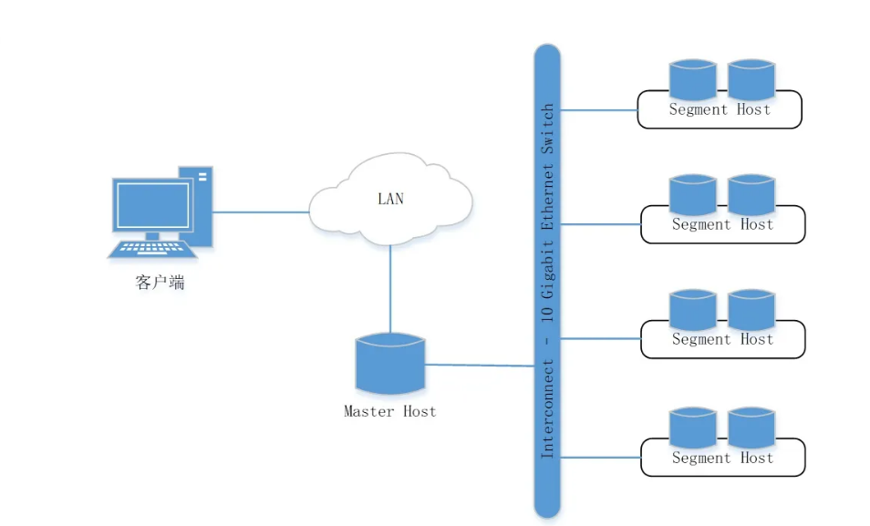
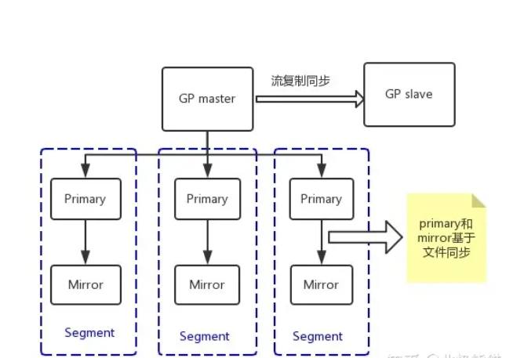
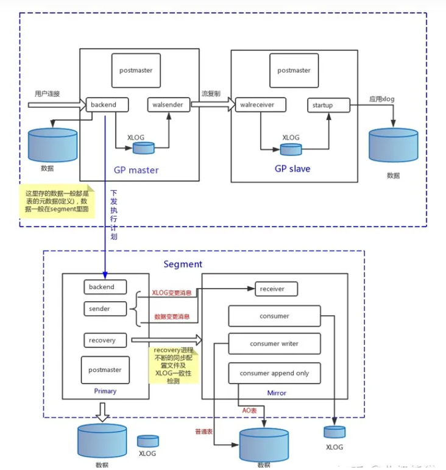
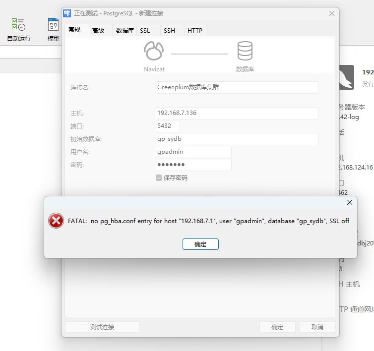
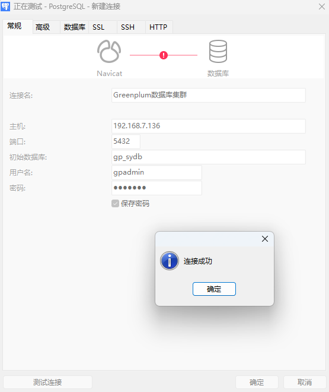

# GreenPlum集群实验室

> Author ：Heike07

[TOC]

## 整体介绍

### 链接参考

> 淘宝数据库内核月报：http://mysql.taobao.org/monthly/2016/01/02/
>
> 知乎文章：https://zhuanlan.zhihu.com/p/413663643
>
> 知乎文章2：https://zhuanlan.zhihu.com/p/630540673
>
> GP官方文档：https://gp-docs-cn.github.io/docs/admin_guide/highavail/topics/g-overview-of-high-availability-in-greenplum-database.html

### 架构以及名词解释

Greenplum是一个纯软件的MPP数据库服务器，其系统架构专门用于管理大规模分析型数据仓库或商业智能工作负载。从技术上讲，MPP无共享架构是指具有多个节点的系统，每个节点都有自己的内存、操作系统和磁盘，它们协作执行一项操作。Greenplum使用这种高性能系统架构分配PB级别的数据，并行使用系统的所有资源来处理请求。

Greenplum 6版本基于PostgreSQL 9.4开源数据库，本质上是若干面向磁盘的PostgreSQL数据库实例，共同作为一个内聚的数据库管理系统（DBMS）。大多数情况下，Greenplum在SQL支持、配置选项和最终用户功能方面与PostgreSQL非常相似。用户操作Greenplum数据库就像与常规PostgreSQL交互一样。

Greenplum与PostgreSQL的主要区别为：除了支持Postgres优化器外，还有自己的GPORCA优化器。Greenplum数据库可以使用Append-Optimized存储格式。

Greenplum支持列存储，即逻辑上组织为表的数据，物理上以面向列的格式存储数据。列存储只能与Append-Optimized表一起使用。

Greenplum对PostgreSQL的内部结构进行了修改和补充，以支持数据库的并行结构。例如，对系统目录、优化器、查询执行器和事务管理器组件做过修改和增强，能够在所有并行PostgreSQL数据库实例上同时运行查询。Greenplum依赖Interconnect（内部互连）在网络层支持不同PostgreSQL实例之间的通信，使得系统作为单一逻辑数据库运行。

较之标准PostgreSQL，Greenplum还增加了并行数据装载（外部表）、资源管理、查询优化和存储增强功能。Greenplum开发的许多功能和优化也进入了PostgreSQL社区，促进了PostgreSQL的发展。例如，表分区是Greenplum首先开发的一个特性，现在已成为标准PostgreSQL的一部分。

Greenplum顶层系统架构如图3-1所示。Master是Greenplum数据库系统的入口，是客户端连接并提交SQL语句的数据库实例。Master将其工作与系统中其他叫作Segment的数据库实例进行协调，这些数据库实例负责实际存储和处理用户数据。每个Master和Segment都是一个PostgreSQL数据库实例。



图3-1 Greenplum顶层系统架构

#### Master

Master是Greenplum的系统入口，它接收客户端连接和SQL查询，并将工作分配给Segment实例。最终用户通过Master与Greenplum数据库交互，就像与典型PostgreSQL数据库交互一样。用户可以使用诸如psql之类的客户端程序或JDBC、ODBC、libpq之类的应用程序编程接口（API）连接到数据库。

Master数据库实例中存储全局系统目录（Global System Catalog）。全局系统目录是一组系统表，其中包含关于Greenplum本身的元数据。Master实例中不包含任何用户数据，用户数据仅驻留在Segment实例中。Master验证客户端连接，处理传入的SQL命令，在Segment之间分配工作负载，协调每个Segment返回的结果，并将最终结果返给客户端程序。

Greenplum数据库使用写前日志（WAL）进行主/备Master镜像。在基于WAL的日志记录中，所有修改都会在应用之前写入日志，以确保任何进程内操作的数据完整性。

#### Segment

Greenplum的Segment实例是独立的PostgreSQL数据库，每个数据库存储一部分数据并执行一部分查询处理。当用户通过Master连接到数据库并发出查询时，将在每个Segment数据库中创建进程以处理该查询的工作。有关查询过程的更多信息，参见3.3.3节。

用户定义的表及其索引分布在所有可用的Segment中，每个Segment都包含互斥的部分数据（复制表除外，这种表会在每个Segment实例上存储一份完整的数据拷贝）。提供服务的数据库服务器进程在相应的Segment实例下运行。

Segment在称为段主机的服务器上运行。一台段主机通常运行2~8个Segment实例，具体数量取决于CPU核、内存、磁盘、网卡和工作负载。所有段主机的配置应该相同，以避免木桶效应。让Greenplum获得最佳性能的关键是将数据和负载均匀分布到多个能力相同的Segment上，以便所有Segment同时处理任务并同时完成其工作。

#### Interconnect

Interconnect即内部互连，是Greenplum数据库系统架构中的核心组件，互连指的是Segment在网络间的进程间通信。Interconnect使用标准以太网交换数据，出于性能原因，建议使用万兆网或更快的系统。

默认情况下，Interconnect使用带有流量控制的用户数据报协议（UDPIFC）进行通信，通过网络发送消息。Greenplum软件执行超出UDP提供的数据包验证，这意味着其可靠性相当于传输控制协议（TCP），性能和可扩展性超过TCP。如果将Interconnect改为TCP，Greenplum数据库的可扩展性则限制为1000个Segment实例，UDPIFC作为Interconnect的默认协议不受此限制。

Interconnect实现了对同一集群中多个PostgreSQL实例的高效协同和并行计算，承载了并行查询计划生产、查询分派（QD）、协调节点上查询执行器（QE）的并行工作、数据分布、Pipeline计算、镜像复制、健康探测等诸多任务。

本文节选自《Greenplum构建实时数据仓库实践》，内容发布获得作者和出版社授权。

知乎文章：https://zhuanlan.zhihu.com/p/413663643

GP官方文档：https://gp-docs-cn.github.io/docs/admin_guide/highavail/topics/g-overview-of-high-availability-in-greenplum-database.html

### GP总体结构

PostgreSQL 主备同步机制是通过流复制实现，其原理见之前的月报[PG主备流复制机制](http://mysql.taobao.org/monthly/2015/10/04/)。

Greenplum 是基于PostgreSQL开发的，它的主备也是通过流复制实现，但是Segment节点中的Primary和Mirror之间的数据同步是基于文件级别的同步实现的。为什么Primary和Mirror不能再使用流复制实现呢？主要有两个原因:

1. Append Only表不写WAL日志，所以Append Only表的数据就不能通过XLOG发送到Mirror再Apply；
2. pg_control等文件也是不写WAL日志，也只能通过文件方式同步到Mirror。

Greenplum 的架构采用了MPP 无共享体系。在 MPP 系统中，每个数据节点有自己的CPU、磁盘和内存(Share nothing)，每个节点内的 CPU 不能访问另一个节点的内存。节点之间的信息交互是通过节点互联网络实现的，这个过程一般称为数据重分配(Data Redistribution)。GP master负责协调整个集群 ，一个数据节点可以配置多个节点实例(Segment Instances)，节点实例并行处理查询(SQL)。

### Primary和Mirror同步机制

Primary和Mirror同步的内容主要有两部分，即文件和数据。之所以Primary和Mirror要同步文件，是Primary和Mirror之间可以自动failover，只有两者保持同步才能相互替代，如果只把数据同步过去，pg_control、pg_clog、pg_subtrans 没有同步，那么从Primary切换到Mirror会出现问题。GP master和GP slave却不用担心这些问题，Append Only 表的数据只会存在 Segment，所以WAL日志足够保持GP master和GP slave同步(只要是流复制，pg_control、pg_clog、pg_subtrans 这些文件Slave会自动更新，无需从Master同步)。



### 数据同步

当GP master向Primary下发执行计划后，Primary开始执行，如果是DML操作，那么Primary会产生XLOG及更新page。会在`SlruPhysicalWritePage`函数中(写数据页)产生FileRepOperationOpen、FileRepOperationWrite、FileRepOperationFlush、FileRepOperationClose等指令消息(消息中包含具体要更新的文件page及内容)，通过primary sender进程向Mirror发送Message，然后Mirror的mirror consumer等进程解析消息，执行变更。XLOG通过`XLogWrite`函数(写XLOG)执行同样的操作，把XLOG更新同步过去。

### 文件同步

Primary会有个recovery进程，这个进程会循环把Primary的 pg_control、pg_clog、pg_subtrans 等文件覆盖到Mirror。同时检查XLOG是否一致，如果不一致以Primary为主，对Mirror进行覆盖。除了把Primary部分文件同步到Mirror之外recovery进程还会将Mirror上面的临时文件删掉。




## 主机规划

| 主机名    | IP地址        | 节点描述     |
| --------- | ------------- | ------------ |
| Mastar-a  | 192.168.7.136 | MASTER节点   |
| Standby-a | 192.168.7.137 | STANDBY节点  |
| Segment-a | 192.168.7.138 | SEGMENT节点1 |
| Segment-b | 192.168.7.139 | SEGMENT节点2 |

## 实验准备

### 虚拟机准备

使用PXE安装 2C2G200G的4台VM虚拟机

### Selinux

手动处理selinux为disabled

### 网络变动&网络测试

停止LB-PXE主机，网卡变更为NAT模拟上网环境并新增vm7仅主机网卡用于内网连接

```powershell
# 查看外网网卡并进行开启测试
[root@Master-a ~]# nmcli connection up 5147eef6-1757-44d2-84f0-c9e780da500b
Connection successfully activated (D-Bus active path: /org/freedesktop/NetworkManager/ActiveConnection/2)
[root@Master-a ~]# nmcli connection show
NAME                UUID                                  TYPE      DEVICE 
System ens33        5147eef6-1757-44d2-84f0-c9e780da500b  ethernet  ens33  
Wired connection 1  7722ab4a-dda9-3a6b-8b54-ec8cfaa41e20  ethernet  ens36  
[root@Master-a ~]# ping www.baidu.com
PING www.a.shifen.com (39.156.66.18) 56(84) bytes of data.
64 bytes from 39.156.66.18 (39.156.66.18): icmp_seq=1 ttl=128 time=23.5 ms
64 bytes from 39.156.66.18 (39.156.66.18): icmp_seq=2 ttl=128 time=23.3 ms
^C
--- www.a.shifen.com ping statistics ---
2 packets transmitted, 2 received, 0% packet loss, time 1001ms
rtt min/avg/max/mdev = 23.361/23.439/23.517/0.078 ms
[root@Master-a ~]# nmcli connection down ens33
Error: 'ens33' is not an active connection.
Error: no active connection provided.
[root@Master-a ~]# nmcli connection down 5147eef6-1757-44d2-84f0-c9e780da500b
Connection 'System ens33' successfully deactivated (D-Bus active path: /org/freedesktop/NetworkManager/ActiveConnection/2)

# 关闭网卡模拟内网
[root@Master-a ~]# nmcli connection show
NAME                UUID                                  TYPE      DEVICE 
Wired connection 1  7722ab4a-dda9-3a6b-8b54-ec8cfaa41e20  ethernet  ens36  
System ens33        5147eef6-1757-44d2-84f0-c9e780da500b  ethernet  --     
[root@Master-a ~]# ping www.baidu.com
```

### 设置主机名

通过nmtui设置主机名

### 搭建私有YUM源

在standby-a节点上搭建apache httpd yum私有源

```powershell
# 挂载光盘
[root@Standby-a objest]# mount iso/CentOS-7-x86_64-DVD-2003.iso localyum/
mount: /dev/loop0 is write-protected, mounting read-only
[root@Standby-a objest]# cd localyum/
[root@Standby-a localyum]# ls
CentOS_BuildTag  EULA  images    LiveOS    repodata              RPM-GPG-KEY-CentOS-Testing-7
EFI              GPL   isolinux  Packages  RPM-GPG-KEY-CentOS-7  TRANS.TBL
[root@Standby-a localyum]# 

# 查看光盘本地源
[root@Standby-a yum.repos.d]# touch local.repo
[root@Standby-a yum.repos.d]# cat local.repo 
[local]
name=Local Yum
baseurl=file:///home/objest/localyum
enable=1
gpgcheck=0
[root@Standby-a yum.repos.d]# 

# 其他源临时修改后缀处理
[root@Standby-a yum.repos.d]# rename repo repotmp *
[root@Standby-a yum.repos.d]# ll
total 40
-rw-r--r--. 1 root root 1664 Apr  8  2020 CentOS-Base.repotmp
-rw-r--r--. 1 root root 1309 Apr  8  2020 CentOS-CR.repotmp
-rw-r--r--. 1 root root  649 Apr  8  2020 CentOS-Debuginfo.repotmp
-rw-r--r--. 1 root root  314 Apr  8  2020 CentOS-fasttrack.repotmp
-rw-r--r--. 1 root root  630 Apr  8  2020 CentOS-Media.repotmp
-rw-r--r--. 1 root root 1331 Apr  8  2020 CentOS-Sources.repotmp
-rw-r--r--. 1 root root 7577 Apr  8  2020 CentOS-Vault.repotmp
-rw-r--r--. 1 root root  616 Apr  8  2020 CentOS-x86_64-kernel.repotmp
-rw-r--r--  1 root root   80 Jun  4 22:44 local.repotmp

# 设置光盘源
[root@Standby-a yum.repos.d]# mv local.repotmp local.repo


[root@Standby-a yum.repos.d]# 
# 安装httpd
[root@Standby-a yum.repos.d]# yum install -y httpd
[root@Standby-a yum.repos.d]# systemctl start httpd

# 光盘文件复制
[root@Standby-a html]# cp -ra /home/objest/localyum .
[root@Standby-a html]# 
[root@Standby-a html]# pwd

# 设置http-repo源
[root@Standby-a yum.repos.d]# cp local.repo localhttp.repo
[root@Standby-a yum.repos.d]# vim local
[root@Standby-a yum.repos.d]# vim localhttp.repo 
[root@Standby-a yum.repos.d]# 

# 更新yum源缓存
[root@Standby-a yum.repos.d]# yum makecache
```

### 卸载光盘删除文件设置HTTPD服务自启

init 6 重启机器后删除文件

```powershell
# 删除光盘local相关文件
[root@Standby-a ~]# cd /home/objest/
[root@Standby-a objest]# ls
iso  localyum
[root@Standby-a objest]# rm -rf localyum/
[root@Standby-a objest]# rm -rf iso/
[root@Standby-a objest]#

# 设置httpd服务开机启动
[root@Standby-a yum.repos.d]# systemctl enable httpd --now
[root@Standby-a yum.repos.d]# yum clean all
Loaded plugins: fastestmirror
Cleaning repos: localhttp
Cleaning up list of fastest mirrors
Other repos take up 51 M of disk space (use --verbose for details)
[root@Standby-a yum.repos.d]# yum makecache

# 清理YUM源
[root@Standby-a yum.repos.d]# yum clean all
Loaded plugins: fastestmirror
Cleaning repos: localhttp
Cleaning up list of fastest mirrors
Other repos take up 51 M of disk space (use --verbose for details)

# 更新YUM源
[root@Standby-a yum.repos.d]# yum makecache
```

### 设置hosts并复制其他节点HTTP-YUM源

```powershell
# 设置hosts文件
[root@Standby-a yum.repos.d]# cat /etc/hosts
127.0.0.1   localhost localhost.localdomain localhost4 localhost4.localdomain4
::1         localhost localhost.localdomain localhost6 localhost6.localdomain6
[root@Standby-a yum.repos.d]# 
[root@Standby-a yum.repos.d]# 
[root@Standby-a yum.repos.d]# 
[root@Standby-a yum.repos.d]# 
[root@Standby-a yum.repos.d]# cat << EOF >> /etc/hosts
> 192.168.7.136  Master-a
> 192.168.7.137  Standby-a
> 192.168.7.138  Segment-a
> 192.168.7.139  Segment-b
> EOF
[root@Standby-a yum.repos.d]# cat /etc/hosts
127.0.0.1   localhost localhost.localdomain localhost4 localhost4.localdomain4
::1         localhost localhost.localdomain localhost6 localhost6.localdomain6
192.168.7.136  Master-a
192.168.7.137  Standby-a
192.168.7.138  Segment-a
192.168.7.139  Segment-b
[root@Standby-a yum.repos.d]#

# 复制到其他节点hosts文件
[root@Standby-a yum.repos.d]# scp /etc/hosts Master-a:/etc/hosts
The authenticity of host 'master-a (192.168.7.136)' can't be established.
ECDSA key fingerprint is SHA256:ICELL8DOaZ7rN9rWXoqyfr5pz+bw523/FwwHjsi66QM.
ECDSA key fingerprint is MD5:06:6a:e0:62:f0:df:8a:be:2a:3e:95:51:05:f5:bd:da.
Are you sure you want to continue connecting (yes/no)? yes
Warning: Permanently added 'master-a,192.168.7.136' (ECDSA) to the list of known hosts.
root@master-a's password: 
hosts                                                                                                                                   100%  257   614.0KB/s   00:00    
[root@Standby-a yum.repos.d]# scp /etc/hosts Segment-a:/etc/hosts
The authenticity of host 'segment-a (192.168.7.138)' can't be established.
ECDSA key fingerprint is SHA256:sTgeZrp9dUXMX/wO2qbJKvFurTOqBSbqOWYsoMK2Z1s.
ECDSA key fingerprint is MD5:06:b9:1a:65:b3:12:d8:be:f2:e6:f1:5c:e0:9e:2b:6c.
Are you sure you want to continue connecting (yes/no)? yes
Warning: Permanently added 'segment-a,192.168.7.138' (ECDSA) to the list of known hosts.
root@segment-a's password: 
hosts                                                                                                                                   100%  257    78.6KB/s   00:00    
[root@Standby-a yum.repos.d]# scp /etc/hosts Segment-b:/etc/hosts
The authenticity of host 'segment-b (192.168.7.139)' can't be established.
ECDSA key fingerprint is SHA256:UNVqysnB3DIdtF5W35IlvIHRN6ZpVB61fu5HjWP/HbM.
ECDSA key fingerprint is MD5:ba:14:8a:f9:36:bc:24:4b:7b:81:51:1a:73:8d:52:d8.
Are you sure you want to continue connecting (yes/no)? yes
Warning: Permanently added 'segment-b,192.168.7.139' (ECDSA) to the list of known hosts.
root@segment-b's password: 
hosts                                                                                                                                   100%  257   179.7KB/s   00:00    
[root@Standby-a yum.repos.d]#

# 查看hosts文件是否正常 -看一个就行了
[root@Standby-a yum.repos.d]# ssh Master-a "cat /etc/hosts"
root@master-a's password: 
Permission denied, please try again.
root@master-a's password: 
127.0.0.1   localhost localhost.localdomain localhost4 localhost4.localdomain4
::1         localhost localhost.localdomain localhost6 localhost6.localdomain6
192.168.7.136  Master-a
192.168.7.137  Standby-a
192.168.7.138  Segment-a
192.168.7.139  Segment-b
[root@Standby-a yum.repos.d]#

# 同步修改其他机器的yum源配置
[root@Standby-a yum.repos.d]# ssh Master-a "cd /etc/yum.repos.d ; rename repo repotmp * ; ls"
root@master-a's password: 
CentOS-Base.repotmp
CentOS-CR.repotmp
CentOS-Debuginfo.repotmp
CentOS-fasttrack.repotmp
CentOS-Media.repotmp
CentOS-Sources.repotmp
CentOS-Vault.repotmp
CentOS-x86_64-kernel.repotmp
[root@Standby-a yum.repos.d]# ssh Segment-a "cd /etc/yum.repos.d ; rename repo repotmp * ; ls"
root@segment-a's password: 
CentOS-Base.repotmp
CentOS-CR.repotmp
CentOS-Debuginfo.repotmp
CentOS-fasttrack.repotmp
CentOS-Media.repotmp
CentOS-Sources.repotmp
CentOS-Vault.repotmp
CentOS-x86_64-kernel.repotmp
[root@Standby-a yum.repos.d]# ssh Segment-b "cd /etc/yum.repos.d ; rename repo repotmp * ; ls"
root@segment-b's password: 
CentOS-Base.repotmp
CentOS-CR.repotmp
CentOS-Debuginfo.repotmp
CentOS-fasttrack.repotmp
CentOS-Media.repotmp
CentOS-Sources.repotmp
CentOS-Vault.repotmp
CentOS-x86_64-kernel.repotmp
[root@Standby-a yum.repos.d]# 

# 复制HTTP源配置
[root@Standby-a yum.repos.d]# scp /etc/yum.repos.d/localhttp.repo Master-a:/etc/yum.repos.d/localhttp.repo
root@master-a's password: 
localhttp.repo                                                                                                                          100%   90   162.7KB/s   00:00    
[root@Standby-a yum.repos.d]# scp /etc/yum.repos.d/localhttp.repo Segment-a:/etc/yum.repos.d/localhttp.repo
root@segment-a's password: 
Permission denied, please try again.
root@segment-a's password: 
localhttp.repo                                                                                                                          100%   90    51.5KB/s   00:00    
[root@Standby-a yum.repos.d]# scp /etc/yum.repos.d/localhttp.repo Segment-b:/etc/yum.repos.d/localhttp.repo
root@segment-b's password: 
localhttp.repo                                                                                                                          100%   90   135.0KB/s   00:00    
[root@Standby-a yum.repos.d]#

# 防火墙开放80端口
[root@Standby-a yum.repos.d]# firewall-cmd --list-all
public (active)
  target: default
  icmp-block-inversion: no
  interfaces: ens36
  sources: 
  services: dhcpv6-client ssh
  ports: 
  protocols: 
  masquerade: no
  forward-ports: 
  source-ports: 
  icmp-blocks: 
  rich rules: 

[root@Standby-a yum.repos.d]# firewall-cmd --permanent --zone=public --add-service=http
success
[root@Standby-a yum.repos.d]# firewall-cmd --reload
success
[root@Standby-a yum.repos.d]# firewall-cmd --list-all
public (active)
  target: default
  icmp-block-inversion: no
  interfaces: ens36
  sources: 
  services: dhcpv6-client http ssh
  ports: 
  protocols: 
  masquerade: no
  forward-ports: 
  source-ports: 
  icmp-blocks: 
  rich rules: 

[root@Standby-a yum.repos.d]# 

# 更新YUM源其他节点
[root@Standby-a yum.repos.d]# ssh Master-a "yum clean all ; yum makecache"
root@master-a's password: 
Loaded plugins: fastestmirror
Cleaning repos: localhttp
Cleaning up list of fastest mirrors
Loaded plugins: fastestmirror
Determining fastest mirrors
Metadata Cache Created
[root@Standby-a yum.repos.d]# ssh Segment-a "yum clean all ; yum makecache"
root@segment-a's password: 
Loaded plugins: fastestmirror
Cleaning repos: localhttp
Loaded plugins: fastestmirror
Determining fastest mirrors
Metadata Cache Created
[root@Standby-a yum.repos.d]# ssh Segment-b "yum clean all ; yum makecache"
root@segment-b's password: 
Loaded plugins: fastestmirror
Cleaning repos: localhttp
Loaded plugins: fastestmirror
Determining fastest mirrors
Metadata Cache Created
[root@Standby-a yum.repos.d]# 
```

## 实验一：搭建3节点一个Master和2个Segment不含Mirror镜像的集群

### 安装所需依赖

@ M S-a S-b 执行

```powershell
# 安装依赖
yum install vim net-tools psmisc nc rsync lrzsz ntp libzstd openssl-static tree iotop git

yum install apr apr-util bash bzip2 curl krb5 libcurl libevent libxml2 libyaml zlib openldap openssh-client openssl openssl-libs perl readline rsync R sed tar zip krb5-devel
```

### 系统配置参数计算

@ M S-a S-b 执行

```powershell
# 计算共享内存  - M为例 其他同理
# KERNEL.SHMALL
[root@Master-a /]# echo $(expr $(getconf _PHYS_PAGES) / 2)
232879

# KERNEL.SHMMAX
[root@Master-a /]# echo $(expr $(getconf _PHYS_PAGES) / 2 \* $(getconf PAGE_SIZE))
953872384
[root@Master-a /]# free 
              total        used        free      shared  buff/cache   available
Mem:        1863036      192080     1245768        9780      425188     1510488
Swap:       2097148           0     2097148
[root@Master-a /]#

# 根据计算结果设置参数
[root@Master-a /]# vim /etc/sysctl.conf 
[root@Master-a /]# sysctl -p
kernel.shmall = 232879
kernel.shmmax = 953872384
kernel.shmmni = 4096
vm.overcommit_memory = 2
vm.overcommit_ratio = 95
net.ipv4.ip_local_port_range = 10000 65535
kernel.sysrq = 1
kernel.core_uses_pid = 1
kernel.msgmnb = 65536
kernel.msgmax = 65536
kernel.msgmni = 2048
net.ipv4.tcp_syncookies = 1
net.ipv4.conf.default.accept_source_route = 0
net.ipv4.tcp_max_syn_backlog = 4096
net.ipv4.conf.all.arp_filter = 1
net.core.netdev_max_backlog = 10000
net.core.rmem_max = 2097152
net.core.wmem_max = 2097152
vm.swappiness = 10
vm.zone_reclaim_mode = 0
vm.dirty_expire_centisecs = 500
vm.dirty_writeback_centisecs = 100
vm.dirty_background_ratio = 3
vm.dirty_ratio = 10
[root@Master-a /]#
```

参数解释 -由Gpt4.0(128K)提供

```sql
好的，这些参数大致可以分为处理内存、网络和内核消息的参数。下面是它们的详细解释：
kernel.shmall：在系统范围内设定共享内存的最大总量（以页为单位）。当创建共享内存段时，系统将它和这个值进行比较。
kernel.shmmax：系统中单个共享内存段的最大大小（以字节为单位）。这个参数也会影响到共享内存的创建。
kernel.shmmni：系统范围内共享内存段的最大数量。
vm.overcommit_memory 和 vm.overcommit_ratio：这些设置决定了系统对内存超量分配的策略。
net.ipv4.ip_local_port_range：这个值设定了TCP和UDP协议能使用的本地端口范围。
kernel.sysrq：延长系统请求的功能，如重新启动、关机、内存转储等。
kernel.core_uses_pid：当启用后，程序跳出核心文件时会在文件名中包含进程ID。
kernel.msgmnb，kernel.msgmax，kernel.msgmni：这些参数调整IPC消息队列的大小和数量。
net.ipv4.tcp_syncookies：当启用时，防止了TCP SYN洪水攻击，但在某些情况下可能会影响正常的TCP链接。
net.ipv4.conf.default.accept_source_route 和 net.ipv4.conf.all.arp_filter：IP选项和ARP协议的处理。
net.ipv4.tcp_max_syn_backlog：为尚未获得对方确认的连接请求设置最大排队数量。
net.core.netdev_max_backlog：接收数据包的最大速率。
net.core.rmem_max 和 net.core.wmem_max：设定网络连接的最大内存缓冲区大小。
vm.swappiness：影响内核交换内存页面的相对权重。
vm.zone_reclaim_mode：设置本地节点内存回收策略。
vm.dirty_expire_centisecs，vm.dirty_writeback_centisecs，vm.dirty_background_ratio，vm.dirty_ratio：调整系统何时对“脏”内存页面进行写回。
以上是对每个参数的简短解释，每个参数的设定都会对系统性能产生影响，需要根据具体的系统环境和应用需求进行设置。
```

### 修改Limits限制

@ M S-a S-b 执行

```powershell
# 修改系统配额 M例
[root@Master-a /]# vim /etc/security/limits.d/20-nproc.conf 
[root@Master-a /]# cat /etc/security/limits.d/20-nproc.conf 
# Default limit for number of user's processes to prevent
# accidental fork bombs.
# See rhbz #432903 for reasoning.

*          soft    nproc     4096
root       soft    nproc     unlimited

# GreenplumDB
*    soft    nofile    65536
*    hard    nofile    65536
*    soft    nproc     131072
*    hard    nproc     131072
[root@Master-a /]#
[root@Master-a /]# vim /etc/security/limits.conf 
[root@Master-a /]# tail /etc/security/limits.conf 
#ftp             hard    nproc           0
#@student        -       maxlogins       4

# End of file

# GreenplumDB
*    soft    nofile    65536
*    hard    nofile    65536
*    soft    nproc     131072
*    hard    nproc     131072
[root@Master-a /]#
```

### 修改SSHD服务相关配置

@ M S-a S-b 执行

```powershell
# 修改SSH相关参数 M例
[root@Master-a /]# vim /etc/ssh/sshd_config 
[root@Master-a /]# cat /etc/ssh/sshd_config |grep ^Max
MaxSessions 200
MaxStartups 10:30:1000
[root@Master-a /]#

# 确认字符集 M例
[root@Master-a /]# echo $LANG
en_US.UTF-8
[root@Master-a /]#
```

### 连接网络同步时间

@ M S-a S-b 执行

```powershell
# 连接网络 - 如果本地有NTP服务器或受时服务器请忽略此步
[root@Master-a /]# date
Thu Jun  6 14:21:21 CST 2024
[root@Master-a /]# nmcli connection show
NAME                UUID                                  TYPE      DEVICE 
Wired connection 1  7722ab4a-dda9-3a6b-8b54-ec8cfaa41e20  ethernet  ens36  
System ens33        5147eef6-1757-44d2-84f0-c9e780da500b  ethernet  --     
[root@Master-a /]# nmcli connection up 5147eef6-1757-44d2-84f0-c9e780da500b
Connection successfully activated (D-Bus active path: /org/freedesktop/NetworkManager/ActiveConnection/3)
[root@Master-a /]# ping www.baidu.com
PING www.a.shifen.com (39.156.66.14) 56(84) bytes of data.
64 bytes from 39.156.66.14 (39.156.66.14): icmp_seq=1 ttl=128 time=23.7 ms
^C
--- www.a.shifen.com ping statistics ---
1 packets transmitted, 1 received, 0% packet loss, time 0ms
rtt min/avg/max/mdev = 23.718/23.718/23.718/0.000 ms
[root@Master-a /]# ntpdate cn.pool.ntp.org
 6 Jun 14:35:02 ntpdate[125115]: adjust time server 84.16.73.33 offset -0.031644 sec
[root@Master-a /]# date
Thu Jun  6 14:35:08 CST 2024
[root@Master-a /]#

# 关闭网络 - 模拟内网环境
[root@Master-a /]# nmcli connection show
NAME                UUID                                  TYPE      DEVICE 
System ens33        5147eef6-1757-44d2-84f0-c9e780da500b  ethernet  ens33  
Wired connection 1  7722ab4a-dda9-3a6b-8b54-ec8cfaa41e20  ethernet  ens36  
[root@Master-a /]# nmcli connection down 5147eef6-1757-44d2-84f0-c9e780da500b
Connection 'System ens33' successfully deactivated (D-Bus active path: /org/freedesktop/NetworkManager/ActiveConnection/3)
[root@Master-a /]# ping www.baidu.com
^C
[root@Master-a /]#
```

### 设置用户以及用户组

@ M S-a S-b 执行

```powershell
# 创建用户以及用户组 M为例 密码：gpadmin
[root@Master-a /]# groupadd gpadmin
[root@Master-a /]# useradd gpadmin -r -m -g gpadmin
[root@Master-a /]# id gpadmin
uid=997(gpadmin) gid=1000(gpadmin) groups=1000(gpadmin)
[root@Master-a /]# passwd gpadmin
Changing password for user gpadmin.
New password: 
BAD PASSWORD: The password is shorter than 8 characters
Retype new password: 
passwd: all authentication tokens updated successfully.
[root@Master-a /]#
```

### 设置gpadmin用户免密登录

@ M S-a S-b 执行

```powershell
# 免密要求 -对自己免密 and 对其他节点免密
# M为例
[root@Master-a /]# su - gpadmin
[gpadmin@Master-a ~]$ ssh-keygen -t rsa
Generating public/private rsa key pair.
Enter file in which to save the key (/home/gpadmin/.ssh/id_rsa): 
Created directory '/home/gpadmin/.ssh'.
Enter passphrase (empty for no passphrase): 
Enter same passphrase again: 
Your identification has been saved in /home/gpadmin/.ssh/id_rsa.
Your public key has been saved in /home/gpadmin/.ssh/id_rsa.pub.
The key fingerprint is:
SHA256:InJne3EKn4p82ZLwLtBZBE0sAUp8bD122L4jH03c2H8 gpadmin@Master-a
The key's randomart image is:
+---[RSA 2048]----+
|..o.+*+          |
|.o +.=+o         |
|. o .o+ . +      |
|      .. + o     |
|  ..oo= S . .    |
|  .o+= O *   . E |
|   . o++B     .  |
|   ...*+.        |
|    o+o.         |
+----[SHA256]-----+
[gpadmin@Master-a ~]$ ssh-copy-id Master-a
/bin/ssh-copy-id: INFO: Source of key(s) to be installed: "/home/gpadmin/.ssh/id_rsa.pub"
The authenticity of host 'master-a (192.168.7.136)' can't be established.
ECDSA key fingerprint is SHA256:ICELL8DOaZ7rN9rWXoqyfr5pz+bw523/FwwHjsi66QM.
ECDSA key fingerprint is MD5:06:6a:e0:62:f0:df:8a:be:2a:3e:95:51:05:f5:bd:da.
Are you sure you want to continue connecting (yes/no)? yes
/bin/ssh-copy-id: INFO: attempting to log in with the new key(s), to filter out any that are already installed
/bin/ssh-copy-id: INFO: 1 key(s) remain to be installed -- if you are prompted now it is to install the new keys
gpadmin@master-a's password: 
Permission denied, please try again.
gpadmin@master-a's password: 

Number of key(s) added: 1

Now try logging into the machine, with:   "ssh 'Master-a'"
and check to make sure that only the key(s) you wanted were added.

[gpadmin@Master-a ~]$ ssh 'Master-a'
Last failed login: Thu Jun  6 14:51:34 CST 2024 from master-a on ssh:notty
There was 1 failed login attempt since the last successful login.
Last login: Thu Jun  6 14:50:38 2024
[gpadmin@Master-a ~]$ exit
logout
Connection to master-a closed.
[gpadmin@Master-a ~]$ ssh-copy-id Segment-a
/bin/ssh-copy-id: INFO: Source of key(s) to be installed: "/home/gpadmin/.ssh/id_rsa.pub"
The authenticity of host 'segment-a (192.168.7.138)' can't be established.
ECDSA key fingerprint is SHA256:sTgeZrp9dUXMX/wO2qbJKvFurTOqBSbqOWYsoMK2Z1s.
ECDSA key fingerprint is MD5:06:b9:1a:65:b3:12:d8:be:f2:e6:f1:5c:e0:9e:2b:6c.
Are you sure you want to continue connecting (yes/no)? yes
/bin/ssh-copy-id: INFO: attempting to log in with the new key(s), to filter out any that are already installed
/bin/ssh-copy-id: INFO: 1 key(s) remain to be installed -- if you are prompted now it is to install the new keys
gpadmin@segment-a's password: 
Permission denied, please try again.
gpadmin@segment-a's password: 

Number of key(s) added: 1

Now try logging into the machine, with:   "ssh 'Segment-a'"
and check to make sure that only the key(s) you wanted were added.

[gpadmin@Master-a ~]$ ssh 'Segment-a'
Last failed login: Thu Jun  6 14:52:21 CST 2024 from master-a on ssh:notty
There was 1 failed login attempt since the last successful login.
[gpadmin@Segment-a ~]$ exit
logout
Connection to segment-a closed.
[gpadmin@Master-a ~]$ ssh-copy-id Segment-b
/bin/ssh-copy-id: INFO: Source of key(s) to be installed: "/home/gpadmin/.ssh/id_rsa.pub"
The authenticity of host 'segment-b (192.168.7.139)' can't be established.
ECDSA key fingerprint is SHA256:UNVqysnB3DIdtF5W35IlvIHRN6ZpVB61fu5HjWP/HbM.
ECDSA key fingerprint is MD5:ba:14:8a:f9:36:bc:24:4b:7b:81:51:1a:73:8d:52:d8.
Are you sure you want to continue connecting (yes/no)? yes
/bin/ssh-copy-id: INFO: attempting to log in with the new key(s), to filter out any that are already installed
/bin/ssh-copy-id: INFO: 1 key(s) remain to be installed -- if you are prompted now it is to install the new keys
gpadmin@segment-b's password: 

Number of key(s) added: 1

Now try logging into the machine, with:   "ssh 'Segment-b'"
and check to make sure that only the key(s) you wanted were added.

[gpadmin@Master-a ~]$ ssh 'Segment-b'
[gpadmin@Segment-b ~]$ exit
logout
Connection to segment-b closed.
[gpadmin@Master-a ~]$
```

### Greenplum数据库安装

@ M S-a S-b 执行

```powershell
# 上传RPM包到预订位置 M例
[gpadmin@Master-a opt]$ cd /home/gpadmin/
[gpadmin@Master-a ~]$ mkdir soft
[gpadmin@Master-a ~]$ cd soft/
[gpadmin@Master-a soft]$ ll
total 67712
-rw-r--r-- 1 root root 69333396 Jun  6 15:00 greenplum-db-6.13.0-rhel7-x86_64.rpm
[gpadmin@Master-a soft]$ su -
Password: 
Last login: Tue Jun  4 21:35:39 CST 2024 from 192.168.7.1 on pts/0
Last failed login: Wed Jun  5 16:09:13 CST 2024 from standby-a on ssh:notty
There were 3 failed login attempts since the last successful login.
[root@Master-a ~]# cd /home/gpadmin/soft/
[root@Master-a soft]# ls
greenplum-db-6.13.0-rhel7-x86_64.rpm
[root@Master-a soft]#

# 安装数据库 - 如果依赖安装OK这里不会有相关依赖提示
[root@Master-a soft]# yum install ./greenplum-db-6.13.0-rhel7-x86_64.rpm 
Loaded plugins: fastestmirror
Examining ./greenplum-db-6.13.0-rhel7-x86_64.rpm: greenplum-db-6-6.13.0-1.el7.x86_64
Marking ./greenplum-db-6.13.0-rhel7-x86_64.rpm to be installed
Resolving Dependencies
--> Running transaction check
---> Package greenplum-db-6.x86_64 0:6.13.0-1.el7 will be installed
--> Finished Dependency Resolution

Dependencies Resolved

================================================================================================================================
 Package                     Arch                Version                   Repository                                      Size
================================================================================================================================
Installing:
 greenplum-db-6              x86_64              6.13.0-1.el7              /greenplum-db-6.13.0-rhel7-x86_64              311 M

Transaction Summary
================================================================================================================================
Install  1 Package

Total size: 311 M
Installed size: 311 M
Is this ok [y/d/N]: y
Downloading packages:
Running transaction check
Running transaction test
Transaction test succeeded
Running transaction
  Installing : greenplum-db-6-6.13.0-1.el7.x86_64                                                                           1/1 
  Verifying  : greenplum-db-6-6.13.0-1.el7.x86_64                                                                           1/1 

Installed:
  greenplum-db-6.x86_64 0:6.13.0-1.el7                                                                                          

Complete!
[root@Master-a soft]#

# 查看安装结果并授权
[root@Master-a soft]# cd /usr/local/
[root@Master-a local]# ll
total 0
drwxr-xr-x.  2 root root   6 Apr 11  2018 bin
drwxr-xr-x.  2 root root   6 Apr 11  2018 etc
drwxr-xr-x.  2 root root   6 Apr 11  2018 games
lrwxrwxrwx   1 root root  30 Jun  6 15:02 greenplum-db -> /usr/local/greenplum-db-6.13.0
drwxr-xr-x  11 root root 238 Jun  6 15:02 greenplum-db-6.13.0
drwxr-xr-x.  2 root root   6 Apr 11  2018 include
drwxr-xr-x.  2 root root   6 Apr 11  2018 lib
drwxr-xr-x.  2 root root   6 Apr 11  2018 lib64
drwxr-xr-x.  2 root root   6 Apr 11  2018 libexec
drwxr-xr-x.  2 root root   6 Apr 11  2018 sbin
drwxr-xr-x.  5 root root  49 Jun  4 18:29 share
drwxr-xr-x.  2 root root   6 Apr 11  2018 src
[root@Master-a local]# chown -R gpadmin:gpadmin greenplum-db*
[root@Master-a local]# ll
total 0
drwxr-xr-x.  2 root    root      6 Apr 11  2018 bin
drwxr-xr-x.  2 root    root      6 Apr 11  2018 etc
drwxr-xr-x.  2 root    root      6 Apr 11  2018 games
lrwxrwxrwx   1 gpadmin gpadmin  30 Jun  6 15:02 greenplum-db -> /usr/local/greenplum-db-6.13.0
drwxr-xr-x  11 gpadmin gpadmin 238 Jun  6 15:02 greenplum-db-6.13.0
drwxr-xr-x.  2 root    root      6 Apr 11  2018 include
drwxr-xr-x.  2 root    root      6 Apr 11  2018 lib
drwxr-xr-x.  2 root    root      6 Apr 11  2018 lib64
drwxr-xr-x.  2 root    root      6 Apr 11  2018 libexec
drwxr-xr-x.  2 root    root      6 Apr 11  2018 sbin
drwxr-xr-x.  5 root    root     49 Jun  4 18:29 share
drwxr-xr-x.  2 root    root      6 Apr 11  2018 src
[root@Master-a local]#
```

### 初始化前环境变量设置

@ M

```powershell
# 数据库初始化前环境变量设置 -仅在Master节点操作
# 设置实验一节点所需资源
[root@Master-a local]# su - gpadmin
Last login: Thu Jun  6 14:51:57 CST 2024 from master-a on pts/1
[gpadmin@Master-a ~]$ ls
soft
[gpadmin@Master-a ~]$ mkdir conf
[gpadmin@Master-a ~]$ ll
total 0
drwxrwxr-x 2 gpadmin gpadmin  6 Jun  6 15:12 conf
drwxrwxr-x 2 gpadmin gpadmin 50 Jun  6 15:00 soft
[gpadmin@Master-a ~]$ cd conf/
[gpadmin@Master-a conf]$ touch hostlist
[gpadmin@Master-a conf]$ touch seg_hosts
[gpadmin@Master-a conf]$ cat << EOF >> hostlist 
> Master-a
> Segment-a
> Segment-b
> EOF
[gpadmin@Master-a conf]$ cat << EOF >> seg_hosts 
> Segment-a
> Segment-b
> EOF
[gpadmin@Master-a conf]$ cat hostlist 
Master-a
Segment-a
Segment-b
[gpadmin@Master-a conf]$ cat seg_hosts 
Segment-a
Segment-b
[gpadmin@Master-a conf]$

# 环境变量引入 - 测试连通性
[gpadmin@Master-a conf]$ source /usr/local/greenplum-db-6.13.0/greenplum_path.sh
[gpadmin@Master-a conf]$ gpssh-exkeys -f hostlist 
[STEP 1 of 5] create local ID and authorize on local host
  ... /home/gpadmin/.ssh/id_rsa file exists ... key generation skipped

[STEP 2 of 5] keyscan all hosts and update known_hosts file

[STEP 3 of 5] retrieving credentials from remote hosts
  ... send to Segment-a
  ... send to Segment-b

[STEP 4 of 5] determine common authentication file content

[STEP 5 of 5] copy authentication files to all remote hosts
  ... finished key exchange with Segment-a
  ... finished key exchange with Segment-b

[INFO] completed successfully
[gpadmin@Master-a conf]$
```

### 创建数据目录

@ M

```powershell
# 创建数据目录-仅在Master节点操作
[gpadmin@Master-a conf]$ mkdir -p /home/gpadmin/data/master
[gpadmin@Master-a conf]$ cd ~

# 创建用户环境变量
[gpadmin@Master-a ~]$ vim .bashrc
[gpadmin@Master-a ~]$ cat .bashrc 
# .bashrc

# Source global definitions
if [ -f /etc/bashrc ]; then
        . /etc/bashrc
fi

# Uncomment the following line if you don't like systemctl's auto-paging feature:
# export SYSTEMD_PAGER=

# User specific aliases and functions

source /usr/local/greenplum-db/greenplum_path.sh
export PGPORT=5432
export PGUSER=gpadmin
export MASTER_DATA_DIRECTORY=/home/gpadmin/data/master/gpseg-1
export PGDATABASE=gp_sydb
export LD_PRELOAD=/lib64/libz.so.1 ps
[gpadmin@Master-a ~]$

# 在bash脚本中增加环境变量路径
[gpadmin@Master-a ~]$ vim /usr/local/greenplum-db/greenplum_path.sh
[gpadmin@Master-a ~]$ cat /usr/local/greenplum-db/greenplum_path.sh | grep GPHOME=/
GPHOME=/usr/local/greenplum-db
[gpadmin@Master-a ~]$

# 创建数据文件夹 - 通过免密工具
[gpadmin@Master-a ~]$ gpssh -f /home/gpadmin/conf/hostlist
=> ls
[ Master-a] conf  data  soft
[Segment-a] soft
[Segment-b] soft
=> mkdir data
[ Master-a] mkdir: cannot create directory ‘data’: File exists
[Segment-a]
[Segment-b]
=> ls
[ Master-a] conf  data  soft
[Segment-a] data  soft
[Segment-b] data  soft
=> cd data
[ Master-a]
[Segment-a]
[Segment-b]
=> mkdir master
[ Master-a] mkdir: cannot create directory ‘master’: File exists
[Segment-a]
[Segment-b]
=> mkdir primary
[ Master-a]
[Segment-a]
[Segment-b]
=> mkdir mirror
[ Master-a]
[Segment-a]
[Segment-b]
=> ls
[ Master-a] master      mirror  primary
[Segment-a] master      mirror  primary
[Segment-b] master      mirror  primary
=> pwd
[ Master-a] /home/gpadmin/data
[Segment-a] /home/gpadmin/data
[Segment-b] /home/gpadmin/data
=> exit

[gpadmin@Master-a ~]$
```

### 测试服务器IO,网络模拟性能

@ M

```powershell
# 检查防火墙 -M为例
[root@Master-a local]# systemctl stop firewalld
[root@Master-a local]# systemctl disable firewalld
Removed symlink /etc/systemd/system/multi-user.target.wants/firewalld.service.
Removed symlink /etc/systemd/system/dbus-org.fedoraproject.FirewallD1.service.
[root@Master-a local]# systemctl status firewalld
● firewalld.service - firewalld - dynamic firewall daemon
   Loaded: loaded (/usr/lib/systemd/system/firewalld.service; disabled; vendor preset: enabled)
   Active: inactive (dead)
     Docs: man:firewalld(1)

Jun 04 21:29:23 localhost.localdomain systemd[1]: Starting firewalld - dynamic firewall daemon...
Jun 04 21:29:23 localhost.localdomain systemd[1]: Started firewalld - dynamic firewall daemon.
Jun 06 15:29:27 Master-a systemd[1]: Stopping firewalld - dynamic firewall daemon...
Jun 06 15:29:28 Master-a systemd[1]: Stopped firewalld - dynamic firewall daemon.
[root@Master-a local]#

# 测试IO,网络
[root@Master-a local]# su - gpadmin
Last login: Thu Jun  6 15:25:35 CST 2024 from master-a on pts/4
[gpadmin@Master-a ~]$ gpcheckperf -f /home/gpadmin/conf/hostlist -r N -d /tmp
/usr/local/greenplum-db/bin/gpcheckperf -f /home/gpadmin/conf/hostlist -r N -d /tmp

-------------------
--  NETPERF TEST
-------------------
NOTICE: -t is deprecated, and has no effect
NOTICE: -f is deprecated, and has no effect
NOTICE: -t is deprecated, and has no effect
NOTICE: -f is deprecated, and has no effect
NOTICE: -t is deprecated, and has no effect
NOTICE: -f is deprecated, and has no effect
NOTICE: -t is deprecated, and has no effect
NOTICE: -f is deprecated, and has no effect

====================
==  RESULT 2024-06-06T15:32:30.148161
====================
Netperf bisection bandwidth test
Master-a -> Segment-a = 496.510000
Segment-b -> Master-a = 433.330000
Segment-a -> Master-a = 421.970000
Master-a -> Segment-b = 566.860000

Summary:
sum = 1918.67 MB/sec
min = 421.97 MB/sec
max = 566.86 MB/sec
avg = 479.67 MB/sec
median = 496.51 MB/sec

[Warning] connection between Master-a and Segment-a is no good
[Warning] connection between Segment-b and Master-a is no good
[Warning] connection between Segment-a and Master-a is no good
[gpadmin@Master-a ~]$

# 调整SSHD DNS -M为例
[root@Master-a local]# vim /etc/ssh/sshd_config 
[root@Master-a local]# 
[root@Master-a local]# cat /etc/ssh/sshd_config |grep DNS
UseDNS no
[root@Master-a local]# systemctl restart sshd
[root@Master-a local]#

# 再次测试IO,网络
- 因为是实验环境所用同一个固态 所以直接测Segment节点去掉Master节点
[gpadmin@Master-a ~]$ gpcheckperf -f /home/gpadmin/conf/seg_hosts -r N -d /tmp
/usr/local/greenplum-db/bin/gpcheckperf -f /home/gpadmin/conf/seg_hosts -r N -d /tmp

-------------------
--  NETPERF TEST
-------------------
NOTICE: -t is deprecated, and has no effect
NOTICE: -f is deprecated, and has no effect
NOTICE: -t is deprecated, and has no effect
NOTICE: -f is deprecated, and has no effect

====================
==  RESULT 2024-06-06T15:46:58.245101
====================
Netperf bisection bandwidth test
Segment-a -> Segment-b = 962.680000
Segment-b -> Segment-a = 911.570000

Summary:
sum = 1874.25 MB/sec
min = 911.57 MB/sec
max = 962.68 MB/sec
avg = 937.12 MB/sec
median = 962.68 MB/sec

[gpadmin@Master-a ~]$
```

### 初始化集群

@ M

```powershell
# 设置初始化集群配置文件 - 不设置mirror
[gpadmin@Master-a ~]$ mkdir gpconfigs
[gpadmin@Master-a ~]$ cp /usr/local/greenplum-db/docs/cli_help/gpconfigs/gpinitsystem_config /home/gpadmin/gpconfigs/
[gpadmin@Master-a ~]$ cd gpconfigs/
[gpadmin@Master-a gpconfigs]$ ls
gpinitsystem_config
[gpadmin@Master-a gpconfigs]$ vim gpinitsystem_config 
[gpadmin@Master-a gpconfigs]$ cat gpinitsystem_config |grep -v "#"
ARRAY_NAME="Greenplum Data Platform"
SEG_PREFIX=gpseg
PORT_BASE=6000
declare -a DATA_DIRECTORY=(/home/gpadmin/data/primary /home/gpadmin/data/primary)
MASTER_HOSTNAME=Master-a
MASTER_DIRECTORY=/home/gpadmin/data/master
MASTER_PORT=5432
TRUSTED_SHELL=ssh
CHECK_POINT_SEGMENTS=8
ENCODING=UNICODE
DATABASE_NAME=gp_sydb
[gpadmin@Master-a gpconfigs]$

# 新建初始化Seg节点
[gpadmin@Master-a gpconfigs]$ touch hostfile_gpinitsystem
[gpadmin@Master-a gpconfigs]$ cat << EOF >> hostfile_gpinitsystem
> Segment-a
> Segment-b
> EOF
[gpadmin@Master-a gpconfigs]$ cat hostfile_gpinitsystem 
Segment-a
Segment-b
[gpadmin@Master-a gpconfigs]$

-- 这里打一个断点，因为即将就要初始化数据库了，创建所有服务器的镜像 M S-a S-b

# 初始化集群
[gpadmin@Master-a gpconfigs]$ gpinitsystem -c /home/gpadmin/gpconfigs/gpinitsystem_config -h /home/gpadmin/gpconfigs/hostfile_gpinitsystem
20240606:16:09:37:028836 gpinitsystem:Master-a:gpadmin-[INFO]:-Checking configuration parameters, please wait...
20240606:16:09:37:028836 gpinitsystem:Master-a:gpadmin-[INFO]:-Reading Greenplum configuration file /home/gpadmin/gpconfigs/gpinitsystem_config
20240606:16:09:37:028836 gpinitsystem:Master-a:gpadmin-[INFO]:-Locale has not been set in /home/gpadmin/gpconfigs/gpinitsystem_config, will set to default value
20240606:16:09:37:028836 gpinitsystem:Master-a:gpadmin-[INFO]:-Locale set to en_US.utf8
20240606:16:09:37:028836 gpinitsystem:Master-a:gpadmin-[INFO]:-MASTER_MAX_CONNECT not set, will set to default value 250
20240606:16:09:37:028836 gpinitsystem:Master-a:gpadmin-[INFO]:-Checking configuration parameters, Completed
20240606:16:09:37:028836 gpinitsystem:Master-a:gpadmin-[INFO]:-Commencing multi-home checks, please wait...
..
20240606:16:09:37:028836 gpinitsystem:Master-a:gpadmin-[INFO]:-Configuring build for standard array
20240606:16:09:37:028836 gpinitsystem:Master-a:gpadmin-[INFO]:-Commencing multi-home checks, Completed
20240606:16:09:37:028836 gpinitsystem:Master-a:gpadmin-[INFO]:-Building primary segment instance array, please wait...
....
20240606:16:09:39:028836 gpinitsystem:Master-a:gpadmin-[INFO]:-Checking Master host
20240606:16:09:39:028836 gpinitsystem:Master-a:gpadmin-[INFO]:-Checking new segment hosts, please wait...
....
20240606:16:09:42:028836 gpinitsystem:Master-a:gpadmin-[INFO]:-Checking new segment hosts, Completed
20240606:16:09:42:028836 gpinitsystem:Master-a:gpadmin-[INFO]:-Greenplum Database Creation Parameters
20240606:16:09:42:028836 gpinitsystem:Master-a:gpadmin-[INFO]:---------------------------------------
20240606:16:09:42:028836 gpinitsystem:Master-a:gpadmin-[INFO]:-Master Configuration
20240606:16:09:42:028836 gpinitsystem:Master-a:gpadmin-[INFO]:---------------------------------------
20240606:16:09:42:028836 gpinitsystem:Master-a:gpadmin-[INFO]:-Master instance name       = Greenplum Data Platform
20240606:16:09:42:028836 gpinitsystem:Master-a:gpadmin-[INFO]:-Master hostname            = Master-a
20240606:16:09:42:028836 gpinitsystem:Master-a:gpadmin-[INFO]:-Master port                = 5432
20240606:16:09:42:028836 gpinitsystem:Master-a:gpadmin-[INFO]:-Master instance dir        = /home/gpadmin/data/master/gpseg-1
20240606:16:09:42:028836 gpinitsystem:Master-a:gpadmin-[INFO]:-Master LOCALE              = en_US.utf8
20240606:16:09:42:028836 gpinitsystem:Master-a:gpadmin-[INFO]:-Greenplum segment prefix   = gpseg
20240606:16:09:42:028836 gpinitsystem:Master-a:gpadmin-[INFO]:-Master Database            = gp_sydb
20240606:16:09:42:028836 gpinitsystem:Master-a:gpadmin-[INFO]:-Master connections         = 250
20240606:16:09:42:028836 gpinitsystem:Master-a:gpadmin-[INFO]:-Master buffers             = 128000kB
20240606:16:09:42:028836 gpinitsystem:Master-a:gpadmin-[INFO]:-Segment connections        = 750
20240606:16:09:42:028836 gpinitsystem:Master-a:gpadmin-[INFO]:-Segment buffers            = 128000kB
20240606:16:09:42:028836 gpinitsystem:Master-a:gpadmin-[INFO]:-Checkpoint segments        = 8
20240606:16:09:42:028836 gpinitsystem:Master-a:gpadmin-[INFO]:-Encoding                   = UNICODE
20240606:16:09:42:028836 gpinitsystem:Master-a:gpadmin-[INFO]:-Postgres param file        = Off
20240606:16:09:42:028836 gpinitsystem:Master-a:gpadmin-[INFO]:-Initdb to be used          = /usr/local/greenplum-db/bin/initdb
20240606:16:09:42:028836 gpinitsystem:Master-a:gpadmin-[INFO]:-GP_LIBRARY_PATH is         = /usr/local/greenplum-db/lib
20240606:16:09:42:028836 gpinitsystem:Master-a:gpadmin-[INFO]:-HEAP_CHECKSUM is           = on
20240606:16:09:42:028836 gpinitsystem:Master-a:gpadmin-[INFO]:-HBA_HOSTNAMES is           = 0
20240606:16:09:42:028836 gpinitsystem:Master-a:gpadmin-[INFO]:-Ulimit check               = Passed
20240606:16:09:42:028836 gpinitsystem:Master-a:gpadmin-[INFO]:-Array host connect type    = Single hostname per node
20240606:16:09:42:028836 gpinitsystem:Master-a:gpadmin-[INFO]:-Master IP address [1]      = ::1
20240606:16:09:42:028836 gpinitsystem:Master-a:gpadmin-[INFO]:-Master IP address [2]      = 192.168.7.136
20240606:16:09:42:028836 gpinitsystem:Master-a:gpadmin-[INFO]:-Master IP address [3]      = fe80::116d:c8b0:55ee:d36d
20240606:16:09:42:028836 gpinitsystem:Master-a:gpadmin-[INFO]:-Standby Master             = Not Configured
20240606:16:09:42:028836 gpinitsystem:Master-a:gpadmin-[INFO]:-Number of primary segments = 2
20240606:16:09:42:028836 gpinitsystem:Master-a:gpadmin-[INFO]:-Total Database segments    = 4
20240606:16:09:42:028836 gpinitsystem:Master-a:gpadmin-[INFO]:-Trusted shell              = ssh
20240606:16:09:42:028836 gpinitsystem:Master-a:gpadmin-[INFO]:-Number segment hosts       = 2
20240606:16:09:42:028836 gpinitsystem:Master-a:gpadmin-[INFO]:-Mirroring config           = OFF
20240606:16:09:42:028836 gpinitsystem:Master-a:gpadmin-[INFO]:----------------------------------------
20240606:16:09:42:028836 gpinitsystem:Master-a:gpadmin-[INFO]:-Greenplum Primary Segment Configuration
20240606:16:09:42:028836 gpinitsystem:Master-a:gpadmin-[INFO]:----------------------------------------
20240606:16:09:42:028836 gpinitsystem:Master-a:gpadmin-[INFO]:-Segment-a        6000    Segment-a       /home/gpadmin/data/primary/gpseg0       2
20240606:16:09:42:028836 gpinitsystem:Master-a:gpadmin-[INFO]:-Segment-a        6001    Segment-a       /home/gpadmin/data/primary/gpseg1       3
20240606:16:09:42:028836 gpinitsystem:Master-a:gpadmin-[INFO]:-Segment-b        6000    Segment-b       /home/gpadmin/data/primary/gpseg2       4
20240606:16:09:42:028836 gpinitsystem:Master-a:gpadmin-[INFO]:-Segment-b        6001    Segment-b       /home/gpadmin/data/primary/gpseg3       5

Continue with Greenplum creation Yy|Nn (default=N):
> n

-- 这里选择N 终止创建，可以看到因为设置了2个Segment 也就是（）数组内写了 2个 /home/gpadmin/data/primary 所以创建的Segment-Primary共计 4个 各节点为2个

20240606:16:09:57:028836 gpinitsystem:Master-a:gpadmin-[FATAL]:-User abort requested, Script Exits!
[gpadmin@Master-a gpconfigs]$ ls
gpinitsystem_config  hostfile_gpinitsystem
[gpadmin@Master-a gpconfigs]$ vim gpinitsystem_config 
[gpadmin@Master-a gpconfigs]$ cat gpinitsystem_config | grep /home/gpadmin/data
declare -a DATA_DIRECTORY=(/home/gpadmin/data/primary /home/gpadmin/data/primary /home/gpadmin/data/primary)
MASTER_DIRECTORY=/home/gpadmin/data/master
declare -a MIRROR_DATA_DIRECTORY=(/home/gpadmin/data/mirror /home/gpadmin/data/mirror /home/gpadmin/data/mirror)
[gpadmin@Master-a gpconfigs]$ gpinitsystem -c /home/gpadmin/gpconfigs/gpinitsystem_config -h /home/gpadmin/gpconfigs/hostfile_gpinitsystem
20240606:16:13:07:029949 gpinitsystem:Master-a:gpadmin-[INFO]:-Checking configuration parameters, please wait...
20240606:16:13:07:029949 gpinitsystem:Master-a:gpadmin-[INFO]:-Reading Greenplum configuration file /home/gpadmin/gpconfigs/gpinitsystem_config
20240606:16:13:07:029949 gpinitsystem:Master-a:gpadmin-[INFO]:-Locale has not been set in /home/gpadmin/gpconfigs/gpinitsystem_config, will set to default value
20240606:16:13:07:029949 gpinitsystem:Master-a:gpadmin-[INFO]:-Locale set to en_US.utf8
20240606:16:13:07:029949 gpinitsystem:Master-a:gpadmin-[INFO]:-MASTER_MAX_CONNECT not set, will set to default value 250
20240606:16:13:07:029949 gpinitsystem:Master-a:gpadmin-[INFO]:-Checking configuration parameters, Completed
20240606:16:13:07:029949 gpinitsystem:Master-a:gpadmin-[INFO]:-Commencing multi-home checks, please wait...
..
20240606:16:13:07:029949 gpinitsystem:Master-a:gpadmin-[INFO]:-Configuring build for standard array
20240606:16:13:07:029949 gpinitsystem:Master-a:gpadmin-[INFO]:-Commencing multi-home checks, Completed
20240606:16:13:07:029949 gpinitsystem:Master-a:gpadmin-[INFO]:-Building primary segment instance array, please wait...
......
20240606:16:13:09:029949 gpinitsystem:Master-a:gpadmin-[INFO]:-Building group mirror array type , please wait...
......
20240606:16:13:11:029949 gpinitsystem:Master-a:gpadmin-[INFO]:-Checking Master host
20240606:16:13:11:029949 gpinitsystem:Master-a:gpadmin-[INFO]:-Checking new segment hosts, please wait...
............
20240606:16:13:17:029949 gpinitsystem:Master-a:gpadmin-[INFO]:-Checking new segment hosts, Completed
20240606:16:13:17:029949 gpinitsystem:Master-a:gpadmin-[INFO]:-Greenplum Database Creation Parameters
20240606:16:13:17:029949 gpinitsystem:Master-a:gpadmin-[INFO]:---------------------------------------
20240606:16:13:17:029949 gpinitsystem:Master-a:gpadmin-[INFO]:-Master Configuration
20240606:16:13:17:029949 gpinitsystem:Master-a:gpadmin-[INFO]:---------------------------------------
20240606:16:13:17:029949 gpinitsystem:Master-a:gpadmin-[INFO]:-Master instance name       = Greenplum Data Platform
20240606:16:13:17:029949 gpinitsystem:Master-a:gpadmin-[INFO]:-Master hostname            = Master-a
20240606:16:13:17:029949 gpinitsystem:Master-a:gpadmin-[INFO]:-Master port                = 5432
20240606:16:13:17:029949 gpinitsystem:Master-a:gpadmin-[INFO]:-Master instance dir        = /home/gpadmin/data/master/gpseg-1
20240606:16:13:17:029949 gpinitsystem:Master-a:gpadmin-[INFO]:-Master LOCALE              = en_US.utf8
20240606:16:13:17:029949 gpinitsystem:Master-a:gpadmin-[INFO]:-Greenplum segment prefix   = gpseg
20240606:16:13:17:029949 gpinitsystem:Master-a:gpadmin-[INFO]:-Master Database            = gp_sydb
20240606:16:13:17:029949 gpinitsystem:Master-a:gpadmin-[INFO]:-Master connections         = 250
20240606:16:13:17:029949 gpinitsystem:Master-a:gpadmin-[INFO]:-Master buffers             = 128000kB
20240606:16:13:17:029949 gpinitsystem:Master-a:gpadmin-[INFO]:-Segment connections        = 750
20240606:16:13:17:029949 gpinitsystem:Master-a:gpadmin-[INFO]:-Segment buffers            = 128000kB
20240606:16:13:17:029949 gpinitsystem:Master-a:gpadmin-[INFO]:-Checkpoint segments        = 8
20240606:16:13:17:029949 gpinitsystem:Master-a:gpadmin-[INFO]:-Encoding                   = UNICODE
20240606:16:13:17:029949 gpinitsystem:Master-a:gpadmin-[INFO]:-Postgres param file        = Off
20240606:16:13:17:029949 gpinitsystem:Master-a:gpadmin-[INFO]:-Initdb to be used          = /usr/local/greenplum-db/bin/initdb
20240606:16:13:17:029949 gpinitsystem:Master-a:gpadmin-[INFO]:-GP_LIBRARY_PATH is         = /usr/local/greenplum-db/lib
20240606:16:13:17:029949 gpinitsystem:Master-a:gpadmin-[INFO]:-HEAP_CHECKSUM is           = on
20240606:16:13:17:029949 gpinitsystem:Master-a:gpadmin-[INFO]:-HBA_HOSTNAMES is           = 0
20240606:16:13:17:029949 gpinitsystem:Master-a:gpadmin-[INFO]:-Ulimit check               = Passed
20240606:16:13:17:029949 gpinitsystem:Master-a:gpadmin-[INFO]:-Array host connect type    = Single hostname per node
20240606:16:13:17:029949 gpinitsystem:Master-a:gpadmin-[INFO]:-Master IP address [1]      = ::1
20240606:16:13:17:029949 gpinitsystem:Master-a:gpadmin-[INFO]:-Master IP address [2]      = 192.168.7.136
20240606:16:13:17:029949 gpinitsystem:Master-a:gpadmin-[INFO]:-Master IP address [3]      = fe80::116d:c8b0:55ee:d36d
20240606:16:13:17:029949 gpinitsystem:Master-a:gpadmin-[INFO]:-Standby Master             = Not Configured
20240606:16:13:17:029949 gpinitsystem:Master-a:gpadmin-[INFO]:-Number of primary segments = 3
20240606:16:13:17:029949 gpinitsystem:Master-a:gpadmin-[INFO]:-Total Database segments    = 6
20240606:16:13:17:029949 gpinitsystem:Master-a:gpadmin-[INFO]:-Trusted shell              = ssh
20240606:16:13:17:029949 gpinitsystem:Master-a:gpadmin-[INFO]:-Number segment hosts       = 2
20240606:16:13:17:029949 gpinitsystem:Master-a:gpadmin-[INFO]:-Mirror port base           = 7000
20240606:16:13:17:029949 gpinitsystem:Master-a:gpadmin-[INFO]:-Number of mirror segments  = 3
20240606:16:13:17:029949 gpinitsystem:Master-a:gpadmin-[INFO]:-Mirroring config           = ON
20240606:16:13:17:029949 gpinitsystem:Master-a:gpadmin-[INFO]:-Mirroring type             = Group
20240606:16:13:17:029949 gpinitsystem:Master-a:gpadmin-[INFO]:----------------------------------------
20240606:16:13:17:029949 gpinitsystem:Master-a:gpadmin-[INFO]:-Greenplum Primary Segment Configuration
20240606:16:13:17:029949 gpinitsystem:Master-a:gpadmin-[INFO]:----------------------------------------
20240606:16:13:17:029949 gpinitsystem:Master-a:gpadmin-[INFO]:-Segment-a        6000    Segment-a       /home/gpadmin/data/primary/gpseg0       2
20240606:16:13:17:029949 gpinitsystem:Master-a:gpadmin-[INFO]:-Segment-a        6001    Segment-a       /home/gpadmin/data/primary/gpseg1       3
20240606:16:13:17:029949 gpinitsystem:Master-a:gpadmin-[INFO]:-Segment-a        6002    Segment-a       /home/gpadmin/data/primary/gpseg2       4
20240606:16:13:17:029949 gpinitsystem:Master-a:gpadmin-[INFO]:-Segment-b        6000    Segment-b       /home/gpadmin/data/primary/gpseg3       5
20240606:16:13:17:029949 gpinitsystem:Master-a:gpadmin-[INFO]:-Segment-b        6001    Segment-b       /home/gpadmin/data/primary/gpseg4       6
20240606:16:13:17:029949 gpinitsystem:Master-a:gpadmin-[INFO]:-Segment-b        6002    Segment-b       /home/gpadmin/data/primary/gpseg5       7
20240606:16:13:17:029949 gpinitsystem:Master-a:gpadmin-[INFO]:---------------------------------------
20240606:16:13:17:029949 gpinitsystem:Master-a:gpadmin-[INFO]:-Greenplum Mirror Segment Configuration
20240606:16:13:17:029949 gpinitsystem:Master-a:gpadmin-[INFO]:---------------------------------------
20240606:16:13:17:029949 gpinitsystem:Master-a:gpadmin-[INFO]:-Segment-b        7000    Segment-b       /home/gpadmin/data/mirror/gpseg0        8
20240606:16:13:17:029949 gpinitsystem:Master-a:gpadmin-[INFO]:-Segment-b        7001    Segment-b       /home/gpadmin/data/mirror/gpseg1        9
20240606:16:13:17:029949 gpinitsystem:Master-a:gpadmin-[INFO]:-Segment-b        7002    Segment-b       /home/gpadmin/data/mirror/gpseg2        10
20240606:16:13:17:029949 gpinitsystem:Master-a:gpadmin-[INFO]:-Segment-a        7000    Segment-a       /home/gpadmin/data/mirror/gpseg3        11
20240606:16:13:17:029949 gpinitsystem:Master-a:gpadmin-[INFO]:-Segment-a        7001    Segment-a       /home/gpadmin/data/mirror/gpseg4        12
20240606:16:13:17:029949 gpinitsystem:Master-a:gpadmin-[INFO]:-Segment-a        7002    Segment-a       /home/gpadmin/data/mirror/gpseg5        13

Continue with Greenplum creation Yy|Nn (default=N):
> n
-- 这里选择N 终止创建，可以看到因为设置了3个Segment 也就是（）数组内写了 3个 /home/gpadmin/data/primary 所以创建的Segment-Primary共计 6个 各节点为3个 ,另外设置了Mirror镜像节点开启
-- 因为这里为实验环境且需要做实验一：搭建1个Master，2个Segment并设置2个Primary，不设置Mirror，所以恢复此前配置

20240606:16:13:22:029949 gpinitsystem:Master-a:gpadmin-[FATAL]:-User abort requested, Script Exits!
[gpadmin@Master-a gpconfigs]$

# 集群正式创建 - 修改配置
[gpadmin@Master-a gpconfigs]$ vim gpinitsystem_config 
[gpadmin@Master-a gpconfigs]$ cat gpinitsystem_config | grep /home/gpadmin/data
declare -a DATA_DIRECTORY=(/home/gpadmin/data/primary /home/gpadmin/data/primary)
MASTER_DIRECTORY=/home/gpadmin/data/master
#declare -a MIRROR_DATA_DIRECTORY=(/home/gpadmin/data/mirror /home/gpadmin/data/mirror /home/gpadmin/data/mirror)
[gpadmin@Master-a gpconfigs]$

# 集群创建
[gpadmin@Master-a gpconfigs]$ gpinitsystem -c /home/gpadmin/gpconfigs/gpinitsystem_config -h /home/gpadmin/gpconfigs/hostfile_gpinitsystem
20240606:16:19:09:031691 gpinitsystem:Master-a:gpadmin-[INFO]:-Checking configuration parameters, please wait...
20240606:16:19:09:031691 gpinitsystem:Master-a:gpadmin-[INFO]:-Reading Greenplum configuration file /home/gpadmin/gpconfigs/gpinitsystem_config
20240606:16:19:09:031691 gpinitsystem:Master-a:gpadmin-[INFO]:-Locale has not been set in /home/gpadmin/gpconfigs/gpinitsystem_config, will set to default value
20240606:16:19:09:031691 gpinitsystem:Master-a:gpadmin-[INFO]:-Locale set to en_US.utf8
20240606:16:19:09:031691 gpinitsystem:Master-a:gpadmin-[INFO]:-MASTER_MAX_CONNECT not set, will set to default value 250
20240606:16:19:09:031691 gpinitsystem:Master-a:gpadmin-[INFO]:-Checking configuration parameters, Completed
20240606:16:19:09:031691 gpinitsystem:Master-a:gpadmin-[INFO]:-Commencing multi-home checks, please wait...
..
20240606:16:19:10:031691 gpinitsystem:Master-a:gpadmin-[INFO]:-Configuring build for standard array
20240606:16:19:10:031691 gpinitsystem:Master-a:gpadmin-[INFO]:-Commencing multi-home checks, Completed
20240606:16:19:10:031691 gpinitsystem:Master-a:gpadmin-[INFO]:-Building primary segment instance array, please wait...
....
20240606:16:19:11:031691 gpinitsystem:Master-a:gpadmin-[INFO]:-Checking Master host
20240606:16:19:11:031691 gpinitsystem:Master-a:gpadmin-[INFO]:-Checking new segment hosts, please wait...
....
20240606:16:19:14:031691 gpinitsystem:Master-a:gpadmin-[INFO]:-Checking new segment hosts, Completed
20240606:16:19:14:031691 gpinitsystem:Master-a:gpadmin-[INFO]:-Greenplum Database Creation Parameters
20240606:16:19:14:031691 gpinitsystem:Master-a:gpadmin-[INFO]:---------------------------------------
20240606:16:19:14:031691 gpinitsystem:Master-a:gpadmin-[INFO]:-Master Configuration
20240606:16:19:14:031691 gpinitsystem:Master-a:gpadmin-[INFO]:---------------------------------------
20240606:16:19:14:031691 gpinitsystem:Master-a:gpadmin-[INFO]:-Master instance name       = Greenplum Data Platform
20240606:16:19:14:031691 gpinitsystem:Master-a:gpadmin-[INFO]:-Master hostname            = Master-a
20240606:16:19:14:031691 gpinitsystem:Master-a:gpadmin-[INFO]:-Master port                = 5432
20240606:16:19:14:031691 gpinitsystem:Master-a:gpadmin-[INFO]:-Master instance dir        = /home/gpadmin/data/master/gpseg-1
20240606:16:19:14:031691 gpinitsystem:Master-a:gpadmin-[INFO]:-Master LOCALE              = en_US.utf8
20240606:16:19:14:031691 gpinitsystem:Master-a:gpadmin-[INFO]:-Greenplum segment prefix   = gpseg
20240606:16:19:14:031691 gpinitsystem:Master-a:gpadmin-[INFO]:-Master Database            = gp_sydb
20240606:16:19:14:031691 gpinitsystem:Master-a:gpadmin-[INFO]:-Master connections         = 250
20240606:16:19:14:031691 gpinitsystem:Master-a:gpadmin-[INFO]:-Master buffers             = 128000kB
20240606:16:19:14:031691 gpinitsystem:Master-a:gpadmin-[INFO]:-Segment connections        = 750
20240606:16:19:14:031691 gpinitsystem:Master-a:gpadmin-[INFO]:-Segment buffers            = 128000kB
20240606:16:19:14:031691 gpinitsystem:Master-a:gpadmin-[INFO]:-Checkpoint segments        = 8
20240606:16:19:14:031691 gpinitsystem:Master-a:gpadmin-[INFO]:-Encoding                   = UNICODE
20240606:16:19:14:031691 gpinitsystem:Master-a:gpadmin-[INFO]:-Postgres param file        = Off
20240606:16:19:14:031691 gpinitsystem:Master-a:gpadmin-[INFO]:-Initdb to be used          = /usr/local/greenplum-db/bin/initdb
20240606:16:19:14:031691 gpinitsystem:Master-a:gpadmin-[INFO]:-GP_LIBRARY_PATH is         = /usr/local/greenplum-db/lib
20240606:16:19:14:031691 gpinitsystem:Master-a:gpadmin-[INFO]:-HEAP_CHECKSUM is           = on
20240606:16:19:14:031691 gpinitsystem:Master-a:gpadmin-[INFO]:-HBA_HOSTNAMES is           = 0
20240606:16:19:14:031691 gpinitsystem:Master-a:gpadmin-[INFO]:-Ulimit check               = Passed
20240606:16:19:14:031691 gpinitsystem:Master-a:gpadmin-[INFO]:-Array host connect type    = Single hostname per node
20240606:16:19:14:031691 gpinitsystem:Master-a:gpadmin-[INFO]:-Master IP address [1]      = ::1
20240606:16:19:14:031691 gpinitsystem:Master-a:gpadmin-[INFO]:-Master IP address [2]      = 192.168.7.136
20240606:16:19:14:031691 gpinitsystem:Master-a:gpadmin-[INFO]:-Master IP address [3]      = fe80::116d:c8b0:55ee:d36d
20240606:16:19:14:031691 gpinitsystem:Master-a:gpadmin-[INFO]:-Standby Master             = Not Configured
20240606:16:19:14:031691 gpinitsystem:Master-a:gpadmin-[INFO]:-Number of primary segments = 2
20240606:16:19:14:031691 gpinitsystem:Master-a:gpadmin-[INFO]:-Total Database segments    = 4
20240606:16:19:14:031691 gpinitsystem:Master-a:gpadmin-[INFO]:-Trusted shell              = ssh
20240606:16:19:14:031691 gpinitsystem:Master-a:gpadmin-[INFO]:-Number segment hosts       = 2
20240606:16:19:14:031691 gpinitsystem:Master-a:gpadmin-[INFO]:-Mirroring config           = OFF
20240606:16:19:14:031691 gpinitsystem:Master-a:gpadmin-[INFO]:----------------------------------------
20240606:16:19:14:031691 gpinitsystem:Master-a:gpadmin-[INFO]:-Greenplum Primary Segment Configuration
20240606:16:19:14:031691 gpinitsystem:Master-a:gpadmin-[INFO]:----------------------------------------
20240606:16:19:14:031691 gpinitsystem:Master-a:gpadmin-[INFO]:-Segment-a        6000    Segment-a       /home/gpadmin/data/primary/gpseg0       2
20240606:16:19:14:031691 gpinitsystem:Master-a:gpadmin-[INFO]:-Segment-a        6001    Segment-a       /home/gpadmin/data/primary/gpseg1       3
20240606:16:19:14:031691 gpinitsystem:Master-a:gpadmin-[INFO]:-Segment-b        6000    Segment-b       /home/gpadmin/data/primary/gpseg2       4
20240606:16:19:14:031691 gpinitsystem:Master-a:gpadmin-[INFO]:-Segment-b        6001    Segment-b       /home/gpadmin/data/primary/gpseg3       5

Continue with Greenplum creation Yy|Nn (default=N):
> y
20240606:16:19:16:031691 gpinitsystem:Master-a:gpadmin-[INFO]:-Building the Master instance database, please wait...
20240606:16:19:19:031691 gpinitsystem:Master-a:gpadmin-[INFO]:-Starting the Master in admin mode
20240606:16:19:20:031691 gpinitsystem:Master-a:gpadmin-[INFO]:-Commencing parallel build of primary segment instances
20240606:16:19:20:031691 gpinitsystem:Master-a:gpadmin-[INFO]:-Spawning parallel processes    batch [1], please wait...
....
20240606:16:19:20:031691 gpinitsystem:Master-a:gpadmin-[INFO]:-Waiting for parallel processes batch [1], please wait...
.........
20240606:16:19:29:031691 gpinitsystem:Master-a:gpadmin-[INFO]:------------------------------------------------
20240606:16:19:29:031691 gpinitsystem:Master-a:gpadmin-[INFO]:-Parallel process exit status
20240606:16:19:29:031691 gpinitsystem:Master-a:gpadmin-[INFO]:------------------------------------------------
20240606:16:19:29:031691 gpinitsystem:Master-a:gpadmin-[INFO]:-Total processes marked as completed           = 4
20240606:16:19:29:031691 gpinitsystem:Master-a:gpadmin-[INFO]:-Total processes marked as killed              = 0
20240606:16:19:29:031691 gpinitsystem:Master-a:gpadmin-[INFO]:-Total processes marked as failed              = 0
20240606:16:19:29:031691 gpinitsystem:Master-a:gpadmin-[INFO]:------------------------------------------------
20240606:16:19:29:031691 gpinitsystem:Master-a:gpadmin-[INFO]:-Deleting distributed backout files
20240606:16:19:29:031691 gpinitsystem:Master-a:gpadmin-[INFO]:-Removing back out file
20240606:16:19:29:031691 gpinitsystem:Master-a:gpadmin-[INFO]:-No errors generated from parallel processes
20240606:16:19:29:031691 gpinitsystem:Master-a:gpadmin-[INFO]:-Restarting the Greenplum instance in production mode
20240606:16:19:29:034239 gpstop:Master-a:gpadmin-[INFO]:-Starting gpstop with args: -a -l /home/gpadmin/gpAdminLogs -m -d /home/gpadmin/data/master/gpseg-1
20240606:16:19:29:034239 gpstop:Master-a:gpadmin-[INFO]:-Gathering information and validating the environment...
20240606:16:19:29:034239 gpstop:Master-a:gpadmin-[INFO]:-Obtaining Greenplum Master catalog information
20240606:16:19:29:034239 gpstop:Master-a:gpadmin-[INFO]:-Obtaining Segment details from master...
20240606:16:19:29:034239 gpstop:Master-a:gpadmin-[INFO]:-Greenplum Version: 'postgres (Greenplum Database) 6.13.0 build commit:4f1adf8e247a9685c19ea02bcaddfdc200937ecd Open Source'
20240606:16:19:29:034239 gpstop:Master-a:gpadmin-[INFO]:-Commencing Master instance shutdown with mode='smart'
20240606:16:19:29:034239 gpstop:Master-a:gpadmin-[INFO]:-Master segment instance directory=/home/gpadmin/data/master/gpseg-1
20240606:16:19:29:034239 gpstop:Master-a:gpadmin-[INFO]:-Stopping master segment and waiting for user connections to finish ...
server shutting down
20240606:16:19:30:034239 gpstop:Master-a:gpadmin-[INFO]:-Attempting forceful termination of any leftover master process
20240606:16:19:30:034239 gpstop:Master-a:gpadmin-[INFO]:-Terminating processes for segment /home/gpadmin/data/master/gpseg-1
20240606:16:19:30:034263 gpstart:Master-a:gpadmin-[INFO]:-Starting gpstart with args: -a -l /home/gpadmin/gpAdminLogs -d /home/gpadmin/data/master/gpseg-1
20240606:16:19:30:034263 gpstart:Master-a:gpadmin-[INFO]:-Gathering information and validating the environment...
20240606:16:19:30:034263 gpstart:Master-a:gpadmin-[INFO]:-Greenplum Binary Version: 'postgres (Greenplum Database) 6.13.0 build commit:4f1adf8e247a9685c19ea02bcaddfdc200937ecd Open Source'
20240606:16:19:30:034263 gpstart:Master-a:gpadmin-[INFO]:-Greenplum Catalog Version: '301908232'
20240606:16:19:30:034263 gpstart:Master-a:gpadmin-[INFO]:-Starting Master instance in admin mode
20240606:16:19:30:034263 gpstart:Master-a:gpadmin-[INFO]:-Obtaining Greenplum Master catalog information
20240606:16:19:30:034263 gpstart:Master-a:gpadmin-[INFO]:-Obtaining Segment details from master...
20240606:16:19:30:034263 gpstart:Master-a:gpadmin-[INFO]:-Setting new master era
20240606:16:19:30:034263 gpstart:Master-a:gpadmin-[INFO]:-Master Started...
20240606:16:19:30:034263 gpstart:Master-a:gpadmin-[INFO]:-Shutting down master
20240606:16:19:31:034263 gpstart:Master-a:gpadmin-[INFO]:-Commencing parallel segment instance startup, please wait...
.
20240606:16:19:32:034263 gpstart:Master-a:gpadmin-[INFO]:-Process results...
20240606:16:19:32:034263 gpstart:Master-a:gpadmin-[INFO]:-----------------------------------------------------
20240606:16:19:32:034263 gpstart:Master-a:gpadmin-[INFO]:-   Successful segment starts                                            = 4
20240606:16:19:32:034263 gpstart:Master-a:gpadmin-[INFO]:-   Failed segment starts                                                = 0
20240606:16:19:32:034263 gpstart:Master-a:gpadmin-[INFO]:-   Skipped segment starts (segments are marked down in configuration)   = 0
20240606:16:19:32:034263 gpstart:Master-a:gpadmin-[INFO]:-----------------------------------------------------
20240606:16:19:32:034263 gpstart:Master-a:gpadmin-[INFO]:-Successfully started 4 of 4 segment instances 
20240606:16:19:32:034263 gpstart:Master-a:gpadmin-[INFO]:-----------------------------------------------------
20240606:16:19:32:034263 gpstart:Master-a:gpadmin-[INFO]:-Starting Master instance Master-a directory /home/gpadmin/data/master/gpseg-1 
20240606:16:19:32:034263 gpstart:Master-a:gpadmin-[INFO]:-Command pg_ctl reports Master Master-a instance active
20240606:16:19:32:034263 gpstart:Master-a:gpadmin-[INFO]:-Connecting to dbname='template1' connect_timeout=15
20240606:16:19:32:034263 gpstart:Master-a:gpadmin-[INFO]:-No standby master configured.  skipping...
20240606:16:19:32:034263 gpstart:Master-a:gpadmin-[INFO]:-Database successfully started
20240606:16:19:32:031691 gpinitsystem:Master-a:gpadmin-[INFO]:-Completed restart of Greenplum instance in production mode
20240606:16:19:33:031691 gpinitsystem:Master-a:gpadmin-[INFO]:-Scanning utility log file for any warning messages
20240606:16:19:33:031691 gpinitsystem:Master-a:gpadmin-[WARN]:-*******************************************************
20240606:16:19:33:031691 gpinitsystem:Master-a:gpadmin-[WARN]:-Scan of log file indicates that some warnings or errors
20240606:16:19:33:031691 gpinitsystem:Master-a:gpadmin-[WARN]:-were generated during the array creation
20240606:16:19:33:031691 gpinitsystem:Master-a:gpadmin-[INFO]:-Please review contents of log file
20240606:16:19:33:031691 gpinitsystem:Master-a:gpadmin-[INFO]:-/home/gpadmin/gpAdminLogs/gpinitsystem_20240606.log
20240606:16:19:33:031691 gpinitsystem:Master-a:gpadmin-[INFO]:-To determine level of criticality
20240606:16:19:33:031691 gpinitsystem:Master-a:gpadmin-[INFO]:-These messages could be from a previous run of the utility
20240606:16:19:33:031691 gpinitsystem:Master-a:gpadmin-[INFO]:-that was called today!
20240606:16:19:33:031691 gpinitsystem:Master-a:gpadmin-[WARN]:-*******************************************************
20240606:16:19:33:031691 gpinitsystem:Master-a:gpadmin-[INFO]:-Greenplum Database instance successfully created
20240606:16:19:33:031691 gpinitsystem:Master-a:gpadmin-[INFO]:-------------------------------------------------------
20240606:16:19:33:031691 gpinitsystem:Master-a:gpadmin-[INFO]:-To complete the environment configuration, please 
20240606:16:19:33:031691 gpinitsystem:Master-a:gpadmin-[INFO]:-update gpadmin .bashrc file with the following
20240606:16:19:33:031691 gpinitsystem:Master-a:gpadmin-[INFO]:-1. Ensure that the greenplum_path.sh file is sourced
20240606:16:19:33:031691 gpinitsystem:Master-a:gpadmin-[INFO]:-2. Add "export MASTER_DATA_DIRECTORY=/home/gpadmin/data/master/gpseg-1"
20240606:16:19:33:031691 gpinitsystem:Master-a:gpadmin-[INFO]:-   to access the Greenplum scripts for this instance:
20240606:16:19:33:031691 gpinitsystem:Master-a:gpadmin-[INFO]:-   or, use -d /home/gpadmin/data/master/gpseg-1 option for the Greenplum scripts
20240606:16:19:33:031691 gpinitsystem:Master-a:gpadmin-[INFO]:-   Example gpstate -d /home/gpadmin/data/master/gpseg-1
20240606:16:19:33:031691 gpinitsystem:Master-a:gpadmin-[INFO]:-Script log file = /home/gpadmin/gpAdminLogs/gpinitsystem_20240606.log
20240606:16:19:33:031691 gpinitsystem:Master-a:gpadmin-[INFO]:-To remove instance, run gpdeletesystem utility
20240606:16:19:33:031691 gpinitsystem:Master-a:gpadmin-[INFO]:-To initialize a Standby Master Segment for this Greenplum instance
20240606:16:19:33:031691 gpinitsystem:Master-a:gpadmin-[INFO]:-Review options for gpinitstandby
20240606:16:19:33:031691 gpinitsystem:Master-a:gpadmin-[INFO]:-------------------------------------------------------
20240606:16:19:33:031691 gpinitsystem:Master-a:gpadmin-[INFO]:-The Master /home/gpadmin/data/master/gpseg-1/pg_hba.conf post gpinitsystem
20240606:16:19:33:031691 gpinitsystem:Master-a:gpadmin-[INFO]:-has been configured to allow all hosts within this new
20240606:16:19:33:031691 gpinitsystem:Master-a:gpadmin-[INFO]:-array to intercommunicate. Any hosts external to this
20240606:16:19:33:031691 gpinitsystem:Master-a:gpadmin-[INFO]:-new array must be explicitly added to this file
20240606:16:19:33:031691 gpinitsystem:Master-a:gpadmin-[INFO]:-Refer to the Greenplum Admin support guide which is
20240606:16:19:33:031691 gpinitsystem:Master-a:gpadmin-[INFO]:-located in the /usr/local/greenplum-db/docs directory
20240606:16:19:33:031691 gpinitsystem:Master-a:gpadmin-[INFO]:-------------------------------------------------------
[gpadmin@Master-a gpconfigs]$

# 验证集群操作
[gpadmin@Master-a gpconfigs]$ psql 
psql (9.4.24)
Type "help" for help.

gp_sydb=# \q
[gpadmin@Master-a gpconfigs]$
```

### 查看集群状态

@ M

```powershell
# 查看集群状态
[gpadmin@Master-a gpconfigs]$ gpstate
20240606:16:23:29:034674 gpstate:Master-a:gpadmin-[INFO]:-Starting gpstate with args: 
20240606:16:23:29:034674 gpstate:Master-a:gpadmin-[INFO]:-local Greenplum Version: 'postgres (Greenplum Database) 6.13.0 build commit:4f1adf8e247a9685c19ea02bcaddfdc200937ecd Open Source'
20240606:16:23:29:034674 gpstate:Master-a:gpadmin-[INFO]:-master Greenplum Version: 'PostgreSQL 9.4.24 (Greenplum Database 6.13.0 build commit:4f1adf8e247a9685c19ea02bcaddfdc200937ecd Open Source) on x86_64-unknown-linux-gnu, compiled by gcc (GCC) 6.4.0, 64-bit compiled on Dec 18 2020 22:31:16'
20240606:16:23:29:034674 gpstate:Master-a:gpadmin-[INFO]:-Obtaining Segment details from master...
20240606:16:23:29:034674 gpstate:Master-a:gpadmin-[INFO]:-Gathering data from segments...
20240606:16:23:30:034674 gpstate:Master-a:gpadmin-[INFO]:-Greenplum instance status summary
20240606:16:23:30:034674 gpstate:Master-a:gpadmin-[INFO]:-----------------------------------------------------
20240606:16:23:30:034674 gpstate:Master-a:gpadmin-[INFO]:-   Master instance                                = Active
20240606:16:23:30:034674 gpstate:Master-a:gpadmin-[INFO]:-   Master standby                                 = No master standby configured
20240606:16:23:30:034674 gpstate:Master-a:gpadmin-[INFO]:-   Total segment instance count from metadata     = 4
20240606:16:23:30:034674 gpstate:Master-a:gpadmin-[INFO]:-----------------------------------------------------
20240606:16:23:30:034674 gpstate:Master-a:gpadmin-[INFO]:-   Primary Segment Status
20240606:16:23:30:034674 gpstate:Master-a:gpadmin-[INFO]:-----------------------------------------------------
20240606:16:23:30:034674 gpstate:Master-a:gpadmin-[INFO]:-   Total primary segments                         = 4
20240606:16:23:30:034674 gpstate:Master-a:gpadmin-[INFO]:-   Total primary segment valid (at master)        = 4
20240606:16:23:30:034674 gpstate:Master-a:gpadmin-[INFO]:-   Total primary segment failures (at master)     = 0
20240606:16:23:30:034674 gpstate:Master-a:gpadmin-[INFO]:-   Total number of postmaster.pid files missing   = 0
20240606:16:23:30:034674 gpstate:Master-a:gpadmin-[INFO]:-   Total number of postmaster.pid files found     = 4
20240606:16:23:30:034674 gpstate:Master-a:gpadmin-[INFO]:-   Total number of postmaster.pid PIDs missing    = 0
20240606:16:23:30:034674 gpstate:Master-a:gpadmin-[INFO]:-   Total number of postmaster.pid PIDs found      = 4
20240606:16:23:30:034674 gpstate:Master-a:gpadmin-[INFO]:-   Total number of /tmp lock files missing        = 0
20240606:16:23:30:034674 gpstate:Master-a:gpadmin-[INFO]:-   Total number of /tmp lock files found          = 4
20240606:16:23:30:034674 gpstate:Master-a:gpadmin-[INFO]:-   Total number postmaster processes missing      = 0
20240606:16:23:30:034674 gpstate:Master-a:gpadmin-[INFO]:-   Total number postmaster processes found        = 4
20240606:16:23:30:034674 gpstate:Master-a:gpadmin-[INFO]:-----------------------------------------------------
20240606:16:23:30:034674 gpstate:Master-a:gpadmin-[INFO]:-   Mirror Segment Status
20240606:16:23:30:034674 gpstate:Master-a:gpadmin-[INFO]:-----------------------------------------------------
20240606:16:23:30:034674 gpstate:Master-a:gpadmin-[INFO]:-   Mirrors not configured on this array
20240606:16:23:30:034674 gpstate:Master-a:gpadmin-[INFO]:-----------------------------------------------------
[gpadmin@Master-a gpconfigs]$

# 停止集群
[gpadmin@Master-a gpconfigs]$ gpstop
20240606:16:23:58:034770 gpstop:Master-a:gpadmin-[INFO]:-Starting gpstop with args: 
20240606:16:23:58:034770 gpstop:Master-a:gpadmin-[INFO]:-Gathering information and validating the environment...
20240606:16:23:58:034770 gpstop:Master-a:gpadmin-[INFO]:-Obtaining Greenplum Master catalog information
20240606:16:23:58:034770 gpstop:Master-a:gpadmin-[INFO]:-Obtaining Segment details from master...
20240606:16:23:58:034770 gpstop:Master-a:gpadmin-[INFO]:-Greenplum Version: 'postgres (Greenplum Database) 6.13.0 build commit:4f1adf8e247a9685c19ea02bcaddfdc200937ecd Open Source'
20240606:16:23:58:034770 gpstop:Master-a:gpadmin-[INFO]:---------------------------------------------
20240606:16:23:58:034770 gpstop:Master-a:gpadmin-[INFO]:-Master instance parameters
20240606:16:23:58:034770 gpstop:Master-a:gpadmin-[INFO]:---------------------------------------------
20240606:16:23:58:034770 gpstop:Master-a:gpadmin-[INFO]:-   Master Greenplum instance process active PID   = 34317
20240606:16:23:58:034770 gpstop:Master-a:gpadmin-[INFO]:-   Database                                       = template1
20240606:16:23:58:034770 gpstop:Master-a:gpadmin-[INFO]:-   Master port                                    = 5432
20240606:16:23:58:034770 gpstop:Master-a:gpadmin-[INFO]:-   Master directory                               = /home/gpadmin/data/master/gpseg-1
20240606:16:23:58:034770 gpstop:Master-a:gpadmin-[INFO]:-   Shutdown mode                                  = smart
20240606:16:23:58:034770 gpstop:Master-a:gpadmin-[INFO]:-   Timeout                                        = 120
20240606:16:23:58:034770 gpstop:Master-a:gpadmin-[INFO]:-   Shutdown Master standby host                   = Off
20240606:16:23:58:034770 gpstop:Master-a:gpadmin-[INFO]:---------------------------------------------
20240606:16:23:58:034770 gpstop:Master-a:gpadmin-[INFO]:-Segment instances that will be shutdown:
20240606:16:23:58:034770 gpstop:Master-a:gpadmin-[INFO]:---------------------------------------------
20240606:16:23:58:034770 gpstop:Master-a:gpadmin-[INFO]:-   Host        Datadir                             Port   Status
20240606:16:23:58:034770 gpstop:Master-a:gpadmin-[INFO]:-   Segment-a   /home/gpadmin/data/primary/gpseg0   6000   u
20240606:16:23:58:034770 gpstop:Master-a:gpadmin-[INFO]:-   Segment-a   /home/gpadmin/data/primary/gpseg1   6001   u
20240606:16:23:58:034770 gpstop:Master-a:gpadmin-[INFO]:-   Segment-b   /home/gpadmin/data/primary/gpseg2   6000   u
20240606:16:23:58:034770 gpstop:Master-a:gpadmin-[INFO]:-   Segment-b   /home/gpadmin/data/primary/gpseg3   6001   u

Continue with Greenplum instance shutdown Yy|Nn (default=N):
> y
20240606:16:24:00:034770 gpstop:Master-a:gpadmin-[INFO]:-Commencing Master instance shutdown with mode='smart'
20240606:16:24:00:034770 gpstop:Master-a:gpadmin-[INFO]:-Master segment instance directory=/home/gpadmin/data/master/gpseg-1
20240606:16:24:00:034770 gpstop:Master-a:gpadmin-[INFO]:-Stopping master segment and waiting for user connections to finish ...
server shutting down
20240606:16:24:01:034770 gpstop:Master-a:gpadmin-[INFO]:-Attempting forceful termination of any leftover master process
20240606:16:24:01:034770 gpstop:Master-a:gpadmin-[INFO]:-Terminating processes for segment /home/gpadmin/data/master/gpseg-1
20240606:16:24:01:034770 gpstop:Master-a:gpadmin-[INFO]:-No standby master host configured
20240606:16:24:01:034770 gpstop:Master-a:gpadmin-[INFO]:-Targeting dbid [2, 3, 4, 5] for shutdown
20240606:16:24:01:034770 gpstop:Master-a:gpadmin-[INFO]:-Commencing parallel segment instance shutdown, please wait...
20240606:16:24:01:034770 gpstop:Master-a:gpadmin-[INFO]:-0.00% of jobs completed
20240606:16:24:01:034770 gpstop:Master-a:gpadmin-[INFO]:-100.00% of jobs completed
20240606:16:24:01:034770 gpstop:Master-a:gpadmin-[INFO]:-----------------------------------------------------
20240606:16:24:01:034770 gpstop:Master-a:gpadmin-[INFO]:-   Segments stopped successfully      = 4
20240606:16:24:01:034770 gpstop:Master-a:gpadmin-[INFO]:-   Segments with errors during stop   = 0
20240606:16:24:01:034770 gpstop:Master-a:gpadmin-[INFO]:-----------------------------------------------------
20240606:16:24:01:034770 gpstop:Master-a:gpadmin-[INFO]:-Successfully shutdown 4 of 4 segment instances 
20240606:16:24:01:034770 gpstop:Master-a:gpadmin-[INFO]:-Database successfully shutdown with no errors reported
20240606:16:24:01:034770 gpstop:Master-a:gpadmin-[INFO]:-Cleaning up leftover gpmmon process
20240606:16:24:01:034770 gpstop:Master-a:gpadmin-[INFO]:-No leftover gpmmon process found
20240606:16:24:01:034770 gpstop:Master-a:gpadmin-[INFO]:-Cleaning up leftover gpsmon processes
20240606:16:24:02:034770 gpstop:Master-a:gpadmin-[INFO]:-No leftover gpsmon processes on some hosts. not attempting forceful termination on these hosts
20240606:16:24:02:034770 gpstop:Master-a:gpadmin-[INFO]:-Cleaning up leftover shared memory
[gpadmin@Master-a gpconfigs]$

# 开启集群
[gpadmin@Master-a gpconfigs]$ gpstart
20240606:16:24:30:034921 gpstart:Master-a:gpadmin-[INFO]:-Starting gpstart with args: 
20240606:16:24:30:034921 gpstart:Master-a:gpadmin-[INFO]:-Gathering information and validating the environment...
20240606:16:24:30:034921 gpstart:Master-a:gpadmin-[INFO]:-Greenplum Binary Version: 'postgres (Greenplum Database) 6.13.0 build commit:4f1adf8e247a9685c19ea02bcaddfdc200937ecd Open Source'
20240606:16:24:30:034921 gpstart:Master-a:gpadmin-[INFO]:-Greenplum Catalog Version: '301908232'
20240606:16:24:30:034921 gpstart:Master-a:gpadmin-[INFO]:-Starting Master instance in admin mode
20240606:16:24:30:034921 gpstart:Master-a:gpadmin-[INFO]:-Obtaining Greenplum Master catalog information
20240606:16:24:30:034921 gpstart:Master-a:gpadmin-[INFO]:-Obtaining Segment details from master...
20240606:16:24:30:034921 gpstart:Master-a:gpadmin-[INFO]:-Setting new master era
20240606:16:24:30:034921 gpstart:Master-a:gpadmin-[INFO]:-Master Started...
20240606:16:24:31:034921 gpstart:Master-a:gpadmin-[INFO]:-Shutting down master
20240606:16:24:31:034921 gpstart:Master-a:gpadmin-[INFO]:---------------------------
20240606:16:24:31:034921 gpstart:Master-a:gpadmin-[INFO]:-Master instance parameters
20240606:16:24:31:034921 gpstart:Master-a:gpadmin-[INFO]:---------------------------
20240606:16:24:31:034921 gpstart:Master-a:gpadmin-[INFO]:-Database                 = template1
20240606:16:24:31:034921 gpstart:Master-a:gpadmin-[INFO]:-Master Port              = 5432
20240606:16:24:31:034921 gpstart:Master-a:gpadmin-[INFO]:-Master directory         = /home/gpadmin/data/master/gpseg-1
20240606:16:24:31:034921 gpstart:Master-a:gpadmin-[INFO]:-Timeout                  = 600 seconds
20240606:16:24:31:034921 gpstart:Master-a:gpadmin-[INFO]:-Master standby           = Off 
20240606:16:24:31:034921 gpstart:Master-a:gpadmin-[INFO]:---------------------------------------
20240606:16:24:31:034921 gpstart:Master-a:gpadmin-[INFO]:-Segment instances that will be started
20240606:16:24:31:034921 gpstart:Master-a:gpadmin-[INFO]:---------------------------------------
20240606:16:24:31:034921 gpstart:Master-a:gpadmin-[INFO]:-   Host        Datadir                             Port
20240606:16:24:31:034921 gpstart:Master-a:gpadmin-[INFO]:-   Segment-a   /home/gpadmin/data/primary/gpseg0   6000
20240606:16:24:31:034921 gpstart:Master-a:gpadmin-[INFO]:-   Segment-a   /home/gpadmin/data/primary/gpseg1   6001
20240606:16:24:31:034921 gpstart:Master-a:gpadmin-[INFO]:-   Segment-b   /home/gpadmin/data/primary/gpseg2   6000
20240606:16:24:31:034921 gpstart:Master-a:gpadmin-[INFO]:-   Segment-b   /home/gpadmin/data/primary/gpseg3   6001

Continue with Greenplum instance startup Yy|Nn (default=N):
> y
20240606:16:24:32:034921 gpstart:Master-a:gpadmin-[INFO]:-Commencing parallel segment instance startup, please wait...
20240606:16:24:33:034921 gpstart:Master-a:gpadmin-[INFO]:-Process results...
20240606:16:24:33:034921 gpstart:Master-a:gpadmin-[INFO]:-----------------------------------------------------
20240606:16:24:33:034921 gpstart:Master-a:gpadmin-[INFO]:-   Successful segment starts                                            = 4
20240606:16:24:33:034921 gpstart:Master-a:gpadmin-[INFO]:-   Failed segment starts                                                = 0
20240606:16:24:33:034921 gpstart:Master-a:gpadmin-[INFO]:-   Skipped segment starts (segments are marked down in configuration)   = 0
20240606:16:24:33:034921 gpstart:Master-a:gpadmin-[INFO]:-----------------------------------------------------
20240606:16:24:33:034921 gpstart:Master-a:gpadmin-[INFO]:-Successfully started 4 of 4 segment instances 
20240606:16:24:33:034921 gpstart:Master-a:gpadmin-[INFO]:-----------------------------------------------------
20240606:16:24:33:034921 gpstart:Master-a:gpadmin-[INFO]:-Starting Master instance Master-a directory /home/gpadmin/data/master/gpseg-1 
20240606:16:24:33:034921 gpstart:Master-a:gpadmin-[INFO]:-Command pg_ctl reports Master Master-a instance active
20240606:16:24:33:034921 gpstart:Master-a:gpadmin-[INFO]:-Connecting to dbname='template1' connect_timeout=15
20240606:16:24:33:034921 gpstart:Master-a:gpadmin-[INFO]:-No standby master configured.  skipping...
20240606:16:24:33:034921 gpstart:Master-a:gpadmin-[INFO]:-Database successfully started
[gpadmin@Master-a gpconfigs]$
```

### 配置连接白名单

@ M

尝试连接，使用Navicat进行连接



报错提示连接被拒绝，且提示了被拒绝的IP

```powershell
# 增加白名单
[gpadmin@Master-a gpconfigs]$ cd /home/gpadmin/data/master/
[gpadmin@Master-a master]$ ls
gpseg-1
[gpadmin@Master-a master]$ cd gpseg-1/
[gpadmin@Master-a gpseg-1]$ ls
base       gpsegconfig_dump    pg_clog            pg_hba.conf    pg_logical    pg_replslot   pg_stat      pg_tblspc              PG_VERSION            postgresql.conf
global     gpssh.conf          pg_distributedlog  pg_ident.conf  pg_multixact  pg_serial     pg_stat_tmp  pg_twophase            pg_xlog               postmaster.opts
gpperfmon  internal.auto.conf  pg_dynshmem        pg_log         pg_notify     pg_snapshots  pg_subtrans  pg_utilitymodedtmredo  postgresql.auto.conf  postmaster.pid
[gpadmin@Master-a gpseg-1]$ vim pg_hba.conf 
[gpadmin@Master-a gpseg-1]$ tail pg_hba.conf 
local    all         gpadmin         ident
host     all         gpadmin         127.0.0.1/28    trust
host     all         gpadmin         192.168.7.136/32       trust
host     all         gpadmin         ::1/128       trust
host     all         gpadmin         fe80::116d:c8b0:55ee:d36d/128       trust
local    replication gpadmin         ident
host     replication gpadmin         samehost       trust
host     replication gpadmin         192.168.7.136/32       trust
# ACL
host     all         gpadmin         192.168.7.1/32         trust
[gpadmin@Master-a gpseg-1]$

# 重载数据库配置
[gpadmin@Master-a gpseg-1]$ gpstop -u
20240606:16:30:19:035411 gpstop:Master-a:gpadmin-[INFO]:-Starting gpstop with args: -u
20240606:16:30:19:035411 gpstop:Master-a:gpadmin-[INFO]:-Gathering information and validating the environment...
20240606:16:30:19:035411 gpstop:Master-a:gpadmin-[INFO]:-Obtaining Greenplum Master catalog information
20240606:16:30:19:035411 gpstop:Master-a:gpadmin-[INFO]:-Obtaining Segment details from master...
20240606:16:30:19:035411 gpstop:Master-a:gpadmin-[INFO]:-Greenplum Version: 'postgres (Greenplum Database) 6.13.0 build commit:4f1adf8e247a9685c19ea02bcaddfdc200937ecd Open Source'
20240606:16:30:19:035411 gpstop:Master-a:gpadmin-[INFO]:-Signalling all postmaster processes to reload
[gpadmin@Master-a gpseg-1]$
```

再次连接测试



提示连接成功

查看数据库


以上完成了实验一，结果满足预期

**END**

## 实验二：在原有集群基础上扩容2个Segment_instance_primary不含Mirror

### 原理

扩容分为横向扩容，和纵向扩容。

**横向扩容为：**增加segment节点也就是物理主机节点，随着增加了物理主机节点segment同时也会生成segment实例，如果不进行设置默认是与原始集群保持一致的。

**纵向扩容为：**所谓纵向扩容即为增加segment实例，而不是新增机器。

当原始集群的内存和磁盘充足时可以考虑先进行纵向扩容，来进行扩容结果的验证，多为查询等。

### 确认环境情况

```powershell
[gpadmin@Master-a root]$ gpstate
20240611:11:09:12:001608 gpstate:Master-a:gpadmin-[INFO]:-Starting gpstate with args: 
20240611:11:09:12:001608 gpstate:Master-a:gpadmin-[INFO]:-local Greenplum Version: 'postgres (Greenplum Database) 6.13.0 build commit:4f1adf8e247a9685c19ea02bcaddfdc200937ecd Open Source'
20240611:11:09:12:001608 gpstate:Master-a:gpadmin-[INFO]:-master Greenplum Version: 'PostgreSQL 9.4.24 (Greenplum Database 6.13.0 build commit:4f1adf8e247a9685c19ea02bcaddfdc200937ecd Open Source) on x86_64-unknown-linux-gnu, compiled by gcc (GCC) 6.4.0, 64-bit compiled on Dec 18 2020 22:31:16'
20240611:11:09:12:001608 gpstate:Master-a:gpadmin-[INFO]:-Obtaining Segment details from master...
20240611:11:09:12:001608 gpstate:Master-a:gpadmin-[INFO]:-Gathering data from segments...
20240611:11:09:13:001608 gpstate:Master-a:gpadmin-[INFO]:-Greenplum instance status summary
20240611:11:09:13:001608 gpstate:Master-a:gpadmin-[INFO]:-----------------------------------------------------
20240611:11:09:13:001608 gpstate:Master-a:gpadmin-[INFO]:-   Master instance                                = Active
20240611:11:09:13:001608 gpstate:Master-a:gpadmin-[INFO]:-   Master standby                                 = No master standby configured
20240611:11:09:13:001608 gpstate:Master-a:gpadmin-[INFO]:-   Total segment instance count from metadata     = 4
20240611:11:09:13:001608 gpstate:Master-a:gpadmin-[INFO]:-----------------------------------------------------
20240611:11:09:13:001608 gpstate:Master-a:gpadmin-[INFO]:-   Primary Segment Status
20240611:11:09:13:001608 gpstate:Master-a:gpadmin-[INFO]:-----------------------------------------------------
20240611:11:09:13:001608 gpstate:Master-a:gpadmin-[INFO]:-   Total primary segments                         = 4
20240611:11:09:13:001608 gpstate:Master-a:gpadmin-[INFO]:-   Total primary segment valid (at master)        = 4
20240611:11:09:13:001608 gpstate:Master-a:gpadmin-[INFO]:-   Total primary segment failures (at master)     = 0
20240611:11:09:13:001608 gpstate:Master-a:gpadmin-[INFO]:-   Total number of postmaster.pid files missing   = 0
20240611:11:09:13:001608 gpstate:Master-a:gpadmin-[INFO]:-   Total number of postmaster.pid files found     = 4
20240611:11:09:13:001608 gpstate:Master-a:gpadmin-[INFO]:-   Total number of postmaster.pid PIDs missing    = 0
20240611:11:09:13:001608 gpstate:Master-a:gpadmin-[INFO]:-   Total number of postmaster.pid PIDs found      = 4
20240611:11:09:13:001608 gpstate:Master-a:gpadmin-[INFO]:-   Total number of /tmp lock files missing        = 0
20240611:11:09:13:001608 gpstate:Master-a:gpadmin-[INFO]:-   Total number of /tmp lock files found          = 4
20240611:11:09:13:001608 gpstate:Master-a:gpadmin-[INFO]:-   Total number postmaster processes missing      = 0
20240611:11:09:13:001608 gpstate:Master-a:gpadmin-[INFO]:-   Total number postmaster processes found        = 4
20240611:11:09:13:001608 gpstate:Master-a:gpadmin-[INFO]:-----------------------------------------------------
20240611:11:09:13:001608 gpstate:Master-a:gpadmin-[INFO]:-   Mirror Segment Status
20240611:11:09:13:001608 gpstate:Master-a:gpadmin-[INFO]:-----------------------------------------------------
20240611:11:09:13:001608 gpstate:Master-a:gpadmin-[INFO]:-   Mirrors not configured on this array
20240611:11:09:13:001608 gpstate:Master-a:gpadmin-[INFO]:-----------------------------------------------------
[gpadmin@Master-a root]$

gpstart, gplogfilter[gpadmin@Master-a root]$ gpstate -s
20240611:11:22:15:001700 gpstate:Master-a:gpadmin-[INFO]:-Starting gpstate with args: -s
20240611:11:22:15:001700 gpstate:Master-a:gpadmin-[INFO]:-local Greenplum Version: 'postgres (Greenplum Database) 6.13.0 build commit:4f1adf8e247a9685c19ea02bcaddfdc200937ecd Open Source'
20240611:11:22:15:001700 gpstate:Master-a:gpadmin-[INFO]:-master Greenplum Version: 'PostgreSQL 9.4.24 (Greenplum Database 6.13.0 build commit:4f1adf8e247a9685c19ea02bcaddfdc200937ecd Open Source) on x86_64-unknown-linux-gnu, compiled by gcc (GCC) 6.4.0, 64-bit compiled on Dec 18 2020 22:31:16'
20240611:11:22:15:001700 gpstate:Master-a:gpadmin-[INFO]:-Obtaining Segment details from master...
20240611:11:22:15:001700 gpstate:Master-a:gpadmin-[INFO]:-Gathering data from segments...
20240611:11:22:16:001700 gpstate:Master-a:gpadmin-[INFO]:-----------------------------------------------------
20240611:11:22:16:001700 gpstate:Master-a:gpadmin-[INFO]:--Master Configuration & Status
20240611:11:22:16:001700 gpstate:Master-a:gpadmin-[INFO]:-----------------------------------------------------
20240611:11:22:16:001700 gpstate:Master-a:gpadmin-[INFO]:-   Master host                    = Master-a
20240611:11:22:16:001700 gpstate:Master-a:gpadmin-[INFO]:-   Master postgres process ID     = 1591
20240611:11:22:16:001700 gpstate:Master-a:gpadmin-[INFO]:-   Master data directory          = /home/gpadmin/data/master/gpseg-1
20240611:11:22:16:001700 gpstate:Master-a:gpadmin-[INFO]:-   Master port                    = 5432
20240611:11:22:16:001700 gpstate:Master-a:gpadmin-[INFO]:-   Master current role            = dispatch
20240611:11:22:16:001700 gpstate:Master-a:gpadmin-[INFO]:-   Greenplum initsystem version   = 6.13.0 build commit:4f1adf8e247a9685c19ea02bcaddfdc200937ecd Open Source
20240611:11:22:16:001700 gpstate:Master-a:gpadmin-[INFO]:-   Greenplum current version      = PostgreSQL 9.4.24 (Greenplum Database 6.13.0 build commit:4f1adf8e247a9685c19ea02bcaddfdc200937ecd Open Source) on x86_64-unknown-linux-gnu, compiled by gcc (GCC) 6.4.0, 64-bit compiled on Dec 18 2020 22:31:16
20240611:11:22:16:001700 gpstate:Master-a:gpadmin-[INFO]:-   Postgres version               = 9.4.24
20240611:11:22:16:001700 gpstate:Master-a:gpadmin-[INFO]:-   Master standby                 = No master standby configured
20240611:11:22:16:001700 gpstate:Master-a:gpadmin-[INFO]:-----------------------------------------------------
20240611:11:22:16:001700 gpstate:Master-a:gpadmin-[INFO]:-Segment Instance Status Report
20240611:11:22:16:001700 gpstate:Master-a:gpadmin-[INFO]:-----------------------------------------------------
20240611:11:22:16:001700 gpstate:Master-a:gpadmin-[INFO]:-   Segment Info
20240611:11:22:16:001700 gpstate:Master-a:gpadmin-[INFO]:-      Hostname                          = Segment-a
20240611:11:22:16:001700 gpstate:Master-a:gpadmin-[INFO]:-      Address                           = Segment-a
20240611:11:22:16:001700 gpstate:Master-a:gpadmin-[INFO]:-      Datadir                           = /home/gpadmin/data/primary/gpseg0
20240611:11:22:16:001700 gpstate:Master-a:gpadmin-[INFO]:-      Port                              = 6000
20240611:11:22:16:001700 gpstate:Master-a:gpadmin-[INFO]:-   Status
20240611:11:22:16:001700 gpstate:Master-a:gpadmin-[INFO]:-      PID                               = 1540
20240611:11:22:16:001700 gpstate:Master-a:gpadmin-[INFO]:-      Configuration reports status as   = Up
20240611:11:22:16:001700 gpstate:Master-a:gpadmin-[INFO]:-      Database status                   = Up
20240611:11:22:16:001700 gpstate:Master-a:gpadmin-[INFO]:-----------------------------------------------------
20240611:11:22:16:001700 gpstate:Master-a:gpadmin-[INFO]:-   Segment Info
20240611:11:22:16:001700 gpstate:Master-a:gpadmin-[INFO]:-      Hostname                          = Segment-a
20240611:11:22:16:001700 gpstate:Master-a:gpadmin-[INFO]:-      Address                           = Segment-a
20240611:11:22:16:001700 gpstate:Master-a:gpadmin-[INFO]:-      Datadir                           = /home/gpadmin/data/primary/gpseg1
20240611:11:22:16:001700 gpstate:Master-a:gpadmin-[INFO]:-      Port                              = 6001
20240611:11:22:16:001700 gpstate:Master-a:gpadmin-[INFO]:-   Status
20240611:11:22:16:001700 gpstate:Master-a:gpadmin-[INFO]:-      PID                               = 1539
20240611:11:22:16:001700 gpstate:Master-a:gpadmin-[INFO]:-      Configuration reports status as   = Up
20240611:11:22:16:001700 gpstate:Master-a:gpadmin-[INFO]:-      Database status                   = Up
20240611:11:22:16:001700 gpstate:Master-a:gpadmin-[INFO]:-----------------------------------------------------
20240611:11:22:16:001700 gpstate:Master-a:gpadmin-[INFO]:-   Segment Info
20240611:11:22:16:001700 gpstate:Master-a:gpadmin-[INFO]:-      Hostname                          = Segment-b
20240611:11:22:16:001700 gpstate:Master-a:gpadmin-[INFO]:-      Address                           = Segment-b
20240611:11:22:16:001700 gpstate:Master-a:gpadmin-[INFO]:-      Datadir                           = /home/gpadmin/data/primary/gpseg2
20240611:11:22:16:001700 gpstate:Master-a:gpadmin-[INFO]:-      Port                              = 6000
20240611:11:22:16:001700 gpstate:Master-a:gpadmin-[INFO]:-   Status
20240611:11:22:16:001700 gpstate:Master-a:gpadmin-[INFO]:-      PID                               = 1539
20240611:11:22:16:001700 gpstate:Master-a:gpadmin-[INFO]:-      Configuration reports status as   = Up
20240611:11:22:16:001700 gpstate:Master-a:gpadmin-[INFO]:-      Database status                   = Up
20240611:11:22:16:001700 gpstate:Master-a:gpadmin-[INFO]:-----------------------------------------------------
20240611:11:22:16:001700 gpstate:Master-a:gpadmin-[INFO]:-   Segment Info
20240611:11:22:16:001700 gpstate:Master-a:gpadmin-[INFO]:-      Hostname                          = Segment-b
20240611:11:22:16:001700 gpstate:Master-a:gpadmin-[INFO]:-      Address                           = Segment-b
20240611:11:22:16:001700 gpstate:Master-a:gpadmin-[INFO]:-      Datadir                           = /home/gpadmin/data/primary/gpseg3
20240611:11:22:16:001700 gpstate:Master-a:gpadmin-[INFO]:-      Port                              = 6001
20240611:11:22:16:001700 gpstate:Master-a:gpadmin-[INFO]:-   Status
20240611:11:22:16:001700 gpstate:Master-a:gpadmin-[INFO]:-      PID                               = 1540
20240611:11:22:16:001700 gpstate:Master-a:gpadmin-[INFO]:-      Configuration reports status as   = Up
20240611:11:22:16:001700 gpstate:Master-a:gpadmin-[INFO]:-      Database status                   = Up
[gpadmin@Master-a root]$

由此分析gp版本为6.13 ,且pg数据库为9.4版本，mirror未开启镜像，seg主机节点数量2，seg实例数量为4，seg分布为2台seg数据节点对应2个seg实例。
```

### 创建测试数据

```plsql
# 创建一个UTF-8的数据库
CREATE DATABASE test_database WITH OWNER = gpadmin ENCODING = 'UTF-8';

# 创建一个测试表
CREATE TABLE table_test(
  ID INT PRIMARY KEY   NOT NULL,
  NAME      TEXT  NOT NULL,
  AGE      INT   NOT NULL,
  ADDRESS    CHAR(50),
  SALARY     REAL
);

# 写入随机测试数据500w
DO $$
DECLARE
  batch_size INTEGER := 500000;
  num_batches INTEGER := 10;
BEGIN
  FOR i IN 1..num_batches LOOP
    INSERT INTO table_test (ID, NAME, AGE, ADDRESS, SALARY)
    SELECT 
      g.key,
      repeat(chr(int4(random() * 26 + 65)), 16),
      (random() * 36)::integer,
      NULL,
      (random() * 10000)::integer
    FROM (
      SELECT generate_series((i-1)*batch_size + 1, i*batch_size) AS key
    ) g;
  END LOOP;
END $$;

# 查看数据结果
test_database=# select count(1) from table_test;
  count
---------
 5000000
(1 row)

test_database=# 

# 查看数据
test_database=# select * from table_test limit 5;
 id |       name       | age | address | salary
----+------------------+-----+---------+--------
  1 | XXXXXXXXXXXXXXXX |  20 |         |   5555
 12 | KKKKKKKKKKKKKKKK |  33 |         |   6319
 15 | YYYYYYYYYYYYYYYY |   6 |         |   7837
 20 | IIIIIIIIIIIIIIII |  23 |         |   7650
 23 | PPPPPPPPPPPPPPPP |   3 |         |   9389
(5 rows)

test_database=# 

可以看到已经生成了500w数据
```

### 查看数据分布

```powershell
test_database=# SELECT gp_segment_id,count(1) FROM table_test
GROUP BY gp_segment_id
ORDER BY gp_segment_id;
 gp_segment_id |  count
---------------+---------
             0 | 1249354
             1 | 1249079
             2 | 1250529
             3 | 1251038
(4 rows)

test_database=# 

可以看到数据目前分配在 4个segment 实例上，分别有124w数据 
```

### 纵向扩容-Segment_instance_primary

```powershell
# 创建扩容实例文件
[gpadmin@Master-a ~]$ cd /home/gpadmin/
[gpadmin@Master-a ~]$ mkdir expand_segment_instance
[gpadmin@Master-a ~]$ cd expand_segment_instance/
[gpadmin@Master-a expand_segment_instance]$ cp ../conf/seg_hosts expand_segment_indtance_hosts
[gpadmin@Master-a expand_segment_instance]$ cat expand_segment_indtance_hosts 
Segment-a
Segment-b
[gpadmin@Master-a expand_segment_instance]$

# 生成扩容计划
扩容计划 - 在每个segment-node节点 新增2个segment_instance实例 路径与之前保持一致
[gpadmin@Master-a expand_segment_instance]$ gpexpand -f expand_segment_indtance_hosts 
20240611:14:00:38:002323 gpexpand:Master-a:gpadmin-[INFO]:-local Greenplum Version: 'postgres (Greenplum Database) 6.13.0 build commit:4f1adf8e247a9685c19ea02bcaddfdc200937ecd Open Source'
20240611:14:00:38:002323 gpexpand:Master-a:gpadmin-[INFO]:-master Greenplum Version: 'PostgreSQL 9.4.24 (Greenplum Database 6.13.0 build commit:4f1adf8e247a9685c19ea02bcaddfdc200937ecd Open Source) on x86_64-unknown-linux-gnu, compiled by gcc (GCC) 6.4.0, 64-bit compiled on Dec 18 2020 22:31:16'
20240611:14:00:38:002323 gpexpand:Master-a:gpadmin-[INFO]:-Querying gpexpand schema for current expansion state

System Expansion is used to add segments to an existing GPDB array.
gpexpand did not detect a System Expansion that is in progress.

Before initiating a System Expansion, you need to provision and burn-in
the new hardware.  Please be sure to run gpcheckperf to make sure the
new hardware is working properly.

Please refer to the Admin Guide for more information.

Would you like to initiate a new System Expansion Yy|Nn (default=N):
> y

** No hostnames were given that do not already exist in the **
** array. Additional segments will be added existing hosts. **

    By default, new hosts are configured with the same number of primary
    segments as existing hosts.  Optionally, you can increase the number
    of segments per host.

    For example, if existing hosts have two primary segments, entering a value
    of 2 will initialize two additional segments on existing hosts, and four
    segments on new hosts.  In addition, mirror segments will be added for
    these new primary segments if mirroring is enabled.
    

How many new primary segments per host do you want to add? (default=0):
> 2
Enter new primary data directory 1:
> /home/gpadmin/data/primary
Enter new primary data directory 2:
> /home/gpadmin/data/primary

Generating configuration file...

20240611:14:02:03:002323 gpexpand:Master-a:gpadmin-[INFO]:-Generating input file...

Input configuration file was written to 'gpexpand_inputfile_20240611_140203'.

Please review the file and make sure that it is correct then re-run
with: gpexpand -i gpexpand_inputfile_20240611_140203
                
20240611:14:02:03:002323 gpexpand:Master-a:gpadmin-[INFO]:-Exiting...
[gpadmin@Master-a expand_segment_instance]$ ls
expand_segment_indtance_hosts  gpexpand_inputfile_20240611_140203
[gpadmin@Master-a expand_segment_instance]$ cat gpexpand_inputfile_20240611_140203 
Segment-a|Segment-a|6002|/home/gpadmin/data/primary/gpseg4|6|4|p
Segment-a|Segment-a|6003|/home/gpadmin/data/primary/gpseg5|7|5|p
Segment-b|Segment-b|6002|/home/gpadmin/data/primary/gpseg6|8|6|p
Segment-b|Segment-b|6003|/home/gpadmin/data/primary/gpseg7|9|7|p
[gpadmin@Master-a expand_segment_instance]$

# 扩容计划执行 - 失败
[gpadmin@Master-a expand_segment_instance]$ gpexpand -i gpexpand_inputfile_20240611_140203 
20240611:14:03:05:002353 gpexpand:Master-a:gpadmin-[INFO]:-local Greenplum Version: 'postgres (Greenplum Database) 6.13.0 build commit:4f1adf8e247a9685c19ea02bcaddfdc200937ecd Open Source'
20240611:14:03:05:002353 gpexpand:Master-a:gpadmin-[INFO]:-master Greenplum Version: 'PostgreSQL 9.4.24 (Greenplum Database 6.13.0 build commit:4f1adf8e247a9685c19ea02bcaddfdc200937ecd Open Source) on x86_64-unknown-linux-gnu, compiled by gcc (GCC) 6.4.0, 64-bit compiled on Dec 18 2020 22:31:16'
20240611:14:03:05:002353 gpexpand:Master-a:gpadmin-[INFO]:-Querying gpexpand schema for current expansion state
20240611:14:03:05:002353 gpexpand:Master-a:gpadmin-[INFO]:-Heap checksum setting consistent across cluster
20240611:14:03:05:002353 gpexpand:Master-a:gpadmin-[INFO]:-Syncing Greenplum Database extensions
20240611:14:03:06:002353 gpexpand:Master-a:gpadmin-[INFO]:-The packages on Segment-a are consistent.
20240611:14:03:06:002353 gpexpand:Master-a:gpadmin-[INFO]:-The packages on Segment-b are consistent.
20240611:14:03:06:002353 gpexpand:Master-a:gpadmin-[INFO]:-Locking catalog
20240611:14:03:06:002353 gpexpand:Master-a:gpadmin-[INFO]:-Locked catalog
20240611:14:03:06:002353 gpexpand:Master-a:gpadmin-[INFO]:-Creating segment template
20240611:14:03:08:002353 gpexpand:Master-a:gpadmin-[INFO]:-Copying postgresql.conf from existing segment into template
20240611:14:03:08:002353 gpexpand:Master-a:gpadmin-[INFO]:-Copying pg_hba.conf from existing segment into template
20240611:14:03:08:002353 gpexpand:Master-a:gpadmin-[INFO]:-Creating schema tar file
20240611:14:03:09:002353 gpexpand:Master-a:gpadmin-[INFO]:-Distributing template tar file to new hosts
20240611:14:03:10:002353 gpexpand:Master-a:gpadmin-[INFO]:-Configuring new segments (primary)
20240611:14:03:10:002353 gpexpand:Master-a:gpadmin-[INFO]:-{'Segment-a': '/home/gpadmin/data/primary/gpseg4:6002:true:false:6:4::-1:,/home/gpadmin/data/primary/gpseg5:6003:true:false:7:5::-1:', 'Segment-b': '/home/gpadmin/data/primary/gpseg6:6002:true:false:8:6::-1:,/home/gpadmin/data/primary/gpseg7:6003:true:false:9:7::-1:'}
20240611:14:03:13:002353 gpexpand:Master-a:gpadmin-[ERROR]:-gpexpand failed: ExecutionError: 'Error Executing Command: ' occurred.  Details: 'ssh -o StrictHostKeyChecking=no -o ServerAliveInterval=60 Segment-a ". /usr/local/greenplum-db/greenplum_path.sh; env GPSESSID=0000000000 GPERA=None $GPHOME/bin/pg_ctl -D /home/gpadmin/data/primary/gpseg4 -l /home/gpadmin/data/primary/gpseg4/pg_log/startup.log -w -t 600 -o \" -p 6002 -c gp_role=utility -M \" start 2>&1"'  cmd had rc=1 completed=True halted=False
  stdout='waiting for server to start.... stopped waiting
pg_ctl: could not start server
Examine the log output.
'
  stderr='' 

Exiting...
20240611:14:03:13:002353 gpexpand:Master-a:gpadmin-[ERROR]:-Please run 'gpexpand -r' to rollback to the original state.
20240611:14:03:13:002353 gpexpand:Master-a:gpadmin-[INFO]:-Shutting down gpexpand...
[gpadmin@Master-a expand_segment_instance]$ ls
expand_segment_indtance_hosts  gpexpand_inputfile_20240611_140203  gpexpand_schema.tar
[gpadmin@Master-a expand_segment_instance]$

# 查看失败原因以及日志
[root@Segment-a pg_log]# tail -f /home/gpadmin/data/primary/gpseg4/pg_log/startup.log 
2024-06-11 14:03:07.917118 CST,,,p3085,th1574885504,,,,0,,,seg4,,,,,"FATAL","XX000","could not create semaphores: No space left on device","Failed system call was semget(6002001, 17, 03600).","This error does *not* mean that you have run out of disk space.  It occurs when either the system limit for the maximum number of semaphore sets (SEMMNI), or the system wide maximum number of semaphores (SEMMNS), would be exceeded.  You need to raise the respective kernel parameter.  Alternatively, reduce PostgreSQL's consumption of semaphores by reducing its max_connections parameter.
The PostgreSQL documentation contains more information about configuring your system for PostgreSQL.",,,,,,"InternalIpcSemaphoreCreate","pg_sema.c",126,1    0xbf0dac postgres errstart (elog.c:557)
2    0x9fc6c8 postgres PGSemaphoreCreate (pg_sema.c:113)
3    0xa74291 postgres InitProcGlobal (proc.c:259)
4    0xa60005 postgres CreateSharedMemoryAndSemaphores (ipci.c:290)
5    0xa10d6b postgres PostmasterMain (postmaster.c:1337)
6    0x6b5f21 postgres main (main.c:205)
7    0x7f405a9c4555 libc.so.6 __libc_start_main + 0xf5
8    0x6c1c7c postgres <symbol not found> + 0x6c1c7c

# 判断故障原因
故障疑似为系统参数不足以支撑此次扩容

# 故障分析
查看系统信号
[root@Segment-a pg_log]# ipcs -ls

------ Semaphore Limits --------
max number of arrays = 128
max semaphores per array = 250
max semaphores system wide = 32000
max ops per semop call = 32
semaphore max value = 32767

# 修改系统信号
@ ALL
[gpadmin@Master-a expand_segment_instance]$ ipcs -ls

------ Semaphore Limits --------
max number of arrays = 128
max semaphores per array = 250
max semaphores system wide = 32000
max ops per semop call = 32
semaphore max value = 32767

[root@Segment-a pg_log]# cat  /etc/sysctl.conf  | grep kernel.sem
kernel.sem = 250 64000 100 256
[root@Segment-a pg_log]#
[root@Master-a ~]# sysctl -p
[root@Segment-a pg_log]# ipcs -ls

------ Semaphore Limits --------
max number of arrays = 256
max semaphores per array = 250
max semaphores system wide = 64000
max ops per semop call = 100
semaphore max value = 32767

# 回滚扩容计划
[gpadmin@Master-a expand_segment_instance]$ ll
total 171608
-rw-rw-r-- 1 gpadmin gpadmin        20 Jun 11 13:56 expand_segment_indtance_hosts
-rw-rw-r-- 1 gpadmin gpadmin       260 Jun 11 14:02 gpexpand_inputfile_20240611_140203
-rw-rw-r-- 1 gpadmin gpadmin 175718400 Jun 11 14:03 gpexpand_schema.tar
[gpadmin@Master-a expand_segment_instance]$ gpexpand -r
20240611:14:15:14:002624 gpexpand:Master-a:gpadmin-[INFO]:-local Greenplum Version: 'postgres (Greenplum Database) 6.13.0 build commit:4f1adf8e247a9685c19ea02bcaddfdc200937ecd Open Source'
20240611:14:15:14:002624 gpexpand:Master-a:gpadmin-[INFO]:-master Greenplum Version: 'PostgreSQL 9.4.24 (Greenplum Database 6.13.0 build commit:4f1adf8e247a9685c19ea02bcaddfdc200937ecd Open Source) on x86_64-unknown-linux-gnu, compiled by gcc (GCC) 6.4.0, 64-bit compiled on Dec 18 2020 22:31:16'
20240611:14:15:14:002624 gpexpand:Master-a:gpadmin-[INFO]:-Rolling back building of new segments
20240611:14:15:14:002624 gpexpand:Master-a:gpadmin-[INFO]:-Rolling back segment template build
20240611:14:15:14:002624 gpexpand:Master-a:gpadmin-[INFO]:-Rollback complete.
[gpadmin@Master-a expand_segment_instance]$ ll
total 8
-rw-rw-r-- 1 gpadmin gpadmin  20 Jun 11 13:56 expand_segment_indtance_hosts
-rw-rw-r-- 1 gpadmin gpadmin 260 Jun 11 14:02 gpexpand_inputfile_20240611_140203
[gpadmin@Master-a expand_segment_instance]$

# 执行扩容计划
[gpadmin@Master-a expand_segment_instance]$ gpexpand -i gpexpand_inputfile_20240611_140203 
20240611:14:15:47:002681 gpexpand:Master-a:gpadmin-[INFO]:-local Greenplum Version: 'postgres (Greenplum Database) 6.13.0 build commit:4f1adf8e247a9685c19ea02bcaddfdc200937ecd Open Source'
20240611:14:15:47:002681 gpexpand:Master-a:gpadmin-[INFO]:-master Greenplum Version: 'PostgreSQL 9.4.24 (Greenplum Database 6.13.0 build commit:4f1adf8e247a9685c19ea02bcaddfdc200937ecd Open Source) on x86_64-unknown-linux-gnu, compiled by gcc (GCC) 6.4.0, 64-bit compiled on Dec 18 2020 22:31:16'
20240611:14:15:47:002681 gpexpand:Master-a:gpadmin-[INFO]:-Querying gpexpand schema for current expansion state
20240611:14:15:47:002681 gpexpand:Master-a:gpadmin-[INFO]:-Heap checksum setting consistent across cluster
20240611:14:15:47:002681 gpexpand:Master-a:gpadmin-[INFO]:-Syncing Greenplum Database extensions
20240611:14:15:48:002681 gpexpand:Master-a:gpadmin-[INFO]:-The packages on Segment-a are consistent.
20240611:14:15:48:002681 gpexpand:Master-a:gpadmin-[INFO]:-The packages on Segment-b are consistent.
20240611:14:15:48:002681 gpexpand:Master-a:gpadmin-[INFO]:-Locking catalog
20240611:14:15:48:002681 gpexpand:Master-a:gpadmin-[INFO]:-Locked catalog
20240611:14:15:48:002681 gpexpand:Master-a:gpadmin-[INFO]:-Creating segment template
20240611:14:15:49:002681 gpexpand:Master-a:gpadmin-[INFO]:-Copying postgresql.conf from existing segment into template
20240611:14:15:49:002681 gpexpand:Master-a:gpadmin-[INFO]:-Copying pg_hba.conf from existing segment into template
20240611:14:15:49:002681 gpexpand:Master-a:gpadmin-[INFO]:-Creating schema tar file
20240611:14:15:50:002681 gpexpand:Master-a:gpadmin-[INFO]:-Distributing template tar file to new hosts
20240611:14:15:51:002681 gpexpand:Master-a:gpadmin-[INFO]:-Configuring new segments (primary)
20240611:14:15:51:002681 gpexpand:Master-a:gpadmin-[INFO]:-{'Segment-a': '/home/gpadmin/data/primary/gpseg4:6002:true:false:6:4::-1:,/home/gpadmin/data/primary/gpseg5:6003:true:false:7:5::-1:', 'Segment-b': '/home/gpadmin/data/primary/gpseg6:6002:true:false:8:6::-1:,/home/gpadmin/data/primary/gpseg7:6003:true:false:9:7::-1:'}
20240611:14:15:53:002681 gpexpand:Master-a:gpadmin-[INFO]:-Cleaning up temporary template files
20240611:14:15:54:002681 gpexpand:Master-a:gpadmin-[INFO]:-Cleaning up databases in new segments.
20240611:14:15:54:002681 gpexpand:Master-a:gpadmin-[INFO]:-Unlocking catalog
20240611:14:15:54:002681 gpexpand:Master-a:gpadmin-[INFO]:-Unlocked catalog
20240611:14:15:54:002681 gpexpand:Master-a:gpadmin-[INFO]:-Creating expansion schema
20240611:14:15:54:002681 gpexpand:Master-a:gpadmin-[INFO]:-Populating gpexpand.status_detail with data from database template1
20240611:14:15:55:002681 gpexpand:Master-a:gpadmin-[INFO]:-Populating gpexpand.status_detail with data from database postgres
20240611:14:15:55:002681 gpexpand:Master-a:gpadmin-[INFO]:-Populating gpexpand.status_detail with data from database gp_sydb
20240611:14:15:55:002681 gpexpand:Master-a:gpadmin-[INFO]:-Populating gpexpand.status_detail with data from database test_db
20240611:14:15:55:002681 gpexpand:Master-a:gpadmin-[INFO]:-Populating gpexpand.status_detail with data from database test_database
20240611:14:15:55:002681 gpexpand:Master-a:gpadmin-[INFO]:-************************************************
20240611:14:15:55:002681 gpexpand:Master-a:gpadmin-[INFO]:-Initialization of the system expansion complete.
20240611:14:15:55:002681 gpexpand:Master-a:gpadmin-[INFO]:-To begin table expansion onto the new segments
20240611:14:15:55:002681 gpexpand:Master-a:gpadmin-[INFO]:-rerun gpexpand
20240611:14:15:55:002681 gpexpand:Master-a:gpadmin-[INFO]:-************************************************
20240611:14:15:55:002681 gpexpand:Master-a:gpadmin-[INFO]:-Exiting...

# 查看集群状态
[gpadmin@Master-a expand_segment_instance]$ gpstate
20240611:14:16:08:002847 gpstate:Master-a:gpadmin-[INFO]:-Starting gpstate with args: 
20240611:14:16:08:002847 gpstate:Master-a:gpadmin-[INFO]:-local Greenplum Version: 'postgres (Greenplum Database) 6.13.0 build commit:4f1adf8e247a9685c19ea02bcaddfdc200937ecd Open Source'
20240611:14:16:08:002847 gpstate:Master-a:gpadmin-[INFO]:-master Greenplum Version: 'PostgreSQL 9.4.24 (Greenplum Database 6.13.0 build commit:4f1adf8e247a9685c19ea02bcaddfdc200937ecd Open Source) on x86_64-unknown-linux-gnu, compiled by gcc (GCC) 6.4.0, 64-bit compiled on Dec 18 2020 22:31:16'
20240611:14:16:08:002847 gpstate:Master-a:gpadmin-[INFO]:-Obtaining Segment details from master...
20240611:14:16:08:002847 gpstate:Master-a:gpadmin-[INFO]:-Gathering data from segments...
20240611:14:16:08:002847 gpstate:Master-a:gpadmin-[INFO]:-Greenplum instance status summary
20240611:14:16:08:002847 gpstate:Master-a:gpadmin-[INFO]:-----------------------------------------------------
20240611:14:16:08:002847 gpstate:Master-a:gpadmin-[INFO]:-   Master instance                                = Active
20240611:14:16:08:002847 gpstate:Master-a:gpadmin-[INFO]:-   Master standby                                 = No master standby configured
20240611:14:16:08:002847 gpstate:Master-a:gpadmin-[INFO]:-   Total segment instance count from metadata     = 8
20240611:14:16:08:002847 gpstate:Master-a:gpadmin-[INFO]:-----------------------------------------------------
20240611:14:16:08:002847 gpstate:Master-a:gpadmin-[INFO]:-   Primary Segment Status
20240611:14:16:08:002847 gpstate:Master-a:gpadmin-[INFO]:-----------------------------------------------------
20240611:14:16:08:002847 gpstate:Master-a:gpadmin-[INFO]:-   Total primary segments                         = 8
20240611:14:16:08:002847 gpstate:Master-a:gpadmin-[INFO]:-   Total primary segment valid (at master)        = 8
20240611:14:16:08:002847 gpstate:Master-a:gpadmin-[INFO]:-   Total primary segment failures (at master)     = 0
20240611:14:16:08:002847 gpstate:Master-a:gpadmin-[INFO]:-   Total number of postmaster.pid files missing   = 0
20240611:14:16:08:002847 gpstate:Master-a:gpadmin-[INFO]:-   Total number of postmaster.pid files found     = 8
20240611:14:16:08:002847 gpstate:Master-a:gpadmin-[INFO]:-   Total number of postmaster.pid PIDs missing    = 0
20240611:14:16:08:002847 gpstate:Master-a:gpadmin-[INFO]:-   Total number of postmaster.pid PIDs found      = 8
20240611:14:16:08:002847 gpstate:Master-a:gpadmin-[INFO]:-   Total number of /tmp lock files missing        = 0
20240611:14:16:08:002847 gpstate:Master-a:gpadmin-[INFO]:-   Total number of /tmp lock files found          = 8
20240611:14:16:08:002847 gpstate:Master-a:gpadmin-[INFO]:-   Total number postmaster processes missing      = 0
20240611:14:16:08:002847 gpstate:Master-a:gpadmin-[INFO]:-   Total number postmaster processes found        = 8
20240611:14:16:08:002847 gpstate:Master-a:gpadmin-[INFO]:-----------------------------------------------------
20240611:14:16:08:002847 gpstate:Master-a:gpadmin-[INFO]:-   Mirror Segment Status
20240611:14:16:08:002847 gpstate:Master-a:gpadmin-[INFO]:-----------------------------------------------------
20240611:14:16:08:002847 gpstate:Master-a:gpadmin-[INFO]:-   Mirrors not configured on this array
20240611:14:16:08:002847 gpstate:Master-a:gpadmin-[INFO]:-----------------------------------------------------
20240611:14:16:08:002847 gpstate:Master-a:gpadmin-[INFO]:-   Cluster Expansion                              = In Progress
20240611:14:16:08:002847 gpstate:Master-a:gpadmin-[INFO]:-----------------------------------------------------
[gpadmin@Master-a expand_segment_instance]$

可以看到扩容成功 为segment_instance 为 8 个，各增加2个。
```

### 数据重分布

```powershell
# 查看调整前数据分布
test_database=# SELECT gp_segment_id,count(1) FROM table_test
GROUP BY gp_segment_id
ORDER BY gp_segment_id;
 gp_segment_id |  count
---------------+---------
             0 | 1249354
             1 | 1249079
             2 | 1250529
             3 | 1251038
(4 rows)

test_database=# 

# 进行数据重分布 -超时时间1小时
[gpadmin@Master-a expand_segment_instance]$ gpexpand -d 1:00:00
20240611:14:20:00:003108 gpexpand:Master-a:gpadmin-[INFO]:-local Greenplum Version: 'postgres (Greenplum Database) 6.13.0 build commit:4f1adf8e247a9685c19ea02bcaddfdc200937ecd Open Source'
20240611:14:20:00:003108 gpexpand:Master-a:gpadmin-[INFO]:-master Greenplum Version: 'PostgreSQL 9.4.24 (Greenplum Database 6.13.0 build commit:4f1adf8e247a9685c19ea02bcaddfdc200937ecd Open Source) on x86_64-unknown-linux-gnu, compiled by gcc (GCC) 6.4.0, 64-bit compiled on Dec 18 2020 22:31:16'
20240611:14:20:00:003108 gpexpand:Master-a:gpadmin-[INFO]:-Querying gpexpand schema for current expansion state
20240611:14:20:00:003108 gpexpand:Master-a:gpadmin-[INFO]:-Expanding test_database.public.table_test
20240611:14:20:03:003108 gpexpand:Master-a:gpadmin-[INFO]:-Finished expanding test_database.public.table_test
20240611:14:20:05:003108 gpexpand:Master-a:gpadmin-[INFO]:-EXPANSION COMPLETED SUCCESSFULLY
20240611:14:20:05:003108 gpexpand:Master-a:gpadmin-[INFO]:-Exiting...
[gpadmin@Master-a expand_segment_instance]$

# 查看调整后数据分布
test_database=# SELECT gp_segment_id,count(1) FROM table_test
GROUP BY gp_segment_id
ORDER BY gp_segment_id;
 gp_segment_id | count
---------------+--------
             0 | 623840
             1 | 625310
             2 | 625583
             3 | 625607
             4 | 625369
             5 | 624097
             6 | 624808
             7 | 625386
(8 rows)

test_database=# 
调整后，数据平均分布之0-7节点中，各有62w左右。

```

以上完成了实验二，结果满足预期

**END**

## 实验三：在原有集群基础上扩容与primary数量相同的Segment_instance_mirror

### 参考链接

> 墨天轮：https://www.modb.pro/db/1726419354244440064
>
> CSDN：https://blog.csdn.net/weixin_42633805/article/details/120641386

### 原理

greenplum目前只允许添加mirror，而不允许删除mirror，所以在添加镜像前，最好对gp做一下备份

### 确认环境情况

```powershell
# 查看集群环境
gp_sydb=# select dbid,content,role,port,hostname,address from gp_segment_configuration order by dbid;
 dbid | content | role | port | hostname  |  address
------+---------+------+------+-----------+-----------
    1 |      -1 | p    | 5432 | Master-a  | Master-a
    2 |       0 | p    | 6000 | Segment-a | Segment-a
    3 |       1 | p    | 6001 | Segment-a | Segment-a
    4 |       2 | p    | 6000 | Segment-b | Segment-b
    5 |       3 | p    | 6001 | Segment-b | Segment-b
    6 |       4 | p    | 6002 | Segment-a | Segment-a
    7 |       5 | p    | 6003 | Segment-a | Segment-a
    8 |       6 | p    | 6002 | Segment-b | Segment-b
    9 |       7 | p    | 6003 | Segment-b | Segment-b
(9 rows)

gp_sydb=# 

# 关闭集群 进行VM镜像备份
gpstop

# 开启集群 查看状态
gpstart
[gpadmin@Master-a gpseg-1]$ gpstate
20240612:14:51:08:047501 gpstate:Master-a:gpadmin-[INFO]:-Starting gpstate with args: 
20240612:14:51:08:047501 gpstate:Master-a:gpadmin-[INFO]:-local Greenplum Version: 'postgres (Greenplum Database) 6.13.0 build commit:4f1adf8e247a9685c19ea02bcaddfdc200937ecd Open Source'
20240612:14:51:08:047501 gpstate:Master-a:gpadmin-[INFO]:-master Greenplum Version: 'PostgreSQL 9.4.24 (Greenplum Database 6.13.0 build commit:4f1adf8e247a9685c19ea02bcaddfdc200937ecd Open Source) on x86_64-unknown-linux-gnu, compiled by gcc (GCC) 6.4.0, 64-bit compiled on Dec 18 2020 22:31:16'
20240612:14:51:08:047501 gpstate:Master-a:gpadmin-[INFO]:-Obtaining Segment details from master...
20240612:14:51:08:047501 gpstate:Master-a:gpadmin-[INFO]:-Gathering data from segments...
20240612:14:51:08:047501 gpstate:Master-a:gpadmin-[INFO]:-Greenplum instance status summary
20240612:14:51:08:047501 gpstate:Master-a:gpadmin-[INFO]:-----------------------------------------------------
20240612:14:51:08:047501 gpstate:Master-a:gpadmin-[INFO]:-   Master instance                                = Active
20240612:14:51:08:047501 gpstate:Master-a:gpadmin-[INFO]:-   Master standby                                 = No master standby configured
20240612:14:51:08:047501 gpstate:Master-a:gpadmin-[INFO]:-   Total segment instance count from metadata     = 8
20240612:14:51:08:047501 gpstate:Master-a:gpadmin-[INFO]:-----------------------------------------------------
20240612:14:51:08:047501 gpstate:Master-a:gpadmin-[INFO]:-   Primary Segment Status
20240612:14:51:08:047501 gpstate:Master-a:gpadmin-[INFO]:-----------------------------------------------------
20240612:14:51:08:047501 gpstate:Master-a:gpadmin-[INFO]:-   Total primary segments                         = 8
20240612:14:51:08:047501 gpstate:Master-a:gpadmin-[INFO]:-   Total primary segment valid (at master)        = 8
20240612:14:51:08:047501 gpstate:Master-a:gpadmin-[INFO]:-   Total primary segment failures (at master)     = 0
20240612:14:51:08:047501 gpstate:Master-a:gpadmin-[INFO]:-   Total number of postmaster.pid files missing   = 0
20240612:14:51:08:047501 gpstate:Master-a:gpadmin-[INFO]:-   Total number of postmaster.pid files found     = 8
20240612:14:51:08:047501 gpstate:Master-a:gpadmin-[INFO]:-   Total number of postmaster.pid PIDs missing    = 0
20240612:14:51:08:047501 gpstate:Master-a:gpadmin-[INFO]:-   Total number of postmaster.pid PIDs found      = 8
20240612:14:51:08:047501 gpstate:Master-a:gpadmin-[INFO]:-   Total number of /tmp lock files missing        = 0
20240612:14:51:08:047501 gpstate:Master-a:gpadmin-[INFO]:-   Total number of /tmp lock files found          = 8
20240612:14:51:08:047501 gpstate:Master-a:gpadmin-[INFO]:-   Total number postmaster processes missing      = 0
20240612:14:51:08:047501 gpstate:Master-a:gpadmin-[INFO]:-   Total number postmaster processes found        = 8
20240612:14:51:08:047501 gpstate:Master-a:gpadmin-[INFO]:-----------------------------------------------------
20240612:14:51:08:047501 gpstate:Master-a:gpadmin-[INFO]:-   Mirror Segment Status
20240612:14:51:08:047501 gpstate:Master-a:gpadmin-[INFO]:-----------------------------------------------------
20240612:14:51:08:047501 gpstate:Master-a:gpadmin-[INFO]:-   Mirrors not configured on this array
20240612:14:51:08:047501 gpstate:Master-a:gpadmin-[INFO]:-----------------------------------------------------
20240612:14:51:08:047501 gpstate:Master-a:gpadmin-[INFO]:-   Cluster Expansion                              = In Progress
20240612:14:51:08:047501 gpstate:Master-a:gpadmin-[INFO]:-----------------------------------------------------
[gpadmin@Master-a gpseg-1]$
```

### 创建镜像配置文件

```powershell
因为实验为扩容当前节点增加mirror镜像实例，所以不进行文件夹创建
# 查看文件夹结构
[gpadmin@Master-a gpseg-1]$ cd /home/gpadmin/conf/
[gpadmin@Master-a conf]$ ls
hostlist  seg_hosts
[gpadmin@Master-a conf]$ gpssh -f seg_hosts 
=> pwd
[Segment-b] /home/gpadmin
[Segment-a] /home/gpadmin
=> cd data
[Segment-b]
[Segment-a]
=> ls
[Segment-b] master      mirror  primary
[Segment-a] master      mirror  primary
=> exit

[gpadmin@Master-a conf]$
根据之前的规划 是创建了mirror文件夹，现在进行mirror构建

# 生成Mirror镜像配置文件
[gpadmin@Master-a ~]$ mkdir expand_mirrors
[gpadmin@Master-a ~]$ cd expand_mirrors/ 
[gpadmin@Master-a expand_mirrors]$ cp ../expand_segment_instance/expand_segment_indtance_hosts expand_mirror_hostss
[gpadmin@Master-a expand_mirrors]$ cat expand_mirror_hostss 
Segment-a
Segment-b
[gpadmin@Master-a expand_mirrors]$
```

### 构建与Primary的Mirror1:1数量实例

```powershell
# 创建镜像配置文件
[gpadmin@Master-a expand_mirrors]$ gpaddmirrors -o mirror_config_file
20240612:15:09:18:087939 gpaddmirrors:Master-a:gpadmin-[INFO]:-Starting gpaddmirrors with args: -o mirror_config_file
20240612:15:09:18:087939 gpaddmirrors:Master-a:gpadmin-[INFO]:-local Greenplum Version: 'postgres (Greenplum Database) 6.13.0 build commit:4f1adf8e247a9685c19ea02bcaddfdc200937ecd Open Source'
20240612:15:09:18:087939 gpaddmirrors:Master-a:gpadmin-[INFO]:-master Greenplum Version: 'PostgreSQL 9.4.24 (Greenplum Database 6.13.0 build commit:4f1adf8e247a9685c19ea02bcaddfdc200937ecd Open Source) on x86_64-unknown-linux-gnu, compiled by gcc (GCC) 6.4.0, 64-bit compiled on Dec 18 2020 22:31:16'
20240612:15:09:18:087939 gpaddmirrors:Master-a:gpadmin-[INFO]:-Obtaining Segment details from master...
20240612:15:09:19:087939 gpaddmirrors:Master-a:gpadmin-[INFO]:-Heap checksum setting consistent across cluster
Enter mirror segment data directory location 1 of 4 >
/home/gpadmin/data/mirror
Enter mirror segment data directory location 2 of 4 >
/home/gpadmin/data/mirror
Enter mirror segment data directory location 3 of 4 >
/home/gpadmin/data/mirror
Enter mirror segment data directory location 4 of 4 >
/home/gpadmin/data/mirror
20240612:15:10:05:087939 gpaddmirrors:Master-a:gpadmin-[INFO]:-Configuration file output to mirror_config_file successfully.
[gpadmin@Master-a expand_mirrors]$ cat 
expand_mirror_hostss  mirror_config_file    
[gpadmin@Master-a expand_mirrors]$ cat 
expand_mirror_hostss  mirror_config_file    
[gpadmin@Master-a expand_mirrors]$ cat mirror_config_file 
0|Segment-b|7000|/home/gpadmin/data/mirror/gpseg0
1|Segment-b|7001|/home/gpadmin/data/mirror/gpseg1
4|Segment-b|7002|/home/gpadmin/data/mirror/gpseg4
5|Segment-b|7003|/home/gpadmin/data/mirror/gpseg5
2|Segment-a|7000|/home/gpadmin/data/mirror/gpseg2
3|Segment-a|7001|/home/gpadmin/data/mirror/gpseg3
6|Segment-a|7002|/home/gpadmin/data/mirror/gpseg6
7|Segment-a|7003|/home/gpadmin/data/mirror/gpseg7
[gpadmin@Master-a expand_mirrors]$

!!!!!!!!!!!!!!!!!!!!!!!!!!!!!!
非常重要的内容
要确认一下信号是否设置正确!!!
!!!!!!!!!!!!!!!!!!!!!!!!!!!!!!

# 信号测试结果
[root@Master-a ~]# ipcs -ls

------ Semaphore Limits --------
max number of arrays = 8192
max semaphores per array = 250
max semaphores system wide = 2048000
max ops per semop call = 200
semaphore max value = 32767

[root@Master-a ~]#
必须与此数据一致，否则会需要处理集群源数据,如果故障参考故障排查

# 查看进度
[gpadmin@Master-a expand_mirrors]$ gpstate -e
20240612:16:52:27:047267 gpstate:Master-a:gpadmin-[INFO]:-Starting gpstate with args: -e
20240612:16:52:27:047267 gpstate:Master-a:gpadmin-[INFO]:-local Greenplum Version: 'postgres (Greenplum Database) 6.13.0 build commit:4f1adf8e247a9685c19ea02bcaddfdc200937ecd Open Source'
20240612:16:52:27:047267 gpstate:Master-a:gpadmin-[INFO]:-master Greenplum Version: 'PostgreSQL 9.4.24 (Greenplum Database 6.13.0 build commit:4f1adf8e247a9685c19ea02bcaddfdc200937ecd Open Source) on x86_64-unknown-linux-gnu, compiled by gcc (GCC) 6.4.0, 64-bit compiled on Dec 18 2020 22:31:16'
20240612:16:52:27:047267 gpstate:Master-a:gpadmin-[INFO]:-Obtaining Segment details from master...
20240612:16:52:27:047267 gpstate:Master-a:gpadmin-[INFO]:-Gathering data from segments...
20240612:16:52:28:047267 gpstate:Master-a:gpadmin-[INFO]:-----------------------------------------------------
20240612:16:52:28:047267 gpstate:Master-a:gpadmin-[INFO]:-Segment Mirroring Status Report
20240612:16:52:28:047267 gpstate:Master-a:gpadmin-[INFO]:-----------------------------------------------------
20240612:16:52:28:047267 gpstate:Master-a:gpadmin-[INFO]:-All segments are running normally
[gpadmin@Master-a expand_mirrors]$

# 查看mirror在集群状态
[gpadmin@Master-a expand_mirrors]$ gpstate -m
20240612:16:53:05:048774 gpstate:Master-a:gpadmin-[INFO]:-Starting gpstate with args: -m
20240612:16:53:05:048774 gpstate:Master-a:gpadmin-[INFO]:-local Greenplum Version: 'postgres (Greenplum Database) 6.13.0 build commit:4f1adf8e247a9685c19ea02bcaddfdc200937ecd Open Source'
20240612:16:53:05:048774 gpstate:Master-a:gpadmin-[INFO]:-master Greenplum Version: 'PostgreSQL 9.4.24 (Greenplum Database 6.13.0 build commit:4f1adf8e247a9685c19ea02bcaddfdc200937ecd Open Source) on x86_64-unknown-linux-gnu, compiled by gcc (GCC) 6.4.0, 64-bit compiled on Dec 18 2020 22:31:16'
20240612:16:53:05:048774 gpstate:Master-a:gpadmin-[INFO]:-Obtaining Segment details from master...
20240612:16:53:05:048774 gpstate:Master-a:gpadmin-[INFO]:--------------------------------------------------------------
20240612:16:53:05:048774 gpstate:Master-a:gpadmin-[INFO]:--Current GPDB mirror list and status
20240612:16:53:05:048774 gpstate:Master-a:gpadmin-[INFO]:--Type = Group
20240612:16:53:05:048774 gpstate:Master-a:gpadmin-[INFO]:--------------------------------------------------------------
20240612:16:53:05:048774 gpstate:Master-a:gpadmin-[INFO]:-   Mirror      Datadir                            Port   Status    Data Status    
20240612:16:53:05:048774 gpstate:Master-a:gpadmin-[INFO]:-   Segment-b   /home/gpadmin/data/mirror/gpseg0   7000   Passive   Synchronized
20240612:16:53:05:048774 gpstate:Master-a:gpadmin-[INFO]:-   Segment-b   /home/gpadmin/data/mirror/gpseg1   7001   Passive   Synchronized
20240612:16:53:05:048774 gpstate:Master-a:gpadmin-[INFO]:-   Segment-a   /home/gpadmin/data/mirror/gpseg2   7000   Passive   Synchronized
20240612:16:53:05:048774 gpstate:Master-a:gpadmin-[INFO]:-   Segment-a   /home/gpadmin/data/mirror/gpseg3   7001   Passive   Synchronized
20240612:16:53:05:048774 gpstate:Master-a:gpadmin-[INFO]:-   Segment-b   /home/gpadmin/data/mirror/gpseg4   7002   Passive   Synchronized
20240612:16:53:05:048774 gpstate:Master-a:gpadmin-[INFO]:-   Segment-b   /home/gpadmin/data/mirror/gpseg5   7003   Passive   Synchronized
20240612:16:53:05:048774 gpstate:Master-a:gpadmin-[INFO]:-   Segment-a   /home/gpadmin/data/mirror/gpseg6   7002   Passive   Synchronized
20240612:16:53:05:048774 gpstate:Master-a:gpadmin-[INFO]:-   Segment-a   /home/gpadmin/data/mirror/gpseg7   7003   Passive   Synchronized
20240612:16:53:05:048774 gpstate:Master-a:gpadmin-[INFO]:--------------------------------------------------------------
[gpadmin@Master-a expand_mirrors]$

# 查看状态 - 正常
test_database=# select * from gp_segment_configuration;
 dbid | content | role | preferred_role | mode | status | port | hostname  |  address  |              datadir
------+---------+------+----------------+------+--------+------+-----------+-----------+-----------------------------------
    1 |      -1 | p    | p              | n    | u      | 5432 | Master-a  | Master-a  | /home/gpadmin/data/master/gpseg-1
    8 |       6 | p    | p              | s    | u      | 6002 | Segment-b | Segment-b | /home/gpadmin/data/primary/gpseg6
   16 |       6 | m    | m              | s    | u      | 7002 | Segment-a | Segment-a | /home/gpadmin/data/mirror/gpseg6
    4 |       2 | p    | p              | s    | u      | 6000 | Segment-b | Segment-b | /home/gpadmin/data/primary/gpseg2
   14 |       2 | m    | m              | s    | u      | 7000 | Segment-a | Segment-a | /home/gpadmin/data/mirror/gpseg2
    5 |       3 | p    | p              | s    | u      | 6001 | Segment-b | Segment-b | /home/gpadmin/data/primary/gpseg3
   15 |       3 | m    | m              | s    | u      | 7001 | Segment-a | Segment-a | /home/gpadmin/data/mirror/gpseg3
    9 |       7 | p    | p              | s    | u      | 6003 | Segment-b | Segment-b | /home/gpadmin/data/primary/gpseg7
   17 |       7 | m    | m              | s    | u      | 7003 | Segment-a | Segment-a | /home/gpadmin/data/mirror/gpseg7
    6 |       4 | p    | p              | s    | u      | 6002 | Segment-a | Segment-a | /home/gpadmin/data/primary/gpseg4
   12 |       4 | m    | m              | s    | u      | 7002 | Segment-b | Segment-b | /home/gpadmin/data/mirror/gpseg4
    7 |       5 | p    | p              | s    | u      | 6003 | Segment-a | Segment-a | /home/gpadmin/data/primary/gpseg5
   13 |       5 | m    | m              | s    | u      | 7003 | Segment-b | Segment-b | /home/gpadmin/data/mirror/gpseg5
    2 |       0 | p    | p              | s    | u      | 6000 | Segment-a | Segment-a | /home/gpadmin/data/primary/gpseg0
   10 |       0 | m    | m              | s    | u      | 7000 | Segment-b | Segment-b | /home/gpadmin/data/mirror/gpseg0
    3 |       1 | p    | p              | s    | u      | 6001 | Segment-a | Segment-a | /home/gpadmin/data/primary/gpseg1
   11 |       1 | m    | m              | s    | u      | 7001 | Segment-b | Segment-b | /home/gpadmin/data/mirror/gpseg1
(17 rows)

test_database=# 
```

以上完成了实验三，虽然坎坷，结果满足预期

END

### 故障排查

#### 构建镜像失败提示无法执行GPCTL

```powershell
报错提示:
[WARNING]:-Failed to start segment.  The fault prober will shortly mark it as down. Segment: Segment-a:/home/gpadmin/data/mirror/gpseg2:content=2:dbid=14:role=m:preferred_role=m:mode=n:status=d: REASON: PG_CTL failed.

# 执行镜像实例构建
[gpadmin@Master-a expand_mirrors]$ gpaddmirrors -i mirror_config_file
20240612:15:11:29:092839 gpaddmirrors:Master-a:gpadmin-[INFO]:-Starting gpaddmirrors with args: -i mirror_config_file
20240612:15:11:29:092839 gpaddmirrors:Master-a:gpadmin-[INFO]:-local Greenplum Version: 'postgres (Greenplum Database) 6.13.0 build commit:4f1adf8e247a9685c19ea02bcaddfdc200937ecd Open Source'
20240612:15:11:29:092839 gpaddmirrors:Master-a:gpadmin-[INFO]:-master Greenplum Version: 'PostgreSQL 9.4.24 (Greenplum Database 6.13.0 build commit:4f1adf8e247a9685c19ea02bcaddfdc200937ecd Open Source) on x86_64-unknown-linux-gnu, compiled by gcc (GCC) 6.4.0, 64-bit compiled on Dec 18 2020 22:31:16'
20240612:15:11:29:092839 gpaddmirrors:Master-a:gpadmin-[INFO]:-Obtaining Segment details from master...
20240612:15:11:29:092839 gpaddmirrors:Master-a:gpadmin-[INFO]:-Heap checksum setting consistent across cluster
20240612:15:11:29:092839 gpaddmirrors:Master-a:gpadmin-[INFO]:-Greenplum Add Mirrors Parameters
20240612:15:11:29:092839 gpaddmirrors:Master-a:gpadmin-[INFO]:----------------------------------------------------------
20240612:15:11:29:092839 gpaddmirrors:Master-a:gpadmin-[INFO]:-Greenplum master data directory          = /home/gpadmin/data/master/gpseg-1
20240612:15:11:29:092839 gpaddmirrors:Master-a:gpadmin-[INFO]:-Greenplum master port                    = 5432
20240612:15:11:29:092839 gpaddmirrors:Master-a:gpadmin-[INFO]:-Parallel batch limit                     = 16
20240612:15:11:29:092839 gpaddmirrors:Master-a:gpadmin-[INFO]:----------------------------------------------------------
20240612:15:11:29:092839 gpaddmirrors:Master-a:gpadmin-[INFO]:-Mirror 1 of 8
20240612:15:11:29:092839 gpaddmirrors:Master-a:gpadmin-[INFO]:----------------------------------------------------------
20240612:15:11:29:092839 gpaddmirrors:Master-a:gpadmin-[INFO]:-   Primary instance host        = Segment-a
20240612:15:11:29:092839 gpaddmirrors:Master-a:gpadmin-[INFO]:-   Primary instance address     = Segment-a
20240612:15:11:29:092839 gpaddmirrors:Master-a:gpadmin-[INFO]:-   Primary instance directory   = /home/gpadmin/data/primary/gpseg0
20240612:15:11:29:092839 gpaddmirrors:Master-a:gpadmin-[INFO]:-   Primary instance port        = 6000
20240612:15:11:29:092839 gpaddmirrors:Master-a:gpadmin-[INFO]:-   Mirror instance host         = Segment-b
20240612:15:11:29:092839 gpaddmirrors:Master-a:gpadmin-[INFO]:-   Mirror instance address      = Segment-b
20240612:15:11:29:092839 gpaddmirrors:Master-a:gpadmin-[INFO]:-   Mirror instance directory    = /home/gpadmin/data/mirror/gpseg0
20240612:15:11:29:092839 gpaddmirrors:Master-a:gpadmin-[INFO]:-   Mirror instance port         = 7000
20240612:15:11:29:092839 gpaddmirrors:Master-a:gpadmin-[INFO]:----------------------------------------------------------
20240612:15:11:29:092839 gpaddmirrors:Master-a:gpadmin-[INFO]:-Mirror 2 of 8
20240612:15:11:29:092839 gpaddmirrors:Master-a:gpadmin-[INFO]:----------------------------------------------------------
20240612:15:11:29:092839 gpaddmirrors:Master-a:gpadmin-[INFO]:-   Primary instance host        = Segment-a
20240612:15:11:29:092839 gpaddmirrors:Master-a:gpadmin-[INFO]:-   Primary instance address     = Segment-a
20240612:15:11:29:092839 gpaddmirrors:Master-a:gpadmin-[INFO]:-   Primary instance directory   = /home/gpadmin/data/primary/gpseg1
20240612:15:11:29:092839 gpaddmirrors:Master-a:gpadmin-[INFO]:-   Primary instance port        = 6001
20240612:15:11:29:092839 gpaddmirrors:Master-a:gpadmin-[INFO]:-   Mirror instance host         = Segment-b
20240612:15:11:29:092839 gpaddmirrors:Master-a:gpadmin-[INFO]:-   Mirror instance address      = Segment-b
20240612:15:11:29:092839 gpaddmirrors:Master-a:gpadmin-[INFO]:-   Mirror instance directory    = /home/gpadmin/data/mirror/gpseg1
20240612:15:11:29:092839 gpaddmirrors:Master-a:gpadmin-[INFO]:-   Mirror instance port         = 7001
20240612:15:11:29:092839 gpaddmirrors:Master-a:gpadmin-[INFO]:----------------------------------------------------------
20240612:15:11:29:092839 gpaddmirrors:Master-a:gpadmin-[INFO]:-Mirror 3 of 8
20240612:15:11:29:092839 gpaddmirrors:Master-a:gpadmin-[INFO]:----------------------------------------------------------
20240612:15:11:29:092839 gpaddmirrors:Master-a:gpadmin-[INFO]:-   Primary instance host        = Segment-a
20240612:15:11:29:092839 gpaddmirrors:Master-a:gpadmin-[INFO]:-   Primary instance address     = Segment-a
20240612:15:11:29:092839 gpaddmirrors:Master-a:gpadmin-[INFO]:-   Primary instance directory   = /home/gpadmin/data/primary/gpseg4
20240612:15:11:29:092839 gpaddmirrors:Master-a:gpadmin-[INFO]:-   Primary instance port        = 6002
20240612:15:11:29:092839 gpaddmirrors:Master-a:gpadmin-[INFO]:-   Mirror instance host         = Segment-b
20240612:15:11:29:092839 gpaddmirrors:Master-a:gpadmin-[INFO]:-   Mirror instance address      = Segment-b
20240612:15:11:29:092839 gpaddmirrors:Master-a:gpadmin-[INFO]:-   Mirror instance directory    = /home/gpadmin/data/mirror/gpseg4
20240612:15:11:29:092839 gpaddmirrors:Master-a:gpadmin-[INFO]:-   Mirror instance port         = 7002
20240612:15:11:29:092839 gpaddmirrors:Master-a:gpadmin-[INFO]:----------------------------------------------------------
20240612:15:11:29:092839 gpaddmirrors:Master-a:gpadmin-[INFO]:-Mirror 4 of 8
20240612:15:11:29:092839 gpaddmirrors:Master-a:gpadmin-[INFO]:----------------------------------------------------------
20240612:15:11:29:092839 gpaddmirrors:Master-a:gpadmin-[INFO]:-   Primary instance host        = Segment-a
20240612:15:11:29:092839 gpaddmirrors:Master-a:gpadmin-[INFO]:-   Primary instance address     = Segment-a
20240612:15:11:29:092839 gpaddmirrors:Master-a:gpadmin-[INFO]:-   Primary instance directory   = /home/gpadmin/data/primary/gpseg5
20240612:15:11:29:092839 gpaddmirrors:Master-a:gpadmin-[INFO]:-   Primary instance port        = 6003
20240612:15:11:29:092839 gpaddmirrors:Master-a:gpadmin-[INFO]:-   Mirror instance host         = Segment-b
20240612:15:11:29:092839 gpaddmirrors:Master-a:gpadmin-[INFO]:-   Mirror instance address      = Segment-b
20240612:15:11:29:092839 gpaddmirrors:Master-a:gpadmin-[INFO]:-   Mirror instance directory    = /home/gpadmin/data/mirror/gpseg5
20240612:15:11:29:092839 gpaddmirrors:Master-a:gpadmin-[INFO]:-   Mirror instance port         = 7003
20240612:15:11:29:092839 gpaddmirrors:Master-a:gpadmin-[INFO]:----------------------------------------------------------
20240612:15:11:29:092839 gpaddmirrors:Master-a:gpadmin-[INFO]:-Mirror 5 of 8
20240612:15:11:29:092839 gpaddmirrors:Master-a:gpadmin-[INFO]:----------------------------------------------------------
20240612:15:11:29:092839 gpaddmirrors:Master-a:gpadmin-[INFO]:-   Primary instance host        = Segment-b
20240612:15:11:29:092839 gpaddmirrors:Master-a:gpadmin-[INFO]:-   Primary instance address     = Segment-b
20240612:15:11:29:092839 gpaddmirrors:Master-a:gpadmin-[INFO]:-   Primary instance directory   = /home/gpadmin/data/primary/gpseg2
20240612:15:11:29:092839 gpaddmirrors:Master-a:gpadmin-[INFO]:-   Primary instance port        = 6000
20240612:15:11:29:092839 gpaddmirrors:Master-a:gpadmin-[INFO]:-   Mirror instance host         = Segment-a
20240612:15:11:29:092839 gpaddmirrors:Master-a:gpadmin-[INFO]:-   Mirror instance address      = Segment-a
20240612:15:11:29:092839 gpaddmirrors:Master-a:gpadmin-[INFO]:-   Mirror instance directory    = /home/gpadmin/data/mirror/gpseg2
20240612:15:11:29:092839 gpaddmirrors:Master-a:gpadmin-[INFO]:-   Mirror instance port         = 7000
20240612:15:11:29:092839 gpaddmirrors:Master-a:gpadmin-[INFO]:----------------------------------------------------------
20240612:15:11:29:092839 gpaddmirrors:Master-a:gpadmin-[INFO]:-Mirror 6 of 8
20240612:15:11:29:092839 gpaddmirrors:Master-a:gpadmin-[INFO]:----------------------------------------------------------
20240612:15:11:29:092839 gpaddmirrors:Master-a:gpadmin-[INFO]:-   Primary instance host        = Segment-b
20240612:15:11:29:092839 gpaddmirrors:Master-a:gpadmin-[INFO]:-   Primary instance address     = Segment-b
20240612:15:11:29:092839 gpaddmirrors:Master-a:gpadmin-[INFO]:-   Primary instance directory   = /home/gpadmin/data/primary/gpseg3
20240612:15:11:29:092839 gpaddmirrors:Master-a:gpadmin-[INFO]:-   Primary instance port        = 6001
20240612:15:11:29:092839 gpaddmirrors:Master-a:gpadmin-[INFO]:-   Mirror instance host         = Segment-a
20240612:15:11:29:092839 gpaddmirrors:Master-a:gpadmin-[INFO]:-   Mirror instance address      = Segment-a
20240612:15:11:29:092839 gpaddmirrors:Master-a:gpadmin-[INFO]:-   Mirror instance directory    = /home/gpadmin/data/mirror/gpseg3
20240612:15:11:29:092839 gpaddmirrors:Master-a:gpadmin-[INFO]:-   Mirror instance port         = 7001
20240612:15:11:29:092839 gpaddmirrors:Master-a:gpadmin-[INFO]:----------------------------------------------------------
20240612:15:11:29:092839 gpaddmirrors:Master-a:gpadmin-[INFO]:-Mirror 7 of 8
20240612:15:11:29:092839 gpaddmirrors:Master-a:gpadmin-[INFO]:----------------------------------------------------------
20240612:15:11:29:092839 gpaddmirrors:Master-a:gpadmin-[INFO]:-   Primary instance host        = Segment-b
20240612:15:11:29:092839 gpaddmirrors:Master-a:gpadmin-[INFO]:-   Primary instance address     = Segment-b
20240612:15:11:29:092839 gpaddmirrors:Master-a:gpadmin-[INFO]:-   Primary instance directory   = /home/gpadmin/data/primary/gpseg6
20240612:15:11:29:092839 gpaddmirrors:Master-a:gpadmin-[INFO]:-   Primary instance port        = 6002
20240612:15:11:29:092839 gpaddmirrors:Master-a:gpadmin-[INFO]:-   Mirror instance host         = Segment-a
20240612:15:11:29:092839 gpaddmirrors:Master-a:gpadmin-[INFO]:-   Mirror instance address      = Segment-a
20240612:15:11:29:092839 gpaddmirrors:Master-a:gpadmin-[INFO]:-   Mirror instance directory    = /home/gpadmin/data/mirror/gpseg6
20240612:15:11:29:092839 gpaddmirrors:Master-a:gpadmin-[INFO]:-   Mirror instance port         = 7002
20240612:15:11:29:092839 gpaddmirrors:Master-a:gpadmin-[INFO]:----------------------------------------------------------
20240612:15:11:29:092839 gpaddmirrors:Master-a:gpadmin-[INFO]:-Mirror 8 of 8
20240612:15:11:29:092839 gpaddmirrors:Master-a:gpadmin-[INFO]:----------------------------------------------------------
20240612:15:11:29:092839 gpaddmirrors:Master-a:gpadmin-[INFO]:-   Primary instance host        = Segment-b
20240612:15:11:29:092839 gpaddmirrors:Master-a:gpadmin-[INFO]:-   Primary instance address     = Segment-b
20240612:15:11:29:092839 gpaddmirrors:Master-a:gpadmin-[INFO]:-   Primary instance directory   = /home/gpadmin/data/primary/gpseg7
20240612:15:11:29:092839 gpaddmirrors:Master-a:gpadmin-[INFO]:-   Primary instance port        = 6003
20240612:15:11:29:092839 gpaddmirrors:Master-a:gpadmin-[INFO]:-   Mirror instance host         = Segment-a
20240612:15:11:29:092839 gpaddmirrors:Master-a:gpadmin-[INFO]:-   Mirror instance address      = Segment-a
20240612:15:11:29:092839 gpaddmirrors:Master-a:gpadmin-[INFO]:-   Mirror instance directory    = /home/gpadmin/data/mirror/gpseg7
20240612:15:11:29:092839 gpaddmirrors:Master-a:gpadmin-[INFO]:-   Mirror instance port         = 7003
20240612:15:11:29:092839 gpaddmirrors:Master-a:gpadmin-[INFO]:----------------------------------------------------------

Continue with add mirrors procedure Yy|Nn (default=N):
> y
20240612:15:11:47:092839 gpaddmirrors:Master-a:gpadmin-[INFO]:-Starting to modify pg_hba.conf on primary segments to allow replication connections
20240612:15:11:51:092839 gpaddmirrors:Master-a:gpadmin-[INFO]:-Successfully modified pg_hba.conf on primary segments to allow replication connections
20240612:15:11:51:092839 gpaddmirrors:Master-a:gpadmin-[INFO]:-8 segment(s) to add
20240612:15:11:51:092839 gpaddmirrors:Master-a:gpadmin-[INFO]:-Validating remote directories
20240612:15:11:51:092839 gpaddmirrors:Master-a:gpadmin-[INFO]:-Configuring new segments
Segment-a (dbid 14): pg_basebackup: base backup completed
Segment-a (dbid 15): pg_basebackup: base backup completed
Segment-a (dbid 16): pg_basebackup: base backup completed
Segment-a (dbid 17): pg_basebackup: base backup completed
Segment-b (dbid 10): pg_basebackup: base backup completed
Segment-b (dbid 11): pg_basebackup: base backup completed
Segment-b (dbid 12): pg_basebackup: base backup completed
Segment-b (dbid 13): pg_basebackup: base backup completed
20240612:15:11:58:092839 gpaddmirrors:Master-a:gpadmin-[INFO]:-Updating configuration with new mirrors
20240612:15:11:58:092839 gpaddmirrors:Master-a:gpadmin-[INFO]:-Updating mirrors
20240612:15:11:58:092839 gpaddmirrors:Master-a:gpadmin-[INFO]:-Starting mirrors
20240612:15:11:58:092839 gpaddmirrors:Master-a:gpadmin-[INFO]:-era is 2dd251f5aa8fec81_240612145053
20240612:15:11:58:092839 gpaddmirrors:Master-a:gpadmin-[INFO]:-Commencing parallel segment instance startup, please wait...
...
20240612:15:12:01:092839 gpaddmirrors:Master-a:gpadmin-[INFO]:-Process results...
20240612:15:12:01:092839 gpaddmirrors:Master-a:gpadmin-[WARNING]:-Failed to start segment.  The fault prober will shortly mark it as down. Segment: Segment-b:/home/gpadmin/data/mirror/gpseg0:content=0:dbid=10:role=m:preferred_role=m:mode=n:status=d: REASON: PG_CTL failed.
20240612:15:12:01:092839 gpaddmirrors:Master-a:gpadmin-[WARNING]:-Failed to start segment.  The fault prober will shortly mark it as down. Segment: Segment-b:/home/gpadmin/data/mirror/gpseg4:content=4:dbid=12:role=m:preferred_role=m:mode=n:status=d: REASON: PG_CTL failed.
20240612:15:12:01:092839 gpaddmirrors:Master-a:gpadmin-[WARNING]:-Failed to start segment.  The fault prober will shortly mark it as down. Segment: Segment-b:/home/gpadmin/data/mirror/gpseg5:content=5:dbid=13:role=m:preferred_role=m:mode=n:status=d: REASON: PG_CTL failed.
20240612:15:12:01:092839 gpaddmirrors:Master-a:gpadmin-[WARNING]:-Failed to start segment.  The fault prober will shortly mark it as down. Segment: Segment-a:/home/gpadmin/data/mirror/gpseg3:content=3:dbid=15:role=m:preferred_role=m:mode=n:status=d: REASON: PG_CTL failed.
20240612:15:12:01:092839 gpaddmirrors:Master-a:gpadmin-[WARNING]:-Failed to start segment.  The fault prober will shortly mark it as down. Segment: Segment-a:/home/gpadmin/data/mirror/gpseg7:content=7:dbid=17:role=m:preferred_role=m:mode=n:status=d: REASON: PG_CTL failed.
20240612:15:12:01:092839 gpaddmirrors:Master-a:gpadmin-[WARNING]:-Failed to start segment.  The fault prober will shortly mark it as down. Segment: Segment-a:/home/gpadmin/data/mirror/gpseg2:content=2:dbid=14:role=m:preferred_role=m:mode=n:status=d: REASON: PG_CTL failed.
[gpadmin@Master-a expand_mirrors]$ ls
expand_mirror_hostss  mirror_config_file
[gpadmin@Master-a expand_mirrors]$

可以看到提示无法实现 PG_CTL
进入到 Segment 节点中查看 gpsegx 的 PG_LOG start.LOG 查看具体的报错

2024-06-12 16:34:05.817353 CST,,,p77223,th935487616,,,,0,,,seg2,,,,,"FATAL","XX000","could not create semaphores: No space left on device","Failed system call was semget(7000001, 17, 03600).","This error does *not* mean that you have run out of disk space.  It occurs when either the system limit for the maximum number of semaphore sets (SEMMNI), or the system wide maximum number of semaphores (SEMMNS), would be exceeded.  You need to raise the respective kernel parameter.  Alternatively, reduce PostgreSQL's consumption of semaphores by reducing its max_connections parameter.
The PostgreSQL documentation contains more information about configuring your system for PostgreSQL.",,,,,,"InternalIpcSemaphoreCreate","pg_sema.c",126,1    0xbf0dac postgres errstart (elog.c:557)
2    0x9fc6c8 postgres PGSemaphoreCreate (pg_sema.c:113)
3    0xa74291 postgres InitProcGlobal (proc.c:259)
4    0xa60005 postgres CreateSharedMemoryAndSemaphores (ipci.c:290)
5    0xa10d6b postgres PostmasterMain (postmaster.c:1337)
6    0x6b5f21 postgres main (main.c:205)
7    0x7fa3347fd555 libc.so.6 __libc_start_main + 0xf5
8    0x6c1c7c postgres <symbol not found> + 0x6c1c7c

# 调整信号
[gpadmin@Segment-b pg_log]$ cat /etc/sysctl.conf |grep sem
kernel.sem = 250 2048000 200 8192
[gpadmin@Segment-b pg_log]$

报错解决
```

#### 构建镜像提示镜像已经存在无法进行构建

```powershell
报错提示:
[ERROR]:-gpaddmirrors error: GPDB physical mirroring cannot be added.  The cluster is already configured with Mirrors.

# 查看镜像状态
[gpadmin@Master-a expand_mirrors]$ gpstate -e
20240612:15:15:13:101135 gpstate:Master-a:gpadmin-[INFO]:-Starting gpstate with args: -e
20240612:15:15:13:101135 gpstate:Master-a:gpadmin-[INFO]:-local Greenplum Version: 'postgres (Greenplum Database) 6.13.0 build commit:4f1adf8e247a9685c19ea02bcaddfdc200937ecd Open Source'
20240612:15:15:13:101135 gpstate:Master-a:gpadmin-[INFO]:-master Greenplum Version: 'PostgreSQL 9.4.24 (Greenplum Database 6.13.0 build commit:4f1adf8e247a9685c19ea02bcaddfdc200937ecd Open Source) on x86_64-unknown-linux-gnu, compiled by gcc (GCC) 6.4.0, 64-bit compiled on Dec 18 2020 22:31:16'
20240612:15:15:13:101135 gpstate:Master-a:gpadmin-[INFO]:-Obtaining Segment details from master...
20240612:15:15:13:101135 gpstate:Master-a:gpadmin-[INFO]:-Gathering data from segments...
20240612:15:15:14:101135 gpstate:Master-a:gpadmin-[WARNING]:-pg_stat_replication shows no standby connections
20240612:15:15:14:101135 gpstate:Master-a:gpadmin-[WARNING]:-pg_stat_replication shows no standby connections
20240612:15:15:14:101135 gpstate:Master-a:gpadmin-[WARNING]:-pg_stat_replication shows no standby connections
20240612:15:15:14:101135 gpstate:Master-a:gpadmin-[WARNING]:-pg_stat_replication shows no standby connections
20240612:15:15:14:101135 gpstate:Master-a:gpadmin-[WARNING]:-pg_stat_replication shows no standby connections
20240612:15:15:14:101135 gpstate:Master-a:gpadmin-[WARNING]:-pg_stat_replication shows no standby connections
20240612:15:15:14:101135 gpstate:Master-a:gpadmin-[INFO]:-----------------------------------------------------
20240612:15:15:14:101135 gpstate:Master-a:gpadmin-[INFO]:-Segment Mirroring Status Report
20240612:15:15:14:101135 gpstate:Master-a:gpadmin-[INFO]:-----------------------------------------------------
20240612:15:15:14:101135 gpstate:Master-a:gpadmin-[INFO]:-Unsynchronized Segment Pairs
20240612:15:15:14:101135 gpstate:Master-a:gpadmin-[INFO]:-   Current Primary   Port   Mirror      Port
20240612:15:15:14:101135 gpstate:Master-a:gpadmin-[INFO]:-   Segment-a         6000   Segment-b   7000
20240612:15:15:14:101135 gpstate:Master-a:gpadmin-[INFO]:-   Segment-b         6000   Segment-a   7000
20240612:15:15:14:101135 gpstate:Master-a:gpadmin-[INFO]:-   Segment-b         6001   Segment-a   7001
20240612:15:15:14:101135 gpstate:Master-a:gpadmin-[INFO]:-   Segment-a         6002   Segment-b   7002
20240612:15:15:14:101135 gpstate:Master-a:gpadmin-[INFO]:-   Segment-a         6003   Segment-b   7003
20240612:15:15:14:101135 gpstate:Master-a:gpadmin-[INFO]:-   Segment-b         6003   Segment-a   7003
20240612:15:15:14:101135 gpstate:Master-a:gpadmin-[INFO]:-----------------------------------------------------
20240612:15:15:14:101135 gpstate:Master-a:gpadmin-[INFO]:-Downed Segments (may include segments where status could not be retrieved)
20240612:15:15:14:101135 gpstate:Master-a:gpadmin-[INFO]:-   Segment     Port   Config status   Status
20240612:15:15:14:101135 gpstate:Master-a:gpadmin-[INFO]:-   Segment-b   7000   Down            Down in configuration
20240612:15:15:14:101135 gpstate:Master-a:gpadmin-[INFO]:-   Segment-a   7000   Down            Down in configuration
20240612:15:15:14:101135 gpstate:Master-a:gpadmin-[INFO]:-   Segment-a   7001   Down            Down in configuration
20240612:15:15:14:101135 gpstate:Master-a:gpadmin-[INFO]:-   Segment-b   7002   Down            Down in configuration
20240612:15:15:14:101135 gpstate:Master-a:gpadmin-[INFO]:-   Segment-b   7003   Down            Down in configuration
20240612:15:15:14:101135 gpstate:Master-a:gpadmin-[INFO]:-   Segment-a   7003   Down            Down in configuration
[gpadmin@Master-a expand_mirrors]$


# 再次添加
[gpadmin@Master-a expand_mirrors]$ gpaddmirrors -i mirror_config_file
20240612:15:25:01:122900 gpaddmirrors:Master-a:gpadmin-[INFO]:-Starting gpaddmirrors with args: -i mirror_config_file
20240612:15:25:01:122900 gpaddmirrors:Master-a:gpadmin-[INFO]:-local Greenplum Version: 'postgres (Greenplum Database) 6.13.0 build commit:4f1adf8e247a9685c19ea02bcaddfdc200937ecd Open Source'
20240612:15:25:01:122900 gpaddmirrors:Master-a:gpadmin-[INFO]:-master Greenplum Version: 'PostgreSQL 9.4.24 (Greenplum Database 6.13.0 build commit:4f1adf8e247a9685c19ea02bcaddfdc200937ecd Open Source) on x86_64-unknown-linux-gnu, compiled by gcc (GCC) 6.4.0, 64-bit compiled on Dec 18 2020 22:31:16'
20240612:15:25:01:122900 gpaddmirrors:Master-a:gpadmin-[INFO]:-Obtaining Segment details from master...
20240612:15:25:01:122900 gpaddmirrors:Master-a:gpadmin-[INFO]:-Heap checksum setting consistent across cluster
20240612:15:25:01:122900 gpaddmirrors:Master-a:gpadmin-[ERROR]:-gpaddmirrors error: GPDB physical mirroring cannot be added.  The cluster is already configured with Mirrors.
[gpadmin@Master-a expand_mirrors]$
提示已经有，那就重启一下集群

# 查看M状态
[gpadmin@Master-a expand_mirrors]$ gpstate -m
20240612:15:26:52:127197 gpstate:Master-a:gpadmin-[INFO]:-Starting gpstate with args: -m
20240612:15:26:52:127197 gpstate:Master-a:gpadmin-[INFO]:-local Greenplum Version: 'postgres (Greenplum Database) 6.13.0 build commit:4f1adf8e247a9685c19ea02bcaddfdc200937ecd Open Source'
20240612:15:26:52:127197 gpstate:Master-a:gpadmin-[INFO]:-master Greenplum Version: 'PostgreSQL 9.4.24 (Greenplum Database 6.13.0 build commit:4f1adf8e247a9685c19ea02bcaddfdc200937ecd Open Source) on x86_64-unknown-linux-gnu, compiled by gcc (GCC) 6.4.0, 64-bit compiled on Dec 18 2020 22:31:16'
20240612:15:26:52:127197 gpstate:Master-a:gpadmin-[INFO]:-Obtaining Segment details from master...
20240612:15:26:52:127197 gpstate:Master-a:gpadmin-[INFO]:--------------------------------------------------------------
20240612:15:26:52:127197 gpstate:Master-a:gpadmin-[INFO]:--Current GPDB mirror list and status
20240612:15:26:52:127197 gpstate:Master-a:gpadmin-[INFO]:--Type = Group
20240612:15:26:52:127197 gpstate:Master-a:gpadmin-[INFO]:--------------------------------------------------------------
20240612:15:26:52:127197 gpstate:Master-a:gpadmin-[INFO]:-   Mirror      Datadir                            Port   Status    Data Status    
20240612:15:26:52:127197 gpstate:Master-a:gpadmin-[WARNING]:-Segment-b   /home/gpadmin/data/mirror/gpseg0   7000   Failed                   <<<<<<<<
20240612:15:26:52:127197 gpstate:Master-a:gpadmin-[INFO]:-   Segment-b   /home/gpadmin/data/mirror/gpseg1   7001   Passive   Synchronized
20240612:15:26:52:127197 gpstate:Master-a:gpadmin-[WARNING]:-Segment-a   /home/gpadmin/data/mirror/gpseg2   7000   Failed                   <<<<<<<<
20240612:15:26:52:127197 gpstate:Master-a:gpadmin-[WARNING]:-Segment-a   /home/gpadmin/data/mirror/gpseg3   7001   Failed                   <<<<<<<<
20240612:15:26:52:127197 gpstate:Master-a:gpadmin-[WARNING]:-Segment-b   /home/gpadmin/data/mirror/gpseg4   7002   Failed                   <<<<<<<<
20240612:15:26:52:127197 gpstate:Master-a:gpadmin-[WARNING]:-Segment-b   /home/gpadmin/data/mirror/gpseg5   7003   Failed                   <<<<<<<<
20240612:15:26:52:127197 gpstate:Master-a:gpadmin-[INFO]:-   Segment-a   /home/gpadmin/data/mirror/gpseg6   7002   Passive   Synchronized
20240612:15:26:52:127197 gpstate:Master-a:gpadmin-[WARNING]:-Segment-a   /home/gpadmin/data/mirror/gpseg7   7003   Failed                   <<<<<<<<
20240612:15:26:52:127197 gpstate:Master-a:gpadmin-[INFO]:--------------------------------------------------------------
20240612:15:26:52:127197 gpstate:Master-a:gpadmin-[WARNING]:-6 segment(s) configured as mirror(s) have failed
[gpadmin@Master-a expand_mirrors]$

# 关闭集群
[gpadmin@Master-a expand_mirrors]$ gpstop
20240612:15:28:58:001059 gpstop:Master-a:gpadmin-[INFO]:-Starting gpstop with args: 
20240612:15:28:58:001059 gpstop:Master-a:gpadmin-[INFO]:-Gathering information and validating the environment...
20240612:15:28:58:001059 gpstop:Master-a:gpadmin-[INFO]:-Obtaining Greenplum Master catalog information
20240612:15:28:58:001059 gpstop:Master-a:gpadmin-[INFO]:-Obtaining Segment details from master...
20240612:15:28:58:001059 gpstop:Master-a:gpadmin-[INFO]:-Greenplum Version: 'postgres (Greenplum Database) 6.13.0 build commit:4f1adf8e247a9685c19ea02bcaddfdc200937ecd Open Source'
20240612:15:28:58:001059 gpstop:Master-a:gpadmin-[INFO]:---------------------------------------------
20240612:15:28:58:001059 gpstop:Master-a:gpadmin-[INFO]:-Master instance parameters
20240612:15:28:58:001059 gpstop:Master-a:gpadmin-[INFO]:---------------------------------------------
20240612:15:28:58:001059 gpstop:Master-a:gpadmin-[INFO]:-   Master Greenplum instance process active PID   = 47045
20240612:15:28:58:001059 gpstop:Master-a:gpadmin-[INFO]:-   Database                                       = template1
20240612:15:28:58:001059 gpstop:Master-a:gpadmin-[INFO]:-   Master port                                    = 5432
20240612:15:28:58:001059 gpstop:Master-a:gpadmin-[INFO]:-   Master directory                               = /home/gpadmin/data/master/gpseg-1
20240612:15:28:58:001059 gpstop:Master-a:gpadmin-[INFO]:-   Shutdown mode                                  = smart
20240612:15:28:58:001059 gpstop:Master-a:gpadmin-[INFO]:-   Timeout                                        = 120
20240612:15:28:58:001059 gpstop:Master-a:gpadmin-[INFO]:-   Shutdown Master standby host                   = Off
20240612:15:28:58:001059 gpstop:Master-a:gpadmin-[INFO]:---------------------------------------------
20240612:15:28:58:001059 gpstop:Master-a:gpadmin-[INFO]:-Segment instances that will be shutdown:
20240612:15:28:58:001059 gpstop:Master-a:gpadmin-[INFO]:---------------------------------------------
20240612:15:28:58:001059 gpstop:Master-a:gpadmin-[INFO]:-   Host        Datadir                             Port   Status
20240612:15:28:58:001059 gpstop:Master-a:gpadmin-[INFO]:-   Segment-a   /home/gpadmin/data/primary/gpseg0   6000   u
20240612:15:28:58:001059 gpstop:Master-a:gpadmin-[INFO]:-   Segment-b   /home/gpadmin/data/mirror/gpseg0    7000   d
20240612:15:28:58:001059 gpstop:Master-a:gpadmin-[INFO]:-   Segment-a   /home/gpadmin/data/primary/gpseg1   6001   u
20240612:15:28:58:001059 gpstop:Master-a:gpadmin-[INFO]:-   Segment-b   /home/gpadmin/data/mirror/gpseg1    7001   u
20240612:15:28:58:001059 gpstop:Master-a:gpadmin-[INFO]:-   Segment-b   /home/gpadmin/data/primary/gpseg2   6000   u
20240612:15:28:58:001059 gpstop:Master-a:gpadmin-[INFO]:-   Segment-a   /home/gpadmin/data/mirror/gpseg2    7000   d
20240612:15:28:58:001059 gpstop:Master-a:gpadmin-[INFO]:-   Segment-b   /home/gpadmin/data/primary/gpseg3   6001   u
20240612:15:28:58:001059 gpstop:Master-a:gpadmin-[INFO]:-   Segment-a   /home/gpadmin/data/mirror/gpseg3    7001   d
20240612:15:28:58:001059 gpstop:Master-a:gpadmin-[INFO]:-   Segment-a   /home/gpadmin/data/primary/gpseg4   6002   u
20240612:15:28:58:001059 gpstop:Master-a:gpadmin-[INFO]:-   Segment-b   /home/gpadmin/data/mirror/gpseg4    7002   d
20240612:15:28:58:001059 gpstop:Master-a:gpadmin-[INFO]:-   Segment-a   /home/gpadmin/data/primary/gpseg5   6003   u
20240612:15:28:58:001059 gpstop:Master-a:gpadmin-[INFO]:-   Segment-b   /home/gpadmin/data/mirror/gpseg5    7003   d
20240612:15:28:58:001059 gpstop:Master-a:gpadmin-[INFO]:-   Segment-b   /home/gpadmin/data/primary/gpseg6   6002   u
20240612:15:28:58:001059 gpstop:Master-a:gpadmin-[INFO]:-   Segment-a   /home/gpadmin/data/mirror/gpseg6    7002   u
20240612:15:28:58:001059 gpstop:Master-a:gpadmin-[INFO]:-   Segment-b   /home/gpadmin/data/primary/gpseg7   6003   u
20240612:15:28:58:001059 gpstop:Master-a:gpadmin-[INFO]:-   Segment-a   /home/gpadmin/data/mirror/gpseg7    7003   d

Continue with Greenplum instance shutdown Yy|Nn (default=N):
> y
20240612:15:29:00:001059 gpstop:Master-a:gpadmin-[INFO]:-Commencing Master instance shutdown with mode='smart'
20240612:15:29:00:001059 gpstop:Master-a:gpadmin-[INFO]:-Master segment instance directory=/home/gpadmin/data/master/gpseg-1
20240612:15:29:00:001059 gpstop:Master-a:gpadmin-[INFO]:-Stopping master segment and waiting for user connections to finish ...
server shutting down
20240612:15:29:01:001059 gpstop:Master-a:gpadmin-[INFO]:-Attempting forceful termination of any leftover master process
20240612:15:29:01:001059 gpstop:Master-a:gpadmin-[INFO]:-Terminating processes for segment /home/gpadmin/data/master/gpseg-1
20240612:15:29:01:001059 gpstop:Master-a:gpadmin-[INFO]:-No standby master host configured
20240612:15:29:01:001059 gpstop:Master-a:gpadmin-[INFO]:-Targeting dbid [2, 10, 3, 11, 4, 14, 5, 15, 6, 12, 7, 13, 8, 16, 9, 17] for shutdown
20240612:15:29:01:001059 gpstop:Master-a:gpadmin-[INFO]:-Commencing parallel primary segment instance shutdown, please wait...
20240612:15:29:01:001059 gpstop:Master-a:gpadmin-[INFO]:-0.00% of jobs completed
20240612:15:29:01:001059 gpstop:Master-a:gpadmin-[INFO]:-100.00% of jobs completed
20240612:15:29:01:001059 gpstop:Master-a:gpadmin-[INFO]:-Commencing parallel mirror segment instance shutdown, please wait...
20240612:15:29:01:001059 gpstop:Master-a:gpadmin-[INFO]:-0.00% of jobs completed
20240612:15:29:02:001059 gpstop:Master-a:gpadmin-[INFO]:-100.00% of jobs completed
20240612:15:29:02:001059 gpstop:Master-a:gpadmin-[INFO]:-----------------------------------------------------
20240612:15:29:02:001059 gpstop:Master-a:gpadmin-[INFO]:-   Segments stopped successfully                              = 16
20240612:15:29:02:001059 gpstop:Master-a:gpadmin-[INFO]:-   Segments with errors during stop                           = 0
20240612:15:29:02:001059 gpstop:Master-a:gpadmin-[INFO]:-   
20240612:15:29:02:001059 gpstop:Master-a:gpadmin-[WARNING]:-Segments that are currently marked down in configuration   = 6    <<<<<<<<
20240612:15:29:02:001059 gpstop:Master-a:gpadmin-[INFO]:-            (stop was still attempted on these segments)
20240612:15:29:02:001059 gpstop:Master-a:gpadmin-[INFO]:-----------------------------------------------------
20240612:15:29:02:001059 gpstop:Master-a:gpadmin-[INFO]:-Successfully shutdown 16 of 16 segment instances 
20240612:15:29:02:001059 gpstop:Master-a:gpadmin-[INFO]:-Database successfully shutdown with no errors reported
20240612:15:29:02:001059 gpstop:Master-a:gpadmin-[INFO]:-Cleaning up leftover gpmmon process
20240612:15:29:02:001059 gpstop:Master-a:gpadmin-[INFO]:-No leftover gpmmon process found
20240612:15:29:02:001059 gpstop:Master-a:gpadmin-[INFO]:-Cleaning up leftover gpsmon processes
20240612:15:29:02:001059 gpstop:Master-a:gpadmin-[INFO]:-No leftover gpsmon processes on some hosts. not attempting forceful termination on these hosts
20240612:15:29:02:001059 gpstop:Master-a:gpadmin-[INFO]:-Cleaning up leftover shared memory
[gpadmin@Master-a expand_mirrors]$ gpstate
20240612:15:29:11:001760 gpstate:Master-a:gpadmin-[INFO]:-Starting gpstate with args: 
20240612:15:29:11:001760 gpstate:Master-a:gpadmin-[INFO]:-local Greenplum Version: 'postgres (Greenplum Database) 6.13.0 build commit:4f1adf8e247a9685c19ea02bcaddfdc200937ecd Open Source'
20240612:15:29:11:001760 gpstate:Master-a:gpadmin-[CRITICAL]:-gpstate failed. (Reason='could not connect to server: Connection refused
        Is the server running on host "localhost" (::1) and accepting
        TCP/IP connections on port 5432?
could not connect to server: Connection refused
        Is the server running on host "localhost" (127.0.0.1) and accepting
        TCP/IP connections on port 5432?
') exiting...
[gpadmin@Master-a expand_mirrors]$

# 启动集群
[gpadmin@Master-a expand_mirrors]$ gpstart
20240612:15:29:51:003113 gpstart:Master-a:gpadmin-[INFO]:-Starting gpstart with args: 
20240612:15:29:51:003113 gpstart:Master-a:gpadmin-[INFO]:-Gathering information and validating the environment...
20240612:15:29:51:003113 gpstart:Master-a:gpadmin-[INFO]:-Greenplum Binary Version: 'postgres (Greenplum Database) 6.13.0 build commit:4f1adf8e247a9685c19ea02bcaddfdc200937ecd Open Source'
20240612:15:29:51:003113 gpstart:Master-a:gpadmin-[INFO]:-Greenplum Catalog Version: '301908232'
20240612:15:29:51:003113 gpstart:Master-a:gpadmin-[INFO]:-Starting Master instance in admin mode
20240612:15:29:51:003113 gpstart:Master-a:gpadmin-[INFO]:-Obtaining Greenplum Master catalog information
20240612:15:29:51:003113 gpstart:Master-a:gpadmin-[INFO]:-Obtaining Segment details from master...
20240612:15:29:51:003113 gpstart:Master-a:gpadmin-[INFO]:-Setting new master era
20240612:15:29:51:003113 gpstart:Master-a:gpadmin-[INFO]:-Master Started...
20240612:15:29:52:003113 gpstart:Master-a:gpadmin-[INFO]:-Shutting down master
20240612:15:29:52:003113 gpstart:Master-a:gpadmin-[WARNING]:-Skipping startup of segment marked down in configuration: on Segment-b directory /home/gpadmin/data/mirror/gpseg0 <<<<<
20240612:15:29:52:003113 gpstart:Master-a:gpadmin-[WARNING]:-Skipping startup of segment marked down in configuration: on Segment-a directory /home/gpadmin/data/mirror/gpseg2 <<<<<
20240612:15:29:52:003113 gpstart:Master-a:gpadmin-[WARNING]:-Skipping startup of segment marked down in configuration: on Segment-a directory /home/gpadmin/data/mirror/gpseg3 <<<<<
20240612:15:29:52:003113 gpstart:Master-a:gpadmin-[WARNING]:-Skipping startup of segment marked down in configuration: on Segment-b directory /home/gpadmin/data/mirror/gpseg4 <<<<<
20240612:15:29:52:003113 gpstart:Master-a:gpadmin-[WARNING]:-Skipping startup of segment marked down in configuration: on Segment-b directory /home/gpadmin/data/mirror/gpseg5 <<<<<
20240612:15:29:52:003113 gpstart:Master-a:gpadmin-[WARNING]:-Skipping startup of segment marked down in configuration: on Segment-a directory /home/gpadmin/data/mirror/gpseg7 <<<<<
20240612:15:29:52:003113 gpstart:Master-a:gpadmin-[INFO]:---------------------------
20240612:15:29:52:003113 gpstart:Master-a:gpadmin-[INFO]:-Master instance parameters
20240612:15:29:52:003113 gpstart:Master-a:gpadmin-[INFO]:---------------------------
20240612:15:29:52:003113 gpstart:Master-a:gpadmin-[INFO]:-Database                 = template1
20240612:15:29:52:003113 gpstart:Master-a:gpadmin-[INFO]:-Master Port              = 5432
20240612:15:29:52:003113 gpstart:Master-a:gpadmin-[INFO]:-Master directory         = /home/gpadmin/data/master/gpseg-1
20240612:15:29:52:003113 gpstart:Master-a:gpadmin-[INFO]:-Timeout                  = 600 seconds
20240612:15:29:52:003113 gpstart:Master-a:gpadmin-[INFO]:-Master standby           = Off 
20240612:15:29:52:003113 gpstart:Master-a:gpadmin-[INFO]:---------------------------------------
20240612:15:29:52:003113 gpstart:Master-a:gpadmin-[INFO]:-Segment instances that will be started
20240612:15:29:52:003113 gpstart:Master-a:gpadmin-[INFO]:---------------------------------------
20240612:15:29:52:003113 gpstart:Master-a:gpadmin-[INFO]:-   Host        Datadir                             Port   Role
20240612:15:29:52:003113 gpstart:Master-a:gpadmin-[INFO]:-   Segment-a   /home/gpadmin/data/primary/gpseg0   6000   Primary
20240612:15:29:52:003113 gpstart:Master-a:gpadmin-[INFO]:-   Segment-a   /home/gpadmin/data/primary/gpseg1   6001   Primary
20240612:15:29:52:003113 gpstart:Master-a:gpadmin-[INFO]:-   Segment-b   /home/gpadmin/data/mirror/gpseg1    7001   Mirror
20240612:15:29:52:003113 gpstart:Master-a:gpadmin-[INFO]:-   Segment-b   /home/gpadmin/data/primary/gpseg2   6000   Primary
20240612:15:29:52:003113 gpstart:Master-a:gpadmin-[INFO]:-   Segment-b   /home/gpadmin/data/primary/gpseg3   6001   Primary
20240612:15:29:52:003113 gpstart:Master-a:gpadmin-[INFO]:-   Segment-a   /home/gpadmin/data/primary/gpseg4   6002   Primary
20240612:15:29:52:003113 gpstart:Master-a:gpadmin-[INFO]:-   Segment-a   /home/gpadmin/data/primary/gpseg5   6003   Primary
20240612:15:29:52:003113 gpstart:Master-a:gpadmin-[INFO]:-   Segment-b   /home/gpadmin/data/primary/gpseg6   6002   Primary
20240612:15:29:52:003113 gpstart:Master-a:gpadmin-[INFO]:-   Segment-a   /home/gpadmin/data/mirror/gpseg6    7002   Mirror
20240612:15:29:52:003113 gpstart:Master-a:gpadmin-[INFO]:-   Segment-b   /home/gpadmin/data/primary/gpseg7   6003   Primary

Continue with Greenplum instance startup Yy|Nn (default=N):
> y
20240612:15:30:09:003113 gpstart:Master-a:gpadmin-[INFO]:-Commencing parallel primary and mirror segment instance startup, please wait...
20240612:15:30:09:003113 gpstart:Master-a:gpadmin-[INFO]:-Process results...
20240612:15:30:09:003113 gpstart:Master-a:gpadmin-[INFO]:-----------------------------------------------------
20240612:15:30:09:003113 gpstart:Master-a:gpadmin-[INFO]:-   Successful segment starts                                            = 10
20240612:15:30:09:003113 gpstart:Master-a:gpadmin-[INFO]:-   Failed segment starts                                                = 0
20240612:15:30:09:003113 gpstart:Master-a:gpadmin-[WARNING]:-Skipped segment starts (segments are marked down in configuration)   = 6    <<<<<<<<
20240612:15:30:09:003113 gpstart:Master-a:gpadmin-[INFO]:-----------------------------------------------------
20240612:15:30:09:003113 gpstart:Master-a:gpadmin-[INFO]:-Successfully started 10 of 10 segment instances, skipped 6 other segments 
20240612:15:30:09:003113 gpstart:Master-a:gpadmin-[INFO]:-----------------------------------------------------
20240612:15:30:09:003113 gpstart:Master-a:gpadmin-[WARNING]:-****************************************************************************
20240612:15:30:09:003113 gpstart:Master-a:gpadmin-[WARNING]:-There are 6 segment(s) marked down in the database
20240612:15:30:09:003113 gpstart:Master-a:gpadmin-[WARNING]:-To recover from this current state, review usage of the gprecoverseg
20240612:15:30:09:003113 gpstart:Master-a:gpadmin-[WARNING]:-management utility which will recover failed segment instance databases.
20240612:15:30:09:003113 gpstart:Master-a:gpadmin-[WARNING]:-****************************************************************************
20240612:15:30:09:003113 gpstart:Master-a:gpadmin-[INFO]:-Starting Master instance Master-a directory /home/gpadmin/data/master/gpseg-1 
20240612:15:30:10:003113 gpstart:Master-a:gpadmin-[INFO]:-Command pg_ctl reports Master Master-a instance active
20240612:15:30:10:003113 gpstart:Master-a:gpadmin-[INFO]:-Connecting to dbname='template1' connect_timeout=15
20240612:15:30:10:003113 gpstart:Master-a:gpadmin-[INFO]:-No standby master configured.  skipping...
20240612:15:30:10:003113 gpstart:Master-a:gpadmin-[WARNING]:-Number of segments not attempted to start: 6
20240612:15:30:10:003113 gpstart:Master-a:gpadmin-[INFO]:-Check status of database with gpstate utility
[gpadmin@Master-a expand_mirrors]$ gpstate
20240612:15:30:30:004640 gpstate:Master-a:gpadmin-[INFO]:-Starting gpstate with args: 
20240612:15:30:30:004640 gpstate:Master-a:gpadmin-[INFO]:-local Greenplum Version: 'postgres (Greenplum Database) 6.13.0 build commit:4f1adf8e247a9685c19ea02bcaddfdc200937ecd Open Source'
20240612:15:30:30:004640 gpstate:Master-a:gpadmin-[INFO]:-master Greenplum Version: 'PostgreSQL 9.4.24 (Greenplum Database 6.13.0 build commit:4f1adf8e247a9685c19ea02bcaddfdc200937ecd Open Source) on x86_64-unknown-linux-gnu, compiled by gcc (GCC) 6.4.0, 64-bit compiled on Dec 18 2020 22:31:16'
20240612:15:30:30:004640 gpstate:Master-a:gpadmin-[INFO]:-Obtaining Segment details from master...
20240612:15:30:30:004640 gpstate:Master-a:gpadmin-[INFO]:-Gathering data from segments...
20240612:15:30:30:004640 gpstate:Master-a:gpadmin-[INFO]:-Greenplum instance status summary
20240612:15:30:30:004640 gpstate:Master-a:gpadmin-[INFO]:-----------------------------------------------------
20240612:15:30:30:004640 gpstate:Master-a:gpadmin-[INFO]:-   Master instance                                           = Active
20240612:15:30:30:004640 gpstate:Master-a:gpadmin-[INFO]:-   Master standby                                            = No master standby configured
20240612:15:30:30:004640 gpstate:Master-a:gpadmin-[INFO]:-   Total segment instance count from metadata                = 16
20240612:15:30:30:004640 gpstate:Master-a:gpadmin-[INFO]:-----------------------------------------------------
20240612:15:30:30:004640 gpstate:Master-a:gpadmin-[INFO]:-   Primary Segment Status
20240612:15:30:30:004640 gpstate:Master-a:gpadmin-[INFO]:-----------------------------------------------------
20240612:15:30:30:004640 gpstate:Master-a:gpadmin-[INFO]:-   Total primary segments                                    = 8
20240612:15:30:30:004640 gpstate:Master-a:gpadmin-[INFO]:-   Total primary segment valid (at master)                   = 8
20240612:15:30:30:004640 gpstate:Master-a:gpadmin-[INFO]:-   Total primary segment failures (at master)                = 0
20240612:15:30:30:004640 gpstate:Master-a:gpadmin-[INFO]:-   Total number of postmaster.pid files missing              = 0
20240612:15:30:30:004640 gpstate:Master-a:gpadmin-[INFO]:-   Total number of postmaster.pid files found                = 8
20240612:15:30:30:004640 gpstate:Master-a:gpadmin-[INFO]:-   Total number of postmaster.pid PIDs missing               = 0
20240612:15:30:30:004640 gpstate:Master-a:gpadmin-[INFO]:-   Total number of postmaster.pid PIDs found                 = 8
20240612:15:30:30:004640 gpstate:Master-a:gpadmin-[INFO]:-   Total number of /tmp lock files missing                   = 0
20240612:15:30:30:004640 gpstate:Master-a:gpadmin-[INFO]:-   Total number of /tmp lock files found                     = 8
20240612:15:30:30:004640 gpstate:Master-a:gpadmin-[INFO]:-   Total number postmaster processes missing                 = 0
20240612:15:30:30:004640 gpstate:Master-a:gpadmin-[INFO]:-   Total number postmaster processes found                   = 8
20240612:15:30:30:004640 gpstate:Master-a:gpadmin-[INFO]:-----------------------------------------------------
20240612:15:30:30:004640 gpstate:Master-a:gpadmin-[INFO]:-   Mirror Segment Status
20240612:15:30:30:004640 gpstate:Master-a:gpadmin-[INFO]:-----------------------------------------------------
20240612:15:30:30:004640 gpstate:Master-a:gpadmin-[INFO]:-   Total mirror segments                                     = 8
20240612:15:30:30:004640 gpstate:Master-a:gpadmin-[INFO]:-   Total mirror segment valid (at master)                    = 2
20240612:15:30:30:004640 gpstate:Master-a:gpadmin-[WARNING]:-Total mirror segment failures (at master)                 = 6                              <<<<<<<<
20240612:15:30:30:004640 gpstate:Master-a:gpadmin-[WARNING]:-Total number of postmaster.pid files missing              = 6                              <<<<<<<<
20240612:15:30:30:004640 gpstate:Master-a:gpadmin-[INFO]:-   Total number of postmaster.pid files found                = 2
20240612:15:30:30:004640 gpstate:Master-a:gpadmin-[WARNING]:-Total number of postmaster.pid PIDs missing               = 6                              <<<<<<<<
20240612:15:30:30:004640 gpstate:Master-a:gpadmin-[INFO]:-   Total number of postmaster.pid PIDs found                 = 2
20240612:15:30:30:004640 gpstate:Master-a:gpadmin-[WARNING]:-Total number of /tmp lock files missing                   = 6                              <<<<<<<<
20240612:15:30:30:004640 gpstate:Master-a:gpadmin-[INFO]:-   Total number of /tmp lock files found                     = 2
20240612:15:30:30:004640 gpstate:Master-a:gpadmin-[WARNING]:-Total number postmaster processes missing                 = 6                              <<<<<<<<
20240612:15:30:30:004640 gpstate:Master-a:gpadmin-[INFO]:-   Total number postmaster processes found                   = 2
20240612:15:30:30:004640 gpstate:Master-a:gpadmin-[INFO]:-   Total number mirror segments acting as primary segments   = 0
20240612:15:30:30:004640 gpstate:Master-a:gpadmin-[INFO]:-   Total number mirror segments acting as mirror segments    = 8
20240612:15:30:30:004640 gpstate:Master-a:gpadmin-[INFO]:-----------------------------------------------------
20240612:15:30:30:004640 gpstate:Master-a:gpadmin-[INFO]:-   Cluster Expansion                                         = In Progress
20240612:15:30:30:004640 gpstate:Master-a:gpadmin-[INFO]:-----------------------------------------------------
[gpadmin@Master-a expand_mirrors]$ 
[gpadmin@Master-a expand_mirrors]$

依然不对 mirror数据不正确

# 删除mirror
gp_sydb=# set allow_system_table_mods='on';
SET

gp_sydb=# select * from gp_segment_configuration;
 dbid | content | role | preferred_role | mode | status | port | hostname  |  address  |              datadir
------+---------+------+----------------+------+--------+------+-----------+-----------+-----------------------------------
    1 |      -1 | p    | p              | n    | u      | 5432 | Master-a  | Master-a  | /home/gpadmin/data/master/gpseg-1
    2 |       0 | p    | p              | n    | u      | 6000 | Segment-a | Segment-a | /home/gpadmin/data/primary/gpseg0
    4 |       2 | p    | p              | n    | u      | 6000 | Segment-b | Segment-b | /home/gpadmin/data/primary/gpseg2
    5 |       3 | p    | p              | n    | u      | 6001 | Segment-b | Segment-b | /home/gpadmin/data/primary/gpseg3
    6 |       4 | p    | p              | n    | u      | 6002 | Segment-a | Segment-a | /home/gpadmin/data/primary/gpseg4
    7 |       5 | p    | p              | n    | u      | 6003 | Segment-a | Segment-a | /home/gpadmin/data/primary/gpseg5
    9 |       7 | p    | p              | n    | u      | 6003 | Segment-b | Segment-b | /home/gpadmin/data/primary/gpseg7
   10 |       0 | m    | m              | n    | d      | 7000 | Segment-b | Segment-b | /home/gpadmin/data/mirror/gpseg0
   12 |       4 | m    | m              | n    | d      | 7002 | Segment-b | Segment-b | /home/gpadmin/data/mirror/gpseg4
   13 |       5 | m    | m              | n    | d      | 7003 | Segment-b | Segment-b | /home/gpadmin/data/mirror/gpseg5
   14 |       2 | m    | m              | n    | d      | 7000 | Segment-a | Segment-a | /home/gpadmin/data/mirror/gpseg2
   15 |       3 | m    | m              | n    | d      | 7001 | Segment-a | Segment-a | /home/gpadmin/data/mirror/gpseg3
   17 |       7 | m    | m              | n    | d      | 7003 | Segment-a | Segment-a | /home/gpadmin/data/mirror/gpseg7
    3 |       1 | p    | p              | s    | u      | 6001 | Segment-a | Segment-a | /home/gpadmin/data/primary/gpseg1
   11 |       1 | m    | m              | s    | u      | 7001 | Segment-b | Segment-b | /home/gpadmin/data/mirror/gpseg1
    8 |       6 | p    | p              | s    | u      | 6002 | Segment-b | Segment-b | /home/gpadmin/data/primary/gpseg6
   16 |       6 | m    | m              | s    | u      | 7002 | Segment-a | Segment-a | /home/gpadmin/data/mirror/gpseg6
(17 rows)

gp_sydb=# 

gp_sydb=# delete from gp_segment_configuration  where dbid between 10 and 17;
DELETE 8

gp_sydb=# select * from gp_segment_configuration;
 dbid | content | role | preferred_role | mode | status | port | hostname  |  address  |              datadir
------+---------+------+----------------+------+--------+------+-----------+-----------+-----------------------------------
    1 |      -1 | p    | p              | n    | u      | 5432 | Master-a  | Master-a  | /home/gpadmin/data/master/gpseg-1
    2 |       0 | p    | p              | n    | u      | 6000 | Segment-a | Segment-a | /home/gpadmin/data/primary/gpseg0
    4 |       2 | p    | p              | n    | u      | 6000 | Segment-b | Segment-b | /home/gpadmin/data/primary/gpseg2
    5 |       3 | p    | p              | n    | u      | 6001 | Segment-b | Segment-b | /home/gpadmin/data/primary/gpseg3
    6 |       4 | p    | p              | n    | u      | 6002 | Segment-a | Segment-a | /home/gpadmin/data/primary/gpseg4
    7 |       5 | p    | p              | n    | u      | 6003 | Segment-a | Segment-a | /home/gpadmin/data/primary/gpseg5
    9 |       7 | p    | p              | n    | u      | 6003 | Segment-b | Segment-b | /home/gpadmin/data/primary/gpseg7
    3 |       1 | p    | p              | s    | u      | 6001 | Segment-a | Segment-a | /home/gpadmin/data/primary/gpseg1
    8 |       6 | p    | p              | s    | u      | 6002 | Segment-b | Segment-b | /home/gpadmin/data/primary/gpseg6
(9 rows)

gp_sydb=# 

# 删除物理节点
[gpadmin@Segment-a pg_log]$ cd ~/data/
[gpadmin@Segment-a data]$ ls
master  mirror  primary
[gpadmin@Segment-a data]$ cd mirror/l
[gpadmin@Segment-a mirror]$ s
gpseg2  gpseg3  gpseg6  gpseg7
[gpadmin@Segment-a mirror]$ cd gpseg2
[gpadmin@Segment-a gpseg2]$ ls
backup_label  global              pg_clog            pg_dynshmem  pg_ident.conf  pg_logical    pg_notify    pg_serial     pg_stat      pg_subtrans  pg_twophase            PG_VERSION  postgresql.auto.conf  recovery.conf
base          internal.auto.conf  pg_distributedlog  pg_hba.conf  pg_log         pg_multixact  pg_replslot  pg_snapshots  pg_stat_tmp  pg_tblspc    pg_utilitymodedtmredo  pg_xlog     postgresql.conf
[gpadmin@Segment-a gpseg2]$ cd ..cd ..
[gpadmin@Segment-a mirror]$ ls
gpseg2  gpseg3  gpseg6  gpseg7
[gpadmin@Segment-a mirror]$ rm -rf gpseg*
[gpadmin@Segment-a mirror]$ pwd
/home/gpadmin/data/mirror
[gpadmin@Segment-a mirror]$

[root@Segment-b ~]# su gpadmin
[gpadmin@Segment-b root]$ cd ~/data/
[gpadmin@Segment-b data]$ ls
master  mirror  primary
[gpadmin@Segment-b data]$ cd mirror/
[gpadmin@Segment-b mirror]$ ls
gpseg0  gpseg1  gpseg4  gpseg5
[gpadmin@Segment-b mirror]$ rm -rf gpseg*
[gpadmin@Segment-b mirror]$ pwd
/home/gpadmin/data/mirror
[gpadmin@Segment-b mirror]$

以上报错解决
```

#### 构建镜像提示镜像Mirror无数据或数据异常

```powershell
报错提示:
[CRITICAL]:-gpstate failed. (Reason='Invalid GpArray: Master: Master-a:/home/gpadmin/data/master/gpseg-1:content=-1:dbid=1:role=p:preferred_role=p:mode=n:status=u
Standby: Not Configured
Segment Pairs: (Primary: Segment-a:/home/gpadmin/data/primary/gpseg0:content=0:dbid=2:role=p:preferred_role=p:mode=n:status=u, Mirror: None)

# 重建Mirror
[gpadmin@Master-a expand_mirrors]$ gpstate -m
20240612:16:08:23:088584 gpstate:Master-a:gpadmin-[INFO]:-Starting gpstate with args: -m
20240612:16:08:23:088584 gpstate:Master-a:gpadmin-[INFO]:-local Greenplum Version: 'postgres (Greenplum Database) 6.13.0 build commit:4f1adf8e247a9685c19ea02bcaddfdc200937ecd Open Source'
20240612:16:08:23:088584 gpstate:Master-a:gpadmin-[INFO]:-master Greenplum Version: 'PostgreSQL 9.4.24 (Greenplum Database 6.13.0 build commit:4f1adf8e247a9685c19ea02bcaddfdc200937ecd Open Source) on x86_64-unknown-linux-gnu, compiled by gcc (GCC) 6.4.0, 64-bit compiled on Dec 18 2020 22:31:16'
20240612:16:08:23:088584 gpstate:Master-a:gpadmin-[INFO]:-Obtaining Segment details from master...
20240612:16:08:23:088584 gpstate:Master-a:gpadmin-[CRITICAL]:-gpstate failed. (Reason='Invalid GpArray: Master: Master-a:/home/gpadmin/data/master/gpseg-1:content=-1:dbid=1:role=p:preferred_role=p:mode=n:status=u
Standby: Not Configured
Segment Pairs: (Primary: Segment-a:/home/gpadmin/data/primary/gpseg0:content=0:dbid=2:role=p:preferred_role=p:mode=n:status=u, Mirror: None)
(Primary: Segment-a:/home/gpadmin/data/primary/gpseg1:content=1:dbid=3:role=p:preferred_role=p:mode=s:status=u, Mirror: None)
(Primary: Segment-b:/home/gpadmin/data/primary/gpseg2:content=2:dbid=4:role=p:preferred_role=p:mode=n:status=u, Mirror: None)
(Primary: Segment-b:/home/gpadmin/data/primary/gpseg3:content=3:dbid=5:role=p:preferred_role=p:mode=n:status=u, Mirror: None)
(Primary: Segment-a:/home/gpadmin/data/primary/gpseg4:content=4:dbid=6:role=p:preferred_role=p:mode=n:status=u, Mirror: None)
(Primary: Segment-a:/home/gpadmin/data/primary/gpseg5:content=5:dbid=7:role=p:preferred_role=p:mode=n:status=u, Mirror: None)
(Primary: Segment-b:/home/gpadmin/data/primary/gpseg6:content=6:dbid=8:role=p:preferred_role=p:mode=s:status=u, Mirror: None)
(Primary: Segment-b:/home/gpadmin/data/primary/gpseg7:content=7:dbid=9:role=p:preferred_role=p:mode=n:status=u, Mirror: None)') exiting...
[gpadmin@Master-a expand_mirrors]$

# 原数据处理
 dbid | content | role | preferred_role | mode | status | port | hostname  |  address  |              datadir
------+---------+------+----------------+------+--------+------+-----------+-----------+-----------------------------------
    1 |      -1 | p    | p              | n    | u      | 5432 | Master-a  | Master-a  | /home/gpadmin/data/master/gpseg-1
    2 |       0 | p    | p              | n    | u      | 6000 | Segment-a | Segment-a | /home/gpadmin/data/primary/gpseg0
    3 |       1 | p    | p              | s    | u      | 6001 | Segment-a | Segment-a | /home/gpadmin/data/primary/gpseg1
    4 |       2 | p    | p              | n    | u      | 6000 | Segment-b | Segment-b | /home/gpadmin/data/primary/gpseg2
    5 |       3 | p    | p              | n    | u      | 6001 | Segment-b | Segment-b | /home/gpadmin/data/primary/gpseg3
    6 |       4 | p    | p              | n    | u      | 6002 | Segment-a | Segment-a | /home/gpadmin/data/primary/gpseg4
    7 |       5 | p    | p              | n    | u      | 6003 | Segment-a | Segment-a | /home/gpadmin/data/primary/gpseg5
    8 |       6 | p    | p              | s    | u      | 6002 | Segment-b | Segment-b | /home/gpadmin/data/primary/gpseg6
    9 |       7 | p    | p              | n    | u      | 6003 | Segment-b | Segment-b | /home/gpadmin/data/primary/gpseg7
(9 rows)

gp_sydb=# UPDATE gp_segment_configuration SET mode='n', status='u' WHERE role='p';
UPDATE 9

gp_sydb=# SELECT * FROM gp_segment_configuration ORDER BY content, role;
 dbid | content | role | preferred_role | mode | status | port | hostname  |  address  |              datadir
------+---------+------+----------------+------+--------+------+-----------+-----------+-----------------------------------
    1 |      -1 | p    | p              | n    | u      | 5432 | Master-a  | Master-a  | /home/gpadmin/data/master/gpseg-1
    2 |       0 | p    | p              | n    | u      | 6000 | Segment-a | Segment-a | /home/gpadmin/data/primary/gpseg0
    3 |       1 | p    | p              | n    | u      | 6001 | Segment-a | Segment-a | /home/gpadmin/data/primary/gpseg1
    4 |       2 | p    | p              | n    | u      | 6000 | Segment-b | Segment-b | /home/gpadmin/data/primary/gpseg2
    5 |       3 | p    | p              | n    | u      | 6001 | Segment-b | Segment-b | /home/gpadmin/data/primary/gpseg3
    6 |       4 | p    | p              | n    | u      | 6002 | Segment-a | Segment-a | /home/gpadmin/data/primary/gpseg4
    7 |       5 | p    | p              | n    | u      | 6003 | Segment-a | Segment-a | /home/gpadmin/data/primary/gpseg5
    8 |       6 | p    | p              | n    | u      | 6002 | Segment-b | Segment-b | /home/gpadmin/data/primary/gpseg6
    9 |       7 | p    | p              | n    | u      | 6003 | Segment-b | Segment-b | /home/gpadmin/data/primary/gpseg7
(9 rows)

gp_sydb=# 

[gpadmin@Master-a root]$ gpstart
20240612:16:32:48:003342 gpstart:Master-a:gpadmin-[INFO]:-Starting gpstart with args: 
20240612:16:32:48:003342 gpstart:Master-a:gpadmin-[INFO]:-Gathering information and validating the environment...
20240612:16:32:48:003342 gpstart:Master-a:gpadmin-[INFO]:-Greenplum Binary Version: 'postgres (Greenplum Database) 6.13.0 build commit:4f1adf8e247a9685c19ea02bcaddfdc200937ecd Open Source'
20240612:16:32:48:003342 gpstart:Master-a:gpadmin-[INFO]:-Greenplum Catalog Version: '301908232'
20240612:16:32:48:003342 gpstart:Master-a:gpadmin-[INFO]:-Starting Master instance in admin mode
20240612:16:32:48:003342 gpstart:Master-a:gpadmin-[INFO]:-Obtaining Greenplum Master catalog information
20240612:16:32:48:003342 gpstart:Master-a:gpadmin-[INFO]:-Obtaining Segment details from master...
20240612:16:32:48:003342 gpstart:Master-a:gpadmin-[INFO]:-Setting new master era
20240612:16:32:48:003342 gpstart:Master-a:gpadmin-[INFO]:-Master Started...
20240612:16:32:48:003342 gpstart:Master-a:gpadmin-[INFO]:-Shutting down master
20240612:16:32:48:003342 gpstart:Master-a:gpadmin-[INFO]:---------------------------
20240612:16:32:48:003342 gpstart:Master-a:gpadmin-[INFO]:-Master instance parameters
20240612:16:32:48:003342 gpstart:Master-a:gpadmin-[INFO]:---------------------------
20240612:16:32:48:003342 gpstart:Master-a:gpadmin-[INFO]:-Database                 = template1
20240612:16:32:48:003342 gpstart:Master-a:gpadmin-[INFO]:-Master Port              = 5432
20240612:16:32:48:003342 gpstart:Master-a:gpadmin-[INFO]:-Master directory         = /home/gpadmin/data/master/gpseg-1
20240612:16:32:48:003342 gpstart:Master-a:gpadmin-[INFO]:-Timeout                  = 600 seconds
20240612:16:32:48:003342 gpstart:Master-a:gpadmin-[INFO]:-Master standby           = Off 
20240612:16:32:48:003342 gpstart:Master-a:gpadmin-[INFO]:---------------------------------------
20240612:16:32:48:003342 gpstart:Master-a:gpadmin-[INFO]:-Segment instances that will be started
20240612:16:32:48:003342 gpstart:Master-a:gpadmin-[INFO]:---------------------------------------
20240612:16:32:48:003342 gpstart:Master-a:gpadmin-[INFO]:-   Host        Datadir                             Port
20240612:16:32:48:003342 gpstart:Master-a:gpadmin-[INFO]:-   Segment-a   /home/gpadmin/data/primary/gpseg0   6000
20240612:16:32:48:003342 gpstart:Master-a:gpadmin-[INFO]:-   Segment-a   /home/gpadmin/data/primary/gpseg1   6001
20240612:16:32:48:003342 gpstart:Master-a:gpadmin-[INFO]:-   Segment-b   /home/gpadmin/data/primary/gpseg2   6000
20240612:16:32:48:003342 gpstart:Master-a:gpadmin-[INFO]:-   Segment-b   /home/gpadmin/data/primary/gpseg3   6001
20240612:16:32:48:003342 gpstart:Master-a:gpadmin-[INFO]:-   Segment-a   /home/gpadmin/data/primary/gpseg4   6002
20240612:16:32:48:003342 gpstart:Master-a:gpadmin-[INFO]:-   Segment-a   /home/gpadmin/data/primary/gpseg5   6003
20240612:16:32:48:003342 gpstart:Master-a:gpadmin-[INFO]:-   Segment-b   /home/gpadmin/data/primary/gpseg6   6002
20240612:16:32:48:003342 gpstart:Master-a:gpadmin-[INFO]:-   Segment-b   /home/gpadmin/data/primary/gpseg7   6003

Continue with Greenplum instance startup Yy|Nn (default=N):
> y
20240612:16:32:50:003342 gpstart:Master-a:gpadmin-[INFO]:-Commencing parallel segment instance startup, please wait...
20240612:16:32:50:003342 gpstart:Master-a:gpadmin-[INFO]:-Process results...
20240612:16:32:50:003342 gpstart:Master-a:gpadmin-[INFO]:-----------------------------------------------------
20240612:16:32:50:003342 gpstart:Master-a:gpadmin-[INFO]:-   Successful segment starts                                            = 8
20240612:16:32:50:003342 gpstart:Master-a:gpadmin-[INFO]:-   Failed segment starts                                                = 0
20240612:16:32:50:003342 gpstart:Master-a:gpadmin-[INFO]:-   Skipped segment starts (segments are marked down in configuration)   = 0
20240612:16:32:50:003342 gpstart:Master-a:gpadmin-[INFO]:-----------------------------------------------------
20240612:16:32:50:003342 gpstart:Master-a:gpadmin-[INFO]:-Successfully started 8 of 8 segment instances 
20240612:16:32:50:003342 gpstart:Master-a:gpadmin-[INFO]:-----------------------------------------------------
20240612:16:32:50:003342 gpstart:Master-a:gpadmin-[INFO]:-Starting Master instance Master-a directory /home/gpadmin/data/master/gpseg-1 
20240612:16:32:50:003342 gpstart:Master-a:gpadmin-[INFO]:-Command pg_ctl reports Master Master-a instance active
20240612:16:32:50:003342 gpstart:Master-a:gpadmin-[INFO]:-Connecting to dbname='template1' connect_timeout=15
20240612:16:32:51:003342 gpstart:Master-a:gpadmin-[INFO]:-No standby master configured.  skipping...
20240612:16:32:51:003342 gpstart:Master-a:gpadmin-[INFO]:-Database successfully started
[gpadmin@Master-a root]$ gpstate
20240612:16:32:55:003749 gpstate:Master-a:gpadmin-[INFO]:-Starting gpstate with args: 
20240612:16:32:55:003749 gpstate:Master-a:gpadmin-[INFO]:-local Greenplum Version: 'postgres (Greenplum Database) 6.13.0 build commit:4f1adf8e247a9685c19ea02bcaddfdc200937ecd Open Source'
20240612:16:32:55:003749 gpstate:Master-a:gpadmin-[INFO]:-master Greenplum Version: 'PostgreSQL 9.4.24 (Greenplum Database 6.13.0 build commit:4f1adf8e247a9685c19ea02bcaddfdc200937ecd Open Source) on x86_64-unknown-linux-gnu, compiled by gcc (GCC) 6.4.0, 64-bit compiled on Dec 18 2020 22:31:16'
20240612:16:32:55:003749 gpstate:Master-a:gpadmin-[INFO]:-Obtaining Segment details from master...
20240612:16:32:55:003749 gpstate:Master-a:gpadmin-[INFO]:-Gathering data from segments...
20240612:16:32:55:003749 gpstate:Master-a:gpadmin-[INFO]:-Greenplum instance status summary
20240612:16:32:55:003749 gpstate:Master-a:gpadmin-[INFO]:-----------------------------------------------------
20240612:16:32:55:003749 gpstate:Master-a:gpadmin-[INFO]:-   Master instance                                = Active
20240612:16:32:55:003749 gpstate:Master-a:gpadmin-[INFO]:-   Master standby                                 = No master standby configured
20240612:16:32:55:003749 gpstate:Master-a:gpadmin-[INFO]:-   Total segment instance count from metadata     = 8
20240612:16:32:55:003749 gpstate:Master-a:gpadmin-[INFO]:-----------------------------------------------------
20240612:16:32:55:003749 gpstate:Master-a:gpadmin-[INFO]:-   Primary Segment Status
20240612:16:32:55:003749 gpstate:Master-a:gpadmin-[INFO]:-----------------------------------------------------
20240612:16:32:55:003749 gpstate:Master-a:gpadmin-[INFO]:-   Total primary segments                         = 8
20240612:16:32:55:003749 gpstate:Master-a:gpadmin-[INFO]:-   Total primary segment valid (at master)        = 8
20240612:16:32:55:003749 gpstate:Master-a:gpadmin-[INFO]:-   Total primary segment failures (at master)     = 0
20240612:16:32:55:003749 gpstate:Master-a:gpadmin-[INFO]:-   Total number of postmaster.pid files missing   = 0
20240612:16:32:55:003749 gpstate:Master-a:gpadmin-[INFO]:-   Total number of postmaster.pid files found     = 8
20240612:16:32:55:003749 gpstate:Master-a:gpadmin-[INFO]:-   Total number of postmaster.pid PIDs missing    = 0
20240612:16:32:55:003749 gpstate:Master-a:gpadmin-[INFO]:-   Total number of postmaster.pid PIDs found      = 8
20240612:16:32:55:003749 gpstate:Master-a:gpadmin-[INFO]:-   Total number of /tmp lock files missing        = 0
20240612:16:32:55:003749 gpstate:Master-a:gpadmin-[INFO]:-   Total number of /tmp lock files found          = 8
20240612:16:32:55:003749 gpstate:Master-a:gpadmin-[INFO]:-   Total number postmaster processes missing      = 0
20240612:16:32:55:003749 gpstate:Master-a:gpadmin-[INFO]:-   Total number postmaster processes found        = 8
20240612:16:32:55:003749 gpstate:Master-a:gpadmin-[INFO]:-----------------------------------------------------
20240612:16:32:55:003749 gpstate:Master-a:gpadmin-[INFO]:-   Mirror Segment Status
20240612:16:32:55:003749 gpstate:Master-a:gpadmin-[INFO]:-----------------------------------------------------
20240612:16:32:55:003749 gpstate:Master-a:gpadmin-[INFO]:-   Mirrors not configured on this array
20240612:16:32:55:003749 gpstate:Master-a:gpadmin-[INFO]:-----------------------------------------------------
20240612:16:32:55:003749 gpstate:Master-a:gpadmin-[INFO]:-   Cluster Expansion                              = In Progress
20240612:16:32:55:003749 gpstate:Master-a:gpadmin-[INFO]:-----------------------------------------------------
[gpadmin@Master-a root]$


# 重置
test_database=# 
test_database=# set allow_system_table_mods='on';
SET

test_database=# select * from gp_segment_configuration;
 dbid | content | role | preferred_role | mode | status | port | hostname  |  address  |              datadir
------+---------+------+----------------+------+--------+------+-----------+-----------+-----------------------------------
    1 |      -1 | p    | p              | n    | u      | 5432 | Master-a  | Master-a  | /home/gpadmin/data/master/gpseg-1
    2 |       0 | p    | p              | n    | u      | 6000 | Segment-a | Segment-a | /home/gpadmin/data/primary/gpseg0
    4 |       2 | p    | p              | n    | u      | 6000 | Segment-b | Segment-b | /home/gpadmin/data/primary/gpseg2
    5 |       3 | p    | p              | n    | u      | 6001 | Segment-b | Segment-b | /home/gpadmin/data/primary/gpseg3
    7 |       5 | p    | p              | n    | u      | 6003 | Segment-a | Segment-a | /home/gpadmin/data/primary/gpseg5
    9 |       7 | p    | p              | n    | u      | 6003 | Segment-b | Segment-b | /home/gpadmin/data/primary/gpseg7
    3 |       1 | p    | p              | n    | u      | 6001 | Segment-a | Segment-a | /home/gpadmin/data/primary/gpseg1
   10 |       0 | m    | m              | n    | d      | 7000 | Segment-b | Segment-b | /home/gpadmin/data/mirror/gpseg0
   11 |       1 | m    | m              | n    | d      | 7001 | Segment-b | Segment-b | /home/gpadmin/data/mirror/gpseg1
   13 |       5 | m    | m              | n    | d      | 7003 | Segment-b | Segment-b | /home/gpadmin/data/mirror/gpseg5
   14 |       2 | m    | m              | n    | d      | 7000 | Segment-a | Segment-a | /home/gpadmin/data/mirror/gpseg2
   15 |       3 | m    | m              | n    | d      | 7001 | Segment-a | Segment-a | /home/gpadmin/data/mirror/gpseg3
   17 |       7 | m    | m              | n    | d      | 7003 | Segment-a | Segment-a | /home/gpadmin/data/mirror/gpseg7
    8 |       6 | p    | p              | s    | u      | 6002 | Segment-b | Segment-b | /home/gpadmin/data/primary/gpseg6
   16 |       6 | m    | m              | s    | u      | 7002 | Segment-a | Segment-a | /home/gpadmin/data/mirror/gpseg6
    6 |       4 | p    | p              | s    | u      | 6002 | Segment-a | Segment-a | /home/gpadmin/data/primary/gpseg4
   12 |       4 | m    | m              | s    | u      | 7002 | Segment-b | Segment-b | /home/gpadmin/data/mirror/gpseg4
(17 rows)

test_database=# delete from gp_segment_configuration  where dbid between 10 and 17;
DELETE 8

test_database=# select * from gp_segment_configuration;
 dbid | content | role | preferred_role | mode | status | port | hostname  |  address  |              datadir
------+---------+------+----------------+------+--------+------+-----------+-----------+-----------------------------------
    1 |      -1 | p    | p              | n    | u      | 5432 | Master-a  | Master-a  | /home/gpadmin/data/master/gpseg-1
    2 |       0 | p    | p              | n    | u      | 6000 | Segment-a | Segment-a | /home/gpadmin/data/primary/gpseg0
    4 |       2 | p    | p              | n    | u      | 6000 | Segment-b | Segment-b | /home/gpadmin/data/primary/gpseg2
    5 |       3 | p    | p              | n    | u      | 6001 | Segment-b | Segment-b | /home/gpadmin/data/primary/gpseg3
    7 |       5 | p    | p              | n    | u      | 6003 | Segment-a | Segment-a | /home/gpadmin/data/primary/gpseg5
    9 |       7 | p    | p              | n    | u      | 6003 | Segment-b | Segment-b | /home/gpadmin/data/primary/gpseg7
    3 |       1 | p    | p              | n    | u      | 6001 | Segment-a | Segment-a | /home/gpadmin/data/primary/gpseg1
    8 |       6 | p    | p              | s    | u      | 6002 | Segment-b | Segment-b | /home/gpadmin/data/primary/gpseg6
    6 |       4 | p    | p              | s    | u      | 6002 | Segment-a | Segment-a | /home/gpadmin/data/primary/gpseg4
(9 rows)

test_database=# UPDATE gp_segment_configuration SET mode='n', status='u' WHERE role='p';
UPDATE 9

test_database=# SELECT * FROM gp_segment_configuration ORDER BY content, role;
 dbid | content | role | preferred_role | mode | status | port | hostname  |  address  |              datadir
------+---------+------+----------------+------+--------+------+-----------+-----------+-----------------------------------
    1 |      -1 | p    | p              | n    | u      | 5432 | Master-a  | Master-a  | /home/gpadmin/data/master/gpseg-1
    2 |       0 | p    | p              | n    | u      | 6000 | Segment-a | Segment-a | /home/gpadmin/data/primary/gpseg0
    3 |       1 | p    | p              | n    | u      | 6001 | Segment-a | Segment-a | /home/gpadmin/data/primary/gpseg1
    4 |       2 | p    | p              | n    | u      | 6000 | Segment-b | Segment-b | /home/gpadmin/data/primary/gpseg2
    5 |       3 | p    | p              | n    | u      | 6001 | Segment-b | Segment-b | /home/gpadmin/data/primary/gpseg3
    6 |       4 | p    | p              | n    | u      | 6002 | Segment-a | Segment-a | /home/gpadmin/data/primary/gpseg4
    7 |       5 | p    | p              | n    | u      | 6003 | Segment-a | Segment-a | /home/gpadmin/data/primary/gpseg5
    8 |       6 | p    | p              | n    | u      | 6002 | Segment-b | Segment-b | /home/gpadmin/data/primary/gpseg6
    9 |       7 | p    | p              | n    | u      | 6003 | Segment-b | Segment-b | /home/gpadmin/data/primary/gpseg7
(9 rows)

test_database=# 

# 删除物理文件

# 重新构建mirror镜像
[gpadmin@Master-a expand_mirrors]$ gpaddmirrors -i mirror_config_file
20240612:16:50:18:042403 gpaddmirrors:Master-a:gpadmin-[INFO]:-Starting gpaddmirrors with args: -i mirror_config_file
20240612:16:50:18:042403 gpaddmirrors:Master-a:gpadmin-[INFO]:-local Greenplum Version: 'postgres (Greenplum Database) 6.13.0 build commit:4f1adf8e247a9685c19ea02bcaddfdc200937ecd Open Source'
20240612:16:50:18:042403 gpaddmirrors:Master-a:gpadmin-[INFO]:-master Greenplum Version: 'PostgreSQL 9.4.24 (Greenplum Database 6.13.0 build commit:4f1adf8e247a9685c19ea02bcaddfdc200937ecd Open Source) on x86_64-unknown-linux-gnu, compiled by gcc (GCC) 6.4.0, 64-bit compiled on Dec 18 2020 22:31:16'
20240612:16:50:18:042403 gpaddmirrors:Master-a:gpadmin-[INFO]:-Obtaining Segment details from master...
20240612:16:50:19:042403 gpaddmirrors:Master-a:gpadmin-[INFO]:-Heap checksum setting consistent across cluster
20240612:16:50:19:042403 gpaddmirrors:Master-a:gpadmin-[INFO]:-Greenplum Add Mirrors Parameters
20240612:16:50:19:042403 gpaddmirrors:Master-a:gpadmin-[INFO]:----------------------------------------------------------
20240612:16:50:19:042403 gpaddmirrors:Master-a:gpadmin-[INFO]:-Greenplum master data directory          = /home/gpadmin/data/master/gpseg-1
20240612:16:50:19:042403 gpaddmirrors:Master-a:gpadmin-[INFO]:-Greenplum master port                    = 5432
20240612:16:50:19:042403 gpaddmirrors:Master-a:gpadmin-[INFO]:-Parallel batch limit                     = 16
20240612:16:50:19:042403 gpaddmirrors:Master-a:gpadmin-[INFO]:----------------------------------------------------------
20240612:16:50:19:042403 gpaddmirrors:Master-a:gpadmin-[INFO]:-Mirror 1 of 8
20240612:16:50:19:042403 gpaddmirrors:Master-a:gpadmin-[INFO]:----------------------------------------------------------
20240612:16:50:19:042403 gpaddmirrors:Master-a:gpadmin-[INFO]:-   Primary instance host        = Segment-a
20240612:16:50:19:042403 gpaddmirrors:Master-a:gpadmin-[INFO]:-   Primary instance address     = Segment-a
20240612:16:50:19:042403 gpaddmirrors:Master-a:gpadmin-[INFO]:-   Primary instance directory   = /home/gpadmin/data/primary/gpseg0
20240612:16:50:19:042403 gpaddmirrors:Master-a:gpadmin-[INFO]:-   Primary instance port        = 6000
20240612:16:50:19:042403 gpaddmirrors:Master-a:gpadmin-[INFO]:-   Mirror instance host         = Segment-b
20240612:16:50:19:042403 gpaddmirrors:Master-a:gpadmin-[INFO]:-   Mirror instance address      = Segment-b
20240612:16:50:19:042403 gpaddmirrors:Master-a:gpadmin-[INFO]:-   Mirror instance directory    = /home/gpadmin/data/mirror/gpseg0
20240612:16:50:19:042403 gpaddmirrors:Master-a:gpadmin-[INFO]:-   Mirror instance port         = 7000
20240612:16:50:19:042403 gpaddmirrors:Master-a:gpadmin-[INFO]:----------------------------------------------------------
20240612:16:50:19:042403 gpaddmirrors:Master-a:gpadmin-[INFO]:-Mirror 2 of 8
20240612:16:50:19:042403 gpaddmirrors:Master-a:gpadmin-[INFO]:----------------------------------------------------------
20240612:16:50:19:042403 gpaddmirrors:Master-a:gpadmin-[INFO]:-   Primary instance host        = Segment-a
20240612:16:50:19:042403 gpaddmirrors:Master-a:gpadmin-[INFO]:-   Primary instance address     = Segment-a
20240612:16:50:19:042403 gpaddmirrors:Master-a:gpadmin-[INFO]:-   Primary instance directory   = /home/gpadmin/data/primary/gpseg1
20240612:16:50:19:042403 gpaddmirrors:Master-a:gpadmin-[INFO]:-   Primary instance port        = 6001
20240612:16:50:19:042403 gpaddmirrors:Master-a:gpadmin-[INFO]:-   Mirror instance host         = Segment-b
20240612:16:50:19:042403 gpaddmirrors:Master-a:gpadmin-[INFO]:-   Mirror instance address      = Segment-b
20240612:16:50:19:042403 gpaddmirrors:Master-a:gpadmin-[INFO]:-   Mirror instance directory    = /home/gpadmin/data/mirror/gpseg1
20240612:16:50:19:042403 gpaddmirrors:Master-a:gpadmin-[INFO]:-   Mirror instance port         = 7001
20240612:16:50:19:042403 gpaddmirrors:Master-a:gpadmin-[INFO]:----------------------------------------------------------
20240612:16:50:19:042403 gpaddmirrors:Master-a:gpadmin-[INFO]:-Mirror 3 of 8
20240612:16:50:19:042403 gpaddmirrors:Master-a:gpadmin-[INFO]:----------------------------------------------------------
20240612:16:50:19:042403 gpaddmirrors:Master-a:gpadmin-[INFO]:-   Primary instance host        = Segment-a
20240612:16:50:19:042403 gpaddmirrors:Master-a:gpadmin-[INFO]:-   Primary instance address     = Segment-a
20240612:16:50:19:042403 gpaddmirrors:Master-a:gpadmin-[INFO]:-   Primary instance directory   = /home/gpadmin/data/primary/gpseg4
20240612:16:50:19:042403 gpaddmirrors:Master-a:gpadmin-[INFO]:-   Primary instance port        = 6002
20240612:16:50:19:042403 gpaddmirrors:Master-a:gpadmin-[INFO]:-   Mirror instance host         = Segment-b
20240612:16:50:19:042403 gpaddmirrors:Master-a:gpadmin-[INFO]:-   Mirror instance address      = Segment-b
20240612:16:50:19:042403 gpaddmirrors:Master-a:gpadmin-[INFO]:-   Mirror instance directory    = /home/gpadmin/data/mirror/gpseg4
20240612:16:50:19:042403 gpaddmirrors:Master-a:gpadmin-[INFO]:-   Mirror instance port         = 7002
20240612:16:50:19:042403 gpaddmirrors:Master-a:gpadmin-[INFO]:----------------------------------------------------------
20240612:16:50:19:042403 gpaddmirrors:Master-a:gpadmin-[INFO]:-Mirror 4 of 8
20240612:16:50:19:042403 gpaddmirrors:Master-a:gpadmin-[INFO]:----------------------------------------------------------
20240612:16:50:19:042403 gpaddmirrors:Master-a:gpadmin-[INFO]:-   Primary instance host        = Segment-a
20240612:16:50:19:042403 gpaddmirrors:Master-a:gpadmin-[INFO]:-   Primary instance address     = Segment-a
20240612:16:50:19:042403 gpaddmirrors:Master-a:gpadmin-[INFO]:-   Primary instance directory   = /home/gpadmin/data/primary/gpseg5
20240612:16:50:19:042403 gpaddmirrors:Master-a:gpadmin-[INFO]:-   Primary instance port        = 6003
20240612:16:50:19:042403 gpaddmirrors:Master-a:gpadmin-[INFO]:-   Mirror instance host         = Segment-b
20240612:16:50:19:042403 gpaddmirrors:Master-a:gpadmin-[INFO]:-   Mirror instance address      = Segment-b
20240612:16:50:19:042403 gpaddmirrors:Master-a:gpadmin-[INFO]:-   Mirror instance directory    = /home/gpadmin/data/mirror/gpseg5
20240612:16:50:19:042403 gpaddmirrors:Master-a:gpadmin-[INFO]:-   Mirror instance port         = 7003
20240612:16:50:19:042403 gpaddmirrors:Master-a:gpadmin-[INFO]:----------------------------------------------------------
20240612:16:50:19:042403 gpaddmirrors:Master-a:gpadmin-[INFO]:-Mirror 5 of 8
20240612:16:50:19:042403 gpaddmirrors:Master-a:gpadmin-[INFO]:----------------------------------------------------------
20240612:16:50:19:042403 gpaddmirrors:Master-a:gpadmin-[INFO]:-   Primary instance host        = Segment-b
20240612:16:50:19:042403 gpaddmirrors:Master-a:gpadmin-[INFO]:-   Primary instance address     = Segment-b
20240612:16:50:19:042403 gpaddmirrors:Master-a:gpadmin-[INFO]:-   Primary instance directory   = /home/gpadmin/data/primary/gpseg2
20240612:16:50:19:042403 gpaddmirrors:Master-a:gpadmin-[INFO]:-   Primary instance port        = 6000
20240612:16:50:19:042403 gpaddmirrors:Master-a:gpadmin-[INFO]:-   Mirror instance host         = Segment-a
20240612:16:50:19:042403 gpaddmirrors:Master-a:gpadmin-[INFO]:-   Mirror instance address      = Segment-a
20240612:16:50:19:042403 gpaddmirrors:Master-a:gpadmin-[INFO]:-   Mirror instance directory    = /home/gpadmin/data/mirror/gpseg2
20240612:16:50:19:042403 gpaddmirrors:Master-a:gpadmin-[INFO]:-   Mirror instance port         = 7000
20240612:16:50:19:042403 gpaddmirrors:Master-a:gpadmin-[INFO]:----------------------------------------------------------
20240612:16:50:19:042403 gpaddmirrors:Master-a:gpadmin-[INFO]:-Mirror 6 of 8
20240612:16:50:19:042403 gpaddmirrors:Master-a:gpadmin-[INFO]:----------------------------------------------------------
20240612:16:50:19:042403 gpaddmirrors:Master-a:gpadmin-[INFO]:-   Primary instance host        = Segment-b
20240612:16:50:19:042403 gpaddmirrors:Master-a:gpadmin-[INFO]:-   Primary instance address     = Segment-b
20240612:16:50:19:042403 gpaddmirrors:Master-a:gpadmin-[INFO]:-   Primary instance directory   = /home/gpadmin/data/primary/gpseg3
20240612:16:50:19:042403 gpaddmirrors:Master-a:gpadmin-[INFO]:-   Primary instance port        = 6001
20240612:16:50:19:042403 gpaddmirrors:Master-a:gpadmin-[INFO]:-   Mirror instance host         = Segment-a
20240612:16:50:19:042403 gpaddmirrors:Master-a:gpadmin-[INFO]:-   Mirror instance address      = Segment-a
20240612:16:50:19:042403 gpaddmirrors:Master-a:gpadmin-[INFO]:-   Mirror instance directory    = /home/gpadmin/data/mirror/gpseg3
20240612:16:50:19:042403 gpaddmirrors:Master-a:gpadmin-[INFO]:-   Mirror instance port         = 7001
20240612:16:50:19:042403 gpaddmirrors:Master-a:gpadmin-[INFO]:----------------------------------------------------------
20240612:16:50:19:042403 gpaddmirrors:Master-a:gpadmin-[INFO]:-Mirror 7 of 8
20240612:16:50:19:042403 gpaddmirrors:Master-a:gpadmin-[INFO]:----------------------------------------------------------
20240612:16:50:19:042403 gpaddmirrors:Master-a:gpadmin-[INFO]:-   Primary instance host        = Segment-b
20240612:16:50:19:042403 gpaddmirrors:Master-a:gpadmin-[INFO]:-   Primary instance address     = Segment-b
20240612:16:50:19:042403 gpaddmirrors:Master-a:gpadmin-[INFO]:-   Primary instance directory   = /home/gpadmin/data/primary/gpseg6
20240612:16:50:19:042403 gpaddmirrors:Master-a:gpadmin-[INFO]:-   Primary instance port        = 6002
20240612:16:50:19:042403 gpaddmirrors:Master-a:gpadmin-[INFO]:-   Mirror instance host         = Segment-a
20240612:16:50:19:042403 gpaddmirrors:Master-a:gpadmin-[INFO]:-   Mirror instance address      = Segment-a
20240612:16:50:19:042403 gpaddmirrors:Master-a:gpadmin-[INFO]:-   Mirror instance directory    = /home/gpadmin/data/mirror/gpseg6
20240612:16:50:19:042403 gpaddmirrors:Master-a:gpadmin-[INFO]:-   Mirror instance port         = 7002
20240612:16:50:19:042403 gpaddmirrors:Master-a:gpadmin-[INFO]:----------------------------------------------------------
20240612:16:50:19:042403 gpaddmirrors:Master-a:gpadmin-[INFO]:-Mirror 8 of 8
20240612:16:50:19:042403 gpaddmirrors:Master-a:gpadmin-[INFO]:----------------------------------------------------------
20240612:16:50:19:042403 gpaddmirrors:Master-a:gpadmin-[INFO]:-   Primary instance host        = Segment-b
20240612:16:50:19:042403 gpaddmirrors:Master-a:gpadmin-[INFO]:-   Primary instance address     = Segment-b
20240612:16:50:19:042403 gpaddmirrors:Master-a:gpadmin-[INFO]:-   Primary instance directory   = /home/gpadmin/data/primary/gpseg7
20240612:16:50:19:042403 gpaddmirrors:Master-a:gpadmin-[INFO]:-   Primary instance port        = 6003
20240612:16:50:19:042403 gpaddmirrors:Master-a:gpadmin-[INFO]:-   Mirror instance host         = Segment-a
20240612:16:50:19:042403 gpaddmirrors:Master-a:gpadmin-[INFO]:-   Mirror instance address      = Segment-a
20240612:16:50:19:042403 gpaddmirrors:Master-a:gpadmin-[INFO]:-   Mirror instance directory    = /home/gpadmin/data/mirror/gpseg7
20240612:16:50:19:042403 gpaddmirrors:Master-a:gpadmin-[INFO]:-   Mirror instance port         = 7003
20240612:16:50:19:042403 gpaddmirrors:Master-a:gpadmin-[INFO]:----------------------------------------------------------

Continue with add mirrors procedure Yy|Nn (default=N):
> y
20240612:16:50:23:042403 gpaddmirrors:Master-a:gpadmin-[INFO]:-Starting to modify pg_hba.conf on primary segments to allow replication connections
20240612:16:50:26:042403 gpaddmirrors:Master-a:gpadmin-[INFO]:-Successfully modified pg_hba.conf on primary segments to allow replication connections
20240612:16:50:26:042403 gpaddmirrors:Master-a:gpadmin-[INFO]:-8 segment(s) to add
20240612:16:50:26:042403 gpaddmirrors:Master-a:gpadmin-[INFO]:-Validating remote directories
20240612:16:50:26:042403 gpaddmirrors:Master-a:gpadmin-[INFO]:-Configuring new segments
Segment-a (dbid 14): pg_basebackup: base backup completed
Segment-a (dbid 15): pg_basebackup: base backup completed
Segment-a (dbid 16): pg_basebackup: base backup completed
Segment-a (dbid 17): pg_basebackup: base backup completed
Segment-b (dbid 10): pg_basebackup: base backup completed
Segment-b (dbid 11): pg_basebackup: base backup completed
Segment-b (dbid 12): pg_basebackup: base backup completed
Segment-b (dbid 13): pg_basebackup: base backup completed
20240612:16:50:32:042403 gpaddmirrors:Master-a:gpadmin-[INFO]:-Updating configuration with new mirrors
20240612:16:50:32:042403 gpaddmirrors:Master-a:gpadmin-[INFO]:-Updating mirrors
20240612:16:50:32:042403 gpaddmirrors:Master-a:gpadmin-[INFO]:-Starting mirrors
20240612:16:50:32:042403 gpaddmirrors:Master-a:gpadmin-[INFO]:-era is 2dd251f5aa8fec81_240612164941
20240612:16:50:32:042403 gpaddmirrors:Master-a:gpadmin-[INFO]:-Commencing parallel segment instance startup, please wait...
20240612:16:50:34:042403 gpaddmirrors:Master-a:gpadmin-[INFO]:-Process results...
20240612:16:50:34:042403 gpaddmirrors:Master-a:gpadmin-[INFO]:-******************************************************************
20240612:16:50:34:042403 gpaddmirrors:Master-a:gpadmin-[INFO]:-Mirror segments have been added; data synchronization is in progress.
20240612:16:50:34:042403 gpaddmirrors:Master-a:gpadmin-[INFO]:-Data synchronization will continue in the background.
20240612:16:50:34:042403 gpaddmirrors:Master-a:gpadmin-[INFO]:-Use  gpstate -s  to check the resynchronization progress.
20240612:16:50:34:042403 gpaddmirrors:Master-a:gpadmin-[INFO]:-******************************************************************
[gpadmin@Master-a expand_mirrors]$

报错解决 
```

## 实验四：新增2个Segment物理Node节点并建立与其他Segment_instance相同的primary与mirror实例

### 创建虚拟机VM

通过Laboratory PXE宿主机，生出2个虚拟机，命名为Segment-c、Segment-d

### 初始化SengmentCandD

#### SELINUX

selinux 修改为 disabled

#### 修改主机名

使用nmtui调整主机名后重新登陆

#### 调整网络模拟内网环境

网络调整为自动获取DHCP并模拟断网情况

```powershell
Last login: Fri Jun 14 18:12:55 2024
[root@localhost ~]# nmtui
[root@localhost ~]# exit
logout
SSH connection has been disconnected. 
Wait for 3 second to Reconnecting...
Last login: Fri Jun 14 18:17:20 2024 from 192.168.7.99
[root@Segment-c ~]# 
[root@Segment-c ~]# nmcli connection show
NAME                UUID                                  TYPE      DEVICE 
Wired connection 1  218bc651-24b6-3133-849b-36cc6b2fc5b1  ethernet  ens36  
System ens33        6f53f999-8d62-4716-93fc-b2a34371a79e  ethernet  --     
[root@Segment-c ~]# ping www.baidu.com
^C
[root@Segment-c ~]# nmcli connection up 6f53f999-8d62-4716-93fc-b2a34371a79e
Connection successfully activated (D-Bus active path: /org/freedesktop/NetworkManager/ActiveConnection/2)
[root@Segment-c ~]# nmcli connection show
NAME                UUID                                  TYPE      DEVICE 
System ens33        6f53f999-8d62-4716-93fc-b2a34371a79e  ethernet  ens33  
Wired connection 1  218bc651-24b6-3133-849b-36cc6b2fc5b1  ethernet  ens36  
[root@Segment-c ~]# ping www.baidu.com
PING www.a.shifen.com (39.156.66.18) 56(84) bytes of data.
64 bytes from 39.156.66.18 (39.156.66.18): icmp_seq=1 ttl=128 time=24.8 ms
64 bytes from 39.156.66.18 (39.156.66.18): icmp_seq=2 ttl=128 time=25.1 ms
^C
--- www.a.shifen.com ping statistics ---
2 packets transmitted, 2 received, 0% packet loss, time 1001ms
rtt min/avg/max/mdev = 24.895/24.999/25.103/0.104 ms
[root@Segment-c ~]# nmcli connection down 6f53f999-8d62-4716-93fc-b2a34371a79e
Connection 'System ens33' successfully deactivated (D-Bus active path: /org/freedesktop/NetworkManager/ActiveConnection/2)
[root@Segment-c ~]# ping www.baidu.com
^C
[root@Segment-c ~]# nmcli connection show
NAME                UUID                                  TYPE      DEVICE 
Wired connection 1  218bc651-24b6-3133-849b-36cc6b2fc5b1  ethernet  ens36  
System ens33        6f53f999-8d62-4716-93fc-b2a34371a79e  ethernet  --     
[root@Segment-c ~]#


[root@localhost ~]# nmtui
[root@localhost ~]# exit
logout
SSH connection has been disconnected. 
Wait for 3 second to Reconnecting...
Last login: Fri Jun 14 18:17:02 2024 from 192.168.7.99
[root@Segment-d ~]# nmcli connection show
NAME                UUID                                  TYPE      DEVICE 
Wired connection 1  9e51d6c6-873d-3f9d-a219-250702c1dda7  ethernet  ens36  
System ens33        1947a30a-4b91-4a41-90d7-dbb0c87a479f  ethernet  --     
[root@Segment-d ~]# ping www.baidu.com
^C
[root@Segment-d ~]# nmcli connection up 1947a30a-4b91-4a41-90d7-dbb0c87a479f
Connection successfully activated (D-Bus active path: /org/freedesktop/NetworkManager/ActiveConnection/2)
[root@Segment-d ~]# ping www.baidu.com
PING www.a.shifen.com (39.156.66.14) 56(84) bytes of data.
64 bytes from 39.156.66.14 (39.156.66.14): icmp_seq=1 ttl=128 time=23.1 ms
^C
--- www.a.shifen.com ping statistics ---
1 packets transmitted, 1 received, 0% packet loss, time 0ms
rtt min/avg/max/mdev = 23.119/23.119/23.119/0.000 ms
[root@Segment-d ~]# nmcli connection show
NAME                UUID                                  TYPE      DEVICE 
System ens33        1947a30a-4b91-4a41-90d7-dbb0c87a479f  ethernet  ens33  
Wired connection 1  9e51d6c6-873d-3f9d-a219-250702c1dda7  ethernet  ens36  
[root@Segment-d ~]# nmcli connection down 1947a30a-4b91-4a41-90d7-dbb0c87a479f
Connection 'System ens33' successfully deactivated (D-Bus active path: /org/freedesktop/NetworkManager/ActiveConnection/2)
[root@Segment-d ~]# ping www.baidu.com
^C
[root@Segment-d ~]# nmcli connection show
NAME                UUID                                  TYPE      DEVICE 
Wired connection 1  9e51d6c6-873d-3f9d-a219-250702c1dda7  ethernet  ens36  
System ens33        1947a30a-4b91-4a41-90d7-dbb0c87a479f  ethernet  --     
[root@Segment-d ~]#
```

#### 修改hosts文件

```powershell
# 在Standby-a 节点上新增hosts文件
[root@Standby-a ~]# cat /etc/hosts
127.0.0.1   localhost localhost.localdomain localhost4 localhost4.localdomain4
::1         localhost localhost.localdomain localhost6 localhost6.localdomain6
192.168.7.136  Master-a
192.168.7.137  Standby-a
192.168.7.138  Segment-a
192.168.7.139  Segment-b
[root@Standby-a ~]# cat << EOF >> /etc/hosts
> 192.168.7.141  Segment-c
> 192.168.7.140  Segment-d
> EOF
[root@Standby-a ~]# cat /etc/hosts
127.0.0.1   localhost localhost.localdomain localhost4 localhost4.localdomain4
::1         localhost localhost.localdomain localhost6 localhost6.localdomain6
192.168.7.136  Master-a
192.168.7.137  Standby-a
192.168.7.138  Segment-a
192.168.7.139  Segment-b
192.168.7.141  Segment-c
192.168.7.140  Segment-d
[root@Standby-a ~]#

# 复制到其他节点
[root@Standby-a ~]# scp /etc/hosts Master-a:/etc/hosts
root@master-a's password:       
hosts                                                                                                                          100%  307   493.8KB/s   00:00    
[root@Standby-a ~]# scp /etc/hosts Segment-a:/etc/hosts
root@segment-a's password:       
hosts                                                                                                                          100%  307   305.4KB/s   00:00    
[root@Standby-a ~]# scp /etc/hosts Segment-b:/etc/hosts
root@segment-b's password:       
hosts                                                                                                                          100%  307   320.8KB/s   00:00    
[root@Standby-a ~]# scp /etc/hosts Segment-c:/etc/hosts
The authenticity of host 'segment-c (192.168.7.141)' can't be established.
ECDSA key fingerprint is SHA256:GLOzhVa4h3m9pvgy7RlImPqrJsKQqu6MK0fVM4Mt/OE.
ECDSA key fingerprint is MD5:e7:7e:03:19:6e:1b:61:a9:41:11:a1:e2:d7:4e:e8:72.
Are you sure you want to continue connecting (yes/no)? yes
Warning: Permanently added 'segment-c,192.168.7.141' (ECDSA) to the list of known hosts.
root@segment-c's password:       
hosts                                                                                                                          100%  307   869.7KB/s   00:00    
[root@Standby-a ~]# scp /etc/hosts Segment-d:/etc/hosts
The authenticity of host 'segment-d (192.168.7.140)' can't be established.
ECDSA key fingerprint is SHA256:I1f3uAfaIdL9/v9+FfzOQhluYIWG1sHOf+BP4euLdPg.
ECDSA key fingerprint is MD5:10:a4:29:ab:1e:97:35:67:ff:ad:3f:8a:d9:e2:be:a2.
Are you sure you want to continue connecting (yes/no)? yes
Warning: Permanently added 'segment-d,192.168.7.140' (ECDSA) to the list of known hosts.
root@segment-d's password:       
hosts                                                                                                                          100%  307   661.6KB/s   00:00    
[root@Standby-a ~]#
```

#### 关联本地YUM源

```powershell
# 新增segment节点注释原有yum源
[root@Standby-a ~]# ssh Segment-c "cd /etc/yum.repos.d ; rename repo repotmp * ; ls"
root@segment-c's password:       
CentOS-Base.repotmp
CentOS-CR.repotmp
CentOS-Debuginfo.repotmp
CentOS-fasttrack.repotmp
CentOS-Media.repotmp
CentOS-Sources.repotmp
CentOS-Vault.repotmp
CentOS-x86_64-kernel.repotmp
[root@Standby-a ~]# ssh Segment-d "cd /etc/yum.repos.d ; rename repo repotmp * ; ls"
root@segment-d's password:       
CentOS-Base.repotmp
CentOS-CR.repotmp
CentOS-Debuginfo.repotmp
CentOS-fasttrack.repotmp
CentOS-Media.repotmp
CentOS-Sources.repotmp
CentOS-Vault.repotmp
CentOS-x86_64-kernel.repotmp
[root@Standby-a ~]#

# 复制本地yum源文件并执行构建
[root@Standby-a ~]# scp /etc/yum.repos.d/localhttp.repo Segment-c:/etc/yum.repos.d/localhttp.repo
root@segment-c's password:      
Permission denied, please try again.
root@segment-c's password:       
localhttp.repo                                                                                                                 100%   90   135.8KB/s   00:00    
[root@Standby-a ~]# scp /etc/yum.repos.d/localhttp.repo Segment-d:/etc/yum.repos.d/localhttp.repo
root@segment-d's password:       
localhttp.repo                                                                                                                 100%   90   137.8KB/s   00:00    
[root@Standby-a ~]# ssh Segment-c "yum clean all ; yum makecache"
root@segment-c's password:       
Loaded plugins: fastestmirror
Cleaning repos: localhttp
Loaded plugins: fastestmirror
Determining fastest mirrors
Metadata Cache Created
[root@Standby-a ~]# ssh Segment-d "yum clean all ; yum makecache"
root@segment-d's password:       
Loaded plugins: fastestmirror
Cleaning repos: localhttp
Loaded plugins: fastestmirror
Determining fastest mirrors
Metadata Cache Created
[root@Standby-a ~]#
```

#### 关闭防火墙（实验环境）

```powershell
# 关闭两个新增节点的防火墙
[root@Standby-a ~]# ssh Segment-c "systemctl stop firewalld ; systemctl disabled firewalld ; systemctl status firewalld"
root@segment-c's password:       
Unknown operation 'disabled'.
● firewalld.service - firewalld - dynamic firewall daemon
   Loaded: loaded (/usr/lib/systemd/system/firewalld.service; enabled; vendor preset: enabled)
   Active: inactive (dead) since Fri 2024-06-14 18:49:49 CST; 6ms ago
     Docs: man:firewalld(1)
  Process: 724 ExecStart=/usr/sbin/firewalld --nofork --nopid $FIREWALLD_ARGS (code=exited, status=0/SUCCESS)
 Main PID: 724 (code=exited, status=0/SUCCESS)

Jun 14 18:12:29 localhost.localdomain systemd[1]: Starting firewalld - dynamic firewall daemon...
Jun 14 18:12:29 localhost.localdomain systemd[1]: Started firewalld - dynamic firewall daemon.
Jun 14 18:49:48 Segment-c systemd[1]: Stopping firewalld - dynamic firewall daemon...
Jun 14 18:49:49 Segment-c systemd[1]: Stopped firewalld - dynamic firewall daemon.
[root@Standby-a ~]# ssh Segment-d "systemctl stop firewalld ; systemctl disabled firewalld ; systemctl status firewalld"
root@segment-d's password:       
Unknown operation 'disabled'.
● firewalld.service - firewalld - dynamic firewall daemon
   Loaded: loaded (/usr/lib/systemd/system/firewalld.service; enabled; vendor preset: enabled)
   Active: inactive (dead) since Fri 2024-06-14 10:50:07 CST; 5ms ago
     Docs: man:firewalld(1)
  Process: 714 ExecStart=/usr/sbin/firewalld --nofork --nopid $FIREWALLD_ARGS (code=exited, status=0/SUCCESS)
 Main PID: 714 (code=exited, status=0/SUCCESS)

Jun 14 18:12:16 localhost.localdomain systemd[1]: Starting firewalld - dynamic firewall daemon...
Jun 14 18:12:17 localhost.localdomain systemd[1]: Started firewalld - dynamic firewall daemon.
Jun 14 10:50:06 Segment-d systemd[1]: Stopping firewalld - dynamic firewall daemon...
Jun 14 10:50:07 Segment-d systemd[1]: Stopped firewalld - dynamic firewall daemon.
[root@Standby-a ~]#
```

#### 取消SSHD-DNS缓存加速连接

```powershell
# 设置standby节点取消sshd-DNS缓存
[root@Standby-a ~]# sed -i "s/#UseDNS yes/UseDNS no/g" /etc/ssh/sshd_config 
[root@Standby-a ~]# cat /etc/ssh/sshd_config | grep DNS
UseDNS no
[root@Standby-a ~]# systemctl restart sshd

# 复刻其他2个SegmentCandD节点
[root@Standby-a ~]# ssh Segment-c "sed -i "s/#UseDNS yes/UseDNS no/g" /etc/ssh/sshd_config ; cat /etc/ssh/sshd_config | grep DNS ; systemctl restart sshd" 
root@segment-c's password:       
sed: -e expression #1, char 9: unterminated `s' command
#UseDNS yes
[root@Standby-a ~]# ssh Segment-c "sed -i 's/#UseDNS yes/UseDNS no/g' /etc/ssh/sshd_config ; cat /etc/ssh/sshd_config | grep DNS ; systemctl restart sshd" 
root@segment-c's password:       
Permission denied, please try again.
root@segment-c's password:       
UseDNS no
[root@Standby-a ~]# ssh Segment-d "sed -i 's/#UseDNS yes/UseDNS no/g' /etc/ssh/sshd_config ; cat /etc/ssh/sshd_config | grep DNS ; systemctl restart sshd" 
root@segment-d's password:       
UseDNS no
[root@Standby-a ~]#

# 测试连接速度
重新连接测试速度
```

### 数据库安装前准备工作

参考实验一思路 简略处理

#### 底层依赖安装

```powershell
# yum 依赖进行安装
[root@Segment-c ~]# yum install vim net-tools psmisc nc rsync lrzsz ntp libzstd openssl-static tree iotop git

[root@Segment-c ~]# yum install apr apr-util bash bzip2 curl krb5 libcurl libevent libxml2 libyaml zlib openldap openssh-client openssl openssl-libs perl readline rsync R sed tar zip krb5-devel

[root@Segment-d ~]# yum install vim net-tools psmisc nc rsync lrzsz ntp libzstd openssl-static tree iotop git

[root@Segment-d ~]# yum install apr apr-util bash bzip2 curl krb5 libcurl libevent libxml2 libyaml zlib openldap openssh-client openssl openssl-libs perl readline rsync R sed tar zip krb5-devel
```

#### 同步系统参数配置文件

```powershell
# 从master 同步至segment c and d
[root@Master-a ~]# scp /etc/sysctl.conf Segment-c:/etc/sysctl.conf
The authenticity of host 'segment-c (192.168.7.141)' can't be established.
ECDSA key fingerprint is SHA256:GLOzhVa4h3m9pvgy7RlImPqrJsKQqu6MK0fVM4Mt/OE.
ECDSA key fingerprint is MD5:e7:7e:03:19:6e:1b:61:a9:41:11:a1:e2:d7:4e:e8:72.
Are you sure you want to continue connecting (yes/no)? yes
Warning: Permanently added 'segment-c,192.168.7.141' (ECDSA) to the list of known hosts.
root@segment-c's password:       
sysctl.conf                                                                                                                    100% 1151     2.4MB/s   00:00    
[root@Master-a ~]# scp /etc/security/limits.conf Segment-c:/etc/security/limits.conf
root@segment-c's password:     
limits.conf                                                                                                                    100% 2555     5.9MB/s   00:00    
[root@Master-a ~]# scp /etc/security/limits.d/20-nproc.conf Segment-c:/etc/security/limits.d/20-nproc.conf
root@segment-c's password:       
20-nproc.conf                                                                                                                  100%  324   756.4KB/s   00:00    
[root@Master-a ~]# scp /etc/sysctl.conf Segment-d:/etc/sysctl.conf
The authenticity of host 'segment-d (192.168.7.140)' can't be established.
ECDSA key fingerprint is SHA256:I1f3uAfaIdL9/v9+FfzOQhluYIWG1sHOf+BP4euLdPg.
ECDSA key fingerprint is MD5:10:a4:29:ab:1e:97:35:67:ff:ad:3f:8a:d9:e2:be:a2.
Are you sure you want to continue connecting (yes/no)? yes
Warning: Permanently added 'segment-d,192.168.7.140' (ECDSA) to the list of known hosts.
root@segment-d's password:       
sysctl.conf                                                                                                                    100% 1151     2.0MB/s   00:00    
[root@Master-a ~]# scp /etc/security/limits.conf Segment-d:/etc/security/limits.conf
root@segment-d's password:       
limits.conf                                                                                                                    100% 2555     5.0MB/s   00:00    
[root@Master-a ~]# scp /etc/security/limits.d/20-nproc.conf Segment-d:/etc/security/limits.d/20-nproc.conf
root@segment-d's password:       
20-nproc.conf                                                                                                                  100%  324   698.8KB/s   00:00    
[root@Master-a ~]#
```

#### 同步时间

```powershell
# 同步时间后模拟断网
[root@Segment-c ~]# nmcli connection show
NAME                UUID                                  TYPE      DEVICE 
Wired connection 1  218bc651-24b6-3133-849b-36cc6b2fc5b1  ethernet  ens36  
System ens33        6f53f999-8d62-4716-93fc-b2a34371a79e  ethernet  --     
[root@Segment-c ~]# nmcli connection up 6f53f999-8d62-4716-93fc-b2a34371a79e
Connection successfully activated (D-Bus active path: /org/freedesktop/NetworkManager/ActiveConnection/3)
[root@Segment-c ~]# ping www.baidu.com
PING www.a.shifen.com (39.156.66.18) 56(84) bytes of data.
64 bytes from 39.156.66.18 (39.156.66.18): icmp_seq=1 ttl=128 time=24.8 ms
64 bytes from 39.156.66.18 (39.156.66.18): icmp_seq=2 ttl=128 time=24.6 ms
^C
--- www.a.shifen.com ping statistics ---
2 packets transmitted, 2 received, 0% packet loss, time 1001ms
rtt min/avg/max/mdev = 24.661/24.767/24.874/0.190 ms
[root@Segment-c ~]# ntpdate cn.pool.ntp.org
14 Jun 11:40:41 ntpdate[2138]: adjust time server 139.199.215.251 offset 0.019672 sec
[root@Segment-c ~]# date
Fri Jun 14 11:40:45 CST 2024
[root@Segment-c ~]# date
Fri Jun 14 11:40:59 CST 2024
[root@Segment-c ~]# nmcli connection down 6f53f999-8d62-4716-93fc-b2a34371a79e
Connection 'System ens33' successfully deactivated (D-Bus active path: /org/freedesktop/NetworkManager/ActiveConnection/3)
[root@Segment-c ~]#


[root@Segment-d ~]# nmcli connection show
NAME                UUID                                  TYPE      DEVICE 
Wired connection 1  9e51d6c6-873d-3f9d-a219-250702c1dda7  ethernet  ens36  
System ens33        1947a30a-4b91-4a41-90d7-dbb0c87a479f  ethernet  --     
[root@Segment-d ~]# nmcli connection up
Error: neither a valid connection nor device given.
[root@Segment-d ~]# nmcli connection up 1947a30a-4b91-4a41-90d7-dbb0c87a479f
Connection successfully activated (D-Bus active path: /org/freedesktop/NetworkManager/ActiveConnection/3)
[root@Segment-d ~]# ntpdate cn.pool.ntp.org
14 Jun 11:47:20 ntpdate[2121]: adjust time server 202.112.29.82 offset 0.099432 sec
[root@Segment-d ~]# nmcli connection down 1947a30a-4b91-4a41-90d7-dbb0c87a479f
Connection 'System ens33' successfully deactivated (D-Bus active path: /org/freedesktop/NetworkManager/ActiveConnection/3)
[root@Segment-d ~]#
```

### 数据库安装前设置

#### 设置gpadmin用户密码以及免密登陆

```powershell
# 设置Segment-a gpadmin账户以及免密
Last login: Thu Jun 20 09:35:47 2024 from 192.168.7.99
[root@Segment-c ~]# 
[root@Segment-c ~]# groupadd gpadmin
[root@Segment-c ~]# useradd gpadmin -r -m -g gpadmin
[root@Segment-c ~]# id gpadmin
uid=997(gpadmin) gid=1000(gpadmin) groups=1000(gpadmin)
[root@Segment-c ~]# passwd gpadmin
Changing password for user gpadmin.
New password:        
BAD PASSWORD: The password is shorter than 8 characters
Retype new password:        
passwd: all authentication tokens updated successfully.
[root@Segment-c ~]# su - gpadmin
[gpadmin@Segment-c ~]$ ssh-keygen -t rsa
Generating public/private rsa key pair.
Enter file in which to save the key (/home/gpadmin/.ssh/id_rsa): 
Created directory '/home/gpadmin/.ssh'.
Enter passphrase (empty for no passphrase): 
Enter same passphrase again: 
Your identification has been saved in /home/gpadmin/.ssh/id_rsa.
Your public key has been saved in /home/gpadmin/.ssh/id_rsa.pub.
The key fingerprint is:
SHA256:5NNThbhbPCGxDIS2x/98BwNUGaTBu+xoratKrv6hmo8 gpadmin@Segment-c
The key's randomart image is:
+---[RSA 2048]----+
|       oo .+.+=o |
|      o  oo.=+.  |
|     . o. o=oo   |
|      .oo...*    |
|       .S.o+ +   |
|         .o.o o  |
|      o    *   o |
|   o + .  o = . .|
|  E+=o+..ooo . . |
+----[SHA256]-----+
[gpadmin@Segment-c ~]$ ssh-copy-id Master-a
/bin/ssh-copy-id: INFO: Source of key(s) to be installed: "/home/gpadmin/.ssh/id_rsa.pub"
The authenticity of host 'master-a (192.168.7.136)' can't be established.
ECDSA key fingerprint is SHA256:ICELL8DOaZ7rN9rWXoqyfr5pz+bw523/FwwHjsi66QM.
ECDSA key fingerprint is MD5:06:6a:e0:62:f0:df:8a:be:2a:3e:95:51:05:f5:bd:da.
Are you sure you want to continue connecting (yes/no)? yes
/bin/ssh-copy-id: INFO: attempting to log in with the new key(s), to filter out any that are already installed
/bin/ssh-copy-id: INFO: 1 key(s) remain to be installed -- if you are prompted now it is to install the new keys
gpadmin@master-a's password:        

Number of key(s) added: 1

Now try logging into the machine, with:   "ssh 'Master-a'"
and check to make sure that only the key(s) you wanted were added.

[gpadmin@Segment-c ~]$ ssh-copy-id Segment-a
/bin/ssh-copy-id: INFO: Source of key(s) to be installed: "/home/gpadmin/.ssh/id_rsa.pub"
The authenticity of host 'segment-a (192.168.7.138)' can't be established.
ECDSA key fingerprint is SHA256:sTgeZrp9dUXMX/wO2qbJKvFurTOqBSbqOWYsoMK2Z1s.
ECDSA key fingerprint is MD5:06:b9:1a:65:b3:12:d8:be:f2:e6:f1:5c:e0:9e:2b:6c.
Are you sure you want to continue connecting (yes/no)? yes
/bin/ssh-copy-id: INFO: attempting to log in with the new key(s), to filter out any that are already installed
/bin/ssh-copy-id: INFO: 1 key(s) remain to be installed -- if you are prompted now it is to install the new keys
gpadmin@segment-a's password:        

Number of key(s) added: 1

Now try logging into the machine, with:   "ssh 'Segment-a'"
and check to make sure that only the key(s) you wanted were added.

[gpadmin@Segment-c ~]$ ssh-copy-id Segment-b
/bin/ssh-copy-id: INFO: Source of key(s) to be installed: "/home/gpadmin/.ssh/id_rsa.pub"
The authenticity of host 'segment-b (192.168.7.139)' can't be established.
ECDSA key fingerprint is SHA256:UNVqysnB3DIdtF5W35IlvIHRN6ZpVB61fu5HjWP/HbM.
ECDSA key fingerprint is MD5:ba:14:8a:f9:36:bc:24:4b:7b:81:51:1a:73:8d:52:d8.
Are you sure you want to continue connecting (yes/no)? yes
/bin/ssh-copy-id: INFO: attempting to log in with the new key(s), to filter out any that are already installed
/bin/ssh-copy-id: INFO: 1 key(s) remain to be installed -- if you are prompted now it is to install the new keys
gpadmin@segment-b's password:        

Number of key(s) added: 1

Now try logging into the machine, with:   "ssh 'Segment-b'"
and check to make sure that only the key(s) you wanted were added.

[gpadmin@Segment-c ~]$ ssh-copy-id Segment-c
/bin/ssh-copy-id: INFO: Source of key(s) to be installed: "/home/gpadmin/.ssh/id_rsa.pub"
The authenticity of host 'segment-c (192.168.7.141)' can't be established.
ECDSA key fingerprint is SHA256:GLOzhVa4h3m9pvgy7RlImPqrJsKQqu6MK0fVM4Mt/OE.
ECDSA key fingerprint is MD5:e7:7e:03:19:6e:1b:61:a9:41:11:a1:e2:d7:4e:e8:72.
Are you sure you want to continue connecting (yes/no)? yes
/bin/ssh-copy-id: INFO: attempting to log in with the new key(s), to filter out any that are already installed
/bin/ssh-copy-id: INFO: 1 key(s) remain to be installed -- if you are prompted now it is to install the new keys
gpadmin@segment-c's password:        

Number of key(s) added: 1

Now try logging into the machine, with:   "ssh 'Segment-c'"
and check to make sure that only the key(s) you wanted were added.

[gpadmin@Segment-c ~]$ ssh-copy-id Segment-d
/bin/ssh-copy-id: INFO: Source of key(s) to be installed: "/home/gpadmin/.ssh/id_rsa.pub"
The authenticity of host 'segment-d (192.168.7.140)' can't be established.
ECDSA key fingerprint is SHA256:I1f3uAfaIdL9/v9+FfzOQhluYIWG1sHOf+BP4euLdPg.
ECDSA key fingerprint is MD5:10:a4:29:ab:1e:97:35:67:ff:ad:3f:8a:d9:e2:be:a2.
Are you sure you want to continue connecting (yes/no)? yes
/bin/ssh-copy-id: INFO: attempting to log in with the new key(s), to filter out any that are already installed
/bin/ssh-copy-id: INFO: 1 key(s) remain to be installed -- if you are prompted now it is to install the new keys
gpadmin@segment-d's password:        
Permission denied, please try again.
gpadmin@segment-d's password:        
Permission denied, please try again.
gpadmin@segment-d's password: 
Permission denied (publickey,gssapi-keyex,gssapi-with-mic,password).
[gpadmin@Segment-c ~]$ ssh-copy-id Segment-d
/bin/ssh-copy-id: INFO: Source of key(s) to be installed: "/home/gpadmin/.ssh/id_rsa.pub"
/bin/ssh-copy-id: INFO: attempting to log in with the new key(s), to filter out any that are already installed
/bin/ssh-copy-id: INFO: 1 key(s) remain to be installed -- if you are prompted now it is to install the new keys
gpadmin@segment-d's password:        

Number of key(s) added: 1

Now try logging into the machine, with:   "ssh 'Segment-d'"
and check to make sure that only the key(s) you wanted were added.

[gpadmin@Segment-c ~]$

# Segment-d 同理设置即可
略
```

### 数据库安装

```powershell
[gpadmin@Master-a conf]$ cd /home/gpadmin/soft/
[gpadmin@Master-a soft]$ ls
greenplum-db-6.13.0-rhel7-x86_64.rpm
[gpadmin@Master-a soft]$ ssh Segment-c "cd /home/gpadmin ; mkdir soft ; cd soft ; pwd"
/home/gpadmin/soft
[gpadmin@Master-a soft]$ ssh Segment-d "cd /home/gpadmin ; mkdir soft ; cd soft ; pwd"
/home/gpadmin/soft
[gpadmin@Master-a soft]$ scp greenplum-db-6.13.0-rhel7-x86_64.rpm Segment-c:/home/gpadmin/soft
greenplum-db-6.13.0-rhel7-x86_64.rpm                                                                                                                                   100%   66MB 112.2MB/s   00:00    
[gpadmin@Master-a soft]$ scp greenplum-db-6.13.0-rhel7-x86_64.rpm Segment-d:/home/gpadmin/soft
greenplum-db-6.13.0-rhel7-x86_64.rpm                                                                                                                                   100%   66MB 131.6MB/s   00:00    
[gpadmin@Master-a soft]$ ssh Segment-c "cd /home/gpadmin/soft ; ls -l "
total 67712
-rw-r--r-- 1 gpadmin gpadmin 69333396 Jun 20 13:27 greenplum-db-6.13.0-rhel7-x86_64.rpm
[gpadmin@Master-a soft]$ ssh Segment-d "cd /home/gpadmin/soft ; ls -l "
total 67712
-rw-r--r-- 1 gpadmin gpadmin 69333396 Jun 20 13:27 greenplum-db-6.13.0-rhel7-x86_64.rpm
[gpadmin@Master-a soft]$

[root@Segment-c local]# cd /home/gpadmin/soft/
[root@Segment-c soft]# yum install ./greenplum-db-6.13.0-rhel7-x86_64.rpm 
Loaded plugins: fastestmirror
Examining ./greenplum-db-6.13.0-rhel7-x86_64.rpm: greenplum-db-6-6.13.0-1.el7.x86_64
Marking ./greenplum-db-6.13.0-rhel7-x86_64.rpm to be installed
Resolving Dependencies
--> Running transaction check
---> Package greenplum-db-6.x86_64 0:6.13.0-1.el7 will be installed
--> Finished Dependency Resolution

Dependencies Resolved

======================================================================================================================================================================
 Package                              Arch                         Version                              Repository                                               Size
======================================================================================================================================================================
Installing:
 greenplum-db-6                       x86_64                       6.13.0-1.el7                         /greenplum-db-6.13.0-rhel7-x86_64                       311 M

Transaction Summary
======================================================================================================================================================================
Install  1 Package

Total size: 311 M
Installed size: 311 M
Is this ok [y/d/N]: y
Downloading packages:
Running transaction check
Running transaction test
Transaction test succeeded
Running transaction
  Installing : greenplum-db-6-6.13.0-1.el7.x86_64                                                                                                                 1/1 
  Verifying  : greenplum-db-6-6.13.0-1.el7.x86_64                                                                                                                 1/1 

Installed:
  greenplum-db-6.x86_64 0:6.13.0-1.el7                                                                                                                                

Complete!
[root@Segment-c soft]#

[root@Segment-c soft]# cd /usr/local/
[root@Segment-c local]# ll
total 0
drwxr-xr-x.  2 root root   6 Apr 11  2018 bin
drwxr-xr-x.  2 root root   6 Apr 11  2018 etc
drwxr-xr-x.  2 root root   6 Apr 11  2018 games
lrwxrwxrwx   1 root root  30 Jun 20 13:29 greenplum-db -> /usr/local/greenplum-db-6.13.0
drwxr-xr-x  11 root root 238 Jun 20 13:29 greenplum-db-6.13.0
drwxr-xr-x.  2 root root   6 Apr 11  2018 include
drwxr-xr-x.  2 root root   6 Apr 11  2018 lib
drwxr-xr-x.  2 root root   6 Apr 11  2018 lib64
drwxr-xr-x.  2 root root   6 Apr 11  2018 libexec
drwxr-xr-x.  2 root root   6 Apr 11  2018 sbin
drwxr-xr-x.  5 root root  49 Jun 13 23:25 share
drwxr-xr-x.  2 root root   6 Apr 11  2018 src
[root@Segment-c local]# chown -R gpadmin.gpadmin greenplum-db*
[root@Segment-c local]#
```


### 原节点做CD的免密登陆

##### 解决Master无法找到密钥文件

```powershell
# 问题
[gpadmin@Master-a conf]$ gpssh-exkeys -f expand_seg_hosts 
[ERROR]: Failed to ssh to Segment-c. No ECDSA host key is known for segment-c and you have requested strict checking.
Host key verification failed.

[ERROR]: Expected passwordless ssh to host Segment-c

[gpadmin@Master-a conf]$ ssh-copy-id Segment-c

/usr/bin/ssh-copy-id: ERROR: failed to open ID file '/home/gpadmin/.ssh/iddummy': No such file or directory
        (to install the contents of '/home/gpadmin/.ssh/iddummy.pub' anyway, look at the -f option)
[gpadmin@Master-a conf]$ ssh-copy-id Segment-d

/usr/bin/ssh-copy-id: ERROR: failed to open ID file '/home/gpadmin/.ssh/iddummy': No such file or directory
        (to install the contents of '/home/gpadmin/.ssh/iddummy.pub' anyway, look at the -f option)

# 解决方法
[gpadmin@Master-a .ssh]$ ll
total 16
-rw------- 1 gpadmin gpadmin 1994 Jun 20 10:30 authorized_keys
-rw-r--r-- 1 gpadmin gpadmin    0 Jun  6 15:17 config
-rw-r--r-- 1 gpadmin gpadmin    0 Jun  6 15:17 iddummy.pub
-rw------- 1 gpadmin gpadmin 1679 Jun  6 14:50 id_rsa
-rw-r--r-- 1 gpadmin gpadmin  398 Jun  6 14:50 id_rsa.pub
-rw-r--r-- 1 gpadmin gpadmin 2096 Jun 20 10:54 known_hosts
[gpadmin@Master-a .ssh]$ rm config iddummy.pub 
[gpadmin@Master-a .ssh]$ ssh-copy-id Segment-c
/usr/bin/ssh-copy-id: INFO: Source of key(s) to be installed: "/home/gpadmin/.ssh/id_rsa.pub"
/usr/bin/ssh-copy-id: INFO: attempting to log in with the new key(s), to filter out any that are already installed
/usr/bin/ssh-copy-id: INFO: 1 key(s) remain to be installed -- if you are prompted now it is to install the new keys
gpadmin@segment-c's password: 
Permission denied, please try again.
gpadmin@segment-c's password:        

Number of key(s) added: 1

Now try logging into the machine, with:   "ssh 'Segment-c'"
and check to make sure that only the key(s) you wanted were added.

[gpadmin@Master-a .ssh]$ ssh-copy-id Segment-d
/usr/bin/ssh-copy-id: INFO: Source of key(s) to be installed: "/home/gpadmin/.ssh/id_rsa.pub"
/usr/bin/ssh-copy-id: INFO: attempting to log in with the new key(s), to filter out any that are already installed
/usr/bin/ssh-copy-id: INFO: 1 key(s) remain to be installed -- if you are prompted now it is to install the new keys
gpadmin@segment-d's password:        

Number of key(s) added: 1

Now try logging into the machine, with:   "ssh 'Segment-d'"
and check to make sure that only the key(s) you wanted were added.

[gpadmin@Master-a .ssh]$

问题产生的原因是顺序问题，因为没有做ssh-copy 所以产生了错误的密钥文件，删除对应错误密钥文件O字节即可。
```

##### 其他节点做免密登陆

```powershell
# Segment-a Segment-b
[gpadmin@Segment-b .ssh]$ ssh-copy-id Segment-c
/usr/bin/ssh-copy-id: INFO: Source of key(s) to be installed: "/home/gpadmin/.ssh/id_rsa.pub"
The authenticity of host 'segment-c (192.168.7.141)' can't be established.
ECDSA key fingerprint is SHA256:GLOzhVa4h3m9pvgy7RlImPqrJsKQqu6MK0fVM4Mt/OE.
ECDSA key fingerprint is MD5:e7:7e:03:19:6e:1b:61:a9:41:11:a1:e2:d7:4e:e8:72.
Are you sure you want to continue connecting (yes/no)? yes
/usr/bin/ssh-copy-id: INFO: attempting to log in with the new key(s), to filter out any that are already installed

/usr/bin/ssh-copy-id: WARNING: All keys were skipped because they already exist on the remote system.
                (if you think this is a mistake, you may want to use -f option)

[gpadmin@Segment-b .ssh]$ ssh-copy-id Segment-d
/usr/bin/ssh-copy-id: INFO: Source of key(s) to be installed: "/home/gpadmin/.ssh/id_rsa.pub"
The authenticity of host 'segment-d (192.168.7.140)' can't be established.
ECDSA key fingerprint is SHA256:I1f3uAfaIdL9/v9+FfzOQhluYIWG1sHOf+BP4euLdPg.
ECDSA key fingerprint is MD5:10:a4:29:ab:1e:97:35:67:ff:ad:3f:8a:d9:e2:be:a2.
Are you sure you want to continue connecting (yes/no)? yes
/usr/bin/ssh-copy-id: INFO: attempting to log in with the new key(s), to filter out any that are already installed

/usr/bin/ssh-copy-id: WARNING: All keys were skipped because they already exist on the remote system.
                (if you think this is a mistake, you may want to use -f option)

[gpadmin@Segment-b .ssh]$ ssh Segment-c
Last login: Thu Jun 20 11:36:47 2024 from 192.168.7.138
[gpadmin@Segment-c ~]$ exit
logout
Connection to segment-c closed.
[gpadmin@Segment-b .ssh]$ ssh Segment-d
Last login: Thu Jun 20 11:36:51 2024 from 192.168.7.138
[gpadmin@Segment-d ~]$ exit
logout
Connection to segment-d closed.
[gpadmin@Segment-b .ssh]$
```

### 实验前准备

```powershell
# 设置虚拟机镜像 用于回滚
略

# 创建expand_seg_hosts
[gpadmin@Master-a conf]$ touch expand_seg_hosts
[gpadmin@Master-a conf]$ cat << EOF >> expand_seg_hosts 
> Segment-c
> Segment-d
> EOF
[gpadmin@Master-a conf]$ cat expand_seg_hosts 
Segment-c
Segment-d

# 执行联通性测试
[gpadmin@Master-a conf]$ gpssh-exkeys -f expand_seg_hosts
[STEP 1 of 5] create local ID and authorize on local host
  ... /home/gpadmin/.ssh/id_rsa file exists ... key generation skipped

[STEP 2 of 5] keyscan all hosts and update known_hosts file

[STEP 3 of 5] retrieving credentials from remote hosts
  ... send to Segment-c
  ... send to Segment-d

[STEP 4 of 5] determine common authentication file content

[STEP 5 of 5] copy authentication files to all remote hosts
  ... finished key exchange with Segment-c
  ... finished key exchange with Segment-d

[INFO] completed successfully
[gpadmin@Master-a conf]$

# 之前的也需要进行一次联通测试
[gpadmin@Master-a conf]$ gpssh-exkeys -f seg_hosts 
[STEP 1 of 5] create local ID and authorize on local host
  ... /home/gpadmin/.ssh/id_rsa file exists ... key generation skipped

[STEP 2 of 5] keyscan all hosts and update known_hosts file

[STEP 3 of 5] retrieving credentials from remote hosts
  ... send to Segment-a
  ... send to Segment-b

[STEP 4 of 5] determine common authentication file content

[STEP 5 of 5] copy authentication files to all remote hosts
  ... finished key exchange with Segment-a
  ... finished key exchange with Segment-b

[INFO] completed successfully
[gpadmin@Master-a conf]$

# 创建数据目录
[gpadmin@Master-a conf]$ gpssh -f expand_seg_hosts 
=> pwd
[Segment-d] /home/gpadmin
[Segment-c] /home/gpadmin
=> mkdir -p data/{primary,mirror}
[Segment-d]
[Segment-c]
=> tree
[Segment-d] .
[Segment-d] └── data
[Segment-d]     ├── mirror
[Segment-d]     └── primary
[Segment-d] 
[Segment-d] 3 directories, 0 files
[Segment-c] .
[Segment-c] └── data
[Segment-c]     ├── mirror
[Segment-c]     └── primary
[Segment-c] 
[Segment-c] 3 directories, 0 files
=> exit

[gpadmin@Master-a conf]$

# 关闭防火墙
[root@Segment-c ~]# systemctl disable firewalld --now
Removed symlink /etc/systemd/system/multi-user.target.wants/firewalld.service.
Removed symlink /etc/systemd/system/dbus-org.fedoraproject.FirewallD1.service.
[root@Segment-c ~]# systemctl status firewalld
● firewalld.service - firewalld - dynamic firewall daemon
   Loaded: loaded (/usr/lib/systemd/system/firewalld.service; disabled; vendor preset: enabled)
   Active: inactive (dead)
     Docs: man:firewalld(1)

Jun 18 09:05:29 Segment-c systemd[1]: Starting firewalld - dynamic firewall daemon...
Jun 18 09:05:30 Segment-c systemd[1]: Started firewalld - dynamic firewall daemon.
Jun 20 11:51:33 Segment-c systemd[1]: Stopping firewalld - dynamic firewall daemon...
Jun 20 11:51:33 Segment-c systemd[1]: Stopped firewalld - dynamic firewall daemon.
[root@Segment-c ~]#

[root@Segment-d ~]# systemctl disable firewalld --now
Removed symlink /etc/systemd/system/multi-user.target.wants/firewalld.service.
Removed symlink /etc/systemd/system/dbus-org.fedoraproject.FirewallD1.service.
[root@Segment-d ~]# systemctl status firewalld
● firewalld.service - firewalld - dynamic firewall daemon
   Loaded: loaded (/usr/lib/systemd/system/firewalld.service; disabled; vendor preset: enabled)
   Active: inactive (dead)
     Docs: man:firewalld(1)

Jun 18 09:05:17 Segment-d systemd[1]: Starting firewalld - dynamic firewall daemon...
Jun 18 09:05:17 Segment-d systemd[1]: Started firewalld - dynamic firewall daemon.
Jun 20 11:52:39 Segment-d systemd[1]: Stopping firewalld - dynamic firewall daemon...
Jun 20 11:52:40 Segment-d systemd[1]: Stopped firewalld - dynamic firewall daemon.
[root@Segment-d ~]#

# 测试服务器性能IO以及网络性能IO

[gpadmin@Master-a conf]$ gpcheckperf -f expand_seg_hosts -r N -d /tmp
/usr/local/greenplum-db/bin/gpcheckperf -f expand_seg_hosts -r N -d /tmp

-------------------
--  NETPERF TEST
-------------------
NOTICE: -t is deprecated, and has no effect
NOTICE: -f is deprecated, and has no effect
NOTICE: -t is deprecated, and has no effect
NOTICE: -f is deprecated, and has no effect

====================
==  RESULT 2024-06-20T11:54:45.045745
====================
Netperf bisection bandwidth test
Segment-c -> Segment-d = 687.200000
Segment-d -> Segment-c = 692.910000

Summary:
sum = 1380.11 MB/sec
min = 687.20 MB/sec
max = 692.91 MB/sec
avg = 690.06 MB/sec
median = 692.91 MB/sec

[gpadmin@Master-a conf]$

```

### 实验开始

```powershell
[gpadmin@Master-a conf]$ gpexpand -f  expand_seg_hosts 
20240620:13:31:37:006624 gpexpand:Master-a:gpadmin-[INFO]:-local Greenplum Version: 'postgres (Greenplum Database) 6.13.0 build commit:4f1adf8e247a9685c19ea02bcaddfdc200937ecd Open Source'
20240620:13:31:37:006624 gpexpand:Master-a:gpadmin-[INFO]:-master Greenplum Version: 'PostgreSQL 9.4.24 (Greenplum Database 6.13.0 build commit:4f1adf8e247a9685c19ea02bcaddfdc200937ecd Open Source) on x86_64-unknown-linux-gnu, compiled by gcc (GCC) 6.4.0, 64-bit compiled on Dec 18 2020 22:31:16'
20240620:13:31:37:006624 gpexpand:Master-a:gpadmin-[INFO]:-Querying gpexpand schema for current expansion state
20240620:13:31:37:006624 gpexpand:Master-a:gpadmin-[INFO]:-Expansion has already completed.
20240620:13:31:37:006624 gpexpand:Master-a:gpadmin-[INFO]:-If you want to expand again, run gpexpand -c to remove
20240620:13:31:37:006624 gpexpand:Master-a:gpadmin-[INFO]:-the gpexpand schema and begin a new expansion
20240620:13:31:37:006624 gpexpand:Master-a:gpadmin-[INFO]:-Exiting...
[gpadmin@Master-a conf]$ cd ..
[gpadmin@Master-a ~]$ ls
conf  data  expand_mirrors  expand_segment_instance  gpAdminLogs  gpconfigs  soft
[gpadmin@Master-a ~]$ cd expand_segment_instance/
[gpadmin@Master-a expand_segment_instance]$ ls
expand_segment_indtance_hosts  gpexpand_inputfile_20240611_140203
[gpadmin@Master-a expand_segment_instance]$ cp -ra ../conf/expand_seg_hosts expand_Segment_nodes
[gpadmin@Master-a expand_segment_instance]$ cat expand_Segment_nodes 
Segment-c
Segment-d
[gpadmin@Master-a expand_segment_instance]$

[gpadmin@Master-a expand_segment_instance]$ gpexpand -f  expand_Segment_nodes 
20240620:13:33:48:006736 gpexpand:Master-a:gpadmin-[INFO]:-local Greenplum Version: 'postgres (Greenplum Database) 6.13.0 build commit:4f1adf8e247a9685c19ea02bcaddfdc200937ecd Open Source'
20240620:13:33:48:006736 gpexpand:Master-a:gpadmin-[INFO]:-master Greenplum Version: 'PostgreSQL 9.4.24 (Greenplum Database 6.13.0 build commit:4f1adf8e247a9685c19ea02bcaddfdc200937ecd Open Source) on x86_64-unknown-linux-gnu, compiled by gcc (GCC) 6.4.0, 64-bit compiled on Dec 18 2020 22:31:16'
20240620:13:33:48:006736 gpexpand:Master-a:gpadmin-[INFO]:-Querying gpexpand schema for current expansion state
20240620:13:33:48:006736 gpexpand:Master-a:gpadmin-[INFO]:-Expansion has already completed.
20240620:13:33:48:006736 gpexpand:Master-a:gpadmin-[INFO]:-If you want to expand again, run gpexpand -c to remove
20240620:13:33:48:006736 gpexpand:Master-a:gpadmin-[INFO]:-the gpexpand schema and begin a new expansion
20240620:13:33:48:006736 gpexpand:Master-a:gpadmin-[INFO]:-Exiting...
[gpadmin@Master-a expand_segment_instance]$ gpexpand -c
20240620:13:33:54:006763 gpexpand:Master-a:gpadmin-[INFO]:-local Greenplum Version: 'postgres (Greenplum Database) 6.13.0 build commit:4f1adf8e247a9685c19ea02bcaddfdc200937ecd Open Source'
20240620:13:33:54:006763 gpexpand:Master-a:gpadmin-[INFO]:-master Greenplum Version: 'PostgreSQL 9.4.24 (Greenplum Database 6.13.0 build commit:4f1adf8e247a9685c19ea02bcaddfdc200937ecd Open Source) on x86_64-unknown-linux-gnu, compiled by gcc (GCC) 6.4.0, 64-bit compiled on Dec 18 2020 22:31:16'
20240620:13:33:54:006763 gpexpand:Master-a:gpadmin-[INFO]:-Querying gpexpand schema for current expansion state


Do you want to dump the gpexpand.status_detail table to file? Yy|Nn (default=Y):
> y
20240620:13:34:45:006763 gpexpand:Master-a:gpadmin-[INFO]:-Dumping gpexpand.status_detail to /home/gpadmin/data/master/gpseg-1/gpexpand.status_detail
20240620:13:34:45:006763 gpexpand:Master-a:gpadmin-[INFO]:-Removing gpexpand schema
20240620:13:34:45:006763 gpexpand:Master-a:gpadmin-[INFO]:-Cleanup Finished.  exiting...
[gpadmin@Master-a expand_segment_instance]$


# 构建扩容任务
[gpadmin@Master-a expand_segment_instance]$ gpexpand -f  expand_Segment_nodes 
20240620:13:49:45:006977 gpexpand:Master-a:gpadmin-[INFO]:-local Greenplum Version: 'postgres (Greenplum Database) 6.13.0 build commit:4f1adf8e247a9685c19ea02bcaddfdc200937ecd Open Source'
20240620:13:49:45:006977 gpexpand:Master-a:gpadmin-[INFO]:-master Greenplum Version: 'PostgreSQL 9.4.24 (Greenplum Database 6.13.0 build commit:4f1adf8e247a9685c19ea02bcaddfdc200937ecd Open Source) on x86_64-unknown-linux-gnu, compiled by gcc (GCC) 6.4.0, 64-bit compiled on Dec 18 2020 22:31:16'
20240620:13:49:45:006977 gpexpand:Master-a:gpadmin-[INFO]:-Querying gpexpand schema for current expansion state

System Expansion is used to add segments to an existing GPDB array.
gpexpand did not detect a System Expansion that is in progress.

Before initiating a System Expansion, you need to provision and burn-in
the new hardware.  Please be sure to run gpcheckperf to make sure the
new hardware is working properly.

Please refer to the Admin Guide for more information.

Would you like to initiate a new System Expansion Yy|Nn (default=N):
> y

You must now specify a mirroring strategy for the new hosts.  Spread mirroring places
a given hosts mirrored segments each on a separate host.  You must be 
adding more hosts than the number of segments per host to use this. 
Grouped mirroring places all of a given hosts segments on a single 
mirrored host.  You must be adding at least 2 hosts in order to use this.


What type of mirroring strategy would you like?
 spread|grouped (default=grouped):
> 

    By default, new hosts are configured with the same number of primary
    segments as existing hosts.  Optionally, you can increase the number
    of segments per host.

    For example, if existing hosts have two primary segments, entering a value
    of 2 will initialize two additional segments on existing hosts, and four
    segments on new hosts.  In addition, mirror segments will be added for
    these new primary segments if mirroring is enabled.
    

How many new primary segments per host do you want to add? (default=0):
> 

Generating configuration file...

20240620:13:50:48:006977 gpexpand:Master-a:gpadmin-[INFO]:-Generating input file...

Input configuration file was written to 'gpexpand_inputfile_20240620_135048'.

Please review the file and make sure that it is correct then re-run
with: gpexpand -i gpexpand_inputfile_20240620_135048
                
20240620:13:50:48:006977 gpexpand:Master-a:gpadmin-[INFO]:-Exiting...
[gpadmin@Master-a expand_segment_instance]$ cat gpexpand_inputfile_20240620_135048
Segment-c|Segment-c|6000|/home/gpadmin/data/primary/gpseg8|18|8|p
Segment-d|Segment-d|7000|/home/gpadmin/data/mirror/gpseg8|30|8|m
Segment-c|Segment-c|6001|/home/gpadmin/data/primary/gpseg9|19|9|p
Segment-d|Segment-d|7001|/home/gpadmin/data/mirror/gpseg9|31|9|m
Segment-c|Segment-c|6002|/home/gpadmin/data/primary/gpseg10|20|10|p
Segment-d|Segment-d|7002|/home/gpadmin/data/mirror/gpseg10|32|10|m
Segment-c|Segment-c|6003|/home/gpadmin/data/primary/gpseg11|21|11|p
Segment-d|Segment-d|7003|/home/gpadmin/data/mirror/gpseg11|33|11|m
Segment-d|Segment-d|6000|/home/gpadmin/data/primary/gpseg12|22|12|p
Segment-c|Segment-c|7000|/home/gpadmin/data/mirror/gpseg12|26|12|m
Segment-d|Segment-d|6001|/home/gpadmin/data/primary/gpseg13|23|13|p
Segment-c|Segment-c|7001|/home/gpadmin/data/mirror/gpseg13|27|13|m
Segment-d|Segment-d|6002|/home/gpadmin/data/primary/gpseg14|24|14|p
Segment-c|Segment-c|7002|/home/gpadmin/data/mirror/gpseg14|28|14|m
Segment-d|Segment-d|6003|/home/gpadmin/data/primary/gpseg15|25|15|p
Segment-c|Segment-c|7003|/home/gpadmin/data/mirror/gpseg15|29|15|m

[gpadmin@Master-a expand_segment_instance]$ cat gpexpand_inputfile_20240620_135048 | grep p$
Segment-c|Segment-c|6000|/home/gpadmin/data/primary/gpseg8|18|8|p
Segment-c|Segment-c|6001|/home/gpadmin/data/primary/gpseg9|19|9|p
Segment-c|Segment-c|6002|/home/gpadmin/data/primary/gpseg10|20|10|p
Segment-c|Segment-c|6003|/home/gpadmin/data/primary/gpseg11|21|11|p
Segment-d|Segment-d|6000|/home/gpadmin/data/primary/gpseg12|22|12|p
Segment-d|Segment-d|6001|/home/gpadmin/data/primary/gpseg13|23|13|p
Segment-d|Segment-d|6002|/home/gpadmin/data/primary/gpseg14|24|14|p
Segment-d|Segment-d|6003|/home/gpadmin/data/primary/gpseg15|25|15|p
[gpadmin@Master-a expand_segment_instance]$ cat gpexpand_inputfile_20240620_135048 | grep m$
Segment-d|Segment-d|7000|/home/gpadmin/data/mirror/gpseg8|30|8|m
Segment-d|Segment-d|7001|/home/gpadmin/data/mirror/gpseg9|31|9|m
Segment-d|Segment-d|7002|/home/gpadmin/data/mirror/gpseg10|32|10|m
Segment-d|Segment-d|7003|/home/gpadmin/data/mirror/gpseg11|33|11|m
Segment-c|Segment-c|7000|/home/gpadmin/data/mirror/gpseg12|26|12|m
Segment-c|Segment-c|7001|/home/gpadmin/data/mirror/gpseg13|27|13|m
Segment-c|Segment-c|7002|/home/gpadmin/data/mirror/gpseg14|28|14|m
Segment-c|Segment-c|7003|/home/gpadmin/data/mirror/gpseg15|29|15|m
[gpadmin@Master-a expand_segment_instance]$


[gpadmin@Master-a expand_segment_instance]$ gpexpand -i gpexpand_inputfile_20240620_135048
20240620:13:54:51:007169 gpexpand:Master-a:gpadmin-[INFO]:-local Greenplum Version: 'postgres (Greenplum Database) 6.13.0 build commit:4f1adf8e247a9685c19ea02bcaddfdc200937ecd Open Source'
20240620:13:54:51:007169 gpexpand:Master-a:gpadmin-[INFO]:-master Greenplum Version: 'PostgreSQL 9.4.24 (Greenplum Database 6.13.0 build commit:4f1adf8e247a9685c19ea02bcaddfdc200937ecd Open Source) on x86_64-unknown-linux-gnu, compiled by gcc (GCC) 6.4.0, 64-bit compiled on Dec 18 2020 22:31:16'
20240620:13:54:51:007169 gpexpand:Master-a:gpadmin-[INFO]:-Querying gpexpand schema for current expansion state
20240620:13:54:51:007169 gpexpand:Master-a:gpadmin-[INFO]:-Heap checksum setting consistent across cluster
20240620:13:54:51:007169 gpexpand:Master-a:gpadmin-[INFO]:-Syncing Greenplum Database extensions
20240620:13:54:52:007169 gpexpand:Master-a:gpadmin-[ERROR]:-ExecutionError: 'non-zero rc: 1' occurred.  Details: 'ssh -o StrictHostKeyChecking=no -o ServerAliveInterval=60 Segment-d ". /usr/local/greenplum-db/greenplum_path.sh;  python -c \"import os, pickle; print pickle.dumps(os.makedirs('/usr/local/greenplum-db-6.13.0/share/packages/archive'))\" "'  cmd had rc=1 completed=True halted=False
  stdout=''
  stderr='Traceback (most recent call last):
  File "<string>", line 1, in <module>
  File "/usr/local/greenplum-db-6.13.0/ext/python/lib/python2.7/os.py", line 150, in makedirs
    makedirs(head, mode)
  File "/usr/local/greenplum-db-6.13.0/ext/python/lib/python2.7/os.py", line 157, in makedirs
    mkdir(name, mode)
OSError: [Errno 13] Permission denied: '/usr/local/greenplum-db-6.13.0/share/packages'
'
Traceback (most recent call last):
  File "/usr/local/greenplum-db/lib/python/gppylib/commands/base.py", line 278, in run
    self.cmd.run()
  File "/usr/local/greenplum-db/lib/python/gppylib/operations/__init__.py", line 53, in run
    self.ret = self.execute()
  File "/usr/local/greenplum-db/lib/python/gppylib/operations/package.py", line 1021, in execute
    MakeRemoteDir(GPPKG_ARCHIVE_PATH, self.host).run()
  File "/usr/local/greenplum-db/lib/python/gppylib/operations/__init__.py", line 53, in run
    self.ret = self.execute()
  File "/usr/local/greenplum-db/lib/python/gppylib/operations/unix.py", line 43, in execute
    cmd.run(validateAfter=True)
  File "/usr/local/greenplum-db/lib/python/gppylib/commands/base.py", line 561, in run
    self.validate()
  File "/usr/local/greenplum-db/lib/python/gppylib/commands/base.py", line 609, in validate
    raise ExecutionError("non-zero rc: %d" % self.results.rc, self)
ExecutionError: ExecutionError: 'non-zero rc: 1' occurred.  Details: 'ssh -o StrictHostKeyChecking=no -o ServerAliveInterval=60 Segment-d ". /usr/local/greenplum-db/greenplum_path.sh;  python -c \"import os, pickle; print pickle.dumps(os.makedirs('/usr/local/greenplum-db-6.13.0/share/packages/archive'))\" "'  cmd had rc=1 completed=True halted=False
  stdout=''
  stderr='Traceback (most recent call last):
  File "<string>", line 1, in <module>
  File "/usr/local/greenplum-db-6.13.0/ext/python/lib/python2.7/os.py", line 150, in makedirs
    makedirs(head, mode)
  File "/usr/local/greenplum-db-6.13.0/ext/python/lib/python2.7/os.py", line 157, in makedirs
    mkdir(name, mode)
OSError: [Errno 13] Permission denied: '/usr/local/greenplum-db-6.13.0/share/packages'
'
20240620:13:54:52:007169 gpexpand:Master-a:gpadmin-[ERROR]:-ExecutionError: 'non-zero rc: 1' occurred.  Details: 'ssh -o StrictHostKeyChecking=no -o ServerAliveInterval=60 Segment-c ". /usr/local/greenplum-db/greenplum_path.sh;  python -c \"import os, pickle; print pickle.dumps(os.makedirs('/usr/local/greenplum-db-6.13.0/share/packages/archive'))\" "'  cmd had rc=1 completed=True halted=False
  stdout=''
  stderr='Traceback (most recent call last):
  File "<string>", line 1, in <module>
  File "/usr/local/greenplum-db-6.13.0/ext/python/lib/python2.7/os.py", line 150, in makedirs
    makedirs(head, mode)
  File "/usr/local/greenplum-db-6.13.0/ext/python/lib/python2.7/os.py", line 157, in makedirs
    mkdir(name, mode)
OSError: [Errno 13] Permission denied: '/usr/local/greenplum-db-6.13.0/share/packages'
'
Traceback (most recent call last):
  File "/usr/local/greenplum-db/lib/python/gppylib/commands/base.py", line 278, in run
    self.cmd.run()
  File "/usr/local/greenplum-db/lib/python/gppylib/operations/__init__.py", line 53, in run
    self.ret = self.execute()
  File "/usr/local/greenplum-db/lib/python/gppylib/operations/package.py", line 1021, in execute
    MakeRemoteDir(GPPKG_ARCHIVE_PATH, self.host).run()
  File "/usr/local/greenplum-db/lib/python/gppylib/operations/__init__.py", line 53, in run
    self.ret = self.execute()
  File "/usr/local/greenplum-db/lib/python/gppylib/operations/unix.py", line 43, in execute
    cmd.run(validateAfter=True)
  File "/usr/local/greenplum-db/lib/python/gppylib/commands/base.py", line 561, in run
    self.validate()
  File "/usr/local/greenplum-db/lib/python/gppylib/commands/base.py", line 609, in validate
    raise ExecutionError("non-zero rc: %d" % self.results.rc, self)
ExecutionError: ExecutionError: 'non-zero rc: 1' occurred.  Details: 'ssh -o StrictHostKeyChecking=no -o ServerAliveInterval=60 Segment-c ". /usr/local/greenplum-db/greenplum_path.sh;  python -c \"import os, pickle; print pickle.dumps(os.makedirs('/usr/local/greenplum-db-6.13.0/share/packages/archive'))\" "'  cmd had rc=1 completed=True halted=False
  stdout=''
  stderr='Traceback (most recent call last):
  File "<string>", line 1, in <module>
  File "/usr/local/greenplum-db-6.13.0/ext/python/lib/python2.7/os.py", line 150, in makedirs
    makedirs(head, mode)
  File "/usr/local/greenplum-db-6.13.0/ext/python/lib/python2.7/os.py", line 157, in makedirs
    mkdir(name, mode)
OSError: [Errno 13] Permission denied: '/usr/local/greenplum-db-6.13.0/share/packages'
'
20240620:13:54:52:007169 gpexpand:Master-a:gpadmin-[ERROR]:-Syncing of Greenplum Database extensions has failed.
Traceback (most recent call last):
  File "/usr/local/greenplum-db/bin/gpexpand", line 1886, in sync_packages
    operation.get_ret()
  File "/usr/local/greenplum-db/lib/python/gppylib/operations/__init__.py", line 65, in get_ret
    raise self.ret
ExecutionError: ExecutionError: 'non-zero rc: 1' occurred.  Details: 'ssh -o StrictHostKeyChecking=no -o ServerAliveInterval=60 Segment-d ". /usr/local/greenplum-db/greenplum_path.sh;  python -c \"import os, pickle; print pickle.dumps(os.makedirs('/usr/local/greenplum-db-6.13.0/share/packages/archive'))\" "'  cmd had rc=1 completed=True halted=False
  stdout=''
  stderr='Traceback (most recent call last):
  File "<string>", line 1, in <module>
  File "/usr/local/greenplum-db-6.13.0/ext/python/lib/python2.7/os.py", line 150, in makedirs
    makedirs(head, mode)
  File "/usr/local/greenplum-db-6.13.0/ext/python/lib/python2.7/os.py", line 157, in makedirs
    mkdir(name, mode)
OSError: [Errno 13] Permission denied: '/usr/local/greenplum-db-6.13.0/share/packages'
'
20240620:13:54:52:007169 gpexpand:Master-a:gpadmin-[WARNING]:-Please run gppkg --clean after successful expansion.
20240620:13:54:52:007169 gpexpand:Master-a:gpadmin-[INFO]:-Locking catalog
20240620:13:54:52:007169 gpexpand:Master-a:gpadmin-[INFO]:-Locked catalog
20240620:13:54:52:007169 gpexpand:Master-a:gpadmin-[INFO]:-Creating segment template
20240620:13:54:54:007169 gpexpand:Master-a:gpadmin-[INFO]:-Copying postgresql.conf from existing segment into template
20240620:13:54:54:007169 gpexpand:Master-a:gpadmin-[INFO]:-Copying pg_hba.conf from existing segment into template
20240620:13:54:55:007169 gpexpand:Master-a:gpadmin-[INFO]:-Creating schema tar file
20240620:13:54:55:007169 gpexpand:Master-a:gpadmin-[INFO]:-Distributing template tar file to new hosts
20240620:13:54:57:007169 gpexpand:Master-a:gpadmin-[INFO]:-Configuring new segments (primary)
20240620:13:54:57:007169 gpexpand:Master-a:gpadmin-[INFO]:-{'Segment-d': '/home/gpadmin/data/primary/gpseg12:6000:true:false:22:12::-1:,/home/gpadmin/data/primary/gpseg13:6001:true:false:23:13::-1:,/home/gpadmin/data/primary/gpseg14:6002:true:false:24:14::-1:,/home/gpadmin/data/primary/gpseg15:6003:true:false:25:15::-1:', 'Segment-c': '/home/gpadmin/data/primary/gpseg8:6000:true:false:18:8::-1:,/home/gpadmin/data/primary/gpseg9:6001:true:false:19:9::-1:,/home/gpadmin/data/primary/gpseg10:6002:true:false:20:10::-1:,/home/gpadmin/data/primary/gpseg11:6003:true:false:21:11::-1:'}
20240620:13:55:07:007169 gpexpand:Master-a:gpadmin-[INFO]:-Cleaning up temporary template files
20240620:13:55:07:007169 gpexpand:Master-a:gpadmin-[INFO]:-Cleaning up databases in new segments.
20240620:13:55:09:007169 gpexpand:Master-a:gpadmin-[INFO]:-Unlocking catalog
20240620:13:55:09:007169 gpexpand:Master-a:gpadmin-[INFO]:-Unlocked catalog
20240620:13:55:09:007169 gpexpand:Master-a:gpadmin-[INFO]:-Creating expansion schema
20240620:13:55:09:007169 gpexpand:Master-a:gpadmin-[INFO]:-Populating gpexpand.status_detail with data from database template1
20240620:13:55:09:007169 gpexpand:Master-a:gpadmin-[INFO]:-Populating gpexpand.status_detail with data from database postgres
20240620:13:55:09:007169 gpexpand:Master-a:gpadmin-[INFO]:-Populating gpexpand.status_detail with data from database gp_sydb
20240620:13:55:09:007169 gpexpand:Master-a:gpadmin-[INFO]:-Populating gpexpand.status_detail with data from database test_db
20240620:13:55:09:007169 gpexpand:Master-a:gpadmin-[INFO]:-Populating gpexpand.status_detail with data from database test_database
20240620:13:55:09:007169 gpexpand:Master-a:gpadmin-[INFO]:-Starting new mirror segment synchronization
20240620:13:55:29:007169 gpexpand:Master-a:gpadmin-[INFO]:-************************************************
20240620:13:55:29:007169 gpexpand:Master-a:gpadmin-[INFO]:-Initialization of the system expansion complete.
20240620:13:55:29:007169 gpexpand:Master-a:gpadmin-[INFO]:-To begin table expansion onto the new segments
20240620:13:55:29:007169 gpexpand:Master-a:gpadmin-[INFO]:-rerun gpexpand
20240620:13:55:29:007169 gpexpand:Master-a:gpadmin-[INFO]:-************************************************
20240620:13:55:29:007169 gpexpand:Master-a:gpadmin-[INFO]:-Exiting...
[gpadmin@Master-a expand_segment_instance]$

失败了 查看下集群状态
查看集群状态

[gpadmin@Master-a root]$ gpstate
20240620:13:56:46:007649 gpstate:Master-a:gpadmin-[INFO]:-Starting gpstate with args: 
20240620:13:56:46:007649 gpstate:Master-a:gpadmin-[INFO]:-local Greenplum Version: 'postgres (Greenplum Database) 6.13.0 build commit:4f1adf8e247a9685c19ea02bcaddfdc200937ecd Open Source'
20240620:13:56:46:007649 gpstate:Master-a:gpadmin-[INFO]:-master Greenplum Version: 'PostgreSQL 9.4.24 (Greenplum Database 6.13.0 build commit:4f1adf8e247a9685c19ea02bcaddfdc200937ecd Open Source) on x86_64-unknown-linux-gnu, compiled by gcc (GCC) 6.4.0, 64-bit compiled on Dec 18 2020 22:31:16'
20240620:13:56:46:007649 gpstate:Master-a:gpadmin-[INFO]:-Obtaining Segment details from master...
20240620:13:56:46:007649 gpstate:Master-a:gpadmin-[INFO]:-Gathering data from segments...
20240620:13:56:47:007649 gpstate:Master-a:gpadmin-[INFO]:-Greenplum instance status summary
20240620:13:56:48:007649 gpstate:Master-a:gpadmin-[INFO]:-----------------------------------------------------
20240620:13:56:48:007649 gpstate:Master-a:gpadmin-[INFO]:-   Master instance                                           = Active
20240620:13:56:48:007649 gpstate:Master-a:gpadmin-[INFO]:-   Master standby                                            = No master standby configured
20240620:13:56:48:007649 gpstate:Master-a:gpadmin-[INFO]:-   Total segment instance count from metadata                = 32
20240620:13:56:48:007649 gpstate:Master-a:gpadmin-[INFO]:-----------------------------------------------------
20240620:13:56:48:007649 gpstate:Master-a:gpadmin-[INFO]:-   Primary Segment Status
20240620:13:56:48:007649 gpstate:Master-a:gpadmin-[INFO]:-----------------------------------------------------
20240620:13:56:48:007649 gpstate:Master-a:gpadmin-[INFO]:-   Total primary segments                                    = 16
20240620:13:56:48:007649 gpstate:Master-a:gpadmin-[INFO]:-   Total primary segment valid (at master)                   = 16
20240620:13:56:48:007649 gpstate:Master-a:gpadmin-[INFO]:-   Total primary segment failures (at master)                = 0
20240620:13:56:48:007649 gpstate:Master-a:gpadmin-[INFO]:-   Total number of postmaster.pid files missing              = 0
20240620:13:56:48:007649 gpstate:Master-a:gpadmin-[INFO]:-   Total number of postmaster.pid files found                = 16
20240620:13:56:48:007649 gpstate:Master-a:gpadmin-[INFO]:-   Total number of postmaster.pid PIDs missing               = 0
20240620:13:56:48:007649 gpstate:Master-a:gpadmin-[INFO]:-   Total number of postmaster.pid PIDs found                 = 16
20240620:13:56:48:007649 gpstate:Master-a:gpadmin-[INFO]:-   Total number of /tmp lock files missing                   = 0
20240620:13:56:48:007649 gpstate:Master-a:gpadmin-[INFO]:-   Total number of /tmp lock files found                     = 16
20240620:13:56:48:007649 gpstate:Master-a:gpadmin-[INFO]:-   Total number postmaster processes missing                 = 0
20240620:13:56:48:007649 gpstate:Master-a:gpadmin-[INFO]:-   Total number postmaster processes found                   = 16
20240620:13:56:48:007649 gpstate:Master-a:gpadmin-[INFO]:-----------------------------------------------------
20240620:13:56:48:007649 gpstate:Master-a:gpadmin-[INFO]:-   Mirror Segment Status
20240620:13:56:48:007649 gpstate:Master-a:gpadmin-[INFO]:-----------------------------------------------------
20240620:13:56:48:007649 gpstate:Master-a:gpadmin-[INFO]:-   Total mirror segments                                     = 16
20240620:13:56:48:007649 gpstate:Master-a:gpadmin-[INFO]:-   Total mirror segment valid (at master)                    = 16
20240620:13:56:48:007649 gpstate:Master-a:gpadmin-[INFO]:-   Total mirror segment failures (at master)                 = 0
20240620:13:56:48:007649 gpstate:Master-a:gpadmin-[INFO]:-   Total number of postmaster.pid files missing              = 0
20240620:13:56:48:007649 gpstate:Master-a:gpadmin-[INFO]:-   Total number of postmaster.pid files found                = 16
20240620:13:56:48:007649 gpstate:Master-a:gpadmin-[INFO]:-   Total number of postmaster.pid PIDs missing               = 0
20240620:13:56:48:007649 gpstate:Master-a:gpadmin-[INFO]:-   Total number of postmaster.pid PIDs found                 = 16
20240620:13:56:48:007649 gpstate:Master-a:gpadmin-[INFO]:-   Total number of /tmp lock files missing                   = 0
20240620:13:56:48:007649 gpstate:Master-a:gpadmin-[INFO]:-   Total number of /tmp lock files found                     = 16
20240620:13:56:48:007649 gpstate:Master-a:gpadmin-[INFO]:-   Total number postmaster processes missing                 = 0
20240620:13:56:48:007649 gpstate:Master-a:gpadmin-[INFO]:-   Total number postmaster processes found                   = 16
20240620:13:56:48:007649 gpstate:Master-a:gpadmin-[INFO]:-   Total number mirror segments acting as primary segments   = 0
20240620:13:56:48:007649 gpstate:Master-a:gpadmin-[INFO]:-   Total number mirror segments acting as mirror segments    = 16
20240620:13:56:48:007649 gpstate:Master-a:gpadmin-[INFO]:-----------------------------------------------------
20240620:13:56:48:007649 gpstate:Master-a:gpadmin-[INFO]:-   Cluster Expansion                                         = In Progress
20240620:13:56:48:007649 gpstate:Master-a:gpadmin-[INFO]:-----------------------------------------------------
[gpadmin@Master-a root]$

重启下集群验证下

[gpadmin@Master-a root]$ gpstop
20240620:13:58:02:007725 gpstop:Master-a:gpadmin-[INFO]:-Starting gpstop with args: 
20240620:13:58:02:007725 gpstop:Master-a:gpadmin-[INFO]:-Gathering information and validating the environment...
20240620:13:58:02:007725 gpstop:Master-a:gpadmin-[INFO]:-Obtaining Greenplum Master catalog information
20240620:13:58:02:007725 gpstop:Master-a:gpadmin-[INFO]:-Obtaining Segment details from master...
20240620:13:58:02:007725 gpstop:Master-a:gpadmin-[INFO]:-Greenplum Version: 'postgres (Greenplum Database) 6.13.0 build commit:4f1adf8e247a9685c19ea02bcaddfdc200937ecd Open Source'
20240620:13:58:02:007725 gpstop:Master-a:gpadmin-[INFO]:---------------------------------------------
20240620:13:58:02:007725 gpstop:Master-a:gpadmin-[INFO]:-Master instance parameters
20240620:13:58:02:007725 gpstop:Master-a:gpadmin-[INFO]:---------------------------------------------
20240620:13:58:02:007725 gpstop:Master-a:gpadmin-[INFO]:-   Master Greenplum instance process active PID   = 3667
20240620:13:58:02:007725 gpstop:Master-a:gpadmin-[INFO]:-   Database                                       = template1
20240620:13:58:02:007725 gpstop:Master-a:gpadmin-[INFO]:-   Master port                                    = 5432
20240620:13:58:02:007725 gpstop:Master-a:gpadmin-[INFO]:-   Master directory                               = /home/gpadmin/data/master/gpseg-1
20240620:13:58:02:007725 gpstop:Master-a:gpadmin-[INFO]:-   Shutdown mode                                  = smart
20240620:13:58:02:007725 gpstop:Master-a:gpadmin-[INFO]:-   Timeout                                        = 120
20240620:13:58:02:007725 gpstop:Master-a:gpadmin-[INFO]:-   Shutdown Master standby host                   = Off
20240620:13:58:02:007725 gpstop:Master-a:gpadmin-[INFO]:---------------------------------------------
20240620:13:58:02:007725 gpstop:Master-a:gpadmin-[INFO]:-Segment instances that will be shutdown:
20240620:13:58:02:007725 gpstop:Master-a:gpadmin-[INFO]:---------------------------------------------
20240620:13:58:02:007725 gpstop:Master-a:gpadmin-[INFO]:-   Host        Datadir                              Port   Status
20240620:13:58:02:007725 gpstop:Master-a:gpadmin-[INFO]:-   Segment-a   /home/gpadmin/data/primary/gpseg0    6000   u
20240620:13:58:02:007725 gpstop:Master-a:gpadmin-[INFO]:-   Segment-b   /home/gpadmin/data/mirror/gpseg0     7000   u
20240620:13:58:02:007725 gpstop:Master-a:gpadmin-[INFO]:-   Segment-a   /home/gpadmin/data/primary/gpseg1    6001   u
20240620:13:58:02:007725 gpstop:Master-a:gpadmin-[INFO]:-   Segment-b   /home/gpadmin/data/mirror/gpseg1     7001   u
20240620:13:58:02:007725 gpstop:Master-a:gpadmin-[INFO]:-   Segment-b   /home/gpadmin/data/primary/gpseg2    6000   u
20240620:13:58:02:007725 gpstop:Master-a:gpadmin-[INFO]:-   Segment-a   /home/gpadmin/data/mirror/gpseg2     7000   u
20240620:13:58:02:007725 gpstop:Master-a:gpadmin-[INFO]:-   Segment-b   /home/gpadmin/data/primary/gpseg3    6001   u
20240620:13:58:02:007725 gpstop:Master-a:gpadmin-[INFO]:-   Segment-a   /home/gpadmin/data/mirror/gpseg3     7001   u
20240620:13:58:02:007725 gpstop:Master-a:gpadmin-[INFO]:-   Segment-a   /home/gpadmin/data/primary/gpseg4    6002   u
20240620:13:58:02:007725 gpstop:Master-a:gpadmin-[INFO]:-   Segment-b   /home/gpadmin/data/mirror/gpseg4     7002   u
20240620:13:58:02:007725 gpstop:Master-a:gpadmin-[INFO]:-   Segment-a   /home/gpadmin/data/primary/gpseg5    6003   u
20240620:13:58:02:007725 gpstop:Master-a:gpadmin-[INFO]:-   Segment-b   /home/gpadmin/data/mirror/gpseg5     7003   u
20240620:13:58:02:007725 gpstop:Master-a:gpadmin-[INFO]:-   Segment-b   /home/gpadmin/data/primary/gpseg6    6002   u
20240620:13:58:02:007725 gpstop:Master-a:gpadmin-[INFO]:-   Segment-a   /home/gpadmin/data/mirror/gpseg6     7002   u
20240620:13:58:02:007725 gpstop:Master-a:gpadmin-[INFO]:-   Segment-b   /home/gpadmin/data/primary/gpseg7    6003   u
20240620:13:58:02:007725 gpstop:Master-a:gpadmin-[INFO]:-   Segment-a   /home/gpadmin/data/mirror/gpseg7     7003   u
20240620:13:58:02:007725 gpstop:Master-a:gpadmin-[INFO]:-   Segment-c   /home/gpadmin/data/primary/gpseg8    6000   u
20240620:13:58:02:007725 gpstop:Master-a:gpadmin-[INFO]:-   Segment-d   /home/gpadmin/data/mirror/gpseg8     7000   u
20240620:13:58:02:007725 gpstop:Master-a:gpadmin-[INFO]:-   Segment-c   /home/gpadmin/data/primary/gpseg9    6001   u
20240620:13:58:02:007725 gpstop:Master-a:gpadmin-[INFO]:-   Segment-d   /home/gpadmin/data/mirror/gpseg9     7001   u
20240620:13:58:02:007725 gpstop:Master-a:gpadmin-[INFO]:-   Segment-c   /home/gpadmin/data/primary/gpseg10   6002   u
20240620:13:58:02:007725 gpstop:Master-a:gpadmin-[INFO]:-   Segment-d   /home/gpadmin/data/mirror/gpseg10    7002   u
20240620:13:58:02:007725 gpstop:Master-a:gpadmin-[INFO]:-   Segment-c   /home/gpadmin/data/primary/gpseg11   6003   u
20240620:13:58:02:007725 gpstop:Master-a:gpadmin-[INFO]:-   Segment-d   /home/gpadmin/data/mirror/gpseg11    7003   u
20240620:13:58:02:007725 gpstop:Master-a:gpadmin-[INFO]:-   Segment-d   /home/gpadmin/data/primary/gpseg12   6000   u
20240620:13:58:02:007725 gpstop:Master-a:gpadmin-[INFO]:-   Segment-c   /home/gpadmin/data/mirror/gpseg12    7000   u
20240620:13:58:02:007725 gpstop:Master-a:gpadmin-[INFO]:-   Segment-d   /home/gpadmin/data/primary/gpseg13   6001   u
20240620:13:58:02:007725 gpstop:Master-a:gpadmin-[INFO]:-   Segment-c   /home/gpadmin/data/mirror/gpseg13    7001   u
20240620:13:58:02:007725 gpstop:Master-a:gpadmin-[INFO]:-   Segment-d   /home/gpadmin/data/primary/gpseg14   6002   u
20240620:13:58:02:007725 gpstop:Master-a:gpadmin-[INFO]:-   Segment-c   /home/gpadmin/data/mirror/gpseg14    7002   u
20240620:13:58:02:007725 gpstop:Master-a:gpadmin-[INFO]:-   Segment-d   /home/gpadmin/data/primary/gpseg15   6003   u
20240620:13:58:02:007725 gpstop:Master-a:gpadmin-[INFO]:-   Segment-c   /home/gpadmin/data/mirror/gpseg15    7003   u

Continue with Greenplum instance shutdown Yy|Nn (default=N):
> y
20240620:13:58:05:007725 gpstop:Master-a:gpadmin-[INFO]:-Commencing Master instance shutdown with mode='smart'
20240620:13:58:05:007725 gpstop:Master-a:gpadmin-[INFO]:-Master segment instance directory=/home/gpadmin/data/master/gpseg-1
20240620:13:58:05:007725 gpstop:Master-a:gpadmin-[INFO]:-Stopping master segment and waiting for user connections to finish ...
could not change directory to "/root": Permission denied
server shutting down
could not change directory to "/root": Permission denied
could not change directory to "/root": Permission denied
20240620:13:58:06:007725 gpstop:Master-a:gpadmin-[INFO]:-Attempting forceful termination of any leftover master process
20240620:13:58:06:007725 gpstop:Master-a:gpadmin-[INFO]:-Terminating processes for segment /home/gpadmin/data/master/gpseg-1
20240620:13:58:06:007725 gpstop:Master-a:gpadmin-[INFO]:-No standby master host configured
20240620:13:58:06:007725 gpstop:Master-a:gpadmin-[INFO]:-Targeting dbid [2, 10, 3, 11, 4, 14, 5, 15, 6, 12, 7, 13, 8, 16, 9, 17, 18, 30, 19, 31, 20, 32, 21, 33, 22, 26, 23, 27, 24, 28, 25, 29] for shutdown
20240620:13:58:06:007725 gpstop:Master-a:gpadmin-[INFO]:-Commencing parallel primary segment instance shutdown, please wait...
20240620:13:58:06:007725 gpstop:Master-a:gpadmin-[INFO]:-0.00% of jobs completed
20240620:13:58:07:007725 gpstop:Master-a:gpadmin-[INFO]:-100.00% of jobs completed
20240620:13:58:07:007725 gpstop:Master-a:gpadmin-[INFO]:-Commencing parallel mirror segment instance shutdown, please wait...
20240620:13:58:07:007725 gpstop:Master-a:gpadmin-[INFO]:-0.00% of jobs completed
20240620:13:58:08:007725 gpstop:Master-a:gpadmin-[INFO]:-100.00% of jobs completed
20240620:13:58:08:007725 gpstop:Master-a:gpadmin-[INFO]:-----------------------------------------------------
20240620:13:58:08:007725 gpstop:Master-a:gpadmin-[INFO]:-   Segments stopped successfully      = 32
20240620:13:58:08:007725 gpstop:Master-a:gpadmin-[INFO]:-   Segments with errors during stop   = 0
20240620:13:58:08:007725 gpstop:Master-a:gpadmin-[INFO]:-----------------------------------------------------
20240620:13:58:08:007725 gpstop:Master-a:gpadmin-[INFO]:-Successfully shutdown 32 of 32 segment instances 
20240620:13:58:08:007725 gpstop:Master-a:gpadmin-[INFO]:-Database successfully shutdown with no errors reported
20240620:13:58:08:007725 gpstop:Master-a:gpadmin-[INFO]:-Cleaning up leftover gpmmon process
20240620:13:58:08:007725 gpstop:Master-a:gpadmin-[INFO]:-No leftover gpmmon process found
20240620:13:58:08:007725 gpstop:Master-a:gpadmin-[INFO]:-Cleaning up leftover gpsmon processes
20240620:13:58:08:007725 gpstop:Master-a:gpadmin-[INFO]:-No leftover gpsmon processes on some hosts. not attempting forceful termination on these hosts
20240620:13:58:08:007725 gpstop:Master-a:gpadmin-[INFO]:-Cleaning up leftover shared memory
[gpadmin@Master-a root]$ cd ~
[gpadmin@Master-a ~]$ gp

[gpadmin@Master-a ~]$ gpstart
20240620:13:58:43:007908 gpstart:Master-a:gpadmin-[INFO]:-Starting gpstart with args: 
20240620:13:58:43:007908 gpstart:Master-a:gpadmin-[INFO]:-Gathering information and validating the environment...
20240620:13:58:43:007908 gpstart:Master-a:gpadmin-[INFO]:-Greenplum Binary Version: 'postgres (Greenplum Database) 6.13.0 build commit:4f1adf8e247a9685c19ea02bcaddfdc200937ecd Open Source'
20240620:13:58:43:007908 gpstart:Master-a:gpadmin-[INFO]:-Greenplum Catalog Version: '301908232'
20240620:13:58:43:007908 gpstart:Master-a:gpadmin-[INFO]:-Starting Master instance in admin mode
20240620:13:58:44:007908 gpstart:Master-a:gpadmin-[INFO]:-Obtaining Greenplum Master catalog information
20240620:13:58:44:007908 gpstart:Master-a:gpadmin-[INFO]:-Obtaining Segment details from master...
20240620:13:58:44:007908 gpstart:Master-a:gpadmin-[INFO]:-Setting new master era
20240620:13:58:44:007908 gpstart:Master-a:gpadmin-[INFO]:-Master Started...
20240620:13:58:44:007908 gpstart:Master-a:gpadmin-[INFO]:-Shutting down master
20240620:13:58:44:007908 gpstart:Master-a:gpadmin-[INFO]:---------------------------
20240620:13:58:44:007908 gpstart:Master-a:gpadmin-[INFO]:-Master instance parameters
20240620:13:58:44:007908 gpstart:Master-a:gpadmin-[INFO]:---------------------------
20240620:13:58:44:007908 gpstart:Master-a:gpadmin-[INFO]:-Database                 = template1
20240620:13:58:44:007908 gpstart:Master-a:gpadmin-[INFO]:-Master Port              = 5432
20240620:13:58:44:007908 gpstart:Master-a:gpadmin-[INFO]:-Master directory         = /home/gpadmin/data/master/gpseg-1
20240620:13:58:44:007908 gpstart:Master-a:gpadmin-[INFO]:-Timeout                  = 600 seconds
20240620:13:58:44:007908 gpstart:Master-a:gpadmin-[INFO]:-Master standby           = Off 
20240620:13:58:44:007908 gpstart:Master-a:gpadmin-[INFO]:---------------------------------------
20240620:13:58:44:007908 gpstart:Master-a:gpadmin-[INFO]:-Segment instances that will be started
20240620:13:58:44:007908 gpstart:Master-a:gpadmin-[INFO]:---------------------------------------
20240620:13:58:44:007908 gpstart:Master-a:gpadmin-[INFO]:-   Host        Datadir                              Port   Role
20240620:13:58:44:007908 gpstart:Master-a:gpadmin-[INFO]:-   Segment-a   /home/gpadmin/data/primary/gpseg0    6000   Primary
20240620:13:58:44:007908 gpstart:Master-a:gpadmin-[INFO]:-   Segment-b   /home/gpadmin/data/mirror/gpseg0     7000   Mirror
20240620:13:58:44:007908 gpstart:Master-a:gpadmin-[INFO]:-   Segment-a   /home/gpadmin/data/primary/gpseg1    6001   Primary
20240620:13:58:44:007908 gpstart:Master-a:gpadmin-[INFO]:-   Segment-b   /home/gpadmin/data/mirror/gpseg1     7001   Mirror
20240620:13:58:44:007908 gpstart:Master-a:gpadmin-[INFO]:-   Segment-b   /home/gpadmin/data/primary/gpseg2    6000   Primary
20240620:13:58:44:007908 gpstart:Master-a:gpadmin-[INFO]:-   Segment-a   /home/gpadmin/data/mirror/gpseg2     7000   Mirror
20240620:13:58:44:007908 gpstart:Master-a:gpadmin-[INFO]:-   Segment-b   /home/gpadmin/data/primary/gpseg3    6001   Primary
20240620:13:58:44:007908 gpstart:Master-a:gpadmin-[INFO]:-   Segment-a   /home/gpadmin/data/mirror/gpseg3     7001   Mirror
20240620:13:58:44:007908 gpstart:Master-a:gpadmin-[INFO]:-   Segment-a   /home/gpadmin/data/primary/gpseg4    6002   Primary
20240620:13:58:44:007908 gpstart:Master-a:gpadmin-[INFO]:-   Segment-b   /home/gpadmin/data/mirror/gpseg4     7002   Mirror
20240620:13:58:44:007908 gpstart:Master-a:gpadmin-[INFO]:-   Segment-a   /home/gpadmin/data/primary/gpseg5    6003   Primary
20240620:13:58:44:007908 gpstart:Master-a:gpadmin-[INFO]:-   Segment-b   /home/gpadmin/data/mirror/gpseg5     7003   Mirror
20240620:13:58:44:007908 gpstart:Master-a:gpadmin-[INFO]:-   Segment-b   /home/gpadmin/data/primary/gpseg6    6002   Primary
20240620:13:58:44:007908 gpstart:Master-a:gpadmin-[INFO]:-   Segment-a   /home/gpadmin/data/mirror/gpseg6     7002   Mirror
20240620:13:58:44:007908 gpstart:Master-a:gpadmin-[INFO]:-   Segment-b   /home/gpadmin/data/primary/gpseg7    6003   Primary
20240620:13:58:44:007908 gpstart:Master-a:gpadmin-[INFO]:-   Segment-a   /home/gpadmin/data/mirror/gpseg7     7003   Mirror
20240620:13:58:44:007908 gpstart:Master-a:gpadmin-[INFO]:-   Segment-c   /home/gpadmin/data/primary/gpseg8    6000   Primary
20240620:13:58:44:007908 gpstart:Master-a:gpadmin-[INFO]:-   Segment-d   /home/gpadmin/data/mirror/gpseg8     7000   Mirror
20240620:13:58:44:007908 gpstart:Master-a:gpadmin-[INFO]:-   Segment-c   /home/gpadmin/data/primary/gpseg9    6001   Primary
20240620:13:58:44:007908 gpstart:Master-a:gpadmin-[INFO]:-   Segment-d   /home/gpadmin/data/mirror/gpseg9     7001   Mirror
20240620:13:58:44:007908 gpstart:Master-a:gpadmin-[INFO]:-   Segment-c   /home/gpadmin/data/primary/gpseg10   6002   Primary
20240620:13:58:44:007908 gpstart:Master-a:gpadmin-[INFO]:-   Segment-d   /home/gpadmin/data/mirror/gpseg10    7002   Mirror
20240620:13:58:44:007908 gpstart:Master-a:gpadmin-[INFO]:-   Segment-c   /home/gpadmin/data/primary/gpseg11   6003   Primary
20240620:13:58:44:007908 gpstart:Master-a:gpadmin-[INFO]:-   Segment-d   /home/gpadmin/data/mirror/gpseg11    7003   Mirror
20240620:13:58:44:007908 gpstart:Master-a:gpadmin-[INFO]:-   Segment-d   /home/gpadmin/data/primary/gpseg12   6000   Primary
20240620:13:58:44:007908 gpstart:Master-a:gpadmin-[INFO]:-   Segment-c   /home/gpadmin/data/mirror/gpseg12    7000   Mirror
20240620:13:58:44:007908 gpstart:Master-a:gpadmin-[INFO]:-   Segment-d   /home/gpadmin/data/primary/gpseg13   6001   Primary
20240620:13:58:44:007908 gpstart:Master-a:gpadmin-[INFO]:-   Segment-c   /home/gpadmin/data/mirror/gpseg13    7001   Mirror
20240620:13:58:44:007908 gpstart:Master-a:gpadmin-[INFO]:-   Segment-d   /home/gpadmin/data/primary/gpseg14   6002   Primary
20240620:13:58:44:007908 gpstart:Master-a:gpadmin-[INFO]:-   Segment-c   /home/gpadmin/data/mirror/gpseg14    7002   Mirror
20240620:13:58:44:007908 gpstart:Master-a:gpadmin-[INFO]:-   Segment-d   /home/gpadmin/data/primary/gpseg15   6003   Primary
20240620:13:58:44:007908 gpstart:Master-a:gpadmin-[INFO]:-   Segment-c   /home/gpadmin/data/mirror/gpseg15    7003   Mirror

Continue with Greenplum instance startup Yy|Nn (default=N):
> y
20240620:13:58:48:007908 gpstart:Master-a:gpadmin-[INFO]:-Commencing parallel primary and mirror segment instance startup, please wait...
.....
20240620:13:58:53:007908 gpstart:Master-a:gpadmin-[INFO]:-Process results...
20240620:13:58:53:007908 gpstart:Master-a:gpadmin-[INFO]:-----------------------------------------------------
20240620:13:58:53:007908 gpstart:Master-a:gpadmin-[INFO]:-   Successful segment starts                                            = 32
20240620:13:58:53:007908 gpstart:Master-a:gpadmin-[INFO]:-   Failed segment starts                                                = 0
20240620:13:58:53:007908 gpstart:Master-a:gpadmin-[INFO]:-   Skipped segment starts (segments are marked down in configuration)   = 0
20240620:13:58:53:007908 gpstart:Master-a:gpadmin-[INFO]:-----------------------------------------------------
20240620:13:58:53:007908 gpstart:Master-a:gpadmin-[INFO]:-Successfully started 32 of 32 segment instances 
20240620:13:58:53:007908 gpstart:Master-a:gpadmin-[INFO]:-----------------------------------------------------
20240620:13:58:53:007908 gpstart:Master-a:gpadmin-[INFO]:-Starting Master instance Master-a directory /home/gpadmin/data/master/gpseg-1 
20240620:13:58:54:007908 gpstart:Master-a:gpadmin-[INFO]:-Command pg_ctl reports Master Master-a instance active
20240620:13:58:54:007908 gpstart:Master-a:gpadmin-[INFO]:-Connecting to dbname='template1' connect_timeout=15
20240620:13:58:54:007908 gpstart:Master-a:gpadmin-[INFO]:-No standby master configured.  skipping...
20240620:13:58:54:007908 gpstart:Master-a:gpadmin-[INFO]:-Database successfully started
[gpadmin@Master-a ~]$

[gpadmin@Master-a ~]$ gpstate
20240620:13:59:20:008038 gpstate:Master-a:gpadmin-[INFO]:-Starting gpstate with args: 
20240620:13:59:20:008038 gpstate:Master-a:gpadmin-[INFO]:-local Greenplum Version: 'postgres (Greenplum Database) 6.13.0 build commit:4f1adf8e247a9685c19ea02bcaddfdc200937ecd Open Source'
20240620:13:59:20:008038 gpstate:Master-a:gpadmin-[INFO]:-master Greenplum Version: 'PostgreSQL 9.4.24 (Greenplum Database 6.13.0 build commit:4f1adf8e247a9685c19ea02bcaddfdc200937ecd Open Source) on x86_64-unknown-linux-gnu, compiled by gcc (GCC) 6.4.0, 64-bit compiled on Dec 18 2020 22:31:16'
20240620:13:59:20:008038 gpstate:Master-a:gpadmin-[INFO]:-Obtaining Segment details from master...
20240620:13:59:20:008038 gpstate:Master-a:gpadmin-[INFO]:-Gathering data from segments...
20240620:13:59:20:008038 gpstate:Master-a:gpadmin-[INFO]:-Greenplum instance status summary
20240620:13:59:21:008038 gpstate:Master-a:gpadmin-[INFO]:-----------------------------------------------------
20240620:13:59:21:008038 gpstate:Master-a:gpadmin-[INFO]:-   Master instance                                           = Active
20240620:13:59:21:008038 gpstate:Master-a:gpadmin-[INFO]:-   Master standby                                            = No master standby configured
20240620:13:59:21:008038 gpstate:Master-a:gpadmin-[INFO]:-   Total segment instance count from metadata                = 32
20240620:13:59:21:008038 gpstate:Master-a:gpadmin-[INFO]:-----------------------------------------------------
20240620:13:59:21:008038 gpstate:Master-a:gpadmin-[INFO]:-   Primary Segment Status
20240620:13:59:21:008038 gpstate:Master-a:gpadmin-[INFO]:-----------------------------------------------------
20240620:13:59:21:008038 gpstate:Master-a:gpadmin-[INFO]:-   Total primary segments                                    = 16
20240620:13:59:21:008038 gpstate:Master-a:gpadmin-[INFO]:-   Total primary segment valid (at master)                   = 16
20240620:13:59:21:008038 gpstate:Master-a:gpadmin-[INFO]:-   Total primary segment failures (at master)                = 0
20240620:13:59:21:008038 gpstate:Master-a:gpadmin-[INFO]:-   Total number of postmaster.pid files missing              = 0
20240620:13:59:21:008038 gpstate:Master-a:gpadmin-[INFO]:-   Total number of postmaster.pid files found                = 16
20240620:13:59:21:008038 gpstate:Master-a:gpadmin-[INFO]:-   Total number of postmaster.pid PIDs missing               = 0
20240620:13:59:21:008038 gpstate:Master-a:gpadmin-[INFO]:-   Total number of postmaster.pid PIDs found                 = 16
20240620:13:59:21:008038 gpstate:Master-a:gpadmin-[INFO]:-   Total number of /tmp lock files missing                   = 0
20240620:13:59:21:008038 gpstate:Master-a:gpadmin-[INFO]:-   Total number of /tmp lock files found                     = 16
20240620:13:59:21:008038 gpstate:Master-a:gpadmin-[INFO]:-   Total number postmaster processes missing                 = 0
20240620:13:59:21:008038 gpstate:Master-a:gpadmin-[INFO]:-   Total number postmaster processes found                   = 16
20240620:13:59:21:008038 gpstate:Master-a:gpadmin-[INFO]:-----------------------------------------------------
20240620:13:59:21:008038 gpstate:Master-a:gpadmin-[INFO]:-   Mirror Segment Status
20240620:13:59:21:008038 gpstate:Master-a:gpadmin-[INFO]:-----------------------------------------------------
20240620:13:59:21:008038 gpstate:Master-a:gpadmin-[INFO]:-   Total mirror segments                                     = 16
20240620:13:59:21:008038 gpstate:Master-a:gpadmin-[INFO]:-   Total mirror segment valid (at master)                    = 16
20240620:13:59:21:008038 gpstate:Master-a:gpadmin-[INFO]:-   Total mirror segment failures (at master)                 = 0
20240620:13:59:21:008038 gpstate:Master-a:gpadmin-[INFO]:-   Total number of postmaster.pid files missing              = 0
20240620:13:59:21:008038 gpstate:Master-a:gpadmin-[INFO]:-   Total number of postmaster.pid files found                = 16
20240620:13:59:21:008038 gpstate:Master-a:gpadmin-[INFO]:-   Total number of postmaster.pid PIDs missing               = 0
20240620:13:59:21:008038 gpstate:Master-a:gpadmin-[INFO]:-   Total number of postmaster.pid PIDs found                 = 16
20240620:13:59:21:008038 gpstate:Master-a:gpadmin-[INFO]:-   Total number of /tmp lock files missing                   = 0
20240620:13:59:21:008038 gpstate:Master-a:gpadmin-[INFO]:-   Total number of /tmp lock files found                     = 16
20240620:13:59:21:008038 gpstate:Master-a:gpadmin-[INFO]:-   Total number postmaster processes missing                 = 0
20240620:13:59:21:008038 gpstate:Master-a:gpadmin-[INFO]:-   Total number postmaster processes found                   = 16
20240620:13:59:21:008038 gpstate:Master-a:gpadmin-[INFO]:-   Total number mirror segments acting as primary segments   = 0
20240620:13:59:21:008038 gpstate:Master-a:gpadmin-[INFO]:-   Total number mirror segments acting as mirror segments    = 16
20240620:13:59:21:008038 gpstate:Master-a:gpadmin-[INFO]:-----------------------------------------------------
20240620:13:59:21:008038 gpstate:Master-a:gpadmin-[INFO]:-   Cluster Expansion                                         = In Progress
20240620:13:59:21:008038 gpstate:Master-a:gpadmin-[INFO]:-----------------------------------------------------
[gpadmin@Master-a ~]$


结果是OK的但是故障是因为权限不正确，
[root@Segment-c soft]# cd /usr/local/
[root@Segment-c local]# ll
total 0
drwxr-xr-x.  2 root root   6 Apr 11  2018 bin
drwxr-xr-x.  2 root root   6 Apr 11  2018 etc
drwxr-xr-x.  2 root root   6 Apr 11  2018 games
lrwxrwxrwx   1 root root  30 Jun 20 13:29 greenplum-db -> /usr/local/greenplum-db-6.13.0
drwxr-xr-x  11 root root 238 Jun 20 13:29 greenplum-db-6.13.0
drwxr-xr-x.  2 root root   6 Apr 11  2018 include
drwxr-xr-x.  2 root root   6 Apr 11  2018 lib
drwxr-xr-x.  2 root root   6 Apr 11  2018 lib64
drwxr-xr-x.  2 root root   6 Apr 11  2018 libexec
drwxr-xr-x.  2 root root   6 Apr 11  2018 sbin
drwxr-xr-x.  5 root root  49 Jun 13 23:25 share
drwxr-xr-x.  2 root root   6 Apr 11  2018 src
[root@Segment-c local]# chown -R gpadmin.gpadmin greenplum-db*
[root@Segment-c local]#
处理下即可

> 这里是错误的操作 不要效方，需要先进行数据重新分布 再删除扩容计划
[gpadmin@Master-a expand_segment_instance]$ gpexpand -c
20240620:14:06:29:008127 gpexpand:Master-a:gpadmin-[INFO]:-local Greenplum Version: 'postgres (Greenplum Database) 6.13.0 build commit:4f1adf8e247a9685c19ea02bcaddfdc200937ecd Open Source'
20240620:14:06:29:008127 gpexpand:Master-a:gpadmin-[INFO]:-master Greenplum Version: 'PostgreSQL 9.4.24 (Greenplum Database 6.13.0 build commit:4f1adf8e247a9685c19ea02bcaddfdc200937ecd Open Source) on x86_64-unknown-linux-gnu, compiled by gcc (GCC) 6.4.0, 64-bit compiled on Dec 18 2020 22:31:16'
20240620:14:06:29:008127 gpexpand:Master-a:gpadmin-[INFO]:-Querying gpexpand schema for current expansion state
20240620:14:06:29:008127 gpexpand:Master-a:gpadmin-[WARNING]:-Expansion has not yet completed.  Removing the expansion
20240620:14:06:29:008127 gpexpand:Master-a:gpadmin-[WARNING]:-schema now will leave the following tables unexpanded:
20240620:14:06:29:008127 gpexpand:Master-a:gpadmin-[WARNING]:-  public.table_test

20240620:14:06:29:008127 gpexpand:Master-a:gpadmin-[WARNING]:-These tables will have to be expanded manually by setting
20240620:14:06:29:008127 gpexpand:Master-a:gpadmin-[WARNING]:-the distribution policy using the ALTER TABLE command.


Are you sure you want to drop the expansion schema? Yy|Nn (default=N):
> y


Do you want to dump the gpexpand.status_detail table to file? Yy|Nn (default=Y):
> y
20240620:14:06:38:008127 gpexpand:Master-a:gpadmin-[INFO]:-Dumping gpexpand.status_detail to /home/gpadmin/data/master/gpseg-1/gpexpand.status_detail
20240620:14:06:38:008127 gpexpand:Master-a:gpadmin-[INFO]:-Removing gpexpand schema
20240620:14:06:38:008127 gpexpand:Master-a:gpadmin-[INFO]:-Cleanup Finished.  exiting...
[gpadmin@Master-a expand_segment_instance]$


完蛋了！集群白做了，一定要记得扩容完要重新分布数据要不没有意义！！ 或者根据需求不分布也可以，但是实验规划分布，所以要镜像回滚了！！

# 回滚镜像到 数据 - 不能回滚

```

### 数据重分布

因为扩容后没有执行数据重新分布，所以数据依然为之前的segment，模拟场景也有可能发生，有个思路，就是再创建一个segment，或者2个segment，重新做一次数据分布，看看有没有效果。

### 再次扩容一次

```powershell
[gpadmin@Master-a expand_segment_instance]$ gpexpand -f expand_Segment_nodes 
20240620:15:28:41:008675 gpexpand:Master-a:gpadmin-[INFO]:-local Greenplum Version: 'postgres (Greenplum Database) 6.13.0 build commit:4f1adf8e247a9685c19ea02bcaddfdc200937ecd Open Source'
20240620:15:28:41:008675 gpexpand:Master-a:gpadmin-[INFO]:-master Greenplum Version: 'PostgreSQL 9.4.24 (Greenplum Database 6.13.0 build commit:4f1adf8e247a9685c19ea02bcaddfdc200937ecd Open Source) on x86_64-unknown-linux-gnu, compiled by gcc (GCC) 6.4.0, 64-bit compiled on Dec 18 2020 22:31:16'
20240620:15:28:41:008675 gpexpand:Master-a:gpadmin-[INFO]:-Querying gpexpand schema for current expansion state

System Expansion is used to add segments to an existing GPDB array.
gpexpand did not detect a System Expansion that is in progress.

Before initiating a System Expansion, you need to provision and burn-in
the new hardware.  Please be sure to run gpcheckperf to make sure the
new hardware is working properly.

Please refer to the Admin Guide for more information.

Would you like to initiate a new System Expansion Yy|Nn (default=N):
> y

You must now specify a mirroring strategy for the new hosts.  Spread mirroring places
a given hosts mirrored segments each on a separate host.  You must be 
adding more hosts than the number of segments per host to use this. 
Grouped mirroring places all of a given hosts segments on a single 
mirrored host.  You must be adding at least 2 hosts in order to use this.


What type of mirroring strategy would you like?
 spread|grouped (default=grouped):
> 

** No hostnames were given that do not already exist in the **
** array. Additional segments will be added existing hosts. **

    By default, new hosts are configured with the same number of primary
    segments as existing hosts.  Optionally, you can increase the number
    of segments per host.

    For example, if existing hosts have two primary segments, entering a value
    of 2 will initialize two additional segments on existing hosts, and four
    segments on new hosts.  In addition, mirror segments will be added for
    these new primary segments if mirroring is enabled.
    

How many new primary segments per host do you want to add? (default=0):
> 1
Enter new primary data directory 1:
> /home/gpadmin/data/primary
Enter new mirror data directory 1:
> /home/gpadmin/data/mirror

Generating configuration file...

20240620:15:29:24:008675 gpexpand:Master-a:gpadmin-[INFO]:-Generating input file...

Input configuration file was written to 'gpexpand_inputfile_20240620_152924'.

Please review the file and make sure that it is correct then re-run
with: gpexpand -i gpexpand_inputfile_20240620_152924
                
20240620:15:29:24:008675 gpexpand:Master-a:gpadmin-[INFO]:-Exiting...
[gpadmin@Master-a expand_segment_instance]$ cat gpexpand_inputfile_20240620_152924 
Segment-a|Segment-a|6004|/home/gpadmin/data/primary/gpseg16|34|16|p
Segment-b|Segment-b|7004|/home/gpadmin/data/mirror/gpseg16|39|16|m
Segment-b|Segment-b|6004|/home/gpadmin/data/primary/gpseg17|35|17|p
Segment-c|Segment-c|7004|/home/gpadmin/data/mirror/gpseg17|40|17|m
Segment-c|Segment-c|6004|/home/gpadmin/data/primary/gpseg18|36|18|p
Segment-d|Segment-d|7004|/home/gpadmin/data/mirror/gpseg18|41|18|m
Segment-d|Segment-d|6004|/home/gpadmin/data/primary/gpseg19|37|19|p
Segment-a|Segment-a|7004|/home/gpadmin/data/mirror/gpseg19|38|19|m
[gpadmin@Master-a expand_segment_instance]$ cat gpexpand_inputfile_20240620_152924 | grep p$
Segment-a|Segment-a|6004|/home/gpadmin/data/primary/gpseg16|34|16|p
Segment-b|Segment-b|6004|/home/gpadmin/data/primary/gpseg17|35|17|p
Segment-c|Segment-c|6004|/home/gpadmin/data/primary/gpseg18|36|18|p
Segment-d|Segment-d|6004|/home/gpadmin/data/primary/gpseg19|37|19|p
[gpadmin@Master-a expand_segment_instance]$ cat gpexpand_inputfile_20240620_152924 | grep m$
Segment-b|Segment-b|7004|/home/gpadmin/data/mirror/gpseg16|39|16|m
Segment-c|Segment-c|7004|/home/gpadmin/data/mirror/gpseg17|40|17|m
Segment-d|Segment-d|7004|/home/gpadmin/data/mirror/gpseg18|41|18|m
Segment-a|Segment-a|7004|/home/gpadmin/data/mirror/gpseg19|38|19|m
[gpadmin@Master-a expand_segment_instance]$

[gpadmin@Master-a expand_segment_instance]$ gpexpand -i gpexpand_inputfile_20240620_152924
20240620:15:35:26:008710 gpexpand:Master-a:gpadmin-[INFO]:-local Greenplum Version: 'postgres (Greenplum Database) 6.13.0 build commit:4f1adf8e247a9685c19ea02bcaddfdc200937ecd Open Source'
20240620:15:35:26:008710 gpexpand:Master-a:gpadmin-[INFO]:-master Greenplum Version: 'PostgreSQL 9.4.24 (Greenplum Database 6.13.0 build commit:4f1adf8e247a9685c19ea02bcaddfdc200937ecd Open Source) on x86_64-unknown-linux-gnu, compiled by gcc (GCC) 6.4.0, 64-bit compiled on Dec 18 2020 22:31:16'
20240620:15:35:26:008710 gpexpand:Master-a:gpadmin-[INFO]:-Querying gpexpand schema for current expansion state
20240620:15:35:27:008710 gpexpand:Master-a:gpadmin-[INFO]:-Heap checksum setting consistent across cluster
20240620:15:35:27:008710 gpexpand:Master-a:gpadmin-[INFO]:-Syncing Greenplum Database extensions
20240620:15:35:27:008710 gpexpand:Master-a:gpadmin-[INFO]:-The packages on Segment-d are consistent.
20240620:15:35:27:008710 gpexpand:Master-a:gpadmin-[INFO]:-The packages on Segment-a are consistent.
20240620:15:35:28:008710 gpexpand:Master-a:gpadmin-[INFO]:-The packages on Segment-c are consistent.
20240620:15:35:28:008710 gpexpand:Master-a:gpadmin-[INFO]:-The packages on Segment-b are consistent.
20240620:15:35:28:008710 gpexpand:Master-a:gpadmin-[INFO]:-Locking catalog
20240620:15:35:28:008710 gpexpand:Master-a:gpadmin-[INFO]:-Locked catalog
20240620:15:35:28:008710 gpexpand:Master-a:gpadmin-[INFO]:-Creating segment template
20240620:15:35:29:008710 gpexpand:Master-a:gpadmin-[INFO]:-Copying postgresql.conf from existing segment into template
20240620:15:35:29:008710 gpexpand:Master-a:gpadmin-[INFO]:-Copying pg_hba.conf from existing segment into template
20240620:15:35:29:008710 gpexpand:Master-a:gpadmin-[INFO]:-Creating schema tar file
20240620:15:35:30:008710 gpexpand:Master-a:gpadmin-[INFO]:-Distributing template tar file to new hosts
20240620:15:35:33:008710 gpexpand:Master-a:gpadmin-[INFO]:-Configuring new segments (primary)
20240620:15:35:33:008710 gpexpand:Master-a:gpadmin-[INFO]:-{'Segment-d': '/home/gpadmin/data/primary/gpseg19:6004:true:false:37:19::-1:', 'Segment-a': '/home/gpadmin/data/primary/gpseg16:6004:true:false:34:16::-1:', 'Segment-c': '/home/gpadmin/data/primary/gpseg18:6004:true:false:36:18::-1:', 'Segment-b': '/home/gpadmin/data/primary/gpseg17:6004:true:false:35:17::-1:'}
20240620:15:35:37:008710 gpexpand:Master-a:gpadmin-[INFO]:-Cleaning up temporary template files
20240620:15:35:37:008710 gpexpand:Master-a:gpadmin-[INFO]:-Cleaning up databases in new segments.
20240620:15:35:38:008710 gpexpand:Master-a:gpadmin-[INFO]:-Unlocking catalog
20240620:15:35:38:008710 gpexpand:Master-a:gpadmin-[INFO]:-Unlocked catalog
20240620:15:35:38:008710 gpexpand:Master-a:gpadmin-[INFO]:-Creating expansion schema
20240620:15:35:38:008710 gpexpand:Master-a:gpadmin-[INFO]:-Populating gpexpand.status_detail with data from database template1
20240620:15:35:38:008710 gpexpand:Master-a:gpadmin-[INFO]:-Populating gpexpand.status_detail with data from database postgres
20240620:15:35:38:008710 gpexpand:Master-a:gpadmin-[INFO]:-Populating gpexpand.status_detail with data from database gp_sydb
20240620:15:35:38:008710 gpexpand:Master-a:gpadmin-[INFO]:-Populating gpexpand.status_detail with data from database test_db
20240620:15:35:39:008710 gpexpand:Master-a:gpadmin-[INFO]:-Populating gpexpand.status_detail with data from database test_database
20240620:15:35:39:008710 gpexpand:Master-a:gpadmin-[INFO]:-Starting new mirror segment synchronization
20240620:15:35:54:008710 gpexpand:Master-a:gpadmin-[INFO]:-************************************************
20240620:15:35:54:008710 gpexpand:Master-a:gpadmin-[INFO]:-Initialization of the system expansion complete.
20240620:15:35:54:008710 gpexpand:Master-a:gpadmin-[INFO]:-To begin table expansion onto the new segments
20240620:15:35:54:008710 gpexpand:Master-a:gpadmin-[INFO]:-rerun gpexpand
20240620:15:35:54:008710 gpexpand:Master-a:gpadmin-[INFO]:-************************************************
20240620:15:35:54:008710 gpexpand:Master-a:gpadmin-[INFO]:-Exiting...
[gpadmin@Master-a expand_segment_instance]$ ll
total 24
-rw-rw-r-- 1 gpadmin gpadmin   20 Jun 11 13:56 expand_segment_indtance_hosts
-rw-rw-r-- 1 gpadmin gpadmin   20 Jun 20 10:45 expand_Segment_nodes
-rw-rw-r-- 1 gpadmin gpadmin  260 Jun 11 14:02 gpexpand_inputfile_20240611_140203
-rw-rw-r-- 1 gpadmin gpadmin 3232 Jun 20 13:45 gpexpand_inputfile_20240620_134541
-rw-rw-r-- 1 gpadmin gpadmin 1072 Jun 20 13:50 gpexpand_inputfile_20240620_135048
-rw-rw-r-- 1 gpadmin gpadmin  540 Jun 20 15:29 gpexpand_inputfile_20240620_152924
[gpadmin@Master-a expand_segment_instance]$

```

### 再次重新数据重分布

```powershell
验证下能否成功 分布到其他集群segement

test_database=# SELECT gp_segment_id,count(1) FROM table_test
GROUP BY gp_segment_id
ORDER BY gp_segment_id;
 gp_segment_id | count
---------------+--------
             0 | 623840
             1 | 625310
             2 | 625583
             3 | 625607
             4 | 625369
             5 | 624097
             6 | 624808
             7 | 625386
(8 rows)

test_database=# 

[gpadmin@Master-a expand_segment_instance]$ gpexpand -d 1:00:00
20240620:15:37:51:009122 gpexpand:Master-a:gpadmin-[INFO]:-local Greenplum Version: 'postgres (Greenplum Database) 6.13.0 build commit:4f1adf8e247a9685c19ea02bcaddfdc200937ecd Open Source'
20240620:15:37:51:009122 gpexpand:Master-a:gpadmin-[INFO]:-master Greenplum Version: 'PostgreSQL 9.4.24 (Greenplum Database 6.13.0 build commit:4f1adf8e247a9685c19ea02bcaddfdc200937ecd Open Source) on x86_64-unknown-linux-gnu, compiled by gcc (GCC) 6.4.0, 64-bit compiled on Dec 18 2020 22:31:16'
20240620:15:37:51:009122 gpexpand:Master-a:gpadmin-[INFO]:-Querying gpexpand schema for current expansion state
20240620:15:37:52:009122 gpexpand:Master-a:gpadmin-[INFO]:-Expanding test_database.public.table_test
20240620:15:37:58:009122 gpexpand:Master-a:gpadmin-[ERROR]:-Table test_database.public.table_test failed to expand: error 'ERROR:  Out of memory  (seg2 192.168.7.139:6000 pid=120056)
DETAIL:  VM protect failed to allocate 4194312 bytes from system, VM Protect 8130 MB available
' in 'ALTER  TABLE ONLY public.table_test EXPAND TABLE'
20240620:15:37:58:009122 gpexpand:Master-a:gpadmin-[INFO]:-Resetting status_detail for test_database.public.table_test
20240620:15:38:02:009122 gpexpand:Master-a:gpadmin-[WARNING]:-**************************************************
20240620:15:38:02:009122 gpexpand:Master-a:gpadmin-[WARNING]:-One or more tables failed to expand successfully.
20240620:15:38:02:009122 gpexpand:Master-a:gpadmin-[WARNING]:-Please check the log file, correct the problem and
20240620:15:38:02:009122 gpexpand:Master-a:gpadmin-[WARNING]:-run gpexpand again to finish the expansion process
20240620:15:38:02:009122 gpexpand:Master-a:gpadmin-[WARNING]:-**************************************************
20240620:15:38:02:009122 gpexpand:Master-a:gpadmin-[INFO]:-Exiting...
[gpadmin@Master-a expand_segment_instance]$ free -h
              total        used        free      shared  buff/cache   available
Mem:           1.8G        205M        784M        207M        828M        1.2G
Swap:          2.0G          0B        2.0G
[gpadmin@Master-a expand_segment_instance]$

主节点需要更多的内存，那我先重启下

关闭集群 调整内存 因为节点太多了 性能指定是不够了 升级一下物理内存吧

重启后提升内存不正常，还是需要回滚

硬做一下重分布
[gpadmin@Master-a expand_segment_instance]$ gpexpand -d 1:00:00
20240620:16:24:33:002641 gpexpand:Master-a:gpadmin-[INFO]:-local Greenplum Version: 'postgres (Greenplum Database) 6.13.0 build commit:4f1adf8e247a9685c19ea02bcaddfdc200937ecd Open Source'
20240620:16:24:33:002641 gpexpand:Master-a:gpadmin-[INFO]:-master Greenplum Version: 'PostgreSQL 9.4.24 (Greenplum Database 6.13.0 build commit:4f1adf8e247a9685c19ea02bcaddfdc200937ecd Open Source) on x86_64-unknown-linux-gnu, compiled by gcc (GCC) 6.4.0, 64-bit compiled on Dec 18 2020 22:31:16'
20240620:16:24:33:002641 gpexpand:Master-a:gpadmin-[INFO]:-Querying gpexpand schema for current expansion state
20240620:16:24:34:002641 gpexpand:Master-a:gpadmin-[INFO]:-Expanding test_database.public.table_test
20240620:16:24:38:002641 gpexpand:Master-a:gpadmin-[INFO]:-Finished expanding test_database.public.table_test
20240620:16:24:38:002641 gpexpand:Master-a:gpadmin-[INFO]:-EXPANSION COMPLETED SUCCESSFULLY
20240620:16:24:38:002641 gpexpand:Master-a:gpadmin-[INFO]:-Exiting...
[gpadmin@Master-a expand_segment_instance]$

test_database=# SELECT gp_segment_id,count(1) FROM table_test
GROUP BY gp_segment_id
ORDER BY gp_segment_id;
 gp_segment_id | count
---------------+--------
             0 | 249623
             1 | 249357
             2 | 250323
             3 | 249888
             4 | 249593
             5 | 249057
             6 | 249956
             7 | 249808
             8 | 249998
             9 | 249947
            10 | 250265
            11 | 250400
            12 | 251187
            13 | 250230
            14 | 250965
            15 | 249301
            16 | 249621
            17 | 250664
            18 | 250624
            19 | 249193
(20 rows)

test_database=# 

重启集群

20240620:16:26:40:002755 gpstate:Master-a:gpadmin-[INFO]:-----------------------------------------------------
20240620:16:26:40:002755 gpstate:Master-a:gpadmin-[INFO]:-   Segment Info
20240620:16:26:40:002755 gpstate:Master-a:gpadmin-[INFO]:-      Hostname                          = Segment-a
20240620:16:26:40:002755 gpstate:Master-a:gpadmin-[INFO]:-      Address                           = Segment-a
20240620:16:26:40:002755 gpstate:Master-a:gpadmin-[INFO]:-      Datadir                           = /home/gpadmin/data/primary/gpseg5
20240620:16:26:40:002755 gpstate:Master-a:gpadmin-[INFO]:-      Port                              = 6003
20240620:16:26:40:002755 gpstate:Master-a:gpadmin-[INFO]:-   Mirroring Info
20240620:16:26:40:002755 gpstate:Master-a:gpadmin-[INFO]:-      Current role                      = Mirror
20240620:16:26:40:002755 gpstate:Master-a:gpadmin-[INFO]:-      Preferred role                    = Primary
20240620:16:26:40:002755 gpstate:Master-a:gpadmin-[INFO]:-      Mirror status                     = Not In Sync
20240620:16:26:40:002755 gpstate:Master-a:gpadmin-[INFO]:-   Replication Info
20240620:16:26:40:002755 gpstate:Master-a:gpadmin-[WARNING]:-   WAL Sent Location                 = Unknown                              <<<<<<<<
20240620:16:26:40:002755 gpstate:Master-a:gpadmin-[WARNING]:-   WAL Flush Location                = Unknown                              <<<<<<<<
20240620:16:26:40:002755 gpstate:Master-a:gpadmin-[WARNING]:-   WAL Replay Location               = Unknown                              <<<<<<<<
20240620:16:26:40:002755 gpstate:Master-a:gpadmin-[INFO]:-   Status
20240620:16:26:40:002755 gpstate:Master-a:gpadmin-[WARNING]:-   PID                               = Not found                            <<<<<<<<
20240620:16:26:40:002755 gpstate:Master-a:gpadmin-[WARNING]:-   Configuration reports status as   = Down                                 <<<<<<<<
20240620:16:26:40:002755 gpstate:Master-a:gpadmin-[WARNING]:-   Segment status                    = Down in configuration                <<<<<<<<


```

### 解决内存不足导致数据故障的解决方法

```powershell
解决方案就是 关闭集群 升级物理内存 然后把故障节点的segment-pri用 segment-mir 替换，通过 gprecoverseg 进行数据恢复 然后主节点 然后集群会提示有mri用于主节点的提示，再 通过-r 的方式转换数据 修复完成！
记录如下：


[gpadmin@Master-a gpseg-1]$ gprecoverseg -F
20240620:17:10:15:004521 gprecoverseg:Master-a:gpadmin-[INFO]:-Starting gprecoverseg with args: -F
20240620:17:10:15:004521 gprecoverseg:Master-a:gpadmin-[INFO]:-local Greenplum Version: 'postgres (Greenplum Database) 6.13.0 build commit:4f1adf8e247a9685c19ea02bcaddfdc200937ecd Open Source'
20240620:17:10:15:004521 gprecoverseg:Master-a:gpadmin-[INFO]:-master Greenplum Version: 'PostgreSQL 9.4.24 (Greenplum Database 6.13.0 build commit:4f1adf8e247a9685c19ea02bcaddfdc200937ecd Open Source) on x86_64-unknown-linux-gnu, compiled by gcc (GCC) 6.4.0, 64-bit compiled on Dec 18 2020 22:31:16'
20240620:17:10:15:004521 gprecoverseg:Master-a:gpadmin-[INFO]:-Obtaining Segment details from master...
20240620:17:10:15:004521 gprecoverseg:Master-a:gpadmin-[INFO]:-Heap checksum setting is consistent between master and the segments that are candidates for recoverseg
20240620:17:10:15:004521 gprecoverseg:Master-a:gpadmin-[INFO]:-Greenplum instance recovery parameters
20240620:17:10:15:004521 gprecoverseg:Master-a:gpadmin-[INFO]:----------------------------------------------------------
20240620:17:10:15:004521 gprecoverseg:Master-a:gpadmin-[INFO]:-Recovery type              = Standard
20240620:17:10:15:004521 gprecoverseg:Master-a:gpadmin-[INFO]:----------------------------------------------------------
20240620:17:10:15:004521 gprecoverseg:Master-a:gpadmin-[INFO]:-Recovery 1 of 1
20240620:17:10:15:004521 gprecoverseg:Master-a:gpadmin-[INFO]:----------------------------------------------------------
20240620:17:10:15:004521 gprecoverseg:Master-a:gpadmin-[INFO]:-   Synchronization mode                 = Full
20240620:17:10:15:004521 gprecoverseg:Master-a:gpadmin-[INFO]:-   Failed instance host                 = Segment-a
20240620:17:10:15:004521 gprecoverseg:Master-a:gpadmin-[INFO]:-   Failed instance address              = Segment-a
20240620:17:10:15:004521 gprecoverseg:Master-a:gpadmin-[INFO]:-   Failed instance directory            = /home/gpadmin/data/primary/gpseg5
20240620:17:10:15:004521 gprecoverseg:Master-a:gpadmin-[INFO]:-   Failed instance port                 = 6003
20240620:17:10:15:004521 gprecoverseg:Master-a:gpadmin-[INFO]:-   Recovery Source instance host        = Segment-b
20240620:17:10:15:004521 gprecoverseg:Master-a:gpadmin-[INFO]:-   Recovery Source instance address     = Segment-b
20240620:17:10:15:004521 gprecoverseg:Master-a:gpadmin-[INFO]:-   Recovery Source instance directory   = /home/gpadmin/data/mirror/gpseg5
20240620:17:10:15:004521 gprecoverseg:Master-a:gpadmin-[INFO]:-   Recovery Source instance port        = 7003
20240620:17:10:15:004521 gprecoverseg:Master-a:gpadmin-[INFO]:-   Recovery Target                      = in-place
20240620:17:10:15:004521 gprecoverseg:Master-a:gpadmin-[INFO]:----------------------------------------------------------

Continue with segment recovery procedure Yy|Nn (default=N):
> y
20240620:17:10:18:004521 gprecoverseg:Master-a:gpadmin-[INFO]:-Starting to modify pg_hba.conf on primary segments to allow replication connections
20240620:17:10:28:004521 gprecoverseg:Master-a:gpadmin-[INFO]:-Successfully modified pg_hba.conf on primary segments to allow replication connections
20240620:17:10:28:004521 gprecoverseg:Master-a:gpadmin-[INFO]:-1 segment(s) to recover
20240620:17:10:28:004521 gprecoverseg:Master-a:gpadmin-[INFO]:-Ensuring 1 failed segment(s) are stopped
20240620:17:10:28:004521 gprecoverseg:Master-a:gpadmin-[INFO]:-Ensuring that shared memory is cleaned up for stopped segments
20240620:17:10:28:004521 gprecoverseg:Master-a:gpadmin-[INFO]:-Validating remote directories
20240620:17:10:28:004521 gprecoverseg:Master-a:gpadmin-[INFO]:-Configuring new segments
Segment-a (dbid 7): pg_basebackup: base backup completed
20240620:17:10:30:004521 gprecoverseg:Master-a:gpadmin-[INFO]:-Updating configuration with new mirrors
20240620:17:10:30:004521 gprecoverseg:Master-a:gpadmin-[INFO]:-Updating mirrors
20240620:17:10:30:004521 gprecoverseg:Master-a:gpadmin-[INFO]:-Starting mirrors
20240620:17:10:30:004521 gprecoverseg:Master-a:gpadmin-[INFO]:-era is 2dd251f5aa8fec81_240620170754
20240620:17:10:30:004521 gprecoverseg:Master-a:gpadmin-[INFO]:-Commencing parallel segment instance startup, please wait...
20240620:17:10:30:004521 gprecoverseg:Master-a:gpadmin-[INFO]:-Process results...
20240620:17:10:30:004521 gprecoverseg:Master-a:gpadmin-[INFO]:-Triggering FTS probe
20240620:17:10:30:004521 gprecoverseg:Master-a:gpadmin-[INFO]:-******************************************************************
20240620:17:10:30:004521 gprecoverseg:Master-a:gpadmin-[INFO]:-Updating segments for streaming is completed.
20240620:17:10:30:004521 gprecoverseg:Master-a:gpadmin-[INFO]:-For segments updated successfully, streaming will continue in the background.
20240620:17:10:30:004521 gprecoverseg:Master-a:gpadmin-[INFO]:-Use  gpstate -s  to check the streaming progress.
20240620:17:10:30:004521 gprecoverseg:Master-a:gpadmin-[INFO]:-******************************************************************

[gpadmin@Master-a gpseg-1]$ gprecoverseg -r
20240620:17:17:23:005214 gprecoverseg:Master-a:gpadmin-[INFO]:-Starting gprecoverseg with args: -r
20240620:17:17:23:005214 gprecoverseg:Master-a:gpadmin-[INFO]:-local Greenplum Version: 'postgres (Greenplum Database) 6.13.0 build commit:4f1adf8e247a9685c19ea02bcaddfdc200937ecd Open Source'
20240620:17:17:23:005214 gprecoverseg:Master-a:gpadmin-[INFO]:-master Greenplum Version: 'PostgreSQL 9.4.24 (Greenplum Database 6.13.0 build commit:4f1adf8e247a9685c19ea02bcaddfdc200937ecd Open Source) on x86_64-unknown-linux-gnu, compiled by gcc (GCC) 6.4.0, 64-bit compiled on Dec 18 2020 22:31:16'
20240620:17:17:23:005214 gprecoverseg:Master-a:gpadmin-[INFO]:-Obtaining Segment details from master...
20240620:17:17:23:005214 gprecoverseg:Master-a:gpadmin-[INFO]:-Greenplum instance recovery parameters
20240620:17:17:23:005214 gprecoverseg:Master-a:gpadmin-[INFO]:----------------------------------------------------------
20240620:17:17:23:005214 gprecoverseg:Master-a:gpadmin-[INFO]:-Recovery type              = Rebalance
20240620:17:17:23:005214 gprecoverseg:Master-a:gpadmin-[INFO]:----------------------------------------------------------
20240620:17:17:23:005214 gprecoverseg:Master-a:gpadmin-[INFO]:-Unbalanced segment 1 of 2
20240620:17:17:23:005214 gprecoverseg:Master-a:gpadmin-[INFO]:----------------------------------------------------------
20240620:17:17:23:005214 gprecoverseg:Master-a:gpadmin-[INFO]:-   Unbalanced instance host        = Segment-b
20240620:17:17:23:005214 gprecoverseg:Master-a:gpadmin-[INFO]:-   Unbalanced instance address     = Segment-b
20240620:17:17:23:005214 gprecoverseg:Master-a:gpadmin-[INFO]:-   Unbalanced instance directory   = /home/gpadmin/data/mirror/gpseg5
20240620:17:17:23:005214 gprecoverseg:Master-a:gpadmin-[INFO]:-   Unbalanced instance port        = 7003
20240620:17:17:23:005214 gprecoverseg:Master-a:gpadmin-[INFO]:-   Balanced role                   = Mirror
20240620:17:17:23:005214 gprecoverseg:Master-a:gpadmin-[INFO]:-   Current role                    = Primary
20240620:17:17:23:005214 gprecoverseg:Master-a:gpadmin-[INFO]:----------------------------------------------------------
20240620:17:17:23:005214 gprecoverseg:Master-a:gpadmin-[INFO]:-Unbalanced segment 2 of 2
20240620:17:17:23:005214 gprecoverseg:Master-a:gpadmin-[INFO]:----------------------------------------------------------
20240620:17:17:23:005214 gprecoverseg:Master-a:gpadmin-[INFO]:-   Unbalanced instance host        = Segment-a
20240620:17:17:23:005214 gprecoverseg:Master-a:gpadmin-[INFO]:-   Unbalanced instance address     = Segment-a
20240620:17:17:23:005214 gprecoverseg:Master-a:gpadmin-[INFO]:-   Unbalanced instance directory   = /home/gpadmin/data/primary/gpseg5
20240620:17:17:23:005214 gprecoverseg:Master-a:gpadmin-[INFO]:-   Unbalanced instance port        = 6003
20240620:17:17:23:005214 gprecoverseg:Master-a:gpadmin-[INFO]:-   Balanced role                   = Primary
20240620:17:17:23:005214 gprecoverseg:Master-a:gpadmin-[INFO]:-   Current role                    = Mirror
20240620:17:17:23:005214 gprecoverseg:Master-a:gpadmin-[INFO]:----------------------------------------------------------
20240620:17:17:23:005214 gprecoverseg:Master-a:gpadmin-[WARNING]:-This operation will cancel queries that are currently executing.
20240620:17:17:23:005214 gprecoverseg:Master-a:gpadmin-[WARNING]:-Connections to the database however will not be interrupted.

Continue with segment rebalance procedure Yy|Nn (default=N):
> y
20240620:17:17:25:005214 gprecoverseg:Master-a:gpadmin-[INFO]:-Getting unbalanced segments
20240620:17:17:25:005214 gprecoverseg:Master-a:gpadmin-[INFO]:-Stopping unbalanced primary segments...
20240620:17:17:25:005214 gprecoverseg:Master-a:gpadmin-[INFO]:-Triggering segment reconfiguration
20240620:17:17:32:005214 gprecoverseg:Master-a:gpadmin-[INFO]:-Starting segment synchronization
20240620:17:17:32:005214 gprecoverseg:Master-a:gpadmin-[INFO]:-=============================START ANOTHER RECOVER=========================================
20240620:17:17:32:005214 gprecoverseg:Master-a:gpadmin-[INFO]:-local Greenplum Version: 'postgres (Greenplum Database) 6.13.0 build commit:4f1adf8e247a9685c19ea02bcaddfdc200937ecd Open Source'
20240620:17:17:32:005214 gprecoverseg:Master-a:gpadmin-[INFO]:-master Greenplum Version: 'PostgreSQL 9.4.24 (Greenplum Database 6.13.0 build commit:4f1adf8e247a9685c19ea02bcaddfdc200937ecd Open Source) on x86_64-unknown-linux-gnu, compiled by gcc (GCC) 6.4.0, 64-bit compiled on Dec 18 2020 22:31:16'
20240620:17:17:32:005214 gprecoverseg:Master-a:gpadmin-[INFO]:-Obtaining Segment details from master...
20240620:17:17:32:005214 gprecoverseg:Master-a:gpadmin-[INFO]:-Heap checksum setting is consistent between master and the segments that are candidates for recoverseg
20240620:17:17:32:005214 gprecoverseg:Master-a:gpadmin-[INFO]:-Greenplum instance recovery parameters
20240620:17:17:32:005214 gprecoverseg:Master-a:gpadmin-[INFO]:----------------------------------------------------------
20240620:17:17:32:005214 gprecoverseg:Master-a:gpadmin-[INFO]:-Recovery type              = Standard
20240620:17:17:32:005214 gprecoverseg:Master-a:gpadmin-[INFO]:----------------------------------------------------------
20240620:17:17:32:005214 gprecoverseg:Master-a:gpadmin-[INFO]:-Recovery 1 of 1
20240620:17:17:32:005214 gprecoverseg:Master-a:gpadmin-[INFO]:----------------------------------------------------------
20240620:17:17:32:005214 gprecoverseg:Master-a:gpadmin-[INFO]:-   Synchronization mode                 = Incremental
20240620:17:17:32:005214 gprecoverseg:Master-a:gpadmin-[INFO]:-   Failed instance host                 = Segment-b
20240620:17:17:32:005214 gprecoverseg:Master-a:gpadmin-[INFO]:-   Failed instance address              = Segment-b
20240620:17:17:32:005214 gprecoverseg:Master-a:gpadmin-[INFO]:-   Failed instance directory            = /home/gpadmin/data/mirror/gpseg5
20240620:17:17:32:005214 gprecoverseg:Master-a:gpadmin-[INFO]:-   Failed instance port                 = 7003
20240620:17:17:32:005214 gprecoverseg:Master-a:gpadmin-[INFO]:-   Recovery Source instance host        = Segment-a
20240620:17:17:32:005214 gprecoverseg:Master-a:gpadmin-[INFO]:-   Recovery Source instance address     = Segment-a
20240620:17:17:32:005214 gprecoverseg:Master-a:gpadmin-[INFO]:-   Recovery Source instance directory   = /home/gpadmin/data/primary/gpseg5
20240620:17:17:32:005214 gprecoverseg:Master-a:gpadmin-[INFO]:-   Recovery Source instance port        = 6003
20240620:17:17:32:005214 gprecoverseg:Master-a:gpadmin-[INFO]:-   Recovery Target                      = in-place
20240620:17:17:32:005214 gprecoverseg:Master-a:gpadmin-[INFO]:----------------------------------------------------------
20240620:17:17:32:005214 gprecoverseg:Master-a:gpadmin-[INFO]:-Starting to modify pg_hba.conf on primary segments to allow replication connections
20240620:17:17:41:005214 gprecoverseg:Master-a:gpadmin-[INFO]:-Successfully modified pg_hba.conf on primary segments to allow replication connections
20240620:17:17:41:005214 gprecoverseg:Master-a:gpadmin-[INFO]:-1 segment(s) to recover
20240620:17:17:41:005214 gprecoverseg:Master-a:gpadmin-[INFO]:-Ensuring 1 failed segment(s) are stopped
20240620:17:17:41:005214 gprecoverseg:Master-a:gpadmin-[INFO]:-Ensuring that shared memory is cleaned up for stopped segments
20240620:17:17:42:005214 gprecoverseg:Master-a:gpadmin-[INFO]:-Updating configuration with new mirrors
20240620:17:17:42:005214 gprecoverseg:Master-a:gpadmin-[INFO]:-Updating mirrors
20240620:17:17:42:005214 gprecoverseg:Master-a:gpadmin-[INFO]:-Running pg_rewind on required mirrors
20240620:17:17:42:005214 gprecoverseg:Master-a:gpadmin-[INFO]:-Starting mirrors
20240620:17:17:42:005214 gprecoverseg:Master-a:gpadmin-[INFO]:-era is 2dd251f5aa8fec81_240620171117
20240620:17:17:42:005214 gprecoverseg:Master-a:gpadmin-[INFO]:-Commencing parallel segment instance startup, please wait...
20240620:17:17:42:005214 gprecoverseg:Master-a:gpadmin-[INFO]:-Process results...
20240620:17:17:42:005214 gprecoverseg:Master-a:gpadmin-[INFO]:-Triggering FTS probe
20240620:17:17:43:005214 gprecoverseg:Master-a:gpadmin-[INFO]:-******************************************************************
20240620:17:17:43:005214 gprecoverseg:Master-a:gpadmin-[INFO]:-Updating segments for streaming is completed.
20240620:17:17:43:005214 gprecoverseg:Master-a:gpadmin-[INFO]:-For segments updated successfully, streaming will continue in the background.
20240620:17:17:43:005214 gprecoverseg:Master-a:gpadmin-[INFO]:-Use  gpstate -s  to check the streaming progress.
20240620:17:17:43:005214 gprecoverseg:Master-a:gpadmin-[INFO]:-******************************************************************
20240620:17:17:43:005214 gprecoverseg:Master-a:gpadmin-[INFO]:-==============================END ANOTHER RECOVER==========================================
20240620:17:17:43:005214 gprecoverseg:Master-a:gpadmin-[INFO]:-******************************************************************
20240620:17:17:43:005214 gprecoverseg:Master-a:gpadmin-[INFO]:-The rebalance operation has completed successfully.
20240620:17:17:43:005214 gprecoverseg:Master-a:gpadmin-[INFO]:-There is a resynchronization running in the background to bring all
20240620:17:17:43:005214 gprecoverseg:Master-a:gpadmin-[INFO]:-segments in sync.
20240620:17:17:43:005214 gprecoverseg:Master-a:gpadmin-[INFO]:-Use gpstate -e to check the resynchronization progress.
20240620:17:17:43:005214 gprecoverseg:Master-a:gpadmin-[INFO]:-******************************************************************
[gpadmin@Master-a gpseg-1]$ gpstate
20240620:17:17:47:005379 gpstate:Master-a:gpadmin-[INFO]:-Starting gpstate with args: 
20240620:17:17:47:005379 gpstate:Master-a:gpadmin-[INFO]:-local Greenplum Version: 'postgres (Greenplum Database) 6.13.0 build commit:4f1adf8e247a9685c19ea02bcaddfdc200937ecd Open Source'
20240620:17:17:47:005379 gpstate:Master-a:gpadmin-[INFO]:-master Greenplum Version: 'PostgreSQL 9.4.24 (Greenplum Database 6.13.0 build commit:4f1adf8e247a9685c19ea02bcaddfdc200937ecd Open Source) on x86_64-unknown-linux-gnu, compiled by gcc (GCC) 6.4.0, 64-bit compiled on Dec 18 2020 22:31:16'
20240620:17:17:47:005379 gpstate:Master-a:gpadmin-[INFO]:-Obtaining Segment details from master...
20240620:17:17:47:005379 gpstate:Master-a:gpadmin-[INFO]:-Gathering data from segments...
20240620:17:17:47:005379 gpstate:Master-a:gpadmin-[INFO]:-Greenplum instance status summary
20240620:17:17:47:005379 gpstate:Master-a:gpadmin-[INFO]:-----------------------------------------------------
20240620:17:17:47:005379 gpstate:Master-a:gpadmin-[INFO]:-   Master instance                                           = Active
20240620:17:17:47:005379 gpstate:Master-a:gpadmin-[INFO]:-   Master standby                                            = No master standby configured
20240620:17:17:47:005379 gpstate:Master-a:gpadmin-[INFO]:-   Total segment instance count from metadata                = 40
20240620:17:17:47:005379 gpstate:Master-a:gpadmin-[INFO]:-----------------------------------------------------
20240620:17:17:47:005379 gpstate:Master-a:gpadmin-[INFO]:-   Primary Segment Status
20240620:17:17:47:005379 gpstate:Master-a:gpadmin-[INFO]:-----------------------------------------------------
20240620:17:17:47:005379 gpstate:Master-a:gpadmin-[INFO]:-   Total primary segments                                    = 20
20240620:17:17:47:005379 gpstate:Master-a:gpadmin-[INFO]:-   Total primary segment valid (at master)                   = 20
20240620:17:17:47:005379 gpstate:Master-a:gpadmin-[INFO]:-   Total primary segment failures (at master)                = 0
20240620:17:17:47:005379 gpstate:Master-a:gpadmin-[INFO]:-   Total number of postmaster.pid files missing              = 0
20240620:17:17:47:005379 gpstate:Master-a:gpadmin-[INFO]:-   Total number of postmaster.pid files found                = 20
20240620:17:17:47:005379 gpstate:Master-a:gpadmin-[INFO]:-   Total number of postmaster.pid PIDs missing               = 0
20240620:17:17:47:005379 gpstate:Master-a:gpadmin-[INFO]:-   Total number of postmaster.pid PIDs found                 = 20
20240620:17:17:47:005379 gpstate:Master-a:gpadmin-[INFO]:-   Total number of /tmp lock files missing                   = 0
20240620:17:17:47:005379 gpstate:Master-a:gpadmin-[INFO]:-   Total number of /tmp lock files found                     = 20
20240620:17:17:47:005379 gpstate:Master-a:gpadmin-[INFO]:-   Total number postmaster processes missing                 = 0
20240620:17:17:47:005379 gpstate:Master-a:gpadmin-[INFO]:-   Total number postmaster processes found                   = 20
20240620:17:17:47:005379 gpstate:Master-a:gpadmin-[INFO]:-----------------------------------------------------
20240620:17:17:47:005379 gpstate:Master-a:gpadmin-[INFO]:-   Mirror Segment Status
20240620:17:17:47:005379 gpstate:Master-a:gpadmin-[INFO]:-----------------------------------------------------
20240620:17:17:47:005379 gpstate:Master-a:gpadmin-[INFO]:-   Total mirror segments                                     = 20
20240620:17:17:47:005379 gpstate:Master-a:gpadmin-[INFO]:-   Total mirror segment valid (at master)                    = 20
20240620:17:17:47:005379 gpstate:Master-a:gpadmin-[INFO]:-   Total mirror segment failures (at master)                 = 0
20240620:17:17:47:005379 gpstate:Master-a:gpadmin-[INFO]:-   Total number of postmaster.pid files missing              = 0
20240620:17:17:47:005379 gpstate:Master-a:gpadmin-[INFO]:-   Total number of postmaster.pid files found                = 20
20240620:17:17:47:005379 gpstate:Master-a:gpadmin-[INFO]:-   Total number of postmaster.pid PIDs missing               = 0
20240620:17:17:47:005379 gpstate:Master-a:gpadmin-[INFO]:-   Total number of postmaster.pid PIDs found                 = 20
20240620:17:17:47:005379 gpstate:Master-a:gpadmin-[INFO]:-   Total number of /tmp lock files missing                   = 0
20240620:17:17:47:005379 gpstate:Master-a:gpadmin-[INFO]:-   Total number of /tmp lock files found                     = 20
20240620:17:17:47:005379 gpstate:Master-a:gpadmin-[INFO]:-   Total number postmaster processes missing                 = 0
20240620:17:17:47:005379 gpstate:Master-a:gpadmin-[INFO]:-   Total number postmaster processes found                   = 20
20240620:17:17:47:005379 gpstate:Master-a:gpadmin-[INFO]:-   Total number mirror segments acting as primary segments   = 0
20240620:17:17:47:005379 gpstate:Master-a:gpadmin-[INFO]:-   Total number mirror segments acting as mirror segments    = 20
20240620:17:17:47:005379 gpstate:Master-a:gpadmin-[INFO]:-----------------------------------------------------
20240620:17:17:47:005379 gpstate:Master-a:gpadmin-[INFO]:-   Cluster Expansion                                         = In Progress
20240620:17:17:47:005379 gpstate:Master-a:gpadmin-[INFO]:-----------------------------------------------------
[gpadmin@Master-a gpseg-1]$ SSH connection has been disconnected.


```


## 实验五：通过expand进行缩容，并进行数据重分布

Loding ...

## 实验六：新增Standby，HA高可用热备节点

Loding ...

## 实验七：大数据量导入

Loding ...

## 实验八：数据备份&数据恢复...

Loding ...

## 实验九：数据库账户密码&权限认证相关

Loding ...

## 实验十：数据库版本更新

Loding ...