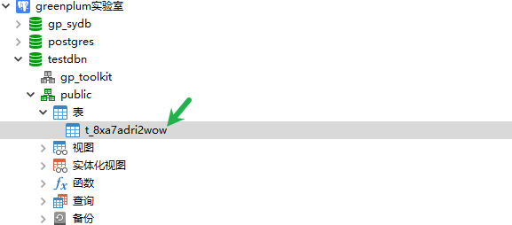
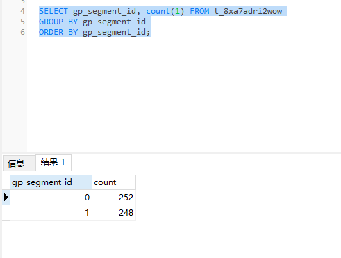
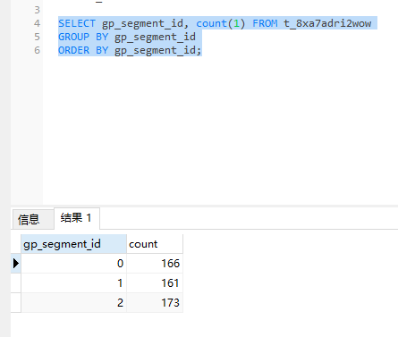

# 实验室-研究扩容

## 原理

扩容分为横向扩容，和纵向扩容。

**横向扩容为：**增加segment节点也就是物理主机节点，随着增加了物理主机节点segment同时也会生成segment实例，如果不进行设置默认是与原始集群保持一致的。

**纵向扩容为：**所谓纵向扩容即为增加segment实例，而不是新增机器。

当原始集群的内存和磁盘充足时可以考虑先进行纵向扩容，来进行扩容结果的验证，多为查询等。

## 实验环境

与GreenPlum实验环境保持一致，在此基础上进行扩容。

## 实验计划

需要先行进行纵向扩容，得出有效的扩容方法以及方案，然后再进行横向扩容，得出有效的扩容方法以及方案。

## 实验1-纵向segment instance扩容开始

### 确认环境情况

```powershell
[gpadmin@gpserver1 home]$ gpstate
20240530:09:59:17:009096 gpstate:gpserver1:gpadmin-[INFO]:-Starting gpstate with args: 
20240530:09:59:17:009096 gpstate:gpserver1:gpadmin-[INFO]:-local Greenplum Version: 'postgres (Greenplum Database) 6.13.0 build commit:4f1adf8e247a9685c19ea02bcaddfdc200937ecd Open Source'
20240530:09:59:17:009096 gpstate:gpserver1:gpadmin-[INFO]:-master Greenplum Version: 'PostgreSQL 9.4.24 (Greenplum Database 6.13.0 build commit:4f1adf8e247a9685c19ea02bcaddfdc200937ecd Open Source) on x86_64-unknown-linux-gnu, compiled by gcc (GCC) 6.4.0, 64-bit compiled on Dec 18 2020 22:31:16'
20240530:09:59:17:009096 gpstate:gpserver1:gpadmin-[INFO]:-Obtaining Segment details from master...
20240530:09:59:17:009096 gpstate:gpserver1:gpadmin-[INFO]:-Gathering data from segments...
..
20240530:09:59:20:009096 gpstate:gpserver1:gpadmin-[INFO]:-Greenplum instance status summary
20240530:09:59:20:009096 gpstate:gpserver1:gpadmin-[INFO]:-----------------------------------------------------
20240530:09:59:20:009096 gpstate:gpserver1:gpadmin-[INFO]:-   Master instance                                = Active
20240530:09:59:20:009096 gpstate:gpserver1:gpadmin-[INFO]:-   Master standby                                 = No master standby configured
20240530:09:59:20:009096 gpstate:gpserver1:gpadmin-[INFO]:-   Total segment instance count from metadata     = 2
20240530:09:59:20:009096 gpstate:gpserver1:gpadmin-[INFO]:-----------------------------------------------------
20240530:09:59:20:009096 gpstate:gpserver1:gpadmin-[INFO]:-   Primary Segment Status
20240530:09:59:20:009096 gpstate:gpserver1:gpadmin-[INFO]:-----------------------------------------------------
20240530:09:59:20:009096 gpstate:gpserver1:gpadmin-[INFO]:-   Total primary segments                         = 2
20240530:09:59:20:009096 gpstate:gpserver1:gpadmin-[INFO]:-   Total primary segment valid (at master)        = 2
20240530:09:59:20:009096 gpstate:gpserver1:gpadmin-[INFO]:-   Total primary segment failures (at master)     = 0
20240530:09:59:20:009096 gpstate:gpserver1:gpadmin-[INFO]:-   Total number of postmaster.pid files missing   = 0
20240530:09:59:20:009096 gpstate:gpserver1:gpadmin-[INFO]:-   Total number of postmaster.pid files found     = 2
20240530:09:59:20:009096 gpstate:gpserver1:gpadmin-[INFO]:-   Total number of postmaster.pid PIDs missing    = 0
20240530:09:59:20:009096 gpstate:gpserver1:gpadmin-[INFO]:-   Total number of postmaster.pid PIDs found      = 2
20240530:09:59:20:009096 gpstate:gpserver1:gpadmin-[INFO]:-   Total number of /tmp lock files missing        = 0
20240530:09:59:20:009096 gpstate:gpserver1:gpadmin-[INFO]:-   Total number of /tmp lock files found          = 2
20240530:09:59:20:009096 gpstate:gpserver1:gpadmin-[INFO]:-   Total number postmaster processes missing      = 0
20240530:09:59:20:009096 gpstate:gpserver1:gpadmin-[INFO]:-   Total number postmaster processes found        = 2
20240530:09:59:20:009096 gpstate:gpserver1:gpadmin-[INFO]:-----------------------------------------------------
20240530:09:59:20:009096 gpstate:gpserver1:gpadmin-[INFO]:-   Mirror Segment Status
20240530:09:59:20:009096 gpstate:gpserver1:gpadmin-[INFO]:-----------------------------------------------------
20240530:09:59:20:009096 gpstate:gpserver1:gpadmin-[INFO]:-   Mirrors not configured on this array
20240530:09:59:20:009096 gpstate:gpserver1:gpadmin-[INFO]:-----------------------------------------------------
[gpadmin@gpserver1 home]$

由此分析gp版本为6.13 ,且pg数据库为9.4版本，mirror未开启镜像，seg主机节点数量1，seg实例数量为2，seg分布为一台seg数据节点对应2个seg实例。
```

### 创建对应目录

这里不创建，采用原有目录

### 进行纵向扩容

首先先找一些数据，这里以可视化建模pri500条测试数据为例




```powershell
[gpadmin@gpserver1 home]$ cd gpadmin/
[gpadmin@gpserver1 ~]$ ls
conf  data  gpAdminLogs  gpconfigs  soft
[gpadmin@gpserver1 ~]$ cd conf/
[gpadmin@gpserver1 conf]$ ls
hostlist  seg_hosts
[gpadmin@gpserver1 conf]$ cat seg_hosts 
gpserver2
[gpadmin@gpserver1 conf]$ gpexpand -f seg_hosts 
20240530:10:11:15:010627 gpexpand:gpserver1:gpadmin-[INFO]:-local Greenplum Version: 'postgres (Greenplum Database) 6.13.0 build commit:4f1adf8e247a9685c19ea02bcaddfdc200937ecd Open Source'
20240530:10:11:15:010627 gpexpand:gpserver1:gpadmin-[INFO]:-master Greenplum Version: 'PostgreSQL 9.4.24 (Greenplum Database 6.13.0 build commit:4f1adf8e247a9685c19ea02bcaddfdc200937ecd Open Source) on x86_64-unknown-linux-gnu, compiled by gcc (GCC) 6.4.0, 64-bit compiled on Dec 18 2020 22:31:16'
20240530:10:11:15:010627 gpexpand:gpserver1:gpadmin-[INFO]:-Querying gpexpand schema for current expansion state

System Expansion is used to add segments to an existing GPDB array.
gpexpand did not detect a System Expansion that is in progress.

Before initiating a System Expansion, you need to provision and burn-in
the new hardware.  Please be sure to run gpcheckperf to make sure the
new hardware is working properly.

Please refer to the Admin Guide for more information.

Would you like to initiate a new System Expansion Yy|Nn (default=N):
> y

** No hostnames were given that do not already exist in the **
** array. Additional segments will be added existing hosts. **

    By default, new hosts are configured with the same number of primary
    segments as existing hosts.  Optionally, you can increase the number
    of segments per host.

    For example, if existing hosts have two primary segments, entering a value
    of 2 will initialize two additional segments on existing hosts, and four
    segments on new hosts.  In addition, mirror segments will be added for
    these new primary segments if mirroring is enabled.
    

How many new primary segments per host do you want to add? (default=0):
> 1
Enter new primary data directory 1:
> /home/gpadmin/data

Generating configuration file...

20240530:10:15:57:010627 gpexpand:gpserver1:gpadmin-[INFO]:-Generating input file...

Input configuration file was written to 'gpexpand_inputfile_20240530_101557'.

Please review the file and make sure that it is correct then re-run
with: gpexpand -i gpexpand_inputfile_20240530_101557
                
20240530:10:15:57:010627 gpexpand:gpserver1:gpadmin-[INFO]:-Exiting...
[gpadmin@gpserver1 conf]$ ls
gpexpand_inputfile_20240530_101557  hostlist  seg_hosts
[gpadmin@gpserver1 conf]$ cat gpexpand_inputfile_20240530_101557 
gpserver2|gpserver2|6002|/home/gpadmin/data/gpseg2|4|2|p
[gpadmin@gpserver1 conf]$


[gpadmin@gpserver1 conf]$ gpexpand -i gpexpand_inputfile_20240530_101557 
20240530:10:31:41:010894 gpexpand:gpserver1:gpadmin-[INFO]:-local Greenplum Version: 'postgres (Greenplum Database) 6.13.0 build commit:4f1adf8e247a9685c19ea02bcaddfdc200937ecd Open Source'
20240530:10:31:41:010894 gpexpand:gpserver1:gpadmin-[INFO]:-master Greenplum Version: 'PostgreSQL 9.4.24 (Greenplum Database 6.13.0 build commit:4f1adf8e247a9685c19ea02bcaddfdc200937ecd Open Source) on x86_64-unknown-linux-gnu, compiled by gcc (GCC) 6.4.0, 64-bit compiled on Dec 18 2020 22:31:16'
20240530:10:31:41:010894 gpexpand:gpserver1:gpadmin-[INFO]:-Querying gpexpand schema for current expansion state
20240530:10:31:42:010894 gpexpand:gpserver1:gpadmin-[INFO]:-Heap checksum setting consistent across cluster
20240530:10:31:42:010894 gpexpand:gpserver1:gpadmin-[INFO]:-Syncing Greenplum Database extensions
20240530:10:31:43:010894 gpexpand:gpserver1:gpadmin-[INFO]:-The packages on gpserver2 are consistent.
20240530:10:31:43:010894 gpexpand:gpserver1:gpadmin-[INFO]:-Locking catalog
20240530:10:31:43:010894 gpexpand:gpserver1:gpadmin-[INFO]:-Locked catalog
20240530:10:31:43:010894 gpexpand:gpserver1:gpadmin-[INFO]:-Creating segment template
20240530:10:31:47:010894 gpexpand:gpserver1:gpadmin-[INFO]:-Copying postgresql.conf from existing segment into template
20240530:10:31:47:010894 gpexpand:gpserver1:gpadmin-[INFO]:-Copying pg_hba.conf from existing segment into template
20240530:10:31:48:010894 gpexpand:gpserver1:gpadmin-[INFO]:-Creating schema tar file
20240530:10:31:49:010894 gpexpand:gpserver1:gpadmin-[INFO]:-Distributing template tar file to new hosts
20240530:10:31:53:010894 gpexpand:gpserver1:gpadmin-[INFO]:-Configuring new segments (primary)
20240530:10:31:53:010894 gpexpand:gpserver1:gpadmin-[INFO]:-{'gpserver2': '/home/gpadmin/data/gpseg2:6002:true:false:4:2::-1:'}
20240530:10:32:01:010894 gpexpand:gpserver1:gpadmin-[ERROR]:-gpexpand failed: ExecutionError: 'Error Executing Command: ' occurred.  Details: 'ssh -o StrictHostKeyChecking=no -o ServerAliveInterval=60 gpserver2 ". /usr/local/greenplum-db/greenplum_path.sh; env GPSESSID=0000000000 GPERA=None $GPHOME/bin/pg_ctl -D /home/gpadmin/data/gpseg2 -l /home/gpadmin/data/gpseg2/pg_log/startup.log -w -t 600 -o \" -p 6002 -c gp_role=utility -M \" start 2>&1"'  cmd had rc=1 completed=True halted=False
  stdout='waiting for server to start.... stopped waiting
pg_ctl: could not start server
Examine the log output.
'
  stderr='' 

Exiting...
20240530:10:32:01:010894 gpexpand:gpserver1:gpadmin-[ERROR]:-Please run 'gpexpand -r' to rollback to the original state.
20240530:10:32:01:010894 gpexpand:gpserver1:gpadmin-[INFO]:-Shutting down gpexpand...
[gpadmin@gpserver1 conf]$

报错了！

[gpadmin@gpserver1 conf]$ rm gpexpand_inputfile_20240530_101557 
[gpadmin@gpserver1 conf]$ rm gpexpand_schema.tar 
[gpadmin@gpserver1 conf]$ 

[gpadmin@gpserver1 conf]$ gpexpand -r
20240530:10:44:09:011426 gpexpand:gpserver1:gpadmin-[INFO]:-local Greenplum Version: 'postgres (Greenplum Database) 6.13.0 build commit:4f1adf8e247a9685c19ea02bcaddfdc200937ecd Open Source'
20240530:10:44:09:011426 gpexpand:gpserver1:gpadmin-[INFO]:-master Greenplum Version: 'PostgreSQL 9.4.24 (Greenplum Database 6.13.0 build commit:4f1adf8e247a9685c19ea02bcaddfdc200937ecd Open Source) on x86_64-unknown-linux-gnu, compiled by gcc (GCC) 6.4.0, 64-bit compiled on Dec 18 2020 22:31:16'
20240530:10:44:09:011426 gpexpand:gpserver1:gpadmin-[INFO]:-Rolling back building of new segments
20240530:10:44:09:011426 gpexpand:gpserver1:gpadmin-[ERROR]:-Input file /home/gpadmin/conf/gpexpand_inputfile_20240530_101557 not found
[gpadmin@gpserver1 conf]$

[gpadmin@gpserver1 conf]$ touch /home/gpadmin/conf/gpexpand_inputfile_20240530_101557
[gpadmin@gpserver1 conf]$ vim gpexpand_inputfile_20240530_101557 
[gpadmin@gpserver1 conf]$ cat gpexpand_inputfile_20240530_101557 
gpserver2|gpserver2|6002|/home/gpadmin/data/gpseg2|4|2|p
[gpadmin@gpserver1 conf]$ gpexpand -r
20240530:10:45:17:011441 gpexpand:gpserver1:gpadmin-[INFO]:-local Greenplum Version: 'postgres (Greenplum Database) 6.13.0 build commit:4f1adf8e247a9685c19ea02bcaddfdc200937ecd Open Source'
20240530:10:45:17:011441 gpexpand:gpserver1:gpadmin-[INFO]:-master Greenplum Version: 'PostgreSQL 9.4.24 (Greenplum Database 6.13.0 build commit:4f1adf8e247a9685c19ea02bcaddfdc200937ecd Open Source) on x86_64-unknown-linux-gnu, compiled by gcc (GCC) 6.4.0, 64-bit compiled on Dec 18 2020 22:31:16'
20240530:10:45:17:011441 gpexpand:gpserver1:gpadmin-[INFO]:-Rolling back building of new segments
20240530:10:45:17:011441 gpexpand:gpserver1:gpadmin-[INFO]:-Rolling back segment template build
20240530:10:45:17:011441 gpexpand:gpserver1:gpadmin-[INFO]:-Rollback complete.
[gpadmin@gpserver1 conf]$ 

[gpadmin@gpserver1 conf]$ rm gpexpand_inputfile_20240530_101557

重新来过 需要设置正确的路径
[gpadmin@gpserver1 conf]$ gpexpand -f seg_hosts 
20240530:10:45:53:011464 gpexpand:gpserver1:gpadmin-[INFO]:-local Greenplum Version: 'postgres (Greenplum Database) 6.13.0 build commit:4f1adf8e247a9685c19ea02bcaddfdc200937ecd Open Source'
20240530:10:45:53:011464 gpexpand:gpserver1:gpadmin-[INFO]:-master Greenplum Version: 'PostgreSQL 9.4.24 (Greenplum Database 6.13.0 build commit:4f1adf8e247a9685c19ea02bcaddfdc200937ecd Open Source) on x86_64-unknown-linux-gnu, compiled by gcc (GCC) 6.4.0, 64-bit compiled on Dec 18 2020 22:31:16'
20240530:10:45:53:011464 gpexpand:gpserver1:gpadmin-[INFO]:-Querying gpexpand schema for current expansion state

System Expansion is used to add segments to an existing GPDB array.
gpexpand did not detect a System Expansion that is in progress.

Before initiating a System Expansion, you need to provision and burn-in
the new hardware.  Please be sure to run gpcheckperf to make sure the
new hardware is working properly.

Please refer to the Admin Guide for more information.

Would you like to initiate a new System Expansion Yy|Nn (default=N):
> y

** No hostnames were given that do not already exist in the **
** array. Additional segments will be added existing hosts. **

    By default, new hosts are configured with the same number of primary
    segments as existing hosts.  Optionally, you can increase the number
    of segments per host.

    For example, if existing hosts have two primary segments, entering a value
    of 2 will initialize two additional segments on existing hosts, and four
    segments on new hosts.  In addition, mirror segments will be added for
    these new primary segments if mirroring is enabled.
    

How many new primary segments per host do you want to add? (default=0):
> 2
Enter new primary data directory 1:
> /home/gpadmin/data/primary
Enter new primary data directory 2:
> /home/gpadmin/data/primary

Generating configuration file...

20240530:10:46:47:011464 gpexpand:gpserver1:gpadmin-[INFO]:-Generating input file...

Input configuration file was written to 'gpexpand_inputfile_20240530_104647'.

Please review the file and make sure that it is correct then re-run
with: gpexpand -i gpexpand_inputfile_20240530_104647
                
20240530:10:46:47:011464 gpexpand:gpserver1:gpadmin-[INFO]:-Exiting...
[gpadmin@gpserver1 conf]$

[gpadmin@gpserver1 conf]$ cat gpexpand_inputfile_20240530_104647 
gpserver2|gpserver2|6002|/home/gpadmin/data/primary/gpseg2|4|2|p
gpserver2|gpserver2|6003|/home/gpadmin/data/primary/gpseg3|5|3|p
[gpadmin@gpserver1 conf]$

[gpadmin@gpserver1 conf]$ gpexpand -i gpexpand_inputfile_20240530_104647 
20240530:10:51:34:011483 gpexpand:gpserver1:gpadmin-[INFO]:-local Greenplum Version: 'postgres (Greenplum Database) 6.13.0 build commit:4f1adf8e247a9685c19ea02bcaddfdc200937ecd Open Source'
20240530:10:51:34:011483 gpexpand:gpserver1:gpadmin-[INFO]:-master Greenplum Version: 'PostgreSQL 9.4.24 (Greenplum Database 6.13.0 build commit:4f1adf8e247a9685c19ea02bcaddfdc200937ecd Open Source) on x86_64-unknown-linux-gnu, compiled by gcc (GCC) 6.4.0, 64-bit compiled on Dec 18 2020 22:31:16'
20240530:10:51:34:011483 gpexpand:gpserver1:gpadmin-[INFO]:-Querying gpexpand schema for current expansion state
20240530:10:51:34:011483 gpexpand:gpserver1:gpadmin-[INFO]:-Heap checksum setting consistent across cluster
20240530:10:51:34:011483 gpexpand:gpserver1:gpadmin-[INFO]:-Syncing Greenplum Database extensions
20240530:10:51:35:011483 gpexpand:gpserver1:gpadmin-[INFO]:-The packages on gpserver2 are consistent.
20240530:10:51:35:011483 gpexpand:gpserver1:gpadmin-[INFO]:-Locking catalog
20240530:10:51:35:011483 gpexpand:gpserver1:gpadmin-[INFO]:-Locked catalog
20240530:10:51:35:011483 gpexpand:gpserver1:gpadmin-[INFO]:-Creating segment template
20240530:10:51:36:011483 gpexpand:gpserver1:gpadmin-[INFO]:-Copying postgresql.conf from existing segment into template
20240530:10:51:36:011483 gpexpand:gpserver1:gpadmin-[INFO]:-Copying pg_hba.conf from existing segment into template
20240530:10:51:37:011483 gpexpand:gpserver1:gpadmin-[INFO]:-Creating schema tar file
20240530:10:51:39:011483 gpexpand:gpserver1:gpadmin-[INFO]:-Distributing template tar file to new hosts
20240530:10:51:41:011483 gpexpand:gpserver1:gpadmin-[INFO]:-Configuring new segments (primary)
20240530:10:51:41:011483 gpexpand:gpserver1:gpadmin-[INFO]:-{'gpserver2': '/home/gpadmin/data/primary/gpseg2:6002:true:false:4:2::-1:,/home/gpadmin/data/primary/gpseg3:6003:true:false:5:3::-1:'}
20240530:10:51:46:011483 gpexpand:gpserver1:gpadmin-[ERROR]:-gpexpand failed: ExecutionError: 'Error Executing Command: ' occurred.  Details: 'ssh -o StrictHostKeyChecking=no -o ServerAliveInterval=60 gpserver2 ". /usr/local/greenplum-db/greenplum_path.sh; env GPSESSID=0000000000 GPERA=None $GPHOME/bin/pg_ctl -D /home/gpadmin/data/primary/gpseg3 -l /home/gpadmin/data/primary/gpseg3/pg_log/startup.log -w -t 600 -o \" -p 6003 -c gp_role=utility -M \" start 2>&1"'  cmd had rc=1 completed=True halted=False
  stdout='waiting for server to start.... stopped waiting
pg_ctl: could not start server
Examine the log output.
'
  stderr='' 

Exiting...
20240530:10:51:46:011483 gpexpand:gpserver1:gpadmin-[ERROR]:-Please run 'gpexpand -r' to rollback to the original state.
20240530:10:51:46:011483 gpexpand:gpserver1:gpadmin-[INFO]:-Shutting down gpexpand...
[gpadmin@gpserver1 conf]$

依然报错 疑似不能使用源路径

[gpadmin@gpserver1 conf]$ gpexpand -r
20240530:10:52:45:011570 gpexpand:gpserver1:gpadmin-[INFO]:-local Greenplum Version: 'postgres (Greenplum Database) 6.13.0 build commit:4f1adf8e247a9685c19ea02bcaddfdc200937ecd Open Source'
20240530:10:52:45:011570 gpexpand:gpserver1:gpadmin-[INFO]:-master Greenplum Version: 'PostgreSQL 9.4.24 (Greenplum Database 6.13.0 build commit:4f1adf8e247a9685c19ea02bcaddfdc200937ecd Open Source) on x86_64-unknown-linux-gnu, compiled by gcc (GCC) 6.4.0, 64-bit compiled on Dec 18 2020 22:31:16'
20240530:10:52:45:011570 gpexpand:gpserver1:gpadmin-[INFO]:-Rolling back building of new segments
20240530:10:52:45:011570 gpexpand:gpserver1:gpadmin-[INFO]:-Rolling back segment template build
20240530:10:52:46:011570 gpexpand:gpserver1:gpadmin-[INFO]:-Rollback complete.
[gpadmin@gpserver1 conf]$

[gpadmin@gpserver1 conf]$ rm gpexpand_inputfile_20240530_104647 

新建文件夹尝试
[gpadmin@gpserver1 conf]$ gpssh -f seg_hosts 
=> ls
[gpserver2] data  gpAdminLogs  soft
=> mkdir data2
[gpserver2]
=> exit

[gpadmin@gpserver1 conf]$ gpssh -f seg_hosts 
=> cd data2
[gpserver2]
=> mkdir primary
[gpserver2]
=> mkdir mirror
[gpserver2]
=> ls
[gpserver2] mirror      primary
=> pwd
[gpserver2] /home/gpadmin/data2
=> exit

[gpadmin@gpserver1 conf]$ gpexpand -f seg_hosts 
20240530:10:56:36:011729 gpexpand:gpserver1:gpadmin-[INFO]:-local Greenplum Version: 'postgres (Greenplum Database) 6.13.0 build commit:4f1adf8e247a9685c19ea02bcaddfdc200937ecd Open Source'
20240530:10:56:36:011729 gpexpand:gpserver1:gpadmin-[INFO]:-master Greenplum Version: 'PostgreSQL 9.4.24 (Greenplum Database 6.13.0 build commit:4f1adf8e247a9685c19ea02bcaddfdc200937ecd Open Source) on x86_64-unknown-linux-gnu, compiled by gcc (GCC) 6.4.0, 64-bit compiled on Dec 18 2020 22:31:16'
20240530:10:56:36:011729 gpexpand:gpserver1:gpadmin-[INFO]:-Querying gpexpand schema for current expansion state

System Expansion is used to add segments to an existing GPDB array.
gpexpand did not detect a System Expansion that is in progress.

Before initiating a System Expansion, you need to provision and burn-in
the new hardware.  Please be sure to run gpcheckperf to make sure the
new hardware is working properly.

Please refer to the Admin Guide for more information.

Would you like to initiate a new System Expansion Yy|Nn (default=N):
> y

** No hostnames were given that do not already exist in the **
** array. Additional segments will be added existing hosts. **

    By default, new hosts are configured with the same number of primary
    segments as existing hosts.  Optionally, you can increase the number
    of segments per host.

    For example, if existing hosts have two primary segments, entering a value
    of 2 will initialize two additional segments on existing hosts, and four
    segments on new hosts.  In addition, mirror segments will be added for
    these new primary segments if mirroring is enabled.
    

How many new primary segments per host do you want to add? (default=0):
> 2
Enter new primary data directory 1:
> /home/gpadmin/data2
Enter new primary data directory 2:
> /home/gpadmin/data2

Generating configuration file...

20240530:10:56:56:011729 gpexpand:gpserver1:gpadmin-[INFO]:-Generating input file...

Input configuration file was written to 'gpexpand_inputfile_20240530_105656'.

Please review the file and make sure that it is correct then re-run
with: gpexpand -i gpexpand_inputfile_20240530_105656
                
20240530:10:56:56:011729 gpexpand:gpserver1:gpadmin-[INFO]:-Exiting...
[gpadmin@gpserver1 conf]$ cat gpexpand_inputfile_20240530_105656 
gpserver2|gpserver2|6002|/home/gpadmin/data2/gpseg2|4|2|p
gpserver2|gpserver2|6003|/home/gpadmin/data2/gpseg3|5|3|p
[gpadmin@gpserver1 conf]$ 

[gpadmin@gpserver1 conf]$ gpexpand -i gpexpand_inputfile_20240530_105656 
20240530:10:57:23:011744 gpexpand:gpserver1:gpadmin-[INFO]:-local Greenplum Version: 'postgres (Greenplum Database) 6.13.0 build commit:4f1adf8e247a9685c19ea02bcaddfdc200937ecd Open Source'
20240530:10:57:23:011744 gpexpand:gpserver1:gpadmin-[INFO]:-master Greenplum Version: 'PostgreSQL 9.4.24 (Greenplum Database 6.13.0 build commit:4f1adf8e247a9685c19ea02bcaddfdc200937ecd Open Source) on x86_64-unknown-linux-gnu, compiled by gcc (GCC) 6.4.0, 64-bit compiled on Dec 18 2020 22:31:16'
20240530:10:57:23:011744 gpexpand:gpserver1:gpadmin-[INFO]:-Querying gpexpand schema for current expansion state
20240530:10:57:23:011744 gpexpand:gpserver1:gpadmin-[INFO]:-Heap checksum setting consistent across cluster
20240530:10:57:23:011744 gpexpand:gpserver1:gpadmin-[INFO]:-Syncing Greenplum Database extensions
20240530:10:57:24:011744 gpexpand:gpserver1:gpadmin-[INFO]:-The packages on gpserver2 are consistent.
20240530:10:57:24:011744 gpexpand:gpserver1:gpadmin-[INFO]:-Locking catalog
20240530:10:57:24:011744 gpexpand:gpserver1:gpadmin-[INFO]:-Locked catalog
20240530:10:57:24:011744 gpexpand:gpserver1:gpadmin-[INFO]:-Creating segment template
20240530:10:57:25:011744 gpexpand:gpserver1:gpadmin-[INFO]:-Copying postgresql.conf from existing segment into template
20240530:10:57:25:011744 gpexpand:gpserver1:gpadmin-[INFO]:-Copying pg_hba.conf from existing segment into template
20240530:10:57:26:011744 gpexpand:gpserver1:gpadmin-[INFO]:-Creating schema tar file
20240530:10:57:27:011744 gpexpand:gpserver1:gpadmin-[INFO]:-Distributing template tar file to new hosts
20240530:10:57:29:011744 gpexpand:gpserver1:gpadmin-[INFO]:-Configuring new segments (primary)
20240530:10:57:29:011744 gpexpand:gpserver1:gpadmin-[INFO]:-{'gpserver2': '/home/gpadmin/data2/gpseg2:6002:true:false:4:2::-1:,/home/gpadmin/data2/gpseg3:6003:true:false:5:3::-1:'}
20240530:10:57:32:011744 gpexpand:gpserver1:gpadmin-[ERROR]:-gpexpand failed: ExecutionError: 'Error Executing Command: ' occurred.  Details: 'ssh -o StrictHostKeyChecking=no -o ServerAliveInterval=60 gpserver2 ". /usr/local/greenplum-db/greenplum_path.sh; env GPSESSID=0000000000 GPERA=None $GPHOME/bin/pg_ctl -D /home/gpadmin/data2/gpseg3 -l /home/gpadmin/data2/gpseg3/pg_log/startup.log -w -t 600 -o \" -p 6003 -c gp_role=utility -M \" start 2>&1"'  cmd had rc=1 completed=True halted=False
  stdout='waiting for server to start.... stopped waiting
pg_ctl: could not start server
Examine the log output.
'
  stderr='' 

Exiting...
20240530:10:57:32:011744 gpexpand:gpserver1:gpadmin-[ERROR]:-Please run 'gpexpand -r' to rollback to the original state.
20240530:10:57:32:011744 gpexpand:gpserver1:gpadmin-[INFO]:-Shutting down gpexpand...
[gpadmin@gpserver1 conf]$ gpexpand -r
20240530:10:57:55:011831 gpexpand:gpserver1:gpadmin-[INFO]:-local Greenplum Version: 'postgres (Greenplum Database) 6.13.0 build commit:4f1adf8e247a9685c19ea02bcaddfdc200937ecd Open Source'
20240530:10:57:55:011831 gpexpand:gpserver1:gpadmin-[INFO]:-master Greenplum Version: 'PostgreSQL 9.4.24 (Greenplum Database 6.13.0 build commit:4f1adf8e247a9685c19ea02bcaddfdc200937ecd Open Source) on x86_64-unknown-linux-gnu, compiled by gcc (GCC) 6.4.0, 64-bit compiled on Dec 18 2020 22:31:16'
20240530:10:57:55:011831 gpexpand:gpserver1:gpadmin-[INFO]:-Rolling back building of new segments
20240530:10:57:56:011831 gpexpand:gpserver1:gpadmin-[INFO]:-Rolling back segment template build
20240530:10:57:56:011831 gpexpand:gpserver1:gpadmin-[INFO]:-Rollback complete.
[gpadmin@gpserver1 conf]$ rm gpexpand_inputfile_20240530_105656 
[gpadmin@gpserver1 conf]$ ls
hostlist  seg_hosts
[gpadmin@gpserver1 conf]$ 

依然报错！！

有可能是差权限？
貌似不是，手动修改一下文件

看下详细日志
2024-05-30 11:10:11.987344 CST,,,p13381,th-657790848,,,,0,,,seg2,,,,,"LOG","00000","registering background worker ""sweeper process""",,,,,,,,"RegisterBackgroundWorker","bgworker.c",774,
2024-05-30 11:10:12.168551 CST,,,p13381,th-657790848,,,,0,,,seg2,,,,,"FATAL","XX000","could not create semaphores: No space left on device","Failed system call was semget(6002001, 17, 03600).","This error does *not* mean that you have run out of disk space.  It occurs when either the system limit for the maximum number of semaphore sets (SEMMNI), or the system wide maximum number of semaphores (SEMMNS), would be exceeded.  You need to raise the respective kernel parameter.  Alternatively, reduce PostgreSQL's consumption of semaphores by reducing its max_connections parameter.
The PostgreSQL documentation contains more information about configuring your system for PostgreSQL.",,,,,,"InternalIpcSemaphoreCreate","pg_sema.c",126,1    0xbf0dac postgres errstart (elog.c:557)
2    0x9fc6c8 postgres PGSemaphoreCreate (pg_sema.c:113)
3    0xa74291 postgres InitProcGlobal (proc.c:259)
4    0xa60005 postgres CreateSharedMemoryAndSemaphores (ipci.c:290)
5    0xa10d6b postgres PostmasterMain (postmaster.c:1337)
6    0x6b5f21 postgres main (main.c:205)
7    0x7f6ed5889555 libc.so.6 __libc_start_main + 0xf5
8    0x6c1c7c postgres <symbol not found> + 0x6c1c7c

[root@gpserver2 pg_log]# ipcs -ls

------ Semaphore Limits --------
max number of arrays = 128
max semaphores per array = 250
max semaphores system wide = 32000
max ops per semop call = 32
semaphore max value = 32767

[root@gpserver2 pg_log]#

[root@gpserver2 pg_log]# vim /etc/sysctl.conf
[root@gpserver2 pg_log]# sudo sysctl -p
kernel.shmall = 232880
kernel.shmmax = 953876480
kernel.shmmni = 4096
vm.overcommit_memory = 2
vm.overcommit_ratio = 95
net.ipv4.ip_local_port_range = 10000 65535
kernel.sysrq = 1
kernel.core_uses_pid = 1
kernel.msgmnb = 65536
kernel.msgmax = 65536
kernel.msgmni = 2048
net.ipv4.tcp_syncookies = 1
net.ipv4.conf.default.accept_source_route = 0
net.ipv4.tcp_max_syn_backlog = 4096
net.ipv4.conf.all.arp_filter = 1
net.core.netdev_max_backlog = 10000
net.core.rmem_max = 2097152
net.core.wmem_max = 2097152
vm.swappiness = 10
vm.zone_reclaim_mode = 0
vm.dirty_expire_centisecs = 500
vm.dirty_writeback_centisecs = 100
vm.dirty_background_ratio = 3
vm.dirty_ratio = 10
kernel.sem = 250 32000 100 128
[root@gpserver2 pg_log]#

[gpadmin@gpserver1 conf]$ gpexpand -r
20240530:11:16:41:012154 gpexpand:gpserver1:gpadmin-[INFO]:-local Greenplum Version: 'postgres (Greenplum Database) 6.13.0 build commit:4f1adf8e247a9685c19ea02bcaddfdc200937ecd Open Source'
20240530:11:16:41:012154 gpexpand:gpserver1:gpadmin-[INFO]:-master Greenplum Version: 'PostgreSQL 9.4.24 (Greenplum Database 6.13.0 build commit:4f1adf8e247a9685c19ea02bcaddfdc200937ecd Open Source) on x86_64-unknown-linux-gnu, compiled by gcc (GCC) 6.4.0, 64-bit compiled on Dec 18 2020 22:31:16'
20240530:11:16:41:012154 gpexpand:gpserver1:gpadmin-[INFO]:-Rolling back building of new segments
20240530:11:16:42:012154 gpexpand:gpserver1:gpadmin-[INFO]:-Rolling back segment template build
20240530:11:16:42:012154 gpexpand:gpserver1:gpadmin-[INFO]:-Rollback complete.
[gpadmin@gpserver1 conf]$ gpexpand -i gpexpand_inputfile_20240530_110501 
20240530:11:16:45:012176 gpexpand:gpserver1:gpadmin-[INFO]:-local Greenplum Version: 'postgres (Greenplum Database) 6.13.0 build commit:4f1adf8e247a9685c19ea02bcaddfdc200937ecd Open Source'
20240530:11:16:45:012176 gpexpand:gpserver1:gpadmin-[INFO]:-master Greenplum Version: 'PostgreSQL 9.4.24 (Greenplum Database 6.13.0 build commit:4f1adf8e247a9685c19ea02bcaddfdc200937ecd Open Source) on x86_64-unknown-linux-gnu, compiled by gcc (GCC) 6.4.0, 64-bit compiled on Dec 18 2020 22:31:16'
20240530:11:16:45:012176 gpexpand:gpserver1:gpadmin-[INFO]:-Querying gpexpand schema for current expansion state
20240530:11:16:45:012176 gpexpand:gpserver1:gpadmin-[INFO]:-Heap checksum setting consistent across cluster
20240530:11:16:45:012176 gpexpand:gpserver1:gpadmin-[INFO]:-Syncing Greenplum Database extensions
20240530:11:16:46:012176 gpexpand:gpserver1:gpadmin-[INFO]:-The packages on gpserver2 are consistent.
20240530:11:16:46:012176 gpexpand:gpserver1:gpadmin-[INFO]:-Locking catalog
20240530:11:16:46:012176 gpexpand:gpserver1:gpadmin-[INFO]:-Locked catalog
20240530:11:16:46:012176 gpexpand:gpserver1:gpadmin-[INFO]:-Creating segment template
20240530:11:16:47:012176 gpexpand:gpserver1:gpadmin-[INFO]:-Copying postgresql.conf from existing segment into template
20240530:11:16:47:012176 gpexpand:gpserver1:gpadmin-[INFO]:-Copying pg_hba.conf from existing segment into template
20240530:11:16:48:012176 gpexpand:gpserver1:gpadmin-[INFO]:-Creating schema tar file
20240530:11:16:48:012176 gpexpand:gpserver1:gpadmin-[INFO]:-Distributing template tar file to new hosts
20240530:11:16:51:012176 gpexpand:gpserver1:gpadmin-[INFO]:-Configuring new segments (primary)
20240530:11:16:51:012176 gpexpand:gpserver1:gpadmin-[INFO]:-{'gpserver2': '/home/gpadmin/data2/primary/gpseg2:6002:true:false:4:2::-1:,/home/gpadmin/data2/primary/gpseg3:6003:true:false:5:3::-1:'}
20240530:11:16:54:012176 gpexpand:gpserver1:gpadmin-[ERROR]:-gpexpand failed: ExecutionError: 'Error Executing Command: ' occurred.  Details: 'ssh -o StrictHostKeyChecking=no -o ServerAliveInterval=60 gpserver2 ". /usr/local/greenplum-db/greenplum_path.sh; env GPSESSID=0000000000 GPERA=None $GPHOME/bin/pg_ctl -D /home/gpadmin/data2/primary/gpseg3 -l /home/gpadmin/data2/primary/gpseg3/pg_log/startup.log -w -t 600 -o \" -p 6003 -c gp_role=utility -M \" start 2>&1"'  cmd had rc=1 completed=True halted=False
  stdout='waiting for server to start.... stopped waiting
pg_ctl: could not start server
Examine the log output.
'
  stderr='' 

Exiting...
20240530:11:16:54:012176 gpexpand:gpserver1:gpadmin-[ERROR]:-Please run 'gpexpand -r' to rollback to the original state.
20240530:11:16:54:012176 gpexpand:gpserver1:gpadmin-[INFO]:-Shutting down gpexpand...
[gpadmin@gpserver1 conf]$ 

[gpadmin@gpserver1 conf]$ gpexpand -r
20240530:11:20:50:012265 gpexpand:gpserver1:gpadmin-[INFO]:-local Greenplum Version: 'postgres (Greenplum Database) 6.13.0 build commit:4f1adf8e247a9685c19ea02bcaddfdc200937ecd Open Source'
20240530:11:20:50:012265 gpexpand:gpserver1:gpadmin-[INFO]:-master Greenplum Version: 'PostgreSQL 9.4.24 (Greenplum Database 6.13.0 build commit:4f1adf8e247a9685c19ea02bcaddfdc200937ecd Open Source) on x86_64-unknown-linux-gnu, compiled by gcc (GCC) 6.4.0, 64-bit compiled on Dec 18 2020 22:31:16'
20240530:11:20:50:012265 gpexpand:gpserver1:gpadmin-[INFO]:-Rolling back building of new segments
20240530:11:20:51:012265 gpexpand:gpserver1:gpadmin-[INFO]:-Rolling back segment template build
20240530:11:20:51:012265 gpexpand:gpserver1:gpadmin-[INFO]:-Rollback complete.
[gpadmin@gpserver1 conf]$ ls
gpexpand_inputfile_20240530_110501  hostlist  seg_hosts
[gpadmin@gpserver1 conf]$ rm gpexpand_inputfile_20240530_110501 
[gpadmin@gpserver1 conf]$ gpexpand -f seg_hosts 
20240530:11:21:07:012289 gpexpand:gpserver1:gpadmin-[INFO]:-local Greenplum Version: 'postgres (Greenplum Database) 6.13.0 build commit:4f1adf8e247a9685c19ea02bcaddfdc200937ecd Open Source'
20240530:11:21:07:012289 gpexpand:gpserver1:gpadmin-[INFO]:-master Greenplum Version: 'PostgreSQL 9.4.24 (Greenplum Database 6.13.0 build commit:4f1adf8e247a9685c19ea02bcaddfdc200937ecd Open Source) on x86_64-unknown-linux-gnu, compiled by gcc (GCC) 6.4.0, 64-bit compiled on Dec 18 2020 22:31:16'
20240530:11:21:07:012289 gpexpand:gpserver1:gpadmin-[INFO]:-Querying gpexpand schema for current expansion state

System Expansion is used to add segments to an existing GPDB array.
gpexpand did not detect a System Expansion that is in progress.

Before initiating a System Expansion, you need to provision and burn-in
the new hardware.  Please be sure to run gpcheckperf to make sure the
new hardware is working properly.

Please refer to the Admin Guide for more information.

Would you like to initiate a new System Expansion Yy|Nn (default=N):
> y

** No hostnames were given that do not already exist in the **
** array. Additional segments will be added existing hosts. **

    By default, new hosts are configured with the same number of primary
    segments as existing hosts.  Optionally, you can increase the number
    of segments per host.

    For example, if existing hosts have two primary segments, entering a value
    of 2 will initialize two additional segments on existing hosts, and four
    segments on new hosts.  In addition, mirror segments will be added for
    these new primary segments if mirroring is enabled.
    

How many new primary segments per host do you want to add? (default=0):
> 1
Enter new primary data directory 1:
> /home/gpadmin/data2/primary

Generating configuration file...

20240530:11:21:38:012289 gpexpand:gpserver1:gpadmin-[INFO]:-Generating input file...

Input configuration file was written to 'gpexpand_inputfile_20240530_112138'.

Please review the file and make sure that it is correct then re-run
with: gpexpand -i gpexpand_inputfile_20240530_112138
                
20240530:11:21:38:012289 gpexpand:gpserver1:gpadmin-[INFO]:-Exiting...
[gpadmin@gpserver1 conf]$ cat gpexpand_inputfile_20240530_112138 
gpserver2|gpserver2|6002|/home/gpadmin/data2/primary/gpseg2|4|2|p
[gpadmin@gpserver1 conf]$ 

[root@gpserver2 pg_log]# vim /etc/sysctl.conf 
[root@gpserver2 pg_log]# sysctl -p
kernel.shmall = 232880
kernel.shmmax = 953876480
kernel.shmmni = 4096
vm.overcommit_memory = 2
vm.overcommit_ratio = 95
net.ipv4.ip_local_port_range = 10000 65535
kernel.sysrq = 1
kernel.core_uses_pid = 1
kernel.msgmnb = 65536
kernel.msgmax = 65536
kernel.msgmni = 2048
net.ipv4.tcp_syncookies = 1
net.ipv4.conf.default.accept_source_route = 0
net.ipv4.tcp_max_syn_backlog = 4096
net.ipv4.conf.all.arp_filter = 1
net.core.netdev_max_backlog = 10000
net.core.rmem_max = 2097152
net.core.wmem_max = 2097152
vm.swappiness = 10
vm.zone_reclaim_mode = 0
vm.dirty_expire_centisecs = 500
vm.dirty_writeback_centisecs = 100
vm.dirty_background_ratio = 3
vm.dirty_ratio = 10
kernel.sem = 250 64000 100 256
[root@gpserver2 pg_log]# ipcs -ls

------ Semaphore Limits --------
max number of arrays = 256
max semaphores per array = 250
max semaphores system wide = 64000
max ops per semop call = 100
semaphore max value = 32767

[root@gpserver2 pg_log]#

[gpadmin@gpserver1 conf]$ gpexpand -r
20240530:11:26:13:012391 gpexpand:gpserver1:gpadmin-[INFO]:-local Greenplum Version: 'postgres (Greenplum Database) 6.13.0 build commit:4f1adf8e247a9685c19ea02bcaddfdc200937ecd Open Source'
20240530:11:26:13:012391 gpexpand:gpserver1:gpadmin-[INFO]:-master Greenplum Version: 'PostgreSQL 9.4.24 (Greenplum Database 6.13.0 build commit:4f1adf8e247a9685c19ea02bcaddfdc200937ecd Open Source) on x86_64-unknown-linux-gnu, compiled by gcc (GCC) 6.4.0, 64-bit compiled on Dec 18 2020 22:31:16'
20240530:11:26:13:012391 gpexpand:gpserver1:gpadmin-[INFO]:-Rolling back building of new segments
20240530:11:26:13:012391 gpexpand:gpserver1:gpadmin-[INFO]:-Rolling back segment template build
20240530:11:26:13:012391 gpexpand:gpserver1:gpadmin-[INFO]:-Rollback complete.
[gpadmin@gpserver1 conf]$ gpexpand -i gpexpand_inputfile_20240530_112138 
20240530:11:26:16:012411 gpexpand:gpserver1:gpadmin-[INFO]:-local Greenplum Version: 'postgres (Greenplum Database) 6.13.0 build commit:4f1adf8e247a9685c19ea02bcaddfdc200937ecd Open Source'
20240530:11:26:16:012411 gpexpand:gpserver1:gpadmin-[INFO]:-master Greenplum Version: 'PostgreSQL 9.4.24 (Greenplum Database 6.13.0 build commit:4f1adf8e247a9685c19ea02bcaddfdc200937ecd Open Source) on x86_64-unknown-linux-gnu, compiled by gcc (GCC) 6.4.0, 64-bit compiled on Dec 18 2020 22:31:16'
20240530:11:26:16:012411 gpexpand:gpserver1:gpadmin-[INFO]:-Querying gpexpand schema for current expansion state
20240530:11:26:16:012411 gpexpand:gpserver1:gpadmin-[INFO]:-Heap checksum setting consistent across cluster
20240530:11:26:16:012411 gpexpand:gpserver1:gpadmin-[INFO]:-Syncing Greenplum Database extensions
20240530:11:26:16:012411 gpexpand:gpserver1:gpadmin-[INFO]:-The packages on gpserver2 are consistent.
20240530:11:26:16:012411 gpexpand:gpserver1:gpadmin-[INFO]:-Locking catalog
20240530:11:26:16:012411 gpexpand:gpserver1:gpadmin-[INFO]:-Locked catalog
20240530:11:26:17:012411 gpexpand:gpserver1:gpadmin-[INFO]:-Creating segment template
20240530:11:26:17:012411 gpexpand:gpserver1:gpadmin-[INFO]:-Copying postgresql.conf from existing segment into template
20240530:11:26:18:012411 gpexpand:gpserver1:gpadmin-[INFO]:-Copying pg_hba.conf from existing segment into template
20240530:11:26:18:012411 gpexpand:gpserver1:gpadmin-[INFO]:-Creating schema tar file
20240530:11:26:18:012411 gpexpand:gpserver1:gpadmin-[INFO]:-Distributing template tar file to new hosts
20240530:11:26:21:012411 gpexpand:gpserver1:gpadmin-[INFO]:-Configuring new segments (primary)
20240530:11:26:21:012411 gpexpand:gpserver1:gpadmin-[INFO]:-{'gpserver2': '/home/gpadmin/data2/primary/gpseg2:6002:true:false:4:2::-1:'}
20240530:11:26:23:012411 gpexpand:gpserver1:gpadmin-[INFO]:-Cleaning up temporary template files
20240530:11:26:24:012411 gpexpand:gpserver1:gpadmin-[INFO]:-Cleaning up databases in new segments.
20240530:11:26:24:012411 gpexpand:gpserver1:gpadmin-[INFO]:-Unlocking catalog
20240530:11:26:24:012411 gpexpand:gpserver1:gpadmin-[INFO]:-Unlocked catalog
20240530:11:26:24:012411 gpexpand:gpserver1:gpadmin-[INFO]:-Creating expansion schema
20240530:11:26:24:012411 gpexpand:gpserver1:gpadmin-[INFO]:-Populating gpexpand.status_detail with data from database template1
20240530:11:26:25:012411 gpexpand:gpserver1:gpadmin-[INFO]:-Populating gpexpand.status_detail with data from database postgres
20240530:11:26:25:012411 gpexpand:gpserver1:gpadmin-[INFO]:-Populating gpexpand.status_detail with data from database gp_sydb
20240530:11:26:25:012411 gpexpand:gpserver1:gpadmin-[INFO]:-Populating gpexpand.status_detail with data from database testdbn
20240530:11:26:25:012411 gpexpand:gpserver1:gpadmin-[INFO]:-************************************************
20240530:11:26:25:012411 gpexpand:gpserver1:gpadmin-[INFO]:-Initialization of the system expansion complete.
20240530:11:26:25:012411 gpexpand:gpserver1:gpadmin-[INFO]:-To begin table expansion onto the new segments
20240530:11:26:25:012411 gpexpand:gpserver1:gpadmin-[INFO]:-rerun gpexpand
20240530:11:26:25:012411 gpexpand:gpserver1:gpadmin-[INFO]:-************************************************
20240530:11:26:25:012411 gpexpand:gpserver1:gpadmin-[INFO]:-Exiting...
[gpadmin@gpserver1 conf]$

竟然是信号不足！！

[gpadmin@gpserver1 conf]$ gpstate
20240530:11:27:30:012526 gpstate:gpserver1:gpadmin-[INFO]:-Starting gpstate with args: 
20240530:11:27:30:012526 gpstate:gpserver1:gpadmin-[INFO]:-local Greenplum Version: 'postgres (Greenplum Database) 6.13.0 build commit:4f1adf8e247a9685c19ea02bcaddfdc200937ecd Open Source'
20240530:11:27:30:012526 gpstate:gpserver1:gpadmin-[INFO]:-master Greenplum Version: 'PostgreSQL 9.4.24 (Greenplum Database 6.13.0 build commit:4f1adf8e247a9685c19ea02bcaddfdc200937ecd Open Source) on x86_64-unknown-linux-gnu, compiled by gcc (GCC) 6.4.0, 64-bit compiled on Dec 18 2020 22:31:16'
20240530:11:27:30:012526 gpstate:gpserver1:gpadmin-[INFO]:-Obtaining Segment details from master...
20240530:11:27:30:012526 gpstate:gpserver1:gpadmin-[INFO]:-Gathering data from segments...
20240530:11:27:31:012526 gpstate:gpserver1:gpadmin-[INFO]:-Greenplum instance status summary
20240530:11:27:31:012526 gpstate:gpserver1:gpadmin-[INFO]:-----------------------------------------------------
20240530:11:27:31:012526 gpstate:gpserver1:gpadmin-[INFO]:-   Master instance                                = Active
20240530:11:27:31:012526 gpstate:gpserver1:gpadmin-[INFO]:-   Master standby                                 = No master standby configured
20240530:11:27:31:012526 gpstate:gpserver1:gpadmin-[INFO]:-   Total segment instance count from metadata     = 3
20240530:11:27:31:012526 gpstate:gpserver1:gpadmin-[INFO]:-----------------------------------------------------
20240530:11:27:31:012526 gpstate:gpserver1:gpadmin-[INFO]:-   Primary Segment Status
20240530:11:27:31:012526 gpstate:gpserver1:gpadmin-[INFO]:-----------------------------------------------------
20240530:11:27:31:012526 gpstate:gpserver1:gpadmin-[INFO]:-   Total primary segments                         = 3
20240530:11:27:31:012526 gpstate:gpserver1:gpadmin-[INFO]:-   Total primary segment valid (at master)        = 3
20240530:11:27:31:012526 gpstate:gpserver1:gpadmin-[INFO]:-   Total primary segment failures (at master)     = 0
20240530:11:27:31:012526 gpstate:gpserver1:gpadmin-[INFO]:-   Total number of postmaster.pid files missing   = 0
20240530:11:27:31:012526 gpstate:gpserver1:gpadmin-[INFO]:-   Total number of postmaster.pid files found     = 3
20240530:11:27:31:012526 gpstate:gpserver1:gpadmin-[INFO]:-   Total number of postmaster.pid PIDs missing    = 0
20240530:11:27:31:012526 gpstate:gpserver1:gpadmin-[INFO]:-   Total number of postmaster.pid PIDs found      = 3
20240530:11:27:31:012526 gpstate:gpserver1:gpadmin-[INFO]:-   Total number of /tmp lock files missing        = 0
20240530:11:27:31:012526 gpstate:gpserver1:gpadmin-[INFO]:-   Total number of /tmp lock files found          = 3
20240530:11:27:31:012526 gpstate:gpserver1:gpadmin-[INFO]:-   Total number postmaster processes missing      = 0
20240530:11:27:31:012526 gpstate:gpserver1:gpadmin-[INFO]:-   Total number postmaster processes found        = 3
20240530:11:27:31:012526 gpstate:gpserver1:gpadmin-[INFO]:-----------------------------------------------------
20240530:11:27:31:012526 gpstate:gpserver1:gpadmin-[INFO]:-   Mirror Segment Status
20240530:11:27:31:012526 gpstate:gpserver1:gpadmin-[INFO]:-----------------------------------------------------
20240530:11:27:31:012526 gpstate:gpserver1:gpadmin-[INFO]:-   Mirrors not configured on this array
20240530:11:27:31:012526 gpstate:gpserver1:gpadmin-[INFO]:-----------------------------------------------------
20240530:11:27:31:012526 gpstate:gpserver1:gpadmin-[INFO]:-   Cluster Expansion                              = In Progress
20240530:11:27:31:012526 gpstate:gpserver1:gpadmin-[INFO]:-----------------------------------------------------
[gpadmin@gpserver1 conf]$ 
```

### 调整数据分布

查看数据分布



调整数据分布

```powershell
[gpadmin@gpserver1 conf]$ gpexpand -d 1:00:00
20240530:11:30:59:012599 gpexpand:gpserver1:gpadmin-[INFO]:-local Greenplum Version: 'postgres (Greenplum Database) 6.13.0 build commit:4f1adf8e247a9685c19ea02bcaddfdc200937ecd Open Source'
20240530:11:30:59:012599 gpexpand:gpserver1:gpadmin-[INFO]:-master Greenplum Version: 'PostgreSQL 9.4.24 (Greenplum Database 6.13.0 build commit:4f1adf8e247a9685c19ea02bcaddfdc200937ecd Open Source) on x86_64-unknown-linux-gnu, compiled by gcc (GCC) 6.4.0, 64-bit compiled on Dec 18 2020 22:31:16'
20240530:11:30:59:012599 gpexpand:gpserver1:gpadmin-[INFO]:-Querying gpexpand schema for current expansion state
20240530:11:31:00:012599 gpexpand:gpserver1:gpadmin-[INFO]:-Expanding testdbn.public.t_8xa7adri2wow
20240530:11:31:00:012599 gpexpand:gpserver1:gpadmin-[INFO]:-Finished expanding testdbn.public.t_8xa7adri2wow
20240530:11:31:05:012599 gpexpand:gpserver1:gpadmin-[INFO]:-EXPANSION COMPLETED SUCCESSFULLY
20240530:11:31:05:012599 gpexpand:gpserver1:gpadmin-[INFO]:-Exiting...
[gpadmin@gpserver1 conf]$

调整完成
```

再次查看数据分布



至此纵向扩容 segment instance 结束

## 实验2-横向segment node扩容开始

### 确认环境情况

